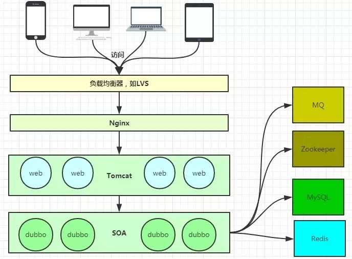
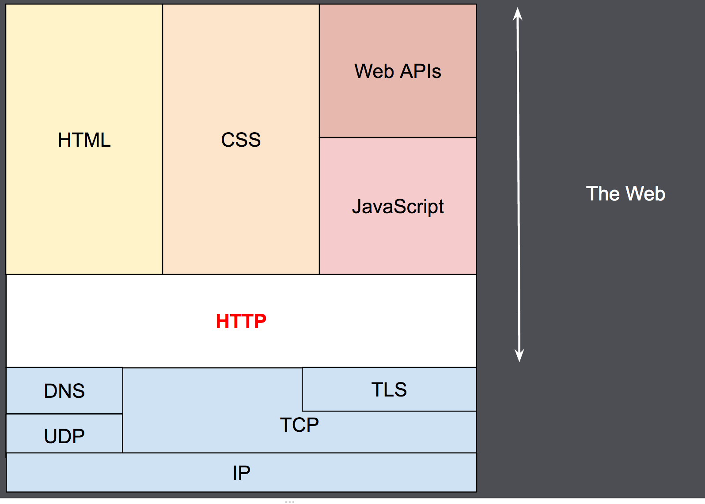
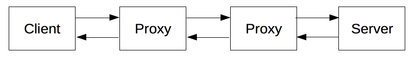

\n

stimulated by https setting

\n\n\n\n

What is Nginx?

\n\n\n\n

nginx [engine x] is an HTTP and reverse proxy server, a mail proxy server, and a generic TCP/UDP proxy server, originally written by [Igor Sysoev](<http://sysoev.ru/en/>). For a long time, it has been running on many heavily loaded Russian sites including [Yandex](<http://www.yandex.ru/>), [Mail.Ru](<http://mail.ru/>), [VK](<http://vk.com/>), and [Rambler](<http://www.rambler.ru/>). According to Netcraft, nginx served or proxied [21.18% busiest sites in May 2023](<https://news.netcraft.com/archives/2023/05/26/may-2023-web-server-survey.html>). Here are some of the success stories: [Dropbox](<https://blogs.dropbox.com/tech/2017/09/optimizing-web-servers-for-high-throughput-and-low-latency/>), [Netflix](<https://openconnect.netflix.com/en/software/>), [Wordpress.com](<https://www.nginx.com/case-studies/nginx-wordpress-com/>), [FastMail.FM](<http://blog.fastmail.fm/2007/01/04/webimappop-frontend-proxies-changed-to-nginx/>).

\n\n\n\n\n\n\n\n\n\n

这是我在官网找到的定义，意思就是：就是个轻型的HTTP server罢了  
所以问题回到一个很呆的位置：

\n\n\n\n

**HTTP server是什么？它是怎么工作的？**

\n\n\n\n

于是我去问了Claude

\n\n\n\n

> \n
> 
> GPT response
> 
> \nHTTP服务器,即Web服务器,是处理HTTP请求和返回HTTP响应的软件。它的主要工作原理如下:  
> 1\. 监听客户端的HTTP请求。当有客户端(通常是浏览器)通过HTTP协议访问服务器,HTTP服务器会监听到客户端的请求。  
> 2\. 解析HTTP请求。服务器会解析客户端发送的HTTP请求,获取请求方法(GET、POST等)、URI、HTTP版本号、请求头等信息。  
> 3\. 根据请求URI定位资源。服务器会根据请求URI找到客户端所请求的资源,如HTML文件、图片、视频等。  
> 4\. 读取资源并生成HTTP响应。服务器会读取资源的内容,并根据资源生成对应的HTTP响应,包括状态码、响应头和响应体等。  
> 5\. 发送HTTP响应。服务器会将生成的HTTP响应发送会客户端,以完成一次HTTP请求和响应。  
> 6\. 管理HTTP会话和连接。HTTP是无状态协议,但服务器可以使用Cookie等方式管理会话和连接,用于实现一些特定的功能,如购物车、登录状态的维持等。  
> 7\. 处理HTTP方法。除常用的GET和POST方法外,HTTP还定义了多种方法,如PUT、DELETE等。服务器需要 able 处理不同的请求方法。  
> 8\. 鉴权和访问控制。服务器可以基于HTTP Basic Auth、Cookie等方式对用户进行认证和授权,控制对资源的访问。  
> 9\. 日志记录。服务器会记录每次HTTP访问的相关信息,用于分析网站访问情况和诊断问题。所以,HTTP服务器主要工作是接收和响应HTTP请求。  
> 它解析请求,根据URI找到资源,生成并发送对应的响应,同时还处理会话、方法、鉴权等工作。HTTP服务器让WEB应用程序可以通过Internet将信息发布出去,为用户提供服务。

\n\n\n\n

然后我turn to the Internet，MDN方面似乎没有http server的相关介绍，但是有对于HTTP的详细解释。既然我在HTTP理解上也不太行，所以顺便做了个学习。

\n\n\n\n

HTTP

\n\n\n\n

**HTTP** 是一种用作获取诸如 HTML 文档这类资源的[协议](<https://developer.mozilla.org/zh-CN/docs/Glossary/Protocol>)。它是 Web 上进行任何数据交换的基础，同时，也是一种客户端—服务器（client-server）协议，也就是说，请求是由接受方——通常是浏览器——发起的。一个完整网页文档是由获取到的不同文档组件——像是文本、布局描述、图片、视频、脚本等——重新构建出来的。（from MDN）

\n\n\n\n

客户端与服务端之间通过交换一个个独立的消息（而非数据流）进行通信。由客户端——通常是个浏览器——发出的消息被称作 _请求_ （request），由服务端发出的应答消息被称作 _响应_ （response）。

\n\n\n\n\n\n\n\n

HTTP 是一个客户端—服务器协议：请求由一个实体，即用户代理（user agent），或是一个可以代表它的代理方（proxy）发出。大多数情况下，这个用户代理都是一个网页浏览器，不过它也可能是任何东西，比如一个爬取网页来充实、维护搜索引擎索引的机器爬虫。

\n\n\n\n

每个请求都会被发送到一个服务端，它会处理这个请求并提供一个称作 _响应_ 的回复。在客户端与服务端之间，还有许许多多的被称为[代理](<https://developer.mozilla.org/zh-CN/docs/Glossary/Proxy_server>)的实体，履行不同的作用，例如充当网关或[缓存](<https://developer.mozilla.org/zh-CN/docs/Glossary/Cache>)。

\n\n\n\n\n\n\n\n

客户端：用户代理

\n\n\n\n

 _用户代理_ 是任何能够代表用户行为的工具。这类工具以浏览器为主，不过，它也可能是工程师和 Web 开发人员调试应用所使用的那些程序。

\n\n\n\n

浏览器**总是** 首先发起请求的那个实体，永远不会是服务端（不过，后来已经加入了一些机制，能够模拟出由服务端发起的消息）。

\n\n\n\n

为了展现一个网页，浏览器需要发送最初的请求来获取描述这个页面的 HTML 文档。接着，解析文档，并发送数个其他请求，响应地获取可执行脚本、展示用的布局信息（CSS）以及其他页面内的资源（一般是图片和视频等）。然后，浏览器将这些资源整合到一起，展现出一个完整的文档，即 Web 页面。之后的阶段，浏览器中执行的脚本可以获取更多资源，同时浏览器相应地更新网页。

\n\n\n\n

Web服务端

\n\n\n\n

\n