基于期末卷子

## **章节整理**

一、线性方程组解的结构

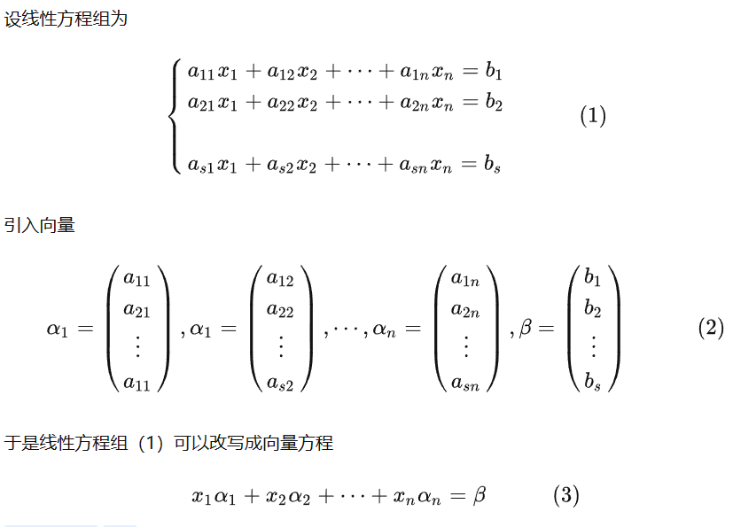

1.高斯消元法

> 高斯消元（阶梯形式EF）

使用表示成AX=b的矩阵

其中A表示的是对应的系数矩阵，b是解的线性组合  
将系数矩阵和右端向量合在一起构成的矩阵B=(A b)称为增广矩阵

通过一系列的行初等变换把这个增广矩阵转换为“简化阶梯矩阵”，就可以得出对应的解了。  

2.线性方程组的可解性

线性方程组有解的充要条件是系数矩阵的秩等于增广矩阵的秩，且当两个矩阵的秩均为n有唯一解，<n则有无穷多解

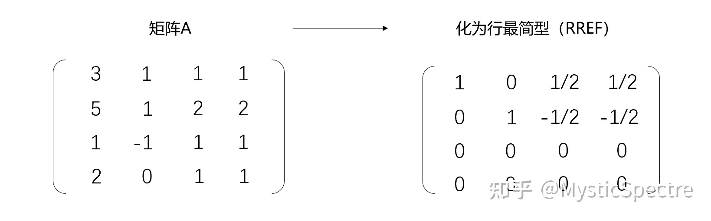

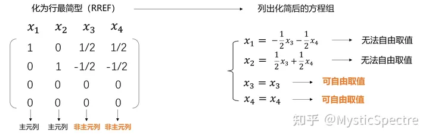

然后根据列出的关系式，实现最后的基础解系

非齐次线性方程组解的结构：特解+齐次方程通解

> 线性无关
> 
> by examples

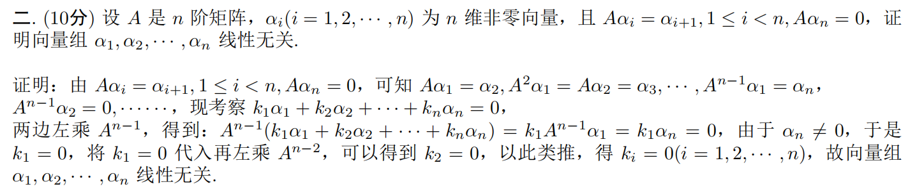

线性相关的核心要求，就是一组向量，其中任意一个向量都能通过其他向量的线性组合表示，或者采用方程的视角

线性无关的定义如下：

一组向量 {v₁, v₂, …, vₙ} 在线性空间中是线性无关的，如果不存在非零标量 {c₁, c₂, …, cₙ} 使得以下方程成立：

**c₁v₁ + c₂v₂ + … + cₙvₙ = 0**

其中，0 是零向量。如果上述方程的唯一解是所有系数 c₁, c₂, …, cₙ 都等于零，则这组向量是线性无关的。这可以写成数学表达式的形式如下：

**如果方程 c₁v₁ + c₂v₂ + … + cₙvₙ = 0 有唯一解 c₁ = c₂ = … = cₙ = 0，则向量集合 {v₁, v₂, …, vₙ} 是线性无关的。**

> 矩阵的秩
> 
> 与基础解系的关系

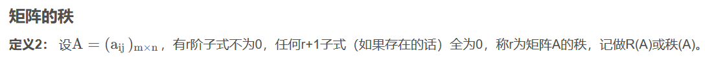

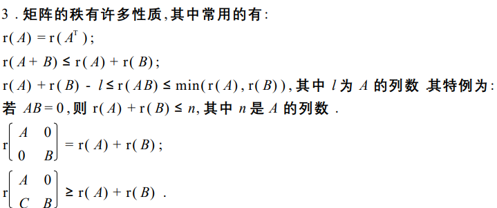

与基础解系相关的内容总结：

基础解系是指[方程组](<https://link.zhihu.com/?target=https%3A//baike.baidu.com/item/%25E6%2596%25B9%25E7%25A8%258B%25E7%25BB%2584/5695032>)的[解集](<https://link.zhihu.com/?target=https%3A//baike.baidu.com/item/%25E8%25A7%25A3%25E9%259B%2586/8743555>)的[极大线性无关组](<https://link.zhihu.com/?target=https%3A//baike.baidu.com/item/%25E6%259E%2581%25E5%25A4%25A7%25E7%25BA%25BF%25E6%2580%25A7%25E6%2597%25A0%25E5%2585%25B3%25E7%25BB%2584/11035667>)，即若干个无关的解构成的能够表示任意解的组合。基础解系需要满足三个条件：(1)基础解系中所有量均是方程组的解；(2)基础解系[线性无关](<https://link.zhihu.com/?target=https%3A//baike.baidu.com/item/%25E7%25BA%25BF%25E6%2580%25A7%25E6%2597%25A0%25E5%2585%25B3/4705660>),即基础解系中任何一个量都不能被其余量表示；(3)方程组的任意解均可由基础解系[线性表出](<https://link.zhihu.com/?target=https%3A//baike.baidu.com/item/%25E7%25BA%25BF%25E6%2580%25A7%25E8%25A1%25A8%25E5%2587%25BA/19679901>)，即方程组的所有解都可以用基础解系的量来表示。

> 

> 
> “秩r=极大线性无关组中向量的个数,”
> 
> 

> 
> AX＝0，作用对象是A，求的是A的秩，求的是线性方程组里“有效”的方程的个数。（线性相关的视为重复无效）
> 
> 

> 
> “基础解系本身又是一个极大线性无关组,”
> 
> 

> 
> 一组基础解系，是指AX＝0求X时，能用最“简洁”的一组解表达出所有的解（就是所谓的通解），作用对象是X。为了最“简洁”，它们就得线性无关；为了能表达出“所有”，它们就得“极大”涵盖所有情况。
> 
> 

> 
> “但其所含向量个数为n-r,”
> 
> 

> 
> 这种求AX＝0的X的通解的情况（A不满秩时多解），是用自由变量表示出所有的变量。n-r正是自由变量的个数。这里的向量个数与A的秩挂钩，等于A满秩情况的秩-A实际情况的秩。
> 
> 

> 
> “那极大线无关组所含向量个数到底是r还是n-r?”
> 
> 

> 
> 其实就是，极大线性无关描述的是方程个数还是解向量（的基础解系）个数，如果是方程是r（A）＝r，如果是解向量（的基础解系）是n-r。
> 
> 
作者：不知名小动物  
> 来源：知乎  
> 著作权归作者所有。商业转载请联系作者获得授权，非商业转载请注明出处。

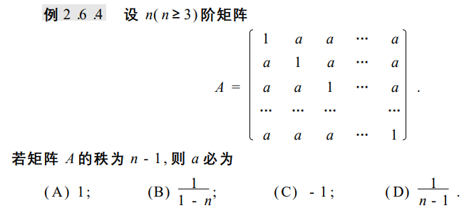

注：一个矩阵假如行列式为零则不满秩

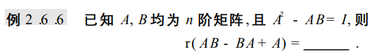

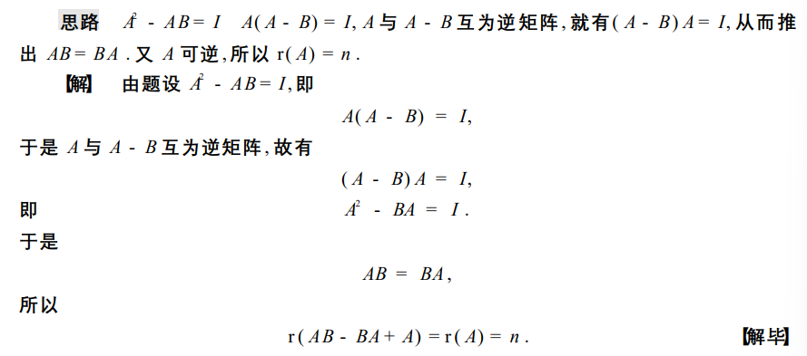

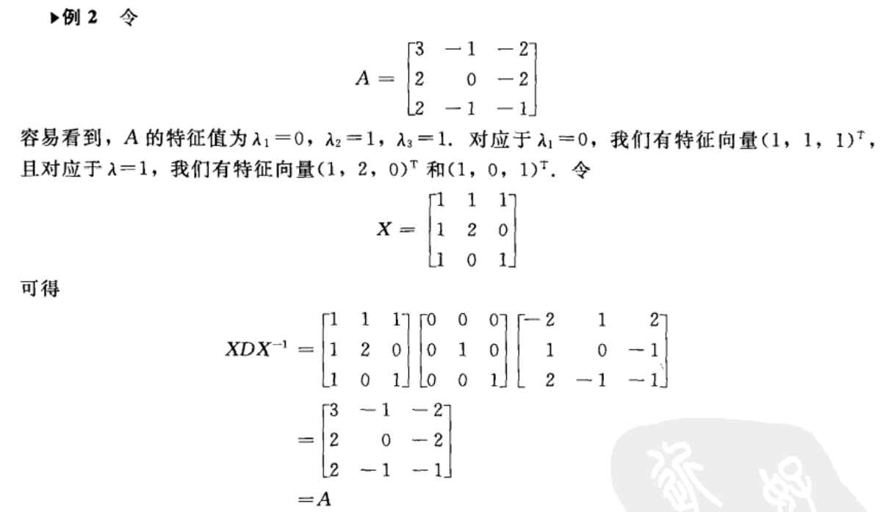

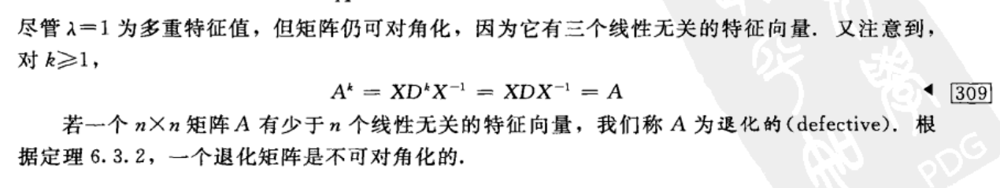

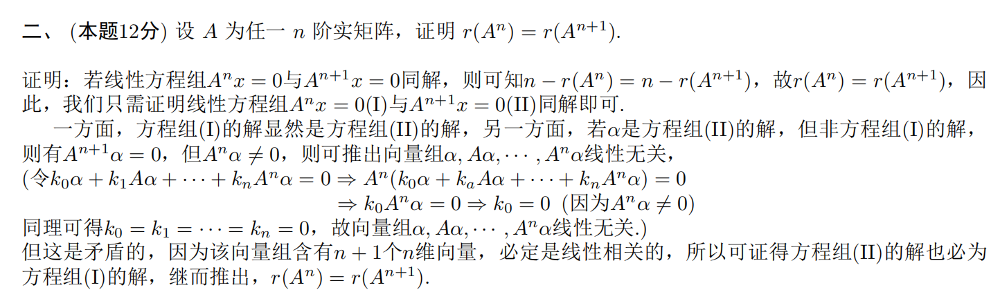

关于一些秩的性质的具体证明

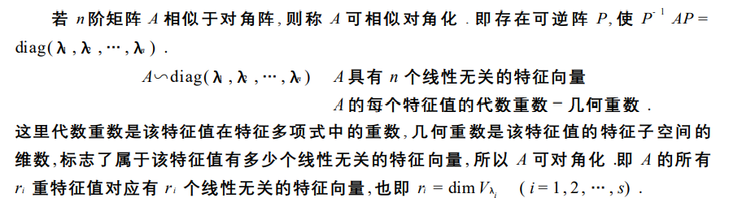

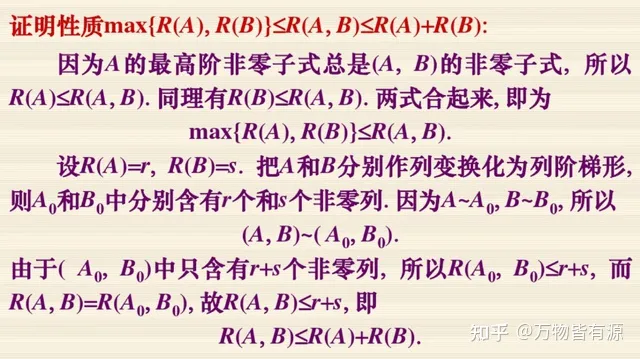

特征值与特征向量（以及相似矩阵）

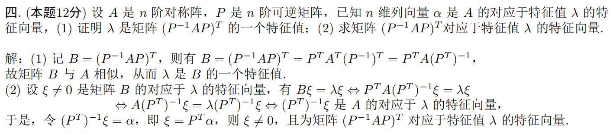

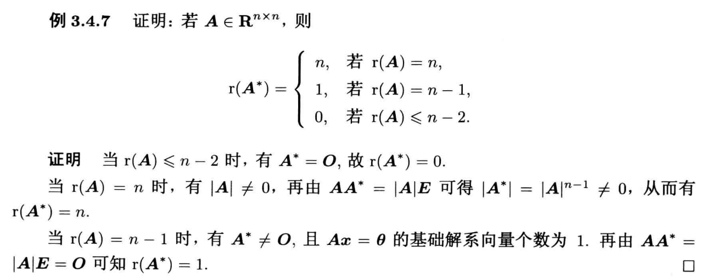

> 行列式的计算及技巧
> 
> 以题代学

<https://zhuanlan.zhihu.com/p/346885185>

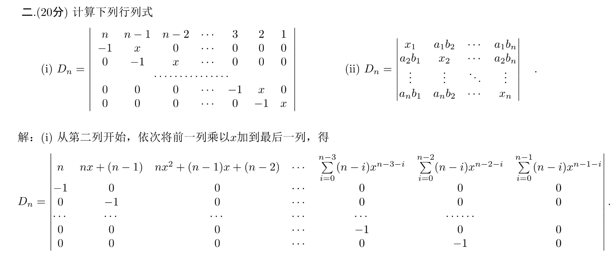

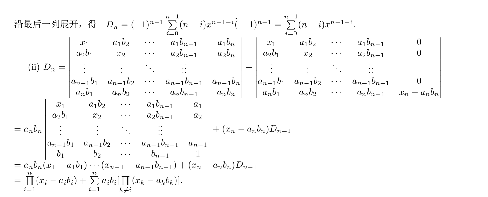

或者采取数学归纳和分拆并举的方式执行

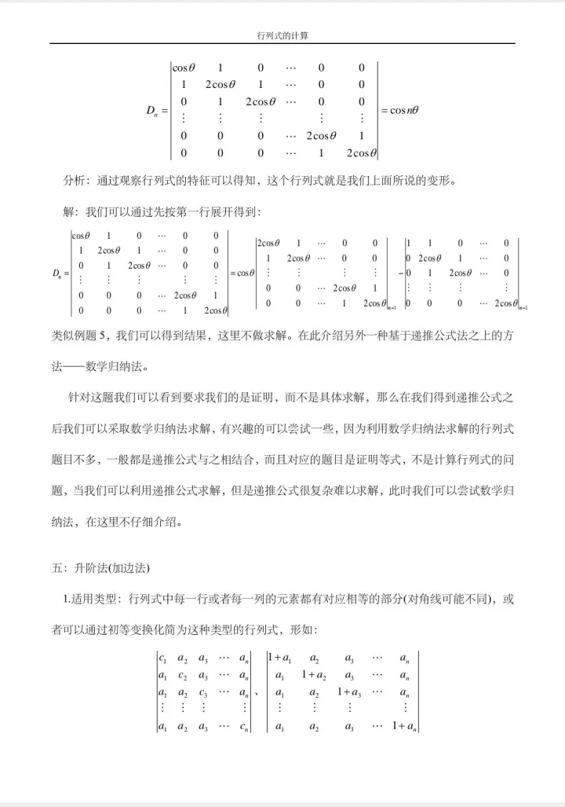

重要定理：

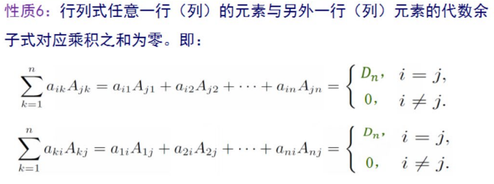

>   
> 把第i行的元素加到第j行元素上（[行列式值](<https://www.zhihu.com/search?q=%E8%A1%8C%E5%88%97%E5%BC%8F%E5%80%BC&search_source=Entity&hybrid_search_source=Entity&hybrid_search_extra=%7B%22sourceType%22%3A%22answer%22%2C%22sourceId%22%3A1124739747%7D>)不变），再将行列式按第j行展开，得  
> D = （aj1 + ai1）Aj1 + （aj2 + ai2）Aj2 + …… + （ajn + ain）Ajn  
> = D + （ai1Aj1 + ai2Aj2 + …… + ainAjn）  
> 所以上式后面部分为0

克莱默法则

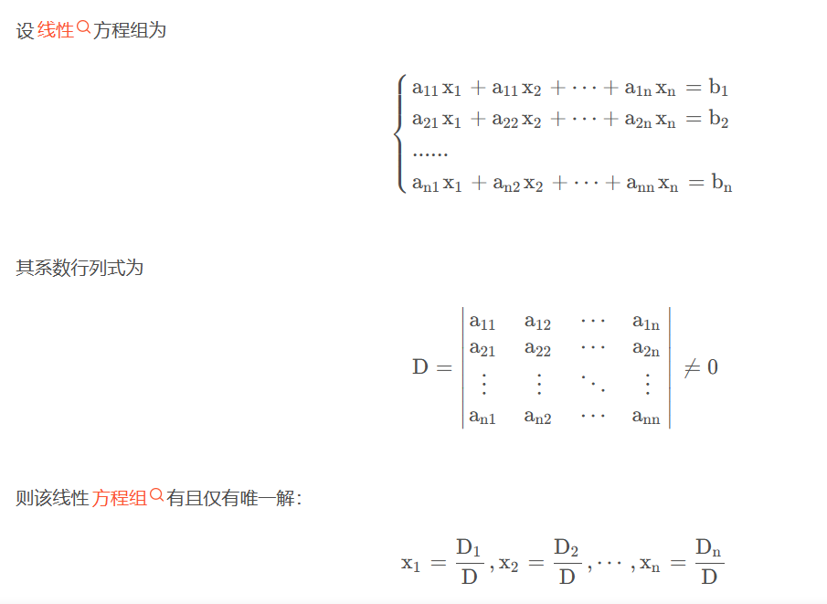

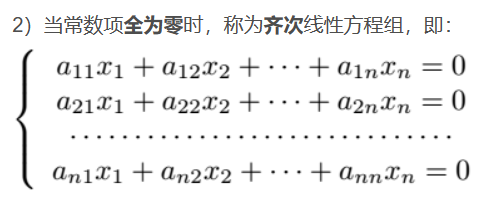

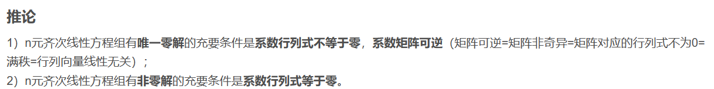
