\n

## **DP** 模块

\n\n\n\n

### 1.最长回文字符串：

\n\n\n\n

解决策略：基于回文字符串的长度，从短到长动态规划，然后给出对应的状态转移方程降低时间复杂度，注意状态转移的边界

\n\n\n\n

基于这个思路给出基本的状态转移方程：

\n\n\n\n

对于一个子串而言，如果它是回文串，并且长度大于 2，那么将它首尾的两个字母去除之后，它仍然是个回文串。例如对于字符串 “ababa”，如果我们已经知道 “bab” 是回文串，那么 “ababa” 一定是回文串，这是因为它的首尾两个字母都是 “a”。

\n\n\n\n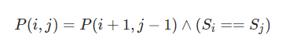\n\n\n\n

写完状态转移方程之后，注意框定边界，<3的长度的字符串，就需要特判解决，并且注意状态转移应该是从短到长的。

\n\n\n\n
    
    
    public class Solution {\n\n    public String longestPalindrome(String s) {\n        int len = s.length();\n        if (len < 2) {\n            return s;\n        }\n\n        int maxLen = 1;\n        int begin = 0;\n        // dp[i][j] 表示 s[i..j] 是否是回文串\n        boolean[][] dp = new boolean[len][len];\n        // 初始化：所有长度为 1 的子串都是回文串\n        for (int i = 0; i < len; i++) {\n            dp[i][i] = true;\n        }\n\n        char[] charArray = s.toCharArray();\n        // 递推开始\n        // 先枚举子串长度\n        for (int L = 2; L <= len; L++) {\n            // 枚举左边界，左边界的上限设置可以宽松一些\n            for (int i = 0; i < len; i++) {\n                // 由 L 和 i 可以确定右边界，即 j - i + 1 = L 得\n                int j = L + i - 1;\n                // 如果右边界越界，就可以退出当前循环\n                if (j >= len) {\n                    break;\n                }\n\n                if (charArray[i] != charArray[j]) {\n                    dp[i][j] = false;\n                } else {\n                    if (j - i < 3) {\n                        dp[i][j] = true;\n                    } else {\n                        dp[i][j] = dp[i + 1][j - 1];\n                    }\n                }\n\n                // 只要 dp[i][L] == true 成立，就表示子串 s[i..L] 是回文，此时记录回文长度和起始位置\n                if (dp[i][j] && j - i + 1 > maxLen) {\n                    maxLen = j - i + 1;\n                    begin = i;\n                }\n            }\n        }\n        return s.substring(begin, begin + maxLen);\n    }\n}

\n\n\n\n

### 2.maximum Matrix

\n\n\n\n

有一个很慢的但是很舒服的方法，用二维前缀和去处理对应的长方形存在性，代码在下面贴出来

\n\n\n\n
    
    
    public int maximalRectangle(char[][] matrix) {\n        int[][] dp = new int[matrix.length+5][matrix[0].length+5];\n        dp[0][1]=dp[1][0]=dp[0][0]=0;\n        dp[1][1]=matrix[0][0]=='1'?1:0;\n        for(int i = 1;i <= matrix.length;i++){\n                for(int j = 1;j <= matrix[0].length;j++){\n                    dp[i][j]=dp[i-1][j]+dp[i][j-1]-dp[i-1][j-1]+(matrix[i-1][j-1]=='1'?1:0);\n                }\n                \n            }\n        for(int i = 0;i <= matrix.length;i++){\n            for(int j = 0;j <= matrix[0].length;j++){\n                System.out.print(dp[i][j]+" ");\n            }\n            System.out.println();\n        }\n        int max = 0;\n        for(int i = 1;i <= matrix.length;i++){\n            for(int j = 1;j <= matrix[0].length;j++){\n            if(matrix[i-1][j-1]=='0') continue;\n            for(int k = matrix.length;k >=i ;k--){\n                for(int l = matrix[0].length;l >= j;l--){\n                    if(dp[k][l]-dp[i-1][l]-dp[k][j-1]+dp[i-1][j-1]==(k-i+1)*(l-j+1)){\n                        max = Math.max(max,(k-i+1)*(l-j+1));\n                        break;\n                    }\n                }\n            }\n        }\n    }\n        return max;\n    }

\n\n\n\n

但还有一个更加tricky的办法

\n\n\n\n

We can apply the maximum in histogram in each row of the 2D matrix. What we need is to maintain an int array for each row, which represent for the height of the histogram.

\n\n\n\n

Please refer to <https://leetcode.com/problems/largest-rectangle-in-histogram/> first.

\n\n\n\n

Suppose there is a 2D matrix like

\n\n\n\n

1 1 0 1 0 1

\n\n\n\n

0 1 0 0 1 1

\n\n\n\n

1 1 1 1 0 1

\n\n\n\n

1 1 1 1 0 1

\n\n\n\n

First initiate the height array as 1 1 0 1 0 1, which is just a copy of the first row. Then we can easily calculate the max area is 2.

\n\n\n\n

Then update the array. We scan the second row, when the matrix[1][i] is 0, set the height[i] to 0; else height[i] += 1, which means the height has increased by 1. So the height array again becomes 0 2 0 0 1 2. The max area now is also 2.

\n\n\n\n

Apply the same method until we scan the whole matrix. the last height arrays is 2 4 2 2 0 4, so the max area has been found as 2 * 4 = 8.

\n\n\n\n

Then reason we scan the whole matrix is that the maximum value may appear in any row of the height.

\n\n\n\n

Code as follows:

\n\n\n\n
    
    
    \npublic class Solution {\npublic int maximalRectangle(char[][] matrix) {\n    if(matrix == null || matrix.length == 0 || matrix[0].length == 0) return 0;\n    \n    int[] height = new int[matrix[0].length];\n    for(int i = 0; i < matrix[0].length; i ++){\n        if(matrix[0][i] == '1') height[i] = 1;\n    }\n    int result = largestInLine(height);\n    for(int i = 1; i < matrix.length; i ++){\n        resetHeight(matrix, height, i);\n        result = Math.max(result, largestInLine(height));\n    }\n    \n    return result;\n}\n\nprivate void resetHeight(char[][] matrix, int[] height, int idx){\n    for(int i = 0; i < matrix[0].length; i ++){\n        if(matrix[idx][i] == '1') height[i] += 1;\n        else height[i] = 0;\n    }\n}    \n\npublic int largestInLine(int[] height) {\n    if(height == null || height.length == 0) return 0;\n    int len = height.length;\n    Stack<Integer> s = new Stack<Integer>();\n    int maxArea = 0;\n    for(int i = 0; i <= len; i++){\n        int h = (i == len ? 0 : height[i]);\n        if(s.isEmpty() || h >= height[s.peek()]){\n            s.push(i);\n        }else{\n            int tp = s.pop();\n            maxArea = Math.max(maxArea, height[tp] * (s.isEmpty() ? i : i - 1 - s.peek()));\n            i--;\n        }\n    }\n    return maxArea;\n}\n\n}

\n\n\n\n

### 3.大礼包

\n\n\n\n

在 LeetCode 商店中， 有 `n` 件在售的物品。每件物品都有对应的价格。然而，也有一些大礼包，每个大礼包以优惠的价格捆绑销售一组物品。

\n\n\n\n

给你一个整数数组 `price` 表示物品价格，其中 `price[i]` 是第 `i` 件物品的价格。另有一个整数数组 `needs` 表示购物清单，其中 `needs[i]` 是需要购买第 `i` 件物品的数量。

\n\n\n\n

还有一个数组 `special` 表示大礼包，`special[i]` 的长度为 `n + 1` ，其中 `special[i][j]` 表示第 `i` 个大礼包中内含第 `j` 件物品的数量，且 `special[i][n]` （也就是数组中的最后一个整数）为第 `i` 个大礼包的价格。

\n\n\n\n

返回**  确切 **满足购物清单所需花费的最低价格，你可以充分利用大礼包的优惠活动。你不能购买超出购物清单指定数量的物品，即使那样会降低整体价格。任意大礼包可无限次购买。

\n\n\n\n

**示例 1：**

\n\n\n\n

**输入：** price = [2,5], special = [[3,0,5],[1,2,10]], needs = [3,2] 

\n\n\n\n

**输出：** 14 

\n\n\n\n

**解释：** 有 A 和 B 两种物品，价格分别为 ¥2 和 ¥5 。 大礼包 1 ，你可以以 ¥5 的价格购买 3A 和 0B 。 大礼包 2 ，你可以以 ¥10 的价格购买 1A 和 2B 。 需要购买 3 个 A 和 2 个 B ， 所以付 ¥10 购买 1A 和 2B（大礼包 2），以及 ¥4 购买 2A 。

\n\n\n\n

首先，我们过滤掉不需要计算的大礼包。

\n\n\n\n

如果大礼包**完全没有优惠** （大礼包的价格大于等于原价购买大礼包内所有物品的价格），或者大礼包内不包含任何的物品，那么购买这些大礼包不可能使整体价格降低。因此，我们可以不考虑这些大礼包，并将它们过滤掉，以提高效率和方便编码。

\n\n\n\n

因为题目规定了「不能购买超出购物清单指定数量的物品」，所以只要我们购买过滤后的大礼包，都一定可以令整体价格降低。

\n\n\n\n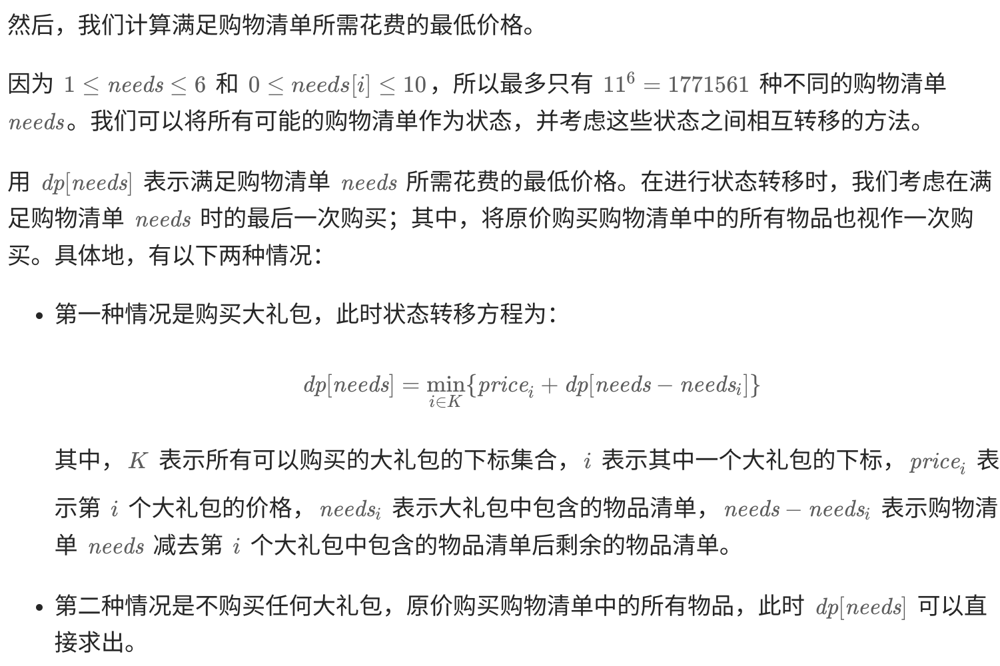\n\n\n\n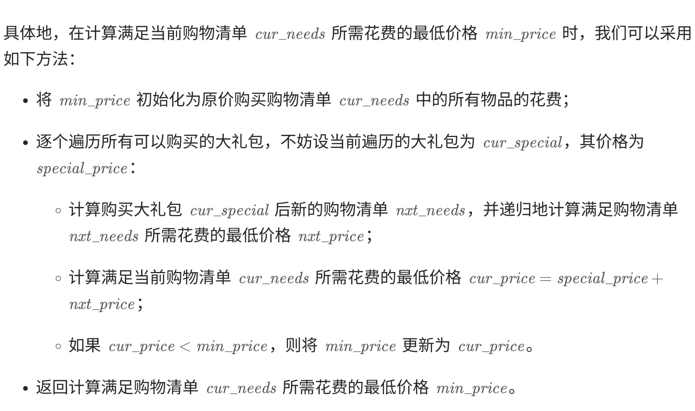\n\n\n\n
    
    
    class Solution {\n    Map<List<Integer>, Integer> memo = new HashMap<List<Integer>, Integer>();\n\n    public int shoppingOffers(List<Integer> price, List<List<Integer>> special, List<Integer> needs) {\n        int n = price.size();\n\n        // 过滤不需要计算的大礼包，只保留需要计算的大礼包\n        List<List<Integer>> filterSpecial = new ArrayList<List<Integer>>();\n        for (List<Integer> sp : special) {\n            int totalCount = 0, totalPrice = 0;\n            for (int i = 0; i < n; ++i) {\n                totalCount += sp.get(i);\n                totalPrice += sp.get(i) * price.get(i);\n            }\n            if (totalCount > 0 && totalPrice > sp.get(n)) {\n                filterSpecial.add(sp);\n            }\n        }\n\n        return dfs(price, special, needs, filterSpecial, n);\n    }\n\n    // 记忆化搜索计算满足购物清单所需花费的最低价格\n    public int dfs(List<Integer> price, List<List<Integer>> special, List<Integer> curNeeds, List<List<Integer>> filterSpecial, int n) {\n        if (!memo.containsKey(curNeeds)) {\n            int minPrice = 0;\n            for (int i = 0; i < n; ++i) {\n                minPrice += curNeeds.get(i) * price.get(i); // 不购买任何大礼包，原价购买购物清单中的所有物品\n            }\n            for (List<Integer> curSpecial : filterSpecial) {\n                int specialPrice = curSpecial.get(n);\n                List<Integer> nxtNeeds = new ArrayList<Integer>();\n                for (int i = 0; i < n; ++i) {\n                    if (curSpecial.get(i) > curNeeds.get(i)) { // 不能购买超出购物清单指定数量的物品\n                        break;\n                    }\n                    nxtNeeds.add(curNeeds.get(i) - curSpecial.get(i));\n                }\n                if (nxtNeeds.size() == n) { // 大礼包可以购买\n                    minPrice = Math.min(minPrice, dfs(price, special, nxtNeeds, filterSpecial, n) + specialPrice);\n                }\n            }\n            memo.put(curNeeds, minPrice);\n        }\n        return memo.get(curNeeds);\n    }\n}\n\n

\n\n\n\n

**18.4Sum**

\n\n\n\n

Given an array `nums` of `n` integers, return _an array of all the  **unique**  quadruplets_ `[nums[a], nums[b], nums[c], nums[d]]` such that:

\n\n\n\n

\n
  * `0 <= a, b, c, d < n`
\n\n\n\n
  * `a`, `b`, `c`, and `d` are **distinct**.
\n\n\n\n
  * `nums[a] + nums[b] + nums[c] + nums[d] == target`
\n
\n\n\n\n

You may return the answer in **any order**.

\n\n\n\n

**Example 1:****Input:** nums = [1,0,-1,0,-2,2], target = 0 **Output:** [[-2,-1,1,2],[-2,0,0,2],[-1,0,0,1]]

\n\n\n\n

**Example 2:****Input:** nums = [2,2,2,2,2], target = 8 **Output:** [[2,2,2,2]]

\n\n\n\n

题解：

\n\n\n\n

类似双指针但是由于扩展到了4位，肯定不再考虑使用4指针标注的方式来遍历，与之相反的是，我们采取双循环加剩余部分双指针的策略来解决。

\n\n\n\n

Maximum Product of Words length

\n\n\n\n

Given a string array `words`, return _the maximum value of_  `length(word[i]) * length(word[j])` _where the two words do not share common letters_. If no such two words exist, return `0`.

\n\n\n\n

**Example 1:****Input:** words = ["abcw","baz","foo","bar","xtfn","abcdef"] **Output:** 16 **Explanation:** The two words can be "abcw", "xtfn".

\n\n\n\n

**Example 2:****Input:** words = ["a","ab","abc","d","cd","bcd","abcd"] **Output:** 4 **Explanation:** The two words can be "ab", "cd".

\n\n\n\n

**Example 3:****Input:** words = ["a","aa","aaa","aaaa"] **Output:** 0 **Explanation:** No such pair of words.

\n\n\n\n

**Constraints:**

\n\n\n\n

\n
  * `2 <= words.length <= 1000`
\n\n\n\n
  * `1 <= words[i].length <= 1000`
\n\n\n\n
  * `words[i]` consists only of lowercase English letters.
\n
\n\n\n\n
    
    
    public int maxProduct(String[] words) {\n        int[] mask = new int[words.length];\n        int max = 0;\n        for(int i= 0;i< words.length;i++){\n            for(int j = 0;j < words[i].length();j++){\n                mask[i] |= 1 << (words[i].charAt(j) - 'a');\n            }\n        }\n        for(int i = 0;i < words.length;i++){\n            for(int j = i + 1;j < words.length;j++){\n                if((mask[i] & mask[j]) == 0){\n                    max = Math.max(max,words[i].length() * words[j].length());\n                }\n            }\n        }\n        return max;\n    }

\n\n\n\n

## 双指针问题

\n\n\n\n

### 解题思路：

\n\n\n\n

这类链表题目一般都是使用双指针法解决的，例如寻找距离尾部第 `K` 个节点、寻找环入口、寻找公共尾部入口等。

\n\n\n\n

在本题的求解过程中，双指针会产生两次“相遇”。

\n\n\n\n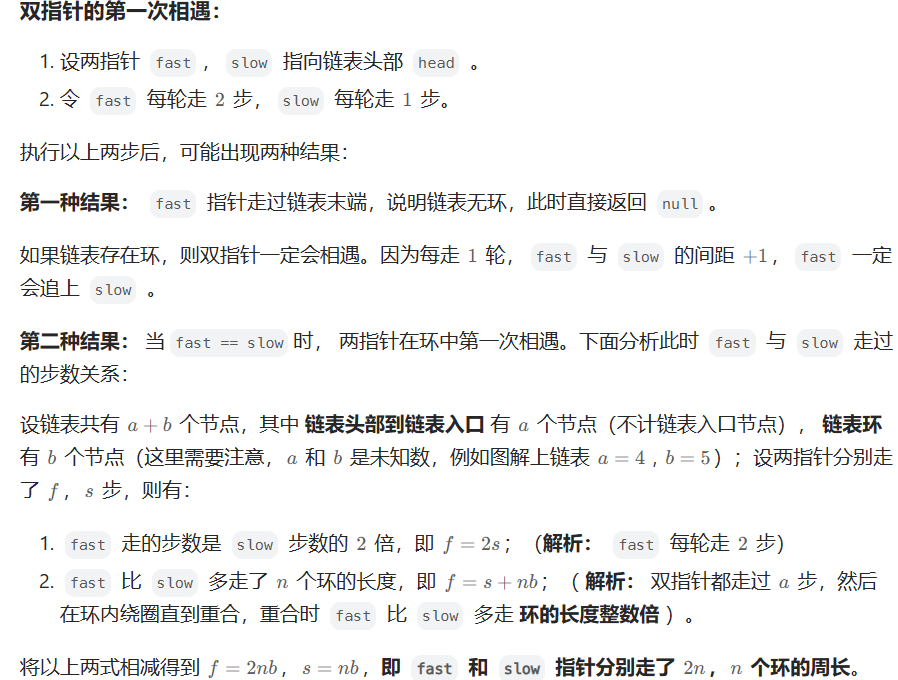\n\n\n\n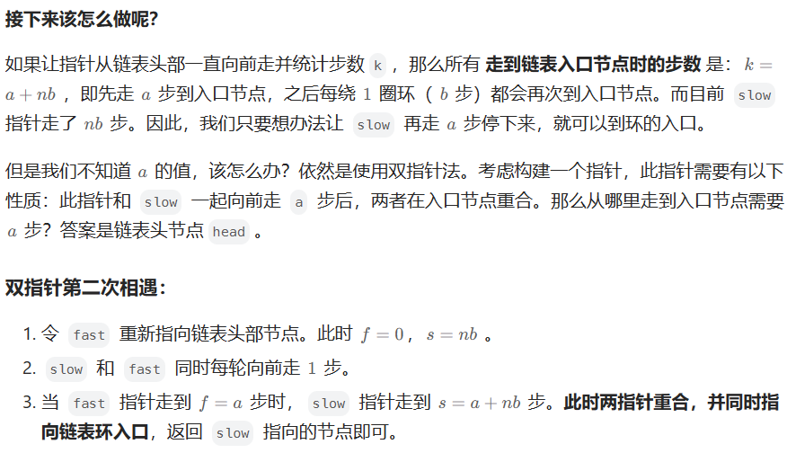\n\n\n\n

### 快慢指针的另一应用：

\n\n\n\n

在[86\. 分隔链表](<https://leetcode.cn/problems/partition-list/>)这一题中，使用到了快慢指针，慢指针用于寻找大于等于val的目标数字，快指针则用于寻找慢指针右侧，小于val的目标数字，在慢指针移动时保证快指针始终在慢指针右侧，并且两个指针的寻找具有先后关系，首先慢指针一直找到大于val的数字然后停下，此时开始挪动fast去寻找离这个慢指针最近的小于val的数字以供替换（链表的基本题目）然后进行下一轮的搜索，其中如果fast到链表末尾还没找到满足条件的话，那就设定while的边界条件为left非空即可，此时已经原地完成了链表的分割，返回提前存储的链表头即可（需要单独设置一个空的链表头指向“真正的head”，可能因为交换会变化，所以链表中的快慢指针如果有必要的swap操作，需要存储对应的prev）

\n\n\n\n
    
    
    /**\n * Definition for singly-linked list.\n * public class ListNode {\n *     int val;\n *     ListNode next;\n *     ListNode() {}\n *     ListNode(int val) { this.val = val; }\n *     ListNode(int val, ListNode next) { this.val = val; this.next = next; }\n * }\n */\nclass Solution {\n\n    public ListNode partition(ListNode head, int x) {\n        //使用链表中的冒泡排序\n        if(head ==null)\n            return null;\n        ListNode slowPrev = new ListNode(0);\n        ListNode p = slowPrev;\n        slowPrev.next = head;\n        ListNode slow = head,fastPrev = head,fast = head.next;\n        while(fast!=null){\n            if(slow.val<x){\n                slowPrev = slow;\n                slow = slow.next;\n                fastPrev = fast;\n            }else if(fast.val<x){\n                fastPrev.next = fast.next;\n                slowPrev.next = fast;\n                fast.next = slow;\n                slowPrev = fast;\n            }else fastPrev = fast;\n            fast = fastPrev.next;\n        }\n        return p.next;\n    }\n}

\n\n\n\n

### 左右指针的应用

\n\n\n\n

双指针的非链表应用往往能够在数组中发挥同样大的作用，而一般我们在数组中由于“索引访问”的特性，不太需要通过快慢控制双指针的合作关系，一般是使用左右的位置关系，使用双指针固定一个区间，然后围绕这样一个区间去活动，最简单的应用（当然很强大）就是滑动窗口，接下来我们也会分这么两部分去讲解左右指针。

\n\n\n\n

### 滑动窗口：

\n\n\n\n

滑动窗口在很多一维数组、子数组以及字符串题目中常出现，属于非常常见且好用的算法，但是滑动窗口的难点就在于边界条件的把握以及贪心策略的评估：左窗口何时扩展？右窗口可以收缩多少？比如KMP算法的引入就可以加强很多情境下的滑动窗口匹配，功能就是优化右窗口的收缩（覆盖情况充足）并且减少左窗口的回溯

\n\n\n\n

首先我们看一道比较经典的滑动窗口

\n\n\n\n

#### [3\. 无重复字符的最长子串](<https://leetcode.cn/problems/longest-substring-without-repeating-characters/>)

\n\n\n\n

滑动窗口的核心要素：搞清楚这个“窗口不崩塌的基本条件”，记为S，在满足S的情况下，右边界可以随意扩展，这里，题目的要求是“无重复字符”，那么我们可以得到这个S，即为“**窗口中没有重复字符，且右边界大于左边界、小于数组长度** ”，因此我们罗列出两重循环，在S不满足的时候，就需要挪动左窗口了。

\n\n\n\n

因此第一重循环是左边界，从0开始，然后右边界从左边界开始扩展（不然是负窗口）。此时我们需要考虑这样的问题：如何judge这个S？窗口问题无非这些：求和、不重复、回文blabla的 这里要求不重复，所以我们用空间去换，把窗口内的字符都拿一个Set存起来，这个题解用了TreeSet,其实用HashSet就可以了，速度也会快一点（O(1)查询）。于是S的问题解决了。然后拿一个maxLen存储最长的数值。

\n\n\n\n

那么现在有第二个问题：S不满足的时候，我们如何让窗口回归到一个稳态？方式是通过移动右指针，移动到什么时候？那这个时候我们回看一下S，S肯定是因为遇到了相同字符才不满足的，因此需要将左指针移动到找到那个相同字符为止，然后指向这个字符的下一个，窗口满足S，可以继续试着扩展右指针。如是直到数组边界，我们的每一步都能寻到0-right范围内最好的子串，因此不存在缺失最优解的问题，本题得解。

\n\n\n\n
    
    
    class Solution {\n    public int lengthOfLongestSubstring(String s) {\n        TreeSet<Character> dict = new TreeSet<>();\n        int len = s.length();\n        int maxLen = 0;\n        for(int i=0;i<len;i++){\n            for(int j=i;j<len;j++){\n                if(dict.contains(s.charAt(j)))\n                {\n                    //滑动窗口移动\n                    while(s.charAt(i)!=s.charAt(j))\n                    {\n                        dict.remove(s.charAt(i++));\n                    }\n                    i++;\n                    \n                }else {\n                    dict.add(s.charAt(j));\n                    maxLen=Math.max(maxLen,j-i+1);\n                }\n            }\n        }\n        return maxLen;\n    }\n}

\n\n\n\n

#### [567\. 字符串的排列](<https://leetcode.cn/problems/permutation-in-string/>)

\n\n\n\n

对于这道题而言，得到了更好的S判断，即存在对应的Array里面，然后使用Array.equals判断两个字符串数组的字符出现频率是否一致

\n\n\n\n
    
    
    class Solution {\n    public boolean checkInclusion(String s1, String s2) {\n        int n = s1.length(), m = s2.length();\n        if (n > m) {\n            return false;\n        }\n        int[] cnt1 = new int[26];\n        int[] cnt2 = new int[26];\n        for (int i = 0; i < n; ++i) {\n            ++cnt1[s1.charAt(i) - 'a'];\n            ++cnt2[s2.charAt(i) - 'a'];\n        }\n        if (Arrays.equals(cnt1, cnt2)) {\n            return true;\n        }\n        for (int i = n; i < m; ++i) {\n            ++cnt2[s2.charAt(i) - 'a'];\n            --cnt2[s2.charAt(i - n) - 'a'];\n            if (Arrays.equals(cnt1, cnt2)) {\n                return true;\n            }\n        }\n        return false;\n    }\n}\n

\n\n\n\n

### 类似快排的左右指针：

\n\n\n\n

#### [27\. 移除元素](<https://leetcode.cn/problems/remove-element/>)

\n\n\n\n

本题事实上实现了类似cpp中remove以及remove_if的功能，对于一个数组中存在的val，删除的方式不是移除，而是全部挪动到数组末尾，这里我们采用的就是左右指针的方式，不过与滑动窗口不同，两个指针在这里不是为了维护区间而是各司其职（当然两个指针内的区间也可以表示是未处理的部分）

\n\n\n\n

左指针一开始指向数组开头，寻找需要挪到末尾的数字，然后右指针则是在左指针找到之后，从最右侧开始找第一个非val的数字来swap，知道两个指针相遇为止，右指针的位置即为删除之后数组的末尾。这里要注意while的条件应该为两个指针相互错过后，相遇这样一个情况会影响最后的计数。

\n\n\n\n

具体的java实现如下，cpp无差异

\n\n\n\n
    
    
    class Solution {\n    public void swap(int[] arr,int a, int b){\n        int temp = arr[a];\n        arr[a] = arr[b];\n        arr[b] = temp;\n        return;\n    }\n    public int removeElement(int[] nums, int val) {\n        int len = nums.length;\n        if(len ==0 ){\n            return 0;\n        }\n        int right = 0,left = len-1;\n        while(right<len&&right<=left){\n            if(nums[right]!=val){\n                right++;\n            }else if(nums[left]==val){\n                left--;\n            }else{\n                swap(nums,right,left);\n                right++;\n                left--;\n            }\n        }\n        \n        return left+1;\n    }\n}

\n\n\n\n

## RMQ(Range maximum/minimum Queue)

\n\n\n\n

239.滑动窗口最大值

\n\n\n\nTAG\n

「优先队列（堆）」、「线段树」、「分块」、「单调队列」、「RMQ」

\n\n\n\n\n

给你一个整数数组 `nums`，有一个大小为 `k` 的滑动窗口从数组的最左侧移动到数组的最右侧。你只可以看到在滑动窗口内的 `k` 个数字。滑动窗口每次只向右移动一位。

\n\n\n\n

返回滑动窗口中的最大值 。

\n\n\n\n

示例

\n\n\n\n
    
    
    输入：nums = [1,3,-1,-3,5,3,6,7], k = 3\n\n输出：[3,3,5,5,6,7]\n\n解释：\n滑动窗口的位置                最大值\n---------------               -----\n[1  3  -1] -3  5  3  6  7       3\n 1 [3  -1  -3] 5  3  6  7       3\n 1  3 [-1  -3  5] 3  6  7       5\n 1  3  -1 [-3  5  3] 6  7       5\n 1  3  -1  -3 [5  3  6] 7       6\n 1  3  -1  -3  5 [3  6  7]      7

\n\n\n\n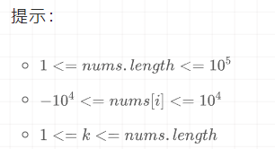\n\n\n\n

很显然，题目表述的含义就是RMQ问题，首先我们考虑的事优先队列（大根堆），以（idx,num_idx）的方式入队

\n\n\n\n

当下标达到首个滑动窗口的右端点后，每次尝试从优先队列（大根堆）中取出最大值（若堆顶元素的下标小于当前滑动窗口左端点时，则丢弃该元素）。

\n\n\n\n

\n\n\n\n

## 优先队列

\n\n\n\n
    
    
    class Solution {\n    public int[] maxSlidingWindow(int[] nums, int k) {\n        PriorityQueue<int[]> q = new PriorityQueue<>((a,b)->b[1]-a[1]);\n        int n = nums.length, m = n - k + 1, idx = 0;\n        int[] ans = new int[m];\n        for (int i = 0; i < n; i++) {\n            q.add(new int[]{i, nums[i]});\n            if (i >= k - 1) {\n                while (q.peek()[0] <= i - k) q.poll();\n                ans[idx++] = q.peek()[1];\n            }\n        }\n        return ans;\n    }\n}\n//Java

\n\n\n\n

### 线段树

\n\n\n\n

[线段树](<https://so.csdn.net/so/search?q=%E7%BA%BF%E6%AE%B5%E6%A0%91&spm=1001.2101.3001.7020>)是什么？？线段树怎么写？？

\n\n\n\n

如果你在考提高组前一天还在问这个问题，那么你会与一等奖失之交臂；如果你还在冲击普及组一等奖，那么这篇博客会浪费你人生中宝贵的5~20分钟。

\n\n\n\n

上面两句话显而易见，线段树这个数据结构是一个从萌新到正式OI选手的过渡，是一个非常重要的算法，也是一个对于萌新来说较难的算法。不得不说，我学习了这个算法5遍左右才有勇气写的这篇博客。

\n\n\n\n

但是，对于OI正式选手来说，线段树不是算法，应该是一种工具。她能把一些对于区间（或者线段）的修改、维护，从`O(N)`的时间复杂度变成`O（logN）`。

\n\n\n\n

简单定义：线段树是一种二叉树，也就是对于一个线段，我们会用一个二叉树来表示。比如说一个长度为4的线段，我们可以表示成这样：

\n\n\n\n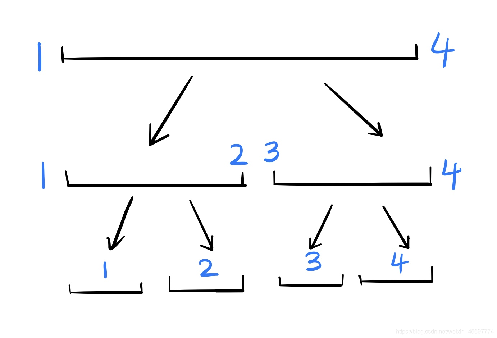\n\n\n\n

这是什么意思呢？ 如果你要表示线段的和，那么最上面的根节点的权值表示的是这个线段 1 ∼ 4  的和。根的两个儿子分别表示这个线段中 1 ∼ 2的和，与 3 ∼ 4 的和。以此类推。

\n\n\n\n

然后我们还可以的到一个性质：节点 i 的权值 =她的左儿子权值 \+  她的右儿子权值。因为 1 ∼ 4 的和就是等于 1 ∼ 2 的和与 2 ∼ 3  的和的和。

\n\n\n\n

根据这个思路，我们就可以建树了，我们设一个结构体 `tree`，`tree[i].l` 与 `tree[i].r` 分别表示这个点代表的线段的左右下标，`tree[i].sum` 表示这个节点表示的线段和。

\n\n\n\n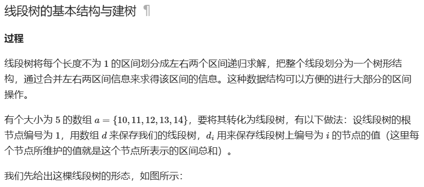\n\n\n\n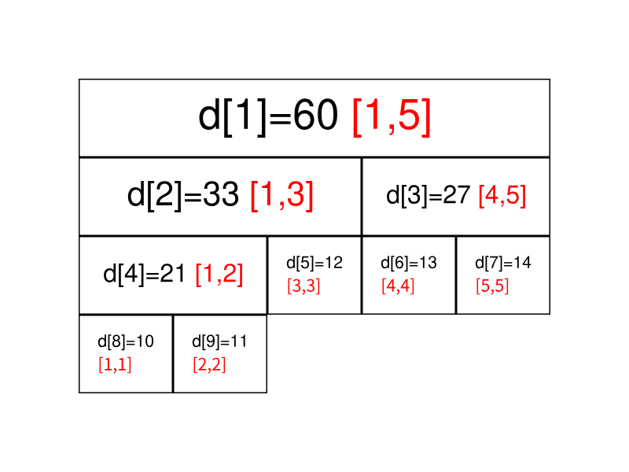\n\n\n\n
    
    
    void build(int s, int t, int p) {\n  // 对 [s,t] 区间建立线段树,当前根的编号为 p\n  if (s == t) {\n    d[p] = a[s];\n    return;\n  }\n  int m = s + ((t - s) >> 1);\n  // 移位运算符的优先级小于加减法，所以加上括号\n  // 如果写成 (s + t) >> 1 可能会超出 int 范围\n  build(s, m, p * 2), build(m + 1, t, p * 2 + 1);\n  // 递归对左右区间建树\n  d[p] = d[p * 2] + d[(p * 2) + 1];\n}

\n\n\n\n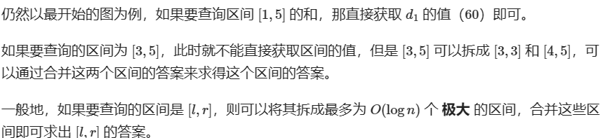\n\n\n\n

#### 简单线段树（无pushdown）

\n\n\n\n

### 单点修改，区间查询

\n\n\n\n

其实这一章开始才是真正的线段树，我们要用线段树干什么？答案是维护一个线段（或者区间），比如你想求出一个 1 ∼ 100 区间中， 4 ∼ 67 这些元素的和，你会怎么做？朴素的做法是`for(i=4;i<=67;i++) sum+=a[i]`，这样固然好，但是算得太慢了。

\n\n\n\n

我们想一种新的方法，先想一个比较好画图的数据，比如一个长度为 4  的区间，分别是 1 、 2 、 3 、 4 ，我们想求出第 1 ∼ 3 项的和。按照上一部说的，我们要建出一颗线段树，其中点权（也就是红色）表示和：

\n\n\n\n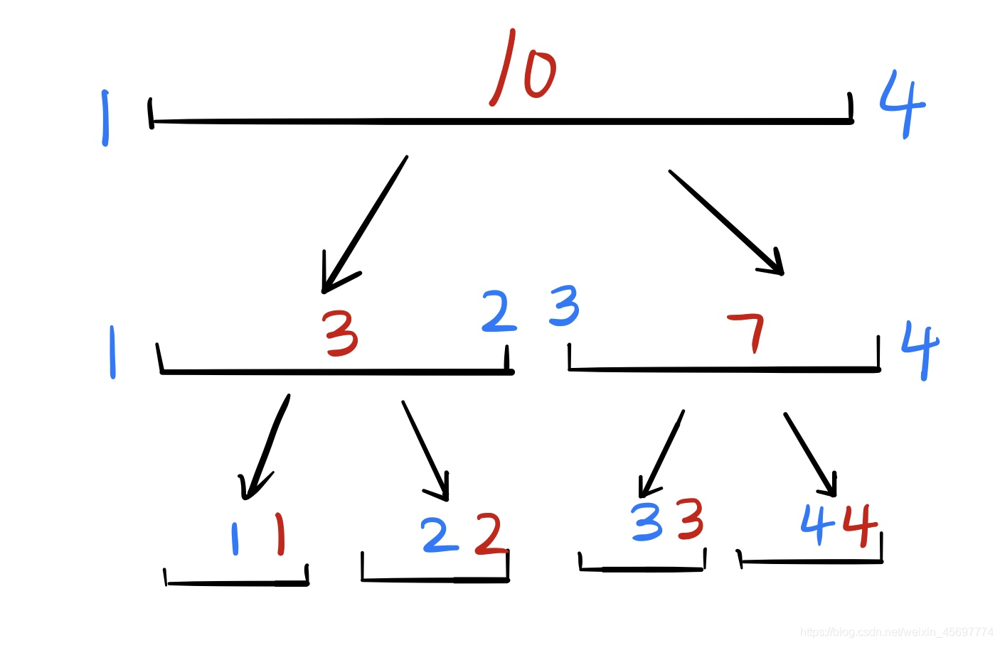\n\n\n\n

我们总结一下，线段树的查询方法：

\n\n\n\n

\n
  1. 如果这个区间被完全包括在目标区间里面，直接返回这个区间的值
\n\n\n\n
  2. 如果这个区间的左儿子和目标区间有交集，那么搜索左儿子
\n\n\n\n
  3. 如果这个区间的右儿子和目标区间有交集，那么搜索右儿子
\n
\n\n\n\n
    
    
    inline int search(int i,int l,int r){\n    if(tree[i].l>=l && tree[i].r<=r)//如果这个区间被完全包括在目标区间里面，直接返回这个区间的值\n        return tree[i].sum;\n    if(tree[i].r<l || tree[i].l>r)  return 0;//如果这个区间和目标区间毫不相干，返回0\n    int s=0;\n    if(tree[i*2].r>=l)  s+=search(i*2,l,r);//如果这个区间的左儿子和目标区间又交集，那么搜索左儿子\n    if(tree[i*2+1].l<=r)  s+=search(i*2+1,l,r);//如果这个区间的右儿子和目标区间又交集，那么搜索右儿子\n    return s;\n}

\n\n\n\n

关于那几个if的条件一定要看清楚，最好背下来，以防考场上脑抽推错。

\n\n\n\n

然后,我们怎么修改这个区间的单点，其实这个相对简单很多，你要把区间的第dis位加上k。

\n\n\n\n

那么你从根节点开始，看这个dis是在左儿子还是在右儿子，在哪往哪跑，

\n\n\n\n

然后返回的时候，还是按照`tree[i].sum=tree[i*2].sum+tree[i*2+1].sum`的原则，更新所有路过的点

\n\n\n\n

如果不理解，我还是画个图吧，其中深蓝色是去的路径，浅蓝色是返回的路径，回来时候红色的+标记就是把这个点加上这个值。

\n\n\n\n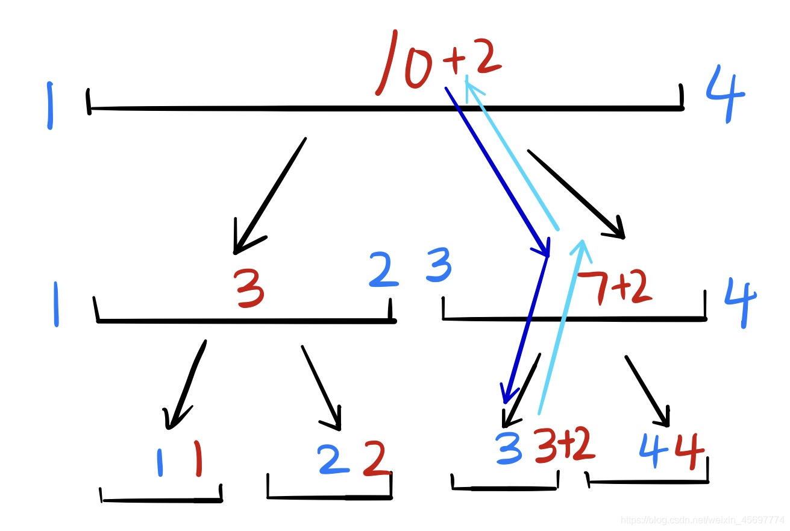\n\n\n\n
    
    
    inline void add(int i,int dis,int k){\n    if(tree[i].l==tree[i].r){//如果是叶子节点，那么说明找到了\n        tree[i].sum+=k;\n        return ;\n    }\n    if(dis<=tree[i*2].r)  add(i*2,dis,k);//在哪往哪跑\n    else  add(i*2+1,dis,k);\n    tree[i].sum=tree[i*2].sum+tree[i*2+1].sum;//返回更新\n    return ;\n}\n

\n\n\n\n

### 区间修改，单点查询

\n\n\n\n

区间修改和单点查询，我们的思路就变为：如果把这个区间加上 k ，相当于把这个区间涂上一个 k  的标记，然后单点查询的时候，就从上跑到下，把沿路的标记加起来就好。

\n\n\n\n

这里面给区间贴标记的方式与上面的区间查找类似，原则还是那三条，只不过第一条：如果这个区间被完全包括在目标区间里面，直接返回这个区间的值变为了如果这个区间如果这个区间被完全包括在目标区间里面，讲这个区间标记 k 

\n\n\n\n
    
    
    void modify(int p, int l, int r, int k) \n{\n\tif(tr[p].l >= l && tr[p].r <= r) {\n\t\ttr[p].num += k;\n\t\treturn ;\n\t}\n\tint mid = tr[p].l + tr[p].r >> 1;\n\tif(l <= mid) modify(p << 1, l, r, k);\n\tif(r > mid) modify(p << 1 | 1, l, r, k);\n}\n/*\ninline void add(int i,int l,int r,int k){\n    if(tree[i].l>=l && tree[i].r<=r){//如果这个区间被完全包括在目标区间里面，讲这个区间标记k\n        tree[i].sum+=k;\n        return ;\n    }\n    if(tree[i*2].r>=l)\n        add(i*2,l,r,k);\n    if(tree[i*2+1].l<=r)\n        add(i*2+1,l,r,k);\n}\n*/\n

\n\n\n\n

## 字符串处理专题

\n\n\n\n

1.最简单的滑动窗口

\n\n\n\n

给定一个字符串 `s` ，请你找出其中不含有重复字符的 **最长 子串** 的长度

\n\n\n\n

#滑动窗口 #HashSet

\n\n\n\n
    
    
    class Solution{\n  Set<Integer> exist = new HashSet<>();\n  \n}

\n