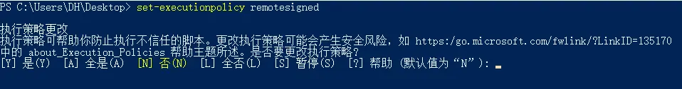

    > 当你遇见类似于以下的语句：  
>     > 无法加载文件 C:\\Users\\DH\\Desktop\\cs\\rename.ps1，因为在此系统上禁止运行脚本。有关详细信息，请参阅 https:/go.microsoft.com/fwlink/?LinkID=135170 中的 about_Execution_Policies。

    

    我们首先可以“试图”去参阅在Microsoft官网的文档：[关于执行策略 - PowerShell | Microsoft Learn](<https://learn.microsoft.com/zh-cn/powershell/module/microsoft.powershell.core/about/about_execution_policies?view=powershell-7.3>)

    

    * * *

    

    > 

>     
>     ## 长说明
>     
>     

>     
>     PowerShell 执行策略是一项安全功能，用于控制 PowerShell 加载配置文件和运行脚本的条件。 此功能有助于防止恶意脚本的执行。
>     
>     

>     
>     本地计算机和当前用户的执行策略存储在注册表中。 无需在 PowerShell 配置文件中设置执行策略。 特定会话的执行策略仅存储在内存中，在会话关闭时会丢失。
>     
>     

>     
>     执行策略不是限制用户操作的安全系统。 例如，当用户无法运行脚本时，可以通过在命令行中键入脚本内容来轻松绕过策略。 相反，执行策略可帮助用户设置基本规则，并防止他们无意中违反这些规则。
>     
>     

>     
>     在非 Windows 计算机上，默认执行策略是 **Unrestricted**  且无法更改。 cmdlet Set-ExecutionPolicy 可用，但 PowerShell 会显示一条控制台消息，指出它不受支持。 虽然Get-ExecutionPolicy在非 Windows 平台上返回**Unrestricted** ，但该行为确实匹配，**Bypass** 因为这些平台不实现Windows 安全中心区域。
>     
>     
——又长又臭

    

    * * *

    

    研究了一下，大致有一下七种限制策略：

    

    ### AllSigned

    

    

        * 脚本可以运行。

        * 要求所有脚本和配置文件都由受信任的发布者签名，包括在本地计算机上编写的脚本。

        * 从尚未分类为受信任或不受信任的发布者运行脚本之前，会提示你。

        * 运行已签名但恶意脚本的风险。

    ### Bypass

    

    

        * 不阻止任何操作，并且没有任何警告或提示。

        * 此执行策略适用于 PowerShell 脚本内置于较大应用程序的配置，或针对 PowerShell 是具有自身安全模型的程序基础的配置。

    

    

    ### Default

    

    

        * 设置默认执行策略。

        * **Restricted**  适用于 Windows 客户端的 。

        * 适用于 Windows 服务器的 **RemoteSigned** 。

    

    

    ### RemoteSigned

    

    

        * Windows Server 计算机的默认执行策略。

        * 脚本可以运行。

        * 需要受信任的发布者对从 Internet 下载的脚本和配置文件（包括电子邮件和即时消息程序）的数字签名。

        * 不需要在本地计算机上编写且未从 Internet 下载的脚本上使用数字签名。

        * 如果未阻止脚本（例如使用 cmdlet），则运行从 Internet 下载且未签名的 Unblock-File 脚本。

        * 运行来自 Internet 以外的源的未签名脚本以及可能是恶意的已签名脚本的风险。

    

    

    ### Restricted

    

    

        * Windows 客户端计算机的默认执行策略。

        * 允许单个命令，但不允许脚本。

        * 阻止运行所有脚本文件，包括格式化和配置文件 () .ps1xml 、模块脚本文件 (.psm1) ，以及 PowerShell 配置文件 () .ps1 。

    

    

    ### Undefined

    

    

        * 当前范围内没有设置执行策略。

        * 如果所有范围内的执行策略都是 **Undefined** ，则有效的执行策略 **Restricted**  适用于 Windows 客户端， **RemoteSigned**  适用于 Windows Server。

    

    

    ### Unrestricted

    

    

        * 非 Windows 计算机的默认执行策略，无法更改。

        * 未签名的脚本可以运行。 存在运行恶意脚本的风险。

        * 在运行不来自本地 Intranet 区域的脚本和配置文件之前警告用户。

    * * *

    

    所以总结来讲，就是默认不允许执行脚本，所以只要修改这个策略就可以完成了

    

    然后我们转到“**使用 PowerShell 管理执行策略** ”

    

    以下命令获取有效的执行策略：

    

    
    **Get-ExecutionPolicy**

**更改执行策略**

若要更改执行策略，请执行以下操作：

    
    Set-ExecutionPolicy -ExecutionPolicy <PolicyName>

例如：

    
    Set-ExecutionPolicy -ExecutionPolicy RemoteSigned

若要在特定范围内设置执行策略，请执行以下操作：

    
    Set-ExecutionPolicy -ExecutionPolicy <PolicyName> -Scope <scope>

例如：

    
    Set-ExecutionPolicy -ExecutionPolicy RemoteSigned -Scope CurrentUser

所以最后我们的解决方案是……

全部更改（懒）（图源：[PowerShell：因为在此系统上禁止运行脚本，解决方法 - 简书 (jianshu.com)](<https://www.jianshu.com/p/4eaad2163567>)）

至此，大概可以解决一类脚本无法执行的问题了
