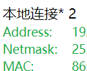
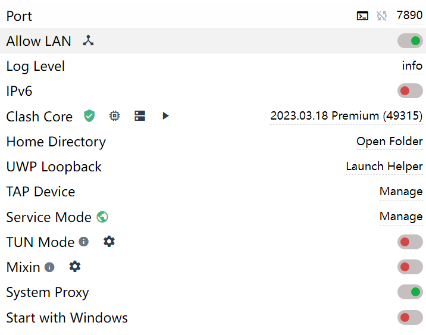

\n
    
    hp chromebook13 g1 16+32版配置流程
    
    \n\n\n\n\n\n\n\n
    
           众所周知的原因，垃圾佬很喜欢捣鼓一些洋垃圾，价格便宜但是会有很有意思的特点。比如因为系统原因国内并不能以正常途径使用的、搭载ChromeOS的一类产品——Chromebook笔电。这一类多为轻薄本，架构兼具x86与arm系列（应该？我记得都有）然后巴拉巴拉，反正最早我对于Chromebook的印象，是满足最低使用需求的一类笔记本，在国外价格也不贵，大多数都是低劣一点的键盘什么的。
    
    \n\n\n\n
    
            最近手头恰好有一定的结余，于是在闲鱼研究起Chromebook一类的产品，价格大多在400-2000不等，价格破千的大多是硬盘空间充足、成色品质都还不错的一类，而千元以下的，就比较符合我“低劣”、“能用”的第一印象。但是在我对于轻型工作的迫切希望，我还是入了这个价位的本子。最终没有选择Lenovo 10e主要是因为屏幕太小，10寸在一些情境下还是太局促了，虽然确实是pad类产品的最佳尺寸。这一款也有个好处，内存16g算是比较富足的了，ddr3且不去说，不打游戏，不跑高负载还是不错的。
    
    \n\n\n\n
    
    本子到手之后，给人的质感是很不错的。金属机身，logo和chrome标都很明亮，有一些使用痕迹（这一款电池寿命只有79%，算是二手类的瑕疵了，估计是吃了几年灰），其他一切ok。扬声器位于屏幕下侧，B&O单排扬声器。品牌很硬，所以单排效果也还行。反正我是木鱼耳朵（划掉）。
    
    \n\n\n\n
    
    最艰难的部分就是Chrome系统的激活，由于各位都知道的缘故，我们是无法链接某某的官方服务器的，所以需要某种手段。但是你在激活系统前是无法操作系统的，比如你仰赖的加速器就不能装，那么这些手段必须都在系统外做好。一开始我是打算用手机netshare给电脑的，这样电脑就可以启航了，结果一直行不通（感觉是我的手机代理不太对劲），所以反复试了很久还是不管用。最后试用了win11的网络共享，这里我是用clash的，allow LAN并且打开电脑防火墙的限制之后，在Chromebook上面修改网络设置，手动调节代理设置（IP地址自己cmd用ipconfig查询即可，然后按着clash显示的端口作为代理即可）
    
    \n\n\n\n
    
    最终反正就是用这样一种方式实现了激活。激活之后第一件事，看看Google Play有什么是可以安装的。QQ是没有的（所以后来我安装了Linux 版本的（喜）），play商店之外的apk是不允许安装的，除非开启开发者模式（同学的开启开发者后主板挂了，所以我不敢了）还有一个途径就是通过adb安装，但是新版的系统找不到adb开关了（？）所以我最后没有成功（心碎）。
    
    \n\n\n\n
    
    其他……之后再补吧。
    
    \n\n\n\n
    
    补图片了！
    
    \n\n\n\n\n\n\n\n
    
    最后的ip地址在这里找，网关在clash里面
    
    \n\n\n\n\n\n\n\n
    
    TUN不建议打开
    
    \n