\n

## 网络节点

\n\n\n\n

LAN/WAN  
LAN:error rate is easier controlled  
WAN: 多个公司分段运营

\n\n\n\n

调制解调器（Modem）是一种用于将数字信号转换为模拟信号（调制）和将模拟信号转换为数字信号（解调）的设备。它的名称来自于"调制解调器"一词的缩写。[su_accordion][su_spoiler title="open" open="no" style="default" icon="plus" anchor="" anchor_in_url="no" class=""]

\n\n\n\n

在计算机网络和通信中，调制解调器起到了连接计算机或终端设备与通信线路之间的桥梁作用。它允许数字设备通过模拟传输介质（如电话线）进行数据通信。

\n\n\n\n

调制解调器的主要功能如下：

\n\n\n\n

\n
  1. 调制（Modulation）：在发送数据时，调制解调器将数字信号转换为模拟信号。这是通过将数字信号与载波信号相结合来实现的。调制的目的是将数字信号调整为适合于传输的模拟信号，以便能够在传输介质上传送。
\n\n\n\n
  2. 解调（Demodulation）：在接收数据时，调制解调器将模拟信号转换为数字信号。它从传输介质接收模拟信号，并将其转换为与原始数字信号相对应的数字形式。
\n\n\n\n
  3. 数据传输：调制解调器负责将数字数据转换为模拟信号进行传输，并在接收端将模拟信号转换回数字形式。它在数字设备（如计算机、路由器等）和传输介质之间建立了数据通信通道。
\n
\n\n\n\n

[/su_spoiler] [/su_accordion]

\n\n\n\n

DSU（Data Service Unit）是一种网络设备，用于在数字通信网络中提供数据接口和转换功能。DSU通常与调制解调器（Modem）结合使用，用于将数字信号转换为传输介质上的模拟信号，并提供数据传输的接口。[su_accordion][su_spoiler title="open" open="no" style="default" icon="plus" anchor="" anchor_in_url="no" class=""]

\n\n\n\n

DSU的主要功能包括：

\n\n\n\n

\n
  1. 接口转换：DSU将数字设备（如计算机、路由器等）生成的数字信号转换为适合传输介质的模拟信号。它充当数字信号与模拟信号之间的接口转换器。
\n\n\n\n
  2. 时钟和定时：DSU负责提供传输介质上的时钟信号和定时功能。这对于数据传输的同步性非常重要，以确保数据在传输过程中的准确性和可靠性。
\n\n\n\n
  3. 压缩和调整：DSU可以对数字信号进行压缩和调整，以便在传输介质上有效利用带宽和资源。
\n\n\n\n
  4. 错误检测和纠正：DSU可用于检测和纠正传输过程中的错误。它可以识别并纠正传输中的位错误、丢失的数据包或其他传输中的问题。
\n\n\n\n
  5. 接口配置和管理：DSU提供接口配置和管理功能，包括调整传输速率、协议设置、参数配置等，以确保与网络的兼容性和正常运行。
\n
\n\n\n\n

DSU常见的应用场景包括数字电话网络（Digital Voice Network）、ISDN（Integrated Services Digital Network）、T1/E1传输线路等。它们通过将数字信号转换为模拟信号，并提供适当的接口和功能，实现了数字设备与传输介质之间的互联和数据传输。

\n\n\n\n

[/su_spoiler] [/su_accordion]

\n\n\n\n

OSI基本模型  
[一文看懂网络七层协议/OSI七层模型 (zhihu.com)](<https://www.zhihu.com/tardis/zm/art/296670054?source_id=1005>)

\n\n\n\n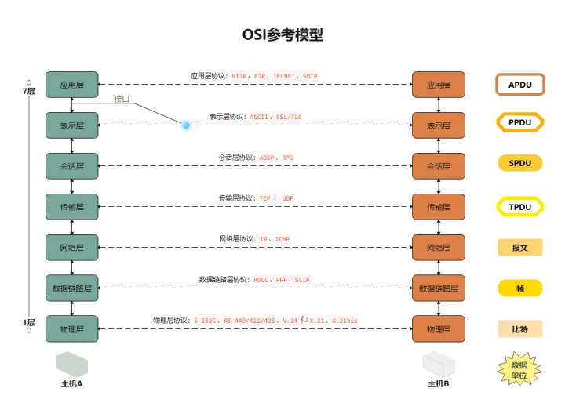\n\n\n\n

\n\n\n\n

**1.2网络边缘**

\n\n\n\n

网络设备通过基础设施，然后连接到网络核心

\n\n\n\n

在计算机网络中，"forward"（转发）是指**将数据包从一个网络节点传递到下一个网络节点的过程** 。当数据包到达网络节点时，该节点根据目标地址或其他路由规则决定将数据包发送到哪个下一跳节点。这个过程被称为转发。

\n\n\n\n

在路由器、交换机等网络设备中，转发是指根据目标地址查找路由表并**将数据包发送到正确的接口** ，以便将数据包传递到目标设备或下一个网络节点。转发是网络设备的核心功能之一，它确保数据包能够正确地在网络中传递，并按照预定的路径到达目标位置。

\n\n\n\n

转发过程通常包括查找目标地址、选择下一跳节点、更新数据包的目标地址等操作。它是网络通信中的关键步骤，确保数据能够有效地在网络中传输和路由。

\n\n\n\n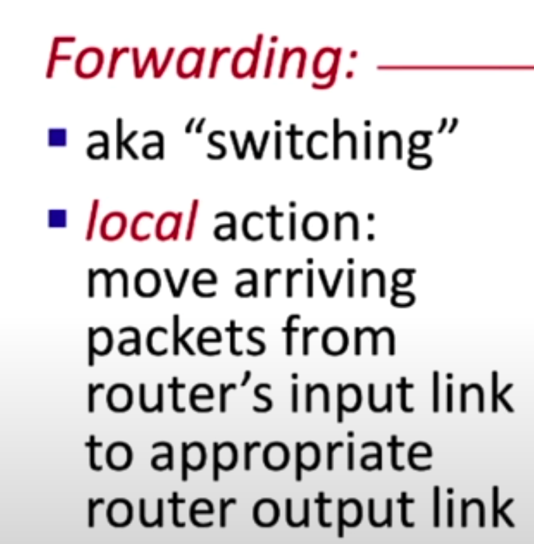\n\n\n\n

在计算机网络中，"routing"（路由）指的是确定数据包从源节点到目标节点的路径或路由路径的过程。它是网络中**实现数据包从源到目标的传输** 的关键任务。

\n\n\n\n

当一个数据包从源节点发送到目标节点时，它需要经过多个中间节点或网络设备。路由是指在这些节点之间选择合适的路径，以确保数据包按预期的方式传输。这个过程涉及到网络设备（如路由器）根据路由表、路由协议或其他路由算法来决定数据包的下一跳节点。

\n\n\n\n

路由的目标是**选择最佳路径** ，以**最小化延迟、最大化带宽利用率** ，并避免网络拥塞和故障。路由算法可以根据不同的标准和策略进行优化，例如最短路径优先、带宽感知路由、负载均衡等。

\n\n\n\n

在路由过程中，路由器或其他网络设备根据目标地址和路由表进行转发决策，将数据包发送到正确的接口和下一跳节点。这样，数据包就可以通过一系列的中间节点最终到达目标节点。

\n\n\n\n

总而言之，路由是确定数据包传输路径的过程，它在计算机网络中起到了连接源和目标节点的关键作用。

\n\n\n\n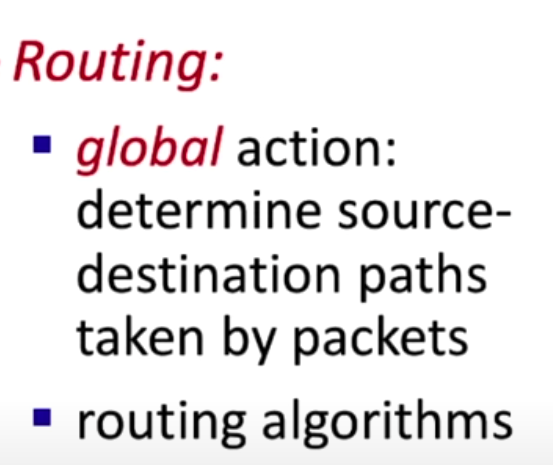\n\n\n\n

在网络领域，数据包传输延迟（Package Transmission Delay）是指从源节点发送数据包到目标节点的整个传输过程中所经历的时间延迟。

\n\n\n\n

数据包传输延迟由以下几个主要组成部分构成：

\n\n\n\n

\n
  1. 处理延迟（Processing Delay）：发送节点在将数据包从发送缓冲区移动到网络接口的时间延迟。这包括对数据包的处理、封装和排队等操作。
\n\n\n\n
  2. 排队延迟（Queuing Delay）：当数据包在网络节点的输出队列中等待发送时所引起的延迟。这是由于共享的链路带宽被其他数据包占用而导致的等待时间。
\n\n\n\n
  3. 传输延迟（Transmission Delay）：数据包从发送节点到接收节点所需的时间，取决于数据包的大小和链路的传输速率。较大的数据包和较慢的传输速率会增加传输延迟。
\n\n\n\n
  4. 传播延迟（Propagation Delay）：数据包在传输媒介（如电缆、光纤）中传播所需的时间延迟。传播延迟取决于物理距离和传输介质的信号传播速度。
\n
\n\n\n\n

这些延迟因素的总和形成了数据包传输延迟。理解和优化数据包传输延迟对于设计和管理高效的网络通信非常重要

\n\n\n\n

数据包传输延迟可以使用以下公式来计算：

\n\n\n\n

传输延迟 = 大小 / 传输速率

\n\n\n\n

其中：

\n\n\n\n

\n
  * 大小表示数据包的大小，通常以比特（bits）或字节（bytes）为单位。
\n\n\n\n
  * 传输速率表示数据包在传输链路上的传输速度，通常以比特每秒（bps）或字节每秒（Bps）为单位。
\n
\n\n\n\n

传输延迟只考虑了数据包在传输链路上的传输时间，不包括其他延迟因素（如处理延迟、排队延迟和传播延迟）。

\n\n\n\n

如果要计算整个数据包传输过程的延迟，需要考虑以上提到的所有延迟因素，并将它们相加。

\n\n\n\n

总传输延迟 = 处理延迟 + 排队延迟 + 传输延迟 + 传播延迟

\n\n\n\n

三种交换模式

\n\n\n\n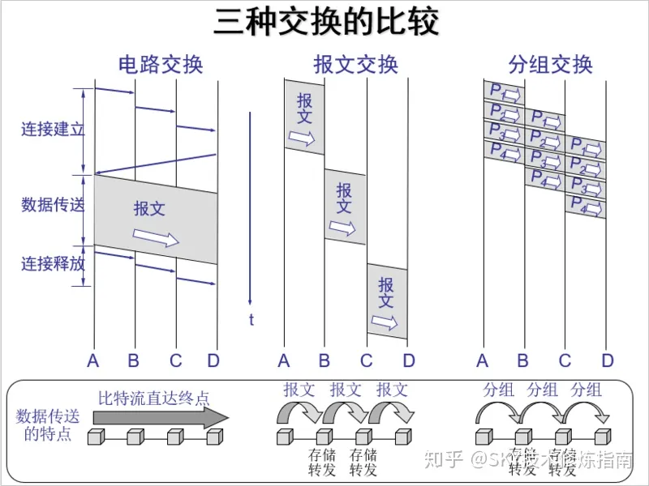\n\n\n\n

## **电路交换**

\n\n\n\n

电路交换需要建立一条专用的数据通信路径，这条路径上可能包含许多中间节点。这条通信路径在整个通信过程中将被独占，直到通信结束才会释放资源。电路交换适合实时性要求较高的大量数据传输的情况。

\n\n\n\n

电路交换的优点主要包括以下几个方面：

\n\n\n\n

\n
  * 通信时延小。通信双方通过专用线路进行通信，数据可以直达。当数据传输量较大时，优点将十分显著。
\n\n\n\n
  * 线路独占，没有冲突。
\n\n\n\n
  * 实时性强。一旦通信线路建立，双方可以实时通信。
\n
\n\n\n\n

电路交换的缺点主要包括以下几个方面：

\n\n\n\n

\n
  * 线路独占，利用率太低。
\n\n\n\n
  * 连接建立时间过长。
\n
\n\n\n\n

## **报文交换**

\n\n\n\n

报文交换以报文作为数据传输单位，携带有源地址和目的地址等信息。

\n\n\n\n

报文交换的优点主要包括以下几个方面：

\n\n\n\n

\n
  * 无需建立连接。
\n\n\n\n
  * 动态分配线路。
\n\n\n\n
  * 线路利用率高。
\n
\n\n\n\n

报文交换的缺点主要包括以下几个方面：

\n\n\n\n

\n
  * 报文交换对报文的大小没有限制，需要网络节点有足够的缓存空间。
\n\n\n\n
  * 报文交换在节点处要经历存储、转发等操作，从而引起一定时延。
\n
\n\n\n\n

## **分组交换**

\n\n\n\n

分组交换是将大的数据块分割成小的分组，并添加源地址、目的地址和分组编号等信息。

\n\n\n\n

分组交换的优点主要包括以下几个方面：

\n\n\n\n

\n
  * 无需建立连接。
\n\n\n\n
  * 线路利用率高。
\n\n\n\n
  * 相对报文交换，分组长度固定，缓冲区容易管理。
\n\n\n\n
  * 分组比报文小，因此传输时间更短。
\n
\n\n\n\n

分组交换的缺点主要包括以下几个方面：

\n\n\n\n

\n
  * 仍然存在时延。
\n\n\n\n
  * 需要传输包括源地址、目的地址、分组编号等额外信息。
\n\n\n\n
  * 分组可能遇到失序、丢失、重复等问题。
\n
\n\n\n\n

关于电路传输

\n\n\n\n

多路复用（Multiplexing）是一种将多个信号或数据流合并到一个共享通信介质或通道中的技术。它允许多个独立的信号同时传输，以提高通信资源的利用率。

\n\n\n\n

在多路复用中，原始信号或数据流被分割成多个较小的单元，每个单元称为一个信道或子通道。这些信道可以在时间、频率或码元上进行复用，并通过共享通信介质进行传输。

\n\n\n\n

主要的多路复用技术包括：

\n\n\n\n

\n
  1. 时间分割多路复用（Time Division Multiplexing，TDM）：将时间分成固定的时隙，并在每个时隙中传输不同的信号。接收方根据时间隙来分离和恢复原始信号。
\n\n\n\n
  2. 频分多路复用（Frequency Division Multiplexing，FDM）：将频谱划分为不重叠的频带，每个频带用于传输一个独立的信号。接收方根据频带来分离和恢复原始信号。
\n
\n\n\n\n

ISP是互联网服务提供商（Internet Service Provider）的缩写，指的是提供互联网接入服务的公司或组织。

\n\n\n\n

ISP负责向个人用户、家庭、企业和其他组织提供连接到互联网的服务。它们提供了广域网（WAN）连接，使用户能够通过各种方式访问互联网，包括拨号连接、宽带连接（如数字用户线路、光纤、电缆、DSL）和无线连接（如无线局域网、移动网络）等。

\n\n\n\n

以下是ISP的一些常见特点和功能：

\n\n\n\n

\n
  1. 互联网接入：ISP提供用户连接到互联网的基础设施和服务。它们通过自己的网络设备和基础设施与互联网上的其他网络进行连接。
\n\n\n\n
  2. IP地址分配：ISP负责分配给用户公共IP地址或私有IP地址，以便用户能够在互联网上进行通信和访问。
\n\n\n\n
  3. 带宽提供：ISP提供不同带宽容量的互联网连接，以满足用户的需求。带宽通常以每秒传输的数据量（如Mbps、Gbps）来衡量。
\n\n\n\n
  4. 电子邮件和网页托管：一些ISP提供电子邮件服务和网页托管服务，使用户能够创建和管理自己的电子邮件账户和网站。
\n\n\n\n
  5. 互联网安全：ISP通常提供一些安全功能和服务，如防火墙、反病毒软件和垃圾邮件过滤器，以保护用户的网络和数据安全。
\n\n\n\n
  6. 技术支持：ISP提供技术支持，帮助用户解决与互联网连接和服务相关的问题，例如连接故障、速度问题和配置设置等。
\n
\n\n\n\n

IXP指的是互联网交换点（Internet Exchange Point）。它是一个物理设施，旨在促进不同互联网服务提供商（ISP）、内容交付网络（CDN）和其他网络运营商之间的互联互通。

\n\n\n\n

**traceroute程序** 是网络诊断中的一个重要工具。它用于跟踪数据包从源到目的地通过的每个网络节点或路由器。

\n\n\n\n

以下是traceroute程序的一些主要功能和特点:

\n\n\n\n

它能够追踪从源主机到目标主机的数据包路径,输出每个节点(如路由器)的IP地址和响应时间。

\n\n\n\n

每个数据包都设置不同的TTL(Time To Live)值,TTL值超时后路由器就会返回一个ICMP错误。通过侦测ICMP错误来确定数据包通过了哪些中继点。

\n\n\n\n

它能够检测网络中是否存在问题,例如过慢的节点、路由错误或网络拥堵。

\n\n\n\n

常用来诊断网络连接问题,定位问题发生的具体位置,如网络中断的部位。

\n\n\n\n

支持TCP和UDP协议跟踪。默认使用ICMP协议进行交互。

\n\n\n\n

traceroute显示的数据包通过的每个节点情况,有助于网络管理员分析和诊断网络问题。

\n\n\n\n

Example: organization of air travel

\n\n\n\n

a really complex system

\n\n\n\n

so layering is a efficient approach to implement such a system

\n\n\n\n

网络分层(Layered Internet Protocol Stack)

\n\n\n\n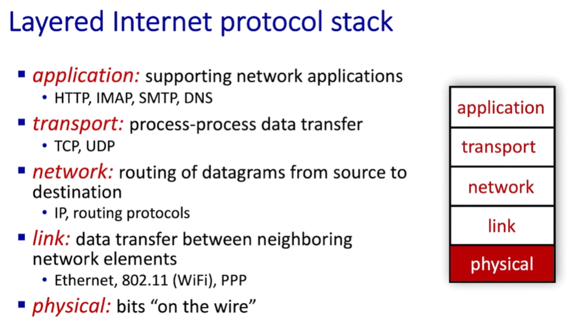\n\n\n\n

**OSI参考模型** 采用的分层设计原则允许上层协议可以一直使用下层协议提供的功能和服务。

\n\n\n\n

具体来说:

\n\n\n\n

\n
  * 每个层级由一个或多个协议组成,完成指定的功能模块。
\n\n\n\n
  * 每层协议通过标准接口向上层和下层提供服务。
\n\n\n\n
  * 上层协议调用下层接口使用下层功能,但无需了解下层的具体实现细节。
\n\n\n\n
  * 下层改进或更新时,不影响依赖其服务的上层运作。
\n
\n\n\n\n

例如:

\n\n\n\n

\n
  * 应用层HTTP协议使用TCP传输功能完成可靠传输,但不关心TCP三次握手细节。
\n\n\n\n
  * TCP使用IP寻址和转发服务传输数据包,但不依赖IP的特定路由算法。
\n\n\n\n
  * IP转发数据包使用以太网硬件,但独立于以太网标准的修改。
\n
\n\n\n\n

所以分层模型的关键在于,每层通过标准接口完成独立功能模块化,上下层通过这些接口实现解耦合。

\n\n\n\n

**Application Layer**

\n\n\n\n

## **应用层协议原理**

\n\n\n\n

**研发网络应用程序的核心是写出能够运行在不同的端系统和通过网络彼此通信的程序** 。例如，在网络应用程序中，有两个互相通信的不同程序：**一个是运行在用户主机上的浏览器程序；另一个是运行在 Web 服务器主机上的 Web 服务器程序** 。

\n\n\n\n

client-server architecture

\n\n\n\n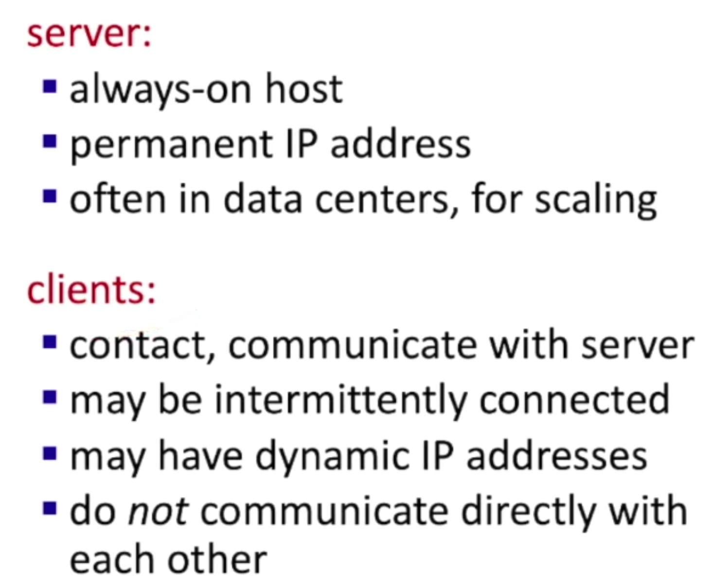\n\n\n\n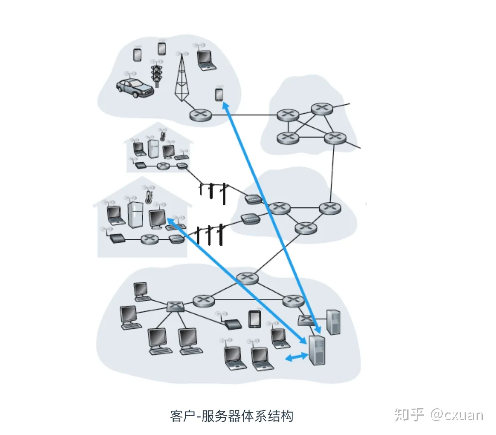\n\n\n\n

peer to peer architecture

\n\n\n\n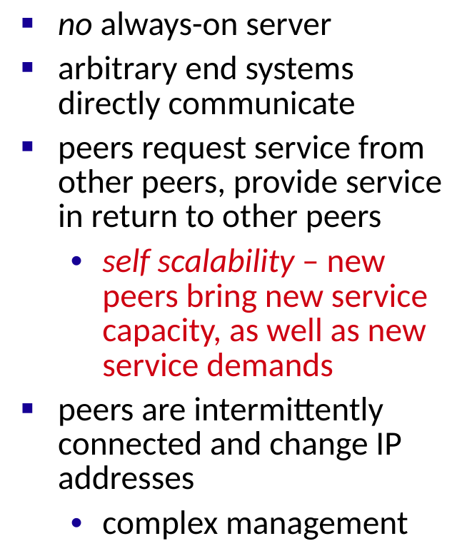\n\n\n\n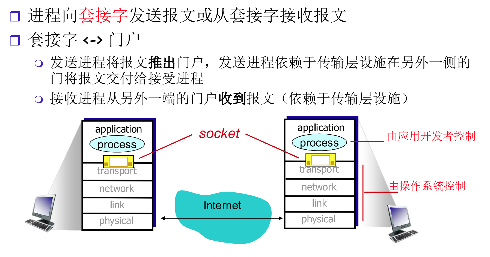\n\n\n\n

HTTP protocol

\n\n\n\n

**HTTP**  是一种用作获取诸如 HTML 文档这类资源的[协议](<https://developer.mozilla.org/zh-CN/docs/Glossary/Protocol>)。它是 Web 上进行任何数据交换的基础，同时，也是一种客户端—服务器（client-server）协议，也就是说，请求是由接受方——通常是浏览器——发起的。一个完整网页文档是由获取到的不同文档组件——像是文本、布局描述、图片、视频、脚本等——重新构建出来的。

\n\n\n\n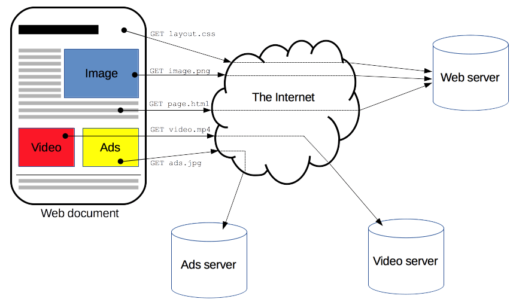\n\n\n\n

HTTP 连接的两种方式：persistent and non-persistent

\n\n\n\n

non-persistent 示例

\n\n\n\n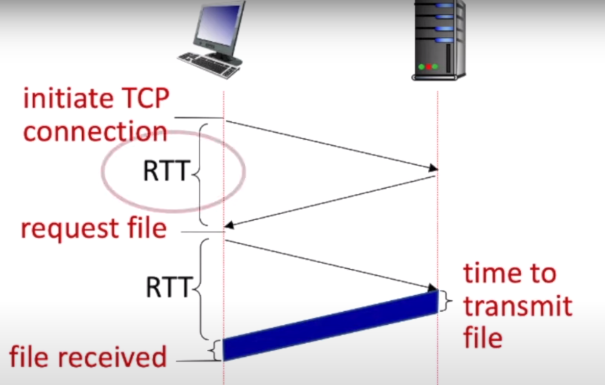\n\n\n\n

so it requires to RTTs for a single file 

\n\n\n\n

HTTP Request message:

\n\n\n\n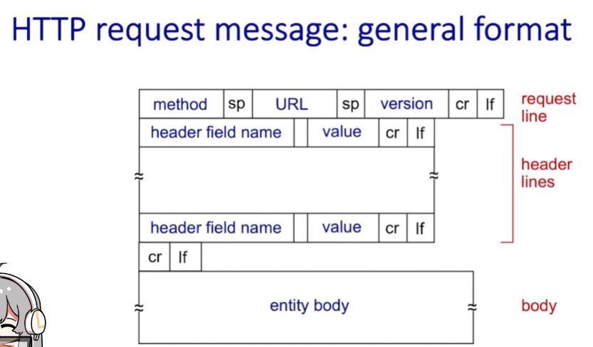\n\n\n\n

hTTP Respond message:

\n\n\n\n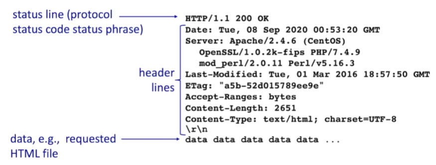\n\n\n\n

response status code:类似于404之类

\n\n\n\n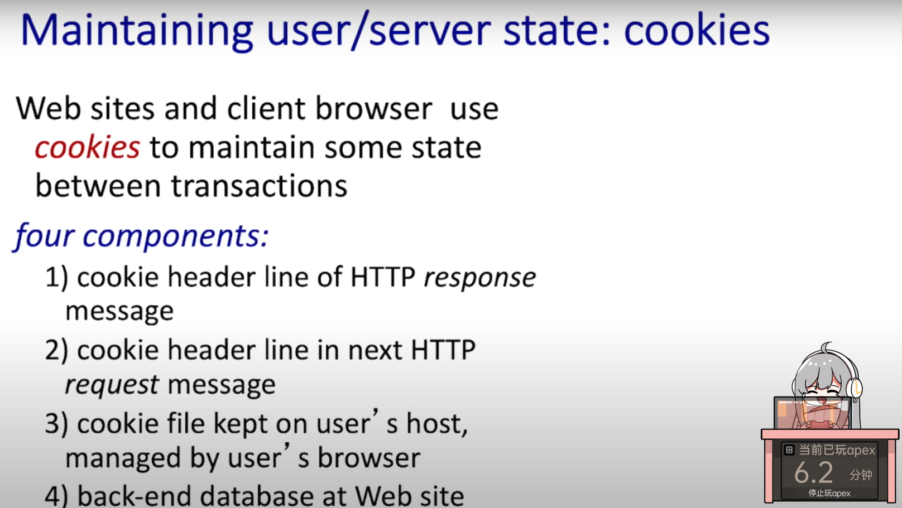\n\n\n\n

\n\n\n\n

6f计网整理

\n\n\n\n

OSI Layer1 :Physical Layer

\n\n\n\n

LAN Media:  
using encoding to transmit data

\n\n\n\n

常用的编码方式包括归零制，不归零制，曼彻斯特，差分曼彻斯特  
而常见的带通调制方式包括调幅（AM）调频（FM）调相（PM）

\n\n\n\n

物理媒介：  
STP->屏蔽双绞线

\n\n\n\n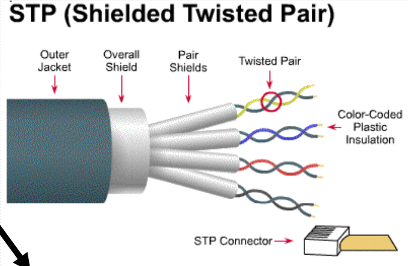\n\n\n\n

ScTP->网屏式双绞线

\n\n\n\n

UTP->非屏蔽双绞线

\n\n\n\n

### [STP](<https://github.com/1Lucifer1/NJUSE-courses-from-YuLinLiu/blob/master/%E4%BA%92%E8%81%94%E7%BD%91%E8%AE%A1%E7%AE%97/%E7%9F%A5%E8%AF%86%E7%82%B9/2.%20Physical%20Layer.md#stp>)

\n\n\n\n

\n
  * 由8根不同颜色的线分成4对绞合在一起，无金属屏蔽材料。
\n\n\n\n
  * 每根线外使用有颜色的塑料隔离。每两根线一个壳，八根线共一个壳， 最外层一个外部护套 。
\n\n\n\n
  * 规格：1G-10G速率
\n\n\n\n
  * 距离：100米
\n
\n\n\n\n

### [UTP](<https://github.com/1Lucifer1/NJUSE-courses-from-YuLinLiu/blob/master/%E4%BA%92%E8%81%94%E7%BD%91%E8%AE%A1%E7%AE%97/%E7%9F%A5%E8%AF%86%E7%82%B9/2.%20Physical%20Layer.md#utp>)

\n\n\n\n

\n
  * 是一种广泛用于数据传输的铜质双绞线。
\n\n\n\n
  * 由4对细铜线组成， 每根线外使用颜色的塑料隔离。八根线共一个壳，最外层一个外部护套 。
\n\n\n\n
  * 规格：1G-10G速率
\n\n\n\n
  * 距离：100米
\n
\n\n\n\n

### [ScTP](<https://github.com/1Lucifer1/NJUSE-courses-from-YuLinLiu/blob/master/%E4%BA%92%E8%81%94%E7%BD%91%E8%AE%A1%E7%AE%97/%E7%9F%A5%E8%AF%86%E7%82%B9/2.%20Physical%20Layer.md#sctp>)

\n\n\n\n

\n
  * 是一种广泛用于数据传输的铜质双绞线。// 注意，这里的2,3两种虽然都是屏蔽双绞线，但是它们的结构略有不同，详见第2章ppt的7、8两页。此处的ScTP不是著名的SCTP协议
\n\n\n\n
  * 由4对细铜线组成， 每根线外使用 颜色的 塑料隔离。只有最外层一个外部护套 。
\n
\n\n\n\n

### [STP和ScTP的优点](<https://github.com/1Lucifer1/NJUSE-courses-from-YuLinLiu/blob/master/%E4%BA%92%E8%81%94%E7%BD%91%E8%AE%A1%E7%AE%97/%E7%9F%A5%E8%AF%86%E7%82%B9/2.%20Physical%20Layer.md#stp%E5%92%8Csctp%E7%9A%84%E4%BC%98%E7%82%B9>)

\n\n\n\n

\n
  * 比 UTP 抗外部干扰的能力强 。
\n
\n\n\n\n

### [STP和ScTP的缺点](<https://github.com/1Lucifer1/NJUSE-courses-from-YuLinLiu/blob/master/%E4%BA%92%E8%81%94%E7%BD%91%E8%AE%A1%E7%AE%97/%E7%9F%A5%E8%AF%86%E7%82%B9/2.%20Physical%20Layer.md#stp%E5%92%8Csctp%E7%9A%84%E7%BC%BA%E7%82%B9>)

\n\n\n\n

\n
  * 信号传播距离较短；
\n\n\n\n
  * 隔离层极大地增加了线缆的大小、重量和价格
\n\n\n\n
  * 金属屏蔽层必须接地， 线缆难以安装 。
\n
\n\n\n\n

### [UTP的优点](<https://github.com/1Lucifer1/NJUSE-courses-from-YuLinLiu/blob/master/%E4%BA%92%E8%81%94%E7%BD%91%E8%AE%A1%E7%AE%97/%E7%9F%A5%E8%AF%86%E7%82%B9/2.%20Physical%20Layer.md#utp%E7%9A%84%E4%BC%98%E7%82%B9>)

\n\n\n\n

\n
  * 线缆不需要接地，因此便于在线缆末端加上连接器；
\n\n\n\n
  * 价格低廉；
\n\n\n\n
  * 直径小直径小，，因此安装简单且因此安装简单且更适合安装在更适合安装在管道中；
\n\n\n\n
  * 和其他铜传输介质具有一样的数据传输速率；
\n\n\n\n
  * 使用RJ连接器后极大地降低了噪音的影响。
\n
\n\n\n\n

### [UTP的缺点](<https://github.com/1Lucifer1/NJUSE-courses-from-YuLinLiu/blob/master/%E4%BA%92%E8%81%94%E7%BD%91%E8%AE%A1%E7%AE%97/%E7%9F%A5%E8%AF%86%E7%82%B9/2.%20Physical%20Layer.md#utp%E7%9A%84%E7%BC%BA%E7%82%B9>)

\n\n\n\n

\n
  * 更容易受到电子噪音和干扰的影响；
\n\n\n\n
  * 相对于同轴电缆和相对于同轴电缆和光缆而言光缆而言，能支持的线缆长度较，能支持的线缆长度较短。
\n
\n\n\n\n

同轴电缆：

\n\n\n\n

\n
  * 铜导线，外部包有绝缘塑料， 再外层是铜网屏蔽层， 最外层是外部护套。
\n\n\n\n
  * 细：传的近，粗：传的远
\n\n\n\n
  * 规格：1G-10G速率
\n\n\n\n
  * 距离：500米（距离比双绞线远）
\n
\n\n\n\n

无需中继器既可以传输较远距离

\n\n\n\n

光缆：

\n\n\n\n

\+ 距离长，不容易坏，但是贵

\n\n\n\n

#### [Single Mode（单模光纤）](<https://github.com/1Lucifer1/NJUSE-courses-from-YuLinLiu/blob/master/%E4%BA%92%E8%81%94%E7%BD%91%E8%AE%A1%E7%AE%97/%E7%9F%A5%E8%AF%86%E7%82%B9/2.%20Physical%20Layer.md#single-mode%E5%8D%95%E6%A8%A1%E5%85%89%E7%BA%A4>)

\n\n\n\n

\n
  * 轴传播
\n\n\n\n
  * 比多模光纤快，传输距离长
\n\n\n\n
  * 较多使用在WAN
\n\n\n\n
  * 直径小，没反射
\n\n\n\n
  * 通常使用激光器型发送器，也使用发光二极管 。
\n
\n\n\n\n

#### [Multimode（多模光纤）](<https://github.com/1Lucifer1/NJUSE-courses-from-YuLinLiu/blob/master/%E4%BA%92%E8%81%94%E7%BD%91%E8%AE%A1%E7%AE%97/%E7%9F%A5%E8%AF%86%E7%82%B9/2.%20Physical%20Layer.md#multimode%E5%A4%9A%E6%A8%A1%E5%85%89%E7%BA%A4>)

\n\n\n\n

\n
  * 光以不同的角度进入光纤；不同角度识别光信号
\n\n\n\n
  * 直径比单模光纤大；
\n\n\n\n
  * 多用在 LAN 中；多路传输
\n\n\n\n
  * 能量损耗较大。
\n
\n\n\n\n

#### [双绞线分类](<https://github.com/1Lucifer1/NJUSE-courses-from-YuLinLiu/blob/master/%E4%BA%92%E8%81%94%E7%BD%91%E8%AE%A1%E7%AE%97/%E7%9F%A5%E8%AF%86%E7%82%B9/2.%20Physical%20Layer.md#%E5%8F%8C%E7%BB%9E%E7%BA%BF%E5%88%86%E7%B1%BB>)

\n\n\n\n

\n
  * 一类线：主要用于语音传输，不用于数据传输（两根线双绞）
\n\n\n\n
  * 二类线：传输频率1MHz，用于语音和最高4Mbps的数据传输，常见于令牌网
\n\n\n\n
  * 三类线：EIA/TIA568标准指定电缆，传输频率16MHz，用于语音传输及最高传输速率为10Mbps的数据传输，主要用于10BASE-T （以太网开始）
\n\n\n\n
  * 四类线：传输频率为20MHz，用于语音传输和最高传输速率16Mbps的数据传输，主要用于令牌网和 10BASE-T/100BASE-T
\n\n\n\n
  * 五类线：增加了绕线密度，外套高质量绝缘材料，用于语音和数据传输(主要为100/1000BASE-T)，是最常用的以太网电缆（5MB带宽、规格化，更高的绞合度）
\n\n\n\n
  * 超五类线：衰减小，串扰少，具有更高的衰减/串扰比和信噪比、更小的时延误差，主要用于1000BASE-T
\n\n\n\n
  * 六类线：传输频率为1MHz～250MHz，性能远高于超五类标准，适用于高于1Gbps的应用
\n\n\n\n
  * 七类线：带宽为600MHz，可能用于今后的10G比特以太网。
\n
\n\n\n\n

线缆类型

\n\n\n\n

\n
  * Straight Cable（直通线）\n\n
    * 发送数据一致。
\n\n\n\n
    * 1号引脚与1号引脚相连，2号与2号相连，其他依次类推，两端设备使用相同的引脚（T568A或T568B）。
\n\n\n\n
    * 主机 - 交换机，交换机 - 路由器
\n\n\n\n
    * 两台设备使用的传输引脚不同时使用直通线
\n\n
\n\n\n\n
  * Rollover Cable（全反线）（Console Cable）\n\n
    * 又叫控制台线缆，发的信号和接收的信号是反向的。
\n\n\n\n
    * 1号引脚与8号引脚相连，2号与7号相连，其他依次类推
\n\n\n\n
    * 用于连接PC的串口与路由器或交换机的控制台端口。
\n\n\n\n
    * 连接计算机与网络设备的控制台端口时使用全反线；
\n\n
\n\n\n\n
  * Crossover Cable（交叉线）\n\n
    * 1号引脚与3号引脚相连，2号与6号相连，4号与7号相连，5号与8号相连 。
\n\n\n\n
    * 一边使用T568A，另一边使用T568B
\n\n\n\n
    * 连接相同的设备（Ex. PC - PC）
\n\n\n\n
    * 连接两个交换机后合二为一（8口 + 8口 = 14口）
\n\n\n\n
    * 两台设备使用的传输引脚相同时使用交叉线；
\n\n
\n
\n\n\n\n

Media and signal problems

\n\n\n\n

#### [名词解释](<https://github.com/1Lucifer1/NJUSE-courses-from-YuLinLiu/blob/master/%E4%BA%92%E8%81%94%E7%BD%91%E8%AE%A1%E7%AE%97/%E7%9F%A5%E8%AF%86%E7%82%B9/2.%20Physical%20Layer.md#%E5%90%8D%E8%AF%8D%E8%A7%A3%E9%87%8A-1>)

\n\n\n\n

\n
  * EMI - electromagnetic interference ，电磁干扰
\n\n\n\n
  * late collision：发生在 一个帧传送过程中的前64个字节的冲突。
\n\n\n\n
  * consumption delay：由late collision引起的 延迟。
\n
\n\n\n\n

#### [传输](<https://github.com/1Lucifer1/NJUSE-courses-from-YuLinLiu/blob/master/%E4%BA%92%E8%81%94%E7%BD%91%E8%AE%A1%E7%AE%97/%E7%9F%A5%E8%AF%86%E7%82%B9/2.%20Physical%20Layer.md#%E4%BC%A0%E8%BE%93>)

\n\n\n\n

\n
  * 时间（取决于介质）
\n\n\n\n
  * 散射问题
\n\n\n\n
  * 延时
\n
\n\n\n\n

#### [信号衰减](<https://github.com/1Lucifer1/NJUSE-courses-from-YuLinLiu/blob/master/%E4%BA%92%E8%81%94%E7%BD%91%E8%AE%A1%E7%AE%97/%E7%9F%A5%E8%AF%86%E7%82%B9/2.%20Physical%20Layer.md#%E4%BF%A1%E5%8F%B7%E8%A1%B0%E5%87%8F>)

\n\n\n\n

\n
  * 有限长度下做有效传输
\n
\n\n\n\n

#### [反射](<https://github.com/1Lucifer1/NJUSE-courses-from-YuLinLiu/blob/master/%E4%BA%92%E8%81%94%E7%BD%91%E8%AE%A1%E7%AE%97/%E7%9F%A5%E8%AF%86%E7%82%B9/2.%20Physical%20Layer.md#%E5%8F%8D%E5%B0%84>)

\n\n\n\n

\n
  * 保证介质稳定
\n
\n\n\n\n

#### [干扰](<https://github.com/1Lucifer1/NJUSE-courses-from-YuLinLiu/blob/master/%E4%BA%92%E8%81%94%E7%BD%91%E8%AE%A1%E7%AE%97/%E7%9F%A5%E8%AF%86%E7%82%B9/2.%20Physical%20Layer.md#%E5%B9%B2%E6%89%B0>)

\n\n\n\n

\n
  * EMI
\n\n\n\n
  * 电子干扰
\n\n\n\n
  * 抖动
\n
\n\n\n\n

#### [冲突与冲突域](<https://github.com/1Lucifer1/NJUSE-courses-from-YuLinLiu/blob/master/%E4%BA%92%E8%81%94%E7%BD%91%E8%AE%A1%E7%AE%97/%E7%9F%A5%E8%AF%86%E7%82%B9/2.%20Physical%20Layer.md#%E5%86%B2%E7%AA%81%E4%B8%8E%E5%86%B2%E7%AA%81%E5%9F%9F>)

\n\n\n\n

\n
  * 要对第一层的接入做限制
\n\n\n\n
  * 第二层路由器才能做网络分段
\n
\n\n\n\n

## [Basic Knowledge of Data Communication](<https://github.com/1Lucifer1/NJUSE-courses-from-YuLinLiu/blob/master/%E4%BA%92%E8%81%94%E7%BD%91%E8%AE%A1%E7%AE%97/%E7%9F%A5%E8%AF%86%E7%82%B9/2.%20Physical%20Layer.md#basic-knowledge-of-data-communication>)

\n\n\n\n

\n
  * 信号(signal)——数据的电气的或电磁的表现。\n\n
    * “模拟的”(analogous)\n\n
      * 消息的参数的取值是连续的
\n\n\n\n
      * 模拟信号是随时间变化而平稳变化的连续波形式
\n\n
\n\n\n\n
    * “数字的”(digital)——消息的参数的取值是离散的\n\n
      * 数字信号是离散信号，可能包含有限的几个预定值
\n\n
\n\n
\n\n\n\n
  * 码元(code)——在使用时间域（或简称为时域）的波形表示数字信号时，代表不同离散数值的基本波形。\n\n
    * 定义一个传输单位（不一定是一位）
\n\n\n\n
    * Ex. 8种波形 -> 可传输3位（2^3）
\n\n
\n\n\n\n
  * 波特率（bit）（调制速率）：信号每秒钟变化的次数
\n\n\n\n
  * 比特率（baud）：每秒钟传送的二进制位数。\n\n
    * 波特率与比特率的关系取决于信号值与比特位的关系
\n\n\n\n
    * 例：每个信号值表示为３位，则比特率是波特率的３倍；每个信号值表示为１位，则比特率和波特率相同
\n\n\n\n
    * 对于比特率为a bps的信道，发送８位所需的时间为 8/a秒，若８位为一个周期Ｔ，则一次谐波的频率是：f = a/8 Hz
\n\n
\n\n\n\n
  * 基带：基本频带，指传输变换前所占用的频带，是原始信号所固有的频带 。
\n\n\n\n
  * 基带传输：在传输时直接使用基带数字信号（不转换为模拟信号，即不调制）。
\n\n\n\n
  * Line coding（线路编码）：保证传输内容不被混肴
\n
\n\n\n\n

#### [信号处理](<https://github.com/1Lucifer1/NJUSE-courses-from-YuLinLiu/blob/master/%E4%BA%92%E8%81%94%E7%BD%91%E8%AE%A1%E7%AE%97/%E7%9F%A5%E8%AF%86%E7%82%B9/2.%20Physical%20Layer.md#%E4%BF%A1%E5%8F%B7%E5%A4%84%E7%90%86>)

\n\n\n\n

\n
  * 模拟信号可以被分为简单信号和复合信号\n\n
    * 简单信号（正弦波）不能被分解为更简单的模拟信号
\n\n\n\n
    * 复合信号可以被分解为多个正弦波
\n\n
\n\n\n\n
  * 复合模拟信号的分解：**傅立叶分析**  = 任何波形可用简单信号表示
    * 任何一个周期为T的有理周期性函数 g(t)可分解为若干项（可能无限多项）正弦和余弦函数之和：
​ f = 1/T 基本频率；an, bn ：n次谐波项的正弦和余弦振幅值
\n\n\n\n
  * 数字信号一般是非周期性的，通常在传输介质上表现为方波
\n\n\n\n
  * 一个数字信号可以分解为无穷多个被称为谐波的简单正弦波，每个谐波都具有不同的频率与相位
\n\n\n\n
  * 在介质上发送数字信号时，其实质是在发送无穷多的简单谐波，如果某些分量未能忠实地通过介质传输，则在接收端将产生信号畸变
\n\n\n\n
  * 由于介质本身的限制，信号畸变是难以完全避免的
\n\n\n\n
  * 任何实际的信道都不是理想的，在传输信号时会产生各种失真以及带来多种干扰。
\n\n\n\n
  * 码元传输的速率越高，或信号传输的距离越远，在信道的输出端的波形的失真就越严重
\n
\n\n\n\n

### [通信方式](<https://github.com/1Lucifer1/NJUSE-courses-from-YuLinLiu/blob/master/%E4%BA%92%E8%81%94%E7%BD%91%E8%AE%A1%E7%AE%97/%E7%9F%A5%E8%AF%86%E7%82%B9/2.%20Physical%20Layer.md#%E9%80%9A%E4%BF%A1%E6%96%B9%E5%BC%8F>)

\n\n\n\n

#### [问题](<https://github.com/1Lucifer1/NJUSE-courses-from-YuLinLiu/blob/master/%E4%BA%92%E8%81%94%E7%BD%91%E8%AE%A1%E7%AE%97/%E7%9F%A5%E8%AF%86%E7%82%B9/2.%20Physical%20Layer.md#%E9%97%AE%E9%A2%98>)

\n\n\n\n

\n
  * 实际信道：带宽受限、有噪声、干扰和失真
\n\n\n\n
  * 无法识别波形
\n\n\n\n
  * 码间串扰：无法界定两个码元的界限
\n
\n\n\n\n

#### [最高传输速率](<https://github.com/1Lucifer1/NJUSE-courses-from-YuLinLiu/blob/master/%E4%BA%92%E8%81%94%E7%BD%91%E8%AE%A1%E7%AE%97/%E7%9F%A5%E8%AF%86%E7%82%B9/2.%20Physical%20Layer.md#%E6%9C%80%E9%AB%98%E4%BC%A0%E8%BE%93%E9%80%9F%E7%8E%87>)

\n\n\n\n

\n
  * 无噪信道的最高传输速率 $$ C = W*log_2 L (bps) $$\n\n
    * 其中 W 为信道的带宽（以 Hz为单位）
\n\n\n\n
    * L 为表示数据的信号电平的数量 。（码元能表示的信息数）
\n\n
\n\n\n\n
  * 噪声信道的最高传输速率 $$ C = W*log_2 (1+S/N) (bps) $$\n\n
    * 其中 W 为信道的带宽（以Hz 为单位）
\n\n\n\n
    * S 为信道内所传信号的平均功率
\n\n\n\n
    * N 为信道内部的高斯噪声功率
\n\n\n\n
    * S/N 称为信噪比 。（信噪比高，传输速率大）
\n\n
\n
\n\n\n\n

### [多路复用](<https://github.com/1Lucifer1/NJUSE-courses-from-YuLinLiu/blob/master/%E4%BA%92%E8%81%94%E7%BD%91%E8%AE%A1%E7%AE%97/%E7%9F%A5%E8%AF%86%E7%82%B9/2.%20Physical%20Layer.md#%E5%A4%9A%E8%B7%AF%E5%A4%8D%E7%94%A8>)

\n\n\n\n

#### [简介](<https://github.com/1Lucifer1/NJUSE-courses-from-YuLinLiu/blob/master/%E4%BA%92%E8%81%94%E7%BD%91%E8%AE%A1%E7%AE%97/%E7%9F%A5%E8%AF%86%E7%82%B9/2.%20Physical%20Layer.md#%E7%AE%80%E4%BB%8B-1>)

\n\n\n\n

\n
  * 由于一条传输线路的能力远远超过传输一个用户信号所需的能力，为了提高线路利用率，经常让多个信号共用一条物理线路
\n\n\n\n
  * 多用户使用同一线路
\n
\n\n\n\n

#### [分类](<https://github.com/1Lucifer1/NJUSE-courses-from-YuLinLiu/blob/master/%E4%BA%92%E8%81%94%E7%BD%91%E8%AE%A1%E7%AE%97/%E7%9F%A5%E8%AF%86%E7%82%B9/2.%20Physical%20Layer.md#%E5%88%86%E7%B1%BB-1>)

\n\n\n\n

\n
  * 时分复用 TDM ( Time Division Multiplexing）
\n\n\n\n
  * 频分复用 FDM ( Frequency Division Multiplexing)
\n\n\n\n
  * 波分复用 WDM ( Wavelength Division Multiplexing)
\n\n\n\n
  * 码分复用 CDM (Code Division Multiplexing )
\n
\n\n\n\n

#### [时分复用TDM](<https://github.com/1Lucifer1/NJUSE-courses-from-YuLinLiu/blob/master/%E4%BA%92%E8%81%94%E7%BD%91%E8%AE%A1%E7%AE%97/%E7%9F%A5%E8%AF%86%E7%82%B9/2.%20Physical%20Layer.md#%E6%97%B6%E5%88%86%E5%A4%8D%E7%94%A8tdm>)

\n\n\n\n

\n
  * 时分复用是将时间划分为一段段等长的时分复用（TDM ）帧，每个时分复用的用户在每个 TDM 帧中占用固定序号的时隙。
\n\n\n\n
  * 每一个用户所占用的时隙是周期性地出现
\n\n\n\n
  * TDM 信号也称为等时(isochronous)信号。
\n\n\n\n
  * 时分复用的所有用户在不同的时间占用同样的频带宽度
\n\n\n\n
  * 缺点\n\n
    * 每个用户有自己的信道，当用户未使用时会造成资源浪费。
\n\n
\n
\n\n\n\n\n\n\n\n

#### [统计时分复用 STDM](<https://github.com/1Lucifer1/NJUSE-courses-from-YuLinLiu/blob/master/%E4%BA%92%E8%81%94%E7%BD%91%E8%AE%A1%E7%AE%97/%E7%9F%A5%E8%AF%86%E7%82%B9/2.%20Physical%20Layer.md#%E7%BB%9F%E8%AE%A1%E6%97%B6%E5%88%86%E5%A4%8D%E7%94%A8-stdm>)

\n\n\n\n

\n
  * 指针系带用户信息
\n\n\n\n
  * 谁先来谁先被服务
\n
\n\n\n\n\n\n\n\n

#### [频分复用 FDM](<https://github.com/1Lucifer1/NJUSE-courses-from-YuLinLiu/blob/master/%E4%BA%92%E8%81%94%E7%BD%91%E8%AE%A1%E7%AE%97/%E7%9F%A5%E8%AF%86%E7%82%B9/2.%20Physical%20Layer.md#%E9%A2%91%E5%88%86%E5%A4%8D%E7%94%A8-fdm>)

\n\n\n\n

\n
  * 用户在分配到一定的频带后，在通信过程中自始至终都占用这个频带。
\n\n\n\n
  * 所有用户在同样的时间占用不同的带宽资源（请注意，这里的“带宽”是频率带宽）
\n\n\n\n
  * 波分复用就是光的频分复用。（每个用户有特定长的光信号）
\n
\n\n\n\n\n\n\n\n

#### [波分复用 WDM](<https://github.com/1Lucifer1/NJUSE-courses-from-YuLinLiu/blob/master/%E4%BA%92%E8%81%94%E7%BD%91%E8%AE%A1%E7%AE%97/%E7%9F%A5%E8%AF%86%E7%82%B9/2.%20Physical%20Layer.md#%E6%B3%A2%E5%88%86%E5%A4%8D%E7%94%A8-wdm>)

\n\n\n\n

\n
  * 波分复用就是光的频分复用
\n
\n\n\n\n

#### [码分复用 CDM](<https://github.com/1Lucifer1/NJUSE-courses-from-YuLinLiu/blob/master/%E4%BA%92%E8%81%94%E7%BD%91%E8%AE%A1%E7%AE%97/%E7%9F%A5%E8%AF%86%E7%82%B9/2.%20Physical%20Layer.md#%E7%A0%81%E5%88%86%E5%A4%8D%E7%94%A8-cdm>)

\n\n\n\n

\n
  * 常用的名词是码分多址 CDMA(Code Division Multiple Access)
\n\n\n\n
  * 各用户使用经过特殊挑选的不同码型，因此彼此不会造成干扰。
\n\n\n\n
  * 这种系统发送的信号有很强的抗干扰能力，其频谱类似于白噪声，不易被敌人发现
\n\n\n\n
  * 使用不同编码（不同基站编码互相正交），不互相影响
\n
\n\n\n\n

Network Layer

\n\n\n\n

#### [责任](<https://github.com/1Lucifer1/NJUSE-courses-from-YuLinLiu/blob/master/%E4%BA%92%E8%81%94%E7%BD%91%E8%AE%A1%E7%AE%97/%E7%9F%A5%E8%AF%86%E7%82%B9/4.%20Network%20Layer.md#%E8%B4%A3%E4%BB%BB>)

\n\n\n\n

\n
  * 隔离广播域
\n\n\n\n
  * 使用金字塔式地址体制
\n\n\n\n
  * 屏蔽底层物理逻辑差异
\n\n\n\n
  * 实现跨介质逻辑理解
\n
\n\n\n\n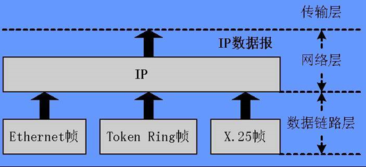\n\n\n\n

#### [Routers（路由器）](<https://github.com/1Lucifer1/NJUSE-courses-from-YuLinLiu/blob/master/%E4%BA%92%E8%81%94%E7%BD%91%E8%AE%A1%E7%AE%97/%E7%9F%A5%E8%AF%86%E7%82%B9/4.%20Network%20Layer.md#routers%E8%B7%AF%E7%94%B1%E5%99%A8>)

\n\n\n\n

\n
  * 不同网段分隔
\n\n\n\n
  * 避免拥塞
\n\n\n\n
  * 差异\n\n
    * 第二层：不同介质
\n\n\n\n
    * 第三层：同介质，可以在中间
\n\n\n\n
    * 第四层：只能终端
\n\n
\n
\n\n\n\n

IP Adresses and Subnets

\n\n\n\n

### [IPv4 Packet](<https://github.com/1Lucifer1/NJUSE-courses-from-YuLinLiu/blob/master/%E4%BA%92%E8%81%94%E7%BD%91%E8%AE%A1%E7%AE%97/%E7%9F%A5%E8%AF%86%E7%82%B9/4.%20Network%20Layer.md#ipv4-packet>)

\n\n\n\n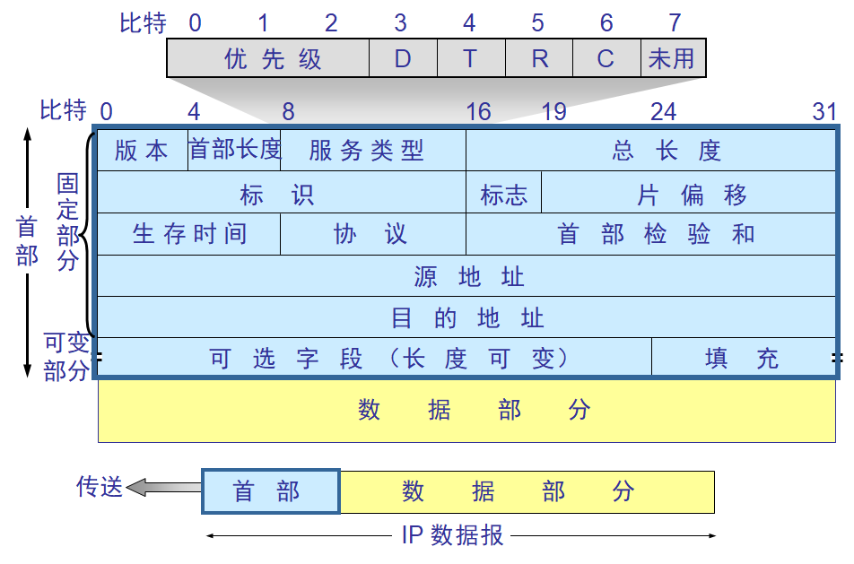\n\n\n\n

名词解释

\n\n\n\n

\n
  * ICMP - Internet Control Message Protocol：Internet控制报文协议
\n\n\n\n
  * IGMP - Internet Group Management Protocol：Internet 组管理协议
\n\n\n\n
  * UDP - User Datagram Protocol：用户数据报协议
\n\n\n\n
  * OSPF - Open Shortest Path First：开放式最短路径优先，是一个内部网关协议
\n\n\n\n
  * Datagram：数据报，网络层的PDU
\n
\n\n\n\n

#### [解析](<https://github.com/1Lucifer1/NJUSE-courses-from-YuLinLiu/blob/master/%E4%BA%92%E8%81%94%E7%BD%91%E8%AE%A1%E7%AE%97/%E7%9F%A5%E8%AF%86%E7%82%B9/4.%20Network%20Layer.md#%E8%A7%A3%E6%9E%90>)

\n\n\n\n

\n
  * 版本\n\n
    * 占 4 bit，指IP协议的版本
\n\n\n\n
    * 目前的 IP 协议版本号为 4 (即 IPv4)
\n\n
\n\n\n\n
  * 首部长度\n\n
    * 占 4 bit，可表示的最大数值
\n\n\n\n
    * 可变化（可变部分有40字节）
\n\n\n\n
    * 是 15 个单位(一个单位为 4 字节)
\n\n\n\n
    * 因此 IP 的首部长度的最大值是60字节。
\n\n
\n\n\n\n
  * 服务类型\n\n
    * 占 8 bit，用来获得更好的服务
\n\n\n\n
    * 前6位是区分服务吗，后2位别的用途
\n\n\n\n
    * 这个字段以前一直没有被人们使用
\n\n
\n\n\n\n
  * 总长度\n\n
    * 占 16 bit，指首部和数据之和的长度，
\n\n\n\n
    * 单位为字节，因此数据报的最大长度为 65535 字节。
\n\n\n\n
    * 总长度必须不超过最大传送单元 MTU。
\n\n
\n\n\n\n
  * 标识\n\n
    * 占 16 bit，
\n\n\n\n
    * 它是一个计数器，用来产生数据报的标识。
\n\n\n\n
    * 做报文分片，确定是不是同一个原始报文
\n\n
\n\n\n\n
  * 标志\n\n
    * 占 3 bit，最高位为0
\n\n\n\n
    * 最后位\n\n
      * MF（move fragment）
\n\n\n\n
      * 为0表示最后一个分片
\n\n
\n\n\n\n
    * 中间位\n\n
      * DF（don't to fragment）
\n\n\n\n
      * 为1则不允许分片
\n\n
\n\n
\n\n\n\n
  * 片偏移\n\n
    * (13 bit)指出：较长的分组在分片后
\n\n\n\n
    * 某片在原分组中的相对位置。
\n\n\n\n
    * 片偏移以 8 个字节为偏移单位。
\n\n\n\n
    * 偏移小的在前，大的在后，合成原始报文
\n\n
\n
\n\n\n\n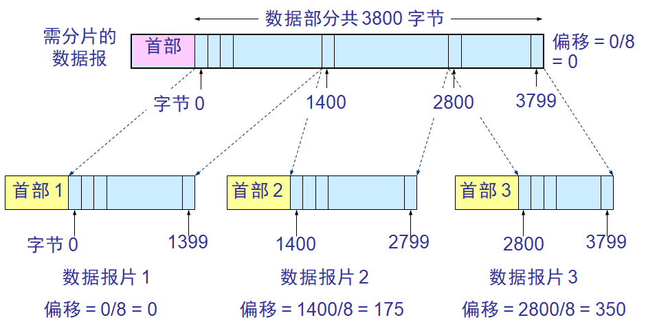\n\n\n\n

\n
  * 生存时间\n\n
    * (8 bit)记为 TTL (Time To Live)
\n\n\n\n
    * 数据报在网络中可通过的路由器数的最大值。
\n\n\n\n
    * 跳数限制，每次减1，减到0时丢弃报文
\n\n
\n\n\n\n
  * 协议\n\n
    * (8 bit)字段指出此数据报携带的数据使用何种协议
\n\n\n\n
    * 以便目的主机的 IP 层将数据部分上交给哪个处理过程
\n\n
\n\n\n\n
  * 首部检验和\n\n
    * (16 bit)字段只检验数据报的首部
\n\n\n\n
    * 不包括数据部分。
\n\n\n\n
    * 这里不采用 CRC 检验码而采用简单的计算方法。
\n\n
\n\n\n\n
  * 源地址和目的地址\n\n
    * 各占 4 字节
\n\n\n\n
    * 源地址在前，目的地址在后
\n\n
\n
\n\n\n\n

IP Address

\n\n\n\n字节开头| 网络号| 类型  
---|---|---  
0| 0 - 127| Class A address  
10| 128 - 191| Class B address  
110| 192 - 223| Class C address  
1110| 224 - 239| Class D-Multicast（给特定应用程序）  
11110| 240 - 255| Class E-Research（保留地址——测试用）  
\n\n\n\n

#### [单网段最多支持的主机数](<https://github.com/1Lucifer1/NJUSE-courses-from-YuLinLiu/blob/master/%E4%BA%92%E8%81%94%E7%BD%91%E8%AE%A1%E7%AE%97/%E7%9F%A5%E8%AF%86%E7%82%B9/4.%20Network%20Layer.md#%E5%8D%95%E7%BD%91%E6%AE%B5%E6%9C%80%E5%A4%9A%E6%94%AF%E6%8C%81%E7%9A%84%E4%B8%BB%E6%9C%BA%E6%95%B0>)

\n\n\n\n

\n
  * Class A - 16,777,214 (2^24 - 2)
\n\n\n\n
  * Class B - 65,534 (2^16 - 2)
\n\n\n\n
  * Class C - 254 (2^8 - 2)
\n
\n\n\n\n

#### [私有地址空间](<https://github.com/1Lucifer1/NJUSE-courses-from-YuLinLiu/blob/master/%E4%BA%92%E8%81%94%E7%BD%91%E8%AE%A1%E7%AE%97/%E7%9F%A5%E8%AF%86%E7%82%B9/4.%20Network%20Layer.md#%E7%A7%81%E6%9C%89%E5%9C%B0%E5%9D%80%E7%A9%BA%E9%97%B4>)

\n\n\n\n

\n
  * 10.0.0.0 - 10.255.255.255 （A 类）
\n\n\n\n
  * 172.16.0.0 - 172.31.255.255 （B 类）
\n\n\n\n
  * 192.168.0.0 - 192.168.255.255 （C 类）
\n
\n\n\n\n

#### [问题](<https://github.com/1Lucifer1/NJUSE-courses-from-YuLinLiu/blob/master/%E4%BA%92%E8%81%94%E7%BD%91%E8%AE%A1%E7%AE%97/%E7%9F%A5%E8%AF%86%E7%82%B9/4.%20Network%20Layer.md#%E9%97%AE%E9%A2%98>)

\n\n\n\n

\n
  * IP地址消耗的解决办法：\n\n
    * NAT（即使用私有 IP 地址）
\n\n\n\n
    * CIDR
\n\n\n\n
    * IPv6（长期解决办法）
\n\n
\n\n\n\n
  * NAT - Network Address Translation：网络地址转换，将网络内部的私有IP地址转换为公有IP地址以节省IP地址的方法
\n
\n\n\n\n

### [子网](<https://github.com/1Lucifer1/NJUSE-courses-from-YuLinLiu/blob/master/%E4%BA%92%E8%81%94%E7%BD%91%E8%AE%A1%E7%AE%97/%E7%9F%A5%E8%AF%86%E7%82%B9/4.%20Network%20Layer.md#%E5%AD%90%E7%BD%91>)

\n\n\n\n

#### [介绍](<https://github.com/1Lucifer1/NJUSE-courses-from-YuLinLiu/blob/master/%E4%BA%92%E8%81%94%E7%BD%91%E8%AE%A1%E7%AE%97/%E7%9F%A5%E8%AF%86%E7%82%B9/4.%20Network%20Layer.md#%E4%BB%8B%E7%BB%8D>)

\n\n\n\n

\n
  * 提供灵活的寻址，通常由网管分配，能够减少广播域 。
\n\n\n\n
  * 从host位借若干位出来作为subnet
\n\n\n\n
  * subnet和subnet之间属于不同网段
\n\n\n\n
  * 最小可借位数 = 2（1位只能生产出一个子网地址，另一个是广播域）
\n\n\n\n
  * 最大可借位数 = host ID 位数 - 2（host - 00：网络ID，11：广播地址）
\n\n\n\n
  * 子网划分会造成地址的浪费。
\n
\n\n\n\n**Number of Bits Borrowed**| **Number of Subnets Created**| **Number of Hosts Per Subnet**| **Total**  **Number of Hosts**| **Percent Used**  
---|---|---|---|---  
2| 2 (2^2 - 2)| 62 (2^6 - 2)| 124 (原本2^8 - 2)| 49%  
3| 6| 30| 180| 71%  
4| 14| 14| 196| 77%  
5| 30| 6| 180| 71%  
6| 62| 2| 124| 49%  
\n\n\n\n

\n
  * 子网掩码\n\n
    * Class A 255.0.0.0
\n\n\n\n
    * Class B 255.255.0.0
\n\n\n\n
    * Class C 255.255.255.0
\n\n
\n
\n\n\n\n

#### [划分步奏](<https://github.com/1Lucifer1/NJUSE-courses-from-YuLinLiu/blob/master/%E4%BA%92%E8%81%94%E7%BD%91%E8%AE%A1%E7%AE%97/%E7%9F%A5%E8%AF%86%E7%82%B9/4.%20Network%20Layer.md#%E5%88%92%E5%88%86%E6%AD%A5%E5%A5%8F>)

\n\n\n\n

\n
  * 先确定是那类网
\n\n\n\n
  * 再确定要多少子网以及每个子网可支持的主机数
\n\n\n\n
  * 确定借位数（记得全0和全1的子网不能用）
\n\n\n\n
  * 计算子网掩码（子网部分全取1）
\n\n\n\n
  * 确定主机的可用地址范围 （全0和全1的不可用）
\n
\n\n\n\n

#### [计算子网地址](<https://github.com/1Lucifer1/NJUSE-courses-from-YuLinLiu/blob/master/%E4%BA%92%E8%81%94%E7%BD%91%E8%AE%A1%E7%AE%97/%E7%9F%A5%E8%AF%86%E7%82%B9/4.%20Network%20Layer.md#%E8%AE%A1%E7%AE%97%E5%AD%90%E7%BD%91%E5%9C%B0%E5%9D%80>)

\n\n\n\n

\n
  * 将 IP 地址转化为二进制
\n\n\n\n
  * 将子网掩码转化为二进制
\n\n\n\n
  * 对两个数进行与操作
\n\n\n\n
  * 将子网地址转化为带点的十进制（Network ID）
\n
\n\n\n\n\n
  * 每个路由接口都必须有一个单独的网段地址
\n
\n\n\n\n

子网掩码的解释

\n\n\n\n

从前有一个地主，有256间房子，地主家的门牌号码是“192.168.1”，那么他家第一间房子的门牌号码是192.168.1.0，第二间是192.168.1.1，…第256间的编号是192.168.1.255。

\n\n\n\n

地主老了，需要把256间房子分给4个儿子，[平均分配](<https://www.zhihu.com/search?q=%E5%B9%B3%E5%9D%87%E5%88%86%E9%85%8D&search_source=Entity&hybrid_search_source=Entity&hybrid_search_extra=%7B%22sourceType%22%3A%22answer%22%2C%22sourceId%22%3A150953183%7D>)，每个儿子可以分64间。

\n\n\n\n

请来一位先生主持公道，先生这么来操作：  
192.168.1.0-192.168.1.63 分给大儿子  
192.168.1.64-192.168.1.127 分给二儿子  
192.168.1.128 -192.168.1.191 分给三儿子  
192.168.1.192-192.168.1.255 分给四儿子

\n\n\n\n

那如何来描述四个儿子的子网网段呢？  
192.168.1.0/26  
192.168.1.64/26  
192.168.1.128/26  
192.168.1.192/26

\n\n\n\n

**/26是什么鬼？**  
255.255.255.192的二进制是多少？ “[11111111](<tel:11111111>)-11111111-11111111-11”大家数数一共多少个1？不用数了，是26个1，为了简化子网掩码的表示，用/26代替255.255.255.192。

\n\n\n\n

**按位与运算**  
我们来看大儿子的[网段](<https://www.zhihu.com/search?q=%E7%BD%91%E6%AE%B5&search_source=Entity&hybrid_search_source=Entity&hybrid_search_extra=%7B%22sourceType%22%3A%22answer%22%2C%22sourceId%22%3A150953183%7D>)192.168.1.0/26是如何得到的？

\n\n\n\n

以大儿子的房间为例：  
192.168.1.0-192.168.1.63

\n\n\n\n

[二进制](<https://www.zhihu.com/search?q=%E4%BA%8C%E8%BF%9B%E5%88%B6&search_source=Entity&hybrid_search_source=Entity&hybrid_search_extra=%7B%22sourceType%22%3A%22answer%22%2C%22sourceId%22%3A150953183%7D>)表示：  
192.168.1.0

\n\n\n\n

[11000000](<tel:11000000>).[1010100](<tel:1010100>)0.00000001.00000000

\n\n\n\n

192.168.1.63

\n\n\n\n

11000000.10101000.00000001.00111111

\n\n\n\n

首尾地址完全相同的是多少？  
11000000.10101000.00000001.00

\n\n\n\n

数数一共多少位？26位！那么用这个“192.168.1.0/26”就可以表示大儿子所有房间。

\n\n\n\n

对照房间的门牌号码“192.168.1.199”，很显然属于四儿子的。

\n\n\n\n

  
一个主机192.168.1.199/26 能否和[直连主机](<https://www.zhihu.com/search?q=%E7%9B%B4%E8%BF%9E%E4%B8%BB%E6%9C%BA&search_source=Entity&hybrid_search_source=Entity&hybrid_search_extra=%7B%22sourceType%22%3A%22answer%22%2C%22sourceId%22%3A150953183%7D>)192.168.1.200/24 通信？**可以的** ，**因为都是四儿子的房间。**

\n\n\n\n

一个主机192.168.1.199/26 能否和直连主机  
192.168.1.1/24 通信？**  不可以**，**因为一个是大儿子的房间，一个是四儿子的房间，无法直连通信！**

\n\n\n\n

From 如何理解子网掩码？ - 车小胖的回答 - 知乎 https://www.zhihu.com/question/56895036/answer/150953183

\n\n\n\n

\n\n\n\n

路由器转发实例

\n\n\n\n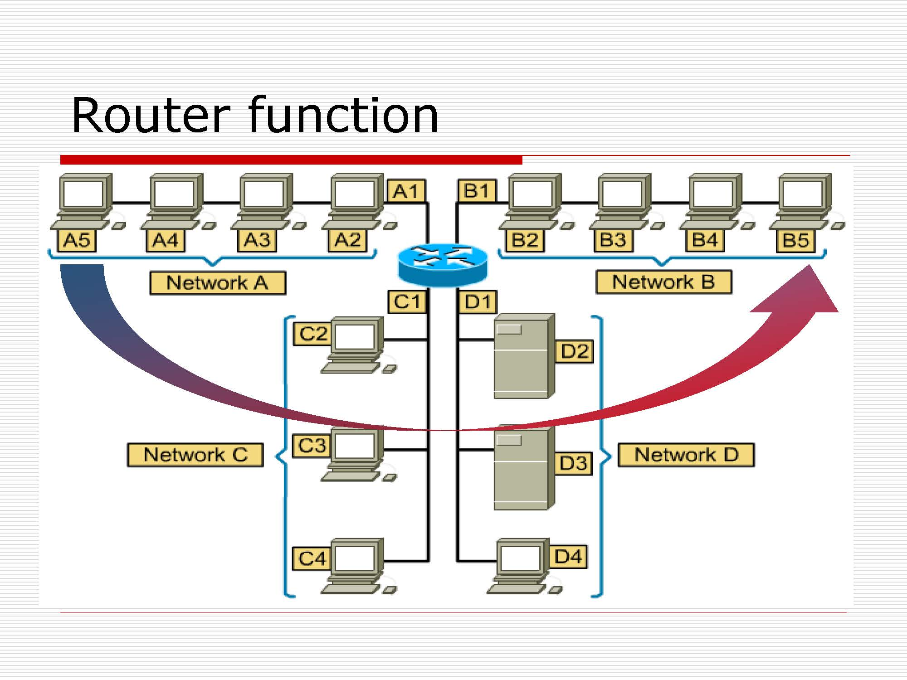\n\n\n\n

如图，一段报文从A5转发到B5， 报文来到router之后，router过滤data link头在之后，打包成帧在数据链路层进行传输。之后检测网络层的地址来决定dest的网络。

\n\n\n\n

然后查询路由表决定使用它的哪个接口来发送数据。

\n\n\n\n

IP地址的静态与动态分配

\n\n\n\n

\n
  1. 静态地址分配 (Static addressing)\n\n
     1. 为每个单独的设备配置一个 IP 地址
\n\n\n\n
     2. 您应该保留非常细致的记录，因为如果使用重复的 IP 地址，可能会出现问题。
\n\n
\n\n\n\n
  2. 动态地址分配 (Dynamic addressing)有几种不同的方法可用于动态分配 IP 地址：\n\n
     * RARP: Reverse Address Resolution Protocol. RARP：反向地址解析协议。发起请求
\n\n\n\n
     * BOOTP: BOOTstrap Protocol. BOOTP：BOOTstrap 协议。用于工作栈
\n\n\n\n
     * DHCP: Dynamic Host Configuration Protocol. (**比较多用**) DHCP：动态主机配置协议
\n\n
\n
\n\n\n\n

DHCP的工作过程如下：

\n\n\n\n

\n
  1. DHCP Discover（发现）：当设备连接到网络时，它会广播一个DHCP Discover消息，寻找可用的DHCP服务器。该消息被发送到本地网络上的所有设备。
\n\n\n\n
  2. DHCP Offer（提供）：DHCP服务器收到DHCP Discover消息后，会向设备发送DHCP Offer消息，提供可用的IP地址和其他网络配置参数。DHCP服务器可以设置一个地址池，从中分配IP地址给设备。
\n\n\n\n
  3. DHCP Request（请求）：设备在收到DHCP Offer消息后，选择一条提供的配置，并向DHCP服务器发送DHCP Request消息，请求分配该配置。
\n\n\n\n
  4. DHCP Acknowledgment（确认）：DHCP服务器接收到DHCP Request消息后，会向设备发送DHCP Acknowledgment消息，确认分配了相应的IP地址和其他配置参数。
\n\n\n\n
  5. IP地址配置：设备收到DHCP Acknowledgment消息后，会使用分配的IP地址和其他配置参数进行网络连接。同时，DHCP服务器会将分配的IP地址和设备的MAC地址进行绑定，确保同一设备在不同时间获取相同的IP地址。
\n
\n\n\n\n

DHCP的工作原理允许网络管理员集中管理IP地址和其他配置参数，简化了设备的网络配置过程。它实现了自动化的IP地址分配，避免了手动配置每个设备的繁琐工作。此外，DHCP还可以提供其他配置参数，如子网掩码、网关地址、DNS服务器地址等，以便设备能够正确地与网络通信。

\n\n\n\n

ARP协议：

\n\n\n\n

\n
  1. 为了使设备进行通信，发送设备需要目标设备的**  IP 地址和 MAC 地址**。
\n\n\n\n
  2. ARP 使计算机能够查找与 IP 地址关联的计算机的 MAC 地址。
\n
\n\n\n\n

ARP的工作过程如下：

\n\n\n\n

\n
  1. ARP请求（ARP Request）：发送设备在知道目标IP地址但不知道对应的MAC地址时，会向局域网广播一个ARP请求消息。该消息包含发送设备自己的MAC地址和要解析的目标IP地址。
\n\n\n\n
  2. ARP应答（ARP Reply）：接收到ARP请求消息的目标设备会检查自己的IP地址是否与请求的目标IP地址匹配。如果匹配，目标设备会向发送设备发送一个ARP应答消息，包含自己的MAC地址。
\n\n\n\n
  3. ARP缓存（ARP Cache）：发送设备收到ARP应答消息后，将目标IP地址和对应的MAC地址存储在本地的ARP缓存中。这样，在以后的通信中，发送设备就可以直接使用目标设备的MAC地址。
\n
\n\n\n\n

默认网关

\n\n\n\n

\n
  1. 为了使设备与另一网络上的另一设备通信，您必须为其**提供默认网关** 。
\n\n\n\n
  2. **默认网关是路由器上连接到源主机所在网段的接口的 IP 地址。**
\n\n\n\n
  3. 为了使设备将数据发送到另一个网段上的设备的地址，源设备将数据**发送到默认网关** 。
\n
\n\n\n\n

虚电路交换、面向电路的网络服务和无连接的网络服务是网络通信中的不同方式和服务类型，它们之间有以下区别：

\n\n\n\n

\n
  1. 连接方式：\n\n
     * 虚电路交换：虚电路交换使用预先建立的逻辑路径（虚电路）来进行数据传输。在通信开始之前，需要在源设备和目标设备之间建立虚电路，该虚电路将在数据传输期间保持活动状态。
\n\n\n\n
     * 面向电路的网络服务：面向电路的网络服务也需要在通信开始之前建立连接，类似于虚电路交换。但与虚电路交换不同，面向电路的网络服务在连接建立后维护一个持久的连接状态，直到通信结束。
\n\n\n\n
     * 无连接的网络服务：无连接的网络服务在数据传输时不需要预先建立连接。每个数据包都是独立的，它们通过独立的传输进行交换，不需要维护持久的连接状态。
\n\n
\n\n\n\n
  2. 可靠性：\n\n
     * 虚电路交换和面向电路的网络服务都是可靠的服务，它们提供了数据传输的可靠性保证。数据包在传输过程中会进行错误检测和纠正，确保数据的完整性和正确性。
\n\n\n\n
     * 无连接的网络服务（如UDP）通常不提供可靠性保证。数据包在传输过程中可能会丢失、重复或无序到达，因此应用层需要自行处理数据的可靠性和顺序性问题。
\n\n
\n\n\n\n
  3. 时延和开销：\n\n
     * 虚电路交换和面向电路的网络服务在建立连接和维护连接状态时会产生一定的时延和开销。这些服务通常用于需要可靠数据传输和有序传输的应用场景，如传统的电话网络。
\n\n\n\n
     * 无连接的网络服务（如UDP）由于不需要建立和维护连接状态，具有较低的时延和开销。它通常用于对实时性要求较高、可以容忍一定数据丢失的应用场景，如音视频传输和实时游戏。
\n\n
\n
\n\n\n\n

路由协议：

\n\n\n\n

\n
  1. 为网络层提供支持的协议称为路由协议或可路由协议。
\n\n\n\n
  2. IP 是网络层协议，因此，它可以通过互联网络进行路由。
\n
\n\n\n\n\n
  1. 不可路由协议是不支持第 3 层的协议。
\n\n\n\n
  2. 这些不可路由协议中最常见的是 NetBEUI。\n\n
     * 直接根据目的方的地址在局域网中进行生成定位
\n\n\n\n
     * 这个协议不支持第三层，也就是跨局域网是不可以的。
\n\n
\n\n\n\n
  3. NetBEUI 是一种小型，快速且高效的协议，仅限于在一个网段上运行
\n
\n\n\n\n

不可路由协议是指不能通过路由器进行转发和路由选择的协议。这种协议通常用于在本地网络中进行通信，不需要跨越多个网络或进行广域网传输。

\n\n\n\n

一种常见的不可路由协议是链路层广播协议，如以太网的广播（Broadcast）和多播（Multicast）帧。这些协议通过在本地网络中广播数据帧，使所有连接到该网络的设备都能接收到数据。由于广播和多播帧不携带目标地址，路由器无法根据目标地址进行转发和选择最佳路径，因此它们被认为是不可路由的。

\n\n\n\n

不可路由协议通常用于局域网（LAN）或广播域（Broadcast Domain）中，这是一个逻辑上被广播帧所覆盖的网络范围。在这种情况下，广播或多播帧可以直接在广播域内传输，不需要经过路由器进行转发。广播和多播通常用于在局域网中进行网络发现、地址分配、广告等功能。

\n\n\n\n

由于不可路由协议的传输范围有限，它们不适用于跨越多个网络或进行远程通信的情况。在这些情况下，需要使用可路由协议（如IP协议）来实现数据包在不同网络之间的转发和路由选择。可路由协议允许数据包跨越不同的网络边界，在全球范围内进行通信，通过路由器进行转发和路由选择，从源设备到目标设备的传输路径上可能经过多个路由器。

\n\n\n\n

总结来说，不可路由协议是指不能通过路由器进行转发和路由选择的协议，通常用于局域网或广播域中进行本地通信。这些协议在广播域内直接传输数据，不需要跨越网络边界进行转发。对于跨越多个网络或进行远程通信的情况，需要使用可路由协议来实现数据包的转发和路由选择。

\n\n\n\n

\n\n\n\n

IGP代表内部网关协议（Interior Gateway Protocol）。IGP是一种在自治系统（AS）内部用于路由选择和路由信息交换的协议。自治系统是由一组由同一组织或管理实体控制的网络组成，它们共享相同的路由选择策略。

\n\n\n\n

IGP的主要作用是在自治系统内部传播和选择最佳的路由路径，使数据包能够有效地在自治系统内部进行转发。它通过在自治系统的各个路由器之间交换路由信息，建立和维护路由表，从而实现对数据包的转发。

\n\n\n\n

常见的IGP协议包括以下几种：

\n\n\n\n

\n
  1. RIP（Routing Information Protocol）：RIP是一种距离向量协议，使用跳数作为度量标准，通过周期性地交换路由信息来选择最佳路径。
\n\n\n\n
  2. OSPF（Open Shortest Path First）：OSPF是一种链路状态协议，使用链路状态数据库来计算最短路径，并通过交换链路状态更新来更新路由信息。
\n\n\n\n
  3. IS-IS（Intermediate System to Intermediate System）：IS-IS也是一种链路状态协议，广泛用于大型网络中，如互联网服务提供商（ISP）的网络。
\n
\n\n\n\n

IGP协议在自治系统内部起着关键的作用，它们帮助路由器之间交换路由信息，计算最佳路径，并更新路由表，以实现数据包在自治系统内的转发。通过使用IGP协议，网络管理员可以灵活地配置和管理自治系统内的路由策略，实现高效和可靠的内部通信。

\n\n\n\n

**DVP**

\n\n\n\n

距离矢量协议 Distance-Vector Protocols

\n\n\n\n

RIP, IGRP

\n\n\n\n

\n
  1. 从**邻居** 的角度查看网络拓扑。(注意不基于全局)
\n\n\n\n
  2. 在路由器之间添加距离向量。(根据跳数来决定，经过一个路由器 + 1 一次)
\n\n\n\n
  3. 经常定期 (periodic) 更新。（**定时** ）
\n\n\n\n
  4. 将路由表的**副本** 传递到邻居路由器。
\n
\n\n\n\n

**LVP**

\n\n\n\n

链路状态协议 Link State Protocols

\n\n\n\n

OSPF

\n\n\n\n

\n
  1. 获取**全局** 网络拓扑的通用视图。
\n\n\n\n
  2. 计算到其他路由器的**最短路径** 。(基于带宽计算出来的 cost，形成 cost 拓扑图，然后计算出对应的路径代价作为评判依据)
\n\n\n\n
  3. **事件** 触发的更新。
\n\n\n\n
  4. 将链接状态路由更新传递给其他路由器
\n
\n\n\n\n

距离向量是一种路由算法，用于在距离向量路由协议中选择最佳路径。它基于每个路由器维护到目标网络的距离和下一跳的信息，并将这些信息以向量的形式广播给相邻的路由器。

\n\n\n\n

在距离向量算法中，每个路由器会周期性地将其路由表中包含的目标网络及其距离信息发送给相邻的路由器。距离信息通常表示为跳数（hops）、度量值或其他可衡量的指标。路由器通过接收和处理来自相邻路由器的距离向量更新，更新自己的路由表，并选择距离最短的路径作为最佳路径。

\n\n\n\n

距离向量算法的基本原理是利用每个路由器通过相邻路由器获取的距离信息，逐步迭代地计算出到达目标网络的最佳路径。在每个迭代中，路由器比较自己已知的路径与相邻路由器传递过来的路径，如果相邻路由器提供了更短的路径，则更新自己的路由表。这样，路由器之间逐渐收敛到最佳路径，直到整个网络的路由表达到一致状态。

\n\n\n\n

距离向量算法的一些特点包括：

\n\n\n\n

\n
  1. 分布式计算：每个路由器根据自己的局部信息进行计算和选择路径，而不需要全局的拓扑信息。
\n\n\n\n
  2. 逐步迭代：路由器之间通过交换距离向量信息逐步迭代地计算最佳路径，直到达到收敛状态。
\n\n\n\n
  3. 路由环路问题：距离向量算法对于路由环路（routing loops）的处理相对较慢，可能需要较长的时间才能检测到和解决环路问题。
\n\n\n\n
  4. 路由信息交换：路由器之间周期性地交换距离向量信息，这会导致较大的控制流量，尤其在大型网络中。
\n
\n\n\n\n

距离向量算法在一些早期的路由协议中使用，如RIP（Routing Information Protocol），它使用跳数作为度量标准。然而，距离向量算法的局限性导致了其他更高级的路由算法的发展，如链路状态算法（如OSPF）和路径向量算法（如BGP）等，它们更适用于大规模网络和复杂的路由环境。

\n\n\n\n

VSLM 可变长子网掩码

\n\n\n\n

\n
  * 有类路由有类的路由协议要求单个网络使用相同的子网掩码。例如：网络 192.168.187.0 必须仅使用一个子网掩码，例如 255.255.255.0。
\n\n\n\n
  * 可变长度子网掩码VLSM 只是一个特征，它允许单个自治系统的网络具有不同的子网掩码。可有效解决网络号浪费的问题
\n
\n\n\n\n

为了计算 VLSM 子网，各个主机首先从地址范围分配最大的需求。需求级别应从**最大到最小** 列出。

\n\n\n\n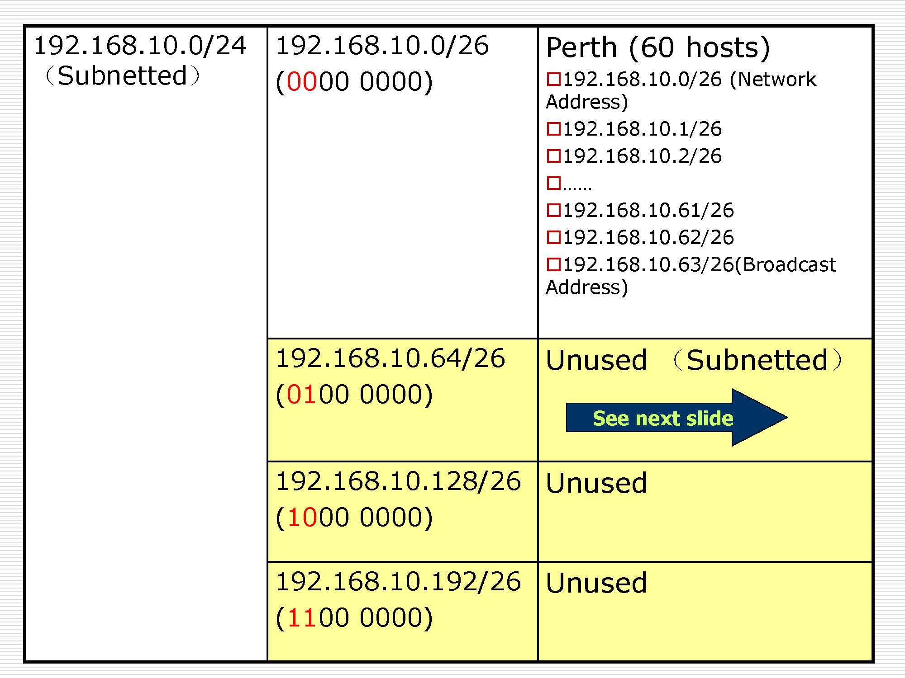\n\n\n\n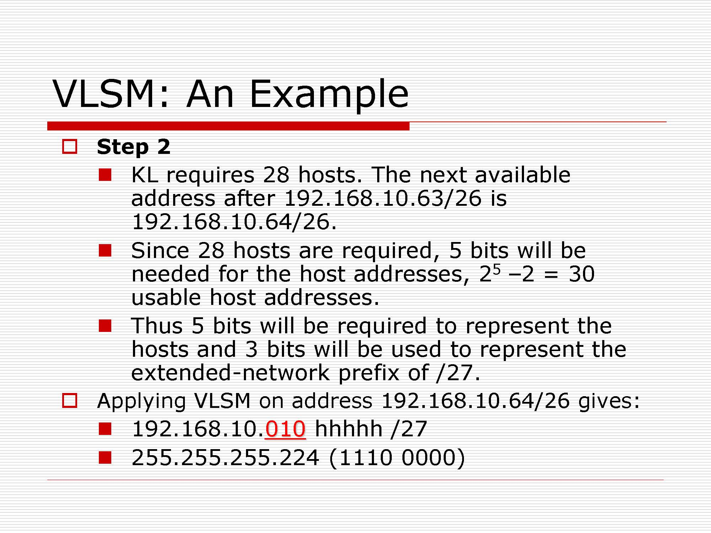\n\n\n\n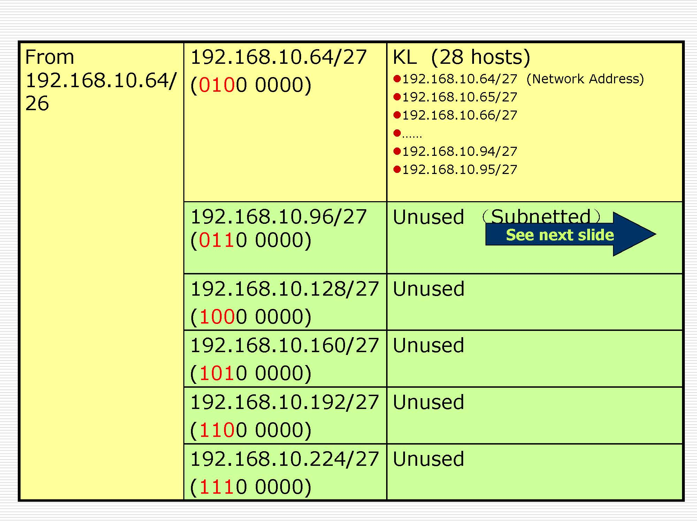\n\n\n\n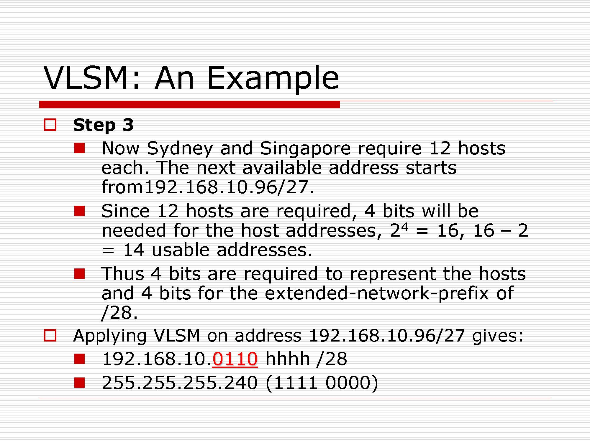\n\n\n\n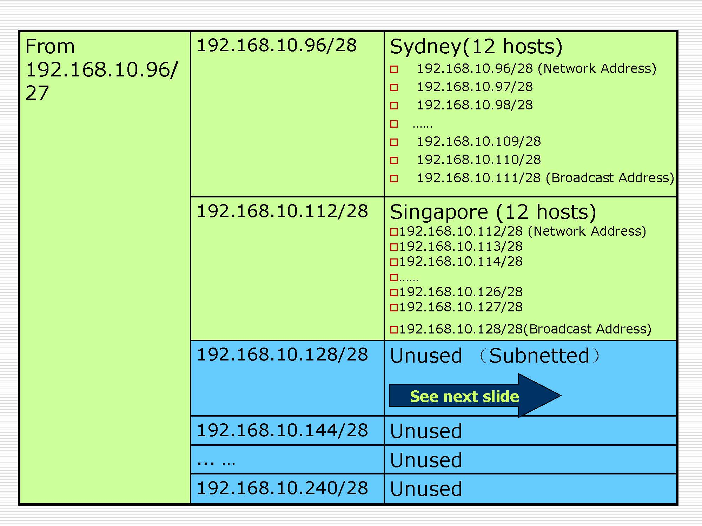\n\n\n\n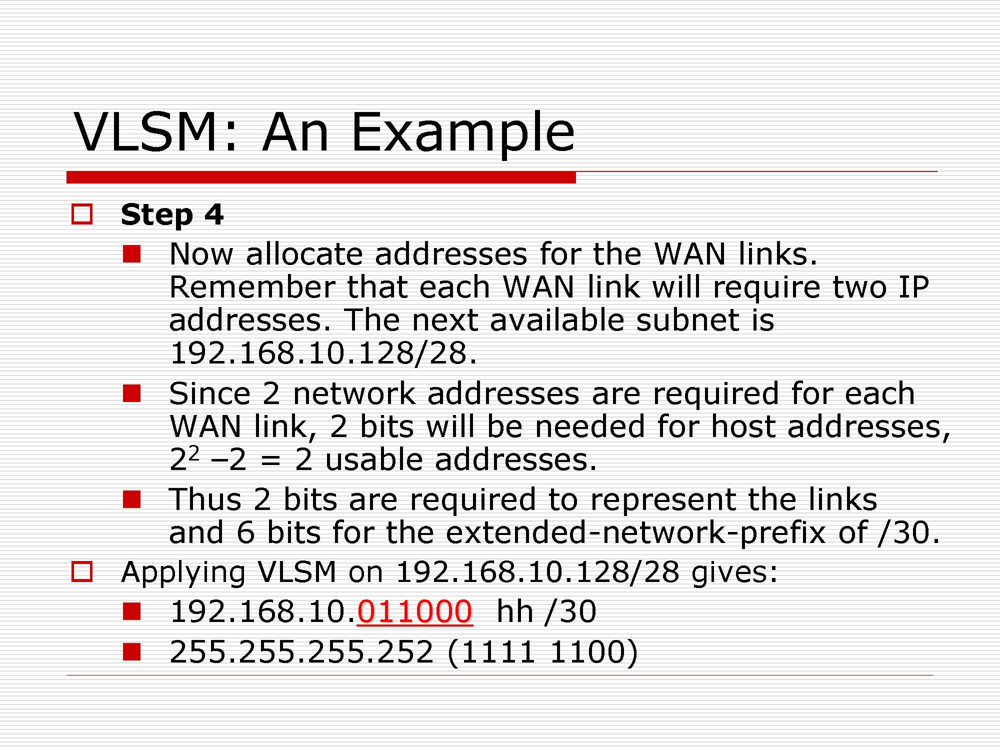\n\n\n\n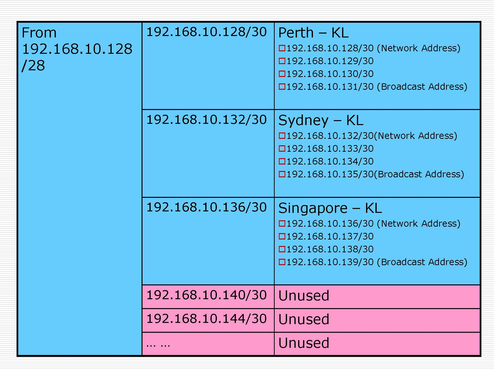\n\n\n\n

注：没被用过的子网才能进一步划分

\n\n\n\n

路由聚集：比如将 3 个 / 24 的子网合并成一个 / 16 的网络

\n\n\n\n

ICMP报文

\n\n\n\n\n\n\n\n

ICMP代表Internet控制消息协议（Internet Control Message Protocol）。它是在TCP/IP网络中用于传输控制消息和错误报告的协议。

\n\n\n\n

ICMP的主要功能包括：

\n\n\n\n

\n
  1. 错误报告：当在网络通信过程中发生错误时，ICMP可以生成错误报告消息并将其发送回源主机。例如，如果目标主机不可达或某个网络设备发生故障，ICMP可以生成相应的错误消息通知源主机。
\n\n\n\n
  2. 网络探测和诊断：ICMP还被用于执行网络探测和诊断任务。例如，通过发送ICMP回声请求（ping）消息，可以测试目标主机是否可达并测量往返时间（Round Trip Time，RTT）。
\n\n\n\n
  3. 路由器通知：ICMP还用于向网络中的路由器发送通知消息。例如，当某个网络出现拥塞或路由器发生故障时，ICMP可以向相关的网络设备发送通知消息。
\n\n\n\n
  4. 重定向消息：ICMP可以用于向主机发送重定向消息，指示主机使用更优的路径进行通信。这可以帮助优化网络流量的路由选择。
\n\n\n\n
  5. MTU路径发现：ICMP的路径MTU发现功能用于确定两个主机之间的最大传输单元（Maximum Transmission Unit，MTU）。这是为了确保在网络通信中不会发生IP分组的分片和重组，从而提高性能。
\n
\n\n\n\n

总体而言，ICMP是一种用于传输控制消息和错误报告的协议，它在TCP/IP网络中发挥重要作用，用于网络的探测、诊断和错误处理。

\n\n\n\n

\n\n\n\n

Transport Layer

\n\n\n\n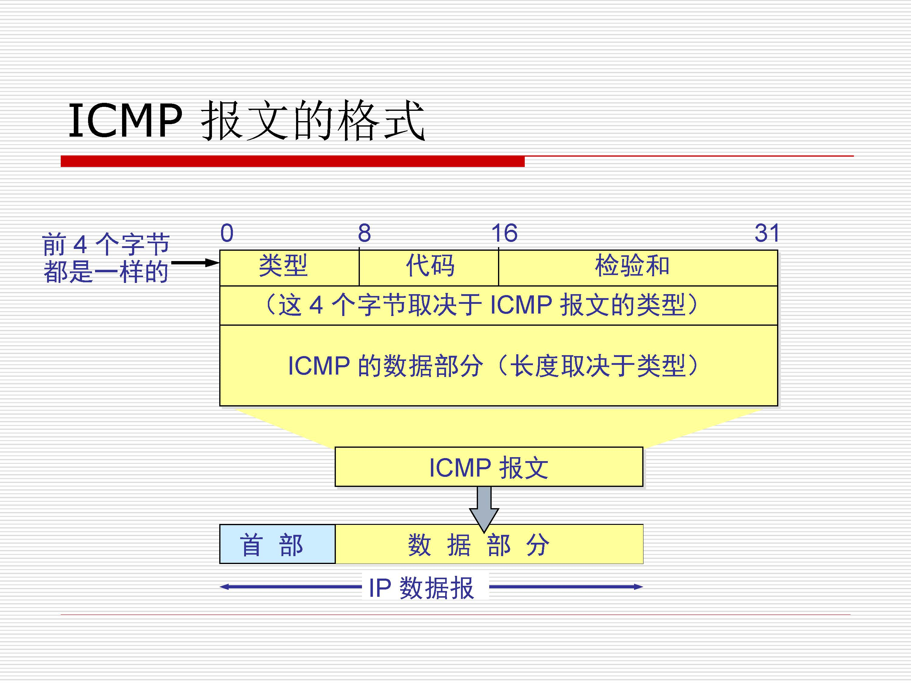\n\n\n\n

Routing Protocols(RIP AND OSPF)

\n\n\n\n

## the difference between RIPv1 v2

\n\n\n\n

RIPv1 is considered as an interior gateway protocol

\n\n\n\n

\n
  1. RIP v1 是一种距离向量协议，它以预定间隔将其整个路由表广播到每个邻居路由器。默认间隔为**  30 秒**。
\n\n\n\n
  2. RIP 使用**跳数** 作为度量标准，最大跳数为**  15**，达到 16 跳的报文自动抛弃。
\n
\n\n\n\n

it is a distance vector protocol that broadcast its entire routing table to each neighbour router at predetermined intervals (30 seconds)

\n\n\n\n

RIP v1 is capable of load balancing over as many as six equal-cost paths, with four paths as the default.

\n\n\n\n

RIP v1 具有以下限制：

\n\n\n\n

\n
  1. 它不会在其更新中发送子网掩码信息：意味着必须用同样的子网掩码，不支持 VLSM 或无类域间路由 (CIDR，Classless Interdomain Routing)。
\n\n\n\n
  2. 它以 255.255.255.255 的广播形式发送更新：只能发给邻居，不能通过路由器转发。
\n\n\n\n
  3. 它不支持身份验证 (authentication): 只要启动 RIP 就可以接受到信息，也就意味着只要接入网络并且启动 RIP 进程，就可以了解到整个网络拓扑
\n
\n\n\n\n

RIPv2 is an improved version of version of RIPv1 and shares the following features:

\n\n\n\n

it's a distance vector protocol that uses a hop count metric  
it uses holddown timers to prevent routing loops (180 seconds)

\n\n\n\n

\n
  1. 这是一种使用**跳数指标** 的距离矢量协议。
\n\n\n\n
  2. 它使用**抑制计时器** 来防止路由循环 - 默认值为**  180 秒**，6 倍于交换时间
\n\n\n\n
  3. 它使用水平分割 (Split Horizon) 来防止路由循环 (Routing Loops)。
\n\n\n\n
  4. 它使用 16 跳作为**无限距离的度量** 。(15 跳及以内可达)
\n
\n\n\n\n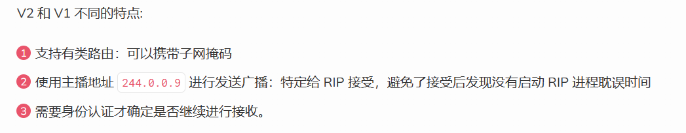\n\n\n\n

**OSPF**

\n\n\n\n

Open Shortest Path First开放最短路径优先是基于开放标准的链路状态路由协议

\n\n\n\n

It is described in several standards of the Internet Engineering Task Force (IETF) Internet 网络工程任务组(IETF，Internet Engineering Task Force)的多个标准中对此进行了描述:The most recent description is RFC 2328. 最新的描述是RFC 2328。(已经不是最新的了)

\n\n\n\n

\n
  1. 链接的状态是对接口及其与其相邻路由器的关系的描述。
\n\n\n\n
  2. 链接状态的集合形成一个**链接状态数据库** ，有时也称为**拓扑数据库** 。
\n\n\n\n
  3. 路由器应用**  Dijkstra 最短路径优先** (SPF) 算法来构建以自己为根的 SPF 树。
\n\n\n\n
  4. 路由器通过 SPF 树计算最佳路径，然后选择最佳路径并将其放置在**路由表** 中。
\n
\n\n\n\n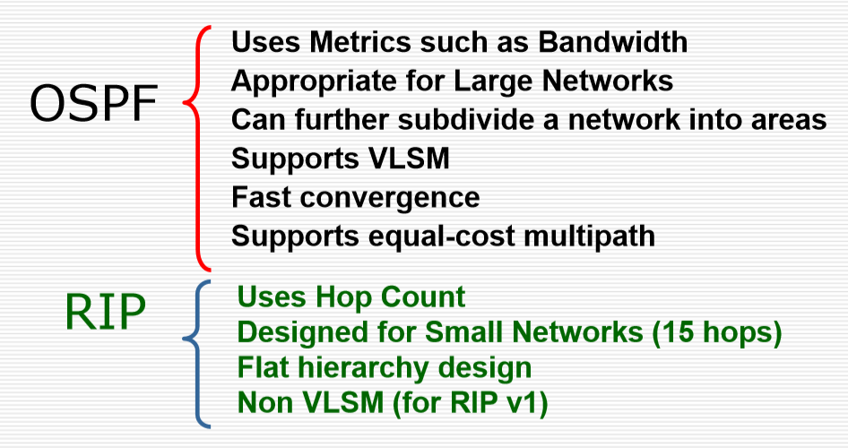\n\n\n\n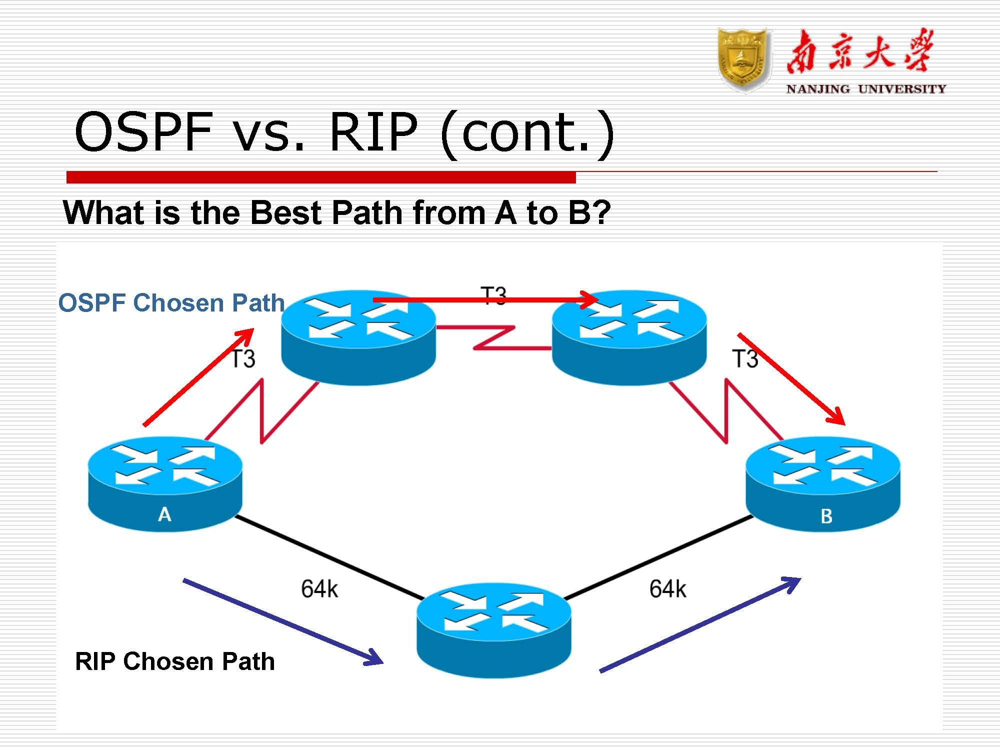\n\n\n\n

\n
  * 上面带宽大，2跳达到，下面带宽小，1跳到达。
\n\n\n\n
  * OSPF从上面走，RIP从下面走，但是上面会快一些
\n
\n\n\n\n\n
  1. 大型OSPF网络使用分层设计。\n\n
     1. 将大的网络分成多个area，每一个area只和area 0相连，保证area没有回路
\n\n\n\n
     2. 层次最多只有2个，一个area就是area 0。
\n\n\n\n
     3. 层次维持树的关系
\n\n
\n
\n\n\n\n

\n\n\n\n

## How RIP updating routing tables

\n\n\n\n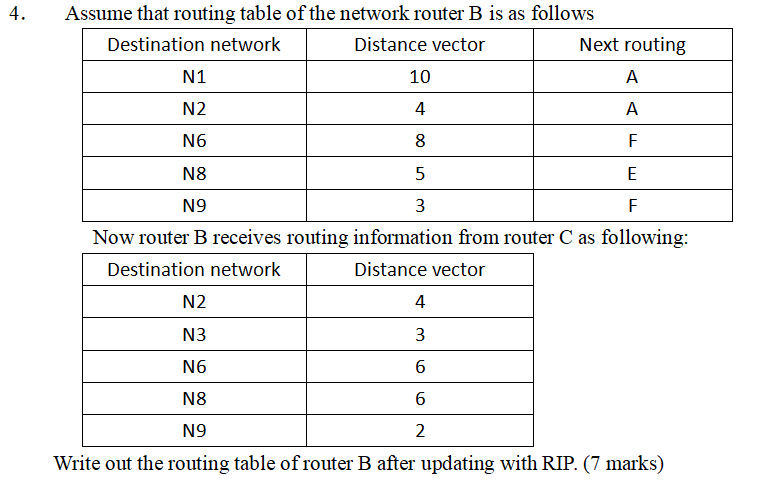\n\n\n\n

1.对新接收到的路由表进行更新，全部"距离"+1，且"下一跳路由器"都写成发送方路由器的名称(这里是C给B发的路由表，所以下一跳名称填C)

\n\n\n\n

### B收到C发来的路由信息（新表）

\n\n\n\n目的网络| 距离| 下一跳路由器  
---|---|---  
N2| 5| C  
N3| 4| C  
N6| 7| C  
N8| 7| C  
N9| 3| C  
2.开始对比新表和B的路由表  
**1.看目的网络**  
如果是新的目的网络，则直接把对应的各项信息填入表中；如果是相同的目的网络（"新表"和"B路由表"对比），继续下面步骤。  
**2.看下一跳路由器**  
相同的目的网络为前提，看下一跳路由器。如果下一跳路由器相同，就更新(用新表的)。如果下一跳路由器不同，继续下面步骤。  
**3.看距离**  
如果距离不同，谁距离短，选谁来更新；如果距离相同，不更新。\n\n\n\n目的网络| 距离| 下一跳路由器| 说明  
---|---|---|---  
N1| 10| A| 无新信息，不改变  
N2| 4| A| 不用更新  
N3| 4| C| 新的项目，添加进来  
N6| 7| C| 不同的下一跳，距离更短  
N8| 5| E| 不同的下一跳，距离更大，不改变  
N9| 3| F| 不同的下一跳，距离一样，不改变  
\n\n\n\n

## How VLAN communicate with each other

\n\n\n\n

A VLAN is a Virtual [Local Area Network](<https://www.makeuseof.com/wan-vs-lan/>). It's a logical grouping of devices on a network, usually based on location or function.

\n\n\n\n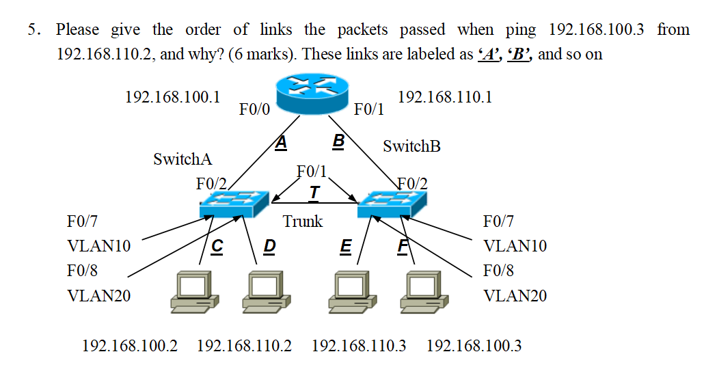\n\n\n\n

A VLAN is created by adding a tag, or header, to each Ethernet frame. This **tag** tells the network _which VLAN the frame should be sent to_. 

\n\n\n\n

Devices in different VLANs **can't see each other's traffic** unless connected to a router configured to allow it.

\n\n\n\n

对于一般的转发（广播）而言，会把packet转发到除了接收接口以外的全部端口，

\n\n\n\n

分割广播域时，一般都必须使用到路由器。使用路由器后，可以以路由器上的网络接口(LAN Interface)为单位分割广播域。

\n\n\n\n

但是，通常情况下路由器上不会有太多的网络接口，其数目多在1～4个左右。随着宽带连接的普及，宽带路由器(或者叫IP共享器)变得较为常见，但是需要注意的是，它们上面虽然带着多个(一般为4个左右)连接LAN一侧的网络接口，但那实际上是路由器内置的交换机，并不能分割广播域。

\n\n\n\n

况且使用路由器分割广播域的话，所能分割的个数完全取决于路由器的网络接口个数，使得用户无法自由地根据实际需要分割广播域。

\n\n\n\n

与路由器相比，二层交换机一般带有多个网络接口。因此如果能使用它分割广播域，那么无疑运用上的灵活性会大大提高。

\n\n\n\n

用于在二层交换机上分割广播域的技术，就是VLAN。通过利用VLAN，我们可以自由设计广播域的构成，提高网络设计的自由度。

\n\n\n\n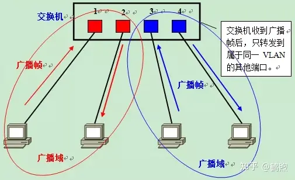\n\n\n\n

但是，VLAN生成的逻辑上的交换机是互不相通的。因此，在交换机上设置VLAN后，如果未做其他处理，VLAN间是无法通信的。

\n\n\n\n

明明接在同一台交换机上，但却偏偏无法通信——这个事实也许让人难以接受。但它既是VLAN方便易用的特征，又是使VLAN令人难以理解的原因。

\n\n\n\n

因此为了做到VLAN间通信，必须研究**VLAN的访问链接(Access Link)**

\n\n\n\n

1.交换机的端口类型

\n\n\n\n

交换机的端口，可以分为以下两种：

\n\n\n\n

(1)访问链接(Access Link)

\n\n\n\n

(2)汇聚链接(Trunk Link)

\n\n\n\n

2.访问链接

\n\n\n\n

访问链接，指的是“只属于一个VLAN，且仅向该VLAN转发数据帧”的端口。在大多数情况下，访问链接所连的是客户机。

\n\n\n\n

通常设置VLAN的顺序是：

\n\n\n\n

(1)生成VLAN

\n\n\n\n

(2)设定访问链接(决定各端口属于哪一个VLAN)

\n\n\n\n

设定访问链接的手法，可以是事先固定的、也可以是根据所连的计算机而动态改变设定。前者被称为“静态VLAN”、后者自然就是“动态VLAN”了。

\n\n\n\n

静态VLAN基于端口

\n\n\n\n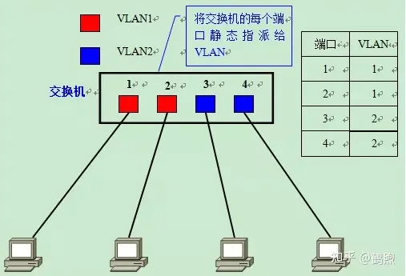\n\n\n\n

动态VLAN

\n\n\n\n

另一方面，动态VLAN则是根据每个端口所连的计算机，随时改变端口所属的VLAN。这就可以避免上述的更改设定之类的操作。动态VLAN可以大致分为3类：

\n\n\n\n

(1)基于MAC地址的VLAN(MAC Based VLAN)

\n\n\n\n

(2)基于子网的VLAN(Subnet Based VLAN)

\n\n\n\n

(3)基于用户的VLAN(User Based VLAN)

\n\n\n\n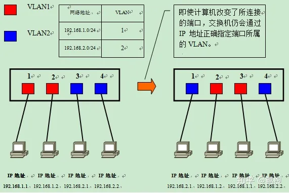\n\n\n\n

为什么需要Trunk？

\n\n\n\n

**VLAN的汇聚链接(Trunk Link)**

\n\n\n\n

1.需要设置跨越多台交换机的VLAN时……

\n\n\n\n

到此为止，我们学习的都是使用单台交换机设置VLAN时的情况。那么，如果需要设置跨越多台交换机的VLAN时又如何呢?

\n\n\n\n

在规划企业级网络时，很有可能会遇到隶属于同一部门的用户分散在同一座建筑物中的不同楼层的情况，这时可能就需要考虑到如何跨越多台交换机设置VLAN的问题了。假设有如下图所示的网络，且需要将不同楼层的A、C和B、D设置为同一个VLAN。

\n\n\n\n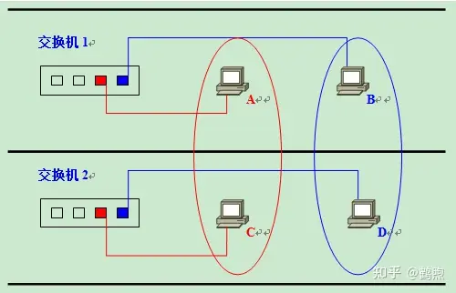\n\n\n\n

这时最关键的就是“交换机1和交换机2该如何连接才好呢?”

\n\n\n\n

最简单的方法，自然是在交换机1和交换机2上各设一个红、蓝VLAN专用的接口并互联了。

\n\n\n\n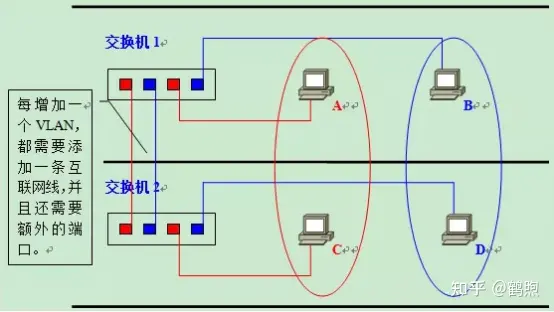\n\n\n\n

但是，这个办法从扩展性和管理效率来看都不好。例如，在现有网络基础上再新建VLAN时，为了让这个VLAN能够互通，就需要在交换机间连接新的网线。建筑物楼层间的纵向布线是比较麻烦的，一般不能由基层管理人员随意进行。并且，VLAN越多，楼层间(严格地说是交换机间)互联所需的端口也越来越多，交换机端口的利用效率低是对资源的一种浪费、也限制了网络的扩展。

\n\n\n\n

为了避免这种低效率的连接方式，人们想办法让交换机间互联的网线集中到一根上，这时使用的就是汇聚链接(Trunk Link)。

\n\n\n\n

**VLAN间路由**

\n\n\n\n

使用路由器进行VLAN间路由

\n\n\n\n

在使用路由器进行VLAN间路由时，与构建横跨多台交换机的VLAN时的情况类似，我们还是会遇到“该如何连接路由器与交换机”这个问题。路由器和交换机的接线方式，大致有以下两种：

\n\n\n\n

(1)将路由器与交换机上的每个VLAN分别连接

\n\n\n\n

(2)不论VLAN有多少个，路由器与交换机都只用一条网线连接

\n\n\n\n

最容易想到的，当然还是“把路由器和交换机以VLAN为单位分别用网线连接”了。将交换机上用于和路由器互联的每个端口设为访问链接(Access Link)，然后分别用网线与路由器上的独立端口互联。如下图所示，交换机上有2个VLAN，那么就需要在交换机上预留2个端口用于与路由器互联;路由器上同样需要有2个端口;两者之间用2条网线分别连接。

\n\n\n\n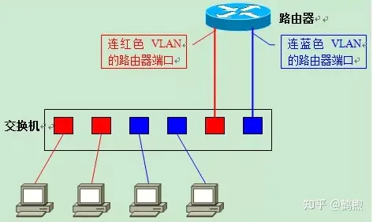\n\n\n\n

上图的解法存在扩展性的问题，当VLAN一多路由器的LAN接口将成问题

\n\n\n\n

因此同样采用汇聚接口的办法解决

\n\n\n\n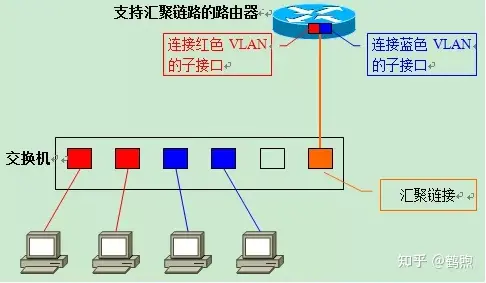\n\n\n\n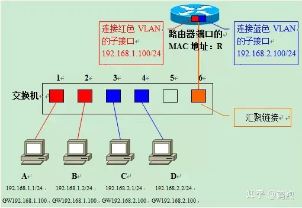\n\n\n\n

**通信实例**

\n\n\n\n

首先考虑计算机A与同一VLAN内的计算机B之间通信时的情形。

\n\n\n\n

计算机A发出ARP请求信息，请求解析B的MAC地址。交换机收到数据帧后，检索MAC地址列表中与收信端口同属一个VLAN的表项。结果发现，计算机B连接在端口2上，于是交换机将数据帧转发给端口2，最终计算机B收到该帧。收发信双方同属一个VLAN之内的通信，一切处理均在交换机内完成。

\n\n\n\n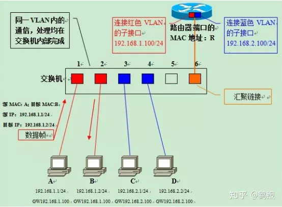\n\n\n\n

接下来是这一讲的核心内容，不同VLAN间的通信。让我们来考虑一下计算机A与计算机C之间通信时的情况。

\n\n\n\n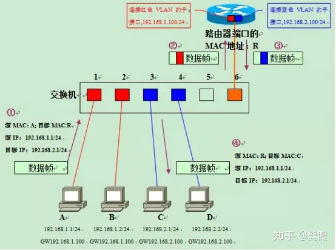\n\n\n\n

计算机A从通信目标的IP地址(192.168.2.1)得出C与本机不属于同一个网段。因此会向设定的默认网关(DefaultGateway，GW)转发数据帧。在发送数据帧之前，需要先用ARP获取路由器的MAC地址。

\n\n\n\n

得到路由器的MAC地址R后，接下来就是按图中所示的步骤发送往C去的数据帧。①的数据帧中，目标MAC地址是路由器的地址R、但内含的目标IP地址仍是最终要通信的对象C的地址。

\n\n\n\n

交换机在端口1上收到①的数据帧后，检索MAC地址列表中与端口1同属一个VLAN的表项。由于汇聚链路会被看作属于所有的VLAN，因此这时交换机的端口6也属于被参照对象。这样交换机就知道往MAC地址R发送数据帧，需要经过端口6转发。

\n\n\n\n

从端口6发送数据帧时，由于它是汇聚链接，因此会被附加上VLAN识别信息。由于原先是来自红色VLAN的数据帧，因此如图中②所示，会被加上红色VLAN的识别信息后进入汇聚链路。路由器收到②的数据帧后，确认其VLAN识别信息，由于它是属于红色VLAN的数据帧，因此交由负责红色VLAN的子接口接收

\n\n\n\n

接着，根据路由器内部的路由表，判断该向哪里中继。

\n\n\n\n

由于目标网络192.168.2.0/24是蓝色VLAN，，且该网络通过子接口与路由器直连，因此只要从负责蓝色VLAN的子接口转发就可以了。这时，数据帧的目标MAC地址被改写成计算机C的目标地址;并且由于需要经过汇聚链路转发，因此被附加了属于蓝色VLAN的识别信息。这就是图中③的数据帧。

\n\n\n\n

交换机收到③的数据帧后，根据VLAN标识信息从MAC地址列表中检索属于蓝色VLAN的表项。由于通信目标——计算机C连接在端口3上、且端口3为普通的访问链接，因此交换机会将数据帧去除VLAN识别信息后(数据帧④)转发给端口3，最终计算机C才能成功地收到这个数据帧。

\n\n\n\n

进行VLAN间通信时，即使通信双方都连接在同一台交换机上，也必须经过：“发送方——交换机——路由器——交换机——接收方”这样一个流程。

\n\n\n\n

## ACL

\n\n\n\n

\n
  1. ACL是指令列表，它告诉路由器允许或拒绝什么类型的数据包。
\n\n\n\n
  2. 如果要让路由器拒绝某些数据包，则必须配置ACL。否则，只要链路打开，路由器将接受并转发所有数据包
\n\n\n\n
  3. 您可以根据以下情况允许或拒绝数据包：\n\n
     1. 源地址
\n\n\n\n
     2. 目的地址
\n\n\n\n
     3. 上层的协议，比如TCP或UDP端口
\n\n
\n
\n\n\n\n

EX:

\n\n\n\n

\n
  1. 如果我们有如下所述的ACL列表：
\n
\n\n\n\n1  
2  
3| `Permit packets from 192.168.100.1 to pass  
Permit packets from 192.168.100.2 to pass  
Deny packets from 192.168.100.3  
`PF  
---|---  
\n\n\n\n

\n
  2. 然后\n\n
     1. Packets from 192.168.100.1 will be forwarded
\n\n\n\n
     2. Packets from 192.168.100.3 will be denied
\n\n\n\n
     3. But how does the router process the packets from 192.168.100.4? denied(默认被匹配掉)
\n\n
\n
\n\n\n\n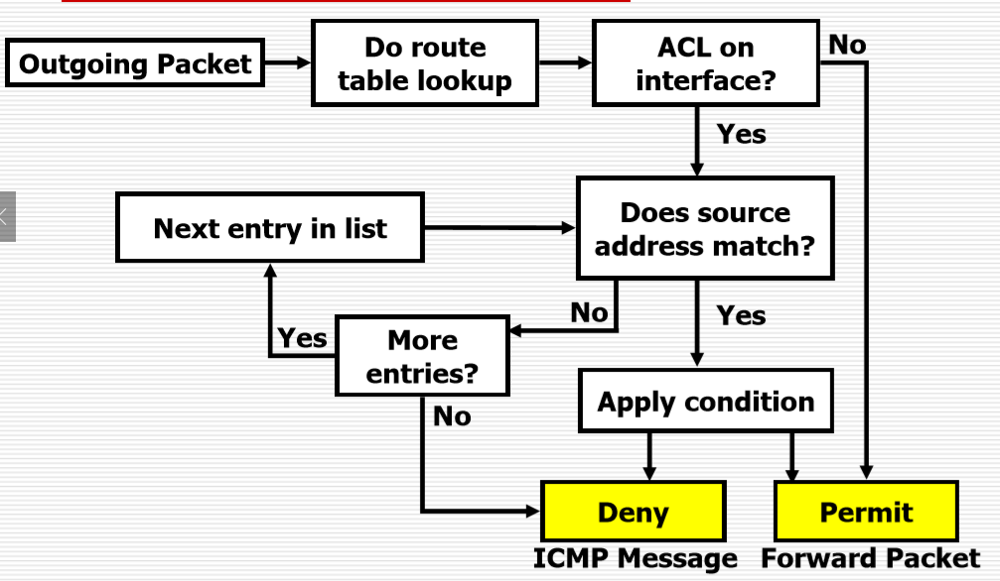\n\n\n\n

\n
  1. 收到packet，确定路由表确认路由表看能够转发
\n\n\n\n
  2. 可以转发的话，进入ACL确认\n\n
     1. 如果当前端口没有ACL配置，则直接进行转发
\n\n\n\n
     2. 如果当前端口有ACL配置，开始匹配source地址(标准的ACL，只能对原地址进行判断)\n\n
        1. 语句满足条件，\n\n
           1. deny
\n\n\n\n
           2. premit
\n\n
\n\n\n\n
        2. 语句不满足条件，看下一条，如果没有下一条，则默认deny
\n\n
\n\n
\n
\n\n\n\n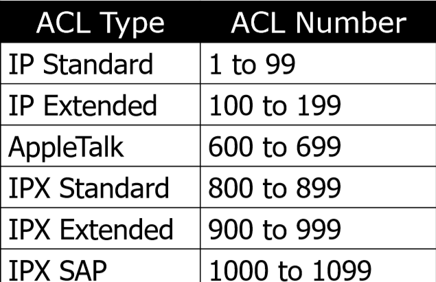\n\n\n\n

对于ACL而言，后面的mask0表示匹配，1表示无视

\n\n\n\n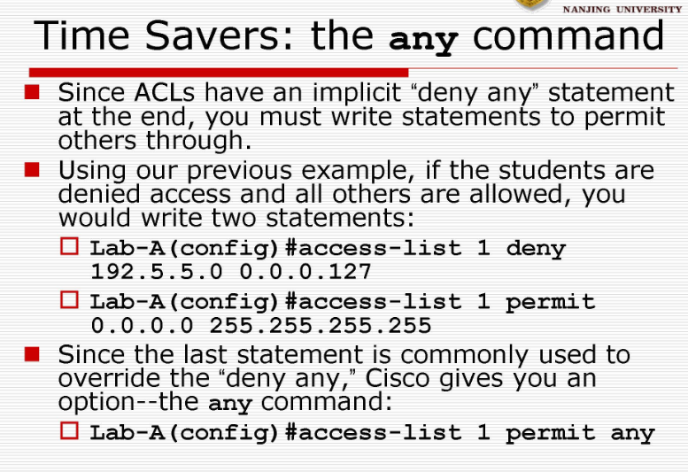\n\n\n\n

CIDR（子网聚合与超网划分）

\n\n\n\n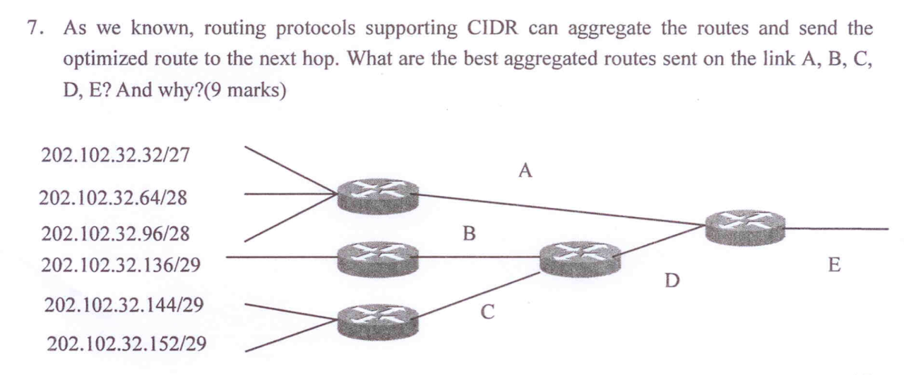\n\n\n\n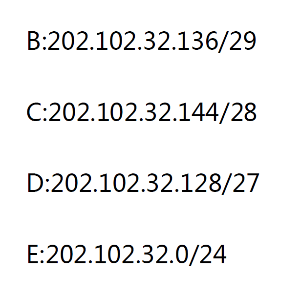\n\n\n\n

## CIDR表示法

\n\n\n\n

CIDR使用一个**斜线后跟一个数字** 来表示前缀长度。例如，`192.168.0.0/16`表示前16位为网络部分，剩余的位数为主机部分

\n\n\n\n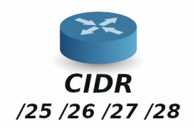\n\n\n\n

例题：

\n\n\n\n

### 例题1

\n\n\n\n

将以下IP地址划分为合适的CIDR块：

\n\n\n\n

\n
  * IP地址范围：192.168.0.0 - 192.168.31.255
\n\n\n\n
  * 子网划分要求：每个子网最多包含100台主机
\n
\n\n\n\n

请写出合适的CIDR块（以CIDR表示法表示），并计算划分后的子网数。

\n\n\n\n

###### 解题过程

\n\n\n\n

根据题目要求，我们需要每个子网最多包含100台主机。这意味着每个子网需要有至少7个位的主机位。

\n\n\n\n

我们可以通过找到最大的CIDR块来划分IP地址范围。为了找到最大的CIDR块，我们需要找到最大的子网掩码。

\n\n\n\n

在给定的IP地址范围中，最大的子网掩码为255.255.224.0，对应的CIDR表示为/19。

\n\n\n\n

划分后的子网数可以通过计算2的（32-19）次方得出，即2^13 = 8192。因此，划分后的子网数为8192个。

\n\n\n\n

因此，合适的CIDR块为192.168.0.0/19，并且划分后共有8192个子网。

\n\n\n\n

\n
  1. **地址空间的高效利用** ：CIDR可以根据实际需求对IP地址进行更细粒度的划分，避免了IP地址的浪费。这对于IPv4地址空间的紧张是非常重要的。
\n\n\n\n
  2. **灵活的地址分配** ：CIDR允许网络管理员根据需要对IP地址进行分配，而不受固定的类别限制。这样可以更好地适应不同规模和需求的网络。
\n\n\n\n
  3. **简化路由表** ：CIDR可以将多个连续的IP地址块聚合成一个较小的路由表项，减少了路由表的大小和维护成本。这对于互联网路由的可扩展性是非常重要的。
\n
\n\n\n\n

## 第四层：传输层（Transport layer）以及TCP/IP

\n\n\n\n

\n
  1. 第4层执行多项功能：\n\n
     1. 分割上层应用程序数据(新的数据单元-数据段)
\n\n\n\n
     2. 建立端到端(end to end)的运营
\n\n\n\n
     3. 从一个终端主机向另一个终端主机发送段(第三层和第二层不进行可靠性检验，第四层完成可靠性检验，接受方认为数据错误，在第四层进行要求重传)
\n\n\n\n
     4. 流量控制和可靠性\n\n
        1. 可以比喻为与外国人交谈:通常，您会要求外国人重复他/她的话(可靠性)并慢声说话(流量控制)
\n\n\n\n
        2. 双方主机的网络的处理能力不同，缓存能力不同
\n\n
\n\n
\n
\n\n\n\n\n
  1. TCP: 可靠(效率比较低，早期网络应用少，需要可靠性)\n\n
     1. 面向连接，使用确认机制，提供流量控制
\n\n\n\n
     2. 软件检查细分
\n\n\n\n
     3. 重新发送丢失或错误的任何内容
\n\n
\n\n\n\n
  2. UDP: 不可靠\n\n
     1. 无连接，不使用确认，不进行流量控制
\n\n\n\n
     2. 不提供用于细分的软件检查
\n\n\n\n
     3. 直接丢弃错误的报文，而不进行其他操作。
\n\n
\n
\n\n\n\n

###   
1.1.1. 端口分配规范

\n\n\n\n

\n
  1. 低于255的端口号(0-255)保留给TCP和UDP公共应用程序使用。(端口号0-255是public的，不可以随意分给其他的进程，如果分发则不符合规范)
\n\n\n\n
  2. 0-1023是熟知端口，有分发的规范，不应当被随意使用
\n\n\n\n
  3. 1024-49151的端口号进行登记使用，有的是应用程序已经的使用端口号，避免冲突
\n\n\n\n
  4. 基于端口号的不同，进行不同的包的分发
\n
\n\n\n\n

## 2.1. TCP必须解决的问题

\n\n\n\n

\n
  1. 可靠传输
\n\n\n\n
  2. 流传输\n\n
     1. 滑动窗口(窗口进行通信，一次数据传输是有上限发的，缓存问题，拥塞问题)
\n\n\n\n
     2. 避免拥塞
\n\n
\n\n\n\n
  3. 连接控制\n\n
     1. 建立连接:三次握手
\n\n\n\n
     2. 断开连接:四次握手
\n\n
\n
\n\n\n\n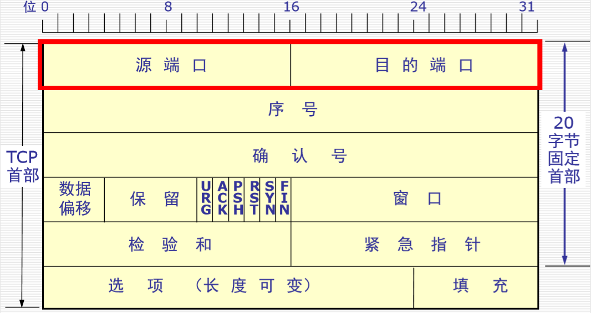\n\n\n\n

### Establish Connection TCP:建立可靠连接

\n\n\n\n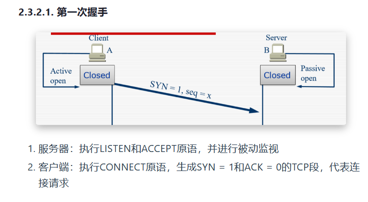\n\n\n\n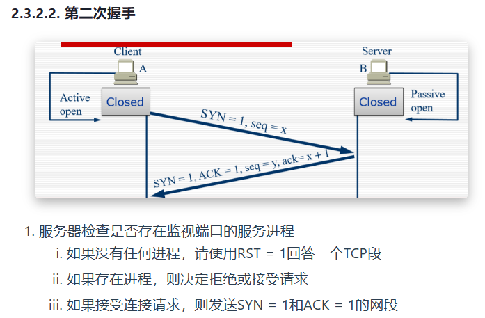\n\n\n\n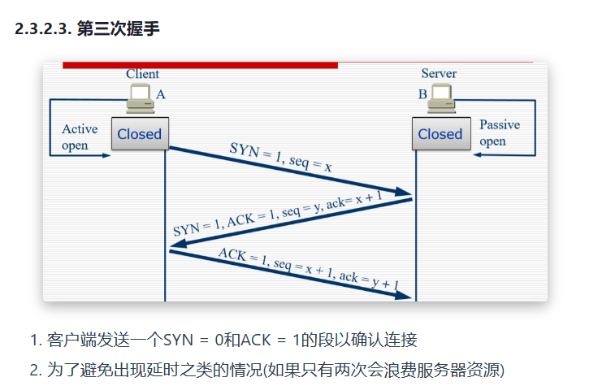\n\n\n\n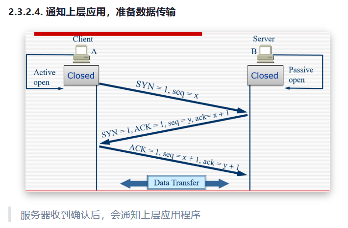\n\n\n\n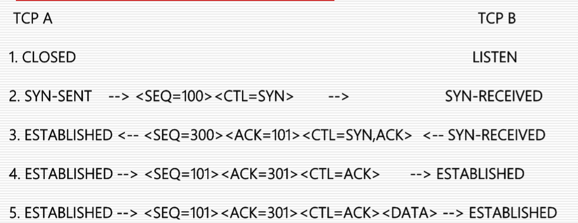\n\n\n\n

\n
  1. 发送段后，**暂时保留备份** \n\n
     1. 在发送后没有收到确认的时候，要保存备份来重传
\n\n\n\n
     2. 收到确认的时候，抛弃备份
\n\n\n\n
     3. 超时计时器:如果对方的应答超过一定时间后则直接进行重发(时间要比正常往返时间稍微长一点)
\n\n
\n\n\n\n
  2. 每个网段和ACK必须具有ID
\n\n\n\n
  3. 重新发送时间必须**大于** 平均传输时间 * 2
\n\n\n\n
  4. 停止等待协议是一个简单的协议，但是效率很低
\n\n\n\n
  5. 实施控制，来进行错误处理
\n
\n\n\n\n

ARQ实例（automatic Repeat reQuest）

\n\n\n\n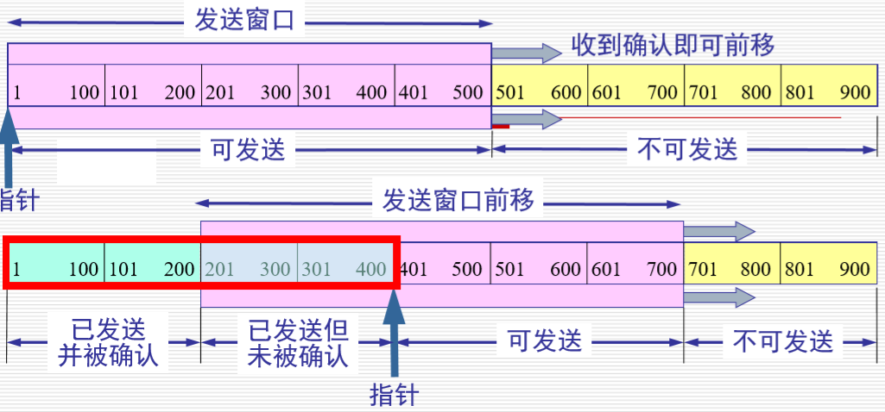\n\n\n\n

## TCP:释放链接

\n\n\n\n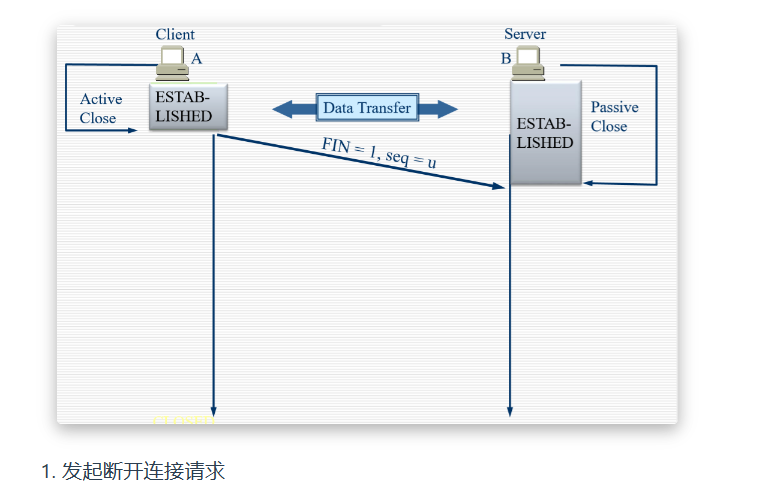\n\n\n\n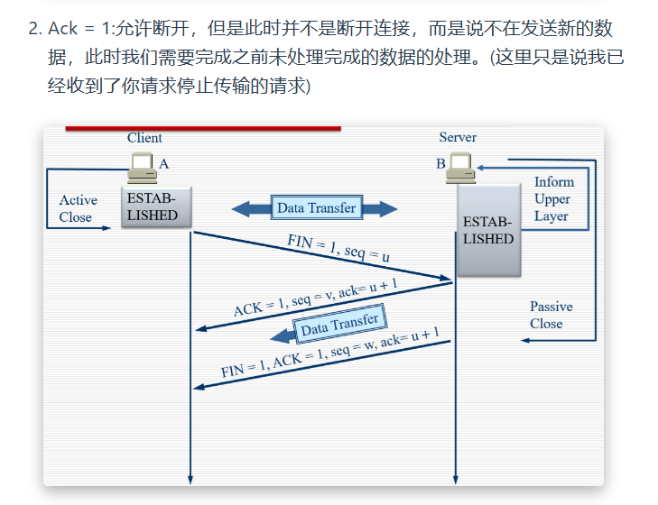\n\n\n\n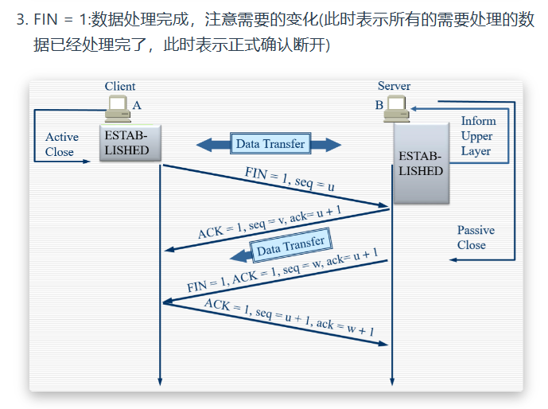\n\n\n\n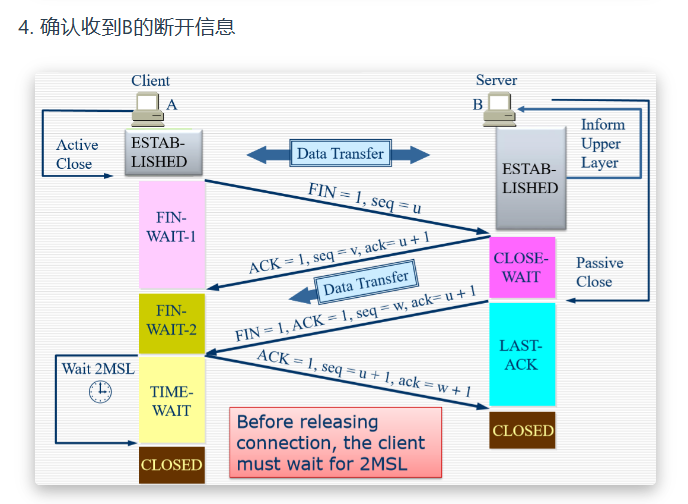\n\n\n\n

### 结束后必须等待2MSL？

\n\n\n\n

\n
  1. 为了确保A发送的最后一个ACK可以到达B
\n\n\n\n
  2. 防止出现任何无效的连接请求段：等待2 MSL之后，我们可以确保连接上的所有段均已消失
\n
\n\n\n\n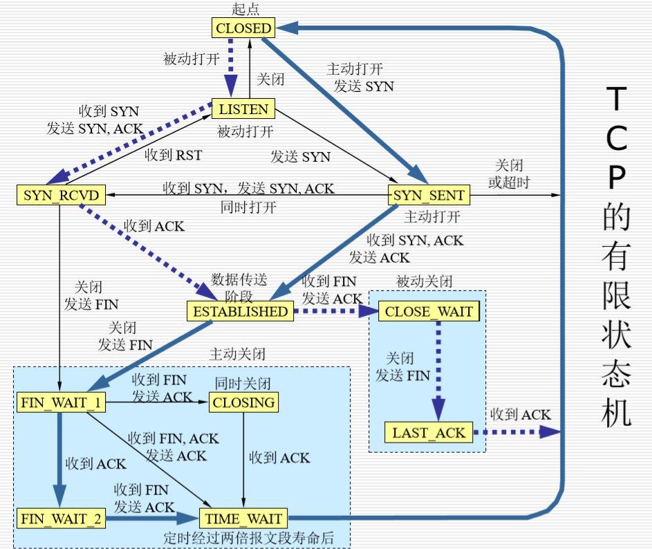\n\n\n\n

### UDP

\n\n\n\n

\n
  1. UDP用于：\n\n
     1. RIP:定期发送路由信息(periodically)
\n\n\n\n
     2. DNS:避免延迟建立TCP连接(DNS需要快速找到)
\n\n\n\n
     3. SNMP:SNMP：拥塞时(congestion)，SNMP必须仍然可运行。在没有拥塞和可靠性控制机制的情况下，UDP在这种情况下的性能要优于TCP。(主播和多播，大量信息传输)
\n\n\n\n
     4. 其他协议包括TFTP，DHCP
\n\n
\n
\n\n\n\n\n
  1. 为什么我们需要UDP？\n\n
     1. 没有建立连接(避免延时)
\n\n\n\n
     2. 简单：发送方，接收方无连接状态
\n\n\n\n
     3. 小段标题
\n\n\n\n
     4. 没有拥塞控制：UDP可以按照期望的速度传输
\n\n
\n
\n\n\n\n

## NAT和PAT

\n\n\n\n

\n
  1. NAT，是在IP数据包头中将一个地址交换为另一个地址的过程\n\n
     1. 网络地址转换
\n\n\n\n
     2. 是网络地址即将用完的解决方案
\n\n
\n
\n\n\n\n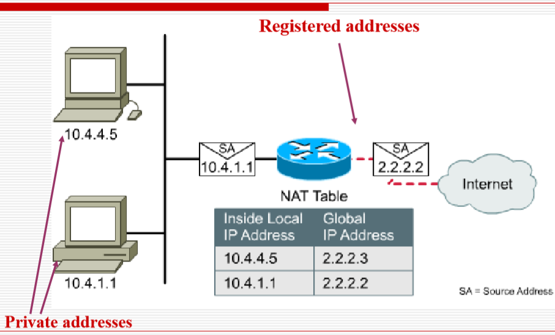\n\n\n\n

\n
  1. NAT需要一个路由器来实现
\n\n\n\n
  2. 左侧是一个局域网
\n\n\n\n
  3. 在NAT 路由器将局部地址 转换成 网络上的地址(双向转换，有一个NAT表)
\n
\n\n\n\n

## 4.3. NAT的类型

\n\n\n\n

\n
  1. 静态NAT：固定的内部地址(internal address)到注册地址(registered address)的映射(一开始就写死)
\n\n\n\n
  2. 动态NAT：映射以先到先得的方式动态进行(不是写死，配一个地址池,通过更新)
\n\n\n\n
  3. PAT(过载，Port address translation)：端口地址转换用于允许许多内部用户共享一个"内部全局"地址(基于Socket映射，而不是IP地址，多个内网主机映射到一个公网地址)
\n
\n\n\n\n

## 4.4. NAT地址类型

\n\n\n\n

\n
  1. Inside Local address (内部本地地址):内网IP地址
\n\n\n\n
  2. Inside Global address (内部全局地址): 注册IP地址, 对外部展示的内部地址
\n\n\n\n
  3. Outside Global address (外部全局地址):由主机所有者分配的IP地址。通常是注册地址。(对内网而言的外部，是目的地址
\n\n\n\n
  4. 内部主机发送报文给网关，网关根据NAT Table进行翻译，转换成内部全局地址，然后进行转发
\n
\n\n\n\n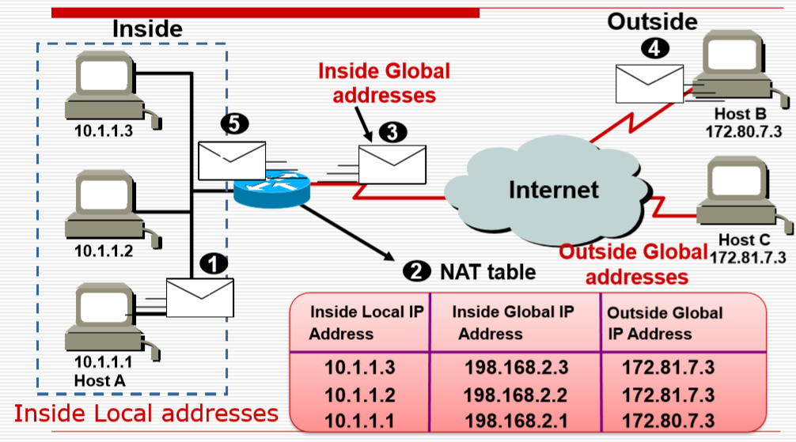\n\n\n\n

\n
  1. 优点：由于并非每个内部主机都需要同时进行外部访问，因此您可以使用少量的全局唯一地址池来服务相对大量的私有寻址主机。
\n\n\n\n
  2. 缺点：一一映射，并没有从根本上解决地址短缺的问题。
\n\n\n\n
  3. 也就是说，如果专用地址空间为/8，但公用地址为/ 24，则一次只能有254个主机可以访问Internet，主要内网不是同时有很多主机上网，就可以如上操作，进一步降低地址压力(类似并行和穿行的区别)
\n
\n\n\n\n

\n\n\n\n

\n\n\n\n

\n\n\n\n

\n\n\n\n

\n\n\n\n

\n\n\n\n

\n\n\n\n

\n\n\n\n

\n\n\n\n

\n\n\n\n

\n\n\n\n

\n\n\n\n

\n\n\n\n

\n\n\n\n

\n\n\n\n

\n\n\n\n

\n\n\n\n

\n\n\n\n

\n\n\n\n

\n\n\n\n

\n\n\n\n

\n\n\n\n

\n\n\n\n

\n\n\n\n

\n\n\n\n

\n\n\n\n

\n\n\n\n

\n\n\n\n

\n\n\n\n

\n\n\n\n

\n\n\n\n

\n\n\n\n

\n\n\n\n

\n\n\n\n

\n\n\n\n

\n\n\n\n

\n\n\n\n

\n\n\n\n

\n\n\n\n

\n\n\n\n

\n\n\n\n

\n\n\n\n

\n\n\n\n

\n\n\n\n

\n\n\n\n

\n\n\n\n

\n\n\n\n

\n