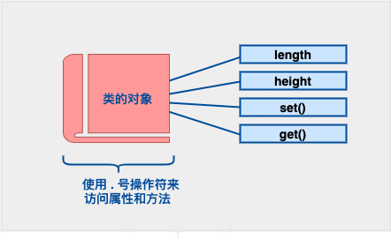

类的基本定义

定义一个类，本质上是定义一个数据类型的蓝图。这实际上并没有定义任何数据，但它定义了类的名称意味着什么，也就是说，它定义了类的对象包括了什么，以及可以在这个对象上执行哪些操作。

    
    class Box
{
   public:
      double length;   // 盒子的长度
      double breadth;  // 盒子的宽度
      double height;   // 盒子的高度
};

类提供了对象的蓝图，所以基本上，对象是根据类来创建的。声明类的对象，就像声明基本类型的变量一样。下面的语句声明了类 Box 的两个对象：

Box Box1;          // 声明 Box1，类型为 Box

Box Box2;          // 声明 Box2，类型为 Box

类的对象的公共数据成员可以使用直接成员访问运算符 . 来访问。

**概念**| **描述**  
---|---  
类成员函数| 类的成员函数是指那些把定义和原型写在类定义内部的函数，就像类定义中的其他变量一样。  
类访问修饰符| 类成员可以被定义为 public、private 或 protected。默认情况下是定义为 private。  
构造函数 & 析构函数| 类的构造函数是一种特殊的函数，在创建一个新的对象时调用。类的析构函数也是一种特殊的函数，在删除所创建的对象时调用。  
C++ 拷贝构造函数| 拷贝构造函数，是一种特殊的构造函数，它在创建对象时，是使用同一类中之前创建的对象来初始化新创建的对象。  
C++ 友元函数| **友元函数** 可以访问类的 private 和 protected 成员。  
C++ 内联函数| 通过内联函数，编译器试图在调用函数的地方扩展函数体中的代码。  
C++ 中的 this 指针| 每个对象都有一个特殊的指针 **this** ，它指向对象本身。  
C++ 中指向类的指针| 指向类的指针方式如同指向结构的指针。实际上，类可以看成是一个带有函数的结构。  
C++ 类的静态成员| 类的数据成员和函数成员都可以被声明为静态的。  

类的成员函数是指那些把定义和原型写在类定义内部的函数，就像类定义中的其他变量一样。类成员函数是类的一个成员，它可以操作类的任意对象，可以访问对象中的所有成员。

让我们看看之前定义的类 Box，现在我们要使用成员函数来访问类的成员，而不是直接访问这些类的成员：

    
    class Box
{
   public:
      double length;         // 长度
      double breadth;        // 宽度
      double height;         // 高度
      double getVolume();// 返回体积
};

成员函数可以定义在类定义内部，或者单独使用范围解析运算符 :: 来定义。在类定义中定义的成员函数把函数声明为内联的，即便没有使用 inline 标识符。所以您可以按照如下方式定义 getVolume() 函数：

    
    class Box
{
   public:
      double length;      // 长度
      double breadth;     // 宽度
      double height;      // 高度
      double getVolume(void)
      {
         return length * breadth * height;
      }
};

您也可以在类的外部使用范围解析运算符 :: 定义该函数，如下所示：

    
    double Box::getVolume(void)
{
    return length * breadth * height;
}

数据封装是面向对象编程的一个重要特点，它防止函数直接访问类类型的内部成员。类成员的访问限制是通过在类主体内部对各个区域标记 public、private、protected 来指定的。关键字 public、private、protected 称为访问修饰符。

一个类可以有多个 public、protected 或 private 标记区域。每个标记区域在下一个标记区域开始之前或者在遇到类主体结束右括号之前都是有效的。成员和类的默认访问修饰符是 private。

class Base {

   public:

  // 公有成员

   protected:

  // 受保护成员

   private:

  // 私有成员

};

**公有（public）成员**  
公有成员在程序中类的外部是可访问的。您可以不使用任何成员函数来设置和获取公有变量的值，如下所示

**私有（private）成员**  
私有成员变量或函数在类的外部是不可访问的，甚至是不可查看的。只有类和友元函数可以访问私有成员。

默认情况下，类的所有成员都是私有的。这意味着，如果您没有使用任何访问修饰符，类的成员将被假定为私有成员：

实际操作中，我们一般会在私有区域定义数据，在公有区域定义相关的函数，以便在类的外部也可以调用这些函数

**protected（受保护）成员**

protected（受保护）成员变量或函数与私有成员十分相似，但有一点不同，protected（受保护）成员在派生类（即子类）中是可访问的。

有关构造函数的一些解释与范例：  

    
    class MyClass {
private:
  int num;
public:
  // 构造函数使用成员初始化列表初始化 num 变量
  explicit MyClass(int n) : num(n) {}
};
// 例子2: 初始化多个成员变量
class Point {
private:
  int x;
  int y;
public:
  // 构造函数使用成员初始化列表初始化 x 和 y 变量
  Point(int xVal, int yVal) : x(xVal), y(yVal) {}
};
// 例子3: 初始化引用类型成员变量
class Container {
private:
  int& ref;
public:
  // 构造函数使用成员初始化列表初始化 ref 引用
  // 注意：必须通过引用初始化列表来初始化引用类型成员变量
  Container(int& val) : ref(val) {}
};
// 例子4: 初始化基类成员变量
class Base {
protected:
  int num;
public:
  Base(int n) : num(n) {}
};
class Derived : public Base {
private:
  int additionalNum;
public:
  // 构造函数使用成员初始化列表初始化基类和派生类的成员变量
  Derived(int n, int additional) : Base(n), additionalNum(additional) {}
};
