\n

Tian Tan &Yue Li

\n\n\n\n

## Introduction

\n\n\n\n

static program analysis(about PL)

\n\n\n\n

In the last decade, the language core had few changes, but the programs became significantly larger and more complicated.

\n\n\n\n

Why we need Static Analysis?

\n\n\n\n

\+ Program reliability  
\+ Program security  
\+ Compiler optimization  
\+ Program understanding

\n\n\n\n

不要浮躁

\n\n\n\n

认识自己

\n\n\n\n

重拾自信

\n\n\n\n

**definition** : analysis a program P to reason about its behavior and determines whether it satisfies some properties **before** running P.

\n\n\n\n

**Rice Theorem** :there is no approach to determine whether……  
递归可枚举语言的所有非平凡性质都是不可判定的

\n\n\n\n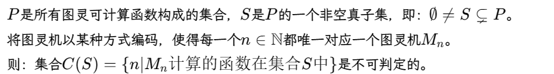\n\n\n\n

目前我们接触到的编程语言基本都是递归可枚举语言。所谓的“非平凡性质”可以简单理解为是那些有趣、有价值的性质，比如前面我们提到的是否存在信息泄露漏洞等。也就是说，不存在完美的静态分析来确定程序 _P_ 是否满足某个非平凡性质。

\n\n\n\n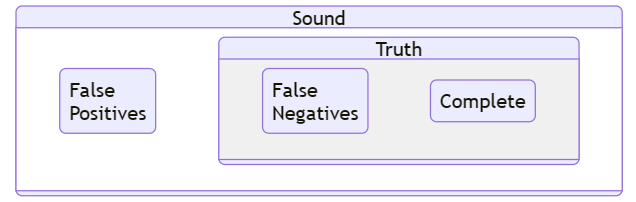\n\n\n\n

recursively enumerable = recognizable by Turing machine

\n\n\n\n

There is no sound and complete ways to analysis program.

\n\n\n\n

sound: over-approximate  
complete: under-approximate

\n\n\n\n

另外，sound的结果可以称为over-approximate，complete的结果也可以称为under-approximate。尽管完美的分析并不存在，但是有用的分析是存在的，这通常需要在某种程度上牺牲soundness或completeness中的一个。例如，牺牲一定soundness，则会产生漏报（false negatives）；牺牲一定completeness，则会产生误报（false positives）。

\n\n\n\n

通常情况下，我们总是选择牺牲completeness，保全soundness。宁可有误报，也不漏掉一个正确结果。Soundness对编译器优化、程序验证等领域十分重要。

\n\n\n\n

So we give up **perfect** ones but choose **useful** ones

\n\n\n\n

### Abstraction & Over-approximation

\n\n\n\n

大多数静态分析可以用这两个词概括：abstraction和over-approximation，后者又包含transfer functions和control flows。

\n\n\n\n

在这里老师举了一个例子来讲解：给定一个程序，确定其中所有变量的符号。Abstraction是指将变量从concrete domain映射到abstract domain，方便后续处理。Abstract domain就是符号集合。由于在程序中，变量很可能是不确定的（unknown）或非法、未定义（undefined）的，因此abstract domain包含五类符号：+−O⊤⊥+−O⊤⊥，其中⊤⊤表示unknown，⊥⊥表示undefined。这种映射如下图所示：

\n\n\n\n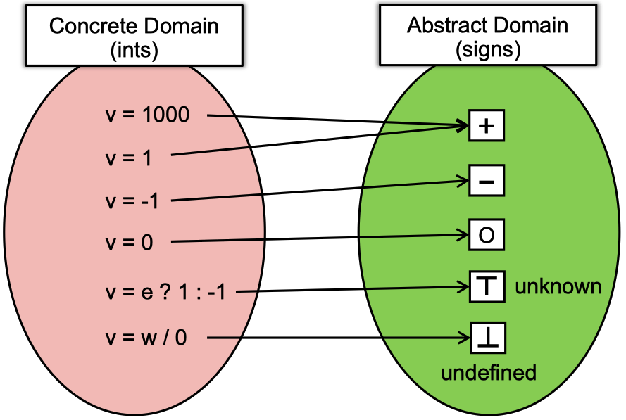\n\n\n\n

> \n
> 
> 静态分析中over-approximation部分的transfer functions定义了怎样在abstract values上对程序语句求值。Transfer functions通常根据要分析的问题和程序语句相关的语义确定。对于算数运算，相关的transfer functions可以由算术运算规则和特性生成，例如（下图中左侧是transfer functions，右侧是在abstract domain上的运算结果）：
> 
> \n\n\n\n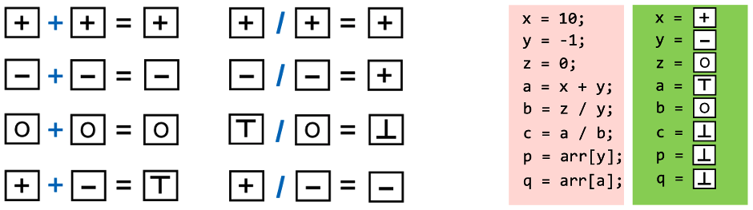\n\n\n\n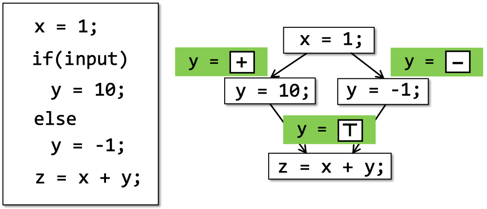\n\n\n\n
> 
> mainly target on sound
> 
> \n\-------Li Yue

\n\n\n\n

Bird's Eyes View 

\n\n\n\n
    
    
    if(input)\n    x = 1;\n  else\n    x = 0;  

\n\n\n\n

two analysis result:

\n\n\n\n

1.when input = true , x = 1   
when input = false, x= 0 sound precise expensive

\n\n\n\n

2, x=1 or x= 0 sound imprecise cheap

\n\n\n\n

ensure soundness while making good trade-offs between analysis precision and analysis speed.

\n\n\n\n

Live Variable analysis

\n\n\n\n

## 程序的中间表示

\n\n\n\n

编译器将源代码（Source code） 转换为机器代码（Machine Code）。其中的流程框架是：

\n\n\n\n

\n
  * 词法分析器（Scanner），结合正则表达式，通过词法分析（Lexical Analysis）将 source code 翻译为 token。
\n\n\n\n
  * 语法分析器（Parser），结合上下文无关文法（Context-Free Grammar），通过语法分析（Syntax Analysis），将 token 解析为抽象语法树（Abstract Syntax Tree, AST）
\n\n\n\n
  * 语义分析器（Type Checker），结合属性文法（Attribute Grammar），通过语义分析（Semantic Analysis），将 AST 解析为 decorated AST
\n\n\n\n
  * Translator，将 decorated AST 翻译为生成三地址码这样的中间表示形式（Intermediate Representation, IR），并**基于 IR 做静态分析** （例如代码优化这样的工作）。
\n\n\n\n
  * Code Generator，将 IR 转换为机器代码。
\n
\n\n\n\n

IR: Three-Address Code  
三地址码（3-Address Code）通常没有统一的格式。在每个指令的右边至多有一个操作符

\n\n\n\n

三地址码为什么叫做三地址码呢？因为每条 3AC 至多有三个地址。而一个「地址」可以是：

\n\n\n\n

\n
  * 名称 Name: a, b
\n\n\n\n
  * 常量 Constant: 3
\n\n\n\n
  * 编译器生成的临时变量 Compiler-generated Temporary: t1, t2
\n
\n\n\n\n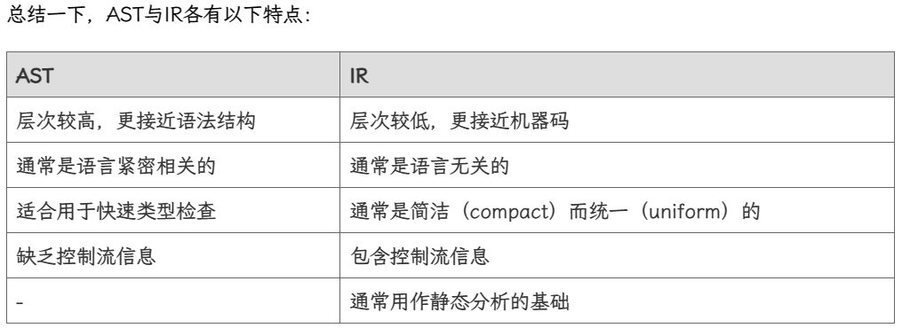\n\n\n\n

Common forms of three-address codes:

\n\n\n\n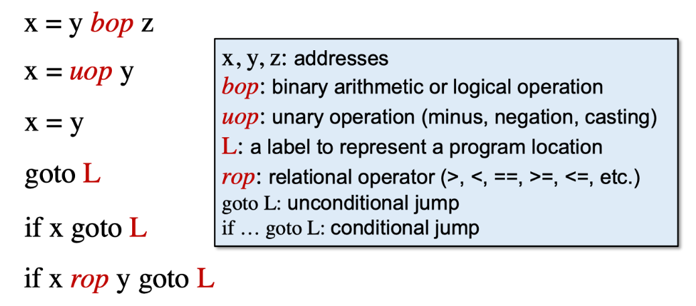\n\n\n\n

looking through compilers:

\n\n\n\n

Scanner->doing lexical analysis(regular expression)-[tokens]>Parser->doing syntax analysis(context-free grammar)-[AST]>Type Checker->Translator-(IR)(static analysis such as code opitimization)>code generator(machine code)

\n\n\n\n

why we name it 3AC?  
Each ３AC contains at most three addresses

\n\n\n\n

### Basic Blocks(BB)

\n\n\n\n

BB指的是一个连续、最长的3AC序列，该序列具有以下特性：

\n\n\n\n

\n
  * 控制流只能从该序列的起始指令进入。
\n\n\n\n
  * 控制流只能从该序列的最后一条指令退出。
\n
\n\n\n\n

上一节中示例图右侧的B1到B6就是六个具有以上特性的BB。现在的问题是，给定一段3AC，如何将其划分为不同的BB？

\n\n\n\n

经过尝试，我们找到了这样一个算法来划分BB：

\n\n\n\n

\n
  1. 确定3AC序列中的leaders。leaders包括具有以下特性的指令：\n\n
     1. 3AC序列中的第一条指令。
\n\n\n\n
     2. 所有有条件跳转或无条件跳转的所有目标指令。
\n\n\n\n
     3. 所有有条件跳转或无条件跳转后面的一条指令。
\n\n
\n\n\n\n
  2. 划分BB。BB包含leader指令及其后面紧邻的所有非leader指令。
\n
\n\n\n\n

Control Flow Analysis

\n\n\n\n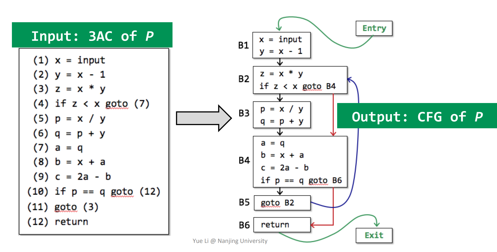\n\n\n\n

划分好BB的基础上，我们就可以构建CFG了。CFG具有如下特性：

\n\n\n\n

\n
  * CFG的节点均为BB。
\n\n\n\n
  * 从块A到块B之间有一个有向边，当且仅当“从A到B一个有条件或无条件跳转”，或“B是A后面的紧邻块且A最后一条指令不是无条件跳转”。
\n\n\n\n
  * 将原来3AC序列中的所有“跳转到某指令标签处”改为“**跳转到某基本块处** ”。
\n
\n\n\n\n

通常我们还会在CFG的开头和结尾加两个虚拟节点“Entry”和“Exit”。

\n\n\n\n

Data Flow Analysis --Applications

\n\n\n\n

How data flows on CFG(control flows graph)

\n\n\n\n

\n
  * application-specific data
\n
\n\n\n\n\n
  * through the nodes and edges
\n
\n\n\n\n

so abstraction and Over-approximation

\n\n\n\n

包含所有可能----Over-approximation may analysis

\n\n\n\n

input and output state

\n\n\n\n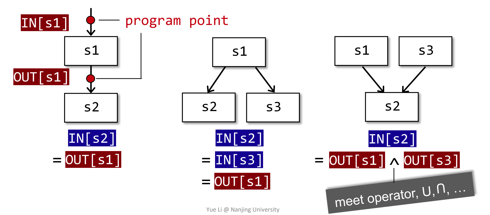\n\n\n\n

we associate every program point a data-flow value

\n\n\n\n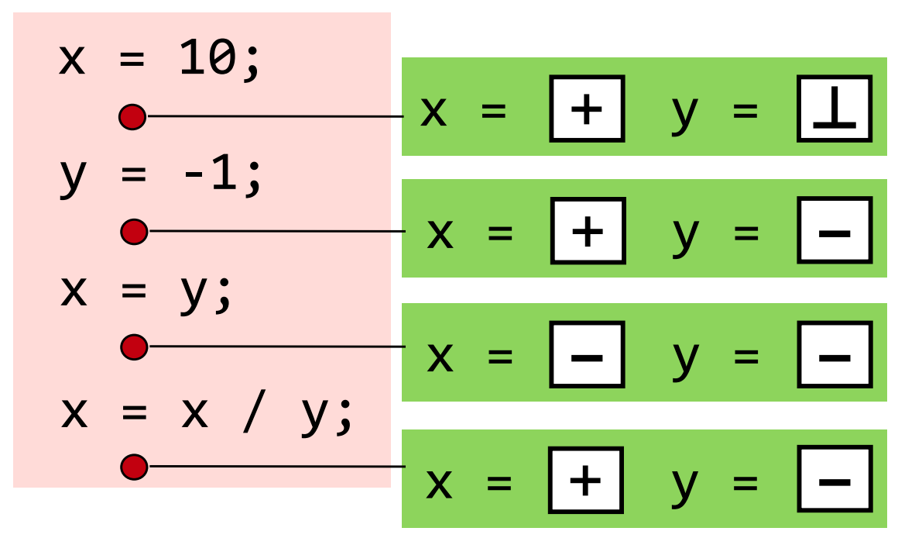\n\n\n\n

the set of possible data-flow values is the domain for the program.

\n\n\n\n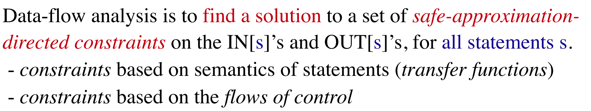\n\n\n\n

数据流分析中的输入状态和输出状态：

\n\n\n\n

\n
  * 每个IR语句的执行将一个输入状态（input state）转换成了一个新的输出状态（output state）。
\n\n\n\n
  * 某个IR语句的输入（输出）状态与该语句之前（之后）的程序点（program point）关联。
\n
\n\n\n\n

### 关于转移方程约束的概念

\n\n\n\n

分析数据流有前向和后向两种：

\n\n\n\n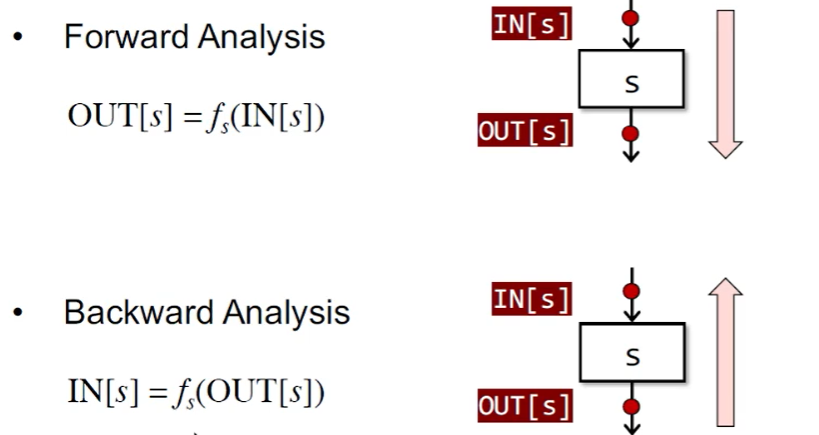\n\n\n\n

Notations for Control Flow's Constraints

\n\n\n\n

\n
  * within a BB
\n
\n\n\n\n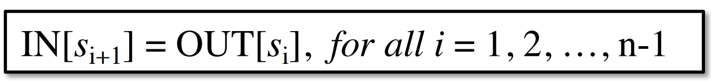\n\n\n\n

\n
  * among BBs
\n
\n\n\n\n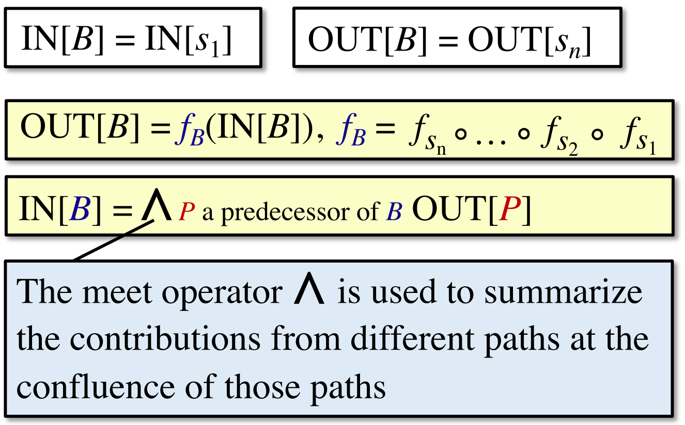\n\n\n\n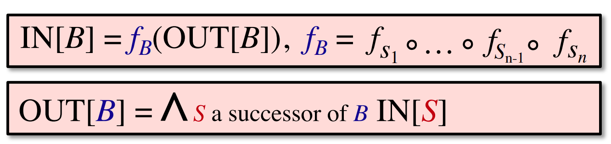\n\n\n\n

在数据流分析应用（application）中，我们通常将每个program point与一个数据流值（data-flow values）关联，此data-flow value代表了在该点上可以观察到的所有可能的程序状态的抽象集合。

\n\n\n\n

对于一个application来说，所有可能的data-flow values构成的集合称为该application的域（domain）。

\n\n\n\n

在以上这些内容的基础上，我们可以说，数据流分析的目的就是要为一个“以safe-approximation为导向”的约束（constraints）集合，为所有语句（statements）s，在IN[s]和OUT[s]上，找到一个解（solution）。

\n\n\n\n

## Reaching Definitions Analysis

\n\n\n\n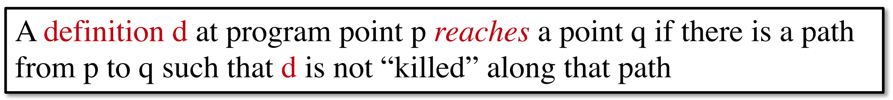\n\n\n\n

对变量v的定义，指的是一个对v赋值的语句。因此，我们可以借助变量v来进一步阐释上述定义：program point p处对变量v的定义在q可达，指的是从p到q有一条路径，而且这条路径上没有其他对v的定义语句。

\n\n\n\n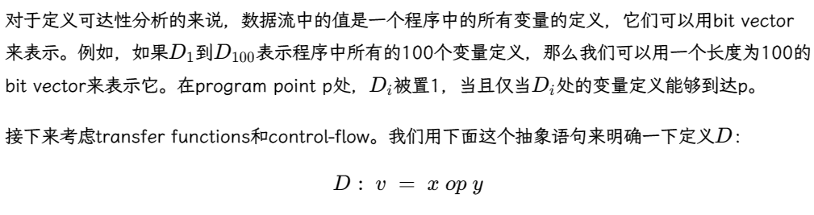\n\n\n\n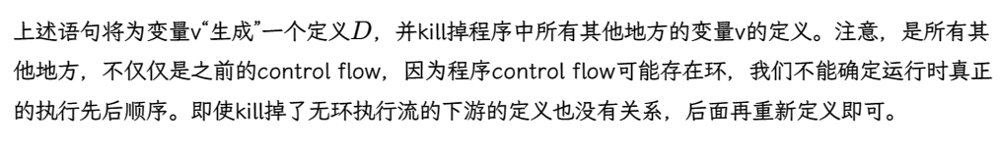\n\n\n\n

on the path there should be no new definition of v

\n\n\n\n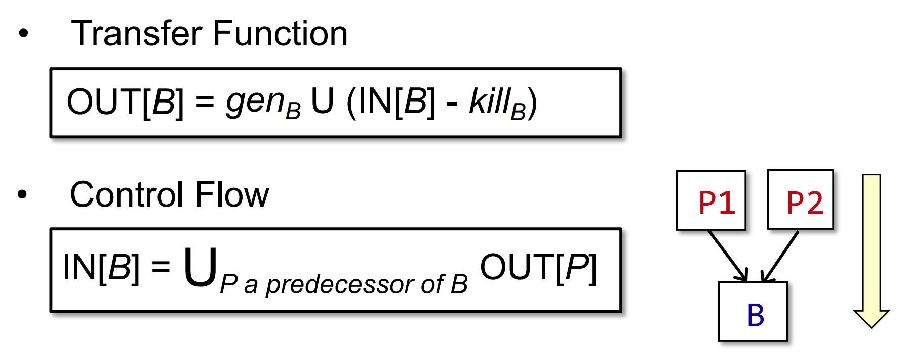\n\n\n\n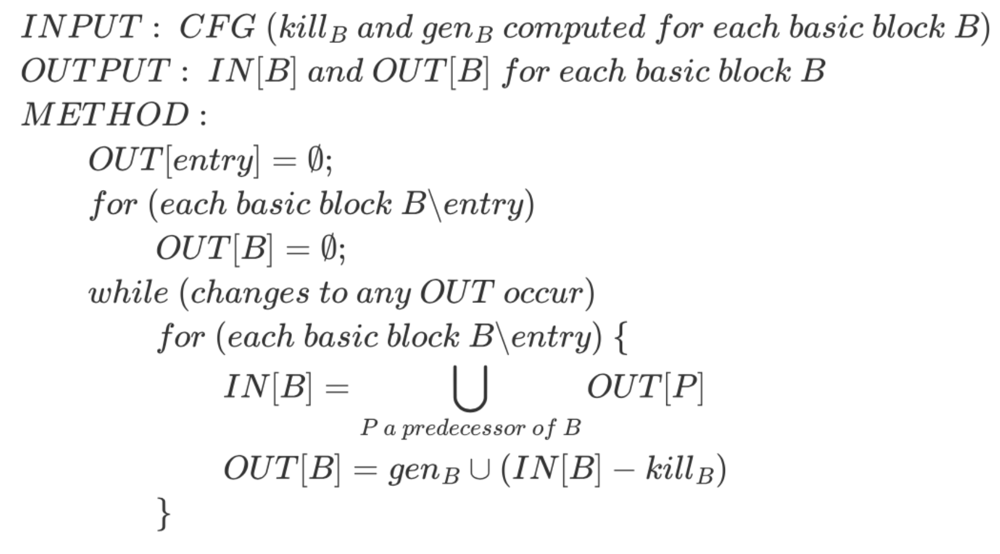\n\n\n\n

the application of the algorithm

\n\n\n\n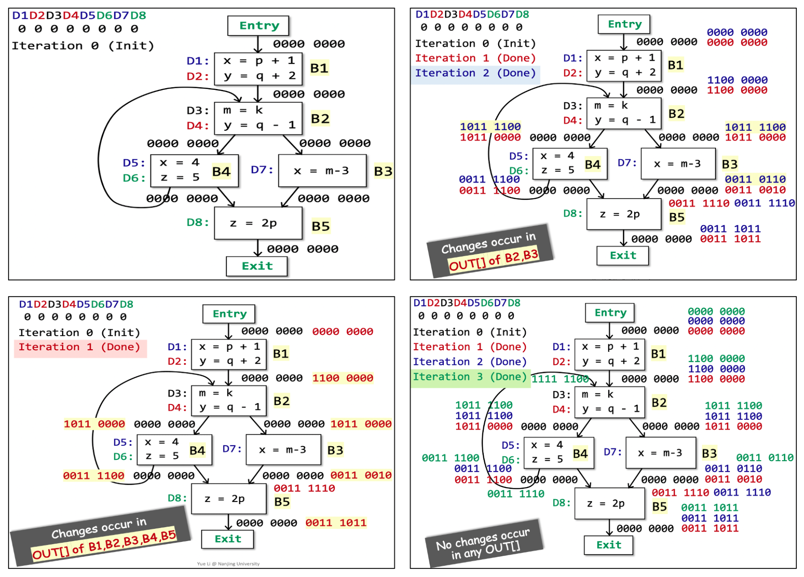\n\n\n\n

why the while could end.

\n\n\n\n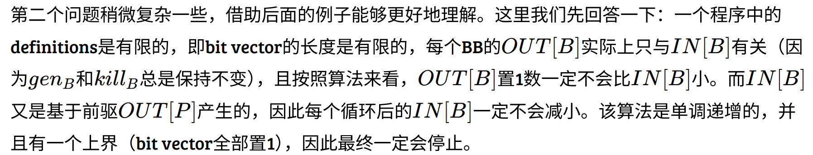\n\n\n\n

## Live Variable Analysis

\n\n\n\n

Live variables analysis tells whether the value of variable v at program point p could be used along some path in CFG starting at p. If so, v is live at p; otherwise, v is dead at p.

\n\n\n\n

根据以上定义，变量v在p点是存活的，当且仅当：

\n\n\n\n

\n
  1. 首先，变量v在p点之后有被使用。
\n\n\n\n
  2. 其次，从p点开始到被使用前，过程中不能出现变量v的重定义。
\n
\n\n\n\n

存活变量分析可用于处理寄存器分配。例如，在寄存器全部被占用、而我们又需要使用其中一个的时候，可以将其中某个在该时刻存储非存活变量的寄存器优先释放出来使用。

\n\n\n\n

和上一节的定义可达性分析类似，接下来分别考虑data abstraction和safe-approximation。

\n\n\n\n

We can use bit vectors to represent all the variables in the analysis.

\n\n\n\n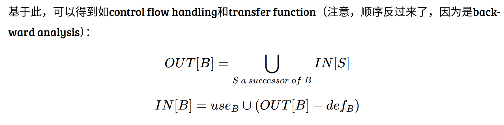\n\n\n\n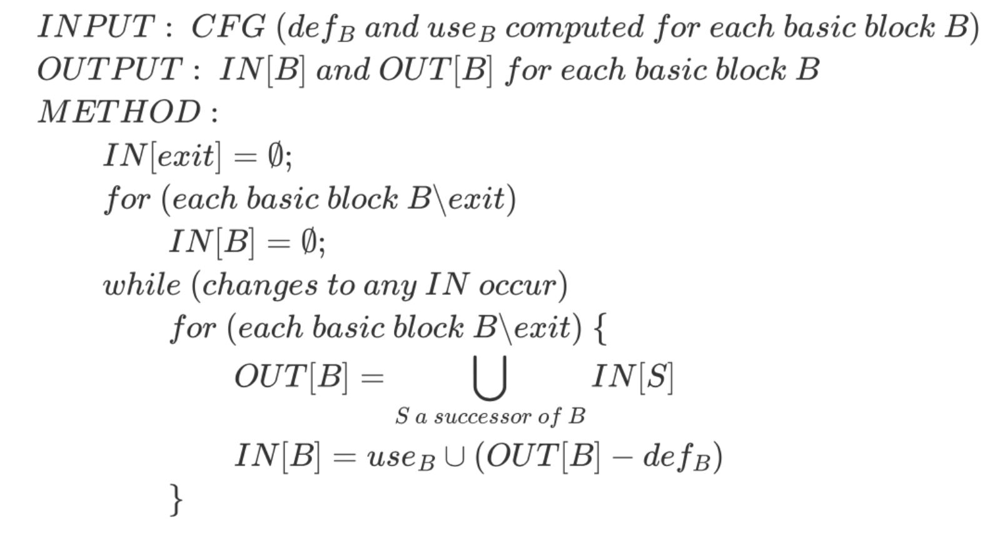\n\n\n\n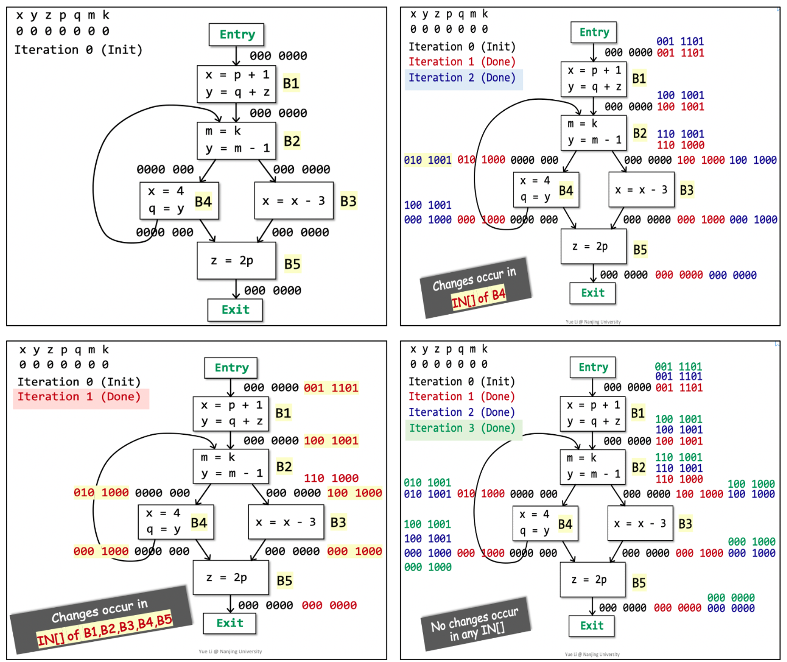\n\n\n\n

## Available Expression Analysis

\n\n\n\n

An expression ‘x op y’ is available at program point p if: (1) all paths from the entry to p must pass through the evaluation of ‘x op y’, and (2) after the last evaluation of ‘x op y’, there is no redefinition of x or y.

\n\n\n\n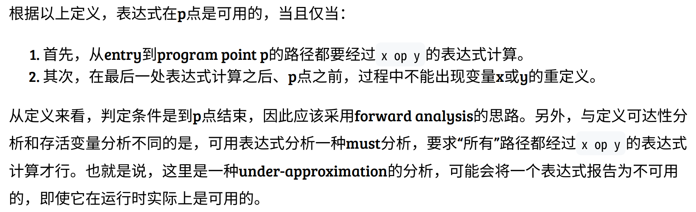\n\n\n\n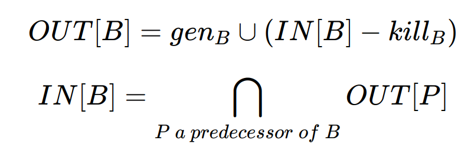\n\n\n\n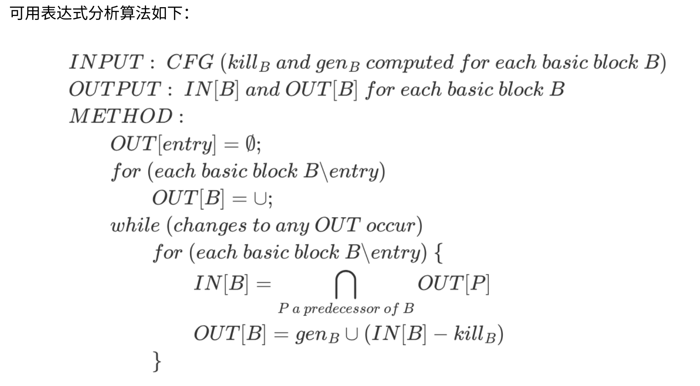\n\n\n\n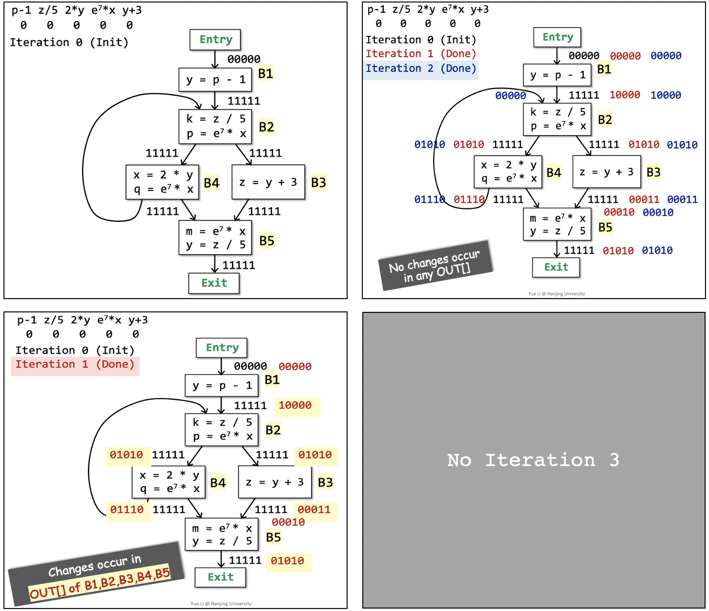\n\n\n\n

注意，这里是must analysis，所以与定义可达性分析不同，control flow handling是对前驱数据结果流取交集，而非并集。

\n\n\n\n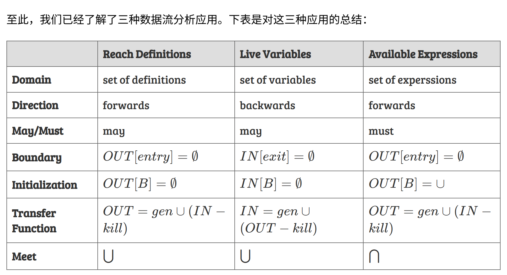\n\n\n\n

\n\n\n\n

Firstly let's recall the iterative algorithm,

\n\n\n\n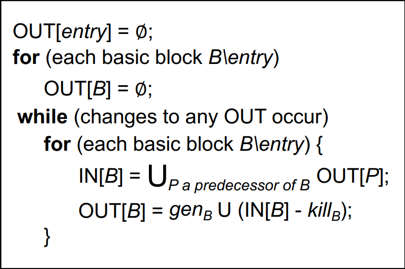\n\n\n\n

\n\n\n\n

## 数据流分析的格理论及证明

\n\n\n\n

格，即上下界均存在且唯一 的偏序集

\n\n\n\n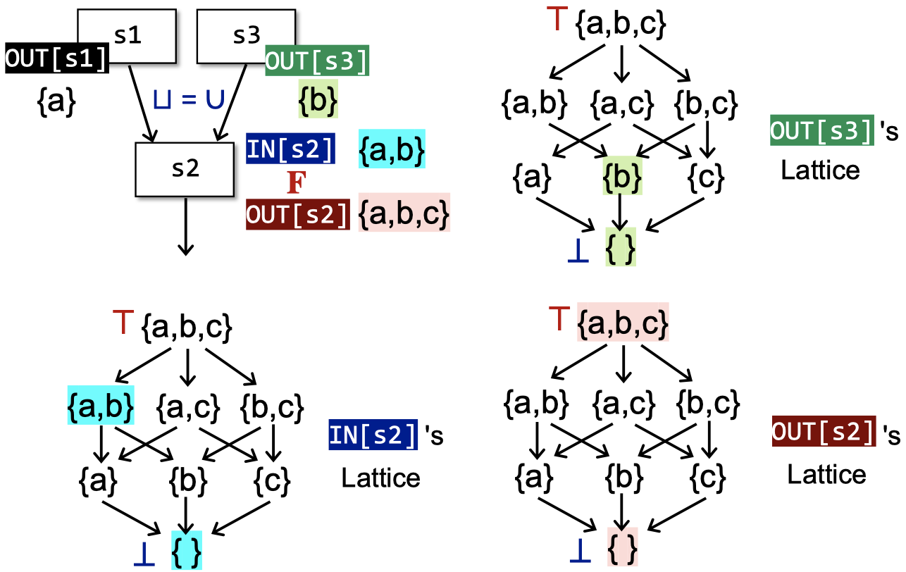\n\n\n\n

对于一次transfer而言，就相当于在格上迭代进行meet/join操作，最后静止涉及到了单调性和不动点定理、

\n\n\n\n

单调性（Monotonicity）和不动点（Fixed Point）定理

\n\n\n\n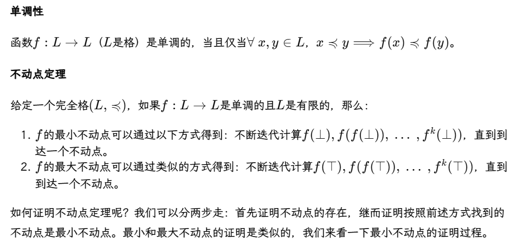\n\n\n\n

## 数据流分析的迭代算法

\n\n\n\n

上一节中，我们学习了偏序、格、格上的函数单调性和不动点定理等数学知识，留下了关于迭代算法的三个问题没有解答：

\n\n\n\n

\n
  1. 这个算法能够保证一定能终止（到达不动点/有解）吗？
\n\n\n\n
  2. 如果上一个问题的答案是肯定的，那么只有一个解/不动点吗？如果有多个不动点，哪一个是最好的、或者说最精确的？
\n\n\n\n
  3. 什么时候这个算法能够到达不动点呢？
\n
\n\n\n\n

本节，我们将陆续来回答这三个问题，并学习一种新的数据流分析应用——常量传播，以及一种基于迭代算法但做了改进的Worklist算法。

\n\n\n\n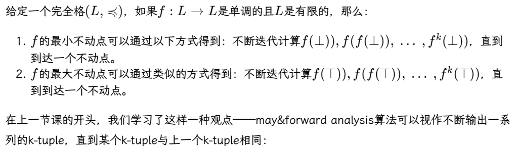\n\n\n\n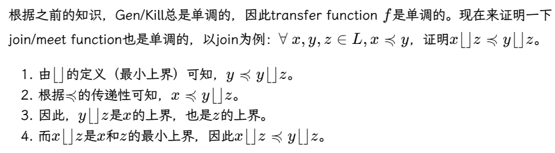\n\n\n\n

第三个问题实际上是问在最坏情况下，需要经过多少次迭代才能达到不动点。我们假设每次迭代只在一个节点OUT对应的格上走了一步，而格的高度是 _h_ （在格上从top到bottom的最长路径），CFG有 _k_ 个节点，那么最多需要 _i_ =_h_ ∗ _k_ 次迭代才能达到不动点。至此，三个问题回答完毕。

\n\n\n\n

从格的视角看数据流分析

\n\n\n\n

假设下面这个幂集表示CFG中各节点的OUT对应的格，图中最上方是⊤，最下方是⊥：

\n\n\n\n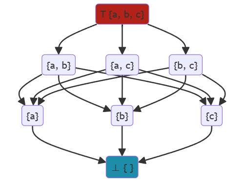\n\n\n\n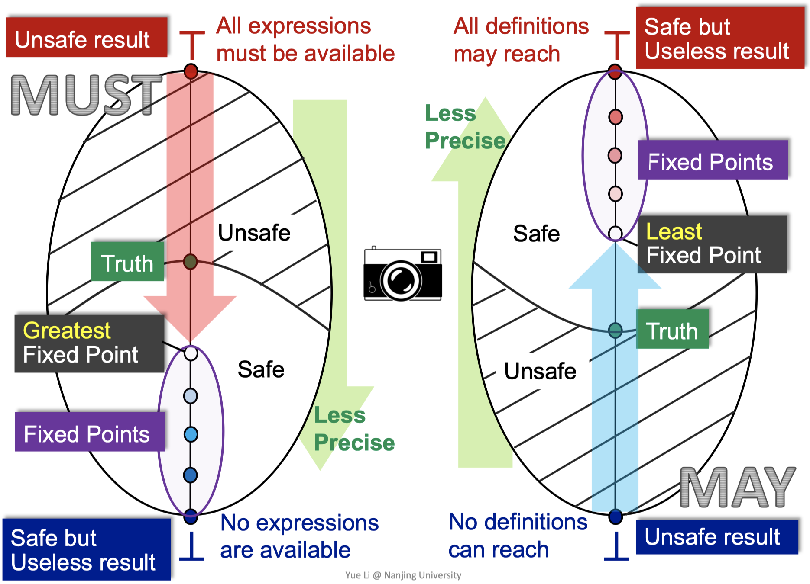\n\n\n\n

无论是must还是may分析，都是从unsafe result向safe result方向移动，“从准往不准走”。其中must分析在这个乘积格上来看就是不断从⊤⊤往下走，越过truth（第一节课中讨论过sound、truth和complete的关系），我们的迭代算法会达到最大不动点；相反，may分析就是不断从⊥⊥往上走，越过truth，我们的迭代算法会达到最小不动点。

\n\n\n\n

为什么不动点一定在safe区域呢？这和迭代算法中的safe approximation有关，是需要设计来保证的。

\n\n\n\n

### 格和全格的定义是什么

\n\n\n\n

**完全格：** 若格的每个非空子集均有上下确界，则称其为**完全格** （或**有限格** ）  
格：

\n\n\n\n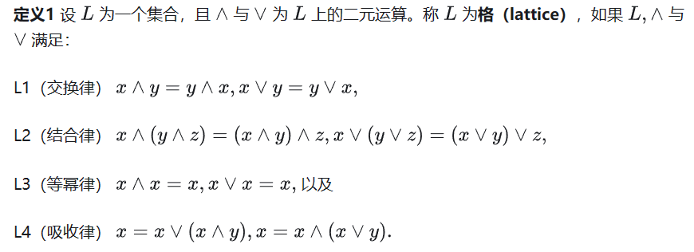\n\n\n\n

## MOP理论方法

\n\n\n\n

接下来研究一下分析精度：我们得出的解的精度如何呢？这里介绍一下另一种解法：Meet-Over-All-Paths（MOP）。

\n\n\n\n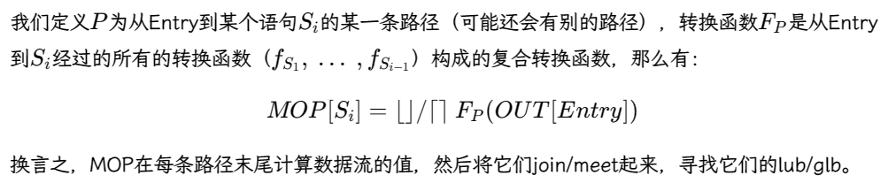\n\n\n\n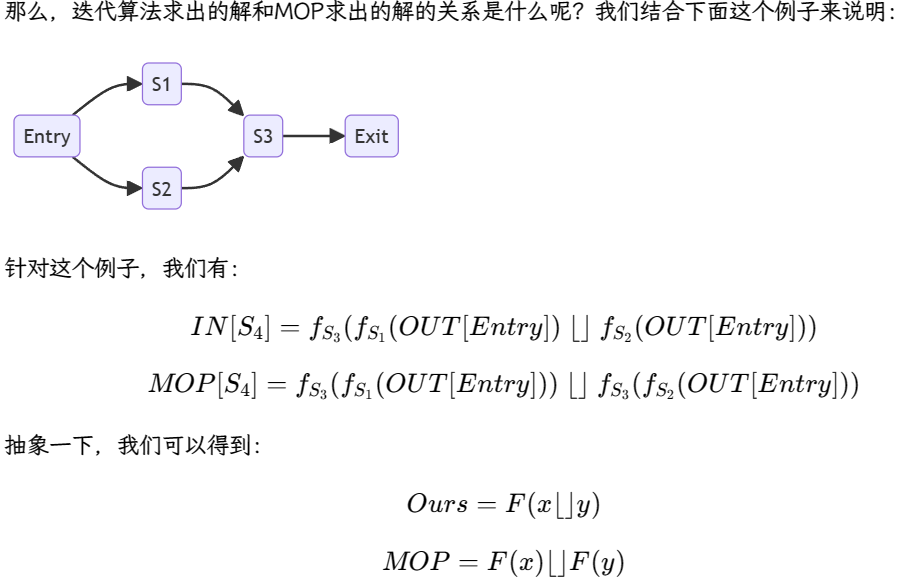\n\n\n\n

很好理解，迭代算法会在过程中做join/meet操作，而MOP则是在路径最后才做join/meet操作。

\n\n\n\n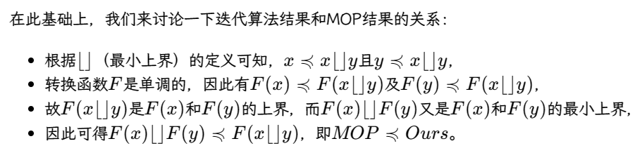\n\n\n\n

## Constanat Propagation（常量传播）

\n\n\n\n

Given a variable x at program point p, determine whether x is guaranteed to hold a constant value at p.

\n\n\n\n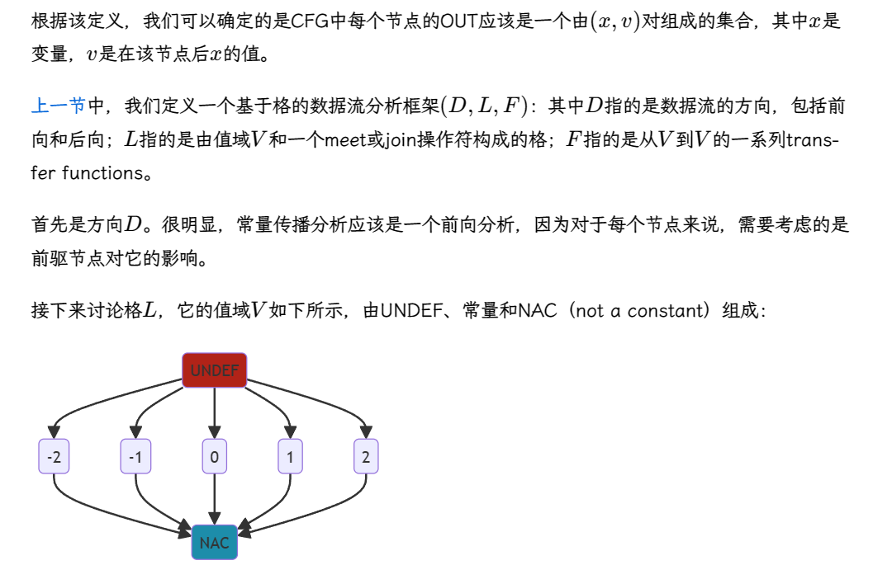\n\n\n\n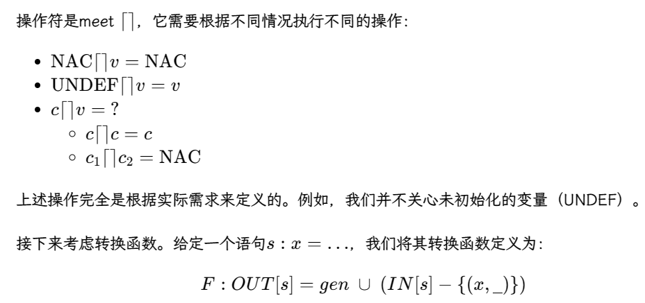\n\n\n\n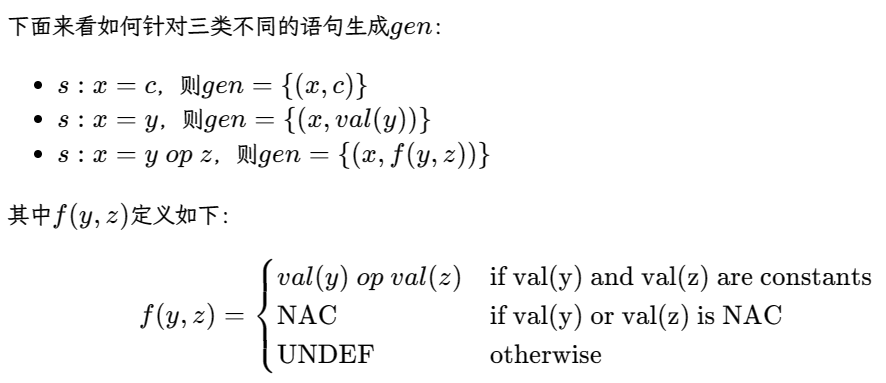\n\n\n\n

## WorkList算法

\n\n\n\n

思想其实很简单，就是维护了一个worklist，根据worklist是否为空判断迭代是否停止，只把OUT变化的节点的后继加入到worklist中，从而不必每次迭代都遍历CFG所有节点。

\n\n\n\n

Interprocedual Analysis

\n\n\n\n

So far, all analyses we learnt are intraprocedural.  
How to deal with method calls?

\n\n\n\n

\n
  * Make the most conservative assumption for  
method calls, for safe-approximation
\n
\n\n\n\n

## Call Graph Construction

\n\n\n\n

首先，我们需要了解调用图（call graph），它用于表示一个程序中的调用关系，是一个从call-sites到目标方法（callee）的有向边构成的集合。

\n\n\n\n

调用图是程序分析中的非常重要的概念，有着非常广泛的应用。本课专注于以Java为代表的面向对象语言（OOPL）的调用图构建。

\n\n\n\n

常见的调用图构建方法有以下四种：

\n\n\n\n

\n
  * Class hierarchy analysis (CHA)
\n\n\n\n
  * Rapid type analysis (RTA)
\n\n\n\n
  * Variable type analysis (VTA)
\n\n\n\n
  * Pointer analysis (k-CFA)
\n
\n\n\n\n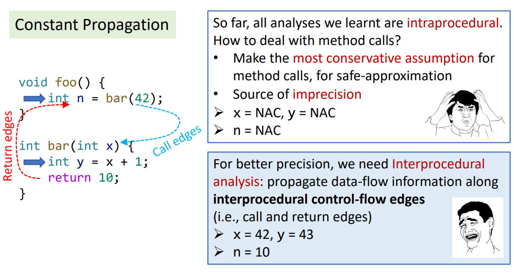\n\n\n\n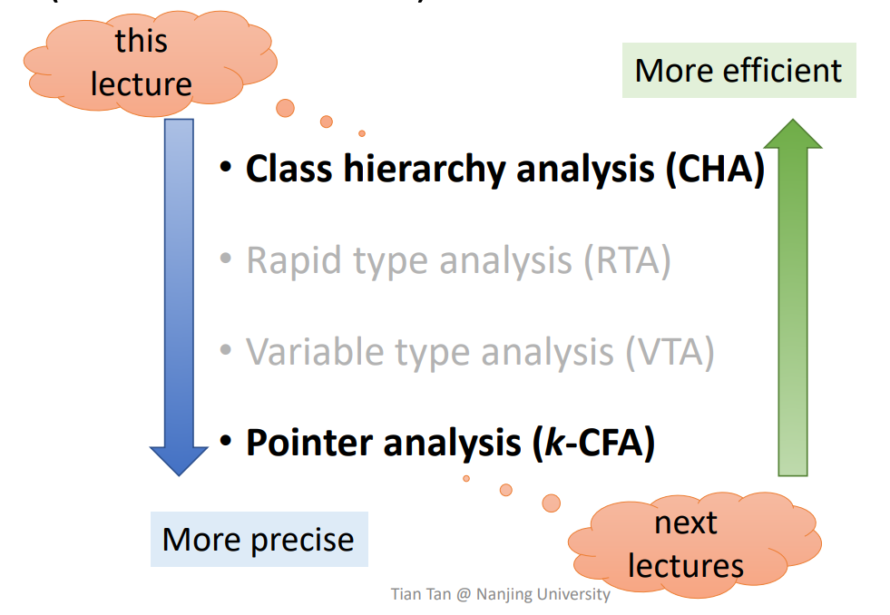\n\n\n\n| static call| special call| virtual call  
---|---|---|---  
**Instruction**|  invokestatic|  invokespecial| invokeinterface  
**Receiver objects**|  ✗|  ✓| ✓  
**Target methods**|  Static methods|  ConstructorsPrivate instance methodsSuperclass instance methods| Other instance methods  
**#Target methods**|  1|  1| ≥ 1  
**Determinacy**|  Compile-time|  Compile-time| Run-time  
\n\n\n\n

在运行时，virtual call（如`o.foo(...)`）基于以下两点进行解析：receiver object的类型（如`o`的类型）和call site处的方法签名（method signature，如`foo(...)`）。对于如下方法foo，它的签名为`<C: T foo(P, Q, R)>`，简写为`C.foo(P,P,R)`：

\n\n\n\n
    
    
    **class** **C** {\n\tT foo(P p, Q q, R r) { ... }\n}

\n\n\n\n

During run-time, a virtual call is resolved based on

\n\n\n\n

\n
  1. type of the receiver object (pointed by o)
\n\n\n\n
  2. method signature at the call site
\n\n\n\n
  3. Signature = class type + method name + descriptor
\n\n\n\n
  4. Descriptor = return type + parameter types
\n
\n\n\n\n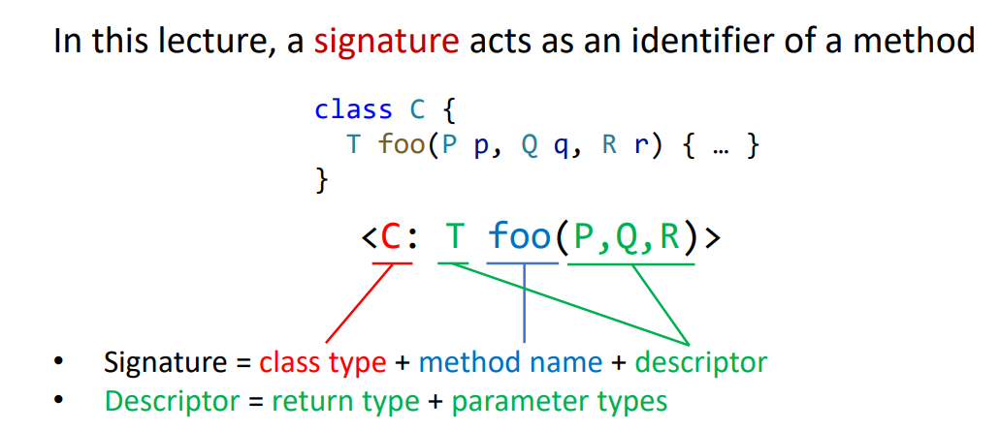\n\n\n\n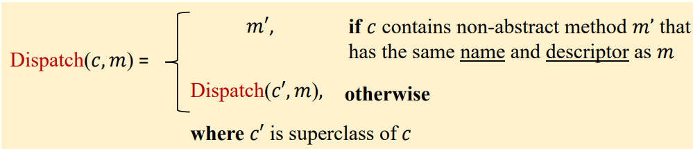\n\n\n\n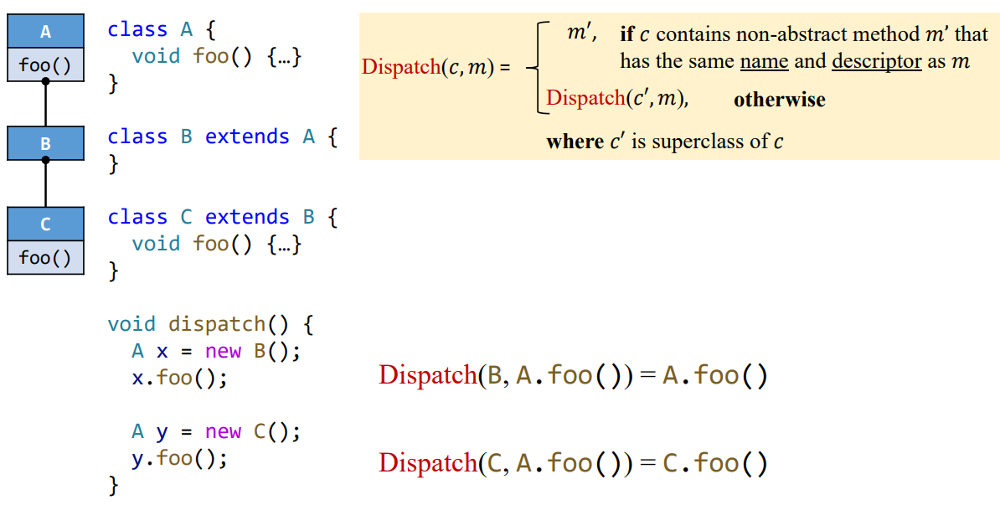\n\n\n\n

Class Hierarchy Analysis

\n\n\n\n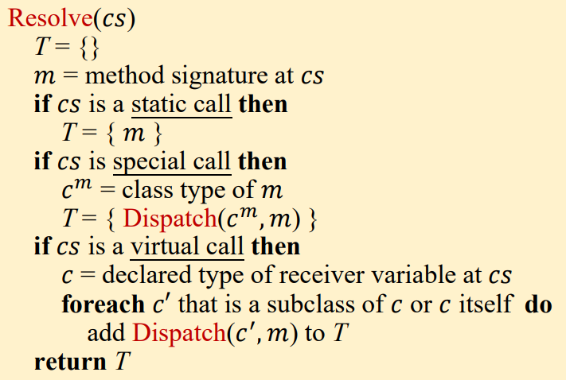\n\n\n\n

Features of CHA:

\n\n\n\n

Advantage: fast

\n\n\n\n

\n
  * Only consider the declared type of receiver variable  
at the call-site, and its inheritance hierarchy
\n\n\n\n
  * Ignore data- and control-flow information
\n
\n\n\n\n

Disadvantage: imprecise

\n\n\n\n

\n
  * Easily introduce spurious target methods
\n\n\n\n
  * Addressed in next lectures
\n
\n\n\n\n

Call Graph Construction: Algorithm

\n\n\n\n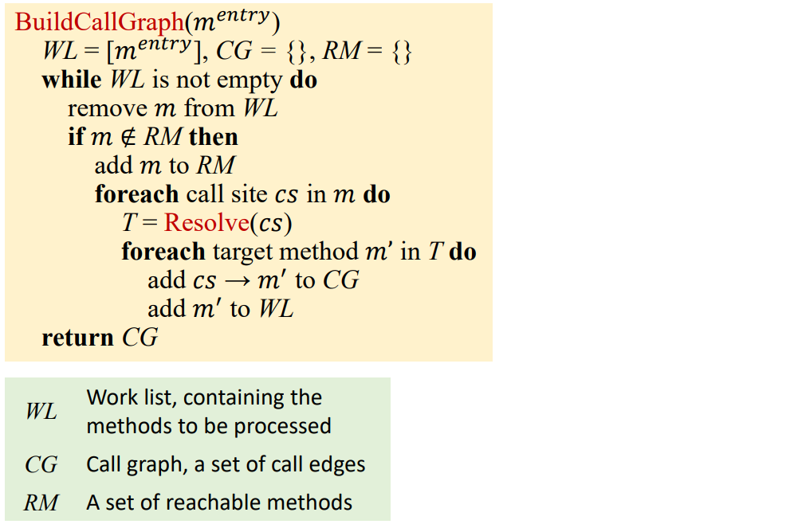\n\n\n\n

Interprocedural Data-Flow Analysis

\n\n\n\n

\n\n\n\n

the problem of CHA

\n\n\n\n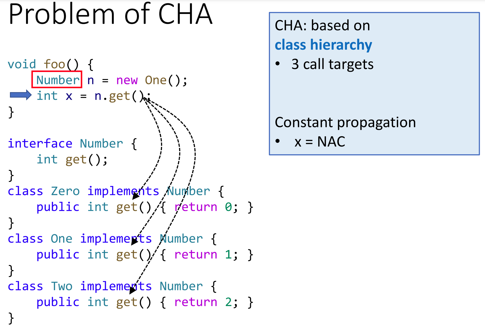\n\n\n\n

以上是CHA的简单介绍，即三种call的调用与结构分析

\n\n\n\n

事实上，一个程序的ICFG包括程序中所有方法的CFG加上两类额外的有向边：

\n\n\n\n

\n
  1. Call edges，即从call sites到被调用方法（callee）的entry nodes。
\n\n\n\n
  2. Return edges，即从callee的exit nodes到caller的call sites后面紧跟着的语句（return sites）。
\n
\n\n\n\n

以上两点很好理解，与汇编层面的控制流转移特点一致。另外，这两类边正是基于上一节的调用图生成的。

\n\n\n\n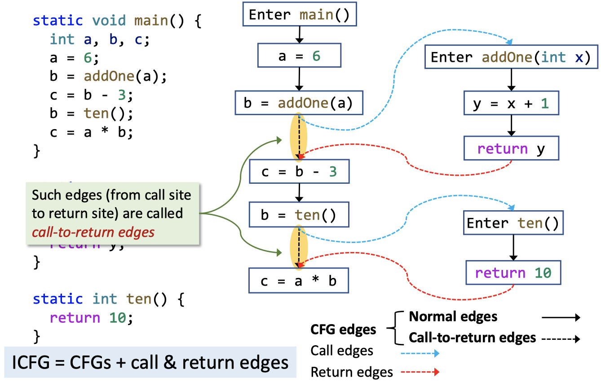\n\n\n\n

所谓edge transfer，包含normal edge transfer、call-to-return edge transfer、call edge transfer和return edge transfer。Call-to-return transfer传递的是方法局部值并kill掉LHS变量（left-hand side），call edge transfer传递的是实参值，return edge transfer传递的是返回值。

\n\n\n\n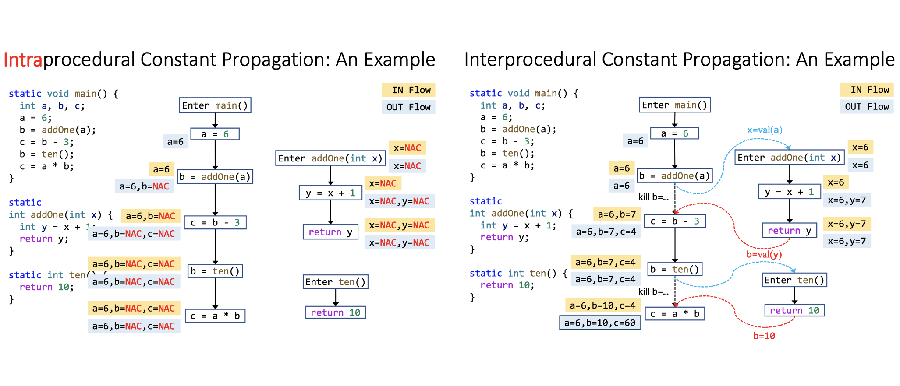\n\n\n\n

the Introduction of Pointer Analysis

\n\n\n\n

firstly know how to express the relation:

\n\n\n\n

points-to relations

\n\n\n\n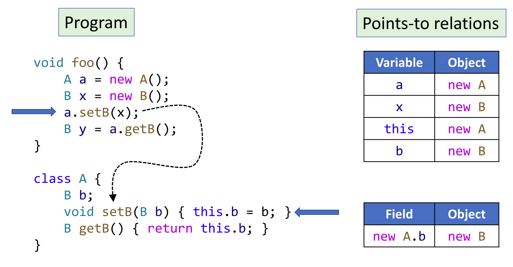\n\n\n\n

指针分析要点表格：

\n\n\n\nFactor| Problem| Choice  
---|---|---  
Heap abstraction| How to Model heap memory?| Allocation-site  
Storeless  
Context sensitivity| How to Model calling contexts?| Context-sensitive  
Context-insensitive  
Flow sensitivity| How to Model control flow?| Flow-sensitive  
Flow-insensitive  
Analysis scope| Which parts of program should be analyzed?| Whole-program  
Demand-driven  
\n\n\n\n

\n