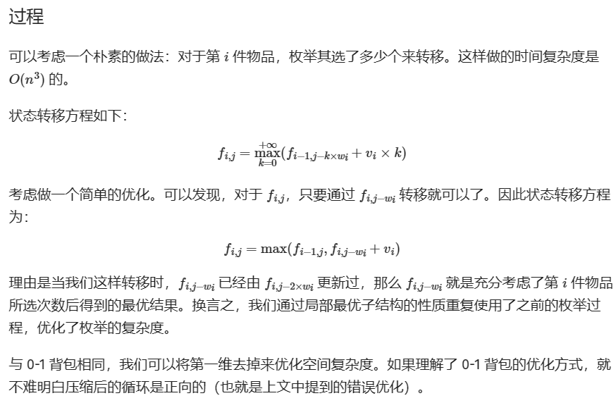
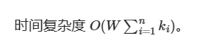
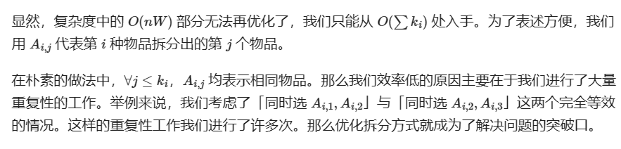
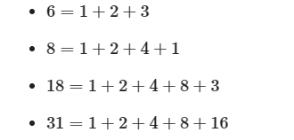

\n

\n\n\n\n

1简单背包

\n\n\n\n

我们通常使用一个二维数组表示这个背包的内容状态，比如f[num][weight]对应一定数量与重量的背包内容，然后遍历，从背包满载开始倒推。这里我们先采用二维DP的方式，虽然但是有的时候会引起MLE

\n\n\n\n

设 DP 状态 dp[i][j]为在只能放前i个物品的情况下，容量为j的背包所能达到的最大总价值。

\n\n\n\n

考虑转移。假设当前已经处理好了前 i-1个物品的所有状态，那么对于第i个物品，当其不放入背包时，背包的剩余容量不变，背包中物品的总价值也不变，故这种情况的最大价值为 f[i-1][j]；当其放入背包时，背包的剩余容量会减小w[i] ，背包中物品的总价值会增大c[i]，故这种情况的最大价值为 f[i-1][j-w[i]]+c[i]。

\n\n\n\n
    
    
    #include<cstdio>\nusing namespace std;\nconst int maxm=201,maxn=31;\nint m,n;\nint w[maxn],c[maxn];//weight and cost\nint f[maxn][maxm];//f[数量][质量]\nint max(int x,int y){\n\tif(x<y)return y;\n\telse return x;\n}\nint main(){\n\tscanf("%d%d",&m,&n);\n\tfor(int i=1;i<=n;i++)\n\t\tscanf("%d%d",&w[i],&c[i]);\n\tfor(int i=1;i<=n;i++)\n\t\tfor(int v=m;v>0;v--)\n\t\t\tif(w[i]<=v/*可以放包里*/)f[i][v]=max(f[i-1][v],f[i-1][v-w[i]]+c[i]);//不断推导当前数目放东西收益最大\n\t\t\telse f[i][v]=f[i-1][v];\n\tprintf("%d",f[n][m]);\n\treturn 0;/*10 4\n\t2 1\n\t3 3\n\t4 5\n\t7 9*/\n}

\n\n\n\n

二维背包比较碍事，而且fi只跟fi-1有关，所以可以去除一维

\n\n\n\n
    
    
    #include<cstdio>\nusing namespace std;\nconst int maxm=2001,maxn=31;\nint m,n;\nint w[maxn],c[maxn];//weight & cost\nint f[maxm];\nint main(){\n\tscanf("%d%d",&m,&n);\n\tfor(int i=1;i<=n;i++)\n\t\tscanf("%d%d",&w[i],&c[i]);\n\tfor(int i=1;i<=n;i++)\n\t\tfor(int v=m;v>=w[i];v--)//只要放得下即可，并且不断压缩至正好\n\t\t\tif(f[v-w[i]]+c[i]>f[v])f[v]=f[v-w[i]]+c[i];\n\tprintf("%d",f[m]);\n\treturn 0;\n\t/*10 4\n\t2 1\n\t3 3\n\t4 5\n\t7 9*/\n}

\n\n\n\n

在v的循环反向是为了不多放物体，因为0-1背包只能放一个

\n\n\n\n

2完全背包

\n\n\n\n

而与之相对应的完全背包则更加丰富，可以填充无数的同一个物体，代码实现如下：

\n\n\n\n
    
    
    #include<cstdio>\nusing namespace std;\nconst int maxm=201,maxn=31;\nint m,n;\nint w[maxn],c[maxn];\nint f[maxm];\nint main(){\n\tscanf("%d%d",&m,&n);\n\tfor(int i=1;i<=n;i++)\n\t\tscanf("%d%d",&w[i],&c[i]);\n\tfor(int i=1;i<=n;i++)\n\t\tfor(int v=w[i];v<=m;v++)//可以逐渐填入一个w[i],两个w[i]······\n           if(f[v-w[i]]+c[i]>f[v])f[v]=f[v-w[i]]+c[i];\n       printf("%d\\n",f[m]);\n       return 0;/*10 4\n2 1\n3 3\n4 5\n7 9*/\n}

\n\n\n\n\n\n\n\n
    
    
    #include<cstdio>\nusing namespace std;\nconst int maxm=201,maxn=31;\nint m,n;\nint w[maxn],c[maxn];\nint f[maxm];\nint main(){\n\tscanf("%d%d",&m,&n);\n\tfor(int i=1;i<=n;i++)\n\t\tscanf("%d%d",&w[i],&c[i]);\n\tfor(int i=1;i<=n;i++)\n\t\tfor(int v=w[i];v<=m;v++)//可以逐渐填入一个w[i],两个w[i]······\n           if(f[v-w[i]]+c[i]>f[v])f[v]=f[v-w[i]]+c[i];\n       printf("%d\\n",f[m]);\n       return 0;/*10 4\n2 1\n3 3\n4 5\n7 9*/\n}

\n\n\n\n

3多重背包

\n\n\n\n

多重背包的特别之处，在于对每个物品施加了个数的限制，相比于0-1背包又可以多选物品，所以相比之下状态转移方程更加丰富。

\n\n\n\n
    
    
    #include<cstdio>\nusing namespace std;\nint v[6002],w[6002],c[6002];\nint f[6002];\nint n,m;\nint max(int x,int y){\n\tif(x<y)return y;\n\telse return x;\n}\nint main(){\n\tscanf("%d%d",&n,&m);\n\tfor(int i=1;i<=n;i++)\n\t\tscanf("%d%d%d",&v[i],&w[i],&c[i]);\n\tfor(int i=1;i<=n;i++)\n\t\tfor(int j=m;j>=0;j--)\n\t\t\tfor(int k=0;k<=c[i];k++)\n\t\t\t{\tif(j-k*v[i]<0)break;\n                f[j]=max(f[j],f[j-k*v[i]]+k*w[i]);\n             }\n             printf("%d",f[m]);\n            return 0;\n}\n/*5 1000\n80 20 4\n40 50 9\n30 50 7\n40 30 6\n20 20 1*/

\n\n\n\n

不如完全背包，这样的多重背包只能采取枚举，复杂度无法再优化

\n\n\n\n\n\n\n\n

4一些优化：

\n\n\n\n

\+ 二进制优化

\n\n\n\n\n\n\n\n

所以我们可以通过二进制分组的方式使得拆分方式更优美省时

\n\n\n\n\n\n\n\n

所以问题由此转换成0-1背包，解决即可。

\n\n\n\n
    
    
    index = 0;\nfor (int i = 1; i <= m; i++) {\n  int c = 1, p, h, k;\n  cin >> p >> h >> k;\n  while (k > c) {\n    k -= c;\n    list[++index].w = c * p;\n    list[index].v = c * h;\n    c *= 2;\n  }\n  list[++index].w = p * k;\n  list[index].v = h * k;\n}

\n\n\n\n

其他优化好复杂先不写了

\n\n\n\n

5.混合背包

\n\n\n\n

混合背包就是将前面三种的背包问题混合起来，有的只能取一次，有的能取无限次，有的只能取k次。

\n\n\n\n

这种题目看起来很吓人，可是只要领悟了前面几种背包的中心思想，并将其合并在一起就可以了。下面给出伪代码：

\n\n\n\n
    
    
    for (循环物品种类) {\n  if (是 0 - 1 背包)\n    套用 0 - 1 背包代码;\n  else if (是完全背包)\n    套用完全背包代码;\n  else if (是多重背包)\n    套用多重背包代码;\n}

\n\n\n\n

6.二维背包

\n\n\n\n

仍然是0-1背包问题，不过要增加一维存储新的价值

\n\n\n\n

\n\n\n\n

洛谷大佬题单

\n\n\n\n

特点：**码量较少** （目前只有一题超过1KB）且**难度较低** ，让新手也可以享受切题的快乐。

\n\n\n\n

没学过背包问题的可以去看看洛谷日报中的[背包问题](<https://www.luogu.com.cn/blog/RPdreamer/bei-bao-wen-ti>)或者[背包九讲](<https://www.kancloud.cn/kancloud/pack/70124>)。

\n\n\n\n

**题目：**

\n\n\n\n题目| 题目解法| 题目难度| 实际难度  
---|---|---|---  
[P1048 采药](<https://www.luogu.com.cn/problem/P1048>)| **01背包**|  $\\\color{#FF8C00}{\\\tt 普及-}$| $\\\color{#FF8C00}{\\\tt 普及-}$  
[P2871 [USACO07DEC]Charm Bracelet S](<https://www.luogu.com.cn/problem/P2871>)| **01背包**|  $\\\color{#FF8C00}{\\\tt 普及-}$| $\\\color{#FF8C00}{\\\tt 普及-}$  
[P1049 装箱问题](<https://www.luogu.com.cn/problem/P1049>)| **01背包** 稍微变形| $\\\color{#FF8C00}{\\\tt 普及-}$| $\\\color{#FF8C00}{\\\tt 普及-}$  
[P1060 开心的金明](<https://www.luogu.com.cn/problem/P1060>)| **01背包** 稍微变形| $\\\color{#FF8C00}{\\\tt 普及-}$| $\\\color{#FF8C00}{\\\tt 普及-}$  
[P1164 小A点菜](<https://www.luogu.com.cn/problem/P1164>)| **01背包** 稍微变形| $\\\color{#FF8C00}{\\\tt 普及-}$| $\\\color{#FF8C00}{\\\tt 普及-}$  
[P1510 精卫填海](<https://www.luogu.com.cn/problem/P1510>)| **01背包** 稍微变形| $\\\color{#FF8C00}{\\\tt 普及-}$| $\\\color{#FF8C00}{\\\tt 普及-}$  
[P2639 [USACO09OCT]Bessie's Weight Problem G](<https://www.luogu.com.cn/problem/P2639>)| **01背包** 稍微变形| $\\\color{#FF8C00}{\\\tt 普及-}$| $\\\color{#FF8C00}{\\\tt 普及-}$  
[P2925 [USACO08DEC]Hay For Sale S](<https://www.luogu.com.cn/problem/P2925>)| **01背包** 稍微变形| $\\\color{#FF8C00}{\\\tt 普及-}$| $\\\color{#FF8C00}{\\\tt 普及-}$  
[P1926 小书童——刷题大军](<https://www.luogu.com.cn/problem/P1926>)| **01背包** 变形| $\\\color{#FF8C00}{普及-}$| $\\\color{#FF8C00}{普及-}$  
[P1802 5倍经验日](<https://www.luogu.com.cn/problem/P1802>)| **01背包** 变形| $\\\color{#FF8C00}{普及-}$| $\\\color{#FF8C00}{普及-}$  
[P1734 最大约数和](<https://www.luogu.com.cn/problem/P1734>)| **01背包** 变形| $\\\color{#FF8C00}{普及-}$| $\\\color{#FF8C00}{普及-}$  
[P2392 kkksc03考前临时抱佛脚](<https://www.luogu.com.cn/problem/P2392>)| **01背包** 变形| $\\\color{#FF8C00}{普及-}$| $\\\color{#FF8C00}{普及-}$  
[P1466 [USACO2.2]集合 Subset Sums](<https://www.luogu.com.cn/problem/P1466>)| **01背包** 变形| $\\\color{#FFD700}{普及/提高-}$| $\\\color{#FF8C00}{普及-}$  
[P2370 yyy2015c01 的 U 盘](<https://www.luogu.com.cn/problem/P2370>)| **01背包** 变形| $\\\color{#FFD700}{普及/提高-}$| $\\\color{#FFD700}{普及/提高-}$  
[CF294B Shaass and Bookshelf](<https://www.luogu.com.cn/problem/CF294B>)| **01背包** 变形| $\\\color{#32CD32}{普及+/提高}$| $\\\color{#FFD700}{普及/提高-}$  
[CF19B Checkout Assistant](<https://www.luogu.com.cn/problem/CF19B>)| **01背包** 变形| $\\\color{#0000FF}{提高+/省选-}$| $\\\color{#FFD700}{普及/提高-}$  
[P4141 消失之物](<https://www.luogu.com.cn/problem/P4141>)| **01背包** 变形| $\\\color{#0000FF}{提高+/省选-}$| $\\\color{#32CD32}{普及+/提高}$  
[P1156 垃圾陷阱](<https://www.luogu.com.cn/problem/P1156>)| **01背包** 变形| $\\\color{#0000FF}{提高+/省选-}$| $\\\color{#32CD32}{普及+/提高}$  
[P1507 NASA的食物计划](<https://www.luogu.com.cn/problem/P1507>)| 二维**01背包**|  $\\\color{#FF8C00}{普及-}$| $\\\color{#FF8C00}{普及-}$  
[P1910 L国的战斗之间谍](<https://www.luogu.com.cn/problem/P1910>)| 二维**01背包**|  $\\\color{#FF8C00}{普及-}$| $\\\color{#FF8C00}{普及-}$  
[P1855 榨取kkksc03](<https://www.luogu.com.cn/problem/P1855>)| 二维**01背包** 稍微变形| $\\\color{#FF8C00}{普及-}$| $\\\color{#FF8C00}{普及-}$  
[P1877 [HAOI2012]音量调节](<https://www.luogu.com.cn/problem/P1877>)| 二维**01背包** 变形| $\\\color{#FF8C00}{普及-}$| $\\\color{#FF8C00}{普及-}$  
[P1509 找啊找啊找GF](<https://www.luogu.com.cn/problem/P1509>)| 二维**01背包** 变形| $\\\color{#FFD700}{普及/提高-}$| $\\\color{#FFD700}{普及/提高-}$  
[P3985 不开心的金明](<https://www.luogu.com.cn/problem/P3985>)| 二维**01背包** 变形| $\\\color{#32CD32}{普及+/提高}$| $\\\color{#FFD700}{普及/提高-}$  
[P1455 搭配购买](<https://www.luogu.com.cn/problem/P1455>)| **01背包** +并查集| $\\\color{#FFD700}{普及/提高-}$| $\\\color{#FFD700}{普及/提高-}$  
[P1941 飞扬的小鸟](<https://www.luogu.com.cn/problem/P1941>)| **01背包** 变形+**完全背包** 变形| $\\\color{#32CD32}{普及+/提高}$| $\\\color{#32CD32}{普及+/提高}$  
[P2170 选学霸](<https://www.luogu.com.cn/problem/P2170>)| **01背包** 变形+并查集| $\\\color{#32CD32}{普及+/提高}$| $\\\color{#32CD32}{普及+/提高}$  
[P1858 多人背包](<https://www.luogu.com.cn/problem/P1858>)| **01背包** $k$ 优解变形| $\\\color{#0000FF}{提高+/省选-}$| $\\\color{#32CD32}{普及+/提高}$  
[P1616 疯狂的采药](<https://www.luogu.com.cn/problem/P1616>)| **完全背包**|  $\\\color{#FF8C00}{普及-}$| $\\\color{#FF8C00}{普及-}$  
[P2722 [USACO3.1]总分 Score Inflation](<https://www.luogu.com.cn/problem/P2722>)| **完全背包**|  $\\\color{#FF8C00}{普及-}$| $\\\color{#FF8C00}{普及-}$  
[P1679 神奇的四次方数](<https://www.luogu.com.cn/problem/P1679>)| **完全背包** 变形| $\\\color{#FF8C00}{普及-}$| $\\\color{#FF8C00}{普及-}$  
[P1832 A+B Problem（再升级）](<https://www.luogu.com.cn/problem/P1832>)| **完全背包** 变形| $\\\color{#FF8C00}{普及-}$| $\\\color{#FF8C00}{普及-}$  
[P1853 投资的最大效益](<https://www.luogu.com.cn/problem/P1853>)| **完全背包** 变形| $\\\color{#FFD700}{普及/提高-}$| $\\\color{#FF8C00}{普及-}$  
[CF189A Cut Ribbon](<https://www.luogu.com.cn/problem/CF189A>)| **完全背包** 变形| $\\\color{#FFD700}{普及/提高-}$| $\\\color{#FF8C00}{普及-}$  
[CF417A Elimination](<https://www.luogu.com.cn/problem/CF417A>)| **完全背包** 变形| $\\\color{#FFD700}{普及/提高-}$| $\\\color{#FF8C00}{普及-}$  
[P2918 [USACO08NOV]Buying Hay S](<https://www.luogu.com.cn/problem/P2918>)| **完全背包** 变形| $\\\color{#FFD700}{普及/提高-}$| $\\\color{#FFD700}{普及/提高-}$  
[P5662 纪念品](<https://www.luogu.com.cn/problem/P5662>)| **完全背包** 变形| $\\\color{#32CD32}{普及+/提高}$| $\\\color{#FFD700}{普及/提高-}$  
[P5020 [NOIP2018 提高组] 货币系统](<https://www.luogu.com.cn/problem/P5020>)| **完全背包** 变形| $\\\color{#32CD32}{普及+/提高}$| $\\\color{#32CD32}{普及+/提高}$  
[P2347 砝码称重](<https://www.luogu.com.cn/problem/P2347>)| **多重背包** 变形| $\\\color{#FF8C00}{普及-}$| $\\\color{#FF8C00}{普及-}$  
[P6771 [USACO05MAR]Space Elevator 太空电梯](<https://www.luogu.com.cn/problem/P6771>)| **多重背包** 变形| $\\\color{#FFD700}{普及/提高-}$| $\\\color{#FFD700}{普及/提高-}$  
[P5365 [SNOI2017]英雄联盟](<https://www.luogu.com.cn/problem/P5365>)| **多重背包** 变形| $\\\color{#32CD32}{普及+/提高}$| $\\\color{#FFD700}{普及/提高-}$  
[P1776 宝物筛选](<https://www.luogu.com.cn/problem/P1776>)| **多重背包** 二进制优化| $\\\color{#32CD32}{普及+/提高}$| $\\\color{#FFD700}{普及/提高-}$  
[P2851 [USACO06DEC]The Fewest Coins G](<https://www.luogu.com.cn/problem/P2851>)| **多重背包** +**完全背包**|  $\\\color{#0000FF}{提高+/省选-}$| $\\\color{#FFD700}{普及/提高-}$  
[P1833 樱花](<https://www.luogu.com.cn/problem/P1833>)| **混合背包**|  $\\\color{#32CD32}{普及+/提高}$| $\\\color{#FFD700}{普及/提高-}$  
[P1782 旅行商的背包](<https://www.luogu.com.cn/problem/P1782>)| **混合背包** 二进制优化+完全背包+卡常| $\\\color{#0000FF}{提高+/省选-}$| $\\\color{#32CD32}{普及+/提高}$  
[P1757 通天之分组背包](<https://www.luogu.com.cn/problem/P1757>)| **分组背包**|  $\\\color{#FF8C00}{普及-}$| $\\\color{#FFD700}{普及/提高-}$  
[P5322 [BJOI2019]排兵布阵](<https://www.luogu.com.cn/problem/P5322>)| **分组背包** 变形| $\\\color{#0000FF}{提高+/省选-}$| $\\\color{#FFD700}{普及/提高-}$  
[P1064 金明的预算方案](<https://www.luogu.com.cn/problem/P1064>)| **有依赖的背包**|  $\\\color{#32CD32}{普及+/提高}$| $\\\color{#FFD700}{普及/提高-}$  
[P2904 [USACO08MAR]River Crossing S](<https://www.luogu.com.cn/problem/P2904>)| 背包思想| $\\\color{#FFD700}{普及/提高-}$| $\\\color{#FFD700}{普及/提高-}$  
\n\n\n\n

最后：

\n\n\n\n

1.如题目难度不符合实际，补充的题目或修改建议欢迎私信。

\n\n\n\n

2.这个题单的题应该算比较简单，以后再写一个难一点的。

\n\n\n\n

3.写题单不易，能不能帮忙收藏一下啊。

\n\n\n\n

\n\n\n\n

another 借鉴

\n\n\n\n

27000字初级背包问题详解 - walker shi的文章 - 知乎 

\n\n\n\n

<https://zhuanlan.zhihu.com/p/430195885>

\n