\n

GAMES 101

\n\n\n\n

Linear Algebra basics

\n\n\n\n

Mainly are something which is better expressed in 3b1b's videos.With 2 dimension matrices, we could only do linear transformations（scale reflection rotate and so on）, but unable to do 平移。 So we expand the dimension to 3, while the c=vector look like(x,y,1)^T

\n\n\n\n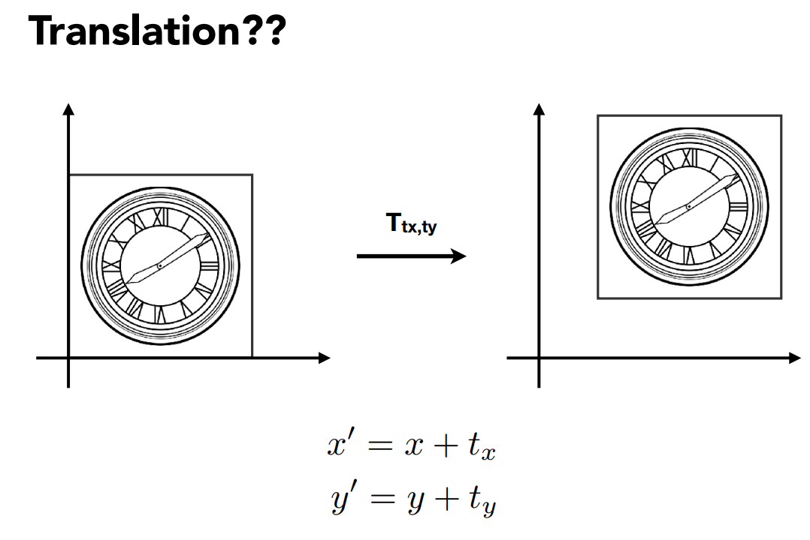\n\n\n\n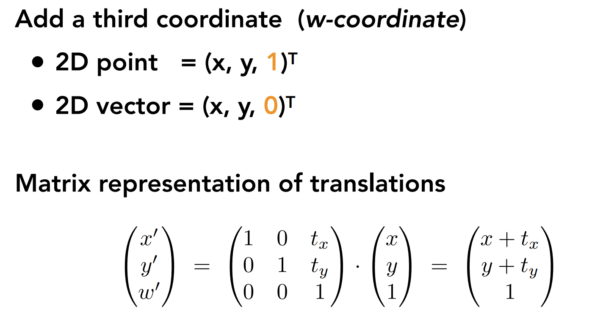\n\n\n\n

to vectors , we append a 0 to the third dimension, to points we add a 1 to it.  
As the application like follows.

\n\n\n\n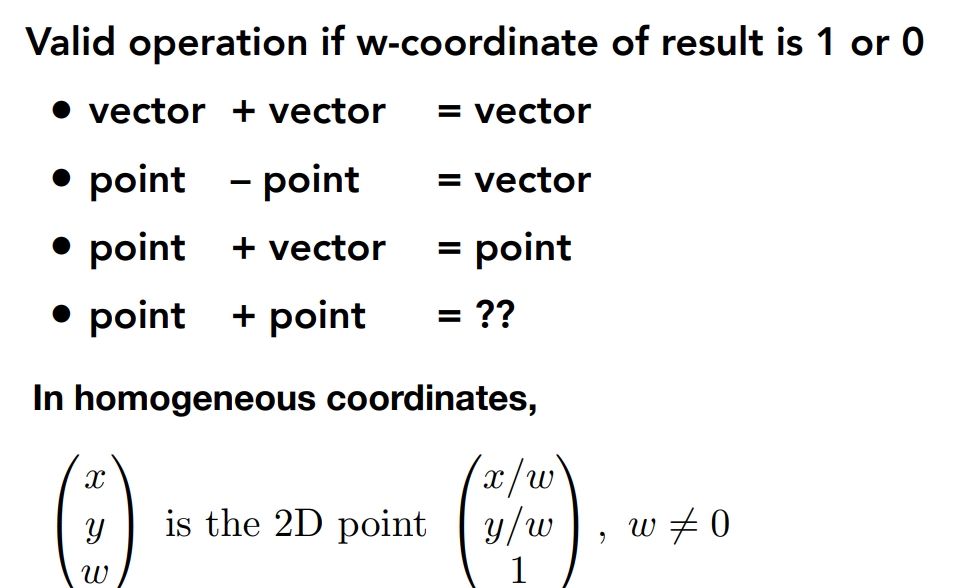\n\n\n\n

So we give the definitions like this to implement the point plus point.

\n\n\n\n

So we get the main transformations.

\n\n\n\n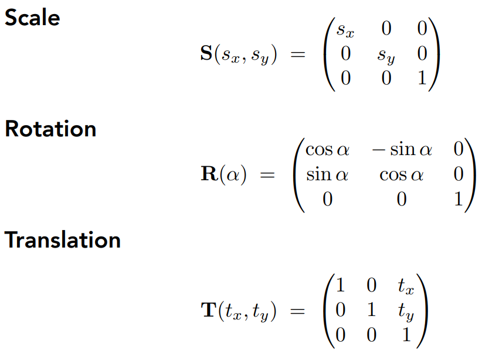\n\n\n\n

In theory, we can do all transform by dividing it into serveral parts.

\n\n\n\n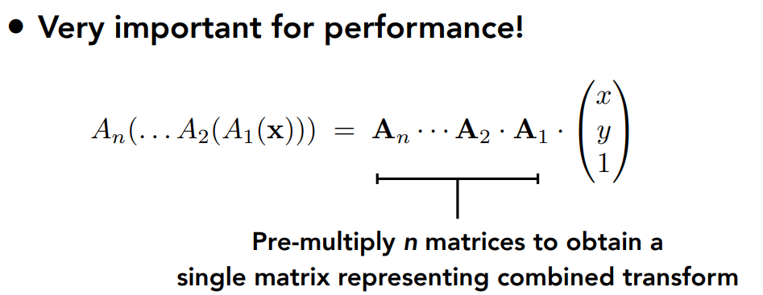\n\n\n\n

there are excellent notes of Games 101 on CSDN, so I'm just doing something simple: transforming some of his notes into "mine"- but indeed it's still his, in Chinese it's called 拾人牙慧.

\n\n\n\n

<https://blog.csdn.net/qq_38065509>

\n\n\n\n

View transformation

\n\n\n\n

We can treat the task of transforming the point (x,y,z) to a 2d plain as several parts.

\n\n\n\n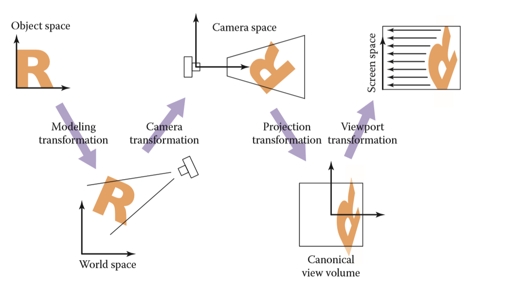\n\n\n\n

As the picture goes, we have following parts:

\n\n\n\n

(1) 模型变换(modeling tranformation)：这一步的目的是将虚拟世界中或者更具体点，游戏场景中的物体调整至他们应该在的位置

\n\n\n\n

为了完成模型变换，我们只要进行对应的平移、旋转、缩放即可

\n\n\n\n

(2) 摄像机变换(camera tranformation)：在游戏中我们真正在乎的是摄像机(或者说眼睛)所看到的东西，也就是需要得到物体与摄像机的相对位置

\n\n\n\n

正如上文所说摄像机变换的目的是得到所有可视物体与摄像机的相对位置，怎么得到？非常直观的一步，我们把物体和摄像机一起做移动，如果能够把摄像机的坐标轴(假设为u,v,w 分别对应原世界空间中的x,y,z)移动到标准的x，y，z轴，那么此时物体的坐标不自然便是相对坐标了吗！

\n\n\n\n

因此核心问题就变成了如何表示或者说如何将camera的坐标系与原世界坐标系重合呢？我们先定义3个东西

\n\n\n\n

相机或眼睛位置 (eye postion) e  
观察方向 (gaze postion) g  
视点正上方向 (view-up vector ) t

\n\n\n\n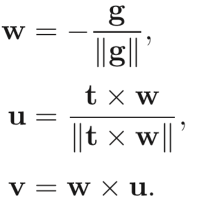\n\n\n\n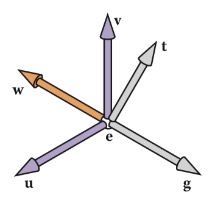\n\n\n\n

(tips:这里为什么不直接拿 t 当做基底向量是因为摄像机的头可能是歪着看的，就像图中一样 )

\n\n\n\n

这样安排之后，我们要做的就是把这个摄像机的坐标系变换到世界坐标系了，具体的矩阵操作如下：

\n\n\n\n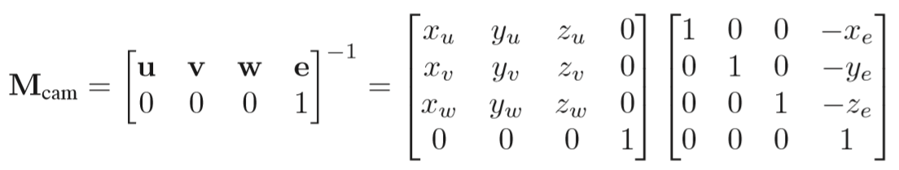\n\n\n\n

\n\n\n\n

(3) 投影变换(projection tranformation)：根据摄像机变换得到了所有可视范围内的物体对于摄像机的相对位置坐标(x,y,z)之后，便是根据是平行投影还是透视投影，将三维空间投影至标准二维平面([-1,1]^2)之上 （tips：这里的z并没有丢掉，为了之后的遮挡关系检测）

\n\n\n\n

we have two ways to project, let's get to them one by one

\n\n\n\n

#### Orthographic Projection Transformation

\n\n\n\n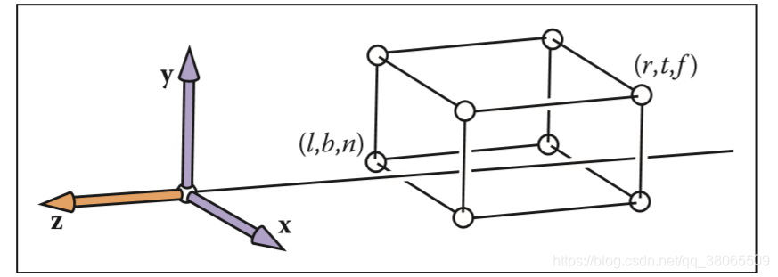\n\n\n\n

everything is transformed with its contrary places unchanged, because we use the parallel light to project

\n\n\n\n

**tips：这里可能会有读者疑问，为什么要压缩到一个小立方体呢？其实这只是为了之后的计算更加的方便而已，在转换到屏幕坐标的时候就会重新拉伸回来，不必太做纠结，只需抓住正交投影的变化核心是，所有物体的相对大小位置都不会有任何变化。**

\n\n\n\n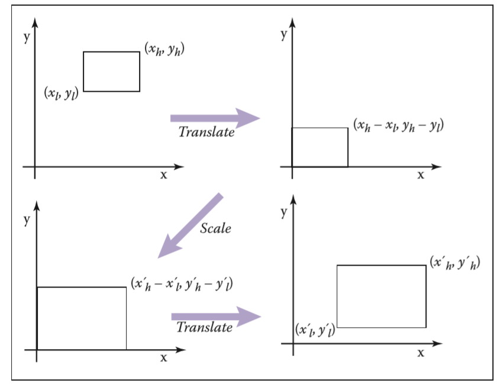\n\n\n\n

从任意一个范围转换到任意一个范围，同样也是分三步

\n\n\n\n

**1 将原空间范围的左下角移至原点**  
**2 放大给定倍数**  
**3 将缩放后的空间范围移至新空间范围**

\n\n\n\n

#### Perspective Projection Transformation

\n\n\n\n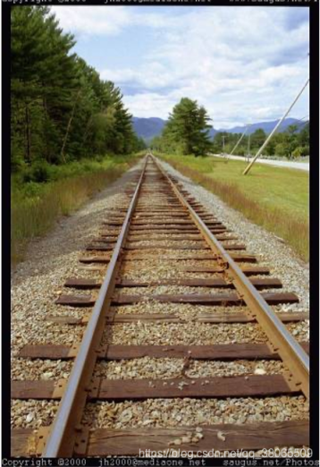\n\n\n\n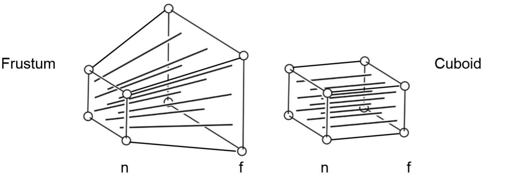\n\n\n\n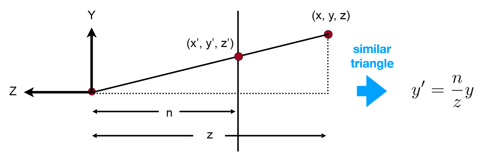\n\n\n\n

easy to explain that the transform of the point-as the (x,y,z) to (x',y',z')

\n\n\n\n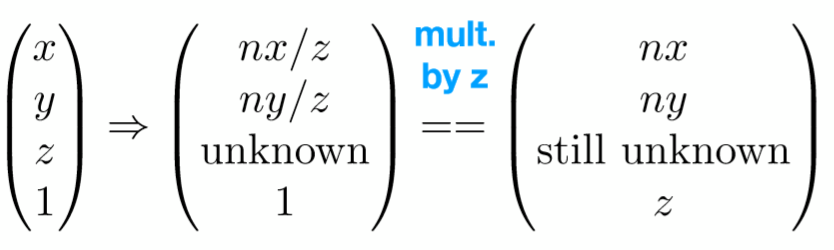\n\n\n\n

可视空间，即本节第一张图的Frustum的前后面变换之后z坐标不变

\n\n\n\n

Any point on the near plane will not change  
Any point’s z on the far plane will not change  
设第三行为(0,0,A,B) ,  
利用这个性质分别代入远近平面的任意两点就可以列出两个等式

\n\n\n\n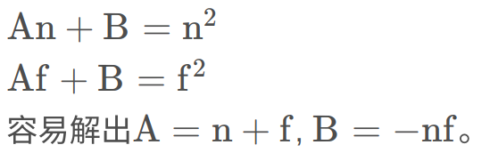\n\n\n\n

so the transformation matrix is 

\n\n\n\n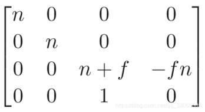\n\n\n\n

after that we still need to squeeze it to the [-1,1] space , so the following matrix is the final version

\n\n\n\n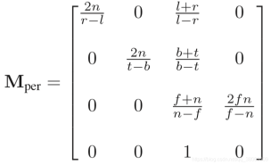\n\n\n\n

(4) 视口变换(viewport transformation)：将处于标准平面映射到屏幕分辨率范围之内，即[-1,1]^2→ \\\rightarrow→[0,width]*[0,height], 其中width和height指屏幕分辨率大小

\n\n\n\n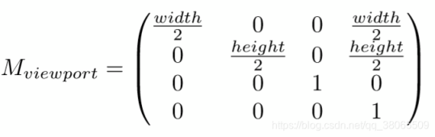\n\n\n\n

Raster Images

\n\n\n\n

Rasterize == drawing onto the screen

\n\n\n\n

Pixels in Screen

\n\n\n\n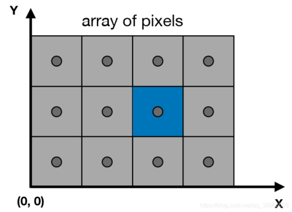\n\n\n\n

## **2 直线光栅化算法**

\n\n\n\n

## **2.1 DDA数值微分算法**

\n\n\n\n

DDA算法是一个非常简单直观的算法。 首先当任何一条直线知道任意两点时都可以用y=kx+b来表示，其中k代表斜率，如果|k|<1，那么它的主要行进方向就是x轴，即x轴的变化要比y轴快，相反如果如果|k|>1，那么它的主要行进方向就是y轴，即y轴的变化要比x轴快。如下图所示：

\n\n\n\n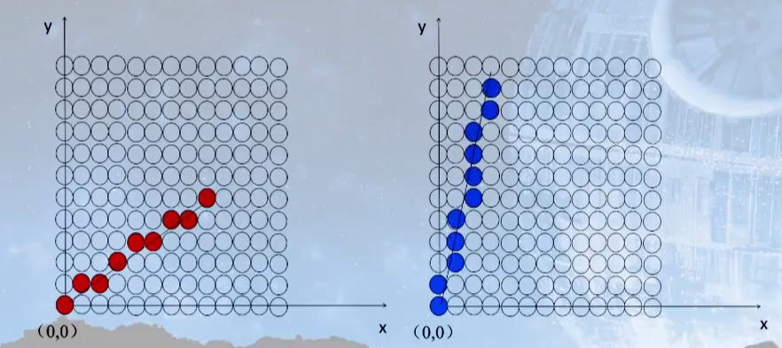\n\n\n\n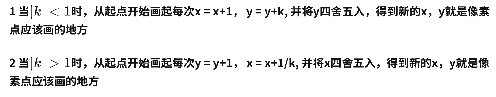\n\n\n\n

## **2.2 中点Bresenham算法**

\n\n\n\n

我们首先规定想要光栅化的线段的起点P0(x0,y0)与终点P1(x1,y1),则该直线方程可以用y = kx + b的形式来表示，定义f(x,y)=y−kx−b, 准备工作完成之后，接下来一起看看bresenham算法的具体过程！

\n\n\n\n

中点Bresenham算法的思想其实也比较简单，我们在这里只给出0<k<1 的情况，其它情况可以类推，除却起点与终点，我们每次的画点只会考虑右边或者右上的点两种情况(由斜率所决定的)，因此我们只需要在这二者之间做出选择。那么该依据什么进行判断呢，给出如下两种情况，第一：

\n\n\n\n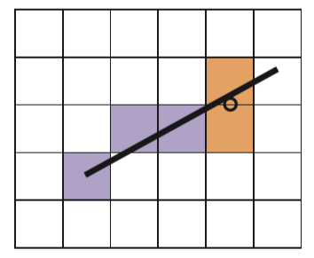\n\n\n\n

我们已经成功画出了前三个蓝色方格之后，所要考虑的便是第三个蓝色方格右边或者右上的橙色方格，此时我们取这两个橙色方格的中点，如图中圆圈符号所对应的那个点，倘若这个点在直线方程的下面，那么很明显我们应该选择右上的方格

\n\n\n\n

第二种

\n\n\n\n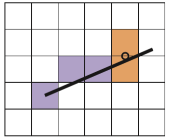\n\n\n\n

算法伪代码如下：

\n\n\n\n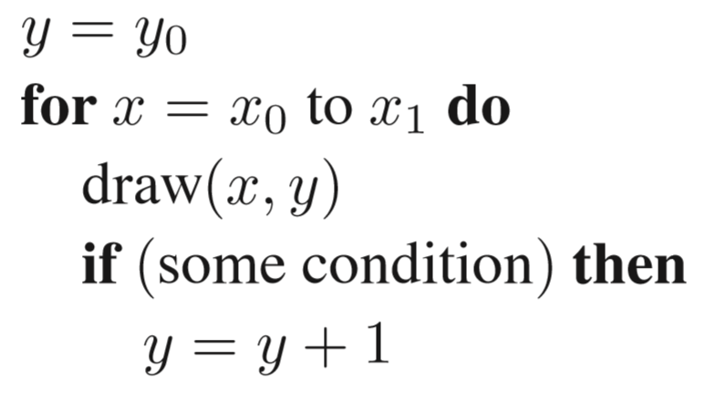\n\n\n\n

some condition as follows:

\n\n\n\n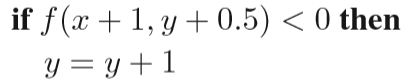\n\n\n\n

但是还有地方细节可以优化：

\n\n\n\n

目前为止，算法整体便已完成，但有一个问题是，我们每次都要进行一次F（x，y）的计算，倘若直线方程比较复杂，这是很消耗资源的(因为在底层可能是几百万次的重复调用)。因此一种改进方法便是利用增量算法。不难具体算出f(x,y)方程具体如下：

\n\n\n\n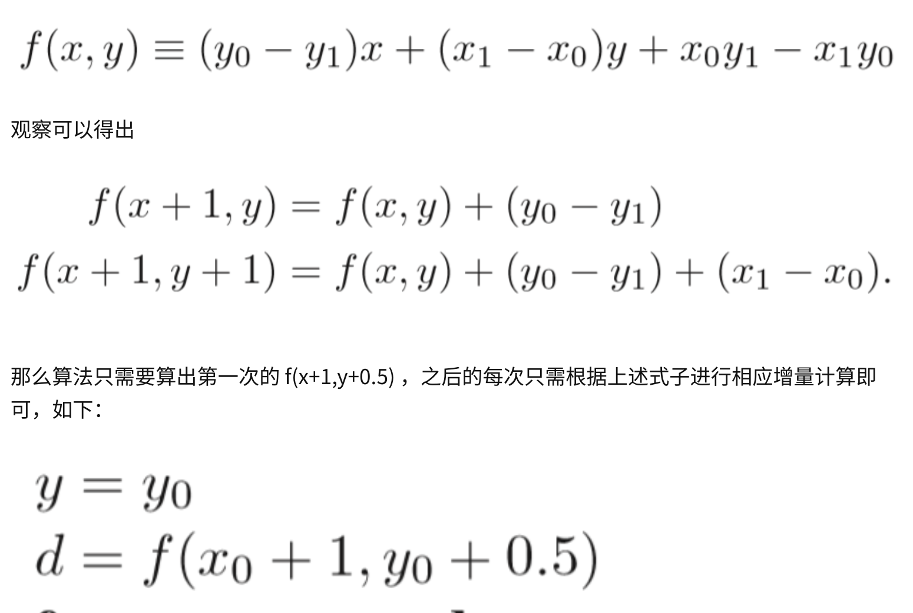\n\n\n\n

## **3 三角形光栅化算法**

\n\n\n\n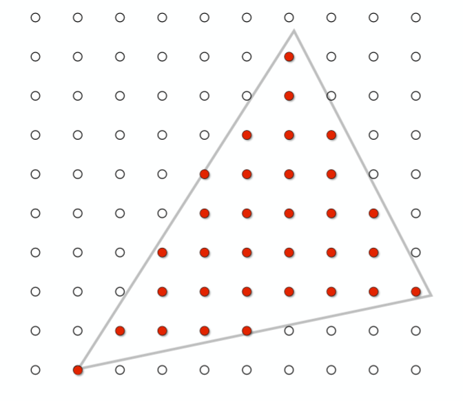\n\n\n\n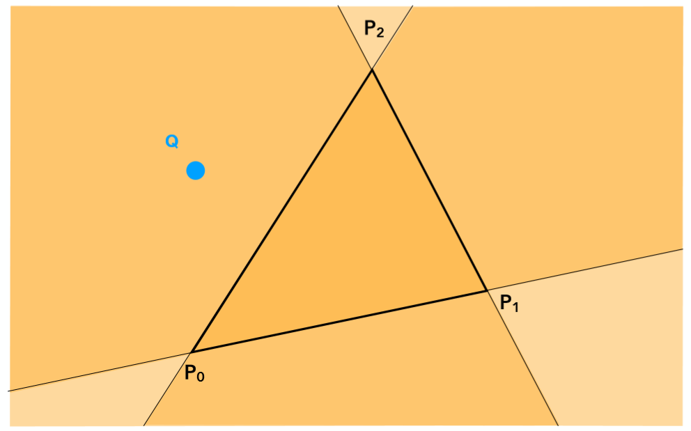\n\n\n\n

利用叉乘具有的性质，我们可以利用这一运算来判断像素和三角形的位置关系

\n\n\n\n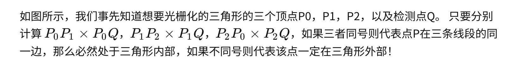\n\n\n\n

因此自然的，只需要遍历每一个点就可以得出三角形的光栅化结果了！当然我们还可以进一步的进行优化，因为显然并没有必要去测试屏幕中的每一个点，一个三角形面可能只占屏幕很小的部分，可以利用一个bouding box 包围住想要测试的三角形，只对该bounding box内的点进行采样测试，如下图：

\n\n\n\n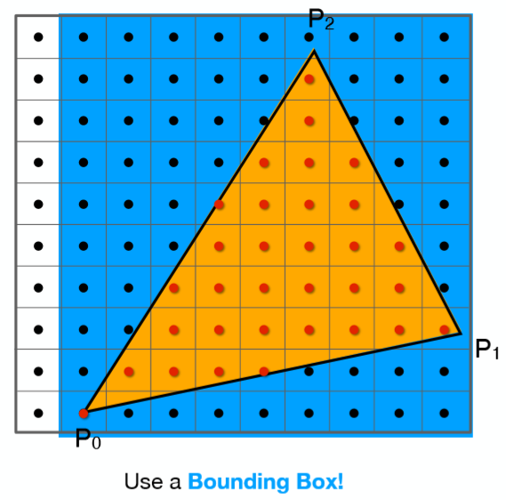\n\n\n\n

Antialiasing and Z-Buffering

\n\n\n\n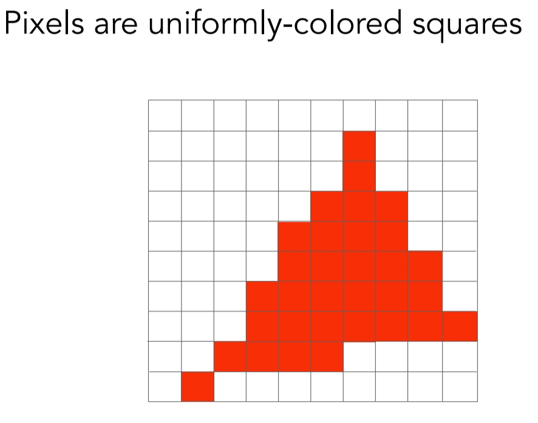\n\n\n\n

with this way we are faced with aliasing.

\n\n\n\n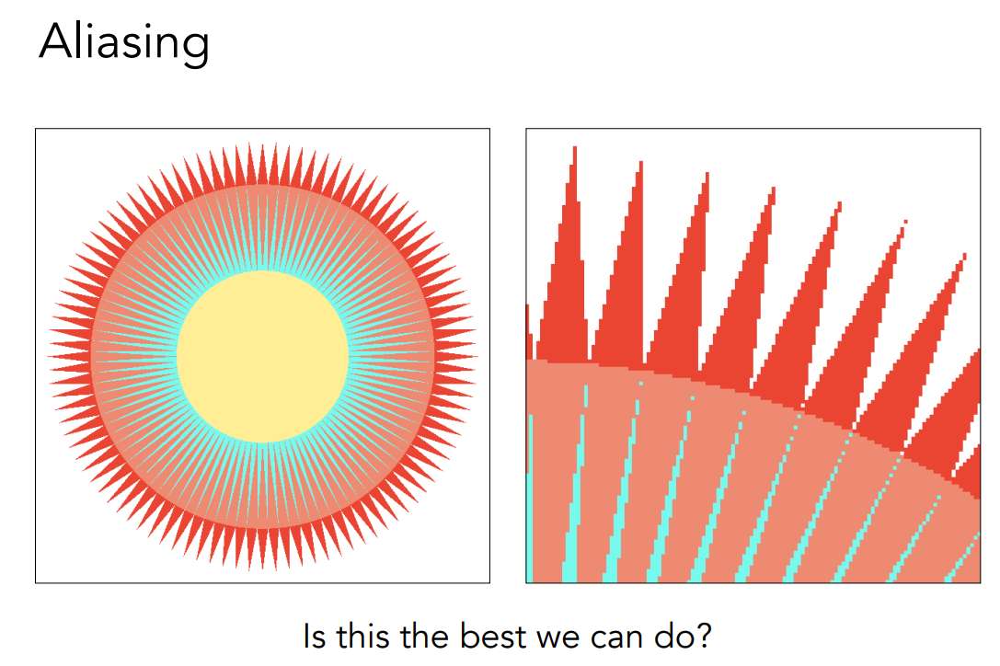\n\n\n\n

so we says that we meet Sampling Artifacts (Errors / Mistakes / Inaccuracies) in Computer Graphics

\n\n\n\n

从简单的角度去解释这种问题出现的原因就是，**我们用有限离散的像素点去逼近连续的三角形** ，那么自然会出现这种锯齿走样的现象，因为这种近似是不准确的。接下来会介绍两种解决走样的方法，具体来说第二种可以当成第一种的改良

\n\n\n\n

1.1**Super Sampling AA**

\n\n\n\n

cut every pixels into four or more parts , then get the colour by average

\n\n\n\n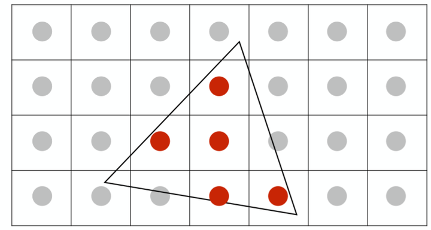\n\n\n\n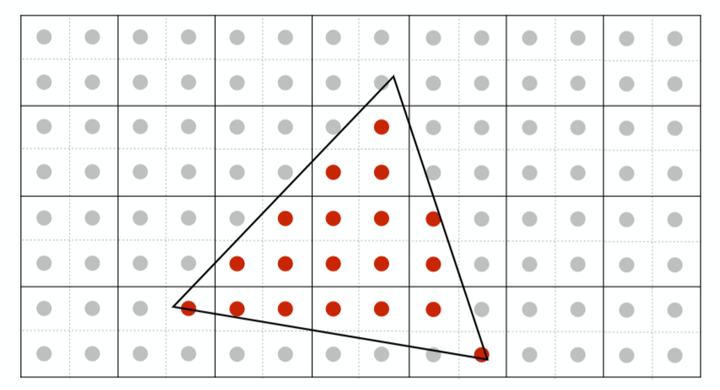\n\n\n\n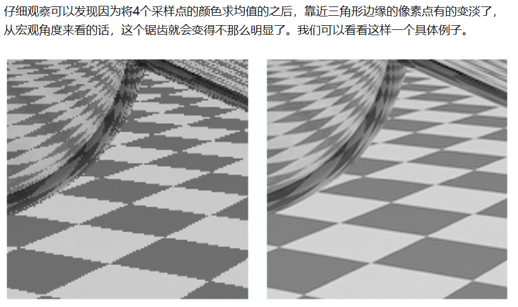\n\n\n\n

1.2**Multi-Sampling AA**

\n\n\n\n

we simplify it into only culculating how many 

\n\n\n\n

MSAA的做法也很容易理解，我们依然同样会分采样点，但是只会去计算究竟有几个采样点会被三角形cover，计算颜色的时候只会利用像素中心坐标计算一次颜色(即所有的信息都会被插值到像素中心然后取计算颜色)，如下图：

\n\n\n\n\n\n\n\n

只有两个采样点被我们的三角形cover了，将该像素中心计算出来的颜色值乘以50%即可，这样大大减少了计算量，不必对每个子采样点都进行着色计算，并且得到反走样效果也是很不错的。

\n\n\n\n

## **Z-Buffer算法**

\n\n\n\n

（补充）

\n\n\n\n

解决了走样问题之后，还有一个仍需解决的问题，我们如何判断物体先后关系？更具体的说每个像素点所对应的可能不止一个三角形面上的点，我们该选择哪个三角形面上的点来显示呢？答案显然易见，离摄像头最近的像素点显示。这里便要利用到我们之前做�����−����−����������变换之后所得到的深度值 � 了，这里定义z越大离摄像机越远！

\n\n\n\n

以下我们介绍Z-Buffer算法，主要有2步。

\n\n\n\n

**1\. Z-Buffer算法需要为每个像素点维持一个深度数组记为zbuffer，其每个位置初始值置为无穷大（即离摄像机无穷远）。**

\n\n\n\n

**2\. 随后我们遍历每个三角形面上的每一个像素点[x,y]，如果该像素点的深度值z，小于zbuffer[x,y]中的值，则更新zbuffer[x,y]值为该点深度值z，并同时更新该像素点[x,y]的颜色为该三角形面上的该点的颜色。**

\n\n\n\n

没错，根据上述两个步骤，我们就已经能够成功得到正确**遮挡** 顺序的结果了，伪代码如下:

\n\n\n\n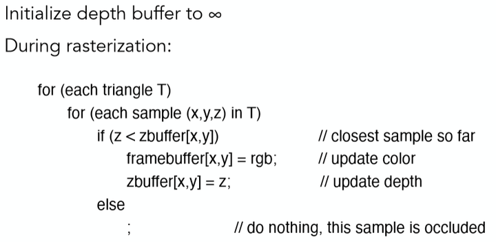\n\n\n\n

so the following two ways have the same result

\n\n\n\n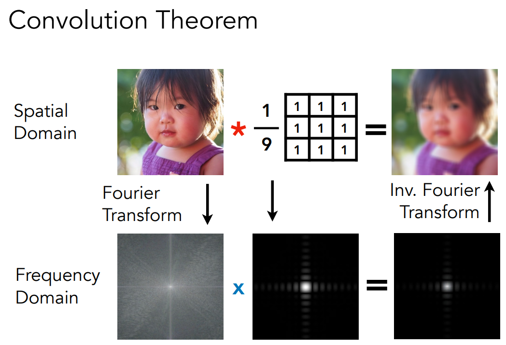\n\n\n\n

FFT AND FILTER AND INV.FFT

\n\n\n\n

Convolution

\n\n\n\n

\n\n\n\n

\n\n\n\n

## 光线追踪

\n\n\n\n

**最基本的光线追踪原理——Whitted-style 光线追踪原理及其实现细节**

\n\n\n\n

为什么需要光线追踪呢？  
**因为Blinn-Phong这种局部模型无法处理全局效果！**

\n\n\n\n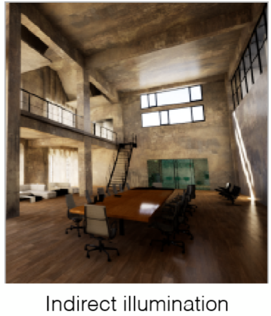\n\n\n\n

如上图中房屋顶部的所接受到的光可不仅仅是Blinn-Phong模型考虑的直接光源，还有可能是来自窗外的光源照射到地板，再发生反射照射到了房屋顶部，而这部分光是局部光照模型没有考虑到的，而光线追踪正是为了解决这种问题所提出的一种全局光照模型。  
换个角度来考虑，光栅化虽然快但是得到的图像质量一般较低，为了追求更好的结果当然就会寻求更加完美的模型了。

\n\n\n\n\n