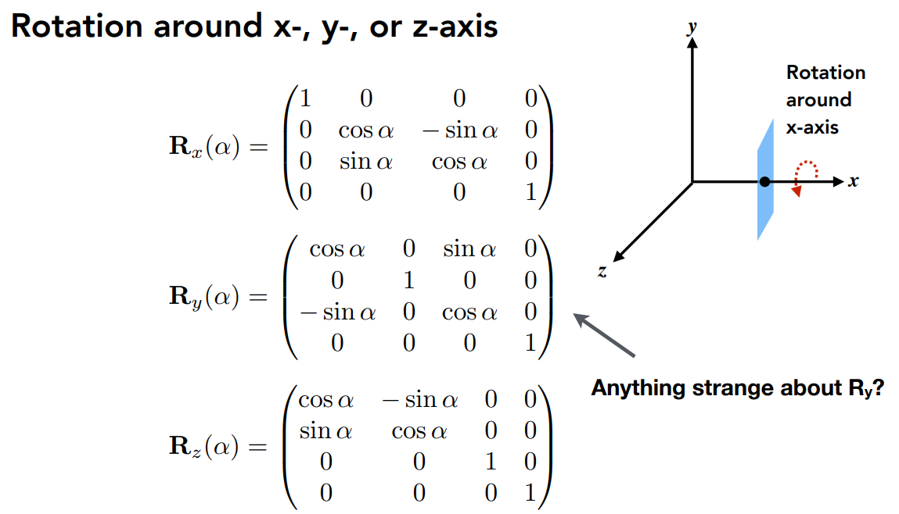
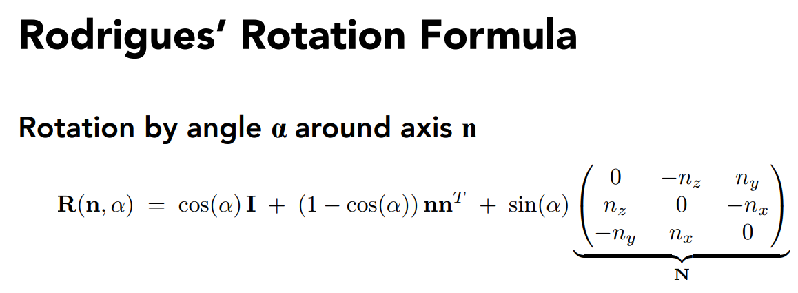
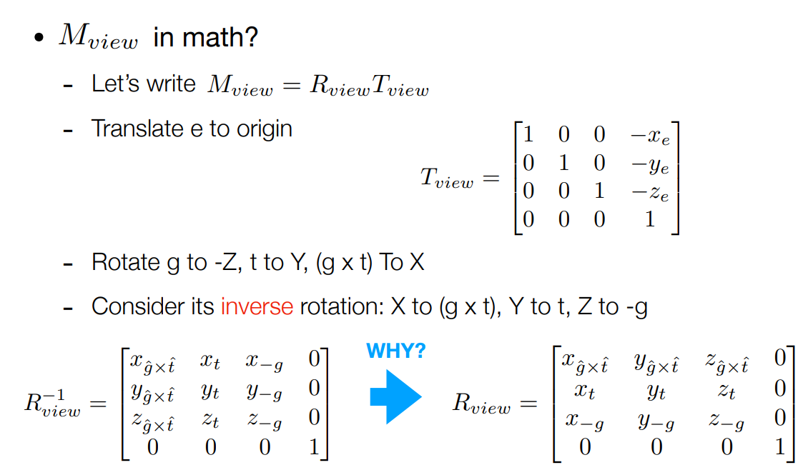

## 作业0：

简单的Eigen库中的向量、矩阵运算，贴一点代码

    
    Eigen::Vector3f v(1.0f,2.0f,3.0f);
    Eigen::Vector3f w(1.0f,0.0f,0.0f);
    // vector output
    std::cout << "Example of output \
";
    std::cout << v << std::endl;
    // vector add
    std::cout << "Example of add \
";
    std::cout << v + w << std::endl;
    // vector scalar multiply
    std::cout << "Example of scalar multiply \
";
    std::cout << v * 3.0f << std::endl;
    std::cout << 2.0f * v << std::endl;
    // Example of matrix
    std::cout << "Example of matrix \
";
    // matrix definition
    Eigen::Matrix3f i,j;
    i << 1.0, 2.0, 3.0, 4.0, 5.0, 6.0, 7.0, 8.0, 9.0;
    j << 2.0, 3.0, 1.0, 4.0, 6.0, 5.0, 9.0, 7.0, 8.0;
    // matrix output
    std::cout << "Example of output \
";
    std::cout << i << std::endl;
    // matrix add i + j
    std::cout << "Example of add \
";
    std::cout << i + j << std::endl;
    // matrix scalar multiply i * 2.0
    std::cout << "Example of scalar multiply \
";
    std::cout << i * 2.0f << std::endl;
    // matrix multiply i * j
    std::cout << "Example of matrix multiply \
";
    std::cout << i * j << std::endl;
    // matrix multiply vector i * v
    std::cout << "Example of matrix vector multiply \
";
    std::cout << i * v << std::endl;

## 作业1：

也较简单，主要是实现几个矩阵旋转的对应函数

    
    Eigen::Matrix4f get_model_matrix(float rotation_angle)
{
    Eigen::Matrix4f model = Eigen::Matrix4f::Identity();
    // TODO: Implement this function
    // Create the model matrix for rotating the triangle around the Z axis.
    // Then return it.
    Eigen::Matrix4f rotate;
    float angle = rotation_angle / MY_PI * acos(-1);
    rotate << cos(angle), -sin(angle), 0.0, 0.0, sin(angle), cos(angle), 0.0, 0.0, 0.0,
        0.0, 1.0, 0.0, 0.0, 0.0, 0.0, 1.0;
    model = rotate * model;
    return model;
}
Eigen::Matrix4f get_projection_matrix(float eye_fov, float aspect_ratio,
                                      float zNear, float zFar)
{
    // Students will implement this function
    Eigen::Matrix4f projection = Eigen::Matrix4f::Identity();
    // TODO: Implement this function
    // Create the projection matrix for the given parameters.
    // Then return it.
    Eigen::Matrix4f m;
    m << zNear, 0, 0, 0,
        0, zNear, 0, 0,
        0, 0, zNear + zFar, -zNear * zFar,
        0, 0, 1, 0;

    float halve = eye_fov/2*MY_PI/180;
    float top = tan(halve) * zNear;
    float bottom = -top;
    float right = top * aspect_ratio;
    float left = -right;
    Eigen::Matrix4f n, p;
    n << 2/(right - left), 0, 0, 0,
        0, 2/(top - bottom), 0, 0,
        0, 0, 2/(zNear - zFar), 0,
        0, 0, 0, 1;
    p << 1, 0, 0, -(right + left)/2,
        0, 1, 0, -(top + bottom)/2,
        0, 0, 1, -(zFar + zNear)/2,
        0, 0, 0, 1;
    projection = n * p * m;
    return projection;
}

对应的PPT矩阵如图：

rotate by an axis

Bonus:

View Transformation:

using inverse matrix to perform the calculation

## 作业2

相比于上一次作业，这一次作业的主要任务是绘制一个（或者说两个）实心三角形，其中需要采取插值的办法涂色,主要修改的函数有两个，一个是rasterize_triangle，一个是判断点是否在三角形内部

    
    void rst::rasterizer::rasterize_triangle(const Triangle& t) {
    auto v = t.toVector4();
    //find the AABB box
    float x_min = std::min(v[0].x(), std::min(v[1].x(), v[2].x()));
    float x_max = std::max(v[0].x(), std::max(v[1].x(), v[2].x()));
    float y_min = std::min(v[0].y(), std::min(v[1].y(), v[2].y()));
    float y_max = std::max(v[0].y(), std::max(v[1].y(), v[2].y()));
    //confirm the approximate range of the triangle

  // iterate through the pixel and find if the current pixel is inside the triangle
    for(int x = (int)x_min; x <= (int)x_max; x++)
    {
        for(int y = (int)y_min; y <= (int)y_max; y++)
        {
            if(insideTriangle(x, y, t.v))
            {
                // If so, use the following code to get the interpolated z value.
                auto[alpha, beta, gamma] = computeBarycentric2D(x, y, t.v);
                float w_reciprocal = 1.0/(alpha / v[0].w() + beta / v[1].w() + gamma / v[2].w());
                float z_interpolated = alpha * v[0].z() / v[0].w() + beta * v[1].z() / v[1].w() + gamma * v[2].z() / v[2].w();
                z_interpolated *= w_reciprocal;
                int index = get_index(x, y);
                if(z_interpolated < depth_buf[index])
                {
                    depth_buf[index] = z_interpolated;
                    set_pixel(Vector3f(x, y, z_interpolated), t.getColor());
                }
            }
        }
    }
}

其中仔细看一下插值部分的实现，系数主要是通过这个computeBarycentric2D计算

    
    static std::tuple<float, float, float> computeBarycentric2D(float x, float y, const Vector3f* v)
{
    float c1 = (x*(v[1].y() - v[2].y()) + (v[2].x() - v[1].x())*y + v[1].x()*v[2].y() - v[2].x()*v[1].y()) / (v[0].x()*(v[1].y() - v[2].y()) + (v[2].x() - v[1].x())*v[0].y() + v[1].x()*v[2].y() - v[2].x()*v[1].y());
    float c2 = (x*(v[2].y() - v[0].y()) + (v[0].x() - v[2].x())*y + v[2].x()*v[0].y() - v[0].x()*v[2].y()) / (v[1].x()*(v[2].y() - v[0].y()) + (v[0].x() - v[2].x())*v[1].y() + v[2].x()*v[0].y() - v[0].x()*v[2].y());
    float c3 = (x*(v[0].y() - v[1].y()) + (v[1].x() - v[0].x())*y + v[0].x()*v[1].y() - v[1].x()*v[0].y()) / (v[2].x()*(v[0].y() - v[1].y()) + (v[1].x() - v[0].x())*v[2].y() + v[0].x()*v[1].y() - v[1].x()*v[0].y());
    return {c1,c2,c3};
}

重心坐标详解见[计算机图形学补充1：重心坐标(barycentric coordinates)详解及其作用 - 知乎 (zhihu.com)](<https://zhuanlan.zhihu.com/p/144360079>)

首先，`w_reciprocal` 是计算出的w的倒数，它是通过对每个顶点的w值取倒数，然后用巴里坐标（alpha、beta、gamma）进行加权平均得到的。

然后，`z_interpolated` 是通过对每个顶点的z值和w值的比值进行巴里坐标加权平均得到的。

最后，`z_interpolated` 乘以 `w_reciprocal`，这是因为在透视投影中，z值和w值的比值是线性插值的，而不是z值本身。所以我们需要先计算z/w的插值，然后再乘以w的插值，得到最终的z值的插值。

## 作业3

作业三进一步将插值扩展到了法向量、颜色和纹理颜色的插值，以及实现Blinn-Phong 的模型计算Fragment Color,其中需要分清楚的是，法向量、纹理和颜色分别包含哪些内容  
作业二中已经提及的部分不在重复给出

    
    if (z_interpolated < depth_buf[get_index(x, y)])
                {
                    Eigen::Vector2i p = { (float)x,(float)y};
                    // 颜色插值
                    auto interpolated_color = interpolate(alpha, beta, gamma, t.color[0], t.color[1], t.color[2], 1);
                    // 法向量插值
                    auto interpolated_normal = interpolate(alpha, beta, gamma, t.normal[0], t.normal[1], t.normal[2], 1);
                    // 纹理颜色插值
                    auto interpolated_texcoords = interpolate(alpha, beta, gamma, t.tex_coords[0], t.tex_coords[1], t.tex_coords[2], 1);
                    // 内部点位置插值
                    auto interpolated_shadingcoords = interpolate(alpha, beta, gamma, view_pos[0], view_pos[1], view_pos[2], 1);
                    fragment_shader_payload payload(interpolated_color, interpolated_normal.normalized(), interpolated_texcoords, texture ? &*texture : nullptr);
                    payload.view_pos = interpolated_shadingcoords;
                    auto pixel_color = fragment_shader(payload);
                    set_pixel(p, pixel_color); //设置颜色
                    depth_buf[get_index(x, y)] = z_interpolated;//更新z值
                }

比起之前的插值部分，这里明显多出了颜色、纹理、法向量的插值，根据求解得出的alpha,beta,gamma加入需要插值的参数代入interploate中进行插值，所以我们也要查看一下这个插值函数

    
    static Eigen::Vector3f interpolate(float alpha, float beta, float gamma, const Eigen::Vector3f& vert1, const Eigen::Vector3f& vert2, const Eigen::Vector3f& vert3, float weight)
{
    return (alpha * vert1 + beta * vert2 + gamma * vert3) / weight;
}

很直接的加权平均。

本次作业还有几个比较重要的shader和mapping方式，涉及到纹理究竟应该如何映射到模型上

    
    if (payload.texture)
    {
        // TODO: Get the texture value at the texture coordinates of the current fragment
        return_color = payload.texture->getColor(payload.tex_coords.x(), payload.tex_coords.y());
    }

在简单的texture shader中，只要按照Blinn-Phong模型中要求的一样，完成ambient/diffuse/specular

    
    for (auto& light : lights)
    {
        // TODO: For each light source in the code, calculate what the *ambient*, *diffuse*, and *specular* 
        // components are. Then, accumulate that result on the *result_color* object.
        Eigen::Vector3f ambient = ka.cwiseProduct(amb_light_intensity);
        double r = (light.position - point).norm();
        Eigen::Vector3f l = (light.position - point).normalized();
        double cos_theta = l.dot(normal);
        double r_2 = r*r;
        Eigen::Vector3f diffuse = kd.cwiseProduct(light.intensity/r_2) * std::max(cos_theta, 0.0);
        Eigen::Vector3f v = (eye_pos - point).normalized();
        Eigen::Vector3f h = (v + l).normalized();// compute h which is the half vector
        double cos_alpha = h.dot(normal);
        Eigen::Vector3f specular = ks.cwiseProduct(light.intensity/r_2) * std::pow(std::max(cos_alpha, 0.0), p);
        result_color += ambient + diffuse + specular;
    }

先看看displacement shader

    
    Eigen::Vector3f displacement_fragment_shader(const fragment_shader_payload& payload)
{

    Eigen::Vector3f ka = Eigen::Vector3f(0.005, 0.005, 0.005);
    Eigen::Vector3f kd = payload.color;
    Eigen::Vector3f ks = Eigen::Vector3f(0.7937, 0.7937, 0.7937);
    auto l1 = light{{20, 20, 20}, {500, 500, 500}};
    auto l2 = light{{-20, 20, 0}, {500, 500, 500}};
    std::vector<light> lights = {l1, l2};
    Eigen::Vector3f amb_light_intensity{10, 10, 10};
    Eigen::Vector3f eye_pos{0, 0, 10};
    float p = 150;
    Eigen::Vector3f color = payload.color; 
    Eigen::Vector3f point = payload.view_pos;
    Eigen::Vector3f normal = payload.normal;
    float kh = 0.2, kn = 0.1;

    // TODO: Implement displacement mapping here
    // Let n = normal = (x, y, z)
    // Vector t = (x*y/sqrt(x*x+z*z),sqrt(x*x+z*z),z*y/sqrt(x*x+z*z))
    // Vector b = n cross product t
    // Matrix TBN = [t b n]
    // dU = kh * kn * (h(u+1/w,v)-h(u,v))
    // dV = kh * kn * (h(u,v+1/h)-h(u,v))
    // Vector ln = (-dU, -dV, 1)
    // Position p = p + kn * n * h(u,v)
    // Normal n = normalize(TBN * ln)
    double x = normal.x(),y = normal.y(),z=normal.z();
    Vector3f t =Vector3f(x*y/sqrt(x*x+z*z),sqrt(x*x+z*z),z*y/sqrt(x*x+z*z));
    Vector3f b = normal.cross(t);
    Eigen:Matrix3f TBN ;
    TBN<<t.x(),b.x(),normal.x(),
         t.y(),b.y(),normal.y(),
         t.z(),b.z(),normal.z();
    float u=payload.tex_coords.x();
    float v=payload.tex_coords.y();
    float w=payload.texture->width;
    float h=payload.texture->height;
    float dU = kh * kn * (payload.texture->getColor(u+1/w,v).norm()-payload.texture->getColor(u,v).norm());
    float dV = kh * kn * (payload.texture->getColor(u,v+1/h).norm()-payload.texture->getColor(u,v).norm());
    Vector3f ln = Vector3f(-dU, -dV, 1);
    point = point + kn * normal * payload.texture->getColor(u,v).norm();
    normal = (TBN * ln).normalized();
    Eigen::Vector3f result_color = {0, 0, 0};
    for (auto& light : lights)
    {
        // TODO: For each light source in the code, calculate what the *ambient*, *diffuse*, and *specular* 
        // components are. Then, accumulate that result on the *result_color* object.
        Eigen::Vector3f ambient = ka.cwiseProduct(amb_light_intensity);
        double r = (light.position - point).norm();
        Eigen::Vector3f l = (light.position - point).normalized();
        double cos_theta = l.dot(normal);
        double r_2 = r*r;
        Eigen::Vector3f diffuse = kd.cwiseProduct(light.intensity/r_2) * std::max(cos_theta, 0.0);
        Eigen::Vector3f v = (eye_pos - point).normalized();
        Eigen::Vector3f h = (v + l).normalized();// compute h which is the half vector
        double cos_alpha = h.dot(normal);
        Eigen::Vector3f specular = ks.cwiseProduct(light.intensity/r_2) * std::pow(std::max(cos_alpha, 0.0), p);
        result_color += ambient + diffuse + specular;
    }
    return result_color * 255.f;
}

Displacement置换贴图是一种利用纹理的技术，用于空间上的扭曲经过细分的几何体。Displacement贴图可以是向量贴图，也可以是高度（黑白）贴图，它们用来扭曲曲面。与其“廉价”的“姐妹”节点（Bump贴图）相比，使用Displacement贴图产生产真正的阴影，因为几何体在空间中被真正改变的形状。

    
    Eigen::Vector3f bump_fragment_shader(const fragment_shader_payload& payload)
{

    Eigen::Vector3f ka = Eigen::Vector3f(0.005, 0.005, 0.005);
    Eigen::Vector3f kd = payload.color;
    Eigen::Vector3f ks = Eigen::Vector3f(0.7937, 0.7937, 0.7937);
    auto l1 = light{{20, 20, 20}, {500, 500, 500}};
    auto l2 = light{{-20, 20, 0}, {500, 500, 500}};
    std::vector<light> lights = {l1, l2};
    Eigen::Vector3f amb_light_intensity{10, 10, 10};
    Eigen::Vector3f eye_pos{0, 0, 10};
    float p = 150;
    Eigen::Vector3f color = payload.color; 
    Eigen::Vector3f point = payload.view_pos;
    Eigen::Vector3f normal = payload.normal;

    float kh = 0.2, kn = 0.1;
    // TODO: Implement bump mapping here
    // Let n = normal = (x, y, z)
    // Vector t = (x*y/sqrt(x*x+z*z),sqrt(x*x+z*z),z*y/sqrt(x*x+z*z))
    // Vector b = n cross product t
    // Matrix TBN = [t b n]
    // dU = kh * kn * (h(u+1/w,v)-h(u,v))
    // dV = kh * kn * (h(u,v+1/h)-h(u,v))
    // Vector ln = (-dU, -dV, 1)
    // Normal n = normalize(TBN * ln)
    double x = normal.x(),y = normal.y(),z=normal.z();
    Vector3f t =Vector3f(x*y/sqrt(x*x+z*z),sqrt(x*x+z*z),z*y/sqrt(x*x+z*z));
    Vector3f b = normal.cross(t);
    Eigen:Matrix3f TBN ;
    TBN<<t.x(),b.x(),normal.x(),
         t.y(),b.y(),normal.y(),
         t.z(),b.z(),normal.z();
    float u=payload.tex_coords.x();
    float v=payload.tex_coords.y();
    float w=payload.texture->width;
    float h=payload.texture->height;
    float dU = kh * kn * (payload.texture->getColor(u+1/w,v).norm()-payload.texture->getColor(u,v).norm());
    float dV = kh * kn * (payload.texture->getColor(u,v+1/h).norm()-payload.texture->getColor(u,v).norm());
    Vector3f ln = Vector3f(-dU, -dV, 1);
    Eigen::Vector3f result_color = {0, 0, 0};
    result_color = (TBN * ln).normalized();
    return result_color * 255.f;
}
