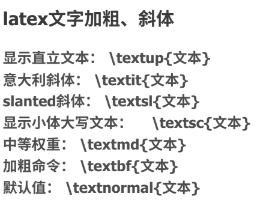

by 朱雅江（bu shi, 其实是朱江云）

专业的排版输出能力  
大量的宏包和可扩展性

不容易排查错误和格式风格

原则：有耐心，善于使用搜索引擎，**内容比格式重要**

安装

Tex Live : 比较大，完整版体积较大

mirror.nju.edu.cn安装较快，有一定的教程

——拷问：你是否真的需要在本地安装

——tex.nju.edu.cn

UTF8编码均较合适

本地编辑器

——配置文件链接（PPT有）

开始写作！

%导言区

\\\documentclass{article}  
%导入宏包  
\\\usepackage{}

\\\begin{env} \\\end{env}

注释使用%（转义\\\\)

多个空格会被无视或者当作一个处理

空行才是分段

一定的文本标记：  

之类的，有关加粗，倾斜，变色之类的

注意内容与格式分离：

行间公式与行内公式：\\\begin{} \\\end{} 与＄＄

行间公式可以自动编号 \\\label 

或者手动tag

注：数学公式推荐 usepackages{cmsmath}

\\\text可以直出文字，但是不建议大量使用（反思！）

frac分式比较小，dfrac会破坏行距，qquad保持斜着的分式，

在数学公式缺乏的时候，可以用declareMathOperator自己定义一个，然后\\
ame使用，可以避免斜体公式

多行公式：align (notag 免于标记),可以取代equation，或者aligned作为子环境（加上*好可以去除编号环境）

矩阵：bmatrix方括号矩阵 vdots,ldots&cdots,ddots分别是竖着/横着（居中和靠下的）/斜着的省略号

usepakage emoji可以实现

字体：相当复杂，以下链接研究

插入图片：使用包grahicx,\\\graphicspath制定路径，在其中可以调整一些特定选项，宽度高度，caption,label

插入表格：booktabs 三线表

解决复杂的Latex:

你真的需要latex吗？？  
真的需要怎么办！ 用宏包 / 第三方工具

公式可以使用O C R偷懒

推荐的宏包：texxdoc

使用定界府调节(大小-----\\\qty 或者\\\right
