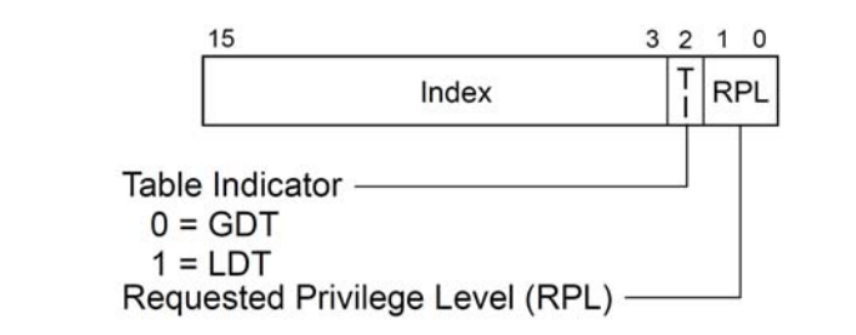

\n

## programming07 

\n\n\n\n

实验要求是分别实现实模式、分段式、段页式三种内存的地址转换与数据加载功能

\n\n\n\n

### 资料核心点：

\n\n\n\n

实模式和保护模式都是CPU的工作模式的一种。

\n\n\n\n

实模式出现于早期8088CPU时期。当时由于CPU的性能有限，一共只有 20 位地址线（所以地址空间只有1MB），以及一些 16 位的寄存器。为了能够通过这些 16 位的寄存器去构成 20 位的主存地址，通常需要用两个寄存器，第一个寄存器表示基址，第二个寄存器表示偏移量。那么两个 16 位的值如何组合成一个 20位的地址呢？实模式采用的方式是把基址先向左移 4 位，然后再与偏移量相加。即：

\n\n\n

#### 物理地址 = 基址 << 4 + 偏移量

\n\n\n

而在本实验中，

\n\n\n\n

 _logicAddr_ _48_ _位_ _= 16_ _位段寄存器_ _\+ 32_ _位_ _offset_ _，计算公式为：①_ _(16-bits_ _段寄存器左移_ _4_ _位_ _\+ offset_ _的低_ _16-bits) = 20-bits_ _物理地址 ②高位补_ _0_ _到_ _32-bits  
_ _@return_ _32-bits_ _实模式线性地址_

\n\n\n\n

因为物理地址只有20位，所以只要偏移量有效的低20位即可，为了最后是32位注意使用inttobinary转换可以自动补齐至32位

\n\n\n\n

分段过程实现将逻辑地址转换为线性地址，分页过程再实现将线性地址转换为物理地址。

\n\n\n\n

#### 段选择符和段寄存器

\n\n\n\n

段选择符格式如下图所示，其中TI和RPL字段我们暂时不用关心。`高 13 位的索引值用来确定当前使用的段描述符在描述符表中的位置，表示是其中的第几个段表项`。

\n\n\n\n

段选择符存放在段寄存器中，共有 6 个段寄存器: CS、SS、DS、ES、FS和GS。其中，CS是代码段寄存器，指向程序代码所在的段。SS是栈段寄存器，指向栈区所在的段。DS是数据段寄存器，指向程序的全局静态数据区所在的段。其他 3 个段寄存器可以指向任意的数据段。

\n\n\n\n\n\n\n\n

#### 段描述符

\n\n\n\n

`段描述符是一种数据结构，实际上就是分段方式下的段表项。`一个段描述符占用 8 个字节，其一般格式如下图所示，包括 32 位的基地址（Base）、 20 位的限界（SegLimit）和一些属性位。属性位比较多，我们只介绍属性位G。

\n\n\n\n

属性位G表示粒度大小。G=1说明段以页（4KB）为基本单位，G=0则段以字节为基本单位。由于界限为20 位，所以当G=0时，最大的段为1B * 2^20 = 1MB。当G=1时，最大的段为4KB * 2^20 = 4GB。

\n\n\n\n

## Programming 05 cache

\n\n\n\n
    
    
    package memory.cache;\n\nimport memory.Memory;\nimport memory.cache.cacheReplacementStrategy.ReplacementStrategy;\nimport util.Transformer;\nimport java.util.Arrays;\n\n/**\n * 高速缓存抽象类\n */\npublic class Cache {\n\n    public static final boolean isAvailable = true; // 默认启用Cache\n\n    public static final int CACHE_SIZE_B = 32 * 1024; // 32 KB 总大小\n\n    public static final int LINE_SIZE_B = 64; // 64 B 行大小\n\n    private final CacheLine[] cache = new CacheLine[CACHE_SIZE_B / LINE_SIZE_B];\n\n    private int SETS;   // 组数\n\n    private int setSize;    // 每组行数\n\n    // 单例模式\n    private static final Cache cacheInstance = new Cache();\n\n    private Cache() {\n        for (int i = 0; i < cache.length; i++) {\n            cache[i] = new CacheLine();\n        }\n    }\n\n    public static Cache getCache() {\n        return cacheInstance;\n    }\n\n    private ReplacementStrategy replacementStrategy;    // 替换策略\n\n    public static boolean isWriteBack;   // 写策略\n\n    /**\n     * 读取[pAddr, pAddr + len)范围内的连续数据，可能包含多个数据块的内容\n     *\n     * @param pAddr 数据起始点(32位物理地址 = 26位块号 + 6位块内地址)\n     * @param len   待读数据的字节数\n     * @return 读取出的数据，以char数组的形式返回\n     */\n    public byte[] read(String pAddr, int len) {\n        byte[] data = new byte[len];\n        int addr = Integer.parseInt(Transformer.binaryToInt("0" + pAddr));\n        int upperBound = addr + len;\n        int index = 0;\n        while (addr < upperBound) {\n            int nextSegLen = LINE_SIZE_B - (addr % LINE_SIZE_B);\n            if (addr + nextSegLen >= upperBound) {\n                nextSegLen = upperBound - addr;\n            }//get the length of the next segment\n            //if exceed the upper bound, then set the length to the rest of the data\n            int rowNO = fetch(Transformer.intToBinary(String.valueOf(addr)));\n            byte[] cache_data = cache[rowNO].getData();\n            int i = 0;\n            while (i < nextSegLen) {\n                data[index] = cache_data[addr % LINE_SIZE_B + i];\n                index++;\n                i++;\n            }\n            addr += nextSegLen;\n        }\n        return data;\n    }\n\n    /**\n     * 向cache中写入[pAddr, pAddr + len)范围内的连续数据，可能包含多个数据块的内容\n     *\n     * @param pAddr 数据起始点(32位物理地址 = 26位块号 + 6位块内地址)\n     * @param len   待写数据的字节数\n     * @param data  待写数据\n     */\n    public void write(String pAddr, int len, byte[] data) {\n        int addr = Integer.parseInt(Transformer.binaryToInt("0" + pAddr));\n        int upperBound = addr + len;\n        int index = 0;\n        while (addr < upperBound) {\n            int nextSegLen = LINE_SIZE_B - (addr % LINE_SIZE_B);\n            if (addr + nextSegLen >= upperBound) {\n                nextSegLen = upperBound - addr;\n            }\n            int rowNO = fetch(Transformer.intToBinary(String.valueOf(addr)));\n            byte[] cache_data = cache[rowNO].getData();\n            int i = 0;\n            while (i < nextSegLen) {\n                cache_data[addr % LINE_SIZE_B + i] = data[index];\n                index++;\n                i++;\n            }\n            //TODO but done\n            //write the data according to the write strategy\n            //1. write through\n            if(!isWriteBack){\n                //dirty bit is always 0\n                //write the data to memory\n                Memory.getMemory().write(pAddr, len, data);\n                //update the cache and using strategy\n                addTimeStamp();\n                update(rowNO, getTag(pAddr), cache_data);\n                setTimeStamp(rowNO);\n            }\n            else{\n                //get the dirty bit\n                cache[rowNO].dirty = true;\n                //update the cache and using strategy\n                addTimeStamp();\n                update(rowNO, getTag(pAddr), cache_data);\n                setTimeStamp(rowNO);\n            }\n\n            addr += nextSegLen;\n        }\n    }\n\n    /**\n    * 从32位物理地址(26位块号 + 6位块内地址)获取目标数据的tag\n     * 首先将32位物理地址转换为26位，然后将其前面补0至32位\n    * @param pAddr 32位物理地址\n    * @return 数据的tag\n    *\n     */\n    public char[] getTag(String pAddr) {\n        int tagSize = 26 - (int) (Math.log(SETS) / Math.log(2));\n        StringBuilder builder = new StringBuilder();\n        for (int i = 0; i < 26 - tagSize; i++) {\n            builder.append("0");\n        }\n        builder.append(pAddr.substring(0, tagSize));\n        return builder.toString().toCharArray();\n    }\n\n    /**\n     * 查询{@link Cache#cache}表以确认包含pAddr的数据块是否在cache内\n     * 如果目标数据块不在Cache内，则将其从内存加载到Cache\n     *\n     * @param pAddr 数据起始点(32位物理地址 = 26位块号 + 6位块内地址)\n     * @return 数据块在Cache中的对应行号\n     */\n    private int fetch(String pAddr) {\n        //TODO but done\n        int blockNO = getBlockNO(pAddr);\n        int rowNO = map(blockNO);\n        int start = (blockNO%SETS)*setSize;\n        int last = start + setSize;\n        //get the tag\n        char[] tag = getTag(pAddr);\n        //if didn't hit\n        if(rowNO == -1){\n            //get the data from memory(pAddr is 26 bits but the address in memory is 32 bits)\n            byte[] data = Memory.getMemory().read(pAddr.substring(0,26)+"000000", LINE_SIZE_B);\n            int availableRow = -1;\n            //find an available row\n            for(int i = start; i < last; i++){\n                if(!cache[i].validBit){\n                    availableRow = i;\n                    break;\n                }\n            }\n            //if there is an available row\n            if(availableRow != -1){\n                //update the cache\n                addTimeStamp();\n                update(availableRow, tag, data);\n                //update the strategy\n                setTimeStamp(availableRow);\n                rowNO = availableRow;\n            }\n            else{\n                //if there is no available row\n                //replace the row\n                int replace = replacementStrategy.replace(start, last, tag, data);\n                if(cache[replace].dirty){\n                    //if the dirty bit is 1\n                    //write the data to memory\n                    Memory.getMemory().write(pAddr.substring(0,26)+"000000", LINE_SIZE_B, cache[replace].getData());\n                    cache[replace].dirty = false;\n                }\n                //update the cache\n                addTimeStamp();\n                update(replace, tag, data);\n                setTimeStamp(replace);\n                return replace;\n            }\n\n        }\n        else {\n            //if hit\n            //update the strategy\n            replacementStrategy.hit(rowNO);\n            return rowNO;\n        }\n        return rowNO;\n    }\n\n    public String getpAddr(int rowNO) {\n//        System.out.println(getBlockNO("00000000000000000000000001000000"));\n//        rowNO = setSize * blocknum + blockAddr\n        int n = 0;\n        while (Math.pow(2, n) != SETS) {\n            n += 1;\n        }\n        String tag = String.valueOf(this.cache[rowNO].tag).substring(n, 26);\n        int blocknum = rowNO / setSize;\n        String block = Transformer.intToBinary("0" + blocknum).substring(32 - n, 32);\n        String blockAddr = Transformer.intToBinary("0" + (rowNO - setSize * blocknum)).substring(26, 32);\n\n        return tag + block + blockAddr;\n\n    }\n\n\n    /**\n     * 根据目标数据内存地址前26位的int表示，进行映射\n     *\n     * @param blockNO 数据在内存中的块号\n     * @return 返回cache中所对应的行，-1表示未命中\n     */\n    private int map(int blockNO) {\n        //TODO but done\n        //search for the rowNO\n        int start = (blockNO%SETS)*setSize;\n        int last = start + setSize;\n        for(int i = start; i < last; i++){\n            if(cache[i].validBit){\n                if(Integer.parseInt(Transformer.binaryToInt(String.valueOf(cache[i].getTag()))) == blockNO/SETS){\n                    return i;\n                }\n            }\n        }\n        return -1;\n    }\n\n    /**\n     * 更新cache\n     *\n     * @param rowNO 需要更新的cache行号\n     * @param tag   待更新数据的Tag\n     * @param input 待更新的数据\n     */\n    public void update(int rowNO, char[] tag, byte[] input) {\n        //TODO but done\n        //update the cache\n        cache[rowNO].tag = tag;\n        cache[rowNO].data = input;\n        cache[rowNO].validBit = true;\n        //cache[rowNO].dirty = true;\n        //replacementStrategy.hit(rowNO);\n    }\n\n\n    /**\n     * 从32位物理地址(26位块号 + 6位块内地址)获取目标数据在内存中对应的块号\n     *\n     * @param pAddr 32位物理地址\n     * @return 数据在内存中的块号\n     */\n    private int getBlockNO(String pAddr) {\n        return Integer.parseInt(Transformer.binaryToInt("0" + pAddr.substring(0, 26)));\n    }\n\n    public void setDirty(int rowNO){\n        cache[rowNO].dirty = false;\n    }\n    /**\n     * 该方法会被用于测试，请勿修改\n     * 使用策略模式，设置cache的替换策略\n     *\n     * @param replacementStrategy 替换策略\n     */\n    public void setReplacementStrategy(ReplacementStrategy replacementStrategy) {\n        this.replacementStrategy = replacementStrategy;\n    }\n\n    /**\n     * 该方法会被用于测试，请勿修改\n     *\n     * @param SETS 组数\n     */\n    public void setSETS(int SETS) {\n        this.SETS = SETS;\n    }\n\n    /**\n     * 该方法会被用于测试，请勿修改\n     *\n     * @param setSize 每组行数\n     */\n    public void setSetSize(int setSize) {\n        this.setSize = setSize;\n    }\n\n    /**\n     * 告知Cache某个连续地址范围内的数据发生了修改，缓存失效\n     * 该方法仅在memory类中使用，请勿修改\n     *\n     * @param pAddr 发生变化的数据段的起始地址\n     * @param len   数据段长度\n     */\n    public void invalid(String pAddr, int len) {\n        int from = getBlockNO(pAddr);\n        int to = getBlockNO(Transformer.intToBinary(String.valueOf(Integer.parseInt(Transformer.binaryToInt("0" + pAddr)) + len - 1)));\n\n        for (int blockNO = from; blockNO <= to; blockNO++) {\n            int rowNO = map(blockNO);\n            if (rowNO != -1) {\n                cache[rowNO].validBit = false;\n            }\n        }\n    }\n\n    /**\n     * 清除Cache全部缓存\n     * 该方法会被用于测试，请勿修改\n     */\n    public void clear() {\n        for (CacheLine line : cache) {\n            if (line != null) {\n                line.validBit = false;\n                line.dirty = false;\n                line.timeStamp = 0L;\n                line.visited = 0;\n            }\n        }\n    }\n\n    /**\n     * 输入行号和对应的预期值，判断Cache当前状态是否符合预期\n     * 这个方法仅用于测试，请勿修改\n     *\n     * @param lineNOs     行号\n     * @param validations 有效值\n     * @param tags        tag\n     * @return 判断结果\n     */\n    public boolean checkStatus(int[] lineNOs, boolean[] validations, char[][] tags) {\n        if (lineNOs.length != validations.length || validations.length != tags.length) {\n            return false;\n        }\n        for (int i = 0; i < lineNOs.length; i++) {\n            CacheLine line = cache[lineNOs[i]];\n            if (line.validBit != validations[i]) {\n                return false;\n            }\n            if (!Arrays.equals(line.getTag(), tags[i])) {\n                System.out.println(Arrays.toString(line.getTag()));\n                System.out.println(Arrays.toString(tags[i]));\n                return false;\n            }\n        }\n        return true;\n    }\n\n    // 获取有效位\n    public boolean isValid(int rowNO){\n        return cache[rowNO].validBit;\n    }\n\n    // 获取脏位\n    public boolean isDirty(int rowNO){\n        return cache[rowNO].dirty;\n    }\n\n    // LFU算法增加访问次数\n    public void addVisited(int rowNO){\n        cache[rowNO].visited++;\n    }\n\n    // 获取访问次数\n    public int getVisited(int rowNO){\n        return cache[rowNO].visited;\n    }\n\n    // 用于LRU算法，重置时间戳\n    public void setTimeStamp(int rowNO){\n        cache[rowNO].timeStamp = 0L;\n    }\n\n    //增加时间戳\n    public void addTimeStamp(){\n        for(int i = 0; i < cache.length; i++){\n            if(cache[i].validBit)\n            {\n                cache[i].timeStamp++;\n            }\n        }\n    }\n\n    //用于FIFO算法，重置时间戳\n    public void setTimeStampFIFO(int rowNo){\n        cache[rowNo].timeStamp = 1L;\n        if((rowNo+1)%setSize == 0){\n            cache[rowNo+1-setSize].timeStamp = 0L;\n        }else{\n            cache[rowNo+1].timeStamp = 0L;\n        }\n    }\n\n    // 获取时间戳\n    public long getTimeStamp(int rowNO){\n        return cache[rowNO].timeStamp;\n    }\n\n    // 获取该行数据\n    public byte[] getData(int rowNO){\n        return cache[rowNO].data;\n    }\n\n    /**\n     * Cache行，每行长度为(1+22+{@link Cache#LINE_SIZE_B})\n     */\n    private static class CacheLine {\n\n        // 有效位，标记该条数据是否有效\n        boolean validBit = false;\n\n        // 脏位，标记该条数据是否被修改\n        boolean dirty = false;\n\n        // 用于LFU算法，记录该条cache使用次数\n        int visited = 0;\n\n        // 用于LRU和FIFO算法，记录该条数据时间戳\n        Long timeStamp = 0L;\n\n        // 标记，占位长度为26位，有效长度取决于映射策略：\n        // 直接映射: 17 位\n        // 全关联映射: 26 位\n        // (2^n)-路组关联映射: 26-(9-n) 位\n        // 注意，tag在物理地址中用高位表示，如：直接映射(32位)=tag(17位)+行号(9位)+块内地址(6位)，\n        // 那么对于值为0b1111的tag应该表示为00000000000000000000001111，其中低12位为有效长度\n        char[] tag = new char[26];\n\n        // 数据\n        byte[] data = new byte[LINE_SIZE_B];\n\n        byte[] getData() {\n            return this.data;\n        }\n\n        char[] getTag() {\n            return this.tag;\n        }\n\n    }\n}\n

\n\n\n\n
    
    
    package cpu.mmu;\n\nimport memory.Memory;\nimport memory.cache.Cache;\nimport memory.tlb.TLB;\nimport util.Transformer;\n\n/**\n * MMU内存管理单元抽象类\n * 接收一个48-bits的逻辑地址，并最终将其转换成32-bits的物理地址\n * Memory.SEGMENT和Memory.PAGE标志用于表示是否开启分段和分页。\n * 实际上在机器里从实模式进入保护模式后分段一定会保持开启(即使实模式也会使用段寄存器)，因此一共只要实现三种模式的内存管理即可：实模式、只有分段、段页式\n * 所有模式的物理地址都采用32-bits，实模式的物理地址高位补0\n */\n\npublic class MMU {\n\n    private static final MMU mmuInstance = new MMU();\n\n    private MMU() {\n    }\n\n    public static MMU getMMU() {\n        return mmuInstance;\n    }\n\n    private final Memory memory = Memory.getMemory();\n\n    private final Cache cache = Cache.getCache();\n\n    private final TLB tlb = TLB.getTLB();\n\n    /**\n     * 读取数据\n     *\n     * @param logicAddr 48-bits逻辑地址\n     * @param length    读取数据的长度\n     * @return 内存中的数据\n     */\n    public byte[] read(String logicAddr, int length) {\n        String physicalAddr = addressTranslation(logicAddr, length);\n        if(Cache.isAvailable){\n            return cache.read(physicalAddr, length);\n        }\n        return memory.read(physicalAddr, length);\n    }\n\n    /**\n     * 写数据\n     *\n     * @param logicAddr 48-bits逻辑地址\n     * @param length    读取数据的长度\n     */\n    public void write(String logicAddr, int length, byte[] data) {\n        String physicalAddr = addressTranslation(logicAddr, length);\n        if(Cache.isAvailable){\n            cache.write(physicalAddr, length, data);\n            return;\n        }\n        memory.write(physicalAddr, length, data);\n    }\n\n    /**\n     * 地址转换\n     *\n     * @param logicAddr 48-bits逻辑地址\n     * @param length    读取数据的长度\n     * @return 32-bits物理地址\n     */\n    private String addressTranslation(String logicAddr, int length) {\n        String linearAddr;      // 32位线性地址\n        String physicalAddr;    // 32位物理地址\n        if (!Memory.SEGMENT) {\n            // 实模式：线性地址等于物理地址\n            linearAddr = toRealLinearAddr(logicAddr);\n            memory.real_load(linearAddr, length);  // 从磁盘中加载到内存\n            physicalAddr = linearAddr;\n        } else {\n            // 分段模式\n            int segIndex = getSegIndex(logicAddr);\n            if (!memory.isValidSegDes(segIndex)) {\n                // 缺段中断，该段不在内存中，内存从磁盘加载该段索引的数据\n                memory.seg_load(segIndex);\n            }\n            linearAddr = toSegLinearAddr(logicAddr);\n            // 权限检查\n            int start = Integer.parseInt(Transformer.binaryToInt(linearAddr));\n            int base = chars2int(memory.getBaseOfSegDes(segIndex));\n            long limit = chars2int(memory.getLimitOfSegDes(segIndex));\n            if (memory.isGranularitySegDes(segIndex)) {\n                limit = (limit + 1) * Memory.PAGE_SIZE_B - 1;\n            }\n            if ((start < base) || (start + length > base + limit)) {\n                throw new SecurityException("Segmentation Fault");\n            }\n            if (!Memory.PAGE) {\n                // 分段模式：线性地址等于物理地址\n                physicalAddr = linearAddr;\n            } else {\n                // 段页式\n                int startvPageNo = Integer.parseInt(Transformer.binaryToInt(linearAddr.substring(0, 20)));   // 高20位表示虚拟页号\n                int offset = Integer.parseInt(Transformer.binaryToInt(linearAddr.substring(20, 32)));         // 低12位的页内偏移\n                int pages = (length - offset + Memory.PAGE_SIZE_B - 1) / Memory.PAGE_SIZE_B;\n                if (offset > 0) pages++;\n                int endvPageNo = startvPageNo + pages - 1;\n                for (int i = startvPageNo; i <= endvPageNo; i++) {\n                    if(TLB.isAvailable){\n                        if(!tlb.isValidPage(i)){\n                            // 缺页中断，该页不在内存中，内存从磁盘加载该页的数据\n                            memory.page_load(i);\n                            tlb.write(i);\n                        }\n                    }\n                    if (!memory.isValidPage(i)) {\n                        // 缺页中断，该页不在内存中，内存从磁盘加载该页的数据\n                        memory.page_load(i);\n                    }\n                }\n                physicalAddr = toPagePhysicalAddr(linearAddr);\n            }\n        }\n        return physicalAddr;\n    }\n\n    /**\n     * 实模式下的逻辑地址转线性地址\n     *\n     * @param logicAddr 48位 = 16位段寄存器 + 32位offset，计算公式为：①(16-bits段寄存器左移4位 + offset的低16-bits) = 20-bits物理地址 ②高位补0到32-bits\n     * @return 32-bits实模式线性地址\n     */\n    private String toRealLinearAddr(String logicAddr) {\n        return Transformer.intToBinary(""+(Integer.valueOf(logicAddr.substring(0, 16)+"0000",2)+Integer.valueOf("0000"+logicAddr.substring(48-16),2)));\n    }\n\n    private String add(char[] base, String offsetStr) {\n        char[] offset = offsetStr.toCharArray();\n        StringBuilder res = new StringBuilder();\n        char carry = '0';\n        for (int i = base.length - 1; i >= 0; i--) {\n            res.append((carry - '0') ^ (base[i] - '0') ^ (offset[i] - '0'));\n            carry = (char) (((carry - '0') & (base[i] - '0')) | ((carry - '0') & (offset[i] - '0')) | ((base[i] - '0') & (offset[i] - '0')) + '0');\n        }\n        int t = res.length();\n        for (int i = 0; i < 32 - t; i++) {\n            res.append("0");\n        }\n        return res.reverse().toString();\n    }\n\n    /**\n     * 分段模式下的逻辑地址转线性地址\n     *\n     * @param logicAddr 48位 = 16位段选择符(高13位index选择段表项) + 32位段内偏移\n     * @return 32-bits 线性地址\n     */\n    private String toSegLinearAddr(String logicAddr) {\n        String offset = logicAddr.substring(16, 48);\n        int segIndex = Integer.parseInt(Transformer.binaryToInt(logicAddr.substring(0, 13)));   // 段描述符索引\n        char[] segBase = memory.getBaseOfSegDes(segIndex);               // 内存基址base 32位\n        return add(segBase, offset);\n    }\n\n    /**\n     * 段页式下的线性地址转物理地址\n     *\n     * @param linearAddr 32位\n     * @return 32-bits 物理地址\n     */\n    private String toPagePhysicalAddr(String linearAddr) {\n        String offset = linearAddr.substring(20);\n        int vPageNo = Integer.parseInt(Transformer.binaryToInt("000000000000"+linearAddr.substring(0,20)));\n        return TLB.isAvailable ? (new String(tlb.getFrameOfPage(vPageNo)) + offset) : (String.valueOf(memory.getFrameOfPage(vPageNo)) + offset);\n    }\n\n    /**\n     * 根据逻辑地址找到对应的段索引\n     *\n     * @param logicAddr 逻辑地址\n     * @return 整数表示的段索引\n     */\n    private int getSegIndex(String logicAddr) {\n        String indexStr = logicAddr.substring(0, 13);\n        return Integer.parseInt(Transformer.binaryToInt(indexStr));   // 段描述符索引\n    }\n\n    private int chars2int(char[] chars) {\n        return Integer.parseInt(Transformer.binaryToInt(String.valueOf(chars)));\n    }\n\n    public void clear() {\n        memory.clear();\n        if (Cache.isAvailable) {\n            cache.clear();\n        }\n        if (TLB.isAvailable) {\n            tlb.clear();\n        }\n    }\n\n}\n

\n\n\n\n

## Programming 03 Integer Add & Sub

\n\n\n\n
    
    
    package cpu.alu;\n\nimport util.DataType;\nimport util.Transformer;\n\n\n/**\n * Arithmetic Logic Unit\n * ALU封装类\n */\npublic class ALU {\n    /**\n     * 返回两个二进制整数的乘积(结果低位截取后32位)\n     * dest * src\n     *Put multiplicand in BR and multiplier in QR\n     * and then the algorithm works as per the following conditions :\n     * 1. If Qn and Qn+1 are same i.e. 00 or 11 perform arithmetic shift by 1 bit.\n     * 2. If Qn Qn+1 = 01 do A= A + BR and perform arithmetic shift by 1 bit.\n     * 3. If Qn Qn+1 = 10 do A= A – BR and perform arithmetic shift by 1 bit.\n     * @param src  32-bits\n     * @param dest 32-bits\n     * @return 32-bits\n     */\n    public DataType mul(DataType src, DataType dest) {\n        //Booth Algorithm\n        String srcStr = src.toString();\n        String desStr = dest.toString();\n        StringBuilder srcStrBuilder = new StringBuilder("00000000000000000000000000000000");\n        srcStrBuilder.append(srcStr);\n        srcStrBuilder.append("0");//to fill the first\n        int len=srcStrBuilder.length();//should be 65\n        for(int i=0;i<32;i++){\n            if(srcStrBuilder.charAt(len-1)=='0'&&srcStrBuilder.charAt(len-2)=='1'){\n                srcStrBuilder.replace(0,32,sub(desStr,srcStrBuilder.substring(0,32)));\n            }\n            else if(srcStrBuilder.charAt(len-1)=='1'&&srcStrBuilder.charAt(len-2)=='0'){\n                srcStrBuilder.replace(0,32,add(srcStrBuilder.substring(0,32),desStr));\n            }\n            srcStrBuilder.insert(0,srcStrBuilder.charAt(0));\n            srcStrBuilder.deleteCharAt(len);\n        }\n        return new DataType(srcStrBuilder.substring(32,64));\n    }\n\n    static DataType remainderReg = new DataType("00000000000000000000000000000000");\n\n    /**\n     * 返回两个二进制整数的除法结果\n     * dest ÷ src\n     *\n     * @param src  32-bits\n     * @param dest 32-bits\n     * @return 32-bits\n     */\n    public DataType div(DataType src, DataType dest) {\n        String srcStr = src.toString();\n        String desStr = dest.toString();\n        String retu="";\n        StringBuilder ans=new StringBuilder("00000000000000000000000000000000");\n        if(srcStr.equals(ans.toString())){\n            throw new ArithmeticException("Divisor cannot be 0");\n        }\n        if(desStr.equals(ans.toString())){\n            return dest;\n        }\n        int flag=0;\n        if(srcStr.charAt(0)==desStr.charAt(0)){\n            flag=0;\n            if(srcStr.charAt(0)=='1'){\n                srcStr=not(srcStr);\n                desStr=not(desStr);\n            }\n        }\n        else{\n            flag=1;\n            if(srcStr.charAt(0)=='1'){\n                srcStr=not(srcStr);\n            }\n            else {\n                desStr=not(desStr);\n            }\n        }\n        ans.append(desStr);\n        int len=ans.length();\n        String temp="";\n        for(int i=1;i<=32;i++){\n            temp=sub(srcStr,ans.substring(i,i+32));\n            if(temp.charAt(0)=='0'){\n                ans.replace(i,i+32,temp);\n                retu+="1";\n            }\n            else{\n                retu+="0";\n            }\n        }\n        if(flag==1){\n            retu=not(retu);\n        }\n        remainderReg=new DataType(ans.substring(32,64));\n        if(dest.toString().charAt(0)=='1')\n            remainderReg=new DataType(not(ans.substring(32,64)));\n        return new DataType(retu);\n    }\n    public static void main(String[] args){\n        ALU alu=new ALU();\n        DataType src = new DataType(intToBinary("10"));\n        DataType dest = new DataType(intToBinary("-25"));\n        String ans=alu.div(src,dest).toString();\n        System.out.println(binaryToInt(remainderReg.toString()));\n        System.out.println(binaryToInt(ans));\n    }\n    public String add(String src, String dest) {\n        int c=0;\n        int s1,d1;\n        String s = src.toString();\n        String d = dest.toString();\n        StringBuilder ans = new StringBuilder();\n        for(int i=s.length()-1;i>=0;i--){\n            s1 = s.charAt(i) - '0';\n            d1 = d.charAt(i) - '0';\n            ans.append(c ^ s1 ^ d1);\n            c = (s1 & d1) | (c & d1) | (s1 & c);\n        }\n        return ans.reverse().toString();\n    }\n    /*\n    sub: dest - src\n     */\n    public String sub(String srcStr, String destStr) {\n        return add(destStr, not(srcStr));\n    }\n    public String not(String srcStr){\n        String ans = "";\n        for(int i = 0;i < 32;i++){\n            if(srcStr.charAt(i) == '0'){\n                ans = ans + '1';\n            }\n            else{\n                ans = ans + '0';\n            }\n        }\n        return add(ans,"00000000000000000000000000000001");\n    }\n    public static String intToBinary(String numStr) {\n        return BinarytoComplement(DecimaltoBinary(numStr,true));\n    }\n\n    public static String binaryToInt(String binStr) {\n        int num=0;\n        int len=binStr.length(),result =0;\n        for(int i=1;i<=len-1;i++)\n        {\n            num=binStr.charAt(i)-'0';\n            result+=num*Math.pow(2,len-1-i);\n        }\n        if(binStr.charAt(0)=='1')\n            result-=Math.pow(2,len-1);\n\n        return String.valueOf(result);\n    }\n    public static String BinarytoComplement(String binStr){\n        int len=binStr.length();\n        StringBuilder result=new StringBuilder();\n        if(binStr.charAt(0)=='1'){\n            result.append("1");\n            for(int i=1;i<len;i++) {\n                if (binStr.charAt(i) == '0')\n                    result.append("1");\n                else\n                    result.append("0");\n            }\n            //System.out.println(result.toString());\n            StringBuilder temp=new StringBuilder();\n            int i=result.length()-1;\n            while(result.charAt(i)=='1'&&i>0){\n                temp.append("0");\n                i--;\n            }\n            if(i>0)\n                temp.append("1");\n            i--;\n            for(;i>0;i--){\n                temp.append(result.charAt(i));\n            }\n            temp.append("1");\n            return temp.reverse().toString();\n        }\n        else {\n            return binStr;\n        }\n    }\n    public static String DecimaltoBinary(String decimalStr,boolean f){\n        StringBuilder result=new StringBuilder();\n        int num=Integer.parseInt(decimalStr);\n        int flag=0;\n        if(num<0){\n            num=-num;\n            flag=1;\n        }\n        int len=0;\n        while(num>0){\n            result.append(num%2);\n            num/=2;\n            len++;\n        }\n        while(len<31&&f)\n        {\n            result.append("0");\n            len++;\n        }\n        if (f)\n        {\n            if (flag == 1) {\n                result.append("1");\n            } else\n                result.append("0");\n        }\n        return result.reverse().toString();\n    }\n}\n

\n\n\n\n

## Programmming 05 cache

\n\n\n\n
    
    
    package memory.cache;\n\nimport memory.Memory;\nimport memory.cache.cacheReplacementStrategy.ReplacementStrategy;\nimport util.Transformer;\nimport java.util.Arrays;\n\n/**\n * 高速缓存抽象类\n */\npublic class Cache {\n\n    public static final boolean isAvailable = true; // 默认启用Cache\n\n    public static final int CACHE_SIZE_B = 32 * 1024; // 32 KB 总大小\n\n    public static final int LINE_SIZE_B = 64; // 64 B 行大小\n\n    private final CacheLine[] cache = new CacheLine[CACHE_SIZE_B / LINE_SIZE_B];\n\n    private int SETS;   // 组数\n\n    private int setSize;    // 每组行数\n\n    // 单例模式\n    private static final Cache cacheInstance = new Cache();\n\n    private Cache() {\n        for (int i = 0; i < cache.length; i++) {\n            cache[i] = new CacheLine();\n        }\n    }\n\n    public static Cache getCache() {\n        return cacheInstance;\n    }\n\n    private ReplacementStrategy replacementStrategy;    // 替换策略\n\n    public static boolean isWriteBack;   // 写策略\n\n    /**\n     * 读取[pAddr, pAddr + len)范围内的连续数据，可能包含多个数据块的内容\n     *\n     * @param pAddr 数据起始点(32位物理地址 = 26位块号 + 6位块内地址)\n     * @param len   待读数据的字节数\n     * @return 读取出的数据，以char数组的形式返回\n     */\n    public byte[] read(String pAddr, int len) {\n        byte[] data = new byte[len];\n        int addr = Integer.parseInt(Transformer.binaryToInt("0" + pAddr));\n        int upperBound = addr + len;\n        int index = 0;\n        while (addr < upperBound) {\n            int nextSegLen = LINE_SIZE_B - (addr % LINE_SIZE_B);\n            if (addr + nextSegLen >= upperBound) {\n                nextSegLen = upperBound - addr;\n            }//get the length of the next segment\n            //if exceed the upper bound, then set the length to the rest of the data\n            int rowNO = fetch(Transformer.intToBinary(String.valueOf(addr)));\n            byte[] cache_data = cache[rowNO].getData();\n            int i = 0;\n            while (i < nextSegLen) {\n                data[index] = cache_data[addr % LINE_SIZE_B + i];\n                index++;\n                i++;\n            }\n            addr += nextSegLen;\n        }\n        return data;\n    }\n\n    /**\n     * 向cache中写入[pAddr, pAddr + len)范围内的连续数据，可能包含多个数据块的内容\n     *\n     * @param pAddr 数据起始点(32位物理地址 = 26位块号 + 6位块内地址)\n     * @param len   待写数据的字节数\n     * @param data  待写数据\n     */\n    public void write(String pAddr, int len, byte[] data) {\n        int addr = Integer.parseInt(Transformer.binaryToInt("0" + pAddr));\n        int upperBound = addr + len;\n        int index = 0;\n        while (addr < upperBound) {\n            int nextSegLen = LINE_SIZE_B - (addr % LINE_SIZE_B);\n            if (addr + nextSegLen >= upperBound) {\n                nextSegLen = upperBound - addr;\n            }\n            int rowNO = fetch(Transformer.intToBinary(String.valueOf(addr)));\n            byte[] cache_data = cache[rowNO].getData();\n            int i = 0;\n            while (i < nextSegLen) {\n                cache_data[addr % LINE_SIZE_B + i] = data[index];\n                index++;\n                i++;\n            }\n            //TODO but done\n            //write the data according to the write strategy\n            //1. write through\n            if(!isWriteBack){\n                //dirty bit is always 0\n                //write the data to memory\n                Memory.getMemory().write(pAddr, len, data);\n                //update the cache and using strategy\n                addTimeStamp();\n                update(rowNO, getTag(pAddr), cache_data);\n                setTimeStamp(rowNO);\n            }\n            else{\n                //get the dirty bit\n                cache[rowNO].dirty = true;\n                //update the cache and using strategy\n                addTimeStamp();\n                update(rowNO, getTag(pAddr), cache_data);\n                setTimeStamp(rowNO);\n            }\n\n            addr += nextSegLen;\n        }\n    }\n\n    /**\n    * 从32位物理地址(26位块号 + 6位块内地址)获取目标数据的tag\n     * 首先将32位物理地址转换为26位，然后将其前面补0至32位\n    * @param pAddr 32位物理地址\n    * @return 数据的tag\n    *\n     */\n    public char[] getTag(String pAddr) {\n        int tagSize = 26 - (int) (Math.log(SETS) / Math.log(2));\n        StringBuilder builder = new StringBuilder();\n        for (int i = 0; i < 26 - tagSize; i++) {\n            builder.append("0");\n        }\n        builder.append(pAddr.substring(0, tagSize));\n        return builder.toString().toCharArray();\n    }\n\n    /**\n     * 查询{@link Cache#cache}表以确认包含pAddr的数据块是否在cache内\n     * 如果目标数据块不在Cache内，则将其从内存加载到Cache\n     *\n     * @param pAddr 数据起始点(32位物理地址 = 26位块号 + 6位块内地址)\n     * @return 数据块在Cache中的对应行号\n     */\n    private int fetch(String pAddr) {\n        //TODO but done\n        int blockNO = getBlockNO(pAddr);\n        int rowNO = map(blockNO);\n        int start = (blockNO%SETS)*setSize;\n        int last = start + setSize;\n        //get the tag\n        char[] tag = getTag(pAddr);\n        //if didn't hit\n        if(rowNO == -1){\n            //get the data from memory(pAddr is 26 bits but the address in memory is 32 bits)\n            byte[] data = Memory.getMemory().read(pAddr.substring(0,26)+"000000", LINE_SIZE_B);\n            int availableRow = -1;\n            //find an available row\n            for(int i = start; i < last; i++){\n                if(!cache[i].validBit){\n                    availableRow = i;\n                    break;\n                }\n            }\n            //if there is an available row\n            if(availableRow != -1){\n                //update the cache\n                addTimeStamp();\n                update(availableRow, tag, data);\n                //update the strategy\n                setTimeStamp(availableRow);\n                rowNO = availableRow;\n            }\n            else{\n                //if there is no available row\n                //replace the row\n                int replace = replacementStrategy.replace(start, last, tag, data);\n                if(cache[replace].dirty){\n                    //if the dirty bit is 1\n                    //write the data to memory\n                    Memory.getMemory().write(pAddr.substring(0,26)+"000000", LINE_SIZE_B, cache[replace].getData());\n                    cache[replace].dirty = false;\n                }\n                //update the cache\n                addTimeStamp();\n                update(replace, tag, data);\n                setTimeStamp(replace);\n                return replace;\n            }\n\n        }\n        else {\n            //if hit\n            //update the strategy\n            replacementStrategy.hit(rowNO);\n            return rowNO;\n        }\n        return rowNO;\n    }\n\n    public String getpAddr(int rowNO) {\n//        System.out.println(getBlockNO("00000000000000000000000001000000"));\n//        rowNO = setSize * blocknum + blockAddr\n        int n = 0;\n        while (Math.pow(2, n) != SETS) {\n            n += 1;\n        }\n        String tag = String.valueOf(this.cache[rowNO].tag).substring(n, 26);\n        int blocknum = rowNO / setSize;\n        String block = Transformer.intToBinary("0" + blocknum).substring(32 - n, 32);\n        String blockAddr = Transformer.intToBinary("0" + (rowNO - setSize * blocknum)).substring(26, 32);\n\n        return tag + block + blockAddr;\n\n    }\n\n\n    /**\n     * 根据目标数据内存地址前26位的int表示，进行映射\n     *\n     * @param blockNO 数据在内存中的块号\n     * @return 返回cache中所对应的行，-1表示未命中\n     */\n    private int map(int blockNO) {\n        //TODO but done\n        //search for the rowNO\n        int start = (blockNO%SETS)*setSize;\n        int last = start + setSize;\n        for(int i = start; i < last; i++){\n            if(cache[i].validBit){\n                if(Integer.parseInt(Transformer.binaryToInt(String.valueOf(cache[i].getTag()))) == blockNO/SETS){\n                    return i;\n                }\n            }\n        }\n        return -1;\n    }\n\n    /**\n     * 更新cache\n     *\n     * @param rowNO 需要更新的cache行号\n     * @param tag   待更新数据的Tag\n     * @param input 待更新的数据\n     */\n    public void update(int rowNO, char[] tag, byte[] input) {\n        //TODO but done\n        //update the cache\n        cache[rowNO].tag = tag;\n        cache[rowNO].data = input;\n        cache[rowNO].validBit = true;\n        //cache[rowNO].dirty = true;\n        //replacementStrategy.hit(rowNO);\n    }\n\n\n    /**\n     * 从32位物理地址(26位块号 + 6位块内地址)获取目标数据在内存中对应的块号\n     *\n     * @param pAddr 32位物理地址\n     * @return 数据在内存中的块号\n     */\n    private int getBlockNO(String pAddr) {\n        return Integer.parseInt(Transformer.binaryToInt("0" + pAddr.substring(0, 26)));\n    }\n\n    public void setDirty(int rowNO){\n        cache[rowNO].dirty = false;\n    }\n    /**\n     * 该方法会被用于测试，请勿修改\n     * 使用策略模式，设置cache的替换策略\n     *\n     * @param replacementStrategy 替换策略\n     */\n    public void setReplacementStrategy(ReplacementStrategy replacementStrategy) {\n        this.replacementStrategy = replacementStrategy;\n    }\n\n    /**\n     * 该方法会被用于测试，请勿修改\n     *\n     * @param SETS 组数\n     */\n    public void setSETS(int SETS) {\n        this.SETS = SETS;\n    }\n\n    /**\n     * 该方法会被用于测试，请勿修改\n     *\n     * @param setSize 每组行数\n     */\n    public void setSetSize(int setSize) {\n        this.setSize = setSize;\n    }\n\n    /**\n     * 告知Cache某个连续地址范围内的数据发生了修改，缓存失效\n     * 该方法仅在memory类中使用，请勿修改\n     *\n     * @param pAddr 发生变化的数据段的起始地址\n     * @param len   数据段长度\n     */\n    public void invalid(String pAddr, int len) {\n        int from = getBlockNO(pAddr);\n        int to = getBlockNO(Transformer.intToBinary(String.valueOf(Integer.parseInt(Transformer.binaryToInt("0" + pAddr)) + len - 1)));\n\n        for (int blockNO = from; blockNO <= to; blockNO++) {\n            int rowNO = map(blockNO);\n            if (rowNO != -1) {\n                cache[rowNO].validBit = false;\n            }\n        }\n    }\n\n    /**\n     * 清除Cache全部缓存\n     * 该方法会被用于测试，请勿修改\n     */\n    public void clear() {\n        for (CacheLine line : cache) {\n            if (line != null) {\n                line.validBit = false;\n                line.dirty = false;\n                line.timeStamp = 0L;\n                line.visited = 0;\n            }\n        }\n    }\n\n    /**\n     * 输入行号和对应的预期值，判断Cache当前状态是否符合预期\n     * 这个方法仅用于测试，请勿修改\n     *\n     * @param lineNOs     行号\n     * @param validations 有效值\n     * @param tags        tag\n     * @return 判断结果\n     */\n    public boolean checkStatus(int[] lineNOs, boolean[] validations, char[][] tags) {\n        if (lineNOs.length != validations.length || validations.length != tags.length) {\n            return false;\n        }\n        for (int i = 0; i < lineNOs.length; i++) {\n            CacheLine line = cache[lineNOs[i]];\n            if (line.validBit != validations[i]) {\n                return false;\n            }\n            if (!Arrays.equals(line.getTag(), tags[i])) {\n                System.out.println(Arrays.toString(line.getTag()));\n                System.out.println(Arrays.toString(tags[i]));\n                return false;\n            }\n        }\n        return true;\n    }\n\n    // 获取有效位\n    public boolean isValid(int rowNO){\n        return cache[rowNO].validBit;\n    }\n\n    // 获取脏位\n    public boolean isDirty(int rowNO){\n        return cache[rowNO].dirty;\n    }\n\n    // LFU算法增加访问次数\n    public void addVisited(int rowNO){\n        cache[rowNO].visited++;\n    }\n\n    // 获取访问次数\n    public int getVisited(int rowNO){\n        return cache[rowNO].visited;\n    }\n\n    // 用于LRU算法，重置时间戳\n    public void setTimeStamp(int rowNO){\n        cache[rowNO].timeStamp = 0L;\n    }\n\n    //增加时间戳\n    public void addTimeStamp(){\n        for(int i = 0; i < cache.length; i++){\n            if(cache[i].validBit)\n            {\n                cache[i].timeStamp++;\n            }\n        }\n    }\n\n    //用于FIFO算法，重置时间戳\n    public void setTimeStampFIFO(int rowNo){\n        cache[rowNo].timeStamp = 1L;\n        if((rowNo+1)%setSize == 0){\n            cache[rowNo+1-setSize].timeStamp = 0L;\n        }else{\n            cache[rowNo+1].timeStamp = 0L;\n        }\n    }\n\n    // 获取时间戳\n    public long getTimeStamp(int rowNO){\n        return cache[rowNO].timeStamp;\n    }\n\n    // 获取该行数据\n    public byte[] getData(int rowNO){\n        return cache[rowNO].data;\n    }\n\n    /**\n     * Cache行，每行长度为(1+22+{@link Cache#LINE_SIZE_B})\n     */\n    private static class CacheLine {\n\n        // 有效位，标记该条数据是否有效\n        boolean validBit = false;\n\n        // 脏位，标记该条数据是否被修改\n        boolean dirty = false;\n\n        // 用于LFU算法，记录该条cache使用次数\n        int visited = 0;\n\n        // 用于LRU和FIFO算法，记录该条数据时间戳\n        Long timeStamp = 0L;\n\n        // 标记，占位长度为26位，有效长度取决于映射策略：\n        // 直接映射: 17 位\n        // 全关联映射: 26 位\n        // (2^n)-路组关联映射: 26-(9-n) 位\n        // 注意，tag在物理地址中用高位表示，如：直接映射(32位)=tag(17位)+行号(9位)+块内地址(6位)，\n        // 那么对于值为0b1111的tag应该表示为00000000000000000000001111，其中低12位为有效长度\n        char[] tag = new char[26];\n\n        // 数据\n        byte[] data = new byte[LINE_SIZE_B];\n\n        byte[] getData() {\n            return this.data;\n        }\n\n        char[] getTag() {\n            return this.tag;\n        }\n\n    }\n}\n

\n\n\n\n

## Programming 04 Float add and mul and div

\n\n\n\n
    
    
    public String floatAddition(String operand1, String operand2, int eLength, int sLength, int gLength) {\n            //floatAddition加法的特殊情况，如果有0，答案就是另一个，如果有一个是+Inf结果就是Inf\n            if (allZero(operand1.substring(1))) {\n                return "0" + operand2;\n            }\n            if (allZero(operand2.substring(1))) {\n                return "0" + operand1;\n            }\n            //处理阶码，考虑阶码的2种特殊的情况，全0和全1.全0就+1，全1的话，返回本身\n            int Xexponent = Integer.valueOf(operand1.substring(1, 1 + eLength), 2);  //注意这里要加上第二个参数2，不然默认十进制转化\n            int Yexponent = Integer.valueOf(operand2.substring(1, 1 + eLength), 2);\n            if (Xexponent == 0) Xexponent++;  //如果指数是全0，那么指数的真实值为1，因为阶码已经考虑了隐藏位\n            if (Yexponent == 0) Yexponent++;\n            if (Xexponent == 255) {\n                return "0" + operand1;\n            }\n            if (Yexponent == 255) {\n                return "0" + operand2;\n            }\n            //处理尾数：前面加了1位是规格化的\n            StringBuilder Xsig = new StringBuilder(getSignificand(operand1, eLength, sLength));  //get the two significands including the implicit bit\n            StringBuilder Ysig = new StringBuilder(getSignificand(operand2, eLength, sLength));\n            //加上保护胃，1+23+3=27\n            for (int i = 0; i < gLength; i++) {  //add the guard bits\n                Xsig.append("0");\n                Ysig.append("0");\n            }\n            //现在Xsig组成为 隐藏位+sLength+保护位\n            int exponent = Math.max(Xexponent, Yexponent);  //choose the bigger exponent and right shift the smaller one\n            //提取大的然后右移动\n            if (Xexponent != Yexponent) {\n                if (Xexponent > Yexponent) {\n                    Ysig = new StringBuilder(rightShift(Ysig.toString(), Xexponent - Yexponent));\n                } else {\n                    Xsig = new StringBuilder(rightShift(Xsig.toString(), Yexponent - Xexponent));\n                }\n            }\n            //尾码全部0就可以直接输出了\n            if (allZero(Xsig.toString())) {\n                return "0" + operand2;\n            }\n            if (allZero(Ysig.toString())) {\n                return "0" + operand1;\n            }\n            String temp = signedAddition(operand1.charAt(0) + Xsig.toString(), operand2.charAt(0) + Ysig.toString(), Xsig.length());  //需要传入符号。这里直接设置寄存器长度为 Xsig.length() 就可以检测是否溢出，传入参数结构为 符号位+隐藏位+sLength+保护位\n            //temp结构为 溢出位+符号位+隐藏位+sLength+保护位\n            boolean overflow = temp.charAt(0) != '0';\n            char sign = temp.charAt(1);\n            String sig = temp.substring(2);  //sig结构为 隐藏位+sLength+保护位\n            StringBuilder answer = new StringBuilder();\n            //溢出情况\n            if (overflow) {\n                sig = "1" + sig.substring(0, sig.length() - 1);  //右移一位（不可能要移动两次）\n                exponent++;\n                if (exponent == maxValue(eLength)) {  //指数上溢\n                    answer.append("1").append(sign);\n                    answer.append(Integer.toBinaryString(exponent));\n                    for (int i = 0; i < sLength; i++) answer.append("0");  //无穷要求阶码全为0\n                    return answer.toString();\n                }\n            }\n            if (allZero(sig)) {\n                for (int i = 0; i < eLength + sLength + 2; i++) answer.append("0");\n                return answer.toString();\n            }\n            while (sig.charAt(0) != '1' && exponent > 0) {  //规格化\n                sig = leftShift(sig, "1");\n                exponent--;\n            }\n            if (exponent == 0) {  //非规格化数\n                sig = rightShift(sig, 1);\n            }\n            StringBuilder ans_exponent = new StringBuilder(Integer.toBinaryString(exponent));\n            int len = ans_exponent.length();  //注意要先把长度单独写出来，不能写在循环里面\n            for (int i = 0; i < eLength - len; i++) ans_exponent.insert(0, "0");  //补齐到eLength长度\n            return "0" + round(sign, ans_exponent.toString(), sig);\n        }

\n\n\n\n

Another Version

\n\n\n\n
    
    
    public DataType add(DataType src, DataType dest) {\n        String destStr = dest.toString();\n        String srcStr = src.toString();\n        if (destStr.matches(IEEE754Float.NaN_Regular) || srcStr.matches(IEEE754Float.NaN_Regular)) {\n            return new DataType(IEEE754Float.NaN);\n        }\n        String cornerCondition = cornerCheck(addCorner, destStr, srcStr);\n        if (null != cornerCondition)\n            return new DataType(cornerCondition);\n        //corner cases\n        String exp1 = destStr.substring(1, 9);\n        String exp2 = srcStr.substring(1, 9);\n        //get the exp value\n        int expVal_1 = Integer.valueOf(exp1, 2);\n        int expVal_2 = Integer.valueOf(exp2, 2);\n        if (expVal_1 == 255)\n            return dest;\n        if (expVal_2 == 255)\n            return src;\n        if (destStr.substring(1).equals(IEEE754Float.P_ZERO.substring(1)))\n            return src;\n        if (srcStr.substring(1).equals(IEEE754Float.P_ZERO.substring(1)))\n            return dest;\n        //some other corner cases\n        String sig1 = "";\n        String sig2 = "";\n        if (expVal_1 == 0) {\n            expVal_1++;\n            sig1 += "0";\n        } else sig1 += "1";\n        if (expVal_2 == 0) {\n            expVal_2++;\n            sig2 += "0";\n        } else sig2 += "1";\n        sig1 = sig1 + destStr.substring(9) + "000";\n        sig2 = sig2 + srcStr.substring(9) + "000";\n        int expVal = Math.max(expVal_1, expVal_2);\n        if (expVal_1 > expVal_2) {\n            sig2 = rightShift(sig2, expVal - expVal_2);\n        } else {\n            sig1 = rightShift(sig1, expVal - expVal_1);\n        }\n        String temp = signedADD(sig1, sig2, destStr.charAt(0), srcStr.charAt(0));\n        String sig = temp.substring(1);\n        String sign = temp.substring(0, 1);\n        expVal++;//因为转换成规格化之后位数+1但实际大小没变动\n        while (sig.charAt(0) == '0' && expVal > 0) {\n            expVal--;\n            sig = sig.substring(1) + '0';\n        }\n        while (!sig.startsWith("00000000000000000000000000") && expVal < 0) {\n            expVal++;\n            sig = rightShift(sig, 1);\n        }\n        if (expVal >= 255)\n            return new DataType(sign + "1111111100000000000000000000000");\n        if (expVal == 0)\n            sig = rightShift(sig, 1);\n        String exp = Transformer.intToBinary(String.valueOf(expVal)).substring(32 - 8);\n        String round = round(sign.charAt(0), exp, sig);\n        return new DataType(round);\n    }\n\n    private String signedADD(String sig1, String sig2, char sign1, char sign2) {\n        boolean sameSign = sign1 == sign2;\n        if (sig1.equals("000000000000000000000000000"))\n            return sign2 + sig2;\n        if (sig2.equals("000000000000000000000000000"))\n            return sign1 + sig1;\n\n        if (sameSign) {\n            int intSig1 = Integer.valueOf(sig1, 2);\n            int intSig2 = Integer.valueOf(sig2, 2);\n            String intToBinary = Transformer.intToBinary(String.valueOf(intSig1 + intSig2));\n            String ansSig = intToBinary.substring(32 - 28);\n            return sign1 + ansSig;\n        } else {\n            int intSig1 = Integer.valueOf(sig1, 2);\n            int intSig2 = Integer.valueOf(sig2, 2);\n            if (sig1.equals(sig2))\n                return "00000000000000000000000000000";\n            String intToBinary = Transformer.intToBinary(String.valueOf(Math.abs(intSig1 - intSig2)));\n            String ansSig = intToBinary.substring(32 - 28);\n            return intSig1 > intSig2 ? (sign1 + ansSig) : (sign2 + ansSig);\n        }\n    }

\n\n\n\n

## Another version of div

\n\n\n\n
    
    
    package cpu.fpu;\n\nimport util.DataType;\nimport util.IEEE754Float;\n\nimport java.util.Collections;\n\nimport static util.Transformer.oneAdder;\nimport static util.Transformer.negation;\n\npublic class FPU {\n\n    final int eLength = 8;\n    final int sLength = 23;\n    final int gLength = 3;\n\n    class FLOAT {\n        char sign;\n        int exp;\n        String sig;\n\n        FLOAT(String v) {\n            sign = v.charAt(0);\n            exp = Integer.parseInt(v.substring(1, 9), 2);\n            sig = exp == 0 ? "0" : "1";\n            if (exp == 0)\n                exp++;\n            sig += v.substring(9) + "000";\n        }\n    }\n\n\n    private final String[][] addCorner = new String[][]{\n            {IEEE754Float.P_ZERO, IEEE754Float.P_ZERO, IEEE754Float.P_ZERO},\n            {IEEE754Float.N_ZERO, IEEE754Float.P_ZERO, IEEE754Float.P_ZERO},\n            {IEEE754Float.P_ZERO, IEEE754Float.N_ZERO, IEEE754Float.P_ZERO},\n            {IEEE754Float.N_ZERO, IEEE754Float.N_ZERO, IEEE754Float.N_ZERO},\n            {IEEE754Float.P_INF, IEEE754Float.N_INF, IEEE754Float.NaN},\n            {IEEE754Float.N_INF, IEEE754Float.P_INF, IEEE754Float.NaN}\n    };\n\n    private final String[][] subCorner = new String[][]{\n            {IEEE754Float.P_ZERO, IEEE754Float.P_ZERO, IEEE754Float.P_ZERO},\n            {IEEE754Float.N_ZERO, IEEE754Float.P_ZERO, IEEE754Float.N_ZERO},\n            {IEEE754Float.P_ZERO, IEEE754Float.N_ZERO, IEEE754Float.P_ZERO},\n            {IEEE754Float.N_ZERO, IEEE754Float.N_ZERO, IEEE754Float.P_ZERO},\n            {IEEE754Float.P_INF, IEEE754Float.P_INF, IEEE754Float.NaN},\n            {IEEE754Float.N_INF, IEEE754Float.N_INF, IEEE754Float.NaN}\n    };\n\n    private final String[][] mulCorner = new String[][]{\n            {IEEE754Float.P_ZERO, IEEE754Float.N_ZERO, IEEE754Float.N_ZERO},\n            {IEEE754Float.N_ZERO, IEEE754Float.P_ZERO, IEEE754Float.N_ZERO},\n            {IEEE754Float.P_ZERO, IEEE754Float.P_ZERO, IEEE754Float.P_ZERO},\n            {IEEE754Float.N_ZERO, IEEE754Float.N_ZERO, IEEE754Float.P_ZERO},\n            {IEEE754Float.P_ZERO, IEEE754Float.P_INF, IEEE754Float.NaN},\n            {IEEE754Float.P_ZERO, IEEE754Float.N_INF, IEEE754Float.NaN},\n            {IEEE754Float.N_ZERO, IEEE754Float.P_INF, IEEE754Float.NaN},\n            {IEEE754Float.N_ZERO, IEEE754Float.N_INF, IEEE754Float.NaN},\n            {IEEE754Float.P_INF, IEEE754Float.P_ZERO, IEEE754Float.NaN},\n            {IEEE754Float.P_INF, IEEE754Float.N_ZERO, IEEE754Float.NaN},\n            {IEEE754Float.N_INF, IEEE754Float.P_ZERO, IEEE754Float.NaN},\n            {IEEE754Float.N_INF, IEEE754Float.N_ZERO, IEEE754Float.NaN}\n    };\n\n    private final String[][] divCorner = new String[][]{\n            {IEEE754Float.P_ZERO, IEEE754Float.P_ZERO, IEEE754Float.NaN},\n            {IEEE754Float.N_ZERO, IEEE754Float.N_ZERO, IEEE754Float.NaN},\n            {IEEE754Float.P_ZERO, IEEE754Float.N_ZERO, IEEE754Float.NaN},\n            {IEEE754Float.N_ZERO, IEEE754Float.P_ZERO, IEEE754Float.NaN},\n            {IEEE754Float.P_INF, IEEE754Float.P_INF, IEEE754Float.NaN},\n            {IEEE754Float.N_INF, IEEE754Float.N_INF, IEEE754Float.NaN},\n            {IEEE754Float.P_INF, IEEE754Float.N_INF, IEEE754Float.NaN},\n            {IEEE754Float.N_INF, IEEE754Float.P_INF, IEEE754Float.NaN},\n    };\n\n    //dest + src\n    public DataType add(DataType src, DataType dest) {\n        String a = src.toString();\n        String b = dest.toString();\n        if (Corner(a, b, addCorner) != null) {\n            return Corner(a, b, addCorner);\n        }\n        return new DataType(floatAddition(new FLOAT(a), new FLOAT(b)));\n    }\n\n    //dest - src\n    public DataType sub(DataType src, DataType dest) {\n        String a = src.toString();\n        String b = dest.toString();\n        if (Corner(a, b, subCorner) != null) {\n            return Corner(a, b, subCorner);\n        }\n        a = negation("" + a.charAt(0)) + a.substring(1);\n        return new DataType(floatAddition(new FLOAT(a), new FLOAT(b)));\n    }\n\n    //dest * src\n    public DataType mul(DataType src, DataType dest) {\n        String a = src.toString();\n        String b = dest.toString();\n        if (Corner(a, b, mulCorner) != null) {\n            return Corner(a, b, mulCorner);\n        }\n        return new DataType(floatMul(new FLOAT(a), new FLOAT(b)));\n    }\n\n    //dest / src\n    public DataType div(DataType src, DataType dest) {\n        String a = src.toString();\n        String b = dest.toString();\n        if (Corner(a, b, divCorner) != null) {\n            return Corner(a, b, divCorner);\n        }\n        boolean sameSign = a.charAt(0) == b.charAt(0);\n        if (isZero(b.substring(1))) {\n            return sameSign ? new DataType(IEEE754Float.P_ZERO) : new DataType(IEEE754Float.N_ZERO);\n        }\n        if (isZero(a.substring(1))) throw new ArithmeticException();\n        return new DataType(floatDiv(new FLOAT(b), new FLOAT(a)));\n    }\n\n    public String floatAddition(FLOAT a, FLOAT b) {\n        int exp = Math.max(a.exp, b.exp);\n        b.sig = rightShift(b.sig, exp - b.exp);\n        a.sig = rightShift(a.sig, exp - a.exp);\n\n        String temp = signedAdder(a.sign + a.sig, b.sign + b.sig);\n        boolean overFlow = temp.charAt(0) == '1';\n        char sign = temp.charAt(1);\n        String sig = temp.substring(2);\n        if (overFlow) {\n            exp++;\n            sig = "1" + sig.substring(0, sig.length() - 1);\n        }\n        if (exp >= 255) {\n            return "" + sign + "11111111" + String.join("", Collections.nCopies(sLength, "0"));\n        }\n        return NormalTreatment1(sig, exp, sign, sig.length());\n    }\n\n    public String floatMul(FLOAT a, FLOAT b) {\n        int exp = a.exp + b.exp - 127;\n        char sign = (char) ((a.sign - '0') ^ (b.sign - '0') + '0');\n        if (a.exp == 255 || b.exp == 255) {\n            return "" + sign + "11111111" + String.join("", Collections.nCopies(sLength, "0"));\n        }\n        String sig = unsignedMul(a.sig, b.sig, a.sig.length());\n        //乘积的隐藏位是2位\n        exp++;\n        return NormalTreatment2(sig, exp, sign, a.sig.length());\n    }\n\n    // a / b\n    public String floatDiv(FLOAT a, FLOAT b) {\n        char sign = (char) ((a.sign - '0') ^ (b.sign - '0') + '0');\n        int exp = a.exp - b.exp + 127;\n        if (a.exp == 255) {\n            return "" + sign + "11111111" + String.join("", Collections.nCopies(sLength, "0"));\n        }\n        if (b.exp == 255) {\n            return "" + sign + "00000000" + String.join("", Collections.nCopies(sLength, "0"));\n        }\n        String temp = unsignedDiv(a.sig, b.sig, a.sig.length());\n        return NormalTreatment2(temp, exp, sign, a.sig.length());\n    }\n\n\n    public String NormalTreatment1(String sig, int exp, char sign, int length) {\n        while (sig.charAt(0) != '1' && exp > 0) { //加减乘除均需要\n            sig = leftShift(sig, 1);\n            exp--;\n        }\n        if (exp == 0) {\n            sig = rightShift(sig, 1);\n        }\n        if (isZero(sig)) {  //仅在加减中需要注意符号位设为0\n            return "" + String.join("", Collections.nCopies(eLength + sLength + 1, "0"));\n        }\n        String expStr = String.format("%8s", Integer.toBinaryString(exp)).replaceAll(" ", "0");\n        return round(sign, expStr, sig);\n    }\n\n    public String NormalTreatment2(String sig, int exp, char sign, int length) {\n        while (sig.charAt(0) != '1' && exp > 0) { //加减乘除均需要\n            sig = leftShift(sig, 1);\n            exp--;\n        }\n        while (!isZero(sig.substring(0, length)) && exp < 0) { //仅在乘除中需要\n            sig = rightShift(sig, 1);\n            exp++;\n        }\n        if (exp >= 255) { //乘除中需要\n            return "" + sign + "11111111" + String.join("", Collections.nCopies(sLength, "0"));\n        }\n        if (exp == 0) {\n            sig = rightShift(sig, 1);\n        }\n        if (exp < 0) {  //仅在乘除中需要，注意符号位设为sign\n            return "" + sign + String.join("", Collections.nCopies(eLength + sLength, "0"));\n        }\n        String expStr = String.format("%8s", Integer.toBinaryString(exp)).replaceAll(" ", "0");\n        return round(sign, expStr, sig);\n    }\n\n    //第一位是符号位的加法\n    public String signedAdder(String a, String b) {\n        char signA = a.charAt(0);\n        char signB = b.charAt(0);\n        //对于零情况的特殊判断\n        if (isZero(a.substring(1))) return "0" + b;\n        if (isZero(b.substring(1))) return "0" + a;\n        a = a.substring(1);\n        b = b.substring(1);\n        if (signA == signB) { //用 temp.charAt(0) 判断是否溢出\n            String temp = carry_adder(a, b, 0, a.length());\n            return "" + temp.charAt(0) + signA + temp.substring(1);\n        } else {\n            b = oneAdder(negation(b)).substring(1);\n            String temp = carry_adder(a, b, 0, a.length());\n            if (temp.charAt(0) == '1') return "0" + signA + temp.substring(1);\n            return "0" + negation("" + signA) + oneAdder(negation(temp.substring(1))).substring(1);\n        }\n    }\n\n    String unsignedMul(String x, String y, int length) {\n        String ans = String.join("", Collections.nCopies(length, "0")) + y;\n        for (int i = 0; i < length; i++) {\n            char carry = '0';\n            if (ans.charAt(2 * length - 1) == '1') {\n                String temp = carry_adder(x, ans.substring(0, length), 0, length);\n                carry = temp.charAt(0);\n                ans = temp.substring(1) + ans.substring(length);\n            }\n            ans = carry + ans.substring(0, 2 * length - 1);\n        }\n        return ans;\n    }\n\n    // x / y\n    String unsignedDiv(String x, String y, int length) {\n        String Qstr = "";\n        x += String.join("", Collections.nCopies(length, "0"));\n        String negy = oneAdder(negation(y)).substring(1);\n        for (int i = 0; i < length; i++) {\n            String temp = carry_adder(x.substring(0, length), negy, 0, length).substring(1);\n            if (temp.charAt(0) == '0') {\n                x = temp.substring(1) + x.substring(length) + "1";\n            } else {\n                x = leftShift(x, 1);\n            }\n        }\n        Qstr = x.substring(length);\n        return Qstr;\n    }\n\n    public String carry_adder(String add1, String add2, int carry, int length) {\n        StringBuilder ans = new StringBuilder();\n        int x, y;\n        for (int i = length - 1; i >= 0; i--) {//顺序是从低位到高位\n            x = add1.charAt(i) - '0';\n            y = add2.charAt(i) - '0';\n            ans.insert(0, x ^ y ^ carry);\n            carry = x & carry | y & carry | x & y;\n        }\n        return "" + carry + ans;\n    }\n\n    public boolean isZero(String s) {\n        for (char c : s.toCharArray()) {\n            if (c != '0') return false;\n        }\n        return true;\n    }\n\n    public String leftShift(String s, int n) {\n        StringBuilder res = new StringBuilder(s.substring(n));\n        for (int i = 0; i < n; i++) {\n            res.append(0);\n        }\n        return res.toString();\n    }\n\n    public DataType Corner(String a, String b, String[][] corner) {\n        String check = cornerCheck(corner, a, b);\n        if (check != null) return new DataType(check);\n        if (a.matches(IEEE754Float.NaN_Regular) || b.matches(IEEE754Float.NaN_Regular)) {\n            return new DataType(IEEE754Float.NaN);\n        }\n        return null;\n    }\n\n    private String cornerCheck(String[][] cornerMatrix, String oprA, String oprB) {\n        for (String[] matrix : cornerMatrix) {\n            if (oprA.equals(matrix[0]) && oprB.equals(matrix[1])) {\n                return matrix[2];\n            }\n        }\n        return null;\n    }\n\n    private String rightShift(String operand, int n) {\n        StringBuilder result = new StringBuilder(operand);  //保证位数不变\n        boolean sticky = false;\n        for (int i = 0; i < n; i++) {\n            sticky = sticky || result.toString().endsWith("1");\n            result.insert(0, "0");\n            result.deleteCharAt(result.length() - 1);\n        }\n        if (sticky) {\n            result.replace(operand.length() - 1, operand.length(), "1");\n        }\n        return result.substring(0, operand.length());\n    }\n\n    /**\n     * 对GRS保护位进行舍入\n     *\n     * @param sign    符号位\n     * @param exp     阶码\n     * @param sig_grs 带隐藏位和保护位的尾数\n     * @return 舍入后的结果\n     */\n    private String round(char sign, String exp, String sig_grs) {\n        int grs = Integer.parseInt(sig_grs.substring(24, 27), 2);\n        if ((sig_grs.substring(27).contains("1")) && (grs % 2 == 0)) {\n            grs++;\n        }\n        String sig = sig_grs.substring(0, 24); // 隐藏位+23位\n        if (grs > 4 || (grs == 4 && sig.endsWith("1"))) {\n            sig = oneAdder(sig);\n            if (sig.charAt(0) == '1') {\n                exp = oneAdder(exp).substring(1);\n                sig = sig.substring(1);\n            }\n        }\n\n        if (Integer.parseInt(sig.substring(0, sig.length() - 23), 2) > 1) {\n            sig = rightShift(sig, 1);\n            exp = oneAdder(exp).substring(1);\n        }\n        if (exp.equals("11111111")) {\n            return sign == '0' ? IEEE754Float.P_INF : IEEE754Float.N_INF;\n        }\n\n        return sign + exp + sig.substring(sig.length() - 23);\n    }\n\n\n}

\n