\n

## hw0（计算机总览）

\n\n\n\n

冯·诺依曼模型:最重要思想就是把数据和程序进行存储。

\n\n\n\n

\n
  1. 存储器:地址和存储的内容。\n\n
     * 因为我们需要把数据和程序存储进去。
\n\n
\n\n\n\n
  2. 处理单元:执行信息的实际处理。\n\n
     * 因为我们需要处理存入的数据和程序。
\n\n
\n\n\n\n
  3. 控制单元:指挥信息的处理。\n\n
     * 因为我们需要控制一部分来控制整个处理过程。
\n\n
\n\n\n\n
  4. 输入设备:将信息送入计算机中。\n\n
     * 我们需要输入数据和信息送入计算机。
\n\n
\n\n\n\n
  5. 输出设备:将处理结果以某种形式显示在计算机外。\n\n
     * 因为我们需要将处理结果以某种形式显示在计算机外
\n\n
\n
\n\n\n\n\n
  * 时钟速率：在计算机处理中按照时钟来确定最小单位——完成一个事情必须是时钟时间的整数倍
\n\n\n\n
  * 时钟时间越快，速度越高。
\n\n\n\n
  * 3GHz:一秒钟3G次。
\n
\n\n\n\n

问题产生:逻辑运算速度和内存存取速度之间的差异。(CPU的速度和内存的速度的不一致)

\n\n\n\n

\n
  * Memory Wall:内存墙。
\n\n\n\n
  * 为什么CPU不可以不管内存的速度慢？根本上是因为CPU处理的指令和数据，如果不能从内存中拿到数据就什么也干不了。
\n
\n\n\n\n

2.6. 总线转换类型

\n\n\n\n

\n
  1. 地址和数据的线是可以复用的\n\n
     * 读数据是先送地址，再取数据。
\n\n
\n\n\n\n
  2. **总线类型** :Any bus lines can be classified into three functional groups(任意总线都可以被划分成三种)\n\n
     * Data lines: move data between system modules(数据总线:在系统中传递数据)
\n\n\n\n
     * Address lines: designate the source or destination of the data on the data bus and address I/O ports(地址总线:指定数据总线上数据的源或目标以及地址I/O端口)
\n\n\n\n
     * Control lines: control the access to and the use of the data and address lines(控制总线:控制访问权限以及对于数据总线和地址总线的访问权限)
\n\n
\n\n\n\n
  3. 数据和地址线可以合并在一起，但是不可以和控制线合并在一起。
\n
\n\n\n\n

## hw1（CPU运算与速度刻画）

\n\n\n\n

**CPI** 计算

\n\n\n\n

其含义为“平均每条指令所需要的时钟周期的数量”

\n\n\n\n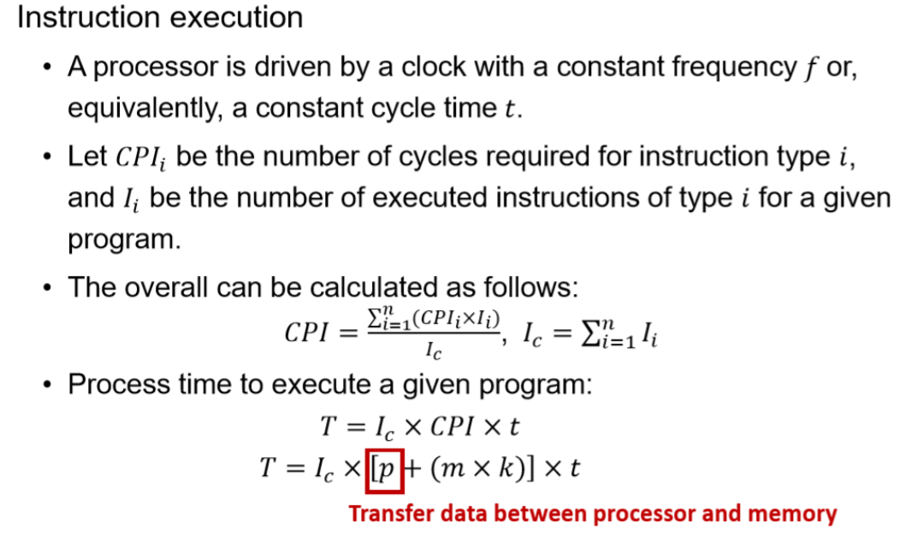\n\n\n\n

\n
  1. CPIi就是每一个具体指令的。
\n\n\n\n
  2. 在一个计算机，如果知道CPI,还知道Ic(指令个数),周期时间个数
\n\n\n\n
  3. 根据f可以得到t，而p是这个操作需要的数字。传输k次数据，每次需要m条指令。
\n\n\n\n
  4. 单条指令时间:CPIi*t
\n
\n\n\n\n

**MIPS计算**

\n\n\n\n

，每秒能够处理的百万条指令数，越大越好

\n\n\n\n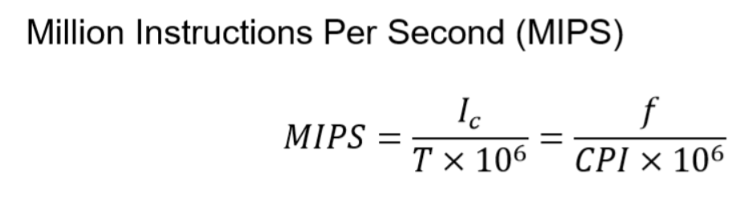\n\n\n\n

即指令条数(Ic)/时间（注意百万级别的转换）或者频率/CPI（频率为一秒多少个时钟周期，一般呈现为CPU时钟频率）

\n\n\n\n

有MFLOPS这个平衡（Million Floating Point Operations Per Second）

\n\n\n\n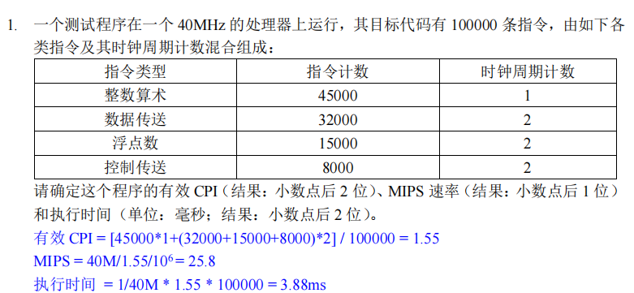\n\n\n\n

**Benchmarks**

\n\n\n\n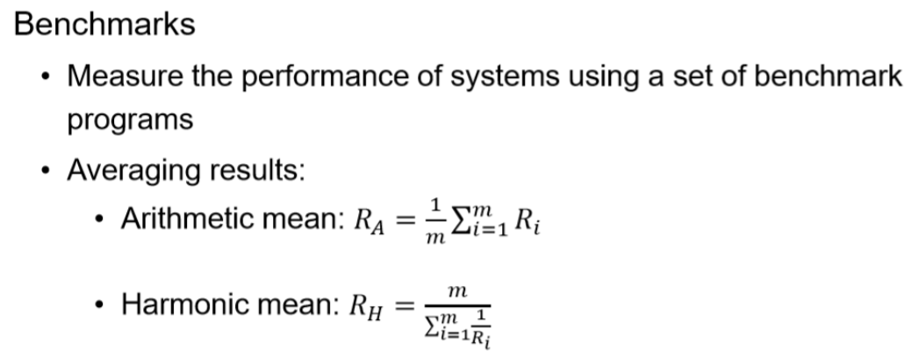\n\n\n\n

Ri:是第i个测试程序的高级语言指令的执行速度。

\n\n\n\n

4\. 【2010 统考真题】下列选项中，能缩短程序执行时间的措施是（ ）。

\n\n\n\n

I. 提高 CPU 时钟频率 II. 优化数据通路结构 III. 对程序进行编译优化

\n\n\n\n

A. 仅 I 和 II

\n\n\n\n

B. 仅 I 和 III

\n\n\n\n

C. 仅 II 和 III

\n\n\n\n

D. I、II、III

\n\n\n\n

D

\n\n\n\n

数据通路的功能是实现 CPU 内部的运算器和寄存器及寄存器之间的数据交换，优化数据通路结构，可以有效提高计算机系统的吞吐量，从而加快程序的执行，II 正确。

\n\n\n\n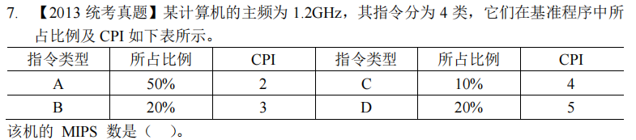\n\n\n\n

400

\n\n\n\n

基准程序的CPI = 2 × 0.5 + 3 × 0.2 + 4 × 0.1 + 5 × 0.2 = 3。计算机的主频为 1.2GHz,即 1200MHz，因此该机器的 MIPS = 1200/3 = 400。

\n\n\n\n

\n
  10. 【2020 统考真题】下列给出的部件中，其位数（宽度）一定与机器字长相同的是（ ）。  
I.ALU II.指令寄存器 III.通用寄存器 IV.浮点寄存器  
A. 仅 I、II  
B. 仅 I、III  
C. 仅 II、III  
D. 仅 II、III、IV  
B  

\n
\n\n\n\n

机器字长是指 CPU 内部用于整数运算的数据通路的宽度。CPU 内部数据通路是指 CPU内部的数据流经的路径及路径上的部件，主要是 CPU 内部进行数据运算、存储和传送的部件，这些部件的宽度基本上要一致才能相互匹配。因此，机器字长等于 CPU 内部用于整数运算的运算器位数和通用寄存器宽度。

\n\n\n\n

\n
  15. 【2009 统考真题】冯·诺伊曼计算机中指令和数据均以二进制形式存放在存储器中，CPU  
区分它们的依据是（ ）。  
A. 指令操作码的译码结果  
B. 指令和数据的寻址方式  
C. 指令周期的不同阶段  
D. 指令和数据所在的存储单元  
C  
指令周期中取指令和取数据是在不同阶段；指令和数据的存储位置、寻址方式是没有本  
质区别的。
\n
\n\n\n\n

## hw2（数据的二进制表示）

\n\n\n\n

整数类型:

\n\n\n\n

\n
  1. 无符号整数:0 - (2k-1)
\n\n\n\n
  2. 有符号整数:( - 2k-1 \- 2k-1-1)\n\n
     1. 原码、反码、补码
\n\n\n\n
     2. 原码和反码在进行加法运算时都会造成不必要的硬件需求，于是出现了补码
\n\n\n\n
     3. 二进制补码转换
\n\n\n\n
     4. 二进制-十进制转换
\n\n
\n
\n\n\n\n

数据移动

\n\n\n\n

\n
  1. 逻辑左移:右端补充0
\n\n\n\n
  2. 算术左移:右端补充0
\n\n\n\n
  3. 逻辑右移:左侧补充0
\n\n\n\n
  4. 算术右移:左侧补充符号位
\n
\n\n\n\n

浮点数操作

\n\n\n\n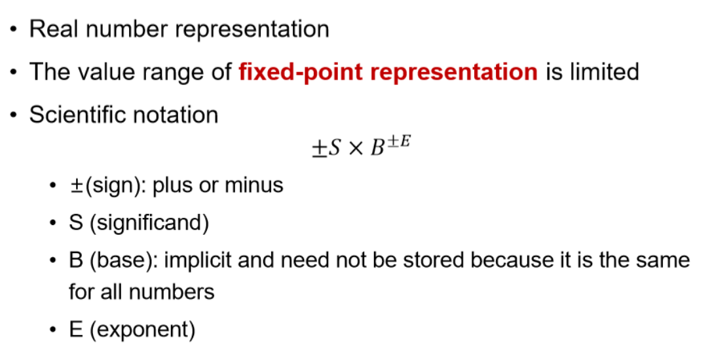\n\n\n\n

假定变量 int i = 1234567890、float f = 1.23456789e10，sizeof(int)=4，判断以下  
表达式的结果（True / False）：  
1) i == (int)(float)i；i == (int)(double)i  
False；True  

\n\n\n\n

第一个表达式：因为 IEEE754 的 float 类型中，尾数的小数部分只有 23 个二进位和一位隐藏位，共 24 位有效位数，理论上 float 的十进制有效位数为 7 位，而 i 中有 9 位十进制有效位，用二进制表示为 111010110111111000000111 110B，从二进制有效值的编码来看，将 i 转换为 float 类型时会发生 3 位有效数字的丢失，再转换为 int 类型时，其值无法还原了。  
第二个表达式：因为 IEEE754 的 double 类型中，尾数的小数部分有效位数为 52+1=53个二进位，而 int 类型的有效位数只有 31 个二进位，因此对于任何一个 int 类型的变量，转换为 double 后，其精度不会有损失，再转换回 int 类型时，其值不变。  
2) f == (float)(int)f；f == (float)(double)f  
False；True  
第一个表达式：第一个表达式：因为变量 f 的值超过了 int 类型可表示的最大值，因  
而将 f 转换为 int 类型后再转换回 float 类型时，其值已经改变了。  
第二个表达式：因为 double 类型的精度比 float 类型高，任何 float 类型的变量转换  
为 double 后再转换回 float 类型时，其值不变。

\n\n\n\n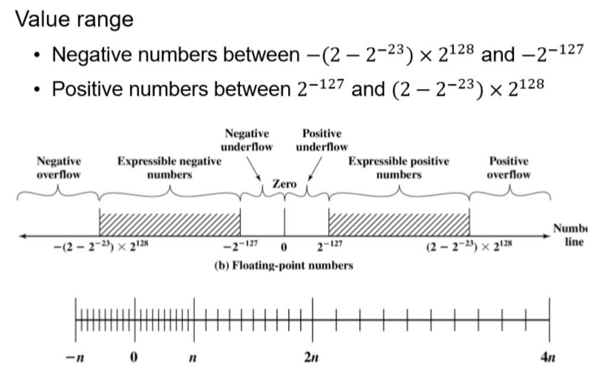\n\n\n\n

从运行结果来看，61.419998 和 61.420002 是两个可表示数，两者之间相差  
0.000004。当输入数据是一个不可表示数时，机器将其转换为最邻近的可表示数。  
因为 61 = 111101B = 1.11101B×25，如果将 float 型数据的规格化正数的表示范围  
以 2^i (-126≤i≤127) 为分割点划分成若干区间，61.419998 应该位于区间 [2^5，2^6]，  
该区间相邻可表示数之间的间隔为 2^-23 × 2^5 = 2^-18 = 0.0000038… ≈ 0.000004，  
从上述分析结果来看，该区间相邻两个可表示数之间的间隔就是 0.000004。因此，在  
61.419998 前面的可表示数为 61.419994，后面的可表示数为 61.420002。  
从直观的角度看，输入 61.419997 和 61.419999 时，其最靠近的可表示数为 61.419998；  
而 61.420001 的最邻近可表示数为 61.420002。  
但在特殊的中点值情况下，如输入为 61.42 时，十进制形式的 61.420000 位于可表  
示数 61.419998 和 61.420002 的中点。这时与机器的舍入机制有关，需要根据机器内部  
的二进制表示来判断。

\n\n\n\n

目前几乎所有机器中 float 型变量都是采用 IEEE754 单精度浮点数格式表示，其二进  
制有效位数为 24 位，因此能精确表示的十进制**有效位数为 6 位** ：  
对于题干中出现的例子，61.419998 位于区间 [2^5，2^6]，该区间相邻可表示数之间  
的间隔为 2^-23 × 2^5 = 2^-18 = 0.0000038…，间隔大小没有超过第 7 位有效数字。  
但对于某些特殊情况，区间内可表示数的间隔的值超过该指数区间的第 7 位有效数字时，则  
不能保证第 7 位精确表示。例如，9.007203e15 = 9007203e9 位于区间 [2^53，2^54]，该  
区间相邻可表示数之间的间隔为 2^-23 × 2^53 = 2^30 = 1.073741824e9，间隔超过了第  
七位有效数字。反映在二进制中时，该值的第 24 位为 0，因此后续的值被舍弃，于是出现  
了第 7 位有效数字不准确的情况。这种情况只会出现在两个可表示数的间隔大于第七位有  
效数字时，两个可表示数位于刚好四舍五入的左右两端，且小的可表示数更接近实际数字。

\n\n\n\n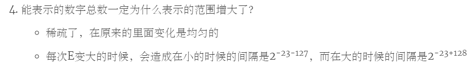\n\n\n\n

计算区间的间隔可以采用2^-23*2^c,c为当前区间左的数字

\n\n\n\n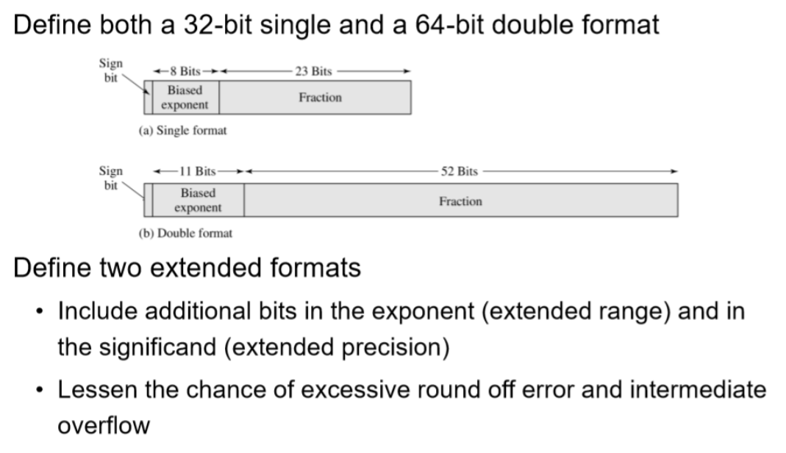\n\n\n\n

NBCD：

\n\n\n\n

符号位置:

\n\n\n\n

\n
  1. 1100是正号。或者0
\n\n\n\n
  2. 1101是负号。或者1
\n
\n\n\n\n

好处和优点:

\n\n\n\n

\n
  1. 十进制和BNCD的转换很自然很准确
\n\n\n\n
  2. 也支持小数，有几位也都可以
\n
\n\n\n\n\n
  5. 【2010 统考真题】假定变量 i、f 和 d 的数据类型分别为 int、float 和 double（int 用  
补码表示，float 和 double 分别用 IEEE 754 单精度和双精度浮点数格式表示），已知  
i=785、f=1.5678E3、d=1.5E100，若在 32 位机器中执行下列关系表达式，则结果为“真”  
的是（ ）。  
I.i==(int)(float)i；II.f==(float)(int)f；III.f==(float)(double)f；IV.(d+f)-  
d==f  
A.仅 I 和 II B.仅 I 和 III C.仅 II 和 III D.仅 III 和 IV  
B  
int 为 32 位，转化为 float 时只保存 1+23 位，有可能造成精度丢失；但由于 i<1024  
（10 位），此时精度无丢失，所以 I 正确。  
将 float 转换为 int 时，小数部分会被丢掉，因此 II 不正确。  
double 的表示范围大于 float，float 转化为 double 时不会有精度丢失，所以 III 正  
确。  
d+f 时需要对阶，造成 f 的精度丢失，因此 IV 不正确。
\n
\n\n\n\n\n
  6. 【2011 统考真题】float 型数据通常用 IEEE 754 单精度格式表示。若编译器将 float  
型变量 x 分配在一个 32 位浮点寄存器 FR1 中，且 x=-8.25，则 FR1 的内容是（ ）。  
A.C104 0000H B.C242 0000H C.C184 0000H D.C1C2 0000H  
A
\n
\n\n\n\n

X = -8.25 = -1000.01B = -1.0001B×2^3。根据 IEEE 754 表示，E = 3+127=130，转化为二进制为 10000010；尾数的最高位为隐藏位，因此为 00010…0。因此，FR1 的内容为：1 10000010 00010…0，转换为十六进制表示为 C104 0000H。

\n\n\n\n

\n
  8. 【2013 统考真题】某数采用 IEEE 754 单精度浮点数格式表示为 C640 0000H，则该数的  
值是（ ）。  
A.-1.5×2^13 B.-1.5×2^12 C.-0.5×2^13 D.-0.5×2^12  
A
\n
\n\n\n\n

该数的二进制表示为：1100 0110 0100 0000 0000 0000 0000 0000。因此，符号位为1；阶码为 10001100，真值为 13；尾数（含隐藏位）为 1.1B，即 1.5。所以该数的值为-1.5×2^13。

\n\n\n\n

\n
  13. 设某浮点数格式为：1 位数符、5 位阶码、6 位尾数。参照 IEEE754 浮点数的解释方式，  
写出：  
1) 规格化数的非零正数的最小值、最大值  
_2^-14 ~ (2-2^-6)_ 2^15  
2) 非规格化数的非零正数的最小值、最大值  
_2^-(14+6) ~ (1-2^-6)_ 2^-14  
3) 写出 9/16 的二进制表示。  
0011 1000 1000B  
9/16 = 0.1001B = 1.001 * 2^(-1)，符号位为 0，指数为-1，5 位阶码表示的指数偏置  
常数为 2^(5-1)-1 = 15，故移码表示为 -1 + 15 = 14 = 0 1110B，尾数部分为 00 1000B。
\n
\n\n\n\n\n
  14. 设一个变量的值为 2049，在程序中将其转换为 32 位整数补码、IEEE754 单精度浮点数  
格式并打印该变量（用二进制字符串表示），找出两种编码中表示有效值的二进制序列，  
并说明这段序列不同的原因及浮点数表示有效值的方式的优势。  

\n
\n\n\n\n

2049 = 1000 0000 0001B = +1.000 0000 0001B × 2^11  
32 位补码整数表示为 0000 0000 0000 0000 0000 1000 0000 0001B  
IEEE754 单精度浮点数格式表示为 0100 0101 0000 0000 0001 0000 0000 0000B  
上述两种表示中，存在相同的二进制序列 000 0000 0001。因为 2049 被转换为规格化浮点数后，有效值部分中最前面的 1 被隐藏，而 32 位补码整数中最前面的 1 没有被隐藏，所以除了这个 1 之后的二进制有效值序列是相同的。这意味着浮点数的尾数可表示的位数比实际编码多一位，因而使浮点数在相同有效值位数的情况下精度能够更高。

\n\n\n\n

## hw3（校验码）

\n\n\n\n

错误修正的基本观点

\n\n\n\n

\n
  1. Basic idea(基本观点)\n\n
     * Add some bits to store additional information for correction(添加一些位的数据来存储一些用于判断数据正误的额外信息)
\n\n
\n\n\n\n
  2. Process(过程)\n\n
     * Data in(输入): produce a 𝐾 bits code 𝐶 on the 𝑀 bits data 𝐷 with a function 𝑓(原始数据D，其长度M，对其应用方法f生成额外信息C,其长度为K位，然后我们存储D和C)
\n\n\n\n
     * Data out(输出): produce a new 𝐾 bits code 𝐶′′ on the data 𝐷′ with function 𝑓, and compare with the obtained 𝐾 bits code 𝐶′(根据新的取出来的D'，再次对其应用方法f得到新的额外信息C''，和**拿出来的** C'进行比较。)\n\n
       * No error detected: send **𝐷′**
\n\n\n\n
       * An error detected which can be corrected: correct it and send 𝐷''
\n\n\n\n
       * An error detected which cannot be corrected: report
\n\n
\n\n
\n
\n\n\n\n

**一旦存入C，拿出来的数据就是C'，而原来的C已经永远的消失了**

\n\n\n\n

\n
  * 为什么？因为如果能拿到原来的C，那么以上所有的事情都没有意义。
\n
\n\n\n\n

1.奇偶校验——用一位额外位来表示这个数据中1是奇数个还是偶数个

\n\n\n\n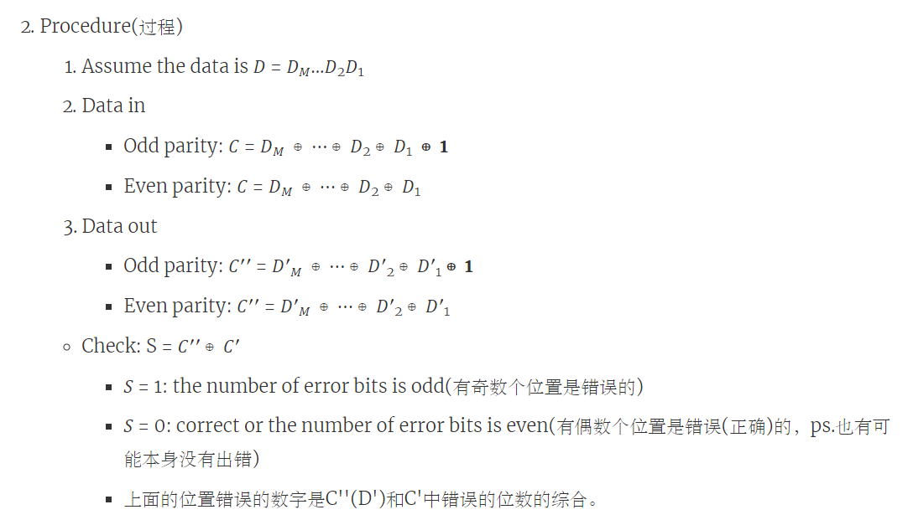\n\n\n\n

Disadvantage(奇偶校验法的缺点)

\n\n\n\n

\n
  * Cannot find the errors when the number of error bits is even(如果错误的位数是偶数的话，我们是无法发现错误的)
\n\n\n\n
  * Cannot be used for correction(只能检验出来哪里有错误，不能确定具体错误的是哪一位)
\n\n\n\n
  * Suitable to check one byte data(相对比较适合检验一字节的数据)
\n
\n\n\n\n

Advantage(奇偶校验法的优点):Low cost

\n\n\n\n

2.海明码（Hamming Code）

\n\n\n\n

\n
  1. Basic idea(基本思想)\n\n
     * Divide the bits into several groups, and use parity check code on each group for error correction(我们将数据分成很多组，对于每一组使用检查正误的奇偶校验码)
\n\n
\n\n\n\n
  2. Procedure\n\n
     1. Divide the 𝑀 bits into 𝐾 groups(将M位数据划分成K个组)
\n\n\n\n
     2. Data in: produce one bit for each group, and get a 𝐾 bits code(对于每一个分组生成一个奇偶校验码，一共获得了K个奇偶校验码)
\n\n\n\n
     3. Data out: produce one bit for each group, and get a new 𝐾 bits code(根据当前每一组的数据获得新的一位奇偶校验码，获得一个新的K位的奇偶校验码)
\n\n\n\n
     4. Check: produce 𝐾 bits code for fetched data, take the exclusive-OR of each bit of the produced code and fetched code, and produce 𝐾 bits syndrome word(根据取得的数据生成的K位的奇偶校验码，我们对取出来的奇偶校验码和刚生成的奇偶校验码进行异或操作，生成一个K位的**故障字**)
\n\n
\n\n\n\n
  3. 优点:既可以见检查错误，也可以定位错误位置。
\n
\n\n\n\n

海明码是一种多重奇偶校验码，它通过在数据位之间插入多个校验位来扩大码距，实现对数据编码的检错和纠错。海明码是基于偶校验的，每个校验位都对应一组数据位，这些数据位的位置是校验位的二进制表示中包含 1 的位数。例如，校验位 P1 对应的数据位是 H3, H5, H7, H9, …，因为这些位置的二进制表示中都有第 1 位为 1。校验位的值是通过对它所对应的数据位进行异或运算得到的，使得每一组校验位和数据位中 1 的个数为偶数。当接收到编码数据时，可以通过对每一组校验位和数据位再次进行异或运算，得到一个错误向量，这个错误向量的二进制表示就是出错的位置。如果错误向量为 0，说明没有错误；如果错误向量不为 0，说明有一位错误，可以通过取反来纠正。如果有两位或以上的错误，海明码无法纠正，只能检测出错误。

\n\n\n\n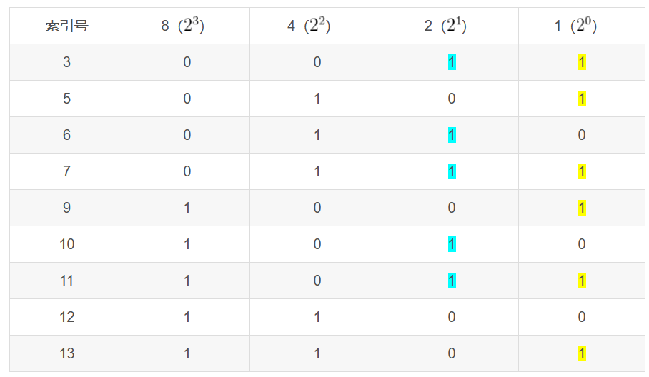\n\n\n\n

（该图为所需的索引表）

\n\n\n\n

下面是一个例子，假设数据为 01101001，需要编码成海明码：

\n\n\n\n

\n
  * 首先，根据公式 2^k − 1 ≥ n + k，确定校验位的个数，这里 n = 8，k = 4，总共 12 位。
\n\n\n\n
  * 然后，确定校验位的位置，这里是第 1, 2, 4, 8 位，其他位是数据位。
\n\n\n\n
  * 接着，确定校验关系，根据校验位的二进制表示，可以得到如下的表格：
\n
\n\n\n\n校验位| 数据位  
---|---  
P1| H3 H5 H7 H9 H11  
P2| H3 H6 H7 H10 H11  
P4| H5 H6 H7 H12  
P8| H9 H10 H11 H12  
\n\n\n\n

\n
  * 然后，计算校验位的值，通过对每一组数据位进行异或运算，得到如下的结果：
\n
\n\n\n\n校验位| 数据位| 值  
---|---|---  
P1| 10101| 0  
P2| 11011| 1  
P4| 1001| 1  
P8| 0000| 0  
\n\n\n\n

\n
  * 最后，将校验位和数据位组合起来，得到海明码为 011010001001。
\n
\n\n\n\n

如果接收到的海明码为 011010001011，可以通过以下步骤进行检错和纠错：

\n\n\n\n

\n
  * 首先，对每一组校验位和数据位进行异或运算，得到如下的结果：
\n
\n\n\n\n校验位| 数据位| 值  
---|---|---  
P1| 10111| 1  
P2| 11011| 1  
P4| 1001| 1  
P8| 0011| 1  
\n\n\n\n

\n
  * 然后，将这些结果组合起来，得到错误向量为 1111，这个二进制表示就是出错的位置，也就是第 15 位。
\n\n\n\n
  * 接着，将第 15 位取反，得到正确的海明码为 011010001001。
\n\n\n\n
  * 最后，去掉校验位，得到原始数据为 01101001。
\n
\n\n\n\n

再举一个例子

\n\n\n\n

我们假设有一个8位数据为01101010，我们使用偶校验生成汉明码

\n\n\n\n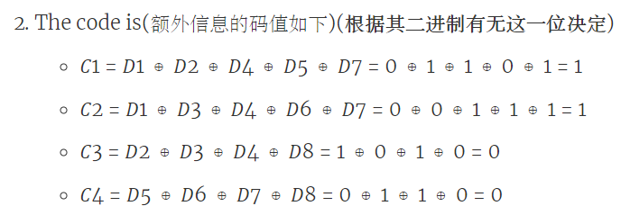\n\n\n\n

The 12 bits content when store 0110**0** 101**0** 0**1** 1

\n\n\n\n

\n
  * 所以我们的额外信息并不是随意加入到校验信息的后面的，而是加入到之前的对应表上的对应位置上，从而有力的保证了确定问题位置
\n\n\n\n
  * 注意插入的应该是指定的位置
\n
\n\n\n\n

2.一个 8 位字 00111001，采用海明码生成校验位后存储。假定由存储器读出数据时，计算出的校验位是 1101，那么由存储器读出的数据字是什么？（示例：00000000）

\n\n\n\n

**00011001**

\n\n\n\n

假设采用偶校验，00111001 计算出的校验码为 0111（方法见题 1），而读出的校验码为 1101。因此，数据字读出时发生了错误，而校验码读出时没有发生错误（这建立在最多只有一位发生错误的假设上）。计算出故障字为 0111⊕1101=1010。可见是第 10 位（D6）出错。原先的数据字为 00111001，所以读出的数据字为 00011001。

\n\n\n\n

注：本题也可以假设采用奇校验。

\n\n\n\n

4.某计算机在信息传输中采用基于偶校验的海明码，对每个字节生成校验位。假设所传输

\n\n\n\n

信息的十六进制表示为 8F3CAB96H，且将信息与校验码按照故障字的顺序排列后一起传

\n\n\n\n

输。如果传输中没有发生任何错误，写出所接收到信息（含校验码）的十六进制表示。

\n\n\n\n

示例：FFFFFFFFFFFFH

\n\n\n\n

**8F7362A5F93AH**

\n\n\n\n

根据海明码的计算规则：

\n\n\n\n

C1 = D1 ⊕ D2 ⊕ D4 ⊕ D5 ⊕ D7

\n\n\n\n

C2 = D1 ⊕ D3 ⊕ D4 ⊕ D6 ⊕ D7

\n\n\n\n

C3 = D2 ⊕ D3 ⊕ D4 ⊕ D8

\n\n\n\n

C4 = D5 ⊕ D6 ⊕ D7 ⊕ D8

\n\n\n\n

对各个字节计算出校验码：

\n\n\n\n

8FH = 1000 1111B，校验码（C4C3C2C1）为 1011

\n\n\n\n

3CH = 0011 1100B，校验码（C4C3C2C1）为 0010

\n\n\n\n

ABH = 1010 1011B，校验码（C4C3C2C1）为 0111

\n\n\n\n

96H = 1001 0110B，校验码（C4C3C2C1）为 0110

\n\n\n\n

所以，将信息和校验码按照故障字的顺序排列后的二进制表示为：

\n\n\n\n

1000 1111 0111 0011 0110 0010 1010 0101 1111 1001 0011 1010

\n\n\n\n

十六进制表示为：8F7362A5F93AH

\n\n\n\n

3.CRC(Cyclic Redundancy Check循环冗余校验码)

\n\n\n\n

3.2.1. CRC的特点

\n\n\n\n

\n
  1. Suitable for storing and transmitting large size data in stream format(适合以流格式存储和传输大数据)
\n\n\n\n
  2. Generate the relationship between data and check code with mathematic function(用数学函数生成数据与校验码之间的关系)
\n
\n\n\n\n

我们假设数据一共n位，左移数据k位，然后我们用之后的结果除以k+1位的生成多项式  
使用k位余数作为校验码  
将校验码放到数据的后面，然后作为整个数据传入到存储器中去

\n\n\n\n

5.假设要传送的数据信息为 100011，若约定的生成多项式位𝐺(𝑥) = 𝑥3 + 1。如果传输中没

\n\n\n\n

有出现错误，接收到的信息是什么？

\n\n\n\n

示例：000000000

\n\n\n\n

**100011111**

\n\n\n\n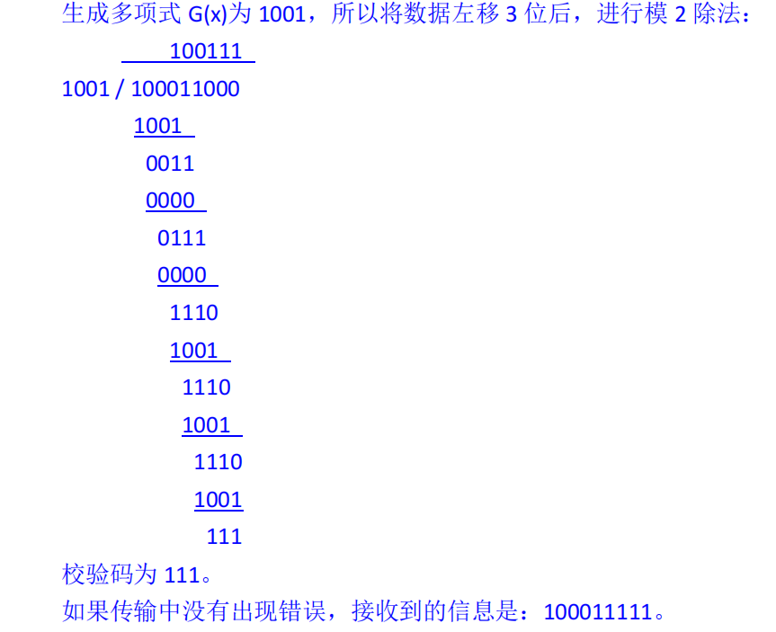\n\n\n\n

## hw4

\n\n\n\n

加法器：

\n\n\n\n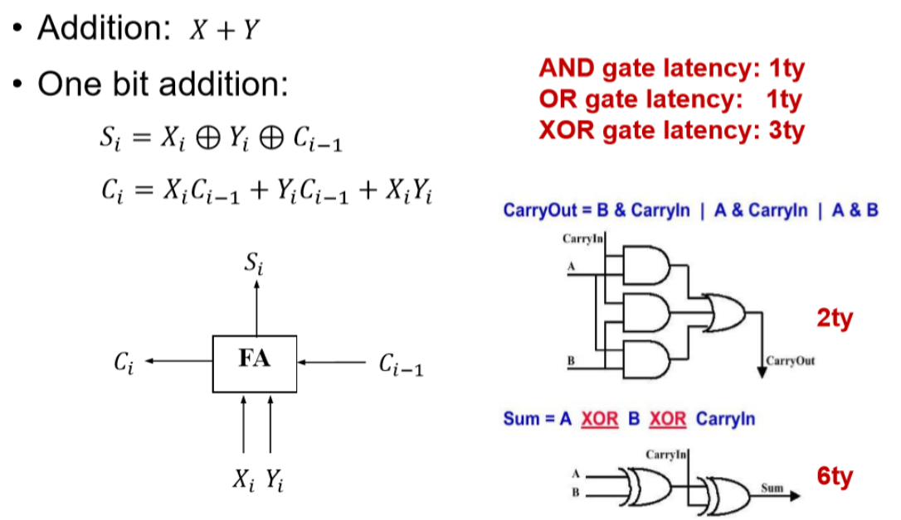\n\n\n\n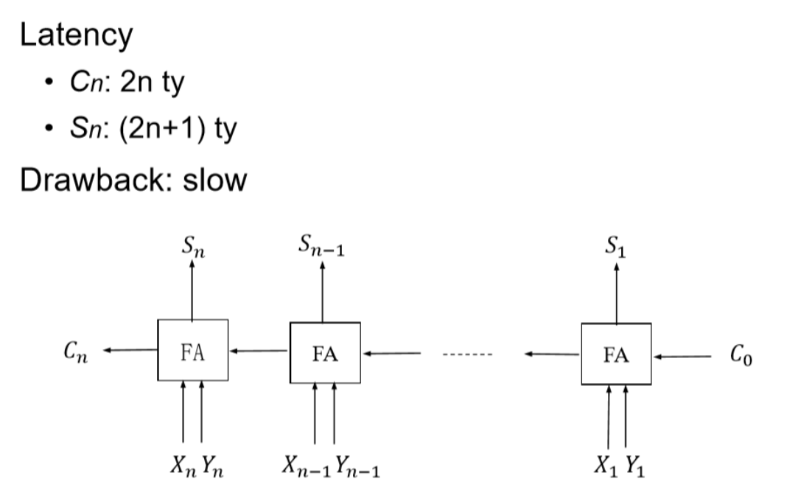\n\n\n\n

\n
  1. 速度比较慢。
\n\n\n\n
  2. 和数据量成线性相关。
\n
\n\n\n\n

Solution——先行记录加法器

\n\n\n\n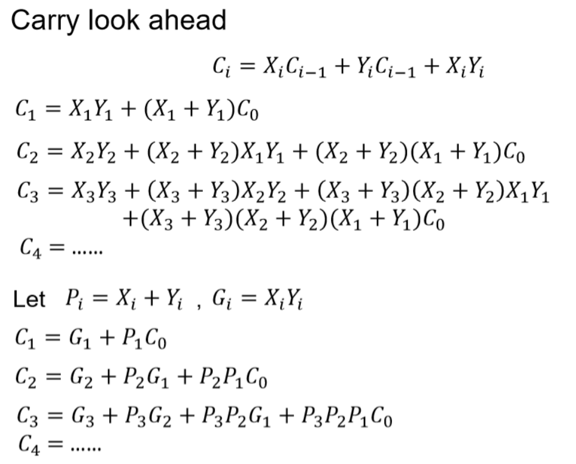\n\n\n\n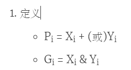\n\n\n\n

新的计算方法:(并行运算)

\n\n\n\n

\n
  * 所有的Pi、Gi都是可以同时计算的，代价是:1ty
\n\n\n\n
  * 求出所有的Ci，代价:2ty\n\n
    * 先计算所有的与，多个与也可以一次计算
\n\n\n\n
    * 再计算所有的或，一次计算。
\n\n
\n\n\n\n
  * 求出所有的Si，代价:3ty\n\n
    * 就是原来的异或。只需要再做一次就可以
\n\n
\n
\n\n\n\n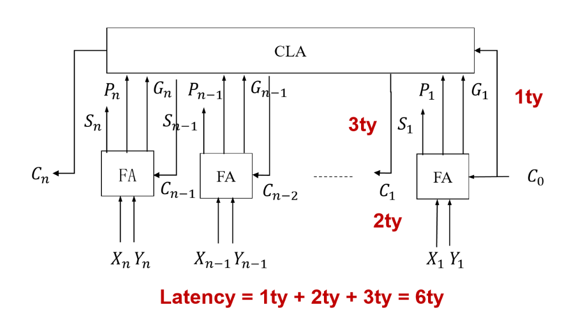\n\n\n\n

但是计算电路过于复杂

\n\n\n\n

进一步的解决方法:部分先行加法器

\n\n\n\n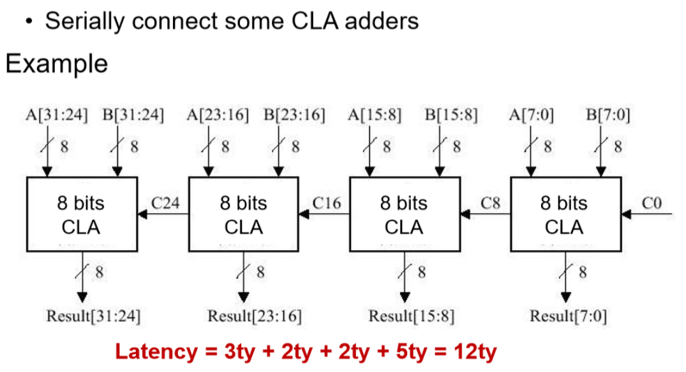\n\n\n\n

【最有道理的一集】

\n\n\n\n

\n
  1. 最后算出的是最前面的加法部分
\n\n\n\n
  2. 最左边是3 = 1 + 2
\n\n\n\n
  3. 然后中间两个+2:之前P和G都算好了。
\n\n\n\n
  4. 最后一步5 = 2 + 3\n\n
     * P和G已经算好了
\n\n
\n\n\n\n
  5. **多一个加2**
\n
\n\n\n\n

宏观视野的加法

\n\n\n\n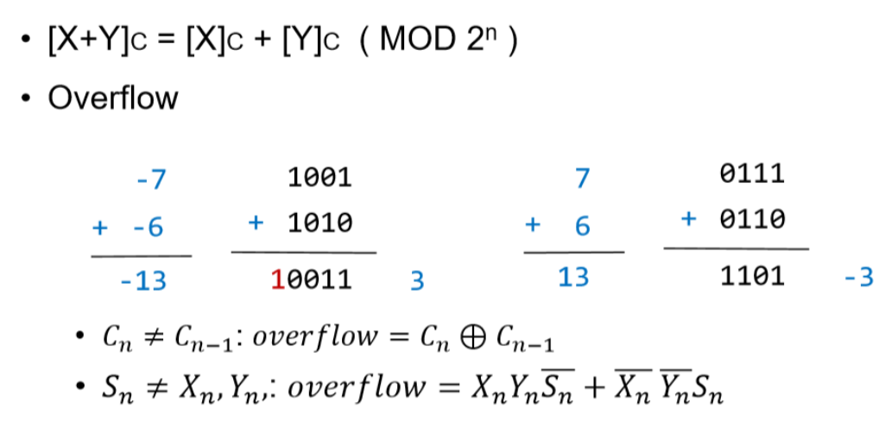\n\n\n\n

判定溢出的办法：

\n\n\n\n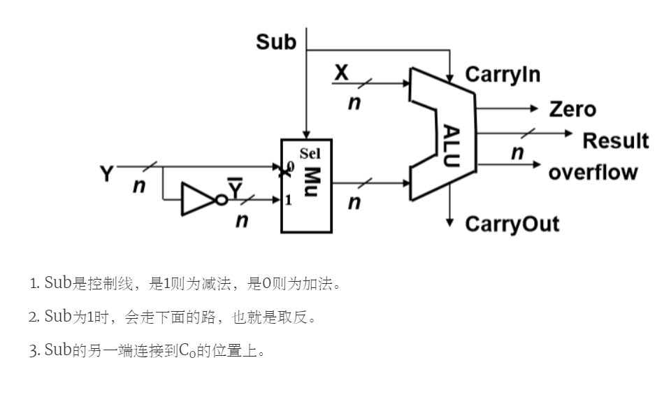\n\n\n\n

\n\n\n\n

6\. 【2016 统考真题】有如下 C 语言程序段：

\n\n\n\n

short si= -32767;

\n\n\n\n

unsigned short usi = si;

\n\n\n\n

执行上述两条语句后，usi 的值为（ ）。

\n\n\n\n

A. -32767

\n\n\n\n

B. 32767

\n\n\n\n

C. 32768

\n\n\n\n

D. 32769

\n\n\n\n

D

\n\n\n\n

因 c 语言中的数据在内存中为补码表示形式， si 对应的补码二进制表示为 1000 00000000 0001B，最前面的一位“1”为符号位，表示负数，即-32767。由 signed 型转化为等长的unsigned 型数据时，符号位成为数据的一部分，即负数转化为无符号数（即正数）时，其数值将发生变化。usi 对应的补码二进制表示与 si 的表示相同，但表示正数，为 32769。

\n\n\n\n

\n
  10. 【2019 统考真题】考虑以下 C 语言代码：  
unsigned short usi = 65535;  
short si= usi;  
执行上述程序段后，si 的值是（ ）。  
A -1  
B -32767  
C -32768  
D -65535  
A  
unsigned short 类型为无符号短整型，长度为 2 字节，因此 unsigned short usi 转换为二进  
制代码即 1111 1111 1111 1111。short 类型为短整型，长度为 2 字节，在采用补码的机器上，  
short si 的二进制代码为 1111 1111 1111 1111，因此 si 的值为-1，所以选 A。
\n
\n\n\n\n\n
  12. 【2015 统考真题】下列有关浮点数加减运算的叙述中，正确的是（ ）。  
Ⅰ. 对阶操作不会引起阶码上溢或下溢  
Ⅱ. 右规和尾数舍入都可能引起阶码上溢  
Ⅲ. 左规时可能引起阶码下溢  
Ⅳ. 尾数溢出时结果不一定溢出  
A. 仅Ⅱ、Ⅲ B. 仅Ⅰ、Ⅱ、IV C. 仅Ⅰ、Ⅲ、Ⅳ D. Ⅰ、Ⅱ、Ⅲ、Ⅳ
\n
\n\n\n\n

D

\n\n\n\n

对阶是较小的阶码对齐至较大的阶码，Ⅰ正确。右规和尾数舍入过程，阶码加 1 而可能上溢，Ⅱ正确，同理Ⅲ也正确。尾数溢出时可能仅产生误差，结果不一定溢出，Ⅳ正确。

\n\n\n\n

\n
  * 可能导致溢出的情况：即所有涉及阶码运算的情况\n\n
    * 右规和尾数舍入：一个数值很大的尾数舍入时，可能因为末位+1而发生尾数溢出，此时就需要调整尾数和阶码（尾数右规、阶码+1）。若调整前或后阶码全为1，则直接置结果为指数上溢；否则正常
\n\n\n\n
    * 左规（即会导致指数下溢）：左规时阶码减小，故需判断是否发生指数下溢。判断规则就是看阶码是否为全0（这里有两种说法，一种是阶码全0就判断为下溢（IEEE规格化），一种是指数超过最小允许值-149（-126-23）才判断下溢（IEEE非规格化小数），如果没表示的话应该按照第一种全0说法）
\n\n
\n
\n\n\n\n\n
  13. 【2011 统考真题】假定在一个 8 位字长的计算机中运行如下 C 程序段:  
unsigned int x=134;  
unsigned int y=246;  
int m=x;  
int n=y;  
unsigned int z1=x-y;  
unsigned int z2=x+y;  
int k1=m-n;  
int k2=m+n;  
若编译器编译时将 8 个 8 位寄存器 R1~R8 分别分配给变量 x、y\\\m、n、z1、k1 和 k2。  
请回答下列问题（提示：有符号整数用补码表示）。  
1）执行上述程序段后，寄存器 R1、R5 和 R6 的内容分别是什么（用十六进制表示）？  
2）执行上述程序段后，变量 m 和 k1 的值分别是多少（用十进制表示）？  
3）上述程序段涉及有符号整数加减、无符号整数加减运算，这四种运算能否利用同一  
个加法器辅助电路实现？简述理由。  
4）计算机内部如何判断有符号整数加减运算的结果是否发生溢出？上述程序段中，哪  
些有符号整数运算语句的执行结果会发生溢出？  

\n
\n\n\n\n

1) 134 = 128 + 6 = 1000 0110B，所以 x 的机器数为 1000 0110B，因此 R1 的内容为  
86H。246 = 255 - 9 = 1111 0110B，所以 y 的机器数为 1111 0110B，x - y = 1000 0110 + 00001010 = (0)1001 0000，括号中为加法器的进位，因此 R5 的内容为 90H。x + y = 1000 0110 +1111 0110 = (1)0111 1100，括号中为加法器的进位，因此 R6 的内容为 7CH。  
2) m 的机器数与 x 的机器数相同，皆为 86H = 1000 0110B，解释为有符号整数 m（用补码表示）时，其值为-111 1010B = -122。m - n 的机器数与 x - y 的机器数相同，皆为 90H= 1001 0000B，解释为有符号整数 k1（用补码表示）时，其值为-111 0000B = -112。  
3) 能。n 位加法器实现的是模 2n 无符号整数加法运算。对于无符号整数 a 和 b，a + b可以直接用加法器实现，而 a - b 可用 a 加 b 的补数实现，即 a - b = a + [-b]补（mod 2n），所以 n 位无符号整数加减运算都可在 n 位加法器中实现。由于有符号整数用补码表示，补码加减运算公式为[a + b]补 = [a]补 + [b]补（mod 2n），[a - b]补 = [a]补 + [-b]补（mod 2n），所以 n 位有符号整数加减运算都可在 n 位加法器中实现。  
4) 有符号整数加减运算的溢出判断规则为：**若加法器的两个输入端（加法）的符号相同，且不同于输出端（和）的符号，则结果溢出，或加法器完成加法操作时，若次高位（最高数位）的进位和最高位（符号位）的进位不同，则结果溢出** 。最后一条语句执行时会发生溢出。因为 1000 0110 + 1111 0110 = (1)0111 1100，括号中为加法器的进位，根据上述溢出判断规则可知结果溢出。或者，因为 2 个带符号整数均为负数，它们相加之后，结果小于 8 位进制所能表示的最小负数

\n\n\n\n

## hw11&10（控制、总线与I/O）

\n\n\n\n

为什么不能把外设直接连接到系统总线上

\n\n\n\n

\n
  * 外设种类繁多，操作方法多种多样
\n\n\n\n
  * 外设的数据传送速度一般比存储器或处理器的慢得多
\n\n\n\n
  * 某些外设的数据传送速度比存储器或处理器要快
\n\n\n\n
  * 外设使用的数据格式和字长度通常与处理器不同
\n
\n\n\n\n\n
  * 与设备相关的控制逻辑控制外设的  
操作，以响应来自输入/输出模块  
的命令
\n\n\n\n
  * 缓冲器用于缓存输入/输出模块和  
外设之间传送的数据
\n
\n\n\n\n

I/O模块的功能

\n\n\n\n

\n
  * 处理器通信\n\n
    * 命令译码：输入/输出模块接收来自处理器的命令，这些命令一般  
作为信号发送到控制总线
\n\n\n\n
    * 数据：数据是在处理器和输入/输出模块之间经由数据总线来交换  
的
\n\n\n\n
    * 状态报告：由于外设速度很慢, 所以知道输入/输出模块的状态很重  
要
\n\n\n\n
    * 地址识别：输入/输出模块必须能识别它所控制的每个外设的唯一  
地址
\n\n
\n\n\n\n
  * 设备通信\n\n
    * 通信内容包含命令、状态信息和数据
\n\n
\n
\n\n\n\n

**Device communication 设备交互**

\n\n\n\n

> \n
> 
> 涉及以下三种
> 
> \n

\n\n\n\n

\n
  1. commands 命令
\n\n\n\n
  2. status information 状态信息
\n\n\n\n
  3. data 数据
\n
\n\n\n\n

Example: transfer of data from external device to processor 示例：将数据从外部设备传输到处理器

\n\n\n\n

\n
  1. Processor interrogates I/O module to check the device status 处理器询问I/O模块以检查设备状态
\n\n\n\n
  2. I/O module returns the device status I/O模块返回设备状态
\n\n\n\n
  3. If prepared, processor requests the transfer of data, by means of a command to I/O module 如果准备好了，处理器通过命令向I/O模块请求数据传输
\n\n\n\n
  4. I/O module obtains a unit of data from the external device I/O模块从外部设备获取数据单位
\n\n\n\n
  5. Data are transferred from I/O module to processor 数据从I/O模块传输到处理器
\n
\n\n\n\n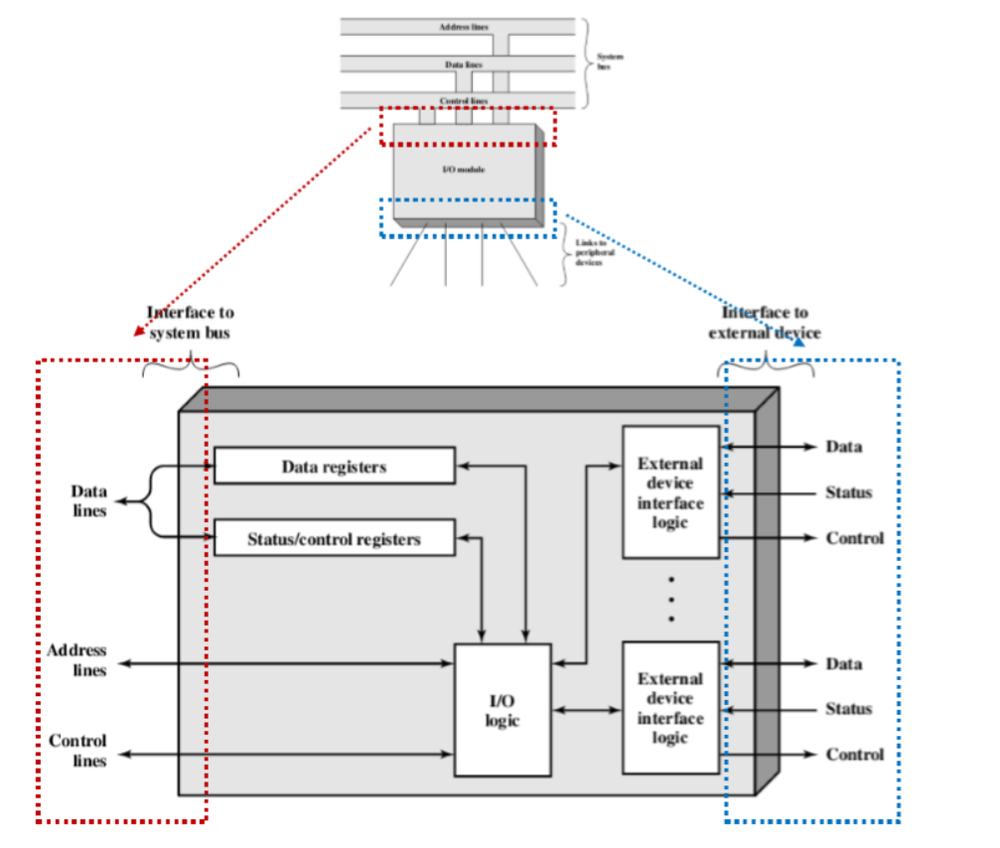\n\n\n\n

并行接口

\n\n\n\n

有多条线路连接I/O模块和外围设备，同时传输多个位，就像一个字的所有位通过数据总线同时传输一样

\n\n\n\n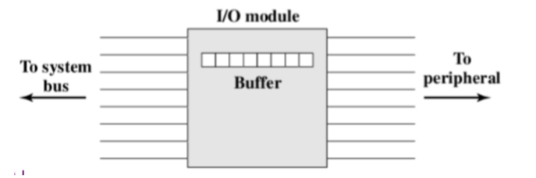\n\n\n\n

串行接口

\n\n\n\n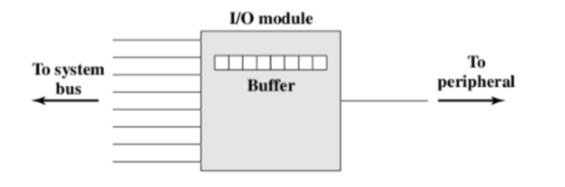\n\n\n\n

为什么目前多用**串行总线** ？

\n\n\n\n

\n
  1. 并行总线对于时钟要求高，并且数据线长度不能太长。时钟漂移(时间对不齐会出问题)带来问题
\n\n\n\n
  2. 便宜:如果使用并行总线，那么每根线之间需要防止串线。
\n
\n\n\n\n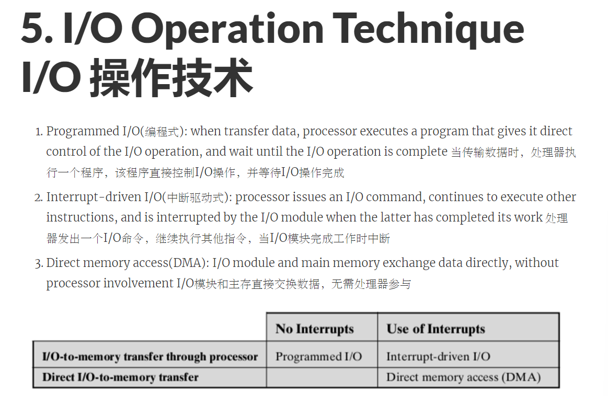\n\n\n\n

-编程式IO：处理器执行一个程序并且遇到一个跟IO有关的指令是，需要通过适当的IO模块发出一个命令来执行该指令

\n\n\n\n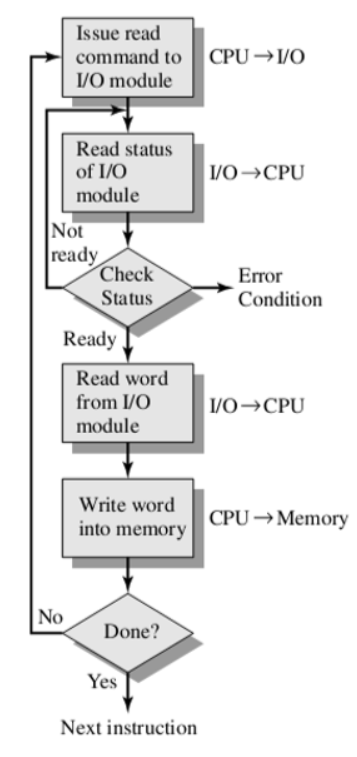\n\n\n\n

问题:只要有I/O操作，cpu就**一直要忙** ，过程参考右侧小字

\n\n\n\n

\n
  * 也就是意味着I/O占用率会比较高
\n
\n\n\n\n

I/O Command I/O命令

\n\n\n\n

为了执行与I/O相关的指令，处理器发出一个地址，指定特定的I/O模块和外部设备，以及一个I/O命令

\n\n\n\n

Type

\n\n\n\n

\n
  1. Control: activate a peripheral and tell it what to do 控制：激活外设并告诉它该做什么
\n\n\n\n
  2. Test: test various status conditions associated with an I/O module and its peripherals 测试：测试与I/O模块及其外围设备相关的各种状态条件
\n\n\n\n
  3. Read: cause I/O module to obtain an item of data from the peripheral and place it in an internal buffer 读取：使I/O模块从外设获取一项数据并将其放入内部缓冲区
\n\n\n\n
  4. Write: cause the I/O module to take an item of data from the data bus and subsequently transmit that data item to the peripheral 写入：使I/O模块从数据总线获取一项数据，然后将该数据项传输到外围设备
\n
\n\n\n\n

I/O Instruction I/O指令

\n\n\n\n

指令很容易映射到I/O命令中，并且通常有一个简单的一对一关系。指令的形式取决于外部设备的寻址方式

\n\n\n\n

**和I/O相关的指令是I/O指令，I/O命令一般对应一个I/O指令，I/O命令比I/O指令少一个地**

\n\n\n\n

中断式I/O（DMA）

\n\n\n\n

\n
  1. Processor issues an I/O command to a module and then go on to do some other useful work 处理器向一个模块发出一个I/O命令，然后继续做一些其他有用的工作
\n\n\n\n
  2. I/O module interrupts the processor to request service, when it is ready to exchange data with the processor 当处理器准备好与处理器交换数据时，I/O模块中断处理器以请求服务
\n\n\n\n
  3. Processor executes data transfer, and then resumes its former processing 处理器执行数据传输，然后恢复以前的处理
\n
\n\n\n\n

### 5.2.2. View point of processor 从处理器角度

\n\n\n\n

\n
  1. Processor issues a READ command 处理器发出读取命令
\n\n\n\n
  2. Processor goes off and does something else, and checks for interrupts at the end of each instruction cycle 处理器关闭并执行其他操作，并在每个指令周期结束时检查中断
\n\n\n\n
  3. When the interrupt from I/O module occurs, processor saves the context of the current program 当I/O模块发生中断时，**处理器保存当前程序的上下文**
\n\n\n\n
  4. Processor reads the word of data from I/O module and stores it in memory 处理器从I/O模块读取数据字并将其存储在存储器中
\n\n\n\n
  5. Processor restores the context of the program it was working on (or some other program) and resumes execution 处理器恢复正在运行的程序(或其他程序)的上下文并继续执行
\n
\n\n\n\n

开关中断（即屏蔽一些中断）

\n\n\n\n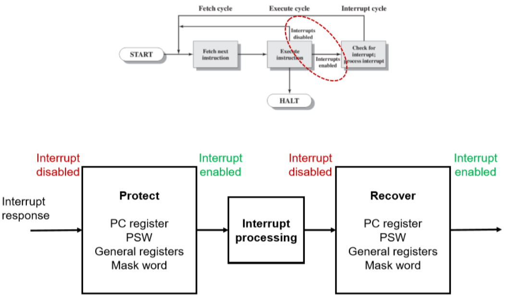\n\n\n\n

\n
  1. 为什么要有从Execute instruction到前面的箭头?\n\n
     * 因为有开关中断:也就是说这个时候的终端未必可以被响应
\n\n
\n\n\n\n
  2. 中断要把所有的上下文环境放置到栈中。
\n\n\n\n
  3. 为什么会有开关中断?\n\n
     * 因为有些操作不可以被打断，比如绿字中的部分不可以被关闭:比如有些正在处理中关于数据读取等操作不可以被直接打断。
\n\n
\n
\n\n\n\n

Response Priority and Processing Priority 响应优先级以及处理优先级

\n\n\n\n

\n
  1. 例子如下：
\n\n\n\n
  2. Assume there are 4 interrupt sources in an interrupt system, whose **response priorities** are L1>L2>L3>L4 and **processing priorities** are L1>L4>L3>L2. If the L1, L3 and L4 interrupts occur at the same time when the main program executes, and L2 interrupt occurs in the procedure of processing L3 interrupt, write the **mask words(屏蔽字)** and the procedure of all interrupt service programs. 我们假设在中断系统中一共有4种终端设备，他们的响应优先级为L1>L2>L3>L4，并且处理优先级为L1>L4>L3>L2,假设L1、L3、L4在主程序运行的时候同时发生了中断请求，而L2的中断请求发生在处理L3中断的时候，请写出当前中断处理程序的过程以及屏蔽字。
\n
\n\n\n\n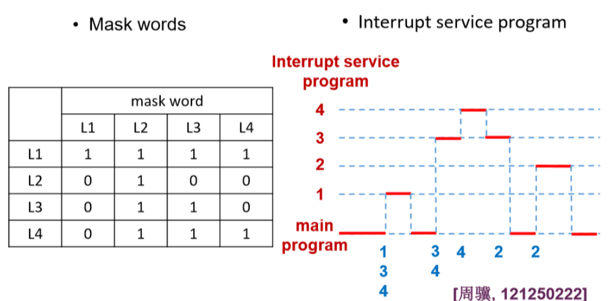\n\n\n\n

\n
  3. 屏蔽字是由处理优先级来进行处理的\n\n
     * 每一个都能屏蔽自己:因为处理优先级不高所以可以屏蔽自己
\n\n\n\n
     * 如上的屏蔽字中，行屏蔽列
\n\n
\n\n\n\n
  4. 例子:抢座位，年轻人先抢到**坐下**(响应优先级高),老太太比较慢(响应优先级低)，但是处理优先级高，所以年轻人会站起来，把座位留给老太太\n\n
     * 所以年轻人代表的程序段在栈中留下了痕迹，意味着这部分程序段并没有出栈，而仅仅是在栈中还没被处理
\n\n
\n\n\n\n
  5. 第二个原则:从哪里来到哪里去，先回到主程序。
\n\n\n\n
  6. 考试的话:要写好每一个步骤，算分从第一个错误的开始算。
\n
\n\n\n\n

[中断](<https://so.csdn.net/so/search?q=%E4%B8%AD%E6%96%AD&spm=1001.2101.3001.7020>)响应优先级是针对同时到达的中断请求先处理谁的规定。比如A、B同时向CPU发出中断请求，而中断响应优先级是A>B，那么CPU就会先处理A，再处理B。

\n\n\n\n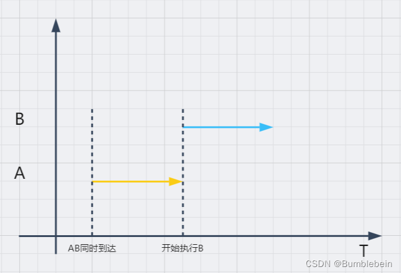\n\n\n\n

中断处理[优先级](<https://so.csdn.net/so/search?q=%E4%BC%98%E5%85%88%E7%BA%A7&spm=1001.2101.3001.7020>)是解决中断嵌套情况下优先处理谁的问题。比如A、B两个中断的中断处理优先级是B>A，如果当CPU正在处理中断请求A时，B向CPU发送了中断请求，那么CPU会先暂停处理A，转而处理B，B结束后再继续处理A。

\n\n\n\n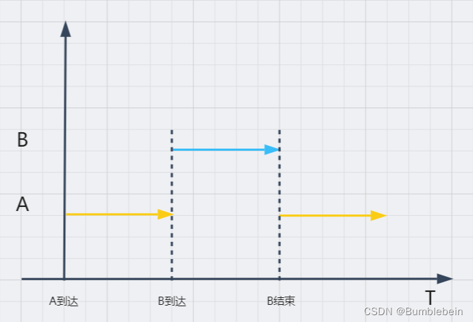\n\n\n\n

在同一个系统中中断响应优先级A>B和中断处理优先级B>A是不冲突的。因为它们针对的情况不可能同时发生，A、B同时到达由中断响应优先级决定先执行谁，A、B不同时到达在发生中断嵌套时由中断处理优先级决定先执行谁。

\n\n\n\n

DMA读取全流程：

\n\n\n\n

处理器通过发送以下信息向DMA模块发出命令：读/写、I/O设备地址、内存中的起始位置、字数  
处理器继续其他工作，从而保证了处理器可以被相对更少的占用。  
DMA模块在不经过处理器的情况下，将**整个数据块一次一个字** 直接传送到存储器或从存储器中传送出去  
当传输完成时，DMA模块向处理器发送一个中断信号  

\n\n\n\n

在这个过程中，CPU和DMA会访问内存，这时候会出现冲突。CPU和DMA发生冲突时，**DMA优先级高**

\n\n\n\n

\n
  * 因为DMA连接的是比较高速的I/O设备，如果不及时相应，则容易**数据溢出** 。
\n
\n\n\n\n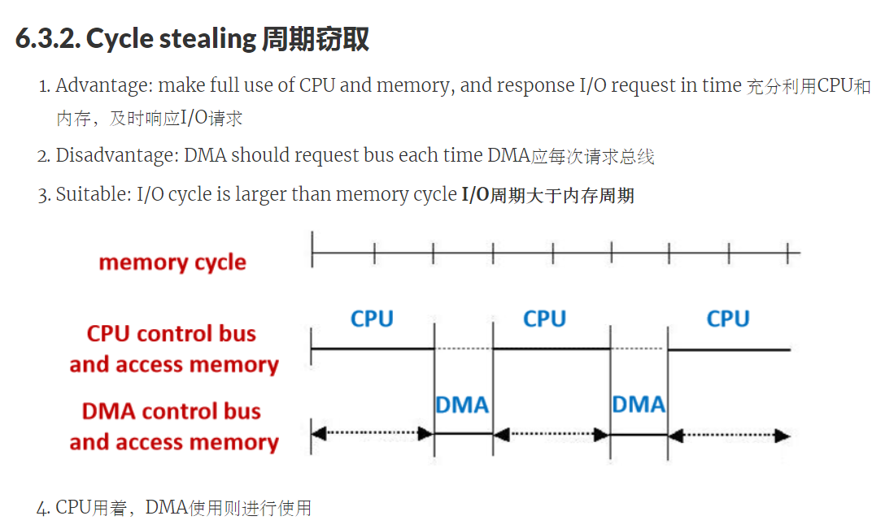\n\n\n\n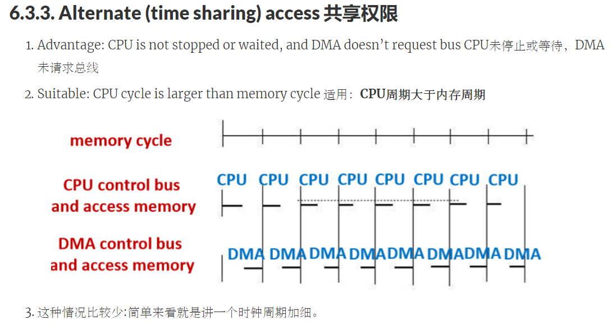\n\n\n\n

Example

\n\n\n\n

假设CPU的时钟频率为500MHz，硬盘以4字块(32位/字)传输数据，传输速度为32Mbps。如果使用中断驱动的I/O，每个块传输需要500个时钟周期(包括中断响应和处理)，CPU在硬盘I/O中使用的时间百分比是多少？

\n\n\n\n

\n
  * Interrupt number per second: 32Mb(32,000,000b) / 16B(128b) = 250K
\n\n\n\n
  * Cycle number per second: 250K * 500 = 125M
\n\n\n\n
  * CPU time percentage: 125M / 500M = 25%
\n
\n\n\n\n

如果使用DMA，CPU需要1000个时钟周期用于DMA传输初始化，500个时钟周期用于传输后的中断处理。如果在每次DMA传输中可以传输8KB数据，那么CPU在硬盘I/O中使用的时间百分比是多少？

\n\n\n\n

\n
  * Time for each DMA transfer: 8KB / 32Mbps = 2ms
\n\n\n\n
  * DMA transfer number per second: 1s / 2ms = 500
\n\n\n\n
  * Cycle number per second: (1000 + 500) * 500 = 750K
\n\n\n\n
  * CPU time percentage: 750K / 500M = 0.15%
\n
\n\n\n\n

**Control Unit Operation**

\n\n\n\n

取指、间址、执行、中断 比这些更小的“op”被称作微操作

\n\n\n\n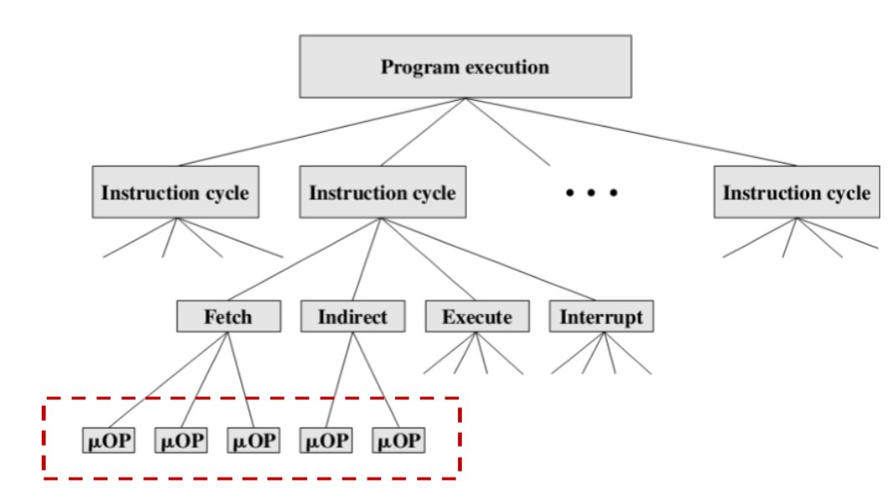\n\n\n\n

\n
  1. 取指周期
\n
\n\n\n\n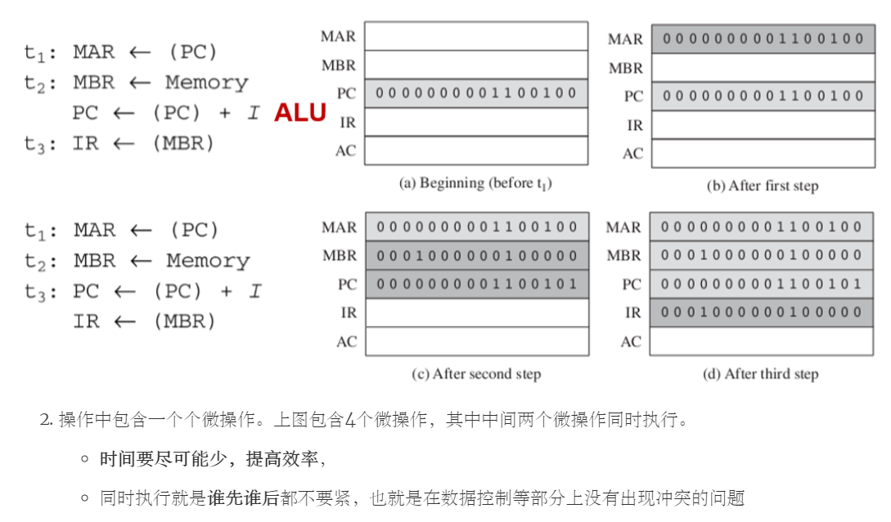\n\n\n\n

内存读操作冲突 MAR <\- (PC)必须优先于 MBR <\- Memory执行，因为内存读取操作需要使用到在MAR中存储的内存地址。

\n\n\n\n

冲突必须要被避免：(MBR <\- Memory) and (IR <\- MBR) should not occur during the same time unit MBR <\- Memory 和 IR <\- MBR不可以在同一个时间单元上发生

\n\n\n\n

2.间址周期

\n\n\n\n

如果指令指定了间接地址，则间接循环必须在执行循环之前完成

\n\n\n\n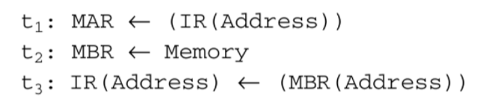\n\n\n\n

3.中断周期

\n\n\n\n

在执行周期之后，进行测试以确定是否发生了任何启用的中断

\n\n\n\n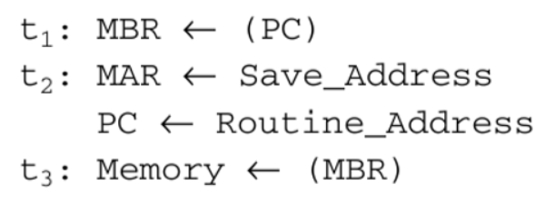\n\n\n\n

4.指令周期

\n\n\n\n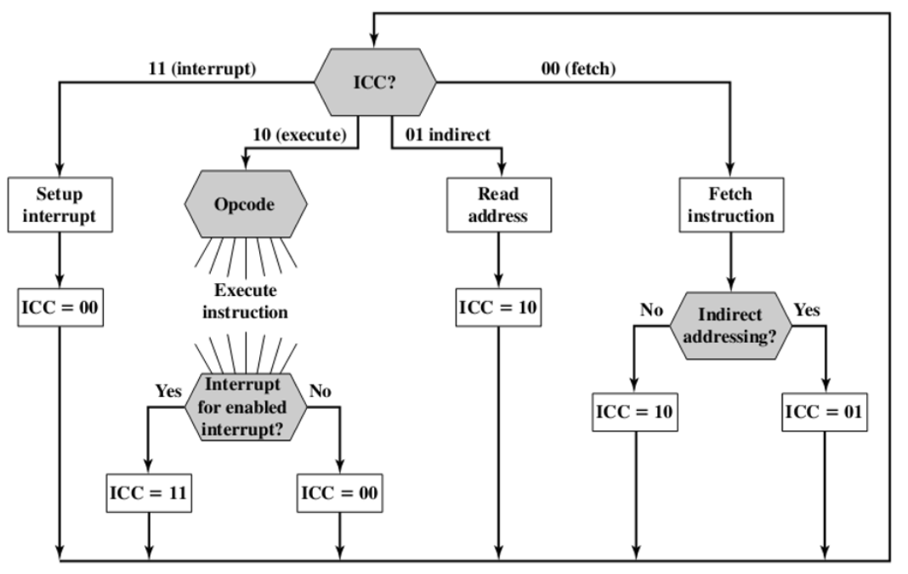\n\n\n\n

2\. 【2012 统考真题】某计算机的控制器采用微程序控制方式，微指令中的操作控制字段采用字段直接编码法，共有 33 个微命令，构成 5 个互斥类，分别包含 7、3、12、5 和 6 个微命令，则操作控制字段至少有( )。

\n\n\n\n

A.5 位

\n\n\n\n

B.6 位

\n\n\n\n

C. 15 位

\n\n\n\n

D.33 位

\n\n\n\n

C

\n\n\n\n

字段直接编码法将微命令字段分成若干小字段，互斥性微命令组合在同一字段中，相容性微命令分在不

\n\n\n\n

同字段中，每个字段还要留出一个状态，表示本字段不发出任何微命令。5 个互斥类，分别包含 7、3、

\n\n\n\n

12、5 和 6 个微命令，需要 3、2、4、3 和 3 位，共 15 位。  
tip:这里的控制方式是多个指令（微操作）一并实现，即构成一个序列

\n\n\n\n

\n
  3. 【2014 统考真题】某计算机采用微程序控制器，共有 32 条指令，公共的取指令微程序包含 2 条  
微指令，各指令对应的微程序平均由 4 条微指令组成，采用断定法(下地址字段法)确定下条微指  
令地址，则微指令中下地址字段的位数至少是( )。  
A. 5  
B. 6  
C. 8  
D. 9  
C  
计算机共有 32 条指令，各个指令对应的微程序平均为 4 条，则指令对应的微指令为 32×4= 128 条，而  
公共微指令还有 2 条，整个系统中微指令的条数共为 128+2=130 条，所以需要  
「log2(1301)=8 位才能寻址到 130 条微指令，答案选 C。(向上取整)
\n
\n\n\n\n

猝发式传输方式：在一个总线周期内传输存储地址连续的多个数据字，也就是说一次传输一个地址和一批地址连续的数据。

\n\n\n\n

\n
  5. 【2012 统考真题】某同步总线的时钟频率为 100MHz,宽度为 32 位，地址/数据线复用，  
每传输一个地址或数据占用一个时钟周期。若该总线支持突发(猝发)传输方式，则一次  
“主存写”总线事务传输 128 位数据所需要的时间至少是( )。  
A. 20ns  
B. 40ns  
C. 50ns  
D.80ns  
C  

\n
\n\n\n\n

由于总线频率为 100MHz,因此时钟周期为 10ns。总线位宽与存储字长都是 32 位，因此每个  
时钟周期可传送一个 32 位存储字。猝发式发送可以连续传送地址连续的数据，因此总传送  
时间为：传送地址 10ns,传送 128 位数据 40ns,共需 50ns。

\n\n\n\n

\n
  11. 【2016 统考真题】下列关于总线设计的叙述中，错误的是（ ）。  
A.并行总线传输比串行总线传输速度快  
B.采用信号线复用技术可减少信号线数量  
C.采用突发传输方式可提高总线数据传输率  
D.采用分离事务通信方式可提高总线利用率  
A  
初看可能会觉得 A 正确，并行总线传输通常比串行总线传输速率快，但这不是绝对的。在  
实际时钟频率较低的情况下，并行总线因为可以同时传输若干比特，速率确实比串行总线快。  
但是，随着技术的发展，时钟频率越来越高，并行总线之间的相互干扰越来越严重，当时钟  
频率提高到一定程度时，传输的数据已无法恢复。而串行总线因为导线少，线间干扰容易控  
制，反而可通过不断提高时钟频率来提高传输速率，A 错误。总线复用是指一种信号线在不  
同的时 间传输不同的信息，它可使用较少的线路传输更多的信息，从而节省空间和成本，  
因此 B 正确。突发(猝发)传输是指在一个总线周期中，可以传输多个存储地址连续的数据，  
即一次传输一个地址和一批地址连续的数据，C 正确。分离事务通信是总线复用的一种，相  
比单一的传输线路可以提高总线的利用率，D 正确。
\n
\n\n\n\n

14\. 【2020 统考真题】QPI 总线是一种点对点全工同步串行总线，总线上的设备可同时接收

\n\n\n\n

和发送信息，每个方向可同时传输 20 位信息（16 位数据+4 位校验位），每个 QPI 数据

\n\n\n\n

包有 80 位信息，分 2 个时钟周期传送，每个时钟周期传递 2 次。因此，QPI 总线带宽

\n\n\n\n

为：每秒传送次数×2B×2。若 QPI 时钟频率为 2.4GHz,则总线带宽为（ ）。

\n\n\n\n

A. 4.8GB/s

\n\n\n\n

B. 9.6GB/s

\n\n\n\n

C. 19.2GB/s

\n\n\n\n

D. 38.4GB/s

\n\n\n\n

C  
每个时钟周期传送 2 次，故每秒传送的次数 =时钟频率×2=2.4G×2/s。  
总线带宽 = 每秒传送次数×2B×2=2.4G×2×2B×2/s=19.2GB/s。  
题中已给出总线带宽公式，降低了难度。公式中的“×2B”是因为每次传输 16 位数据，“×2”  
是因为采用点对点全双工总线，两个方向可同时传输信息。

\n\n\n\n

\n
  15. 【2021 统考真题】下列关于总线的叙述中，错误的是（ ）。  
A.总线是在两个或多个部件之间进行数据交换的传输介质  
B.同步总线由时钟信号定时，时钟频率不一定等于工作频率  
C.异步总线由握手信号定时，一次握手过程完成一位数据交换  
D.突发(Burst)传送总线事务可以在总线上连续传送多个数据  
C  
总线是在两个或多个设备之间进行通信的传输介质，A 正确。同步总线是指总线通信的双  
方采用同一个时钟信号，但是一次总线事务不一定在一个时钟周期内完成，即时钟频率不一  
定等于工作频率，B 正确。异步总线采用握手的方式进行通信，每次握手的过程完成一次通  
信，但是一次通信往往会交换多位而非一位数据，C 错误。突发传送总线事务是指发送方在  
传输完地址 后，连续进行若干次数据的发送，D 正确。
\n
\n\n\n\n\n
  16. 【2019 统考真题】假定一台计算机采用 3 通道存储器总线，配套的内存条型号为 DDR3-  
1333,即内存条所接插的存储器总线的工作频率为 1333MHz,总线宽度为 64 位，则存储  
器总线的总带宽大约是（ ）。  
A. 10.66GB/s  
B.32GB/s  
C.64GB/s  
D.96GB/s  
B  
计算机采用 3 通道存储器总线，存储器总线的工作频率为 1333MHz，即 1 秒内传送 1333M  
次数据，总线宽度为 64bit 即单条总线工作一次可传输 8Byte，因此存储器总线的总带宽为  
3x8x1333MB/s,约为 32GB/s，所以选 B。
\n
\n\n\n\n

19\. 假设某存储器总线采用同步定时方式，时钟频率为 50MHz，每个总线事务传输 8 个字，每字 4 字节。对于读操作，访问顺序是 1 个时钟周期接受地址，3 个时钟周期等待存储器读数，8 个时钟周期用于传输 8 个字。

\n\n\n\n

对于写操作，访问顺序是一个时钟周期接受地址，2 个时钟周期延迟等待，8 个时钟周期用于传输 8 个字，3 个时钟周期恢复和写入纠错码。

\n\n\n\n

对于以下访问模式，求出该存储器读写时在存储总线上的数据传输率（单位：Mbps）。

\n\n\n\n

a) 全部访问为连续的读操作。

\n\n\n\n

b) 全部访问为连续的写操作。

\n\n\n\n

c) 65%的时间内全是读操作，35%的时间内全是写操作

\n\n\n\n

d) 65%的访问为读操作，35%的访问为写操作

\n\n\n\n

a） 8 个字用 1+3+8=12 个周期，故数据传输率为 8×4B/(12×1/50M) = 1066.7 Mbps  
b） 8 个字用 1+2+8+3=14 个周期，故数据传输率为 8×4B/(14×1/50M) = 914.3 Mbps  
c） 1066.7 Mbps × 65% + 914.3 Mbps × 35% = 1013.3 Mbps  
这里将两个数字直接加权应当是 1013.4，但是如果将(a)和(b)中的未四舍五入前的  
数字进行加权，则答案是 1013.3  
d） 8×4B/((12×65%+14×35%)×1/50M) = 1007.9 Mbps  
应当对每个读写操作所需要的时钟周期加权平均，而不是直接对数据传输率加权平  
均。因为加权的是访问次数，而不是用于读或写的总时间

\n\n\n\n

\n
  20. 假定在一个字长为 32 位的计算机系统中，存储器分别连接以下两种同步总线。  
总线 1 是 64 位数据和地址复用的同步总线，能在 1 个时钟周期内传输一个 64 位的数据  
或地址。支持 _最多连续 8 个字的存储器读操作和存储器写操作总线事务_ 。任何一个读写  
操作总是先用 1 个时钟周期**传送地址** ，然后有 2 个时钟周期的**延迟等待** ，从第 4 个时钟  
周期开始，存储器准备好数据，总线以**每个时钟周期 2 个字的速度** 传送，最多传送 8 个  
字。  
总线 2 是分离的 32 位地址和 32 位数据的总线。支持最多连续 8 个字的存储器读操作和  
写操作总线事务，读操作的过程为：1 个时钟周期**传送地址** ，2 个时钟周期**延迟等待** ，从  
第 4 个时钟周期开始，存储器准备好数据，总线以每个时钟周期一个字的速度传输最多  
8 个字；对于写操作，在第 1 个时钟周期内第 1 个数据字和地址**一起传输** ，经过 2 个时  
钟周期的等待延迟后，以每个时钟周期 1 个字的速度传输，最多传输 7 个余下的数据字。  
**假设这两种总线的时钟频率都是 100MHz** ，请问：  
a) 总线 1 的带宽为多少（单位：Mbps）？  
b) 总线 2 的带宽为多少（单位：Mbps）？  
c) 连续进行单个字的存储器读操作总线事务，总线 1 的数据传输率为多少（单位：  
Mbps）？  
d) 连续进行单个字的存储器读操作总线事务，总线 2 的数据传输率为多少（单位：  
Mbps）？  
e) 连续进行单个字的存储器写操作总线事务，总线 1 的数据传输率为多少（单位：  
Mbps）？  
f) 连续进行单个字的存储器写操作总线事务，总线 2 的数据传输率为多少（单位：  
Mbps）？  
g) 每次传输 8 个字的数据块，其中 60%的访问是读操作总线事务，40%的访问是写操  
作总线事务，总线 1 的数据传输率是多少（单位：Mbps）？  
h) 每次传输 8 个字的数据块，其中 60%的访问是读操作总线事务，40%的访问是写操  
作总线事务，总线 2 的数据传输率是多少（单位：Mbps）？
\n
\n\n\n\n

a） 总线 1 在传送数据时以每个时钟周期 2 个字的速度进行，所以它的带宽为  
2×32bit×100M = 6400Mbps。  
b） 总线 2 在传送数据时以每个时钟周期 1 个字的速度进行，所以它的带宽为  
32bit×100M = 3200Mbps。  
c） 总线 1 虽然每个时钟周期可传 2 个字，但在单字传输总线事务中每次只需要传送  
一个字，每个总线事务占 1+2+1=4 个时钟周期，因此连续进行单个字的存储器读总线  
事务时，总线 1 的数据传输率为 4B×100M/4 = 800Mbps。  
d） 总线 2 每个时钟周期读一个字，一个单字存储器读总线事务占 1+2+1=4 个时钟周  
期，因此连续进行单个字的存储器读总线事务时，总线 2 的数据传输率也为 800Mbps。  
e） 总线 1 的单字存储器写总线事务和单字存储器读总线事务的情况一样，因此，连续  
进行单个字的存储器写总线事务时，数据传输率也是 800Mbps。  
f） 总线 2 的单字存储器写总线事务占 1+2=3 个时钟周期，因此连续进行单个字的存  
储器写总线事务时，其数据传输率为 4B×100M/3=1066.7Mbps。  
g） 通过总线 1 进行存储器读或写 8 个字所用时间都为 1+2+8/2=7 个时钟周期，所以  
在连续进行 8 个 字 的 传 送 总 线 事 务 时 ， 总 线 1 的 数 据 传 输 率 为  
8×4B×100M/7=3657.1Mbps。  
h） 2415.1Mbps  
总线 2 的存储器读事务和存储器写事务所用时间不等。突发读 8 个字所用的时间  
为 1+2+8=11 个时钟周期，突发写 8 个字所用的时间为 1+2+7=10 个时钟周期，因此，  
当 60%是读操作总线事务，40%是写操作总线事务时，总线 2 的数据传输率为  
8×4B/((11×60%+10×40%)×1/100MHz)=2415.1Mbps  
注：应当对每个读写操作所需要的时钟周期加权平均，而不是直接对数据传输率加  
权平均。因为加权的是访问次数，而不是用于读或写的总时间。按读或写的总时间加权  
时，答案是 8×4B×100MHz/11×60%+8×4B×100MHz/10×40%=2420.4Mbps

\n\n\n\n

**总线数据传输率=时钟频率/每个总线包含的时钟数×每个总线周期传输的字节数**

\n\n\n\n

**指令流水线**

\n\n\n\n

为了进一步的加速，流水线必须有更多的阶段——六级流水线进一步延长

\n\n\n\n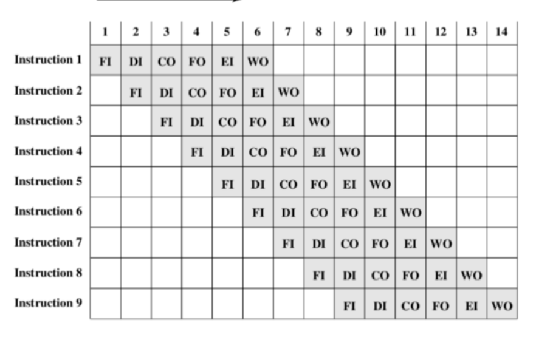\n\n\n\n

\n
  * 不是所有指令都包含6个阶段
\n\n\n\n
  * 不是所有的阶段都能并行完成
\n\n\n\n
  * 若6个阶段不全是相等的时间，则会在各个流水阶段涉及某种等待
\n
\n\n\n\n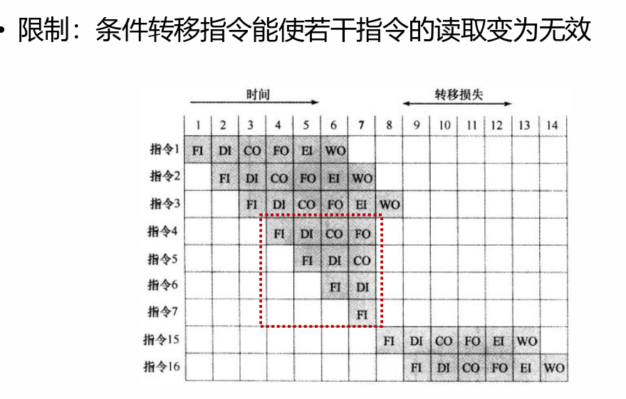\n\n\n\n\n\n\n\n

三类冒险：

\n\n\n\n

\n
  * 结构冒险（Structure hazard） / 硬件资源冲突
\n\n\n\n
  * 数据冒险（Data hazard）/ 数据依赖性
\n\n\n\n
  * 控制冒险（Control hazard）
\n
\n\n\n\n

结构冒险：

\n\n\n\n

\n
  * 原因：已进入流水线的不同指令在同一时刻访问相同的硬件资源
\n\n\n\n
  * 解决：使用多个**不同** 的硬件资源，或者**分时使用** 同一个硬件资源
\n
\n\n\n\n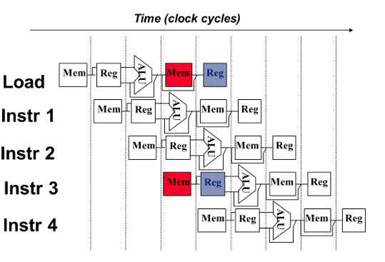\n\n\n\n

数据冒险：所需要的数据尚未生成

\n\n\n\n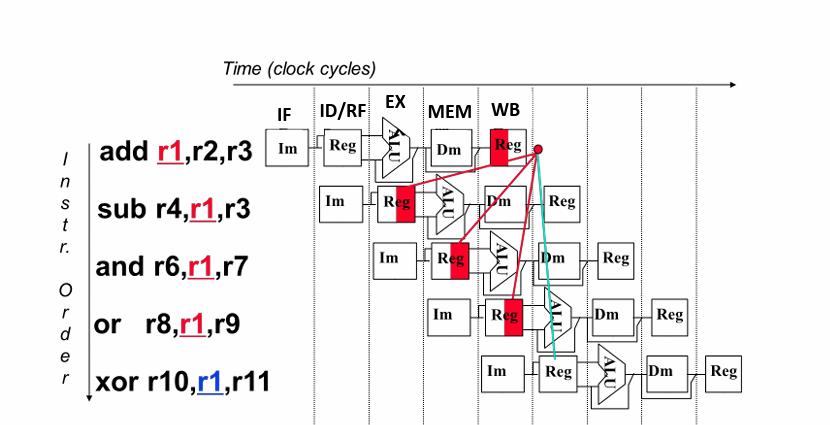\n\n\n\n

解决：1.插入nop指令隔断

\n\n\n\n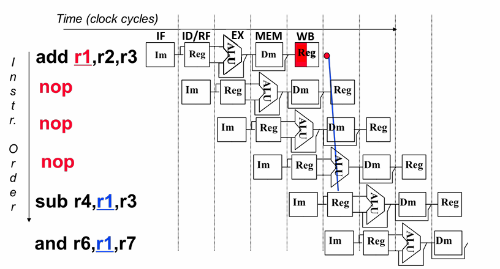\n\n\n\n

2.插入bubble

\n\n\n\n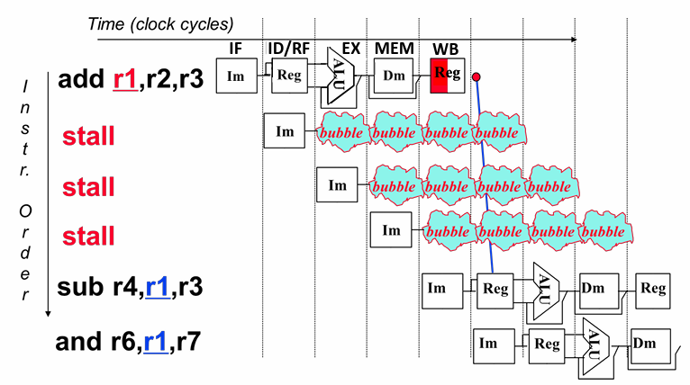\n\n\n\n

3。转发or旁路

\n\n\n\n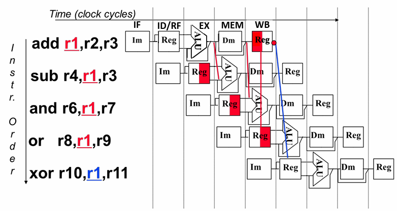\n\n\n\n

仔细观察我们可以发现，当运算完成后在 Exec/Mem 流水段寄存器中已经存在后面指令可能需要用到的数据，我们可以不等Wr阶段写回寄存器而是在硬件上稍加改动直接将流水段寄存器中的数据送往下一指令的ALU输入端，这种操作称为 **转发（Forwarding）或旁路（Bypassing）** ，可以理解为 “抄近道” 了。

\n\n\n\n

4.交换指令顺序

\n\n\n\n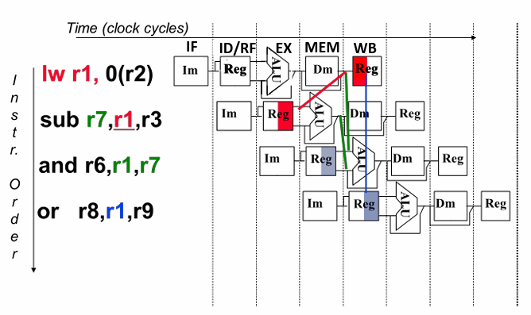\n\n\n\n

控制冒险：指令的执行顺序更改

\n\n\n\n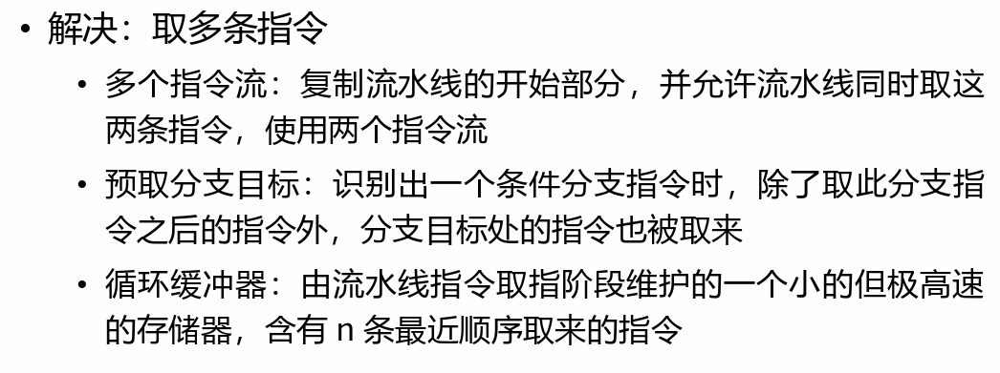\n\n\n\n

\n
  7. 【2013 统考真题】某 CPU 主频为 1.03GHz,采用 4 级指令流水线，每个流水段的执行需要 1 个时  
钟周期。假定 CPU 执行了 100 条指令，在其执行过程中，没有发生任何流水线阻塞，此时流水线的  
吞吐率为( )。  
A.0.25×10^9 条指令/秒  
B. 0.97×10^9 条指令/秒  
C.1.0×10^9 条指令/秒  
D.1.03×10^9 条指令/秒
\n
\n\n\n\n

采用 4 级流水执行 100 条指令，在执行过程中共用 4+(100-1)=103 个时钟周期，如下图所示。CPU 的主  
频是 1.03GHz,即每秒有 1.03G 个时钟周期。流水线的吞吐率为 1.03G*100/103 = 1.0×10^9 条指令/秒。

\n\n\n\n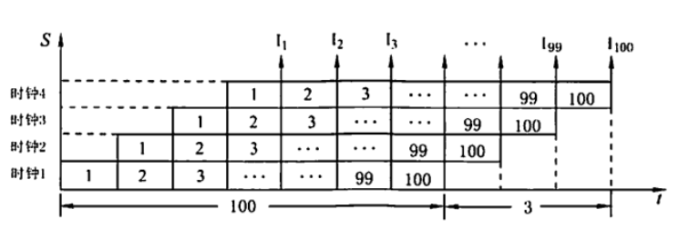\n\n\n\n

\n
  9. 【2017 统考真题】下列关于指令流水线数据通路的叙述中，错误的是( )。  
A.包含生成控制信号的控制部件  
B.包含算术逻辑运算部件(ALU)  
C.包含通用寄存器组和取指部件  
D.由组合逻辑电路和时序逻辑电路组合而成  
A  
数据在功能部件之间传送的路径被称为数据通路，包括数据通路上流经的部件，如程序计  
数器、ALU、通用寄存器、状态寄存器、异常和中断处理逻辑等。数据通路由控制部件控制，控制部件  
根据每条指令功能的不同生成对数据通路的控制信号。因此，不包括控制部件。
\n
\n\n\n\n

**寻址方式：**

\n\n\n\n

1 立即寻址：

\n\n\n\n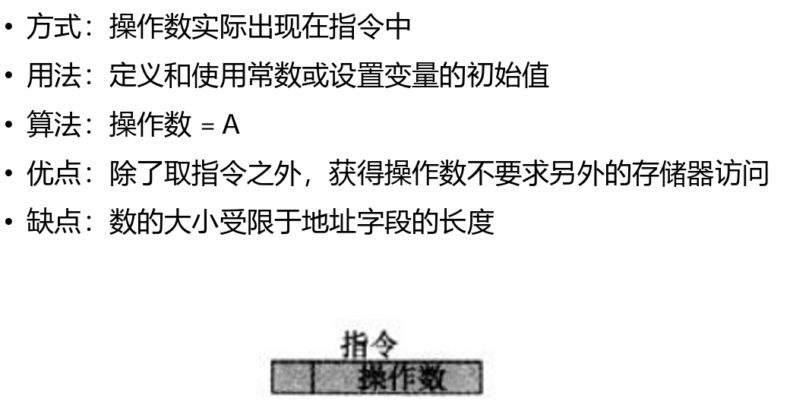\n\n\n\n

2。直接寻址

\n\n\n\n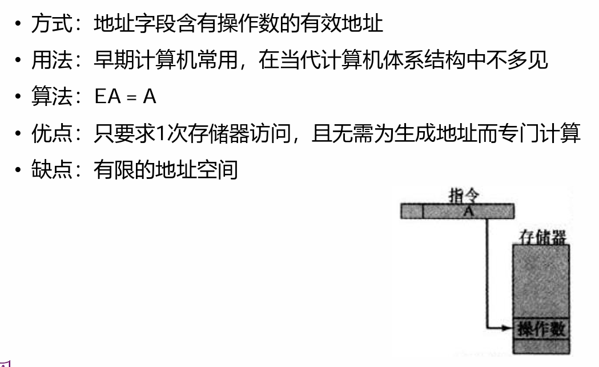\n\n\n\n

3。间接寻址

\n\n\n\n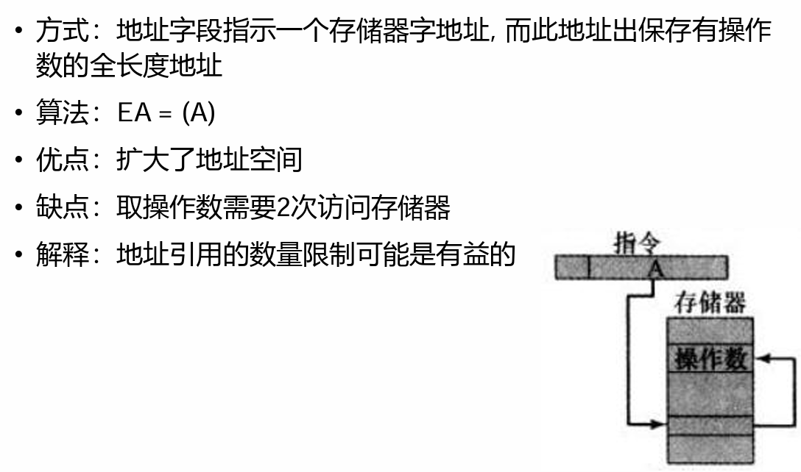\n\n\n\n

4.寄存器寻址

\n\n\n\n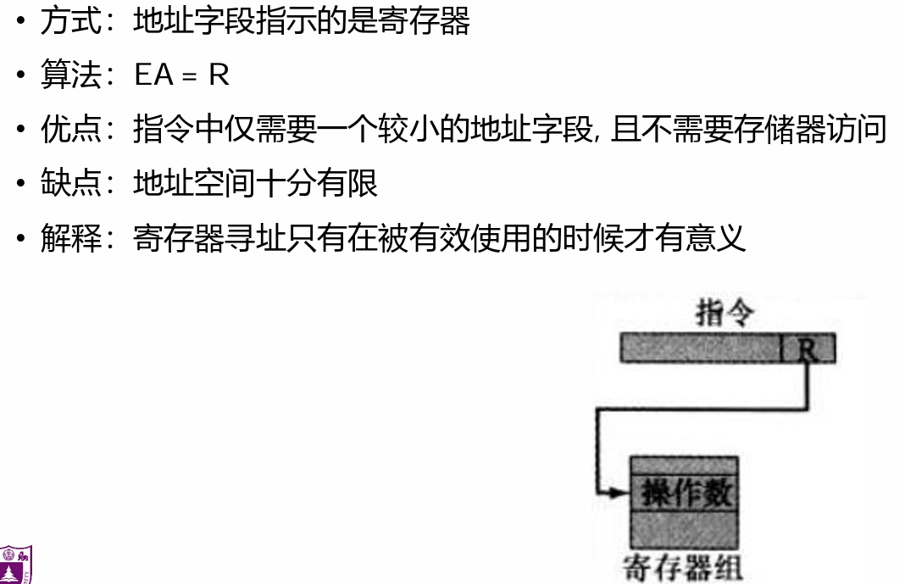\n\n\n\n

5.寄存器间接寻址

\n\n\n\n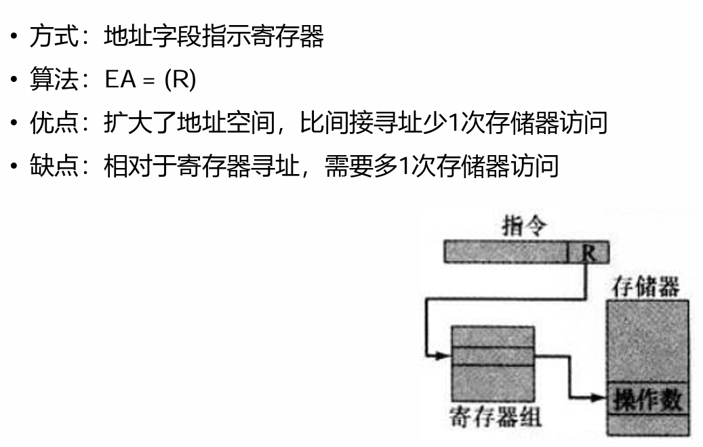\n\n\n\n

6。偏移寻址（相对寻址）

\n\n\n\n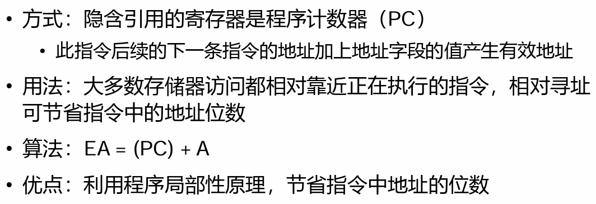\n\n\n\n

7.基址寄存器寻址

\n\n\n\n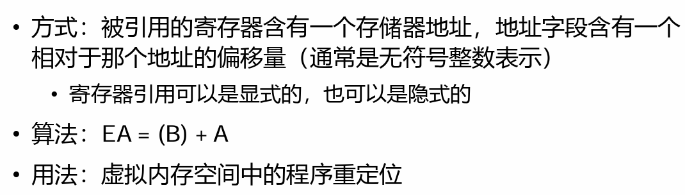\n\n\n\n

8。变址寻址

\n\n\n\n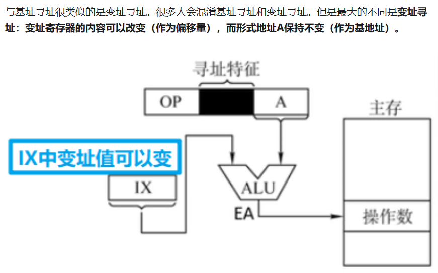\n\n\n\n

\n
  13. 控制器如图所示。假定它的控制存储器是 24 位宽。微指令格式的控制部分分成两个字段。一个 13位的微操作字段用来指定将要完成的微操作。一个地址选择字段用来指明能引起微指令转移的条件，这些条件是基于 8 个标志来建立的。  
a) 地址选择字段有多少位？  
b) 地址字段有多少位？  
c) 控制存储器容量为多少（单位：字节）？
\n
\n\n\n\n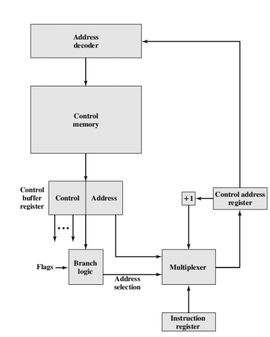\n\n\n\n

a) 地址选择字段共有 8 个标志，log28=3，故需要 3 位

\n\n\n\n

b) 地址字段位数为 24-13-3=8 位

\n\n\n\n

c) 地址为 8 位，表示微指令的条数最大为 2 8 =256 条，所以控制存储器的容量为 256 * 24/8 =

\n\n\n\n

768 字节

\n\n\n\n

2\. 【2009 统考真题】某机器字长为 16 位，主存按字节编址，转移指令采用相对寻址，由 2 字节组

\n\n\n\n

成，第一字节为操作码字段，第二字节为相对位移量字段。假定取指令时，每取一字节 PC 自动加

\n\n\n\n

1。若某转移指令所在主存地址为 2000H，相对位移量字段的内容为 06H,则该转移指令成功转移后

\n\n\n\n

的目标地址是( )。

\n\n\n\n

A. 2006H

\n\n\n\n

B. 2007H

\n\n\n\n

C. 2008H

\n\n\n\n

D.2009H

\n\n\n\n

C

\n\n\n\n

\n
  4. 【2013 统考真题】假设变址寄存器 R 的内容为 1000H，指令中的形式地址为 2000H；地址 1000H 中  
的内容为 2000H，地址 2000H 中的内容为 3000H，地址 3000H 中的内容为 4000H，则变址寻址方式  
下访问到的操作数是( )。  
A.1000H B. 2000H C. 3000H D.4000H  
D  
根据变址寻址的方法，变址寄存器的内容(1000H)与形式地址的内容(2000H)相加，得到操作数的实际地  
址(3000H),根据实际地址访问内存，获取操作数 4000H,如下图所示。
\n
\n\n\n\n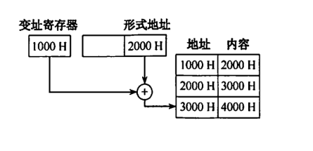\n\n\n\n

\n
  6. 【2016 统考真题】某指令格式如下所示。  
其中 M 为寻址方式，I 为变址寄存器编号，D 为形式地址。若采用先变址后间址的寻 址方式，则操作  
数的有效地址是( )。  
A. I+D B.(I)+D C.((I)+D) D.((I))+D  
C
\n
\n\n\n\n\n
  8. 【2018 统考真题】按字节编址的计算机中，某 double 型数组 A 的首地址为 2000H,使用变址寻  
址和循环结构访问数组 A,保存数组下标的变址寄存器的初值为 0,每次循环取一个 数组元素，其  
偏移地址为变址值乘以 sizeof(double),取完后变址寄存器的内容自动加 1。若某次循环所取元素  
的地址为 2100H,则进入该次循环时变址寄存器的内容是( )。  
A. 25 B. 32 C. 64 D.100  
B  
根据变址寻址的公式 EA=(IX)+A,有(IX)=2100H-2000H=100H=256，sizeof(double)=8 (双精度浮点数用 8  
位字节表示),因此数组的下标为 256/8=32,答案选 B。
\n
\n\n\n\n\n
  11. 【2021 统考真题】下列寄存器中，汇编语言程序员可见的是( )。  
I.指令寄存器  
II.微指令寄存器  
III.基址寄存器  
IV.标志/状态寄存器  
A.仅 I、II  
B.仅 I、IV  
C.仅 II、IV  
D.仅 Ⅲ、IV  
D
\n
\n\n\n\n\n
  13. 【2011 统考真题】假定不采用 Cache 和指令预取技术，且机器处于“开中断”状态，则在下列有  
关指令执行的叙述中，错误的是( )。  
A.每个指令周期中 CPU 都至少访问内存一次  
B.每个指令周期一定大于等于一个 CPU 时钟周期  
C.空操作指令的指令周期中任何寄存器的内容都不会被改变  
D.当前程序在每条指令执行结束时都可能被外部中断打断  
C
\n
\n\n\n\n\n
  16. 【2016 统考真题】某计算机的主存空间为 4GB,字长为 32 位，按字节编址，采用 32 位字长指令  
字格式。若指令按字边界对齐存放，则程序计数器(PC)和指令寄存器(IR)的位数至少分别是( )。  
A.30、30  
B. 30、32  
C. 32、30  
D. 32、32  
B
\n
\n\n\n\n

程序计数器 PC 给出下一条指令字的访存地址（指令在内存中的地址），它取决于存储器的  
字数（4GB/32bit=2^30），因此 PC 的位数至少是 30 位，指令寄存器 IR 用于接收取得的指  
令，它取决于指令字长（32bit），因此 IR 的位数至少为 32 位。

\n\n\n\n

key:

\n\n\n\n

21\. 某计算机指令系统采用定长指令字格式，指令字长 16 位，每个操作数的地址码长 6 位。指令分为2 地址、1 地址和 0 地址三类。如果 2 地址的指令有 k2 条，0 地址的指令有 k0 条，那么 1 地址的指令最多有多少条？（提示：任何指令不能有二义性，即任何指令无法同时用 2-、1-、0-地址法中两种或两种以上方式解释。）

\n\n\n\n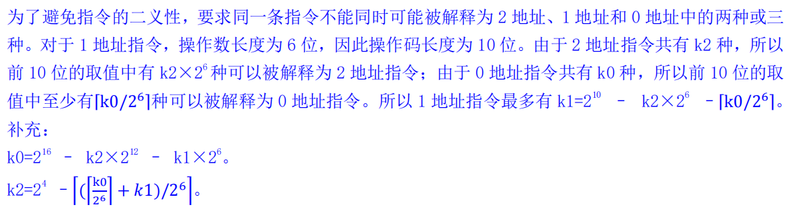\n\n\n\n

## hw8

\n\n\n\n

假设一个分页虚拟存储系统的虚拟地址为 40 位，物理地址为 36 位，页大小为 16KB，按字节编址。  
若页表中的有效位、存储保护位、修改位、使用位共占 4 位，磁盘地址不在页表中。则该存储系统  
中每个程序的页表大小为多少（单位：MB）？（说明：1.假设每个程序都能使用全部的虚拟内存；  
2.页表项的长度必须为字节的整数倍）  
256

\n\n\n\n

按字节编址，故：  
虚拟主存页面个数：2^(40-14)=2^26  
物理主存页面数：2^(36-14)=2^22  
页表项的最小长度：22+4=26  
根据说明 2，取 32 位（4B）  
页表大小：2^26*4B=256MB

\n\n\n\n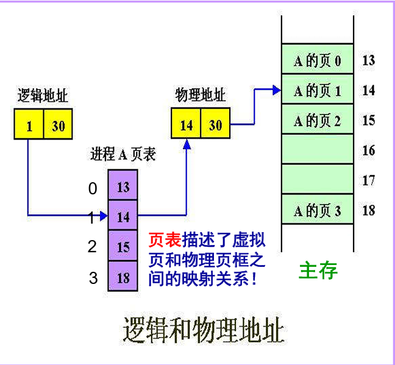\n\n\n\n

从虚拟内存到页表到主存的过程就是如图所示

\n\n\n\n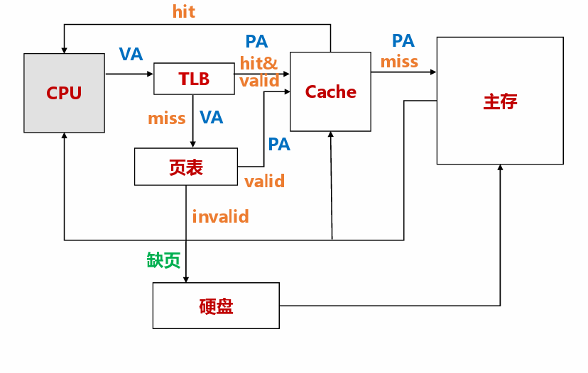\n\n\n\n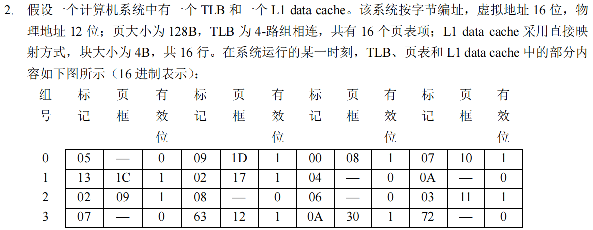\n\n\n\n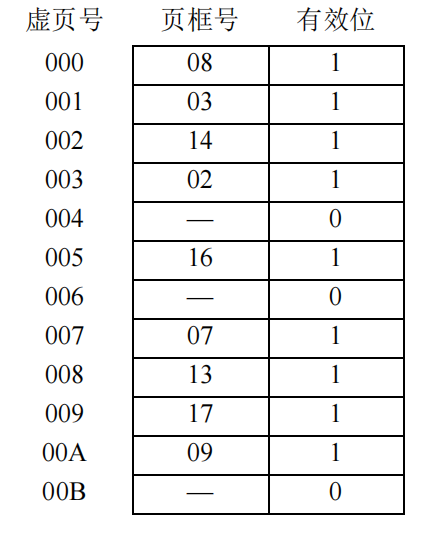\n\n\n\n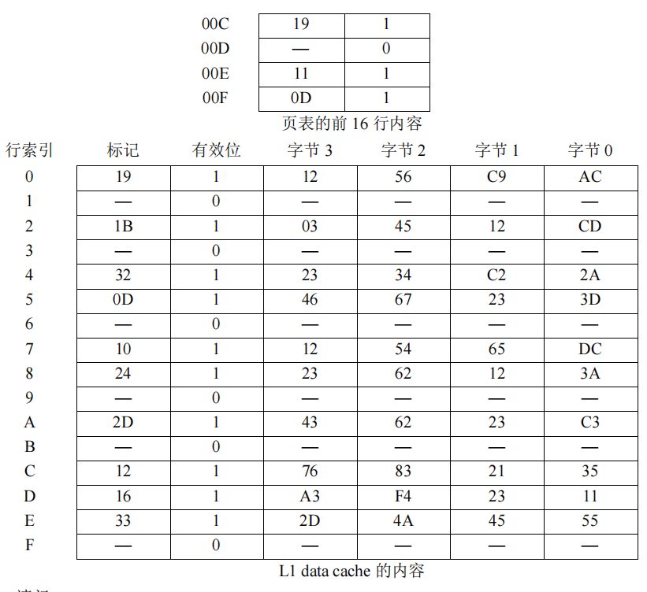\n\n\n\n

请问：

\n\n\n\n

1。虚拟地址中的哪几位表示虚拟页号？

\n\n\n\n

页大小 128B，所以低 7 位为页内偏移量，从而高 9 位为虚拟页号

\n\n\n\n

2。虚拟页号的哪几位表示TLB标记

\n\n\n\n

虚拟页号的高7位表示TLB标记，低2位作为组号分配

\n\n\n\n

3。物理地址中哪几位表示物理页号？

\n\n\n\n

物理地址的高五位表示物理页号，低七位表示页内偏移

\n\n\n\n

4。在访问cache时，物理地址哪几位表示行号

\n\n\n\n

低两位表示块内地址，高六位表示tag，那么中间四位就是行号了

\n\n\n\n

5。CPU 从地址 067AH 中取出的值为多少？

\n\n\n\n

首先通过虚拟地址分解出高7位是TLB标记，中间两位是TLB组号00，在00组寻找对应的TLB标记缺失，进一步到页表中找，在虚拟地址中除去低七位的业内偏移就是页表号，根据这高九位000001100即找00CH的页表，有效位为1，于是取出物理页号19H，和第七位的页内偏移组成物理页号，然后去访问cache查询该物理地址，由于cache采取的是直接映射，所以直接高六位取tag（剩下0位组索引（因为是直接映射所以有行号没有组索引），4位行号，2位组内地址）即33H，位于行14，快内地址为10，因此读出的数据是4A

\n\n\n\n

总结一下，从虚拟地址到主存找页的内容，主要是一个地址转换过程，TLB是页表的精化版本，就好比cache是主存的精化版本，我们先查询TLB，根据TLB的存储方式划分虚拟地址中除去页内偏移的部分（因为我们要查询的不是一整个页面而是页面中的某一部分）因此对于这个地方的4路组关联的TLB，低2位表示的是组号，然后高7位存储的则自然而然是TLB标记（tag），根据这个组号和标记查询发现缺少记录，那么就到主要的页表查询，在这样一个页表中前九位都是页表号，直接找到这一行（虚拟地址的虚拟页号就是体现在页表的序号上，而页表中存储的则是校验部分和物理地址号）查询有效后取得19H的物理页号，当成五位的物理页号和页内偏移组成12位的物理地址，直接到cache去找，cache地址的划分有一定的策略，对于直接相连来说没有组号这个概念（相当于n组的组相联）而对于全关联而言没有行号这个概念（相当于一组的组相连，所有行等效）因此，一般是从低位开始向上划分：算出块内地址、组索引或者行号，剩下的就是当前有效的tag

\n\n\n\n

## hw7

\n\n\n\n

\n
  1. 考虑一个单片磁盘，它有如下参数：旋转速率是 7200rpm，一面上的磁道数是 30000，每  
道扇区数是 600，寻道时间是每越过一百个磁道用时 1ms。假定开始时磁头位于磁道 0，  
收到一个存取随机磁道上随机扇区的请求。  
a) 平均寻道时间是多少（精度：小数点后 2 位，单位：s）？  
b) 平均旋转延迟是多少（精度：小数点后 2 位，单位：ms）？  
c) 一个扇区的传送时间是多少（精度：小数点后 4 位，单位：ms）？  
d) 完成访问请求的总的平均时间是多少（精度：小数点后 2 位，单位：ms）？
\n
\n\n\n\n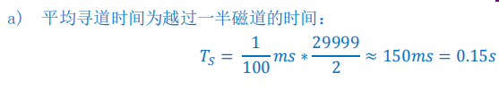\n\n\n\n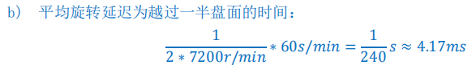\n\n\n\n

磁盘IO时间的组成：

\n\n\n\n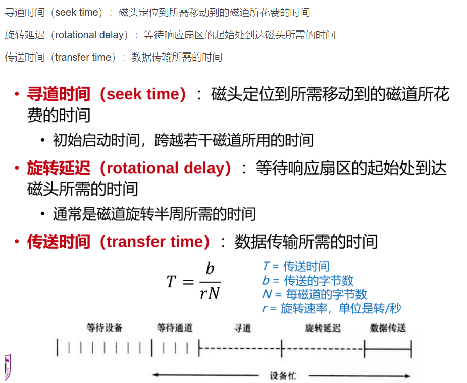\n\n\n\n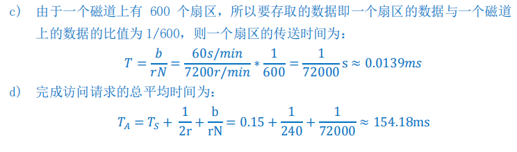\n\n\n\n

\n
  3. 假设有一个磁盘，每面有 200 个磁道，盘面总存储容量为 1.6MB，磁盘旋转一周时间为  
25ms，每道有 4 个区，每两个区之间有一个间隙，磁头通过每个间隙需要 1.25ms。请问：  
从该磁盘上读取数据时的最大数据传输率是多少（精度：小数点后 2 位，单位：Mbps）？
\n
\n\n\n\n

由题意可知先计算每个磁道的容量位0.064Mb,每个区则是0.016Mb，速度最快肯定是不跨区因此直接

\n\n\n\n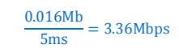\n\n\n\n

\n
  5. 【2013 统考真题】某磁盘的转速为 10000 转/分，平均寻道时间是 6ms，磁盘传输速率  
是 20MB/s，磁盘控制器延迟为 0.2ms，读取一个 4KB 的扇区所需的平均时间约为（ ）。  
A. 9ms  
B. 9.4ms  
C. 12ms  
D. 12.4ms  
B  
磁盘转速是 10000 转/分，转一圈的时间为 6ms，因此平均查询扇区的时间为 3ms，平均  
寻道时间为 6ms，读取 4KB 扇区信息的时间为 4KB/(20MB/s)=0.2ms，信息延迟的时间为  
0.2ms，总时间为 3+6＋0.2+0.2= 9.4ms。
\n
\n\n\n\n

7\. 【2019 统考真题】下列关于磁盘存储器的叙述中，错误的（ ）。

\n\n\n\n

A. 磁盘的格式化容量比非格式化容量小

\n\n\n\n

B. 扇区中包含数据、地址和校验等信息

\n\n\n\n

C. 磁盘存储器的最小读写单位为 1 字节

\n\n\n\n

D. 磁盘存储器由磁盘控制器、磁盘驱动器和盘片组成

\n\n\n\n

C

\n\n\n\n

磁盘存储器的最小读写单位为一个扇区，即磁盘按块存取，C 错误。磁盘存储数据之前

\n\n\n\n

需要进行格式化，将磁盘分成扇区，并写入信息，因此磁盘的格式化容量比非格式化容量小，

\n\n\n\n

A 正确。磁盘扇区中包含数据、地址和校验等信息，B 正确。磁盘存储器由磁盘控制器、磁

\n\n\n\n

盘驱动器和盘片组成，D 正确。

\n\n\n\n

\n
  9. 假定有两个用来存储 10TB 数据的 RAID 系统，每个磁盘的大小均为 2TB。系统 A 使用  
RAID 1 技术，系统 B 使用 RAID 5 技术。请问：  
[刘璟，121250083]  
a) 系统 A 需要比系统 B 多用多少存储容量（单位：TB）？  
A 系统需 20TB 存储容量；B 系统采用 6 个磁盘，需 12TB 存储容量，多用 8TB  
b) 假定一个应用需要向磁盘写入一块数据，若磁盘读或写一块数据的时间为 30ms，  
则最坏情况下，在系统 A 上写入一块数据需要多少时间（单位：毫秒）？  
30ms  
c) 如果问题 b）是在系统 B 上写入一块数据，需要多少时间（单位：毫秒）？  
120ms（最坏情况：两读两写）  
d) 哪个系统更加可靠？  
A 更加可靠。  
从直观角度来说，RAID1 通过镜像对整个数据进行了备份，只要其中一份数据所在磁盘  
出现了问题，通过另一份数据就可以很方便的进行恢复；而 B 系统中，如果同一对应位置的  
任意两块磁盘同时存在故障，相应的数据就无法进行恢复了。
\n
\n\n\n\n

## hw5

\n\n\n\n

\n
  2. 已知某机主存容量为 64KB，按字节编址。假定用 1K×4 位的 DRAM 芯片构成该存储  
器，  
请问：  
a) 需要多少个这样的 DRAM 芯片？  
N=64KB/(1K×4bit)=128 (1B=8bit)  
b) 主存地址共多少位？哪几位用于选片？哪几位用于片内选址？  
主存容量为 64KB，按字节寻址，所以寻址空间为 64K=216，主存地址为 16 位。由于片  
内为 1K 个地址，所以低 10 位为片内地址，高 16-10=6 位用于选片。  
注意，此处不能算为 128=2^7，所以高 7 位选片，低 16-7=9 位用于片内选址。因为片内  
的选址单元是 4 位，需要位扩展后才能按字节编址（整体上是字位扩展），即选片时都是同  
时选中 2 个芯片。
\n
\n