\n

> \n
> 
> \n线性表、树、图必有题。散列表、并查集、优先队列每次不一定  
> 第一章  
> 数据的概念不管  
> 数据结构的概念看看（一般不考概念题）  
> 线性结构和非线性结构的意思要掌握（不会填空）  
> 数据类型不考  
> 面向对象的概念要掌握（一般不会专门考概念）  
> 算法的概念看一下，性质有一年考过  
> 算法和程序的区别应该不考  
> 数学公式不考  
> 数学归纳法不做重点，也可以不看  
> 递归看一下  
> 泛型不做重点，主要是能读懂就行，不会要求写  
> 泛型的机制也不是重点  
> 第二章  
> 时间和空间复杂度知道就行  
> 重点是大O表示法，会结合排序算法考，或给个算法问复杂度，或要求写一个复杂度尽可能低的算法  
> 最优、最差、平均（只要求等概率）复杂度得知道  
> O，Ω等符号代表的意思得清楚  
> 排序算法都要求掌握  
> 折半查找要的  
> 分治法看看，一般来说也不是特别大的重点  
> 第三章  
> 明白线性表是什么概念  
> 基本概念看看就行  
> 数组实现和单链表实现都要掌握  
> 单链表的操作是必须掌握的基本  
> 带表头节点的会出现  
> 双链表知道一下就行，概率不大  
> 循环链表知道有这个结构  
> 静态链表要求掌握  
> 栈和队列要认真看  
> 栈和队列的基本操作  
> 难点在于出应用场景，要求用栈或队列解决  
> 第四章  
> 树的基本概念看看  
> 二叉树考的概率很高  
> 概念过过  
> 完全二叉树的数组实现、链接实现  
> 树的遍历、由遍历构建树  
> 树的遍历的非递归写法要求读不要求写  
> 字符串看看  
> 广义表基本不考，可以不掌握  
> 森林的遍历  
> 线索树要求的  
> huffman树时不时考  
> 二叉搜索树大多数时候直接考AVL  
> 证明不考，知道结论就行  
> B-Tree会考（很大概率）  
> m路搜索树和B-Tree的不同可能会考  
> B-Tree不要求代码  
> 第五章  
> 有时候会有一两题  
> 知道装载因子  
> 专门为考试学的几个散列函数  
> 碰撞解决方案及其搜索长度  
> rehashing知道过程就行  
> 分离链没有线性探测考的多  
> 第六章  
> 概念知道是什么东西就行  
> 堆的上滤下滤操作  
> 堆的enqueue、dequeue  
> O(n)复杂度的建堆  
> 堆排序  
> 证明不需要，记结论  
> 第七章  
> 今年考并查集  
> 等价类的概念不考  
> 第八章  
> 概念和树一样，过一下就行  
> 邻接矩阵和邻接表肯定要掌握  
> 邻接多重表几乎不考（应该卷子里没有，如果没记错的话）  
> 遍历肯定要掌握  
> 连通图和连通分量肯定得知道  
> 三大类问题的算法肯定得会  
> AOV和AOE也常考，要掌握拓扑排序和算关键路径  
> 第九章  
> 都要会  
> 折半插入一般不考  
> 希尔排序得知道主流程，不考代码，证明当然不考  
> Radix排序一般也不太考

\n\n\n\n

## List列表（线性表为主）

\n\n\n\n
    
    
     AbstractDateType LinearList\n {  instances\n    ordered finite collections of zero or more elements\n    operations\n Create(); \n Destroy();\n IsEmpty(); \n Find(k,x); \n Delete(k,x); \n Output(out);\n Length();\n Search(x);\n Insert(k,x);\n }  \n

\n\n\n\n

serveral Implementations多种实现

\n\n\n\n

使用数组：

\n\n\n\n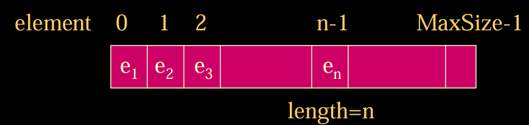\n\n\n\n

search(x): 复杂度为On（可以遍历，或者考虑有序集二分）  
remove(a,x):复杂度为On（移除后前移）  
insert(x,i):复杂度为On

\n\n\n\n

使用链表

\n\n\n\n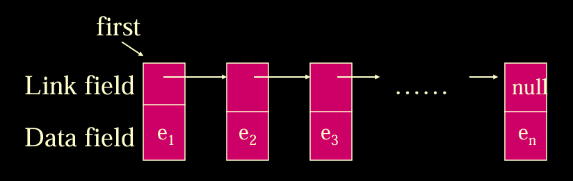\n\n\n\n

最后一个节点为空

\n\n\n\n

delete删除操作：

\n\n\n\n

first get to node just before node to be removed  
before= first .link;直到够到需要删除的节点之后，before .link = before .link .link;

\n\n\n\n

insert插入操作：首先new一个chainNode对象，然后放在first位置，first find node whose index is 3，然后插入这个

\n\n\n\n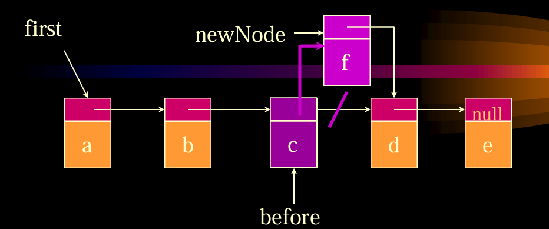\n\n\n\n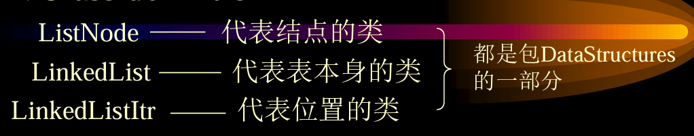\n\n\n\n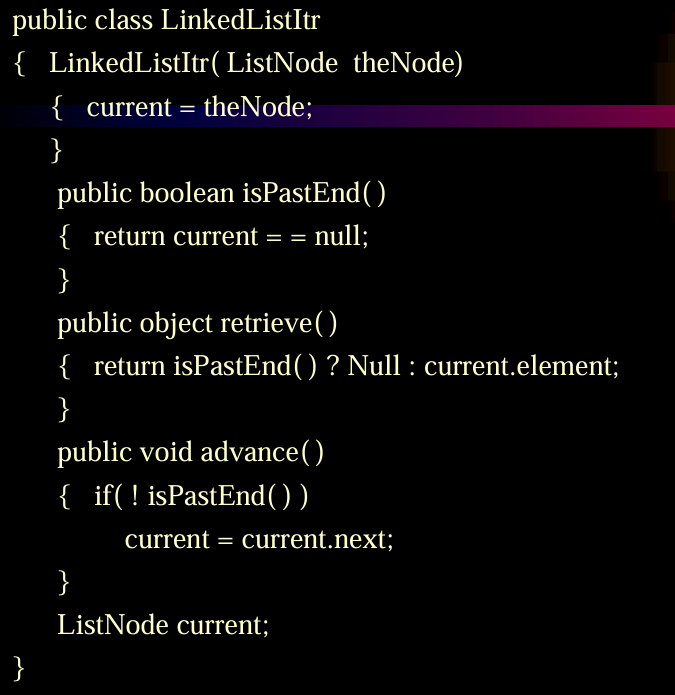\n\n\n\n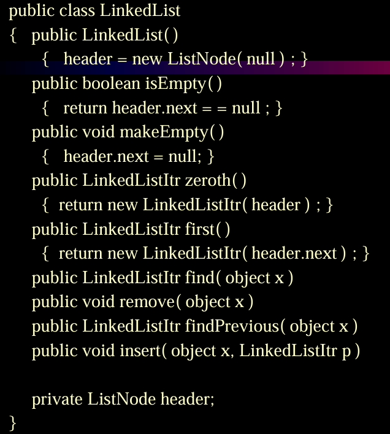\n\n\n\n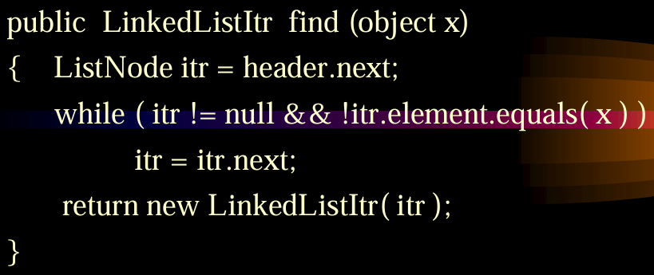\n\n\n\n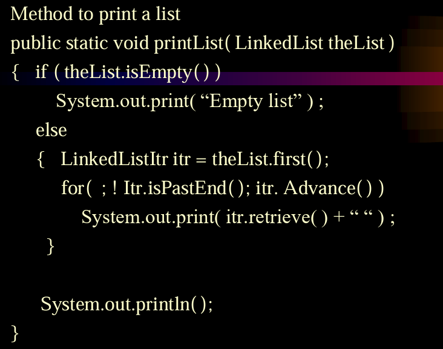\n\n\n\n

双向链表

\n\n\n\n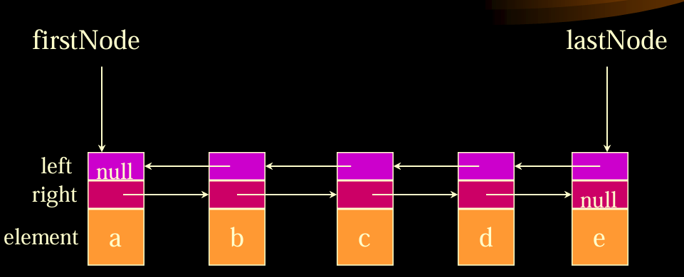\n\n\n\n

## 栈与队列（LIFO&FIFO表）

\n\n\n\n
    
    
    AbstractDataType Stack{\n instances\n list of elements;  one end is called the  bottom;  the other is the top;\n operations\n Create():Create an empty stack;\n IsEmpty():Return true if stack is empty,return  false otherwise\n IsFull ():Return true if stack if full,return false otherwise;\n Top():return top element of the stack;\n Add(x): add element x to the stack;\n Delete(x):Delete top element from stack and put it in x;\n 

\n\n\n\n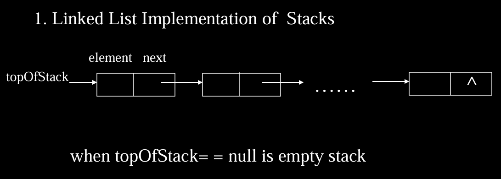\n\n\n\n
    
    
     public class StackLi \n{   public StackLi( ){ topOfStack = null; }\n public boolean isFull( ){ return false; }\n public boolean isEmpty( ){ return topOfStack = = null; }\n public void makeEmpty( ){ topOfStack = null; }\n public void push( object x )\n public object top( )\n public void pop( ) throws Underflow\n public object topAndPop( )\n private  ListNode  topOfStack;\n }\n 

\n\n\n\n
    
    
     public void push( object x )       \n{  topOfStack = new ListNode( x, topOfStack );\n }\n public object top( )     \n{  if( isEmpty( ) )\n return null;\n return topOfStack.element;\n }\n

\n\n\n\n
    
    
    public void pop( ) throws Underflow\n {  if( isEmpty( ) )      \nthrow new Underflow( );\n topOfStack = topOfStack.next;\n } \npublic object topAndPop( )    \n{  if( isEmpty( ) )\n return null;\n object topItem = topOfstack.element;\n topOfStack = topOfStack .next;\n return topItem;\n }\n

\n\n\n\n

队列（Queue）

\n\n\n\n
    
    
    AbstractDataType Queue\n {\n instances\n ordered list of elements;one end is called the front; the other is the rear;\n operations\n Create(): Create an empty queue;\n IsEmpty(): Return true if queue is empty,return  false otherwise;\n IsFull(): return true if queue is full, return false  otherwise; \nFirst(): return first element of the queue;\n Last(): return last element of the queue;\n Add(x): add element x to the queue;\n Delete(x): delete front element from the queue  and put it in x;\n }\n

\n\n\n\n

使用数组实现：最好采取环形的方式（防止free space挤在一端）

\n\n\n\n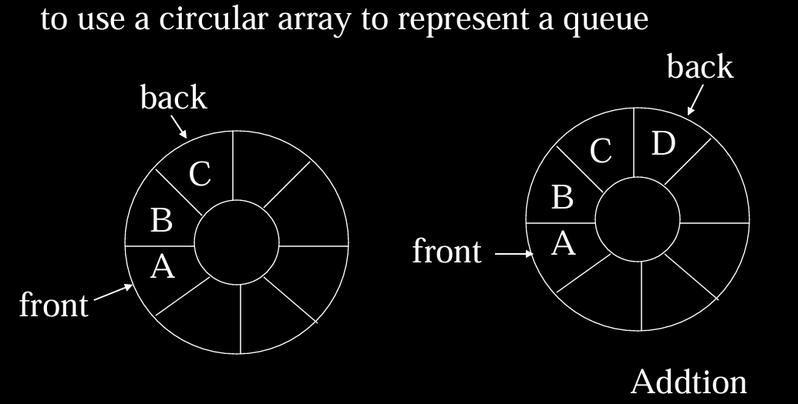\n\n\n\n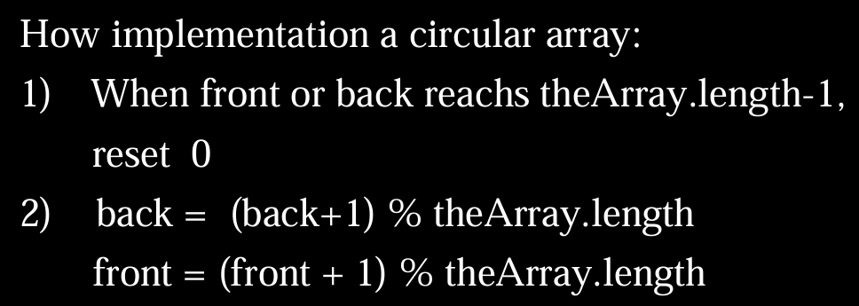\n\n\n\n
    
    
     Public class QueueAr\n {   \npublic QueueAr( )\n public QueueAr( int capacity )\n public boolean isEmpty( ){ return currentsize = = 0; }\n public boolean isfull( ){ return currentSize = = theArray.length; }\n public void makeEmpty( )\n public Object getfront( )\n public void enqueue( Object x ) throw Overflow\n private int increment( int x )\n private Object dequeue( )\n private Object [ ] theArray;\n private int currentSize;\n private int front;\n private int back;\n static final int DEFAULT_CAPACITY = 10;\n }\n

\n\n\n\n

链表实现

\n\n\n\n
    
    
     template<class T>class LinkedQueue\n {  public:\n LinkedQueue(){front=back=0;}\n ~LinkedQueue();\n bool IsEmpty()const{return ((front)?false:true);}\n bool IsFull()const;\n T First()const;\n T Last()const;\n LinkedQueue<T>&Add(const T& x); \nLinkedQueue<T>& Delete(T& x);\n private:\n Node<T>*front;    Node<T>*back;\n };

\n\n\n\n

## 树（Tree）

\n\n\n\n

节点的度：子节点个数  
树的度：节点度的最大值

\n\n\n\n

一些性质：有n个元素的二叉树有n-1条边  
如果叶子的个数是n0，度数为2的节点个数是n-1  

\n\n\n\n

The height of a binary tree that contains n(n>=0) element is at most n-1 and at least log2(n+1)-1(向上取整)

\n\n\n\n

完全二叉树：（堆）

\n\n\n\n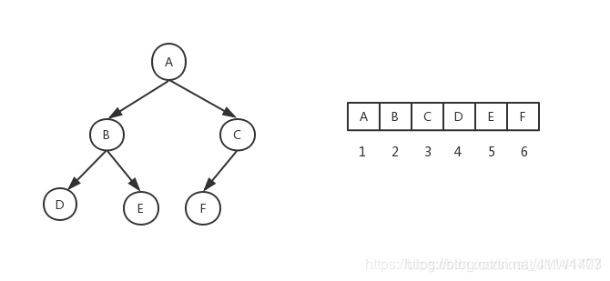\n\n\n\n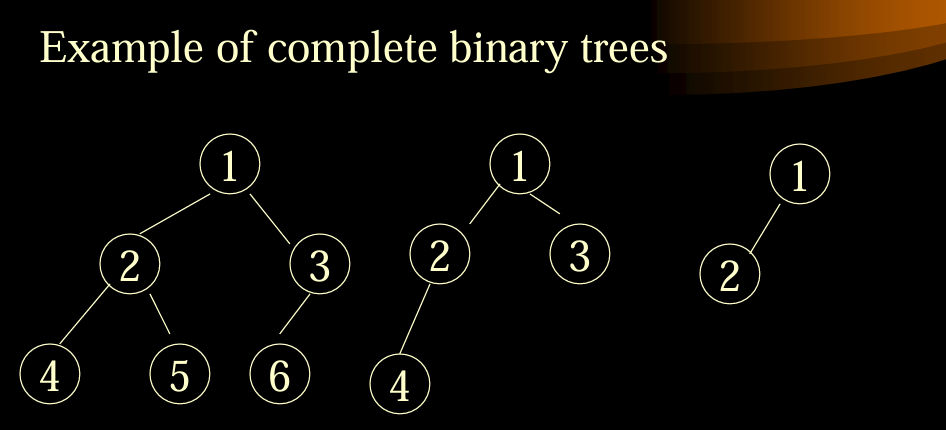\n\n\n\n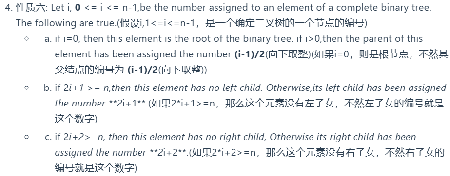\n\n\n\n

（这些性质也是使用数组存放堆的基本原理）

\n\n\n\n

因此非完全二叉树使用数组表达时可以把对应位置空出

\n\n\n\n

——链表表达的二叉树

\n\n\n\n\n\n\n\n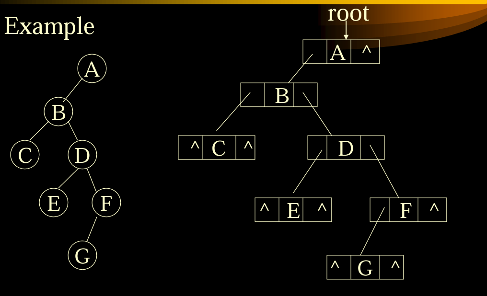\n\n\n\n
    
    
    class BinaryNode {\n    BinaryNode(){Left=Right=0;}\n    BinaryNode(Object e)\n        {element=e; Left=Right=0;}\n    BinaryNode(Object e,  BinaryNode l, BinaryNode r)\n        {element=e;  Left=l;  Right=r; }\n    Object element;\n    BinaryNode left;//left subtree\n    BinaryNode right;//right subtree\n};

\n\n\n\n
    
    
    template<class T>class BinaryTree {\n    public:\n        BinaryTree(){root=0;};\n        ~BinaryTree(){};\n        bool IsEmpty()const\n            {return ((root)?false:true);}\n        bool Root(T& x)const;\n        void MakeTree(const T& data, BinaryTree<T>& leftch, BinaryTree<T>& rightch);\n        void BreakTree(T& data , BinaryTree<T>& leftch, BinaryTree<T>& rightch);\n        void PreOrder(void(*visit)(BinaryNode<T>*u)) {PreOrder(visit, root);}\n        void InOrder(void(*visit)(BinaryNode<T>*u)) {InOrder(visit, root);}\n        void PostOrder (void(*visit)(BinaryNode<T>*u)) {PostOrder(visit, root);}\n        void LevelOrder (void(*visit)(BinaryNode<T> *u));\n    private:\n        BinaryNode<T>* root;\n        void PreOrder(void(*visit)(BinaryNode<T> *u),    BinaryNode<T>*t);\n        void InOrder(void(*visit)(BinaryNode<T> *u),   BinaryNode<T>*t);\n        void PostOrder(void(*visit) (BinaryNode<T> *u),  BinaryNode<T>*t);\n};

\n\n\n\n

四种遍历方式：

\n\n\n\n

1先序遍历

\n\n\n\n
    
    
    //递归实现先序遍历\ntemplate<class T>\nvoid PreOrder(BinaryNode<T>* t) {\n    // preorder traversal of *t.\n    if(t){\n        visit(t);\n        PreOrder(t->Left);\n        PreOrder(t->Right);\n    }\n}

\n\n\n\n

2中序遍历

\n\n\n\n
    
    
    template<class T>\nvoid InOrder(BinaryNode<T>* t) {\n    if(t){\n        InOrder(t->Left);\n        visit(t);\n        InOrder(t->Right);\n    }\n}\n//非递归使用stack实现中序遍历\nvoid Inorder(BinaryNode <T>*t){  \n    Stack<BinaryNode<T>*> s(10);\n    BinaryNode<T>*p = t;\n    for (;;){\n        //无条件进行循环\n        while(p!=NULL){\n            //一直进行压栈，直到最左下部分\n            s.push(p);\n            p = p->Left;\n        }\n        if(!s.IsEmpty()){\n            //出栈输出，然后指向右子树，之后重复上面计算到右子树的最左边的节点。\n            p = s.pop();\n            cout << p->element;\n            p = p->Right;\n        }else\n            return;\n    }\n}

\n\n\n\n

后序遍历

\n\n\n\n
    
    
    template<class T>\nvoid InOrder(BinaryNode<T>* t) {\n    if(t){\n        InOrder(t->Left);\n        InOrder(t->Right);\n        visit(t);\n    }\n}\n//非递归实现后序遍历\n//结点的实现\nstruct StkNode {\n    BinaryNode <T> * ptr;\n    int tag;//用来标记是否标记过了，第一次进栈为1，第二次进栈为2.\n}\n//非递归实现后序遍历\nvoid Postorder(BinaryNode <T> * t) {\n    Stack <StkNode<T>> s(10);\n    StkNode<T> Cnode;\n    BinaryNode<T>*p = t;\n    for(;;) {\n        //优先访问到最左下\n        while (p!=NULL){\n            Cnode.ptr = p;\n            Cnode.tag = 0;\n            s.push(Cnode);\n            p = p->Left;\n        }\n        //将最左下结点出栈\n        Cnode = s.pop();\n        p = Cnode.ptr;\n        while (Cnode.tag == 1)//从右子树回来 \n        {\n            //如果已经被访问一次了才进行输出\n            cout << p->element;\n            if (!s.IsEmpty()){\n                Cnode = s.pop();\n                p = Cnode.ptr;\n            }else{\n                //访问结束\n                return;\n            }   \n        }\n        Cnode.tag = 1;//从左子树遍历完，而右子树还没有动。\n        s.push(Cnode);\n        p = p->Right;//从左子树回来\n    }//for\n}      

\n\n\n\n

or

\n\n\n\n
    
    
    void PostOrder(BiTree T){\n\tInitStack(S);\n\tp=T;\n\tr=NULL;\n\twhile(p!=NULL||!IsEmpty(s)){\n\t\tif(p！=NULL){\t\t\t\t//走到最左边 \n\t\t\tpush(S,p);\n\t\t\tp=p->lchild;\n\t\t}\n\t\telse{\t\t\t\t//向右\n\t\t\tGetTop(S,p);\t//读栈顶节点（非出栈） \n\t\t\tif(p->rchild&&p->rchild!=r){\t//若右子树存在，且未被访问过 \n\t\t\t\tp=p->rchild;\t//转向右 \t\n\t\t\t}\n\t\t\telse{\t\t\t\t//否则弹出结点并访问 \n\t\t\t\tpop(S,p);\n\t\t\t\tvisit(p->data); //访问该结点\n\t\t\t\tr=p;\t\t\t//记录最近访问的结点 \n\t\t\t\tp=NULL;\t\t\t//结点访问完后，重置p指针\n\t\t\t}\n\t\t}\n\t}

\n\n\n\n

Thread Tree 线索树

\n\n\n\n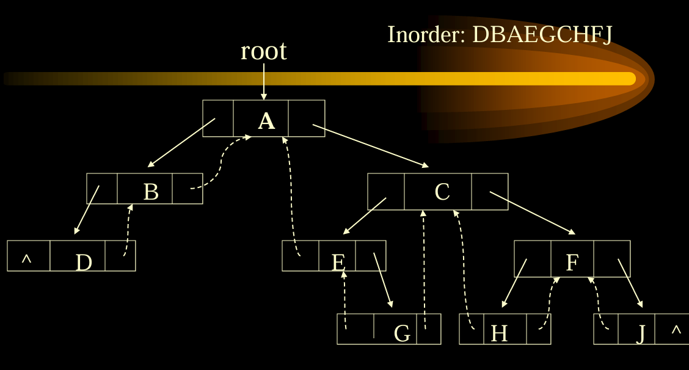\n\n\n\n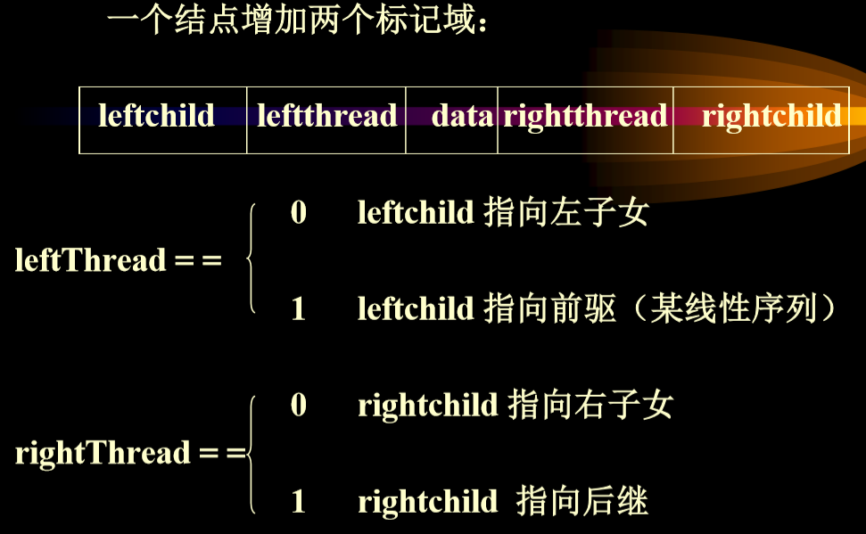\n\n\n\n

中序遍历的线索树

\n\n\n\n

leftchild leftthread data rightthread rightchild线索树的结点结构

\n\n\n\n
    
    
    template<class Type> \nThreadNode<Type>* ThreadInorderIterator<Type>::First( )\n {\n while (current->leftThread= =0) current=current->leftchild;\n return current;\n }\n template<class Type>\n ThreadNode<Type>* ThreadInorderIterator<Type>::Next( )\n {\n ThreadNode<Type>* p=current->rightchild;\n if(current->rightThread= =0)\n while(p->leftThread= =0) p=p->leftchilld;\n current=p;\n return current;\n }\ntemplate<class Type> \nvoid ThreadInorderIterator<Type>:: Inorder( )\n {\n ThreadNode<Type> *p;\n for ( p=First( ); p!=NULL; p=Next( ))\n cout<< p->data<<endl;\n }\n

\n\n\n\n

构造线索树

\n\n\n\n
    
    
    Void Inthread(threadNode<T> * T)\n {  stack <threadNode <T> *> s (10)\n ThreadNode <T>  * p = T ; ThreadNode <T> * pre = NULL;\n for (  ;  ;  )\n { 1.while (p!=NULL) \n{ s.push(p); p = p ->leftchild; }\n 2.if (!s.IsEmpty( ))\n {  \n p = s.pop;\n if (pre != NULL)\n { if (pre ->rightchild = = NULL)\n { pre ->rightchild = p;  pre ->rightthread = 1;}\n if ( p -> leftchild = = NULL)\n { p -> leftchild = pre ; p ->leftthread = 1;  }\n }\n pre = p ; \n p = p -> rightchild ;\n }\n else return;\n }//for\n }\n

\n\n\n\n

**树的应用**

\n\n\n\n

**哈夫曼树**

\n\n\n\n

\n
  1. 增长树(使得原来的树的每一个度数都为2)\n\n
     * 对原二叉树中度为1的结点，增加一个空树叶
\n\n\n\n
     * 对原二叉树中的树叶，增加两个空树叶
\n\n
\n\n\n\n
  2. 外通路长度(外路径)E **根到每个外结点**(增长树的叶子)的路径长度的总和(边数)\n\n
     * E = 3+3+2+3+4+4+3+3=25，如右上图例
\n\n
\n\n\n\n
  3. 内通路长度(内路径)I：**根到每个内结点**(非叶子)的路径长度的总和(边数)。原来的树上每一个节点到树根的长度的综合\n\n
     * I=2+1+0+3+2+2+1=11 如右上图例
\n\n
\n\n\n\n
  4. 结点的带权路径长度：一个结点的权值与结点的路径长度的乘积。\n\n
     * 每个结点的权重占有一定的值
\n\n
\n\n\n\n
  5. 带权的外路径长度：各叶结点的带权路径长度之和。
\n\n\n\n
  6. 带权的内路径长度：各非叶结点的带权路径长度之和。
\n
\n\n\n\n

### Huffman算法

\n\n\n\n

\n
  1. 思想：权大的外结点靠近根，权小的远离根。
\n\n\n\n
  2. 算法：从m个权值中找出两个最小值W1，W2构成
\n\n\n\n
  3. \n
\n\n\n\n

## 二叉搜索树（AVL）

\n\n\n\n

基本性质：每一个元素都含有一个关键字，并且每一个元素都有独一无二的关键字

\n\n\n\n

一个树的左子树的关键字小于根中的关键字

\n\n\n\n

一个树的右子树的关键字大于根中的关键字

\n\n\n\n

**二叉搜索树需要满足的事情:在很大的数据量下，要能够很快的进行增删查改。这也就是二叉搜索树的优越性。**

\n\n\n\n
    
    
    public class BinarySearchTree {\n    public BinarySearchTree(){ root = null; }\n    public void makeEmpty(){ root = null; }\n    public boolean isEmpty(){ return root == null;}\n    \n    public Comparable find( Comparable x )\n    {return elementAt( find( x, root));}\n    public Comparable findMin()\n    {return elementAt( findMin( root ) );}\n    public Comparable findMax()\n    {return elementAt( findMax( root ) );\n    public void insert( Comparable x )\n    {root = insert(  x, root );}\n    public void remove( Comparable x ) {root = remove( x, root ); }\n    public void printTree()//都是外部接口\n    \n    private BinaryNode root;\n    private Comparable elementAt( BinaryNode t ){ return t == null ? Null : t.element; }\n    private BinaryNode find( Comparable x, BinaryNode t )\n    private BinaryNode findMin( BinaryNode t )\n    private BinaryNode findMax( BinaryNode t )\n    private BinaryNode insert( Comparable x, BinaryNode t )\n    private BinaryNode remove( Comparable x, BinaryNode t )\n    private BinaryNode removeMin( BinaryNode t )\n    private void printTree( BinaryNode t )\n}\n//查找某个元素的算法\nprivate BinaryNode find( Comparable x, BinaryNode t ) {\n    if( t == null )\n        return null;\n    if( x.compareTo( t.element ) < 0 )\n        return find( x, t.left );\n    else if( x.compareTo( t.element ) > 0 )\n        return find( x, t.right );\n    else\n        return t;//Match \n}\n//查找值最小的结点\n//使用递归查找结点\nprivate BinaryNode findMin( BinaryNode t ) {  \n    if( t == null )\n        return null;\n    else if( t.left == null )\n        return t;\n    return findMin( t.left );\n}\n//迭代找最小结点\nprivate BinaryNode findMin(BinaryNode t){\n    if(t != null){\n        while(t.left != null){\n            t = t.left;\n        }\n    }\n    return t;\n}\n//递归找到最大结点\nprivate BinaryNode findMax( BinaryNode t){\n    if(t == null){\n        return null;\n    }else if(t.right == null){\n        return t;\n    }\n    return findMax(t.right);\n}\n//迭代找到最大结点\nprivate BinaryNode findMax( BinaryNode t ) { \n    if( t != null )\n        while( t.right != null )\n            t = t.right;\n    return t;\n}\n//将数值插入固定位置的算法\nprivate BinaryNode insert( Comparable x, BinaryNode t ) {\n    //先查找一次，如果找到了就不用进行查找\n    if( t == null )\n        t = new BinaryNode( x, null, null );\n    else if( x.compareTo( t.element ) < 0 )\n        t.left = insert( x, t.left );\n    else if( x.compareTo( t.element ) > 0 )\n        t.right = insert( x, t.right );\n    else ;//duplicate; do nothing\n    return t;\n}

\n\n\n\n

\n
  1. 最坏的情况就是把一个有序的数列添加进入到空的二叉搜索树中去。
\n
\n\n\n\n

如何删除：

\n\n\n\n

\n
  1. 如果结点本身不在树内，那么不需要删除
\n\n\n\n
  2. 如果结点本身在树里面，删除需要分类\n\n
     1. 无子树:删除叶节点
\n\n\n\n
     2. 一颗子树:直接连接
\n\n\n\n
     3. 两颗子树:可以选择左子树的最大结点作为新结点
\n\n
\n
\n\n\n\n

### AVL tree自平衡的二叉搜索树

\n\n\n\n

\n
  1. AVL树是一个二叉搜索树
\n\n\n\n
  2. AVL树的每一个节点满足|hL-hR|<=1 where hL and hR are the heights of TL(left subtree) and TR(right subtree),respectively.对于每一个结点，其左子树和右子树的高度之差不超过1
\n\n\n\n
  3. 注:树叶之间之差未必小于一，但是一个节点的左右子树的高度不能大于一
\n
\n\n\n\n

例如图 2.1 不是平衡二叉树，因为结点 60 的左子树不是平衡二叉树

\n\n\n\n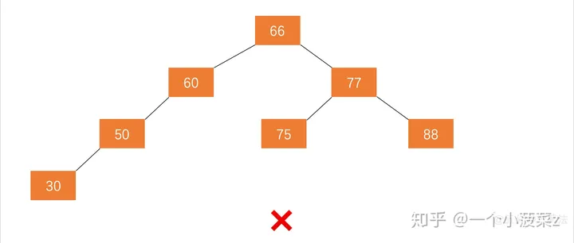\n\n\n\n
    
    
    class AVLNode {\n    AVLNode(Comparable theElement) {\n        this( theElement, null, null);\n    }\n    AVLNode(Compalable theElement, AVLNode lt, AVLNode rt) {\n        element = theElement;\n        left = lt;\n        right = rt;\n        height = 0;\n    }\n    Comparable element;\n    AVLNode left;\n    AVLNode right;\n    int height;\n}\nprivate static int height( AVLNode t ) {   \n    return t =s= null ? –1 : t. height;\n}

\n\n\n\n

AVL树的插入操作：

\n\n\n\n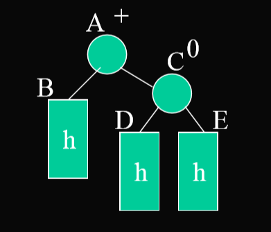\n\n\n\n

\n
  1. 简单来看，每一个子树都可以被看为如上的图
\n\n\n\n
  2. 算法流程:是递归从下向上进行旋转处理，先看子树
\n
\n\n\n\n

**插入C的右子树E(外侧结点)**

\n\n\n\n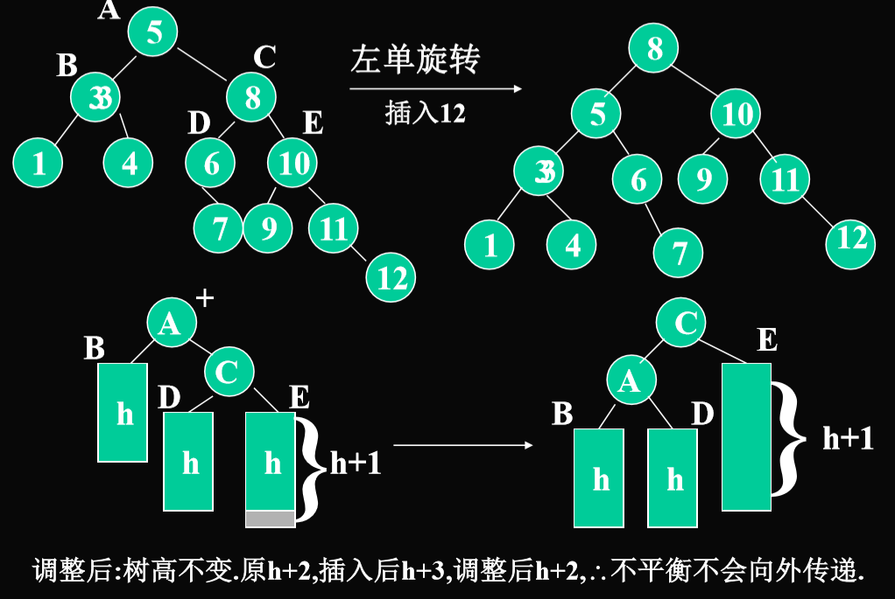\n\n\n\n

注意左单旋转的方式：C树原本的左子树迁移成原来C的父节点A的右子树

\n\n\n\n

**插入C的左子树D(内侧结点)**

\n\n\n\n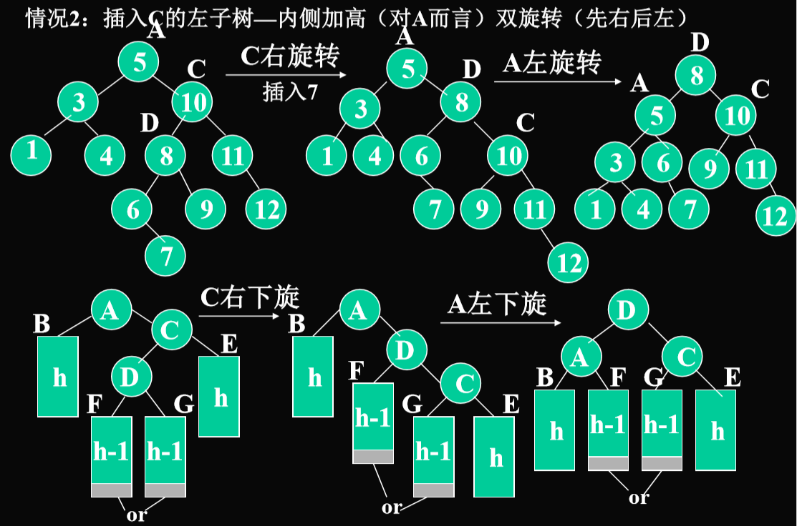\n\n\n\n

#### 插入其他地方，树不需要转

\n\n\n\n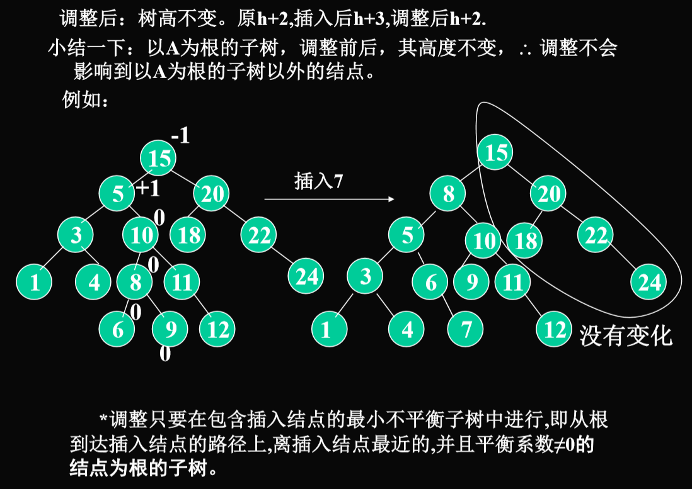\n\n\n\n

\n
  1. 一直到5的时候，树的平衡性才受到影响
\n\n\n\n
  2. 插入后，树的平衡性没有被破坏显然不用旋转
\n\n\n\n
  3. 调整只要在包含插入结点的最小不平衡子树中进行，即从到达插入结点的路径上，离插入结点最近的，并且平衡系数!=0的**结点为根的子树**.
\n
\n\n\n\n

总结：

\n\n\n\n

\n
  1. 算法思想:插入一个新结点后，需要从插入位置沿通向根的路径回溯，检查各结点左右子树的高度差，如果发现某点高度不平衡则停止回溯。\n\n
     * 先确定节点是在外侧还是内侧,决定是单旋还是双旋
\n\n
\n\n\n\n
  2. 单旋转：**外侧** —从不平衡结点沿刚才回溯的路径取直接下两层如果三个结点处于一直线A，C，E
\n\n\n\n
  3. 双旋转：**内侧** —从不平衡结点沿刚才回溯的路径取直接下两层如果三个结点处于一折线A，C，D
\n\n\n\n
  4. 以上以右外侧，右内侧为例，左外侧，左内侧是对称的。与前面对称的情况：左外侧，左内侧 左外侧
\n
\n\n\n\n

右下：

\n\n\n\n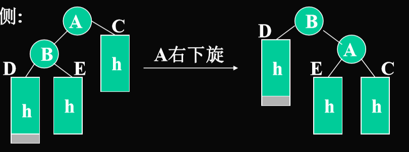\n\n\n\n

左下

\n\n\n\n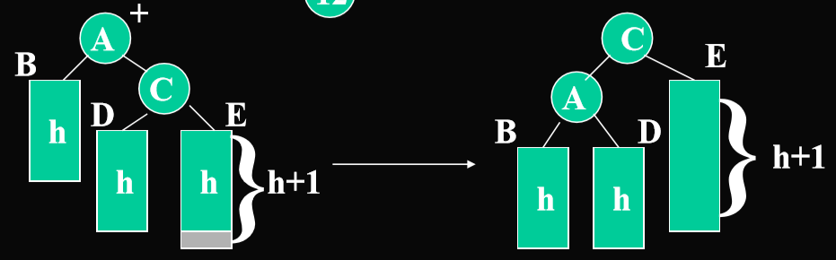\n\n\n\n

左内

\n\n\n\n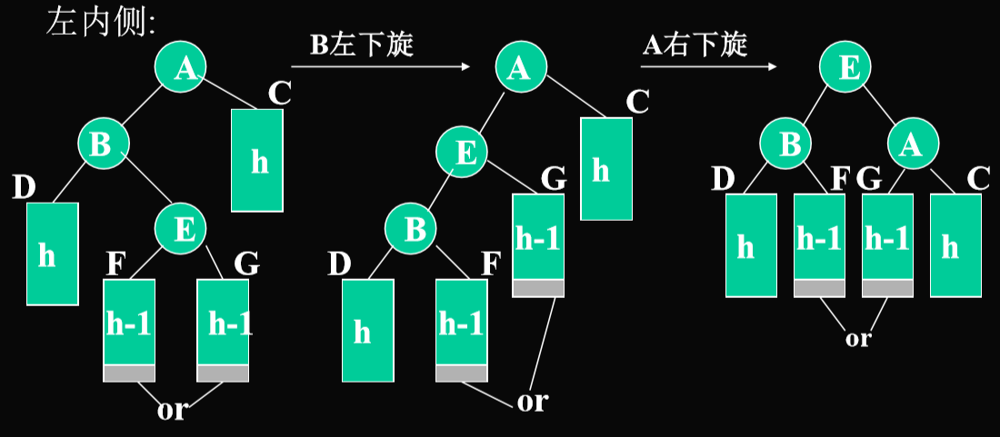\n\n\n\n

右内

\n\n\n\n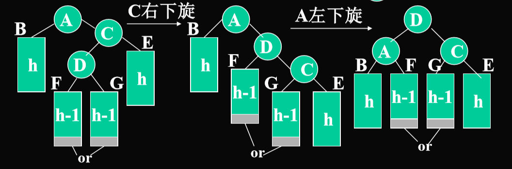\n\n\n\n

\n
  1. 首先要找到正确的位置进行插入
\n\n\n\n
  2. 找到有可能发生不平衡的最小不平衡子树
\n\n\n\n
  3. 判别插入在不平衡子树的外侧还是内侧
\n\n\n\n
  4. 根据3的判别结果,再进行单旋还是双旋
\n
\n\n\n\n

AVL树的删除：

\n\n\n\n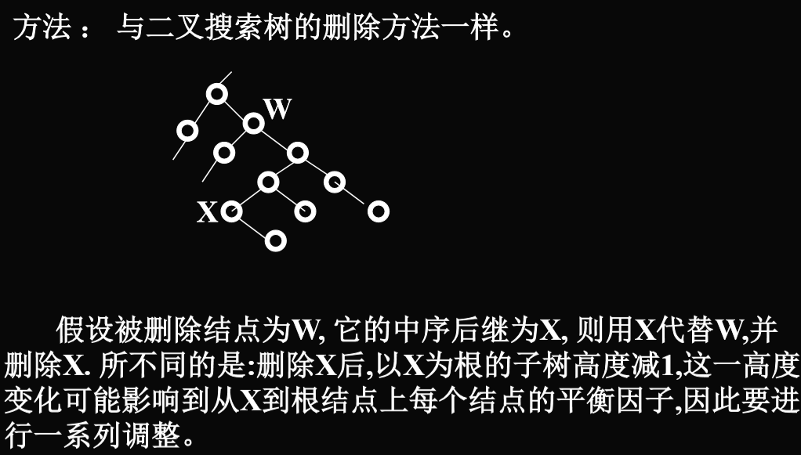\n\n\n\n

举例：

\n\n\n\n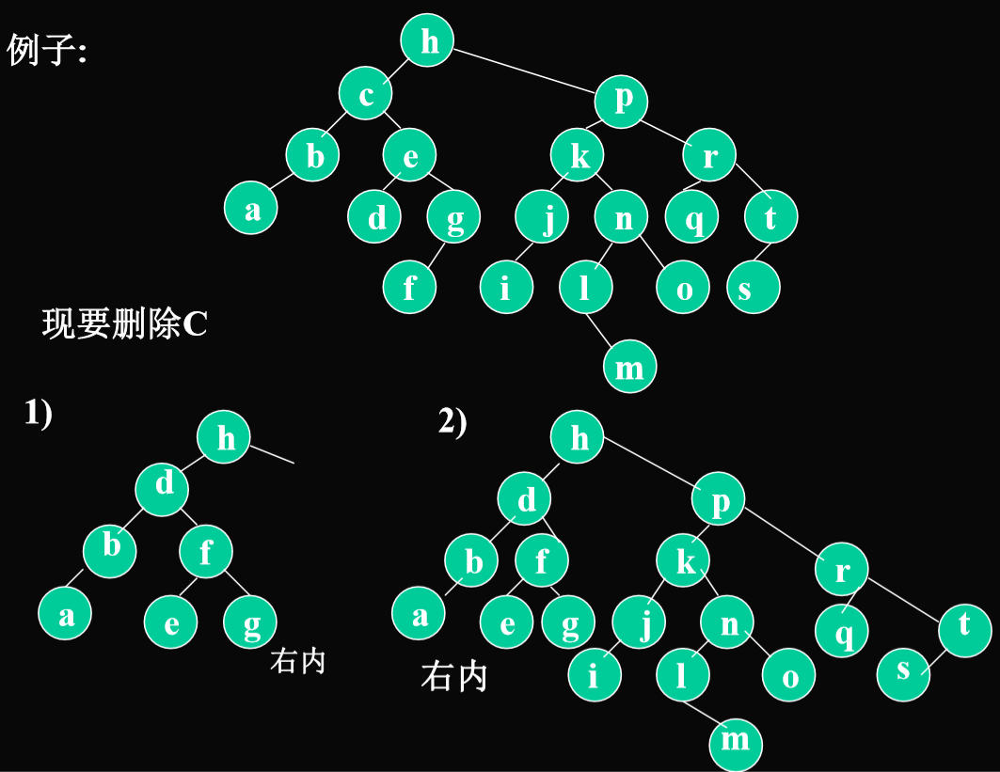\n\n\n\n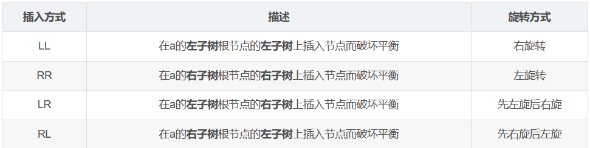\n\n\n\n

\n\n\n\n

## B树（m叉搜索树）

\n\n\n\n

搜索树可能为空。如果是一个非空的树，则为满足以下属性的树：  
1.在相应的扩展搜索树(用外部节点替换零指针获得)中，每个内部节点最多有m个子节点，在1和m-1元素之间。

\n\n\n\n

2.每个具有p元素的节点正好有p+1子节点。

\n\n\n\n

c0,c1,……,cp be the p+1 children of the node 假设任何节点都有p个元素，那么C0 - Cp是他们对应的p+1个子元素。

\n\n\n\n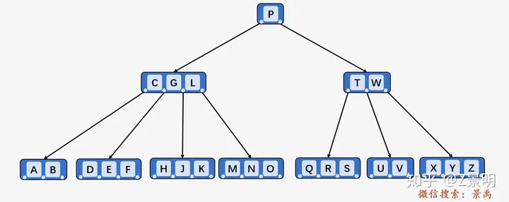\n\n\n\n

1）每个结点最多有m-1个关键字。

\n\n\n\n

2）根结点最少可以只有1个关键字。

\n\n\n\n

3）非根结点至少有Math.ceil(m/2)-1个关键字

\n\n\n\n

4）每个结点中的关键字都按照从小到大的顺序排列，每个关键字的左子树中的所有关键字都小于它，而右子树中的所有关键字都大于它。

\n\n\n\n

**操作：**

\n\n\n\n

插入：（第一种是m路搜索树的插入）  
如果一层没有满，就在同一级进行插入。(针对的是m叉的情况)  
如果这一层已经满了，那么在下一层进行插入。

\n\n\n\n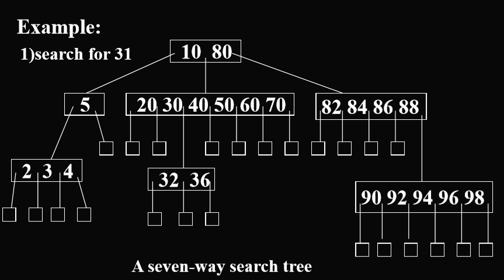\n\n\n\n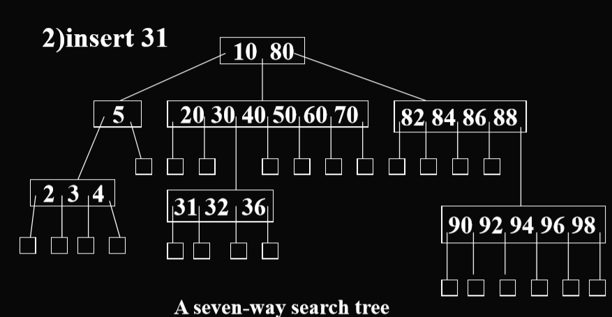\n\n\n\n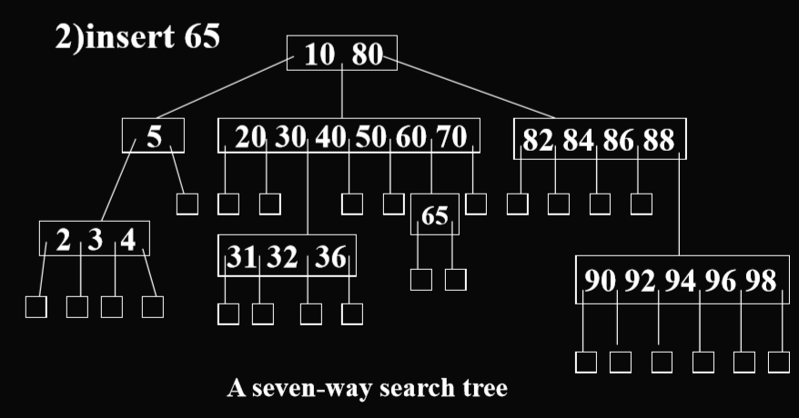\n\n\n\n

或者更加严谨的是使用分裂法（下图部分数据有误自行识别）

\n\n\n\n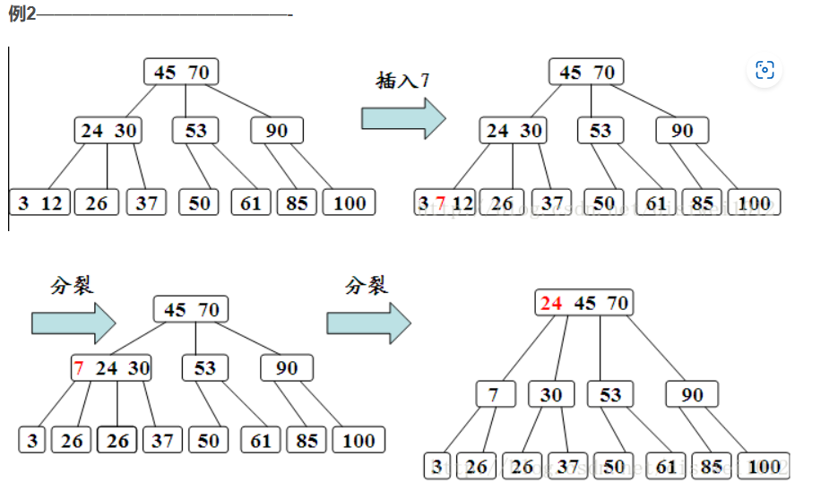\n\n\n\n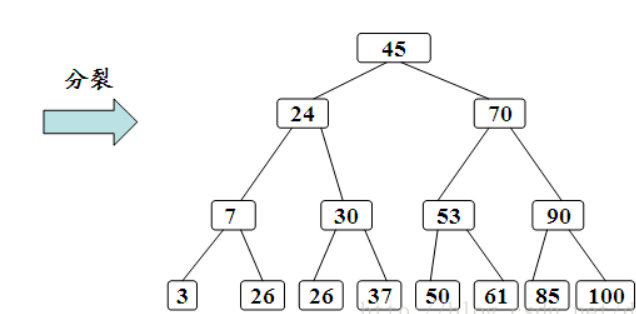\n\n\n\n

删除操作：

\n\n\n\n

\n
  1. 删除元素不会影响树的叉数，物理层次影响叉数。
\n\n\n\n
  2. 类型一:同一层还有节点，直接删除没有影响
\n\n\n\n
  3. 类型二:本层删除后没有节点，所以需要把底下能合适的最大(最小)的进行提升
\n
\n\n\n\n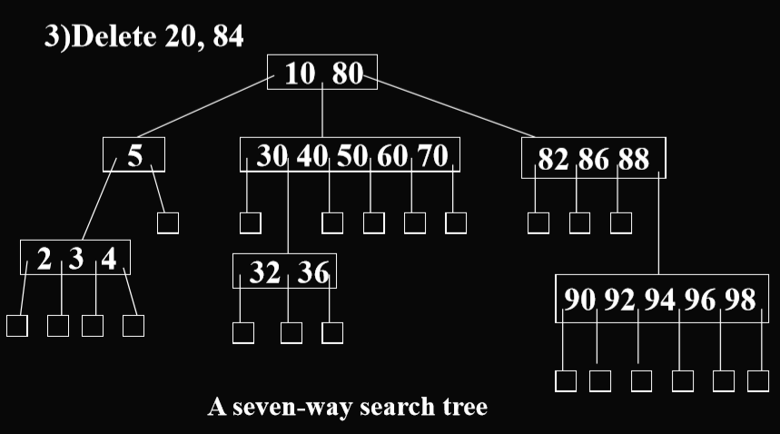\n\n\n\n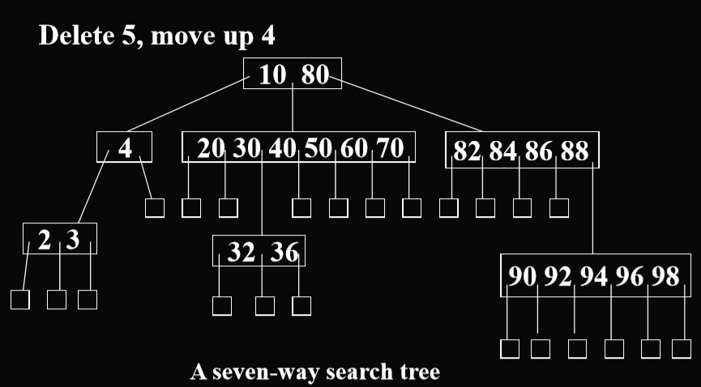\n\n\n\n

the height of a m-way search tree with n elements is between logm(n+1) and n

\n\n\n\n

m叉搜索树和B树的区别：

\n\n\n\n

\n
  1. 根节点至少有两个孩子
\n\n\n\n
  2. 除了根节点以外，所有内部节点至少有[m/2]个孩子
\n\n\n\n
  3. 所有外部节点位于同一层上，叶节点不包含任何关键字信息
\n\n\n\n
  4. 每个节点至多有m个孩子
\n\n\n\n
  5. 有k个孩子的非叶节点恰好包含k-1个关键字
\n
\n\n\n\n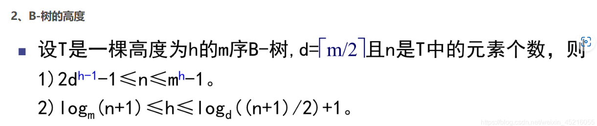\n\n\n\n

删除操作：

\n\n\n\n

\n
  1. case1:The element to be deleted is in a node whose children are external nodes(i.e.the element is in a leaf)(将要被删除的元素的关键码的子节点是外部结点[小正方形])\n\n
     * 如果有超过(m/2)(向上取整)个关键码，直接删除
\n\n\n\n
     * 如果关键码个数不足(m/2)(向上取整)个，那么向邻居**借关键码** ，如果够借，那么进行调整。如果不够借，那么合并邻居与此节点(还要拉下来一个上级节点的关键码)，这样子也可能会导致上级节点的关键码不足，如果根节点合并，则其高度被减少1。
\n\n
\n\n\n\n
  2. case2: The element is to be deleted from a nonleaf. (要被删除的结点是一个非叶节点)\n\n
     * 删除这个节点
\n\n\n\n
     * 把这个节点替换成右子树中的最小关键码(或者左子树中的最大关键码)
\n\n\n\n
     * 因为相当于删除了右子树的最小关键码(或者左子树中的最大关键码)，所以重复删除叶结点关键码的操作。
\n\n
\n
\n\n\n\n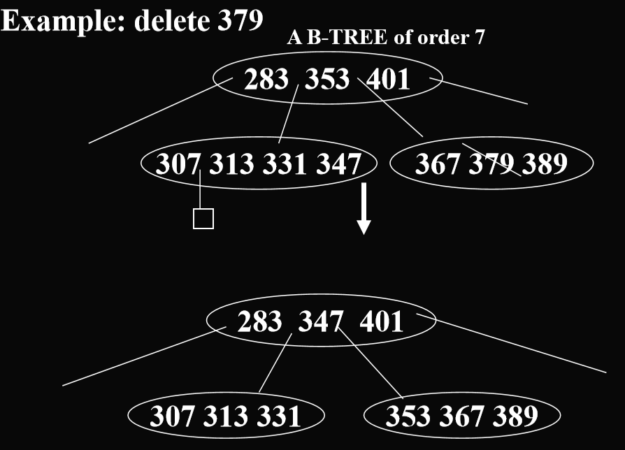\n\n\n\n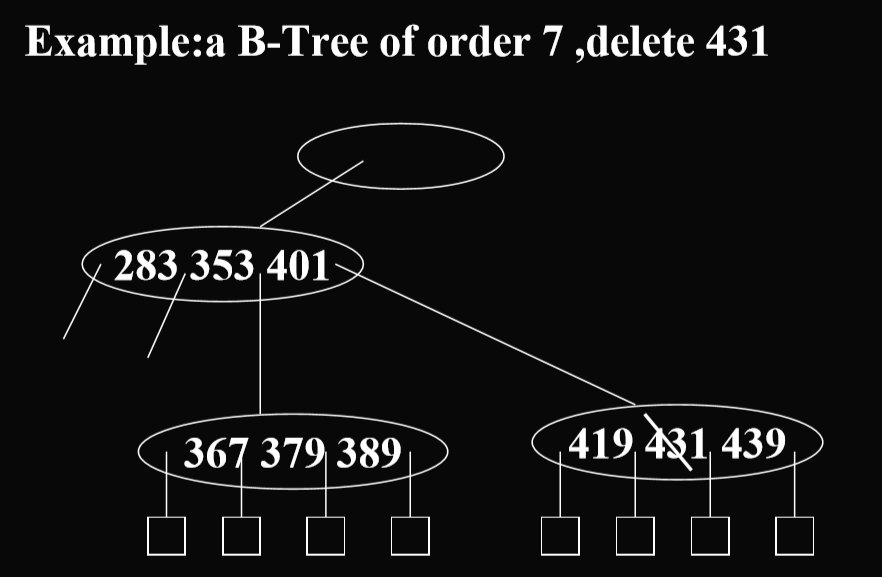\n\n\n\n

## 优先队列（堆）

\n\n\n\n

在最小优先级队列中，当需要删除一个元素的时候，我们找到优先级最小的元素来删除

\n\n\n\n

最大堆是一个完全二叉树，由于可以完成优先队列所需要的优先出，所以一般用堆的结构来表示优先队列，即使用完全二叉树表示

\n\n\n\n
    
    
    template<class T>class MaxHeap\n{\n    public:\n        MaxHeap(int MaxHeapSize=10);\n        ~MaxHeap(){delete[]heap;}\n        int size()const{return CurrentSize;}\n        T Max(){\n            if (CurrentSize==0) throw OutOfBounds();\n            return heap[1];\n        }\n        MaxHeap<T>&insert(const T&x); \n        MaxHeap<T>& DeleteMax(T& x);\n        void initialize(T a[], int size,  int ArraySize);\n    private:\n        int CurrentSize, MaxSize;\n        T * heap;\n}

\n\n\n\n

最大堆的构造（同时也是插入操作）

\n\n\n\n
    
    
    template<class T>MaxHeap<T>& MaxHeap<T>:: Insert(const T& x){\n    if(CurrentSize= =MaxSize) throw NoMem(); \n    int i=++CurrentSize;\n    while(i!=1&&x>heap[i/2]){\n        //0不使用\n        heap[i]=heap[i/2];\n        //不必每次都进行完全交换\n        i/=2;\n    }\n    heap[i]=x;\n    return *this;\n}

\n\n\n\n

删除操作：

\n\n\n\n

一般采用与最后一位做交换之后直接删除，然后对这个小的节点做向下调整（在该结点的儿子中，找一个最大的，与该结点交换，重复此过程直到底层。）

\n\n\n\n
    
    
    void down(int x) {\n  while (x * 2 <= n) {\n    t = x * 2;\n    if (t + 1 <= n && h[t + 1] > h[t]) t++;\n    if (h[t] <= h[x]) break;\n    std::swap(h[x], h[t]);\n    x = t;\n  }\n}

\n\n\n\n
    
    
    void build_heap_2() {\n  for (i = n; i >= 1; i--) down(i);\n}

\n\n\n\n

堆排序：

\n\n\n\n

初始化一个n个元素的最大堆，每次我们删除最大的元素，调整堆的时间复杂度为O(log2n)

\n\n\n\n

例子:{21,25,49,25*,16,08} 

\n\n\n\n

## 并查集（Disjoint set）

\n\n\n\n

假设我们有一个n个元素组成的集合U = {1,2,…,n},一个有r个关系的集合R.当切仅当以下条件成立的时候，R才是一个等价类

\n\n\n\n

\n
  1. Reflexive x ≡ x.(自反性)
\n\n\n\n
  2. Symmetric x ≡ y,y ≡ x(对称性)
\n\n\n\n
  3. Transitive x ≡ y and y ≡ z,then x ≡ z(传递性)
\n
\n\n\n\n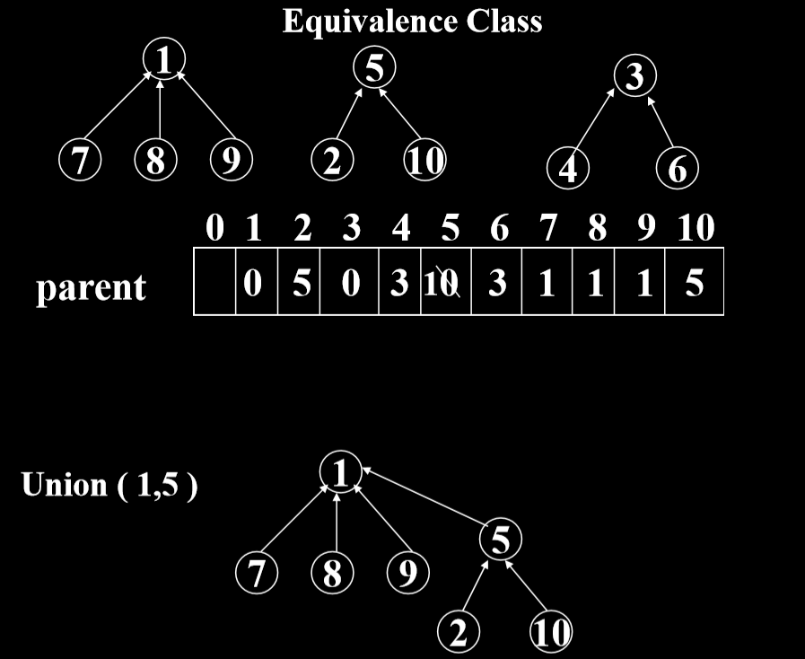\n\n\n\n

并查集的物理实现：森林

\n\n\n\n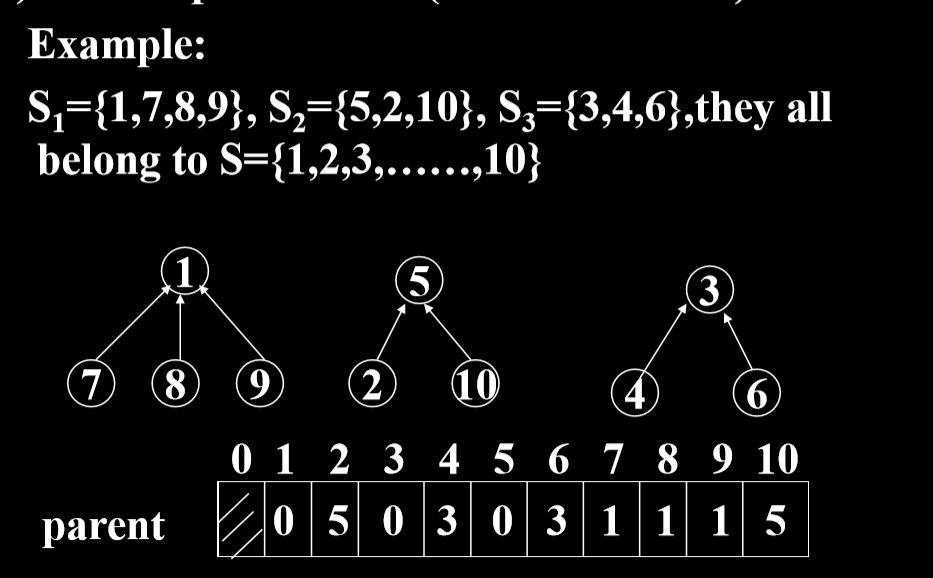\n\n\n\n

\n
  2. parent数组中存储的值为0的时候，这个结点表示为根结点
\n\n\n\n
  3. 所以这个更快速的支持从下向上查询
\n
\n\n\n\n
    
    
    //simple tree solution to union-find problem \n//使用简单的树结构解决并集的查找问题\nvoid Initialize(int n){\n    parent=new int[n+1];\n    for(int e=1;e<=n;e++) parent[e]=0;\n}\nint Find(int e) {\n    //向上找到其根结点\n    while(parent[e]) e=parent[e];\n    return e;\n}\nvoid Union(int i, int j) {\n    //合并两个结点\n    parent[j]=i;\n} 

\n\n\n\n
    
    
    public class DisjSets {\n    public DisjSets( int numElements )\n    public void union( int root1, int root2 )\n    public int find( int x ) private int [] s;\n}\n//并查集的构造方法\npublic DisjSets( int numElements ) {\n    s = new int [numElements];\n    for( int i = 0; i < s.length; i++ )\n        s[i] = -1; //一个根结点\n}\n//并查集的合并\npublic void union( int root1, int root2 ) {\n    s[root2] = root1;\n}\n//并查集的查找，使用递归完成\npublic int find( int x ) {\n    if( s[x] < 0 )\n        return x;\n    else\n        return find( s[x] );\n}

\n\n\n\n

有关性能提升：

\n\n\n\n

\n
  1. 为了实现我们新建一个bool类型数组来记录是否是根节点。
\n\n\n\n
  2. Besides the parent field, each node has a boolean field root .The root field is true iff the node is presently a root node.The parent field of each root node is used to keep a count of the total number of nodes in the tree.(除了父字段外，每个节点都有一个布尔字段根。如果当前节点是根节点，则根字段为真。每个根节点的父字段用于统计树中的节点总数。)\n\n
     * 也就是单独使用了一个布尔数组来实现是否为根。（根节点存大小）
\n\n
\n
\n\n\n\n
    
    
    void Initialize(int n) {\n    root=new bool[n+1];\n    parent=new int[n+1];\n    for(int e=1;e<=n;e++) {\n        parent[e]=1;\n        root[e]=true;\n    }\n}\nint Find(int e) {\n    while(!root[e])\n        e=parent[e];\n    return e;\n}\nvoid Union(int i, int j) {\n    if(parent[i]<parent[j])\n    //i becomes subtree of j\n    {\n        parent[j]=parent[j]+parent[i];\n        root[i]=false;\n        parent[i]=j;\n    } else {\n        parent[i]=parent[i]+parent[j];\n        root[j]=false;\n        parent[j]=i;\n    }\n}

\n\n\n\n

也可以采用“负数计数”直接标记根节点，省去bool数组

\n\n\n\n

其他方式——路径压缩，直接连接到根节点

\n\n\n\n

## 图（graph）

\n\n\n\n

（暂时不考虑自环和多重边）

\n\n\n\n

\n
  1. 对于无向图只有度数，而对于有向图不仅仅有入度，还有出度。
\n\n\n\n
  2. degree dv of vertex v, TD(v): is the number of edges incident on vertex v. In a directed graph :(顶点v的度数为dv，TD(V)是顶点v的度数，在有向图中)\n\n
     1. in-degree of vertex v is the number of edges incident to v, ID(v).(顶点v的入度是指向顶点v的边的个数)
\n\n\n\n
     2. out-degree of vertex v is the number of edges incident from the v, OD(v). (顶点v的出度从v出发的边的个数)
\n\n
\n\n\n\n
  3. 性质:(度数)TD(v)=ID(v)+OD(v)
\n
\n\n\n\n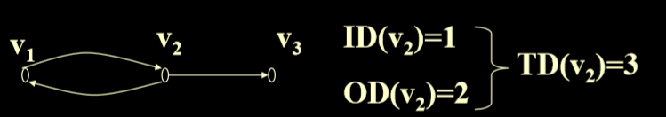\n\n\n\n

所有的度数加起来是边的个数的两倍

\n\n\n\n

在图 G=(V，E)中，如果每j的边(ij，ij+1)在E中，1<= j< k，则顶点序列P=i1，i2，…,ik是i1到ik的路径。

\n\n\n\n

简单路径 : 路径除了第一个和最后一个顶点中**没有出现相同** 的顶点

\n\n\n\n

图的总抽象：

\n\n\n\n
    
    
    AbstractDataType Graph {\n    //instances 实例\n        a set V of vertices and a set E of edges 顶点集合V 和 边集E\n    //operations 操作\n        Create(n):create an undirected graph with n vertices and no edges 创建一个n个顶点没有边的无向图\n        Exist(i,j): return true if edge(i,j)exists; false otherwise 当且仅当存在边i、j的时候返回true\n        Edges():return the number of edges in the graph 返回图的边的个数\n        Vertices():return the number of vertices in the graph 返回图的顶点个数\n        Add(i,j): add the edge(i,j) to the graph 将i、j边添加到图中\n        Delete(i,j):delete the edge (i,j) 删除边i、j \n        Degree(i): return the degree of vertex i 返回顶点i的度数\n        InDegree(i): synonym for degree 和度数相同\n        OutDegree(i): synonym for degree 和度数相同\n  }

\n\n\n\n

图的视线与表示：

\n\n\n\n

1。邻接矩阵

\n\n\n\n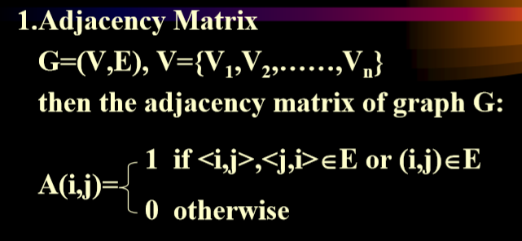\n\n\n\n

**无向图的每个顶点的度数等于矩阵中每一行的和**

\n\n\n\n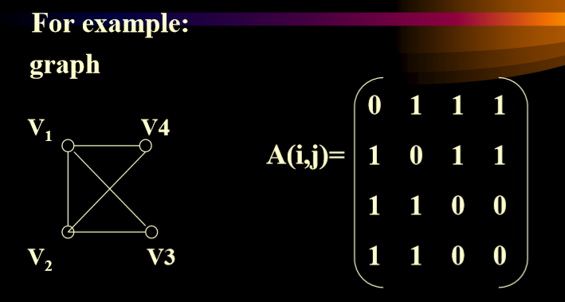\n\n\n\n

\n
  2. 有向图的邻接矩阵\n\n
     * **出度对行求和**
\n\n\n\n
     * **入度对列求和**
\n\n
\n
\n\n\n\n

## 其他需要的结构

\n\n\n\n

\n
  1. 一个记录各顶点信息的表
\n\n\n\n
  2. 一个当前的边数
\n
\n\n\n\n
    
    
    const int MaxNumEdges = 50// 最大边数\nconst int MaxNumVertices = 10//最大顶点数 \ntemplate<class NameType, class DistType> class Graph{\n    private:\n        SeqList<NameType> VerticesList(MaxNumVertices) //顶点表\n        DistType Edge [MaxNumVertices] [MaxNumVertices]  //邻接矩阵，一定是方阵\n        int CurrentEdges;//当前边数\n        int FindVertex (Seqlist <NameType> &L; const  NameType &Vertex)\n            {return L.Find(Vertex);}\n        int GetVertexPos (const NameTyoe &Vertex)\n            {return FindVertex(VerticesList);}// 给出了顶点Vertex在图中的位置\n    public:\n        Graph (const int sz=MaxNumEdges); \n        int GraphEmpty() const{return VerticesList.IsEmpty();}\n        int GraphFull() const{return VerticesList.IsFull() || CurrentEdges= =MaxNumEdges;}\n\n        int NumberofVertices(){return VerticesList.last;}\n        int NumberofEdges() {return CurrentEdges;}\n        NameType Getvalue(const int i) {return  i>=0 && i<VerticesList.last ? VerticesList.data[i] :  NULL;} \n        DistType Getweight (const int v1,const int v2);\n        \n        int GetFirstNeighbor(const int v); \n        int GetNextNeighbor(const int v1,const int v2);\n        \n        void InsertVertex(const NameType & Vertex);\n        void InsertEdge(const int v1,const int v2, DistType weight);\n        void removeVertex(const int v);\n        void removeEdge(cosnt int v1,const int v2);\n} 

\n\n\n\n

求顶点V的第一个邻接顶点的位置：

\n\n\n\n
    
    
    template<class NameType, class DistType> int Graph<NameType, DistType>::GetFirstNeighbor(int v) {\n    if (v!=-1) {\n        for(int col=0; col<CurrentVertices; col++)\n            if (Edge[v][col]>0 && Edge[v][col]<max)\n                return col;\n    }\n    return -1;\n}

\n\n\n\n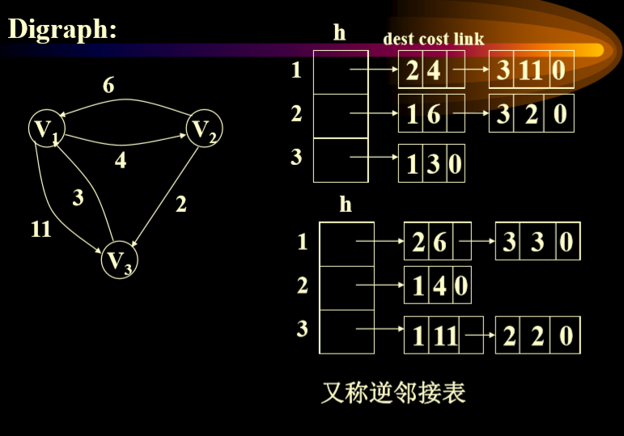\n\n\n\n

邻接多重表

\n\n\n\n

\n
  1. 在无向图中, 如果边数为m, 则在邻接表表示中需2m个单位来存储. 为了克服这一缺点, 采用邻接多重表, 每条边用一个结点表示.\n\n
     * 其中的两个结点号就是边的两个点。
\n\n\n\n
     * path1指向的就是同样始点(vertex1)，顺序终点的结果。
\n\n\n\n
     * path2执行的是以vertex2为始点顺序向下的。
\n\n
\n
\n\n\n\n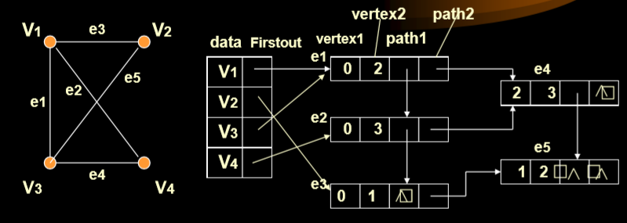\n\n\n\n

**DFS**

\n\n\n\n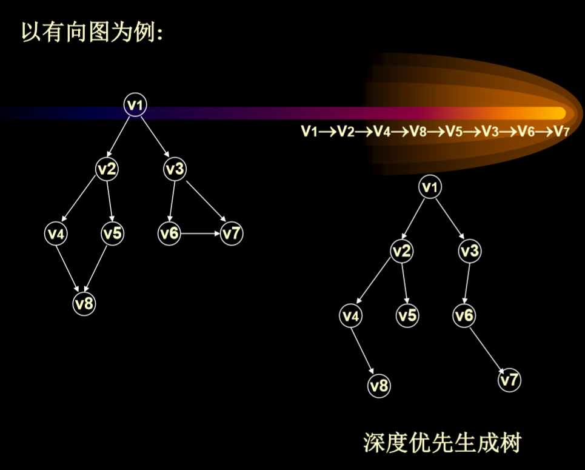\n\n\n\n

\n
  2. 递归方法实现 算法中用一个辅助数组visited[]:\n\n
     1. 0:未访问
\n\n\n\n
     2. 1:访问过了
\n\n\n\n
     3. 我们假设图为连通图
\n\n
\n
\n\n\n\n
    
    
    //利用的是邻接矩阵来表示的图\n//主过程:\ntemplate<NameType,DistType> void Graph<NameType,DistType>::DFS( ) {\n    int *visited=new int[NumVertices];\n    for ( int i=0; i<NumVertices; i++)\n        visited[i]=0;\n        DFS(0,visited);//从顶点0开始深度优先搜索\n        delete[] visited;//释放visited的空间\n    }\n//子过程\ntemplate<NameType,DistType> void Graph<NameType,DistType>::DFS(int v, visited[]) {\n    cout<<GetValue(v)<<"";\n    visited[v]=1;\n    int w = GetFirstNeighbor(v);\n    while (w!=-1) {\n        if(!visited[w])\n            DFS(w,visited);//最坏情况，就是每一次w都没有被访问过\n        w = GetNextNeighbor(v,w);\n    }\n    //无论如何，最坏情况下访问次数，也就只能是图中所有边的个数。\n    //也就是对邻接矩阵所有边会被扫一遍\n}

\n\n\n\n

**BFS**

\n\n\n\n

同样需要一个visited来存储是否访问过，还需要一个队列,记正在访问的这一层和上一层的顶点. 算法显然是非递归的.

\n\n\n\n
    
    
    template<NameType,DistType> void Graph<NameType,DistType>::BFS(int v) {\n    //这个算法使用了队列\n    int* visited=new int[NumVertices];\n    for (int i=0; i<NumVertices; i++)\n        visited[i]=0;\n    cout << GetValue(v) << "";\n\n    //访问结点\n    visited[v]=1;\n\n    //使用队列来存储顶点\n    queue<int> q;\n    q.EnQueue(v);\n    while(!q.IsEmpty()) {\n        v= q.DeQueue();\n        int w= GetFirstNeighbor(v);\n        while (w!=-1) {\n            if(!visited[w]) {\n                cout<<GetValue(w)<<""; \n                visited[w]=1;\n                q.EnQueue(w);\n            }\n            w= GetNextNeighbor(v,w);\n            //访问完成一层的结点\n        }\n    }\n    delete[] visited;\n}

\n\n\n\n

求非连通图的遍历，只需要在深度优先搜索处，加上以所有点为起点就可以遍历。（本来只用DFS(0，visited)）

\n\n\n\n

### 最小生成树

\n\n\n\n

\n
  1. 设G =(V，E)是一个连通的无向图(或是强连通有向图) 从图G中的任一顶点出发作遍历图的操作，把遍历走过的边的集合记为TE(G)，显然 G‘=(V，TE)是G之子图， G‘被称为G的生成树(spanning tree)，也称为一个连通图.
\n\n\n\n
  2. n个结点的生成树有n-1条边。
\n\n\n\n
  3. 生成树的代价(cost)：TE(G)上诸边的代价之和
\n\n\n\n
  4. 生成树不唯一
\n
\n\n\n\n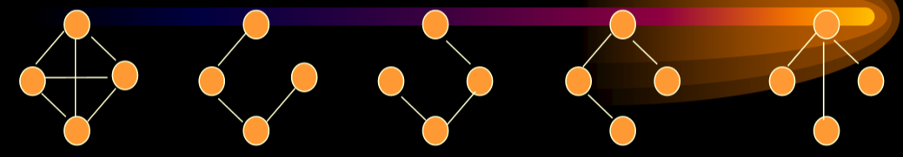\n\n\n\n

1.贪心法求解最小生成树：Prim和Kruskal两种方式

\n\n\n\n

\n
  1. Grandy策略：设：连通网络N={V,E}, V中有n个顶点。\n\n
     1. 先构造 n 个顶点，0 条边的森林 F ={T0,T1,……,Tn-1}
\n\n\n\n
     2. 每次向 F 中加入一条边。该边是一端在 F 的某棵树Ti上而另一端不在Ti上的所有边中具有最小权值的边。 这样使F中两棵树合并为一棵，树的棵数 - 1
\n\n\n\n
     3. 重复上述操作n-1次
\n\n
\n\n\n\n
  2. 去掉所有边，每次加入的边是当前最小的边，并且保证这个边不是回边。
\n
\n\n\n\n

### Kruskal算法(对边进行排序，然后生成)

\n\n\n\n

把无向图的所有边排序

\n\n\n\n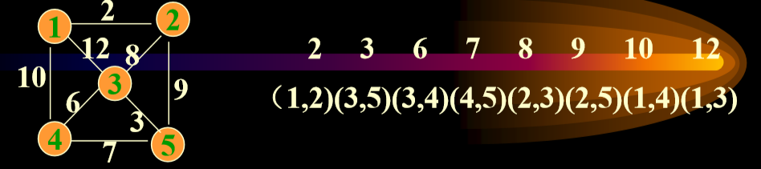\n\n\n\n

一开始的最小生成树为

\n\n\n\n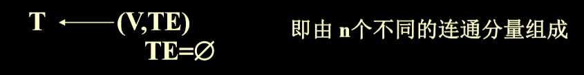\n\n\n\n

在E中选一条代价最小的边(u,v)加入T，一定要满足(u,v) 不和TE中已有的边构成回路

\n\n\n\n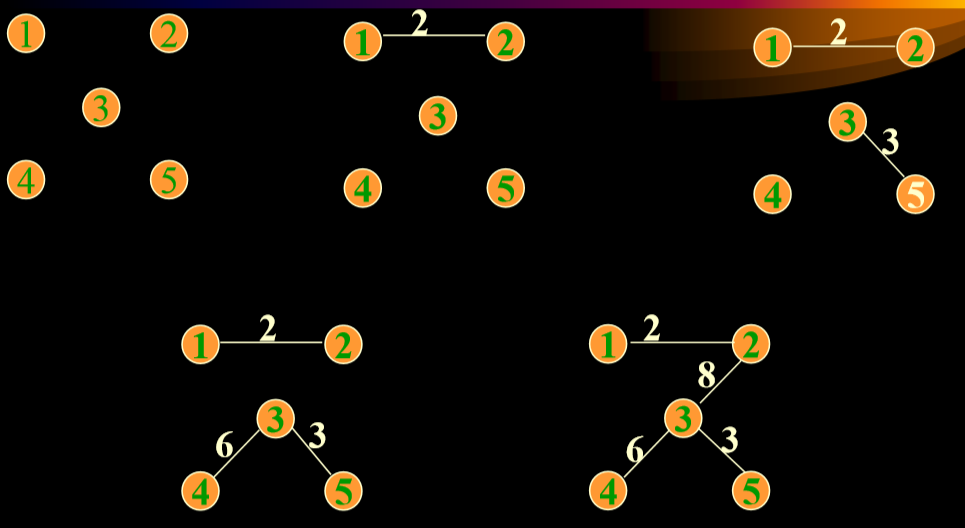\n\n\n\n
    
    
    void Graph<string,float>::Kruskal(MinSpanTree&T) {\n    //结果赋值给T\n    MSTEdgeNode e;\n    MinHeap<MSTEdgeNode>H(currentEdges);\n    int NumVertices=VerticesList.Last , u , v ;\n    Ufsets F(NumVertices);//建立n个单元素的连通分量\n    for(u=0;u<NumVertices;u++)\n        for (v=u+1;v<NumVertices;v++)\n            if(Edge[u][v]!=MAXINT) {\n                e.tail=u;\n                e.head=v;\n                e.cost=Edge[u][v];\n                H.insert(e);\n                //完成堆的初始化，将每一条边插入到优先级队列中去\n            }\n    int count=1;//生成树边计数\n    while(count<NumVertices) {\n        H.RemoveMin(e);\n        u=F.Find(e.tail);//找到并查集的树根\n        v=F.Find(e.head);//找到并查集的树根\n        if(u!=v){\n            //并查集做回边检测，在同一个并查集中就是一个回边，不然就不是\n            F.union(u,v);\n            T.Insert(e);\n            count++;//计数已经查找出来的个数\n        }\n        //最坏的情况时所有的边都被访问一次，比如目标边是最后一条边。\n    }\n}

\n\n\n\n

**Prim算法**

\n\n\n\n

\n
  1. 设：原图的顶点集合V(有n个)生成树的顶点集合U(最后也有n个)，一开始为空TE集合为{}
\n\n\n\n
  2. 步骤：\n\n
     1. U={1}任何起始顶点，TE={}
\n\n\n\n
     2. 每次生成(选择)一条边。这条边是所有边(u,v) 中代价(权)最小的边， u∈U,v∈V-U TE=TE+[(u,v)]; U=U+[v]
\n\n\n\n
     3. 当U≠V，返回上面一个步骤
\n\n
\n
\n\n\n\n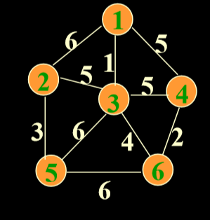\n\n\n\n

**最短路径**

\n\n\n\n

\n
  1. 设G=(V,E)是一个带权图(有向，无向)，如果从顶点v到顶点w的一条路径为(v,v1,v2,…,w)，其路径长度不大于从v到w的所有其它路径的长度，则该路径为从 v 到 w 的最短路径。
\n\n\n\n
  2. 背景:在交通网络中，求各城镇间的最短路径。
\n\n\n\n
  3. 三种算法:\n\n
     1. 边上权值为非负情况的从一个结点到其它各结点的最短路径 (单源最短路径)(Dijkstra算法)
\n\n\n\n
     2. 边上权值为任意值的单源最短路径
\n\n\n\n
     3. 边上权值为非负情况的所有顶点之间的最短路径
\n\n
\n
\n\n\n\n

**含非负权值的单源最短路径**

\n\n\n\n

Dijkstra

\n\n\n\n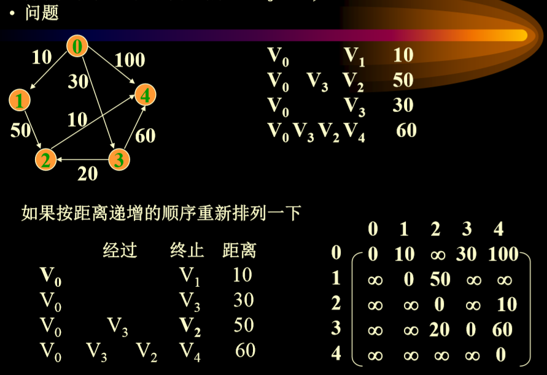\n\n\n\n

### 贝尔曼——福特改进算法

\n\n\n\n

可以检测负边权，每次固定松弛操作n-1次

\n\n\n\n

### floyed算法

\n\n\n\n

是用来求任意两个结点之间的最短路的。

\n\n\n\n

复杂度比较高，但是常数小，容易实现（只有三个 `for`）。

\n\n\n\n

适用于任何图，不管有向无向，边权正负，但是最短路必须存在。（不能有个负环）

\n\n\n\n

### 活动网络

\n\n\n\n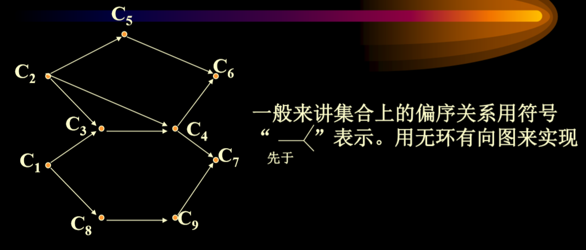\n\n\n\n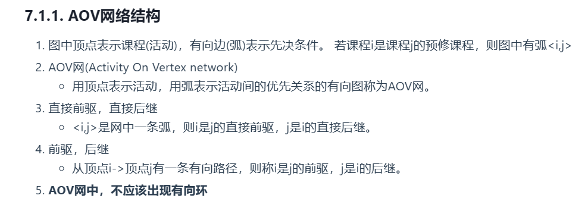\n\n\n\n

### 拓扑算法思想

\n\n\n\n

\n
  1. 从图中选择一个入度为0的结点输出之。(如果一个图中，同时存在多个入度为0的结点，则随便输出任意一个结点)
\n\n\n\n
  2. 从图中删掉此结点及其所有的出边。
\n\n\n\n
  3. 反复执行以上步骤\n\n
     1. 直到所有结点都输出了，则算法结束
\n\n\n\n
     2. **如果图中还有结点，但入度不为0** ，则说明有环路
\n\n
\n
\n\n\n\n

### AOE网络

\n\n\n\n

\n
  1. 用边表示活动的网络(AOE网络, Activity On Edge Network)又称为**事件顶点网络**
\n\n\n\n
  2. **顶点** ：\n\n
     * 表示事件(event) 事件——状态。表示它的入边代表的活动已完成，它的出边 代表的活动可以开始，如下图v0表示整个工程开始，v4表示a4，a5活动已完成a7，a8活动可开始。  

\n\n
\n\n\n\n
  3. **有向边** ：\n\n
     * 表示活动。 边上的权——表示完成一项活动需要的时间
\n\n
\n
\n\n\n\n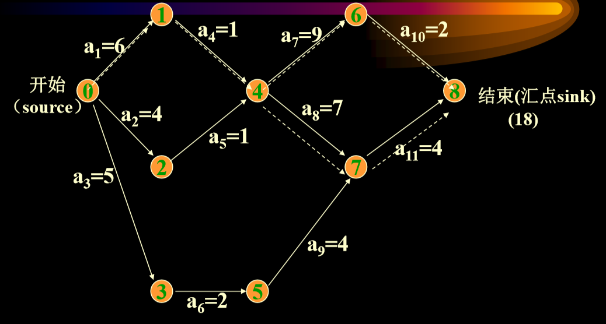\n\n\n\n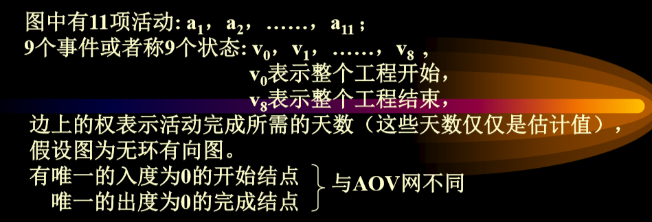\n\n\n\n

关键路径

\n\n\n\n

\n
  1. 目的: 利用事件顶点网络，研究完成整个工程需要多少时间 加快那些活动的速度后，可使整个工程提前完成。
\n\n\n\n
  2. 关键路径：具有从开始顶点(源点)->完成顶点(汇点)的 最长的路径
\n
\n\n\n\n\n
  2. 对于活动:\n\n
     1. e[k]－表示活动ak=<Vi,Vj>的可能的最早开始时间。 即等于事件Vi的可能最早发生时间。 e[k]=Ve[i]
\n\n\n\n
     2. l[k]－表示活动ak= <Vi,Vj> 的允许的最迟开始时间 l[k]＝Vl[j]-dur(<i,j>);
\n\n\n\n
     3. l[k]-e[k]－表示活动ak的最早可能开始时间和最迟允许开始时间的时间余量。也称为松弛时间。 (slack time)
\n\n\n\n
     4. l[k]==e[k]－表示活动ak是没有时间余量的**关键活动**
\n\n
\n
\n\n\n\n

## Hashing（哈希）

\n\n\n\n

key：如何解决散列表冲突问题

\n\n\n\n

### 1.3.1. 解决冲突方案(1):linear Probing(线性探测法)

\n\n\n\n

If hash(key)= d and the bucket is already occupied then we will examine successive buckets d+1, d+2,……m-1, 0, 1, 2, ……d-1, in the array(如何key的哈希值是d，并且d对应的位置已经被占据，然后我们会按照线性顺序向后成环形查找)

\n\n\n\n

线性表示法的弊端:堆积问题

\n\n\n\n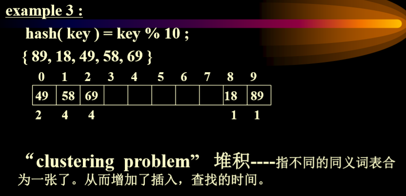\n\n\n\n

### 1.3.2. 解决冲突方法(2):二次探测法(Quadratic probing)

\n\n\n\n

放置hash值相同的情况下导致严重的堆积情况。

\n\n\n\n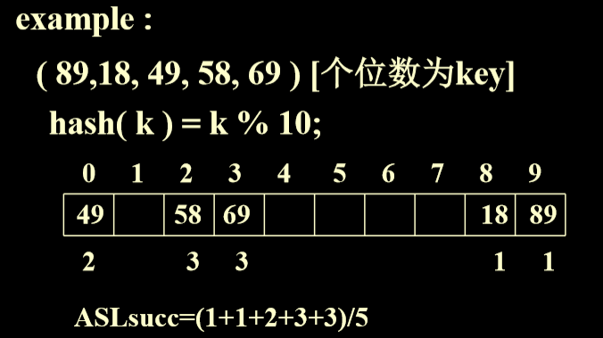\n\n\n\n

### 1.3.3. 解决冲突方法(3):双散列哈希(Double Hashing)

\n\n\n\n

If hash1(k)= d and the bucket is already occupied then we will counting hash2(k) = c, examine successive buckets d+c, d+2c, d+3c……，in the array(如果k的第一哈希值为d，而这个对应的格子已经被占用则我们继续计算k的第二哈希值，然后检查d+c…)

\n\n\n\n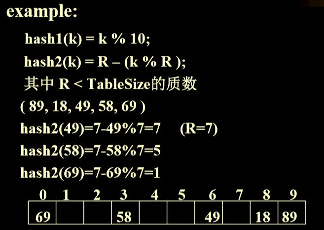\n\n\n\n

尽量保证表项数>表的70%，也就是意味着如果不满足，就需要进行再散列。

\n\n\n\n

### 解决冲突方法(4):分离链接法(Separate Chaining)

\n\n\n\n

使用每个位置对应线性表解决这个问题

\n\n\n\n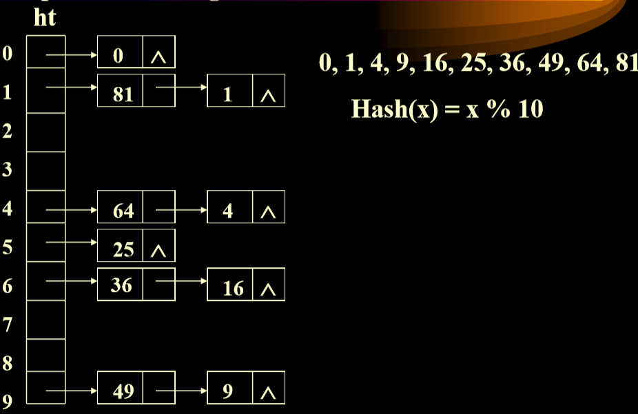\n\n\n\n

## 排序算法

\n\n\n\n

插入排序：

\n\n\n\n

\n
  1. 比较的时候是从后向前比较的。
\n\n\n\n
  2. 合并后的插入排序
\n
\n\n\n\n
    
    
    //Another version of insertion sort\npublic static void InsertionSort(int []a, int n) {\n    for(int i=0;i<n;i++){\n        //insert a[i] into a[0:n-1]\n        int t=a[i];\n        int j;\n        for(j=i-1; j>=0&&t<a[j]; j--)\n            a[j+1]=a[j];\n        a[j+1]=t;\n        //比前面大后推一格\n    }\n}

\n\n\n\n

折半插入排序：

\n\n\n\n
    
    
    //java\npublic static int binarySearch( Comparable [] a, Comparable x ) {\n    int low = 0, high = a.length - 1;\n    while( low <= high ) {\n        //计算出中点是哪一个\n        int mid = (low+high) / 2;\n        //调整两端的值\n        if( a[mid].compareTo(x) < 0)\n            low = mid + 1; \n        else if(a[mid ].compareTo(x) > 0)\n            high = mid – 1;\n        else  return mid;\n    }\n    return "NOT-FOUND";\n}

\n\n\n\n

（插排中+二分）

\n\n\n\n

希尔排序：

\n\n\n\n

\n
  1. 又称缩小增量排序(diminishing - increament sort)
\n\n\n\n
  2. 方法:\n\n
     1. 取一增量(间隔gap < n)，按增量分组，对每组使用 **直接插入排序** 或其他方法进行排序。
\n\n\n\n
     2. 减少增量(分的组减少，但每组记录增多)。直至增量为1，即为一个组时。
\n\n
\n
\n\n\n\n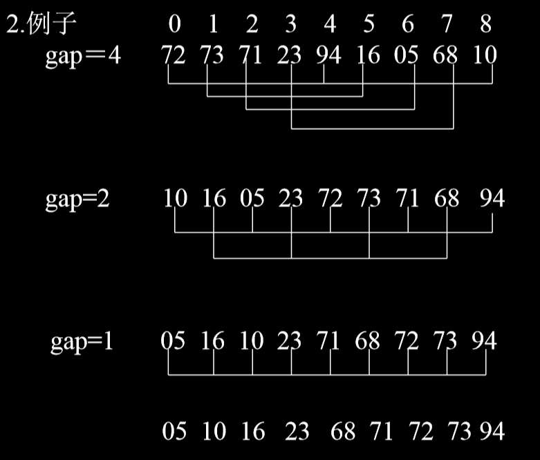\n\n\n\n
    
    
    public static void shellsort( Comparable [ ] a ) {\n    for (int gap = a.length/2 ; gap>0 ; gap/=2 )\n        for (int i = gap; i < a.length; i++) {\n            //遍历一遍\n            Comparable tmp = a[i];\n            int j = i;\n            for (;j >= gap && tmp.compareTo( a[j-gap] )< 0;j -= gap )\n                //完成一遍下滤\n                a[j] = a[j – gap];\n            a[j] = tmp;\n    }\n}

\n\n\n\n

### 希尔排序算法分析

\n\n\n\n

\n
  1. 与选择的缩小增量有关，但到目前还不知如何选择最好结果的缩小增量序列。
\n\n\n\n
  2. 平均比较次数与移动次数大约n1.3左右
\n
\n\n\n\n

交换排序（一类排序方式）

\n\n\n\n

1。冒泡排序

\n\n\n\n

\n
  1. 每次遍历一次数组，然后仅仅比较相邻的两个数字，最坏的情况时每次只能讲一个数字冒泡上去。
\n\n\n\n
  2. 然后遍历n次
\n
\n\n\n\n
    
    
    //java\npublic static void Bubble( int [ ] a , int n) {\n    //Bubble largest element in a[0:n-1] to right \n    for(int i=0; i<n-1; i++) \n        if(a[i] > a[i+1])\n            swap(a[i],a[i+1]);\n    }\npublic static void BubbleSort( int [ ] a, int n) {  \n    //Sort a[0:n-1] using a bubble sort \n    for(int i=n ;i>1; i--) \n        Bubble(a,i); \n}

\n\n\n\n

2。快速排序

\n\n\n\n

\n
  1. 在n个对象中，取一个对象(如第一个对象——基准pivot)，按该对象的关键码\n\n
     1. 把所有**小于等于** 该关键码的对象分划在它的左边。
\n\n\n\n
     2. **大于** 该关键码的对象分划在它的右边。
\n\n
\n\n\n\n
  2. 对左边和右边(子序列)分别再用快速排序。
\n
\n\n\n\n
    
    
    //c++\ntemplate <class Type> void QuickSort( datalist <Type>& list, const int left,  const int right ) {\n    if (left<right) {\n        int pivotpos = partition(list, left, right);\n        QuickSort(list, left, pivotpos-1);\n        QuickSort(list, pivotpos+1, right);\n    }\n}\n//partition\ntemplate <class Type> int partition(datalist<Type> &list, const int low, const int high) {\n    int i=low,j=high;  Element<Type>pivot=list.Vector[low];\n    while (i != j ) {\n        while(list.Vector[j].getkey()>pivot.getkey( ) && i<j)\n            j--;\n        if (i<j) {\n            list.Vector[i]=list.Vector[j];\n            i++;\n        }\n        while(list.Vector[i].getkey()<pivot.getkey( ) && i<j)\n            i++;\n        if (i<j) {\n            list.Vector[j]=list.Vector[i];\n            j--;\n        }\n    }\n    list.Vector[i]=pivot;\n    return i;\n}

\n\n\n\n

\n
  1. 选取pivot(枢纽元)用第一个元素作pivot是不太好的。
\n\n\n\n
  2. 方法1：随机选取pivot, 但随机数的生成一般是昂贵的。
\n\n\n\n
  3. 方法2：三数中值分割法(Median-of-Three partitioning) N个数，最好选第(N/2)(向上取整)个最大数，这是最好的中值，但这是很困难的。一般选左端、右端和中心位置上的三个元素的中值作为枢纽元。\n\n
     * 8, 1, 4, 9, 6, 3, 5, 2, 7, 0 (8, 6, 0)
\n\n\n\n
     * 具体实现时：将 8，6，0 先排序，即 0, 1, 4, 9, 6, 3, 5, 2 , 7, 8, 得到中值pivot为 6
\n\n
\n\n\n\n
  4. 分割策略:\n\n
     1. 将pivot与最后倒数第二个元素交换，使得pivot离开要被分割的数据段。然后，i 指向第一个元素，j 指向倒数第二个元素。\n\n
        * 0, 1, 4, 9, 7, 3, 5, 2, 6, 8
\n\n
\n\n\n\n
     2. 然后进行分划
\n\n
\n\n\n\n
  5. [三数中值分隔法](<https://www.cnblogs.com/chengxiao/p/6262208.html>)
\n
\n\n\n\n

选择排序

\n\n\n\n

思想:首先在n个记录中选出关键码最小(最大)的 记录，然后与第一个记录(最后第n个记录)交换位置，再在其余的n-1个记录中选关键码 最小(最大)的记录，然后与第二个记录(第n-1个记录)交换位置，直至选择了n－1个记录

\n\n\n\n
    
    
    //java\npublic static void SelectionSort(int [] a, int n) {\n    //sort the n number in a[0:n-1].\n    //找到大数字放置到后面\n    for(int size = n; size>1; size--){\n        //n-1\n        int j = Max(a,size);\n        //n-1+n-2+...+1\n        swap(a[j],a[size-1]);\n    }\n} 

\n\n\n\n

锦标赛排序：

\n\n\n\n

\n
  1. 直接选择排序存在重复做比较的情况，锦标赛 排序克服了这一缺点。
\n\n\n\n
  2. 具体方法:\n\n
     1. n个对象的关键码两两比较得到(n/2)(向上取整)个 比较的优胜 者(关键码小者)保留下来, 再对这(n/2)(向上取整)个对象再进行关键码的两两比较, ……直至选出一个最小的关键码为止。如果n不是2的K次幂，则让叶结点数补足到满足 2k < n <= 2k个。
\n\n\n\n
     2. 输出最小关键码。再进行调整：即把叶子结点上，该最小关键码改为最大值后，再进行 由底向上的比较，直至找到一个最小的关键码(即次小关 键码)为止。重复2，直至把关键码排好序。
\n\n
\n
\n\n\n\n

堆排序：

\n\n\n\n

### 算法思想

\n\n\n\n

\n
  1. 第一步，建堆，根据初始输入数据，利用 堆的调整算法FilterDown()，形成初始堆。(形成最大堆)
\n\n\n\n
  2. 第二步，一系列的对象交换和重新调整堆
\n
\n\n\n\n
    
    
    //java program\npublic static void heapsort( Comparable []a) {\n    for( int i = a.length / 2; i >= 0; i-- )\n        percDown( a, i, a.length );\n    for( int i = a.length – 1; i > 0; i-- ) {\n        swapReferences( a, 0, i );\n        percDown( a, 0, i);\n    }\n}\nprivate static int leftChild( int i ) {   \n    return 2 * i + 1;\n}\nprivate static void percDown( Comparable [ ] a, int  i,  int n ) {\n    int child;\n    Comparable tmp;\n    for( tmp = a[i];leftChild(i) < n ; i = child ) {\n        child = leftchild( i );\n        if( child!=n – 1&& a[child].compareTo( a[ child + 1 ] ) < 0 )\n            child ++;\n        if( tmp . compareTo( a[ child ] < 0 )\n            a[ i ] = a[ child ];\n        else\n            break;\n    }\n    a[i] = tmp;\n}

\n\n\n\n

秩排序：

\n\n\n\n

记录排名排序，需要一个额外的排名数组记录

\n\n\n\n
    
    
    public static void Rank( int [] a, int n, int [] r) {\n    //Rank the n elements a[0:n-1]\n    for(int i=0;i<n;i++){\n        r[i]=0;\n    }\n    //首先将全部的数字重置为0\n    for(int i=1;i<n;i++)\n        for(int j=0;j<i;j++)\n            if(a[j]<=a[i])\n                r[i]++;\n            else\n                r[j]++;\n            //胜者排名不需要向后增加，而败者需要增加次序。\n}\npublic static void Rearrange( int [ ]a, int n, int[ ] r) {\n    //In-place rearrangement into sorted order\n    for(int i=0;i<n;i++)\n        while(r[i]!=i) {\n            //在数组[n]上的应该是第n+1大的数字\n            int t=r[i];\n            swap(a[i],a[t]);\n            swap(r[i],r[t]);\n        }\n}

\n\n\n\n

基数排序：

\n\n\n\n

\n
  1. 先取个位数，按照个位数来放到十个桶里面。\n\n
     * 根据先后次序进图桶
\n\n
\n\n\n\n
  2. 按照十位数，继续放入桶中，根据个位排序结果
\n\n\n\n
  3. 重复上述操作，直到最高位。
\n\n\n\n
  4. 原理:每次让这一位的从前往后排序。
\n
\n\n\n\n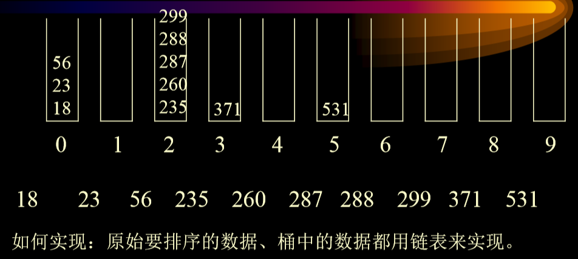\n\n\n\n

归并排序：

\n\n\n\n

归并：两个(多个)有序的文件组合成一个有序文件 方法：每次取出两个序列中的小的元素输出之；当一序列完，则输出另一序列的剩余部分

\n\n\n\n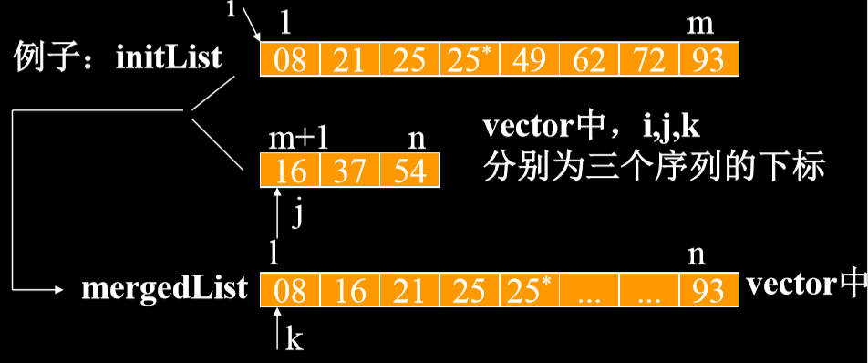\n\n\n\n
    
    
    //java\npublic static void mergeSort( Comparable [ ] a ) {\n    Comparable [ ] tmpArray = new Comparable[a.length];\n    mergeSort( a, tmpArray, 0, a.length – 1 );\n}                            \nprivate static void mergeSort( Comparable [ ] a, Comparable [] tmpArray, int left, int right ) {\n    if( left < right ) {\n        int center = ( left + right ) / 2;\n        mergeSort(a, tmparray, left, center );\n        mergeSort(a, tmpArray, center + 1, right );\n        merge( a, tmpArray, left, center + 1, right );\n    }\n}\nprivate static void merge( Comparable [ ] a, Comparable [] tmpArray, int leftPos, int rightPos, int rightEnd ) {\n    int leftEnd = rightPos – 1;\n    int tmpPos = leftPos;\n    int numElements = rightEnd – leftPos + 1;\n    while( leftPos <= leftEnd && rightPos <= rightEnd )\n        if( a[ leftPos ].compareTo( a[ rightPos ] ) <= 0 )\n            tmpArray[ tmpPos++ ] = a[ leftPos++ ];\n        else\n            tmpArray[ tmpPos++ ] = a[ rightPos++ ];\n    while( leftPos <= leftEnd )\n        tmpArray[ tmpPos++ ] = a[ leftPos++ ];\n    while( rightpos <= rightEnd)\n        tmpArray[ tmpPos++] = a[ rightpos++ ];\n    for( int i = 0; i < numElements; i++, rightEnd-- )\n        a[ rightEnd ] = tmpArray[ rightEnd ];\n}     

\n