\n

[Ray Tracing in One Weekend](<https://raytracing.github.io/books/RayTracingInOneWeekend.html#overview>)

\n\n\n\n

[Peter Shirley](<https://github.com/petershirley>), [Trevor David Black](<https://github.com/trevordblack>), [Steve Hollasch](<https://github.com/hollasch>)

\n\n\n\n

Version 4.0.0-alpha.1, 2023-08-06

\n\n\n\n

Copyright 2018-2023 Peter Shirley. All rights reserved.

\n\n\n\n

非常感谢写出这本线上指导的老师们，满足了我最后的浪漫

\n\n\n\n

## 1.Output an Image

\n\n\n\n

在这个部分我们使用ppm格式来绘制最简单的一张图片，ppm这个格式的基本要求如下

\n\n\n\n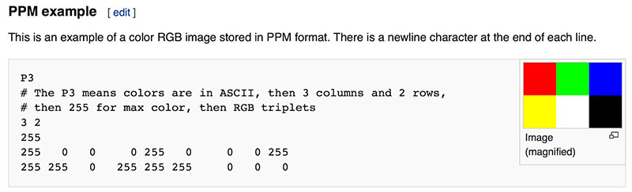\n\n\n\n

std::clog用于标记log，方便检查进度并且实时刷新

\n\n\n\n

在这个地方的>重定向遇到了一些问题，最后生成的ppm无法正常显示，好像是在>的过程中会对\\\n之类的符号有一定影响，是：

\n\n\n\n

在这里我遇到了一个问题就是打不开，用记事本检查输出发现并无问题，最后发现是编码的问题

\n\n\n\n

用vscode检查输出文件，在我的Windows10环境下，默认输出是UTF-16LE编码，与PPM要求的ASCII编码并不兼容，用vscode保存为兼容的UTF-8编码即可解决问题from[Ray Tracing in One Weekend从零实现一个简单的光线追踪渲染器_ray tracing in one weekend vscode-CSDN博客](<https://blog.csdn.net/Zireael2019/article/details/123618460>)

\n\n\n\n

## 2.get some utilities done(3-vector, color)

\n\n\n\n

这里我们需要自己实现一个向量的基本类，根据我们这个项目的要求我们只需要三维，因此很多细节也可以对应简化。

\n\n\n\n

在这个向量的类中同样需要实现对应的运算符重载以及一些向量特有运算函数的实现，比如向量的×·之类的运算（在向量变换的过程中是必要的）

\n\n\n\n

——初始化列表：

\n\n\n\n

### 初始化列表定义

\n\n\n\n

与其他函数不同，构造函数除了有名字，参数列表和函数体之外，还可以有初始化列表，初始化列表以冒号开头，后跟一系列以逗号分隔的初始化字段。

\n\n\n\n
    
    
    class foo\n{\n  public:\n    foo(string s, int i):name(s), id(i){} ; // 初始化列表\n  private:\n    string name;\n    int id;\n};

\n\n\n\n

使用类的方法封装了color.h和vec3.h，其中color的三维rgb借助了vec3来表示

\n\n\n\n
    
    
    #ifndef VEC3_H\n#define VEC3_H\n\n#include <cmath>\n#include <iostream>\n\nusing std::sqrt;\n\nclass vec3\n{\npublic:\n    double e[3];\n\n    vec3() : e{0, 0, 0} {}\n    vec3(double a, double b, double c) : e{a, b, c} {}\n\n    double x() const { return e[0]; }\n    double y() const { return e[1]; }\n    double z() const { return e[2]; }\n\n    vec3 operator-() const\n    {\n        return vec3(-e[0], -e[1], -e[2]);\n    }\n    double operator const { return e[i]; }\n    double &operator { return e[i]; }\n\n    vec3 &operator+=(const vec3 &v)\n    {\n        e[0] += v.e[0];\n        e[1] += v.e[1];\n        e[2] += v.e[2];\n        return *this;\n    }\n\n    vec3 &operator*=(double t)\n    {\n        e[0] *= t;\n        e[1] *= t;\n        e[2] *= t;\n        return *this;\n    }\n\n    vec3 &operator/=(double t)\n    {\n        e[0] /= t;\n        e[1] /= t;\n        e[2] /= t;\n        return *this;\n    }\n\n    double length() const\n    {\n        return sqrt(length_squared());\n    }\n\n    double length_squared() const\n    {\n        return e[0] * e[0] + e[1] * e[1] + e[2] * e[2];\n    }\n};\n\nusing point3 = vec3;\n// point3 is just an alias for vec3, but useful for geometric clarity in the code.\n\ninline std::ostream &operator<<(std::ostream &out, const vec3 &v)\n{\n    return out << v.e[0] << ' ' << v.e[1] << ' ' << v.e[2];\n}\ninline vec3 operator+(const vec3 &u, const vec3 &v)\n{\n    return vec3(u.e[0] + v.e[0], u.e[1] + v.e[1], u.e[2] + v.e[2]);\n}\n\ninline vec3 operator-(const vec3 &u, const vec3 &v)\n{\n    return vec3(u.e[0] - v.e[0], u.e[1] - v.e[1], u.e[2] - v.e[2]);\n}\n\ninline vec3 operator*(const vec3 &u, const vec3 &v)\n{\n    return vec3(u.e[0] * v.e[0], u.e[1] * v.e[1], u.e[2] * v.e[2]);\n}\n\ninline vec3 operator*(double t, const vec3 &u)\n{\n    return vec3(t * u.e[0], t * u.e[1], t * u.e[2]);\n}\n\ninline vec3 operator*(const vec3 &u, double t)\n{\n    return t * u;\n}\n\ninline vec3 operator/(vec3 v, double t)\n{\n    return (1 / t) * v;\n}\n\ninline double dot(const vec3 &u, const vec3 &v){\n    return u.e[0]*v.e[0]+u.e[1]*v.e[1]+u.e[2]*v.e[2]; \n}\n\n\ninline vec3 cross(const vec3 &u, const vec3 &v){\n    return vec3(u.e[1]*v.e[2]-u.e[2]*v.e[1],u.e[2]*v.e[0]-u.e[0]*v.e[2],u.e[0]*v.e[1]-u.e[1]*v.e[0]); \n}\n\ninline vec3 unit_vector(vec3 v){\n    return v/v.length();\n}\n\n#endif

\n\n\n\n
    
    
    #ifndef COLOR_H\n#define COLOR_H\n\n#include "vec3.h"\n\n#include <iostream>\n\nusing color = vec3;\n\nvoid write_color(std::ostream &out, color pixel_color)\n{\n    out << static_cast<int>(255.99 * pixel_color.x()) << ' '\n        << static_cast<int>(255.99 * pixel_color.y()) << ' '\n        << static_cast<int>(255.99 * pixel_color.z()) << '\\n';\n}\n\n#endif

\n\n\n\n

## 3.Rays, a Simple Camera, and Background

\n\n\n\n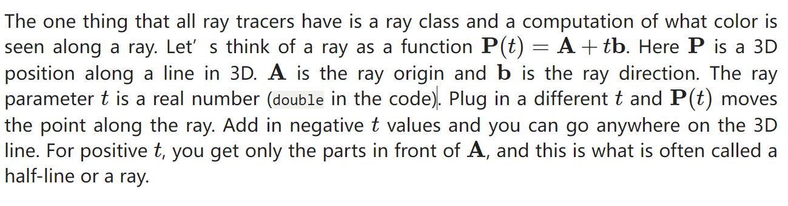\n\n\n\n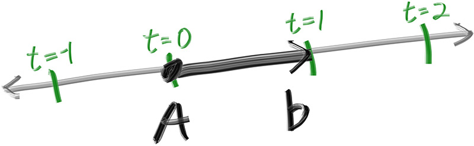\n\n\n\n

Now we are ready to turn the corner and make a ray tracer

\n\n\n\n

The involved steps are

\n\n\n\n

\n
  1. Calculate the ray from the “eye” through the pixel,
\n\n\n\n
  2. Determine which objects the ray intersects, and
\n\n\n\n
  3. Compute a color for the closest intersection point.
\n
\n\n\n\n

除了为渲染图像设置像素尺寸外，我们还需要设置一个虚拟视口，通过该视口来传递我们的场景光线。视口是 3D 世界中的一个虚拟矩形，其中包含图像像素位置的网格。如果像素的水平间距与垂直间距相同，则边界像素的视口将具有与渲染图像相同的纵横比。两个相邻像素之间的距离称为像素间距，方形像素是标准。

\n\n\n\n

如果你想知道为什么我们在计算 `viewport_width` 时不只用 `aspect_ratio` ，那是因为设置为的值 `aspect_ratio` 是理想的比率，它可能不是 和 `image_height` 之间的 `image_width` 实际比率。如果 `image_height` 允许是实数值，而不仅仅是一个整数，那么使用 `aspect_ratio` .但是，和 `image_height` 之间的 `image_width` 实际比率可能因代码的两个部分而异。首先，向下舍入到最接近的整数， `integer_height` 这可以增加比率。其次，我们不允许 `integer_height` 小于 1，这也会改变实际纵横比

\n\n\n\n

接下来，我们将定义相机中心：3D 空间中的一个点，所有场景光线都将从该点发起（这通常也称为眼点）。从摄像机中心到视口中心的矢量将与视口正交。我们最初将视口和摄像机中心点之间的距离设置为一个单位。这个距离通常被称为焦距。

\n\n\n\n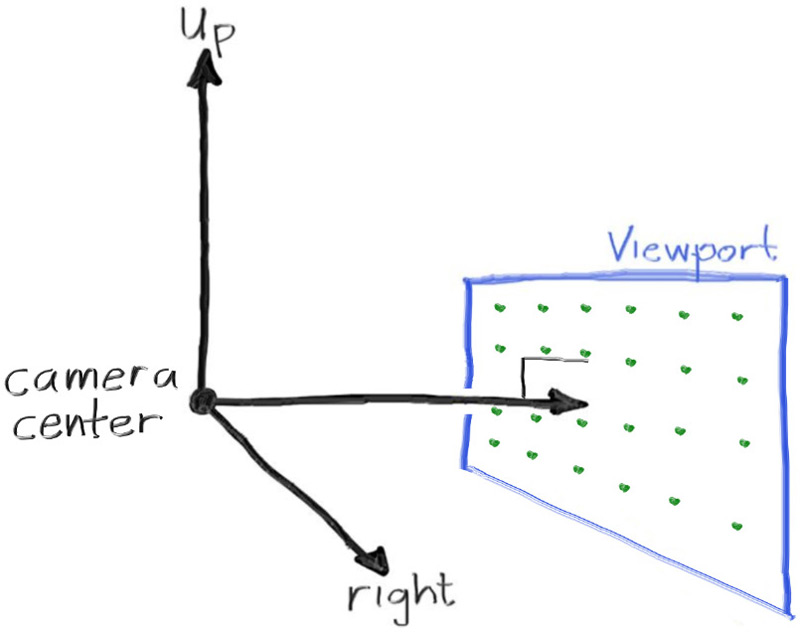\n\n\n\n

## 4.Adding a Sphere 添加球体

\n\n\n\n

添加一个可以接受光线的球体到我们的ray tracer中去， 因为在球体中计算光线比较简单（借助于向量的计算难度较小）

\n\n\n\n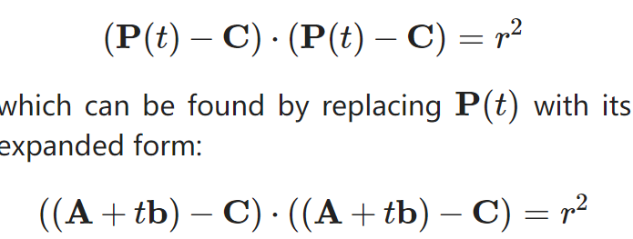\n\n\n\n

任意球都可以用如此的向量表达式来表示球体的位置信息，从而计算一道RAY是否hit 了我们所构建的球

\n\n\n\n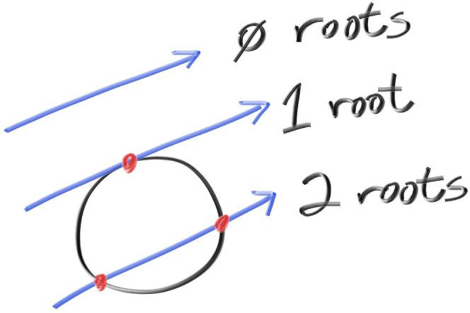\n\n\n\n

## 5.Surface Normals and Multiple Objects

\n\n\n\n

在这里我们需要就“是否需要使用单位向量表示法向量”做出决定，如果需要，可能不得不进行开销较大的平方根计算，但是要避免重复多次的计算，最终我们决定使用单位化的法向量以方便进一步的结果归一化

\n\n\n\n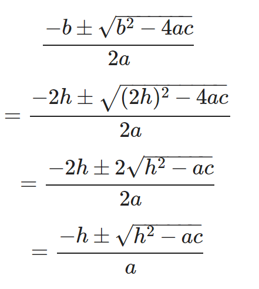\n\n\n\n

对于之前的计算，我们可以进行适度的简化运算，去除不必要的系数

\n\n\n\n

Now, how about more than one sphere? While it is tempting to have an array of spheres, a very clean solution is to make an “abstract class” for anything a ray might hit, and make both a sphere and a list of spheres just something that can be hit. What that class should be called is something of a quandary — calling it an “object” would be good if not for “object oriented” programming. “Surface” is often used, with the weakness being maybe we will want volumes (fog, clouds, stuff like that). “hittable” emphasizes the member function that unites them. I don’t love any of these, but we'll go with “hittable”.

\n\n\n\n

The second design decision for normals is whether they should always point out. At present, the normal found will always be in the direction of the center to the intersection point (the normal points out). If the ray intersects the sphere from the outside, the normal points against the ray. If the ray intersects the sphere from the inside, the normal (which always points out) points with the ray. Alternatively, we can have the normal always point against the ray. If the ray is outside the sphere, the normal will point outward, but if the ray is inside the sphere, the normal will point inward.

\n\n\n\n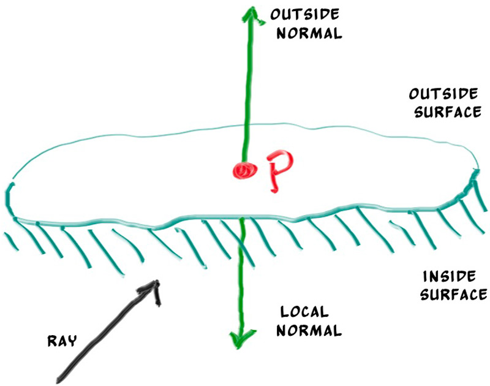\n\n\n\n

这张图给出了可能的法线方向，这受到光的具体位置的影响

\n\n\n\n

我们可以进行设置，使法线始终从表面“向外”指向，或者始终指向入射光线。此决定取决于是要在几何相交时还是在着色时确定曲面的一侧。在本书中，我们的材料类型比几何类型多，因此我们将减少工作量，并在几何时间进行确定。这只是一个偏好问题，您将在文献中看到这两种实现。

\n\n\n\n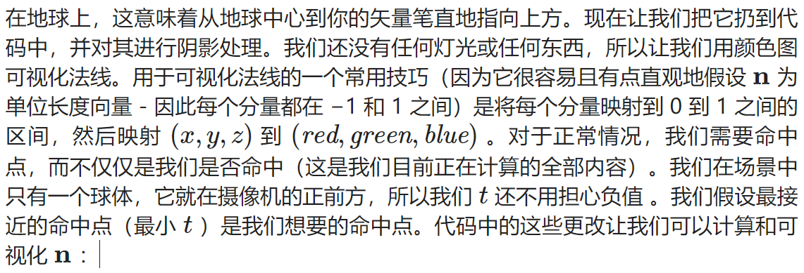\n\n\n\n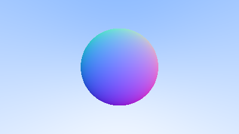\n\n\n\n

为了方便之后添加更多的对象，我们吧可命中的对象进行抽象操作，抽象到一个hittable的类中，最后我们的sphere继承这样一个类，表示可命中的球形。

\n\n\n\n

我们既可以规定法线始终朝外，又可以让法线方向始终指向光线方向但是记录下交点在表面内还是外，区别是在几何求交阶段还是在着色阶段处理交点内外的不同

\n\n\n\n

此处我们采用后者，因为我们实现的材质数量多于物体数量，因此将这个工作放在几何求交阶段能减少我们的工作量

\n\n\n\n

更改`hit_record`结构体，增加一个变量记录交点在内还是在外，并用一个函数来设置它

\n\n\n\n
    
    
    struct hit_record {\n    point3 p;\n    vec3 normal;\n    double t;\n    bool front_face;\n\n    inline void set_face_normal(const ray& r, const vec3& outward_normal) {\n        front_face = dot(r.direction(), outward_normal) < 0;\n        normal = front_face ? outward_normal :-outward_normal;\n    }\n};

\n\n\n\n

智能指针简介：[C++11中shared_ptr的使用_share_ptr 取消自动释放-CSDN博客](<https://blog.csdn.net/fengbingchun/article/details/52202007>)

\n\n\n\n

我们将在代码中使用共享指针，因为它允许多个几何图形共享一个公共实例（例如，一堆都使用相同颜色材质的球体），并且因为它使内存管理自动化且更易于推理。

\n\n\n\n

其次我们实现一个间隔类来管理具有最大最小值的实值区间

\n\n\n\n

## 6.实现相机代码类的封装

\n\n\n\n

在继续之前，现在是将我们的相机和场景渲染代码合并到一个新类中的好时机：类 `camera` 。相机类将负责两项重要工作：

\n\n\n\n

\n
  1. Construct and dispatch rays into the world.  
构建光线并将其发送到世界。
\n\n\n\n
  2. Use the results of these rays to construct the rendered image.  
使用这些光线的结果来构建渲染的图像。
\n
\n\n\n\n

## 7.抗锯齿（Antialaising）

\n\n\n\n

如果到目前为止放大渲染的图像，您可能会注意到渲染图像中边缘的刺耳的“阶梯”性质。这种阶梯式的踩踏通常被称为“锯齿”或“锯齿”。当真正的相机拍照时，边缘通常没有锯齿状，因为边缘像素是一些前景和一些背景的混合体。考虑到与我们渲染的图像不同，世界的真实图像是连续的。換句話說，世界（以及它的任何真實形象）實際上具有無限的解決度。我们可以通过对每个像素的一堆样本进行平均来获得相同的效果。

\n\n\n\n

显然，仅仅通过像素中心对同一光线进行多次重采样，我们并不能获得任何好处——我们每次都会得到相同的结果。相反，我们希望对落在像素周围的光线进行采样，然后对这些采样进行积分以近似于真正的连续结果。那么，我们如何整合落在像素周围的光线呢？（采用sampling的方式解决）(See [_A Pixel is Not a Little Square_](<https://www.researchgate.net/publication/244986797>) for a deeper dive into this topic.)

\n\n\n\n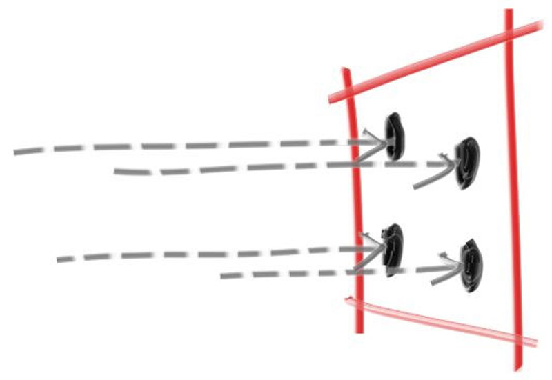\n\n\n\n

现在，让我们更新 camera 类以定义和使用一个新 `camera::get_ray(i,j)` 函数，该函数将为每个像素生成不同的样本。此函数将使用一个新的辅助函数，该函数 `pixel_sample_square()` 在以原点为中心的单位正方形内生成一个随机采样点。然后，我们将随机样本从这个理想方块转换回我们当前采样的特定像素。

\n\n\n\n

tip:除了上面的新功能 `pixel_sample_square()` 外，您还可以在 Github 源代码中找到该函数 `pixel_sample_disk()` 。如果您想尝试使用非方形像素，则包含此内容

\n\n\n\n

## 8\. Diffuse Materials 漫反射材料

\n\n\n\n

现在我们有了对象和每个像素的多条光线，我们可以制作一些看起来逼真的材质。我们将从漫反射材料（也称为哑光）开始。一个问题是，我们是否混合和匹配几何体和材料（以便我们可以将材料分配给多个球体，反之亦然），或者几何体和材料是否紧密结合（这对于几何体和材料链接的程序对象可能很有用）。我们将使用单独的方法（这在大多数渲染器中很常见），但请注意还有其他方法。

\n\n\n\n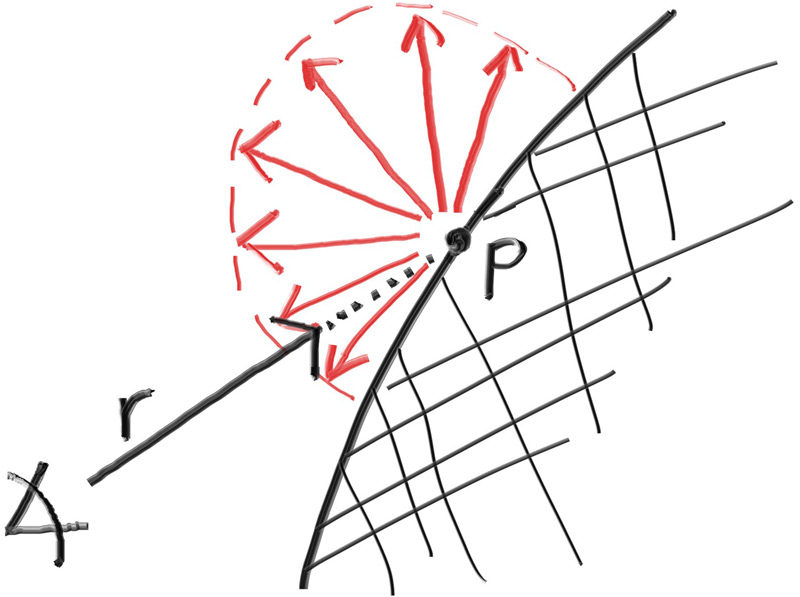\n\n\n\n

该图展现的是最简单的一种漫反射方式，最早的光线追踪论文都是采用的这种漫反射方式，所以我们需要在我们的vec3.h中加入一些函数使得能够生成一下随机向量

\n\n\n\n

Then we need to figure out how to manipulate a random vector so that we only get results that are on the surface of a hemisphere. There are analytical methods of doing this, but they are actually surprisingly complicated to understand, and quite a bit complicated to implement. Instead, we'll use what is typically the easiest algorithm: A rejection method. A rejection method works by repeatedly **generating random samples until we produce a sample that meets the desired criteria.** In other words, keep rejecting samples until you find a good one.

\n\n\n\n

\n
  1. Generate a random vector inside of the unit sphere在单位球体内生成一个随机向量
\n\n\n\n
  2. Normalize this vector  规范化此向量
\n\n\n\n
  3. Invert the normalized vector if it falls onto the wrong hemisphere  
如果归一化向量落在错误的半球上，则反转归一化向量
\n
\n\n\n\n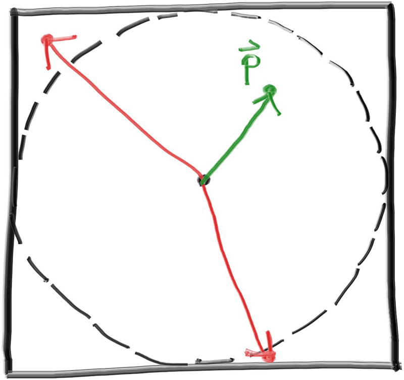\n\n\n\n

如果光线从材料上反射并保持其 100% 的颜色，那么我们说该材料是白色的。如果光线从材料上反射并保持其颜色的 0%，那么我们说该材料是黑色的。作为我们新漫反射材质的首次演示，我们将该 `ray_color` 函数设置为从反弹中返回 50% 的颜色。我们应该期待得到一个漂亮的灰色。

\n\n\n\n

### Limiting the Number of Child Rays

\n\n\n\n

这里潜伏着一个潜在的问题。请注意，该 `ray_color` 函数是递归的。它什么时候会停止递归？当它无法击中任何东西时。然而，在某些情况下，这可能是很长的时间——足够长的时间来炸毁堆栈。为了防止这种情况，让我们限制最大递归深度，在最大深度下不返回光贡献：

\n\n\n\n

### Fixing Shadow Acne

\n\n\n\n

当射线与曲面相交时，射线将尝试准确计算交点。不幸的是，这种计算容易受到浮点舍入误差的影响，这可能导致交点略微偏离。这意味着下一条光线的原点，即从表面随机散射的光线，不太可能与表面完全齐平。它可能就在表面之上。它可能就在地表以下。如果光线的原点刚好在表面下方，那么它可能会再次与该表面相交。这意味着它将在命中函数给我们的任何浮点近似处 t=0.00000001 找到最近的表面。解决此问题的最简单技巧是忽略非常接近计算的交点的命中：

\n\n\n\n

### True Lambertian Reflection

\n\n\n\n

我们之前选择的漫反射模型是一种简化之后的结果，实际上并不准确，真正精确的应该是朗波反射这种柔和的漫反射模型。

\n\n\n\n

该分布以与 成正比的方式散射反射光线，其中 ϕ是反射光线与 cos(ϕ) 表面法线之间的角度。这意味着反射光线最有可能在接近表面法线的方向上散射，而在远离法线的方向上散射的可能性较小

\n\n\n\n

我们可以通过向正态向量添加随机单位向量来创建此分布。在曲面的交点处有命中点， p有曲面 的法线 n 。在相交点处，该曲面正好有两条边，因此只能有两个与任何相交点相切的唯一单位球体（曲面的每一侧各有一个唯一的球体）。这两个单位球体将按其半径的长度从表面移位，这正好是一个单位球体的长度。

\n\n\n\n

很难分辨这两种漫反射方法之间的区别，因为我们的两个球体的场景非常简单，但您应该能够注意到两个重要的视觉差异：

\n\n\n\n

\n
  1. The shadows are more pronounced after the change  
变化后阴影更加明显
\n\n\n\n
  2. Both spheres are tinted blue from the sky after the change  
变化后，两个球体从天空中都变成了蓝色
\n
\n\n\n\n

### Using Gamma Correction for Accurate Color Intensity

\n\n\n\n

如果你仔细观察，或者如果你使用颜色选择器，你应该注意到50%的反射率渲染（中间的渲染）太暗了，不能介于白色和黑色（中间灰色）之间。事实上，70%的反射器更接近中灰色。这样做的原因是，几乎所有的计算机程序都假设图像在写入图像文件之前是“伽玛校正”的。这意味着 0 到 1 的值在存储为字节之前应用了一些转换。具有未经转换而写入的数据的图像被称为线性空间，而转换的图像被称为在伽马空间中。您使用的图像查看器很可能期望在伽马空间中获取图像，但我们在线性空间中为其提供图像。这就是我们的图像看起来不准确的原因。

\n\n\n\n

## 9.Metal金属

\n\n\n\n

如果我们想让不同的物体有不同的材料，我们有一个设计决定。我们可以有一个具有大量参数的通用材料类型，因此任何单个材料类型都可以忽略不影响它的参数。这不是一个坏方法。或者我们可以有一个抽象的 material 类来封装独特的行为

\n\n\n\n

对于我们的程序，材料需要做两件事：

\n\n\n\n

\n
  1. Produce a scattered ray (or say it absorbed the incident ray).  
产生散射光线（或说它吸收了入射光线）。
\n\n\n\n
  2. If scattered, say how much the ray should be attenuated.  
如果是散射的，请说出光线应该衰减多少。
\n
\n\n\n\n

The `hit_record` is to avoid a bunch of arguments so we can stuff whatever info we want in there. You can use arguments instead of an encapsulated type, it’s just a matter of taste. Hittables and materials need to be able to reference the other's type in code so there is some circularity of the references. In C++ we add the line `class material;` to tell the compiler that `material` is a class that will be defined later. Since we're just specifying a pointer to the class, the compiler doesn't need to know the details of the class, solving the circular reference issue.

\n\n\n\n

为了实现这一点， `hit_record` 需要被告知分配给球体的材料。

\n\n\n\n

对于我们已经拥有的朗伯（漫射）情况，它要么总是通过其反射率 R散射和衰减，要么有时可以散射（有概率 1−R而没有衰减（其中没有散射的光线只是被吸收到材料中）。它也可能是这两种策略的混合体。我们将选择始终分散，因此朗伯材料成为这个简单的类：

\n\n\n\n
    
    
    class lambertian : public material {\n  public:\n    lambertian(const color& a) : albedo(a) {}\n\n    bool scatter(const ray& r_in, const hit_record& rec, color& attenuation, ray& scattered)\n    const override {\n        auto scatter_direction = rec.normal + random_unit_vector();\n        scattered = ray(rec.p, scatter_direction);\n        attenuation = albedo;\n        return true;\n    }\n\n  private:\n    color albedo;\n};

\n