\n

## Lec 3: Shadow Mapping

\n\n\n\n

Recap: shadow mapping  
在101中闫老师已经介绍股了shadow mapping，这是一个2pass的算法，即我们会对场景渲染两次

\n\n\n\n

1-pass我们从Light处看向场景并输出一个从light处看向场景所生成的深度图,也就是所谓的shadow map.

\n\n\n\n

2-pass我们从camera处看向场景渲染一遍将,并参考1-pass生成的shadow map去判断物体是否在阴影中.

\n\n\n\n

shadow mapping是一个完全发生在图像空间的算法，**优点** 在于：一旦shadow map已经生成，就可以用来获取场景中的几何表示

\n\n\n\n

**缺点** 会产生自遮挡和走样

\n\n\n\n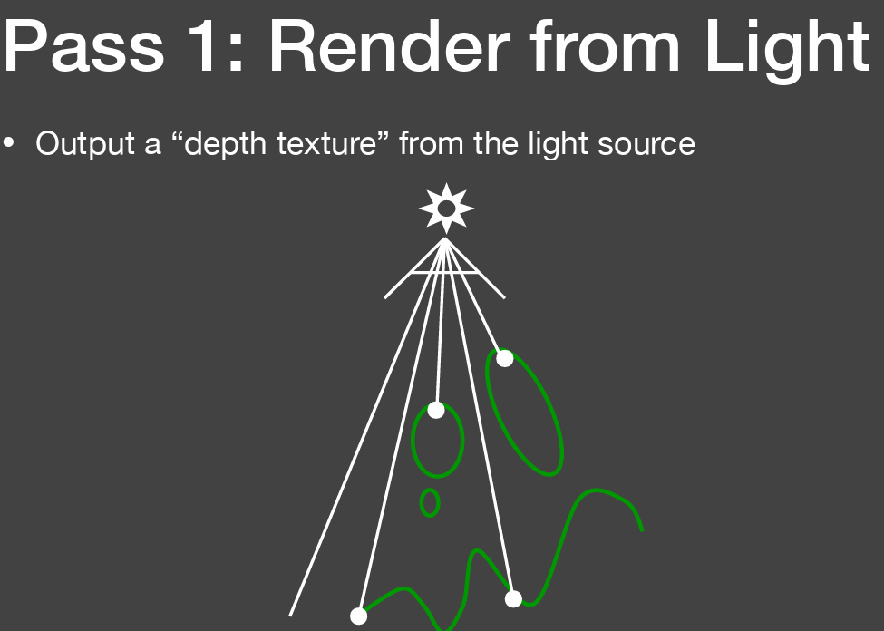\n\n\n\n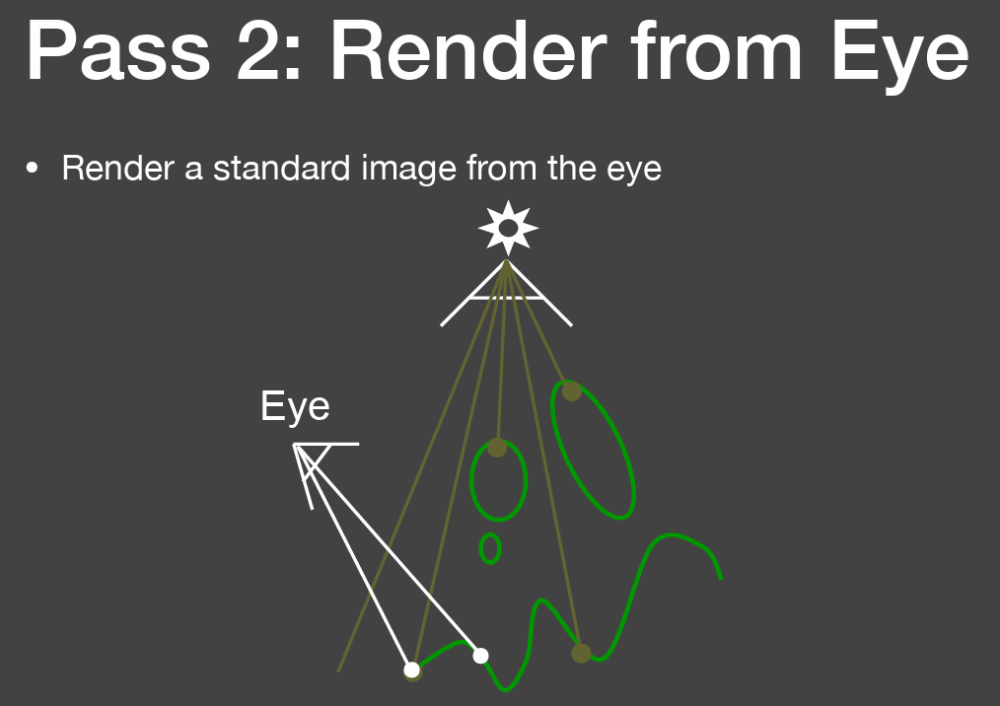\n\n\n\n

根据这个最基本的2-pass方法，我们可以得到如下的阴影表现

\n\n\n\n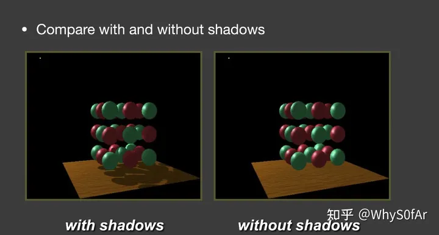\n\n\n\n

从Light处看向场景生成的是shadow map,并不是Shading的结果,而是在light的pass中生成一张深度的buffer,如图中,颜色深的表示值比较小,也就是离light近,颜色浅的就是离light远,值大.

\n\n\n\n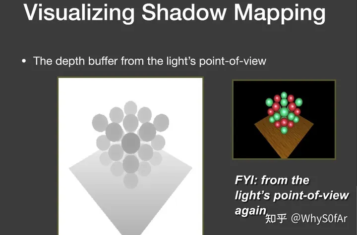\n\n\n\n

这样的shadow mapping有一种基本的问题：自遮挡

\n\n\n\n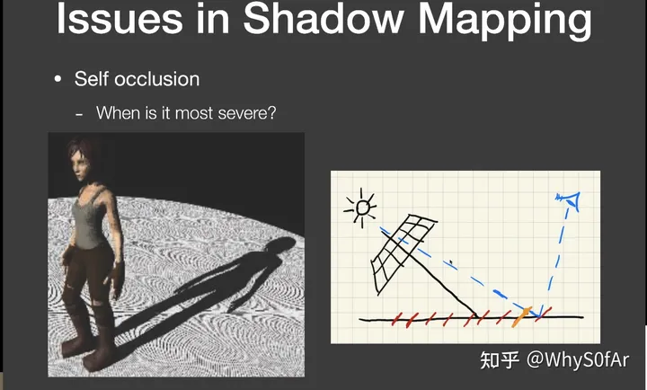\n\n\n\n

我们生成了一个Shadow map,那么这个Shadow map肯定有自己的分辨率,其每个像素要记录它所看见的最浅深度,可以理解为,每个像素内部他的深度是一个**常数**

\n\n\n\n

在Shadow map看来,场景被离散化为一系列红色小片形成的场景而不是直接的平面.

\n\n\n\n

因为每个红色小片所代表的深度不一样,因此在2-pass,也就是从camera处看向场景时,后面的红色小片在连接light时,会被误认为被前面的红色小片遮挡住,从而产生了错误的阴影,这个现象在light与平面**趋于平行** 时候最严重.

\n\n\n\n

当一个点深度大于记录深度的值超过一个阈值时，我们才认为这个点在阴影内。这也是工业界使用较多的一个办法。

\n\n\n\n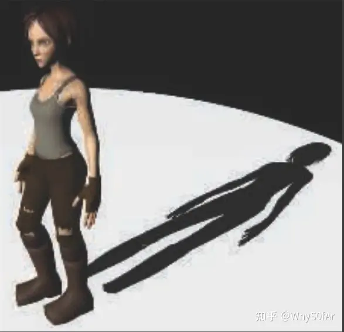\n\n\n\n

不过会因此丢失掉一部分的阴影

\n\n\n\n

因此想出来进一步的解决方案：

\n\n\n\n

**Second-depth shadow mapping**

\n\n\n\n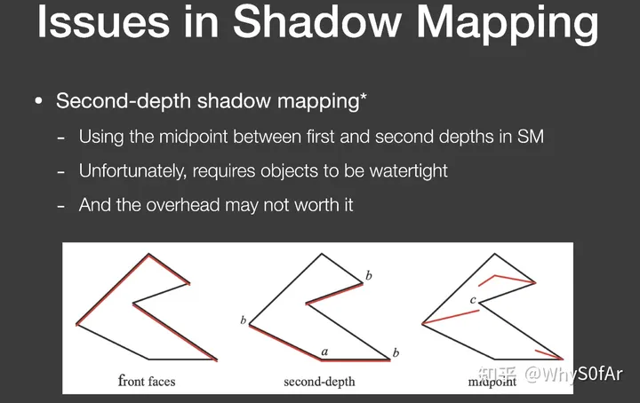\n\n\n\n

假设一根光线照过来,我们不用最小深度来比较,而是用由最小和第二小深度所得到的红色线来做后续的阴影,此处就没有Bias的事情了

\n\n\n\n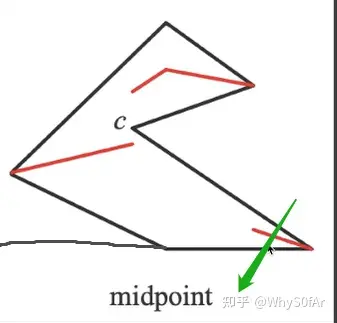\n\n\n\n

然后实际中并没有人去使用这个技术,因为场景内的物体必须都是watertight（非面片），还有就是算的复杂，开销太大，实时渲染不相信复杂度。

\n\n\n\n

shadow mapping存在的第二个问题就是走样

\n\n\n\n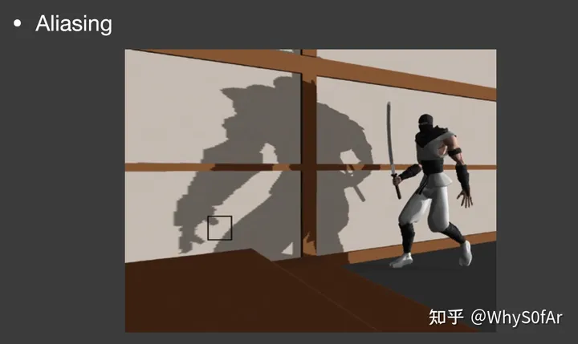\n\n\n\n

所以我们可以考虑一些近似相等的情况，运用微积分的不等式（没有那么精确的要求）

\n\n\n\n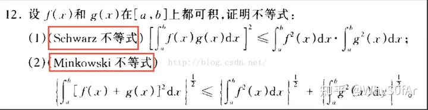\n\n\n\n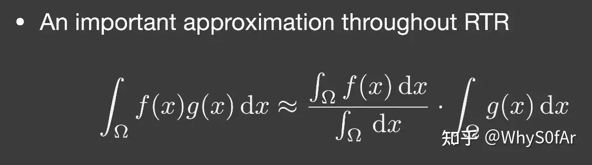\n\n\n\n

这是实时渲染中一个相当重要的近似，即**两个函数乘积的积分 ≈ 两个函数积分的乘积**

\n\n\n\n

分母这一项的作用是为了保证左右能量相同而做的归一化操作。

\n\n\n\n

我们来用一个例子来解释这个归一化操作。我们假设f(x)是一个**常值函数** ,也就是f(x) = 2,我们的积分域恒为0-3.

\n\n\n\n

那么约等式左边,把f(x) = 2代入,则可以提出来变为2倍的g(x)积分

\n\n\n\n

而等式右侧第一个函数代入f(x)的积分是2 * 3 =6，分母的积分是3，结果也正好是2.正好也是2倍的g(x)积分.

\n\n\n\n

**那么什么时候这个约等式比较正确呢？**

\n\n\n\n

**a) 我们要控制积分域足够小，也就是说我们只有一个点光源或者方向光源。**

\n\n\n\n

**b) 我们要保证shading部分足够光滑，也就是说brdf的部分变化足够小，那么这个brdf部分是diffuse的。**

\n\n\n\n

**c) 我们还要保证光源各处的radience变化也不大，类似于一个面光源。**

\n\n\n\n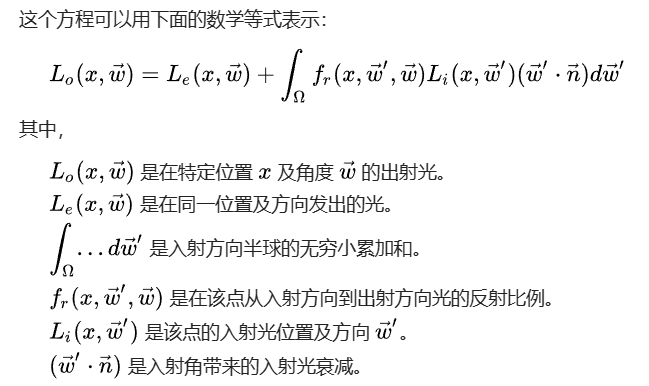\n\n\n\n

相比于硬阴影，软阴影明显有更加突出的效果，为了实现软阴影的效果,我们首先会用一个工具PCF

\n\n\n\n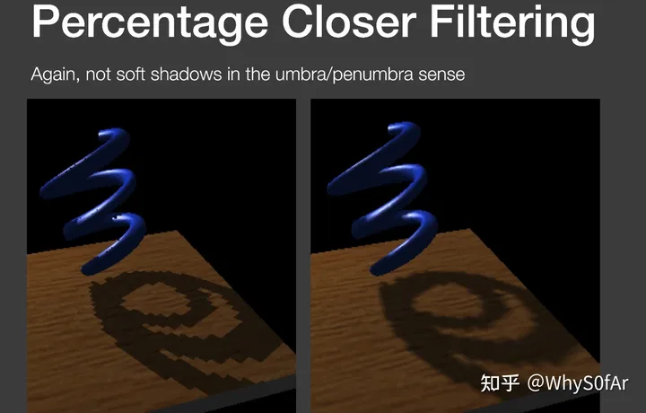\n\n\n\n

如果直接在shadow map上filtering就会造成阴影和物体交界直接糊起来，而且在第二个pass上做深度测试还是非0即1的结果,最后得到的仍然是硬阴影。

\n\n\n\n

如图,蓝点是本来应该找的单个像素,现在我们对其周围3 * 3个像素的范围进行比较,由于是在Shadow map上,因此每个像素都代表一个深度,我们让在shadow map上范围内的每个像素都与shading point的实际深度进行一下比较,如果shadow map上范围内的像素深度小于shading point的实际深度,则输出1,否则输出0.

\n\n\n\n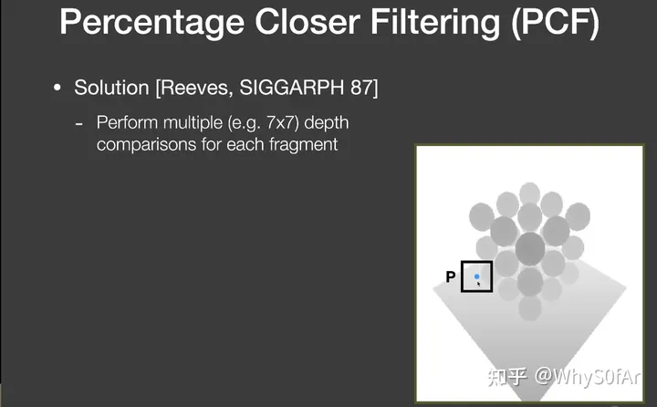\n\n\n\n

因此,我们要解决的一个问题是我们如何决定一个软阴影的半影区。换句话说，就是filter size 有多大的问题:

\n\n\n\n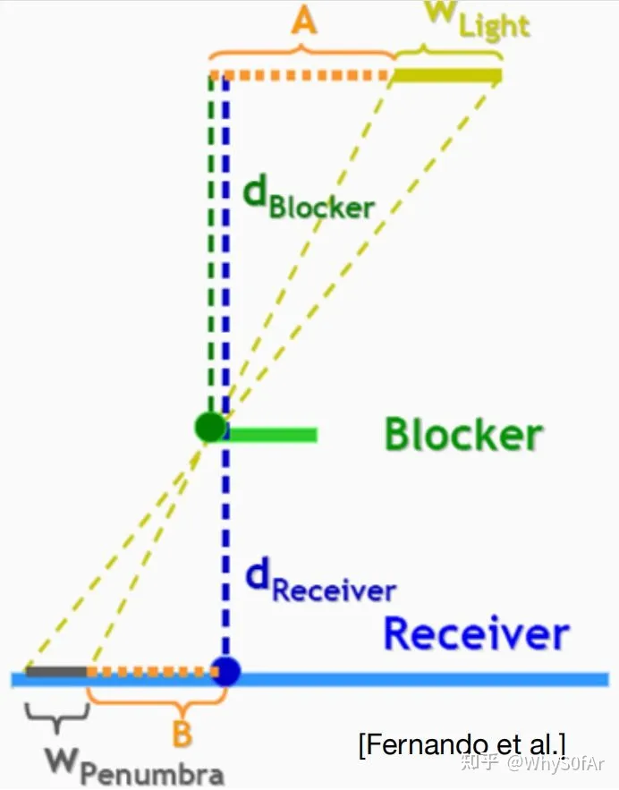\n\n\n\n

**阴影接受物与阴影投射物的距离越小,阴影越锐利**

\n\n\n\n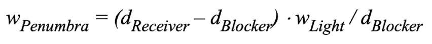\n\n\n\n

不能直接使用shadow map中对应单个点的深度来代表blcoker距离,因为如果该点的深度与周围点的深度差距较大（遮挡物的表面陡峭或者对应点正好有一个孔洞），将会产生一个错误的效果,我们选择使用**平均遮挡距离** 来代替，所以平常我们指的blocker depth其实是Average blocker depth.

\n\n\n\n

\n