  * 真实感图形学的三部曲

    * 建模：建立三维场景

    * 消隐：消隐解决物体深度的显示及确认物体内的相互关系

    * 渲染：消隐后，在可见面上进行敏感光泽的处理，然后绘制

真实感渲染(photorealistic rendering)的目标是创建出3D场景的图像(image)，且无法区分出(indistinguishable )这些电脑生成的图像与同一场景相机拍出的相片的差异。这里无法区分(indistinguishable)不是精确的度量。

## 颜色模型

颜色是人的视觉系统对可见光的感知结果，感知到的颜色由光波的波长决定。

图像的每个像素由3个组成颜色通道的成分组成。 分别是RGB (红，绿，蓝)。 每个通道所需的颜色位深度为8位，总共为24位。 24位颜色，总共有16,777,216种组合(2的24次方)。 这远远超过了人类肉眼所能分辨的1000万种颜色，尽管如此，这些颜色范围还是能让画面显得更加丰富和鲜明。

典型的显示器使用 sRGB 颜色空间。 它使用行业标准的8位每通道(RGB)或24位的颜色。 虽然8位每个通道看上去足够了，但它仍然缺失许多颜色。

### 色彩理论

数字成像使用的三原色分别是红、绿、蓝(RGB)。 还有3种间色，即青色、洋红色和黄色(CMY)。

三原色是发光物体的三原色，而CMY间色是反射发光物体的“三原色”。

RGB三色等量叠加，会变成白光。

CMY三色等量叠加，会变成黑色。

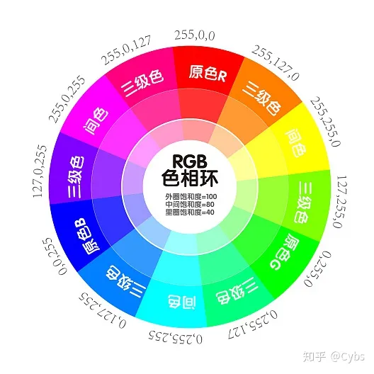

### 人眼的视觉

从生理学上讲，人类的眼睛在日光或阳光能准确的区分色彩的，也就是5500K-6500K 之间的开尔文色温值(k)。 然而，当使用彩色光时，色彩感知或白平衡(WB)就会发生变化。 这些可以是人造光源，例如最常见的夜间白炽灯，卤素灯，荧光灯或 LED 灯泡。 我们对白色的感知会发生变化，但是由于先验的经验，我们仍然知道它是白色的，即使看上去不是白色。

例如一个人穿了件白色的衬衣，他站在红色的灯光下，看上去衣服是偏红色的，但是你还是会知道它是白色的。因为你在不同的光线环境下都见过衬衣的颜色，即使现在它偏色了，但是你的大脑依然能自动恢复出其白色的认知。

这些都是由于**白点** 的变化而产生的结果。 白点的移动与改变相机的白平衡类似。 举例来说，我们用相机拍摄一个物体时，使用白炽灯和荧光灯照出来的效果是不同的。 这些光源在光中产生不同波长的颜色。我们人的 眼睛不习惯它，所以它必须补偿（脑补）白点，以感知色彩的准确性。 当在白炽灯下，我们可能会看到颜色出现更偏黄，看起来是在2800K-3200K 之间。 这在显示器上显示时，就需要一个色彩校正来修正色偏，而人眼和大脑则自动处理了这个过程。

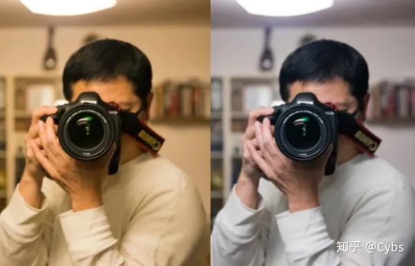

  * 以上彩色模型是从色度学或硬件实现的角度提出的

  * 但用色调 (Hue)、饱和度 (Saturation，也称彩度)、亮度 (Illumination) 三要素来描述彩色空间能更好地与人的视觉特性相匹配。

当人观察一个彩色物体时，用色调、饱和度、亮度来描述物体的颜色。色调是描述纯色的属性(纯黄色、橘黄或者红色)；饱和度给出一种纯色被白光稀释的程度的度量；亮度是一个主观的描述，实际上，它是不可以测量的，体现了无色的强度概念，并且是描述彩色感觉的关键参数。而强度(灰度)是单色图像最有用的描述子，这个量是可以测量且很容易解释。则将提出的这个模型称作为HSI(色调、饱和度、强度)彩色模型，该模型可在彩色图像中从携带的彩色信息(色调和饱和度)里消去强度分量的影响，使得HSI模型成为开发基于彩色描述的图像处理方法的良好工具，而这种彩色描述对人来说是自然而直观的。

下图是HSI的圆锥空间模型

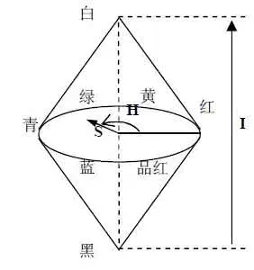

HSV模型用色调（色相，hue），饱和度（Saturation），亮度（Value）表示颜色。它是一种六角锥模型。

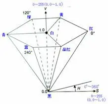

HSL色彩模式是工业界的一种颜色标准，是通过对色相(Hue)、饱和度(Saturation)、明度(Lightness)三个颜色通道的变化以及它们相互之间的叠加来得到各式各样的颜色的，HSL即是代表色相，饱和度，明度三个通道的颜色，这个标准几乎包括了人类视力所能感知的所有颜色，是目前运用最广的颜色系统之一。

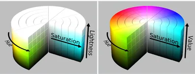

由于以下三种颜色模型仅在模型上有形式区别，所以我们取其中的HSI讨论计即可

给定一幅RGB彩色图像，每个RGB像素的H分量,S分量和I分量计算方式如下：

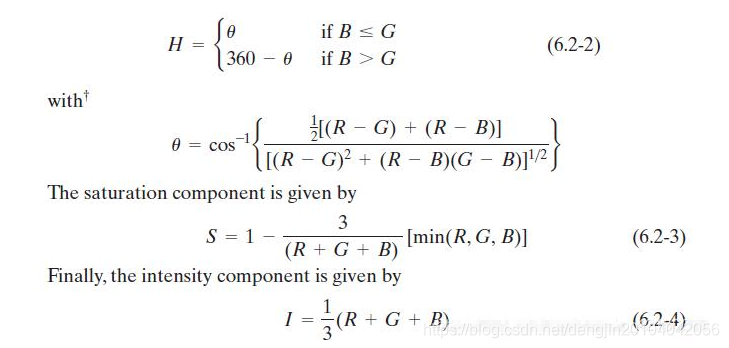

**H，色调，颜色的外观，用角度表示：如赤橙黄绿青蓝紫**

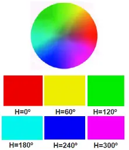

S，饱和度，分为  
低(0%～20%)，不管色调如何而产生灰色  
中(40%～60%)，产生柔和的色泽(pastel)  
高(80%～100%)，产生鲜艳的颜色(vivid color)

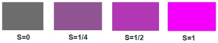

I，光照，颜色的量度，取值范围从0%(黑)～100%(最亮)

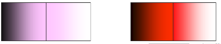

## 简单光照模型

  * 1967年，Wylie 等人第一次在显示物体时加进光照效果，认为光强与距离成反比。

  * 1970年，Bouknight 提出第一个光反射模型：Lambert 漫反射＋环境光（第一个可用的光照模型）。

  * 1971年，Gouraud 提出漫反射模型加插值的思想（漫反射的意思是光强主要取决于入射光的强度和入射光与法线的夹角）。

  * 1975年，Phong 提出图形学中第一个最有影响的光照明模型 。在漫反射模型的基础上加进了高光项。

### 光照的物理基础

**反射定律** ：入射角等于反射角，而且反射光线、入射光线与法向量在同一平面上。

折射定律：折射线在入射线与法线构成的平面上，折射角与入射角满足：

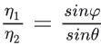

，参数是折射率和折射角

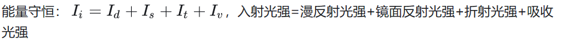

  * 镜面反射光：一束光照射到一面镜子上或不绣钢的表面，光线会沿着反射光方向全部反射出去，这种叫镜面反射光。

  * 折射光：比如水晶、玻璃等，光线会穿过去一直往前走。

  * 吸收光：比如冬天晒太阳会感觉到温暖，这是因为吸收了太阳光。

  * 漫反射光：光线射到物体表面上后（比如泥塑物体的表面，没有一点镜面效果），光线会沿着不同的方向等量的散射出去的现象。漫反射光均匀向各方向传播，与视点无关，它是由表面的粗糙不平引起的

### Phong光照模型

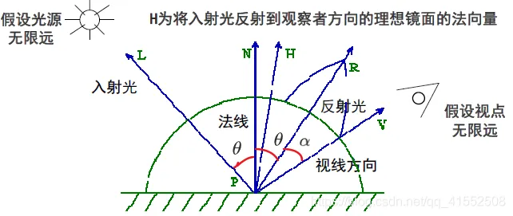

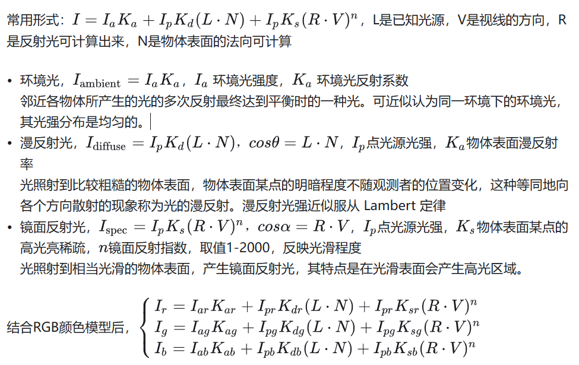

Phong模型扫描线算法

    
    for 屏幕上每一条扫描线y do
  begin
  将数组Color初始化成为y扫描线的背景颜色值
  for y扫描线上的每一可见区间段s中的每个点(x,y) do
    begin
    设(x,y)对应的空间可见点为P
    求出P点处的单位法向量N、P点的单位入射光向量L、单位视线向量V
    求出L在P点的单位镜面反射向量R
    (r,g,b) = 代码块外的那个公式
    置Color(x,y) = (r,g,b)
    end
  显示Color
  end

### 增量式光照模型

为保证多变性之间的光滑过渡，使连续的多边形呈现匀称的光强分布。由于每个多边形的法向一致，如果用phong光照模型，多边形内部的像素颜色相同，在不同法向的多边形相邻处，造成光强突变，使具有不同光强的两个相邻区域之间的光强不连续（马赫带效应）

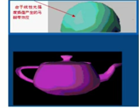

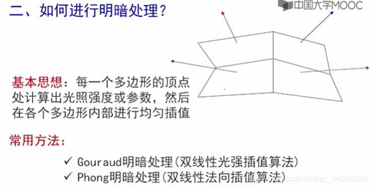

### Gouraud明暗处理

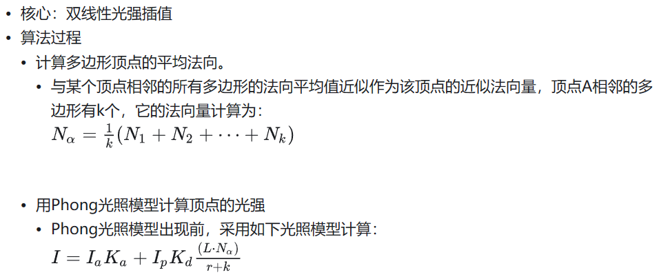

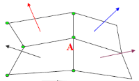

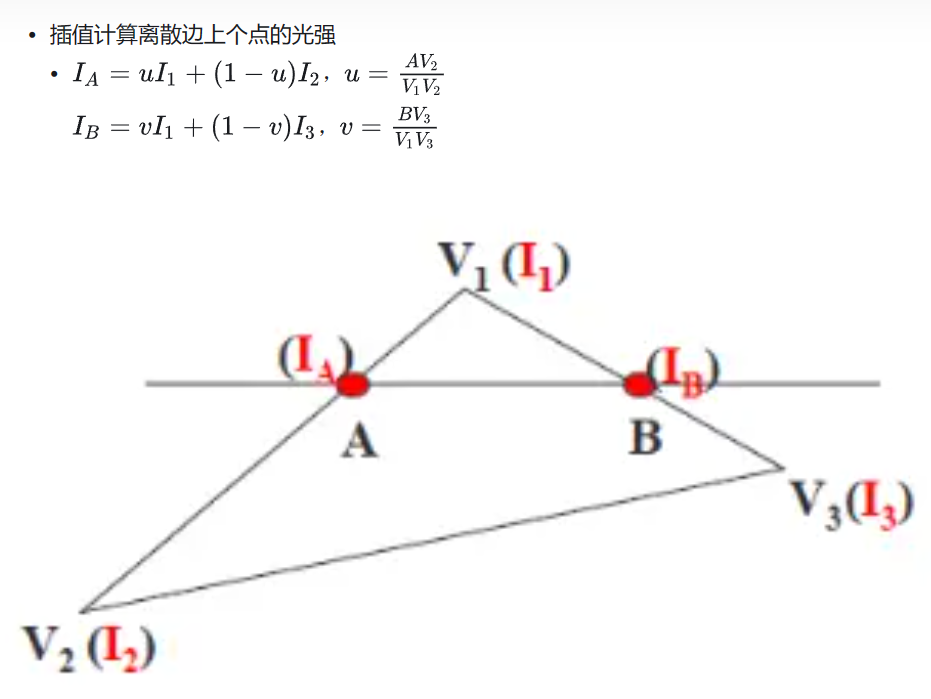

### Phong明暗处理

  * Gouraud明暗处理的不足

    * 不能有镜面反射光（高光）

    * 双线性插值是把能量往四周均匀，平均的结果就是光斑被扩大了，本来没光斑的地方插值后反而出现了光斑。

    * Phong明暗处理以计算量、时间为代价，引入镜面反射，解决高光问题

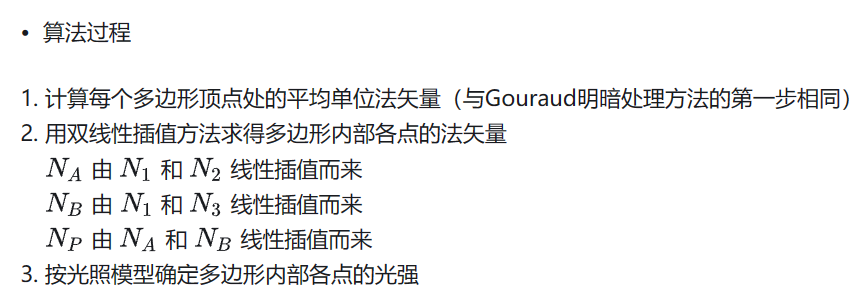

## 局部光照模型

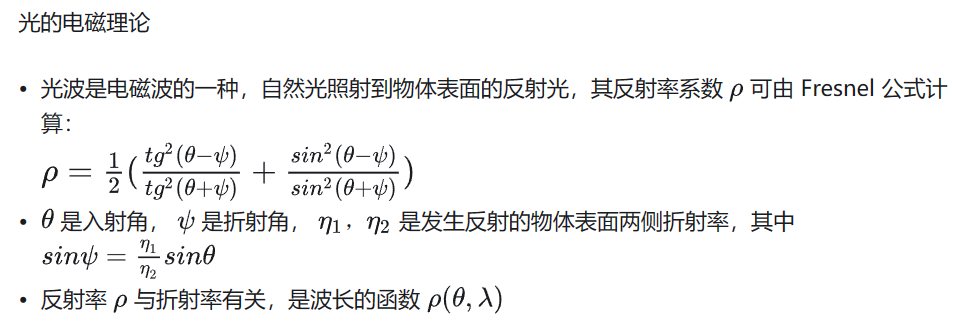

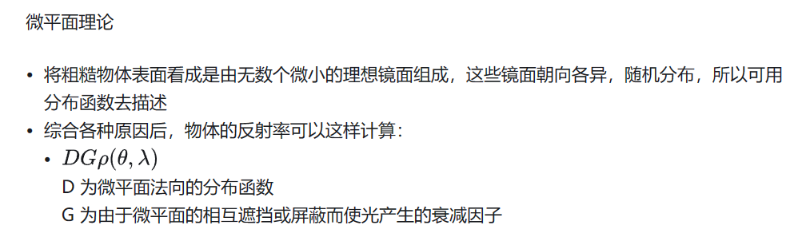

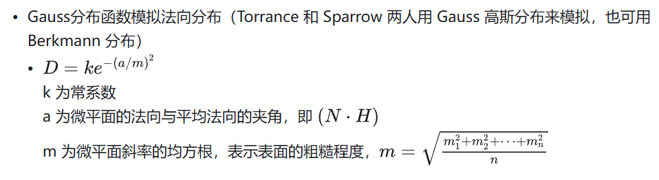

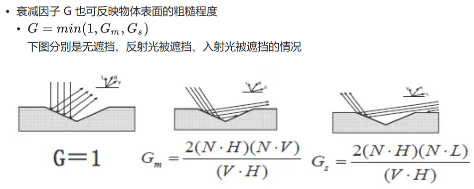

### 局部光照明模型

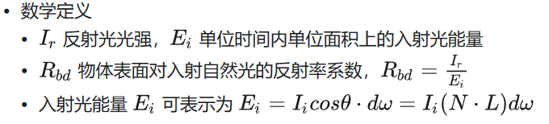

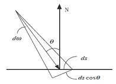

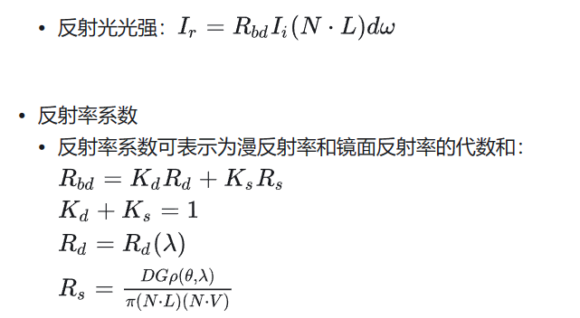

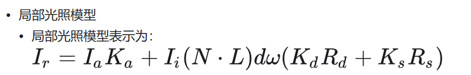

## 光透射模型

### 光透射模型概述

  * 简单和局部光照模型没有考虑光的透射现象

  * 其适用于场景中有透明或者半透明的物体的光照处理

  * 早期用颜色调和法进行光透射模拟

### 颜色调和法

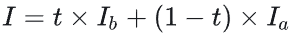

  * 不考虑透明体对光的折射以及透明物体本身的厚度，光通过物体表面是不会改变方向的，可以模拟平面玻璃。

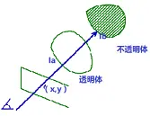

### Whitted 光透射模型

  * 提出了第一个整体光照模型，并给出了一般光线跟踪算法的范例，综合考虑了光的反射、折射、透射和阴影等。被认为是计算机图形领域的一个里程碑。

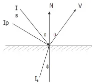

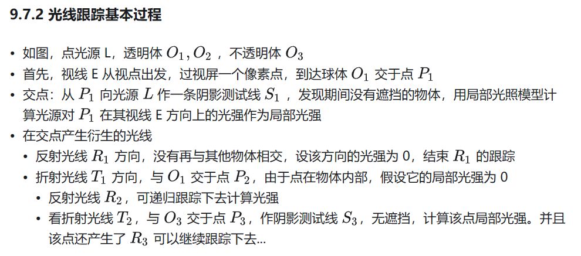

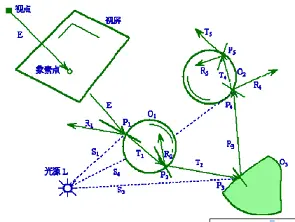

    
    RayTracing(start, direction, weight, ret_color)
{
  if(weight < MinWeight) ret_color = BLACK;
  else
  {
    计算光线与所有物体的交点中离start最近的点;
    if(无交点) ret_color = BLACK;  
    else
    {
      I_local = 在交点处用局部光照模型计算出的光强;
      计算反射方向R;
      RayTracing(最近的交点, R, weight*W_r, I_r);
      计算折射方向T;
      RayTracing(最近的交点, T, weight*W_t, I_t);
      ret_color = I_local + K_r * I_r + K_t * I_t;
    }
  }
}

### 光线跟踪的加速

  * 光线跟踪问题

    * 光线跟踪进行大量的求交运算，效率低

  * 加速方案

    * 提高求交速度：针对性的几何算法、...

    * 减少求交次数：包围盒、空间索引、...

      * 包围盒求交测试 (先和**包围盒** 求交，有交点再和内部图形求交)

层次包围盒求交测试

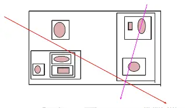

## 纹理映射

### 纹理映射作用

  * 表面用纹理来代替，不用构造模型和材质细节，节省时间和资源

  * 可用一个粗糙多边形和纹理来代替详细的几何构造模型，节省时间和资源

  * 让用户做其他更重要的东西

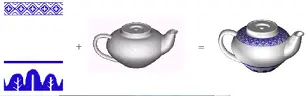

### 纹理定义

  * 图象纹理：将二维纹理图案映射到三维物体表面，绘制物体表面上一点时，采用相应的纹理图案中相应点的颜色值

  * 函数纹理：用数学函数定义简单的二维纹理图案，如方格地毯；或用数学函数定义随机高度场，生成表面粗糙纹理即几何纹理

### 纹理映射

纹理映射 (Texture Mapping)

  * 通过将数字化的纹理图像覆盖或投射到物体表面，而为物体表面增加表面细节的过程

  * 寻找一种从纹理空间(u,v)到三维曲面(s, t)之间的映射关系，将点(u,v)对应的彩色参数值映射到相应的三维曲面(s, t)上，使三维曲面表面得到彩色图案

  * 两种方法

    * 在绘制一个三角形时，为每个顶点指定纹理坐标，三角形内部点的纹理坐标由纹理三角形的对应点确定。即指定：

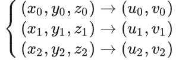

指定映射关系

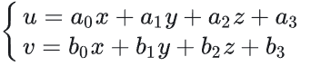

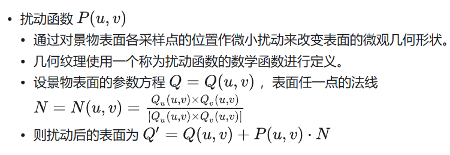

##  阴影处理

### 阴影定义

  * 阴影是由于观察方向与光源方向不重合而造成的

  * 阴影使人感到画面上景物的远近深浅，从而极大地增强画面的真实感

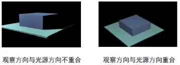

###  阴影分类

  * 本影：不被任何光源所照到的区域Umbra。

  * 半影：被部分光源所照到的区域Penumbra

  * 自身阴影：由于物体自身的遮挡而使光线照射不到它上面的某些面

  * 投射阴影：由于物体遮挡光线，使场景中位于它后面的物体或区域受不到光照射而形成的。

### 阴影体法

阴影算法 —— 阴影体法 (Shadow Volume)

  * 由一个点光源和一个三角形可以生成一个无限大的阴影体。落在这个阴影体中的物体，就处于阴影中。

  * 在对光线进行跟踪的过程中，若射线穿过了阴影体的一个正面（朝向视点的面），则计数器加1。若射线穿过了阴影体的一个背面（背向视点的面），则计数器减1。  
最终计数器大于0，则说明这个像素处于阴影中，否则处于阴影之外。

### 阴影图法

阴影算法——阴影图法（Shadow Mapping）：

  * 思想是使用Z缓冲器算法，从投射阴影的光源位置对整个场景进行绘制。

  * 对于Z缓冲器的每一个象素，它的z深度值包括了这个像素到距离光源最近点的物体的距离。一般将Z缓冲器中的整个内容称为阴影图（Shadow Map），有时候也称为阴影深度图。

  * 从视点的角度来进行，对场景进行二次绘制。

  * 在对每个图元进行绘制的时候，将它们的位置与阴影图进行比较，如果绘制点距离光源比阴影图中的数值还要远，那么这个点就在阴影中，否则就不在阴影中。

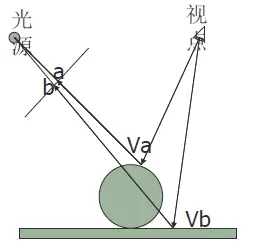
