## Overview

  * **BRDF** （**双向反射分布函数** ）是一个简化的BSSRDF，假设光在同一点进出。

  * **BTDF** （**双向透射分布函数** ）与 BRDF 类似，但用于表面的另一侧。

  * **BSDF** （**双向散射分布函数** ）由BRDF和BTDF共同定义。

  * **BSSRDF** （**双向散射表面反射分布函数** ）描述了出射辐射与入射通量之间的关系，包括次表面散射（SSS）等现象。BSSRDF 描述了光是如何在射到表面的任意两条光线之间传输的。

  * **BSSTDF** （**双向散射表面透射分布函数** ）类似于 BTDF，但具有次表面散射。

  * **BSSDF** （**双向散射表面分布函数** ）由BSSTDF和BSSRDF共同定义。也称为**BSDF** （**双向散射分布函数** ）。

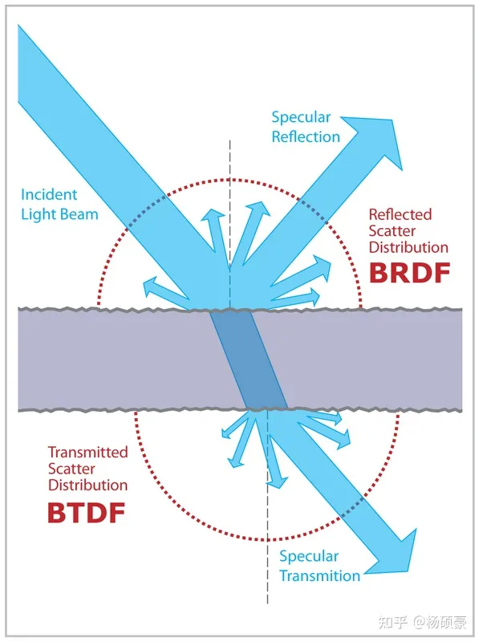

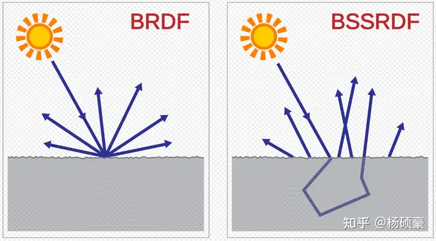

## BRDF

BRDF的全称是Bidirectional reflectance distribution function，表示的一半是在同一个界面的一个点上发生的光的折射、散射等变换

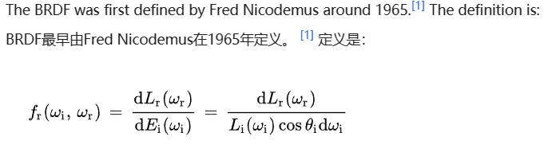

其中  是辐射率，或每单位投影面积的每单位立体角的功率，  是辐照度，或每单位表面积的功率，  是  和表面法线  之间的角度。指数  表示入射光，而指数  表示反射光。

Considering the dependence of a BRDF on the incoming and outgoing directions, the wavelength of light under consideration, and the positional variance, a general BRDF in functional notation can be written as

[latex]
$$BRDF_{\\\lambda}(\\\theta_i,\\\phi_i,\\\theta_o,\\\phi_o,u,v)$$

λ取决于光的波长，接下来的两个参数代表的是以球面坐标形式的入射光的方向，o则是出射光的方向，最后的u,v表示的则是这个表面在texture空间中的坐标

Though a BRDF is truly a function of position, sometimes the positional variance is not included in a BRDF description. Instead, it is common to see a BRDF written as a function of incoming and outgoing irections and wavelength only   

[latex]$$BRDF_{\\\lambda}(\\\theta_i,\\\phi_i,\\\theta_o,\\\phi_o)$$

Such BRDFs are often called **position-invariant** or **shift-invariant BRDFs.**

Often times when we think of vectors, we think of cartesian-space vectors of the form 

[latex]
$$\\\mathbf{v}=(v_x,v_y,v_z)$$

While this notation is useful for performing many types of computations, it can be a bit **cumbersome** when used to parameterize BRDFs.

Instead, the spherical coordinate representation of a vector is generally preferred.

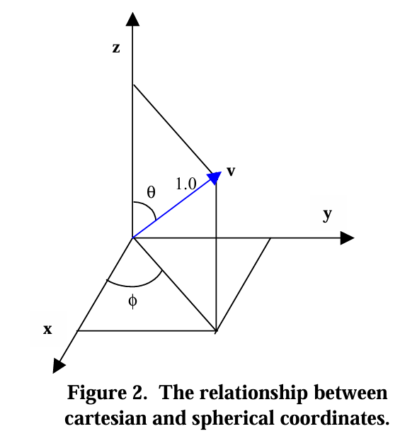

[latex]
$$spherical \\\rightarrow cartesian 
\\\begin{cases} v_x = \\\cos(\\\phi)\\\sin(\\\theta) \\\\\\\\
v_y = \\\sin(\\\phi)\\\sin(\\\theta)\\\\\\\\
v_z = \\\cos(\\\theta)
\\\end{cases}
$$

Because the vector being considered is assumed to be normalized,

[latex]
$$1=\\\sqrt{
v_x^{2}+v_y^{2}+v_z^{2}}$$

### Differential Solid Angles微分立体角

当我们谈论光从某个方向到达（或离开）表面时，更恰当的说法是到达或穿过某个空间区域的光量。这样做的原因是光是根据流经一个区域的流量来衡量的。

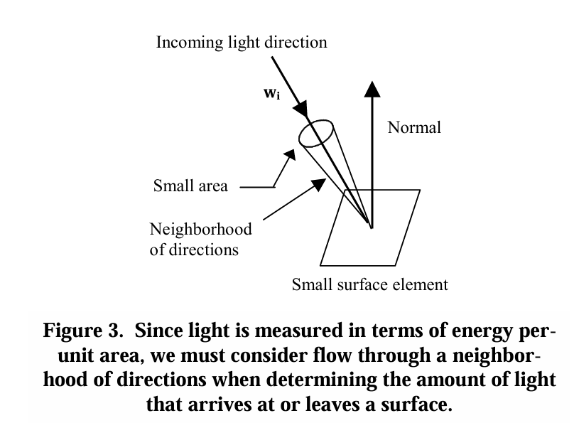

The concept of a differential solid angle is a bit theoretical and can be a little tricky to understand at first, but the simplest way to understand its definition is to think of it as the area of a small rectangular region on a unit sphere.

[latex]
$$d\\\omega = (height)(width) \\\\\\\\
d\\\omega = (d\\\theta)(\\\sin(\\\theta)d\\\phi) \\\\\\\\
d\\\omega = \\\sin(\\\theta) d\\\theta d \\\phi 
$$

### the Definition of BRDF

Up until this point, we haven’t really talked about the exact definition of a BRDF. Now that we understand the notion of a differential solid angle, we can give a more concrete definition of a BRDF. Suppose we are given an incoming light direction, wi, and an outgoing reflected direction, wo, each defined relative to a small surface element. A BRDF is defined as the ratio of the quantity of reflected light in direction wo, to the amount of light that reaches the surface from direction wi. To make this clear, let’s call the quantity of light reflected from the surface in direction wo, Lo, and the amount of light arriving from direction wi, Ei. Then a BRDF is given by this:

[latex]
$$ BRDF = \\\frac{L_o}{E_i}$$

由于每个立体角都可以看做一处平坦地域，所以As a result, the region is uniformly illuminated as the same quantity of light所以到达该区域的light的量是Li*dwi这么多，不过要考虑到光源的角度，所以是加上得有一个cosθ在，这个值实际上可以用N·wi计算得到

[latex]
$$
BRDF = \\\frac{L_o}{L_i\\\cos(\\\theta_i)d\\\omega_i}
$$

### BRDF's classes & Properties

BRDF一共可以分为两类：isotropic BRDFs and anisotropic BRDFs.

BRDF重要的两个特性则是 reciprocity and conservation of energy.

In general, most real-world BRDFs are probably **more isotropic than anisotropic** though many real-world surfaces have **subtle anisotropy**.比起细微的各向异性，各向同性在现实世界中更加广泛

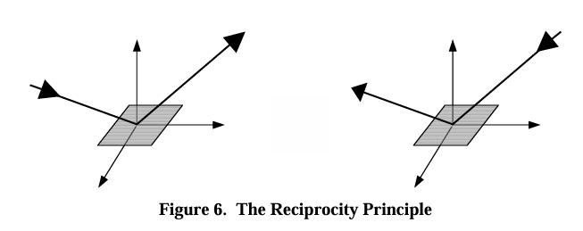

能量的转换则如图所示，所有能量在最终究竟还是守恒的。

That is, if the incoming and outgoing directions are swapped, the value of the BRDF does not change.还遵循光路的可逆性原理

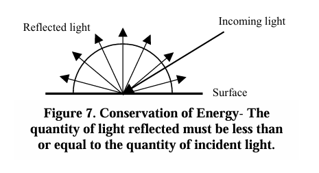

所有的散射的光线的总能量不能超过最初始到达表面的光的量

[latex]
$$\\\sum_{out} BRDF_\\\lambda(\\\theta_i,\\\phi_i,\\\theta_o,\\\phi_o)\\\cos(\\\theta_o)d\\\omega_o \\\le 1$$

When considering the continuous hemisphere of all outgoing reflected directions, the sumbecomes an integral and this conservation property becomes this

[latex]
$$\\\int\\\limits_{\\\Omega} BRDF_\\\lambda(\\\theta_i,\\\phi_i,\\\theta_o,\\\phi_o)\\\cos(\\\theta_o)d\\\omega_o \\\le 1$$

### BRDF光照等式

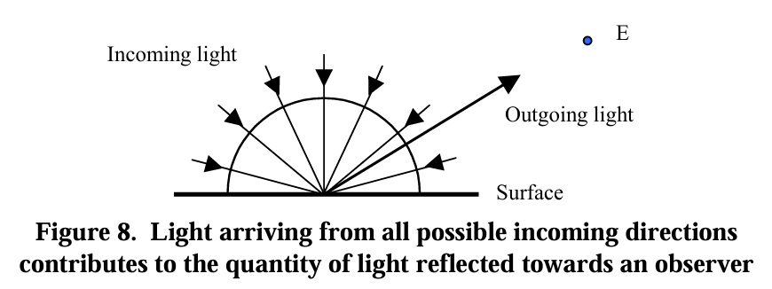

Specifically, when considering the continuous space of incoming directions, the amount of light reflected in the outgoing direction is the integral of the amount of light reflected in the outgoing direction from each incoming direction.这个东西很显然可以用一个积分表达

[latex]
$$ L_o = \\\int \\\limits_{\\\Omega}L_{o\\\ due\\\ to\\\ i}(\\\omega_i,\\\omega_o)d\\\omega_i $$

For each incoming direction, the amount of reflected light in the outgoing direction is defined in terms of the BRDF. Suppose that Li is the light intensity incoming from a specific direction wi. The intensity of the light reflected in the outgoing direction is defined by modulating the intensity of the light arriving at the surface point with the corresponding BRDF. Specifically,

[latex]
$$ L_o = BRDF(\\\theta_i,\\\phi_i,\\\theta_o,\\\phi_o)E_i$$

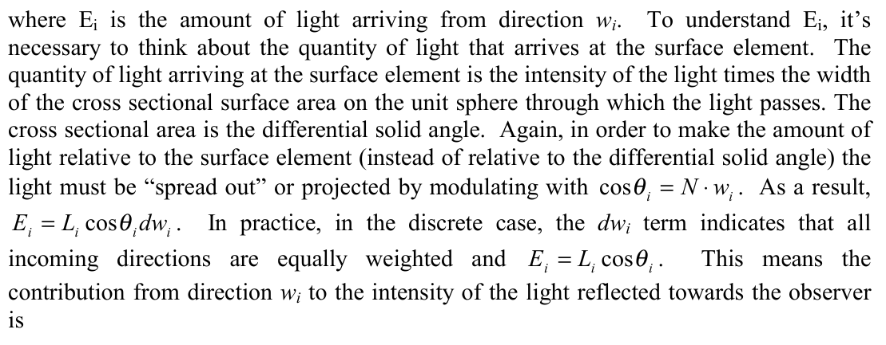

由于每个到达表面的物体存在一定的角度，所以我们考虑转换成BRDF表达并且附加对应的角度，即把Ei转换成Li的表达

[latex]
$$ L_o = BRDF(\\\theta_i,\\\phi_i,\\\theta_o,\\\phi_o)L_i\\\cos(\\\theta_i)$$

In general, interactive computer graphics tends not to consider the entire hemisphere of incoming directions when determining the illumination of a surface. The reason for this is that the math required to compute the lighting equation above is too expensive to compute for more than just a small number of directions. Instead, interactive applications tend to use a small number of individual point light sources to compute the illumination of a surface. Rather than computing a sum of light contributions from many incoming light directions and summing these results to determine the final output color, the small number of individual point light sources define the set of incoming directions and light intensities to use in the evaluation of the lighting equation.由于积分计算的数学成本过高，所以一般还是采样点光源来计算所需的光量

[latex]
$$ L_o = \\\sum_{j=1}^{n}BRDF(\\\theta_i^j,\\\phi_i^j,\\\theta_o^j,\\\phi_o^j)L_i^j\\\cos(\\\theta_i^j)$$

### The Phong Lighting Equation

one question that often comes up concerns the relationship between the commonly used Phong lighting model and the general BRDF lighting equation discussed above接下来我们需要对比一下Phong shading和BRDF的关联和区别

[latex]
$$ I_{out} = I_{in}(k_d(\\\textbf{L$\\\cdot$N})+k_s(\\\textbf{R$\\\cdot$V})^n)$$

where L is the direction to the light source, V is the direction to the viewer, N is the surface normal, and R is the principle reflection direction. kd and ks are terms used to control the contribution of diffuse and specular components and n is a power term used to control the width of the specular highlight.这里我们没有放Blinn模型的相关计算，仅仅是考虑了specular和diffuse的效果

Often, the Phong lighting model includes an ambient term, which approximates global illumination, i.e. multiple inter-reflections of light before it interacts with the surface point in question.**Since this tutorial is concerned with direct illumination** , the ambient term has been omitted.

By denoting the parenthetical quantity,我们可以归纳出这样一个公式：

[latex]$$L_o = L_i Refl(\\\textbf{L},\\\textbf{V})$$

显然LV都和入射出射方向相关，我们一通操作最后可以推导到这里

[latex]$$ L_o = \\\frac{Refl(\\\omega_i,\\\omega_o)}{\\\cos\\\theta_id\\\omega_i}L_i\\\cos\\\theta_id\\\omega_i$$

Notice that this expression looks remarkably similar to the general BRDF lighting equation for a point light source.发现他们有所相似，不过

In practice, the Phong model is a computational convenient method to **analytically approximate the reflectance properties of a small set of materials**. Specifically, any materials with **reflectance properties** that are well approximated by an analytical function of the form

[latex]$$BRDF(\\\theta_i,\\\phi_i,\\\theta_o,\\\phi_o) = \\\frac{Refl(\\\omega_i,\\\omega_o)}{\\\cos\\\theta_id\\\omega_i}$$

[latex]$$BRDF(\\\theta_i,\\\phi_i,\\\theta_o,\\\phi_o) = \\\frac{k_d(\\\textbf{$\\\omega_i$}\\\cdot\\\textbf{N})+k_s(\\\textbf{R}\\\cdot\\\textbf{$\\\omega_o$})^n}{\\\cos\\\theta_id\\\omega_i}$$

can be simulated using the Phong model. In general however, not too many materials have reflectance properties of this limited form.

One question that often arises has to do with computing BRDFs for use in the general BRDF lighting equation. There are actually a couple of different ways to determine the value of a BRDF.

There are actually many simple models that have been developed that allow for a very wide range of visually interesting lighting effects. Some examples of these include, the Cook-Torrance model [2], the Modified Phong model [5], and Ward’s model [7]. In general, different models are useful for modeling  
the reflectance characteristics of different types of materials. Ward’s model, for example, is good at modeling the reflectance properties for surfaces demonstrating a good deal of anisotropy, such as brushed metal and stringed Christmas tree ornaments. The Cook Torrance model is effective at simulating many types of metals such as copper and gold. It can also be used for other interesting materials such as plastics with varying degrees of roughness. In general it is effective for modeling view-dependent changes in color.

In contrast to analytical models, BRDFs can be obtained through physical measurements made with BRDF measuring devices such as a gonioreflectometer – a device for measuring the BRDF of a material. Data produced in this way is often referred to as acquired BRDF data. The advantage of using acquired BRDF data is that many real world BRDFs cannot be modeled easily using mathematical models. By using real data, there is no need to try to determine which analytical model to use to achieve a certain visual lighting effect. Instead, it’s possible, for example, to measure car paint in the real world, and directly use the reflectance data in lighting calculations. Several academic institutions as well as a few commercial companies **offer libraries of measured BRDF data** at little or no cost. Additionally, some companies will actually measure specific data to meet individual customer needs.

### BRDF summary

These key pieces of information are:

  * Terminology (incoming/outgoing direction)

  * Spherical Coordinates (how to move between coordinate spaces)

  * Conceptual BRDF Definition (tells reflectance for incoming/outgoing directions)

  * Properties of BRDFs (reciprocity and conservation)

  * The dynamic range of BRDFs (BRDFs not necessarily limited to [0,1] range)

  * The BRDF general lighting equation

  * Phong Lighting (why it is limited and why general BRDF-based lighting is better)

  * BRDF Models (the difference between analytical models and acquired data sets)

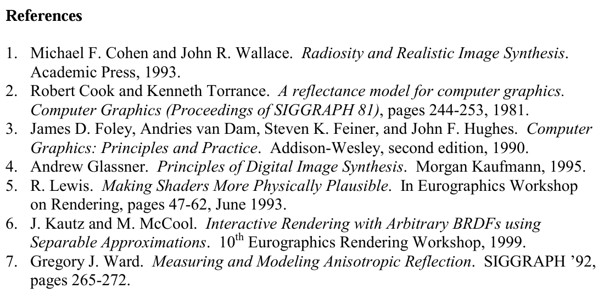

## Layered BSDFs

我们知道真实世界的物体往往是multiple layer的， 比如皮肤， 大理石等等， Naive combination of BSDF lobes does not accurately model scattering between interfaces

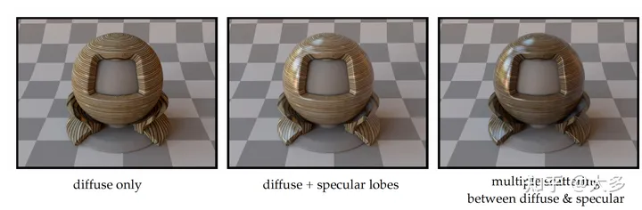

比如说一块木板有光泽，不是因为木板本身能镜面反射，而是以为木板表面的一层材质可以反光

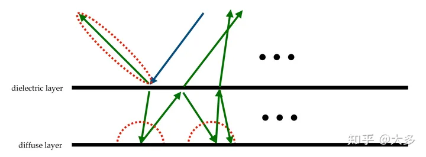

也就是说在多个layer上有不同的反射发生，可以是diffuse的，也可以是specular的
