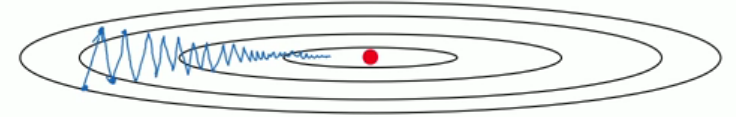
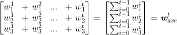
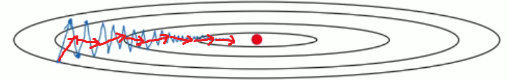
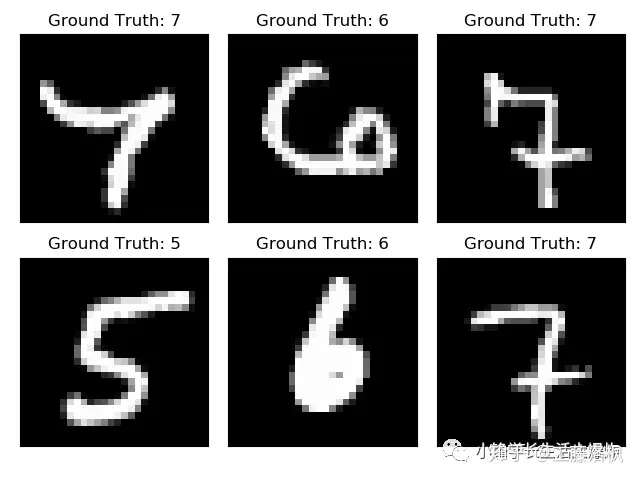
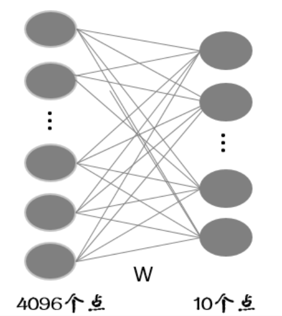
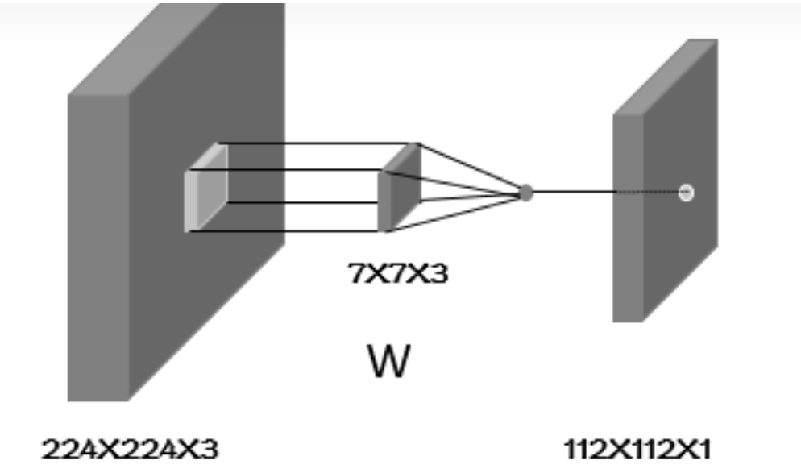
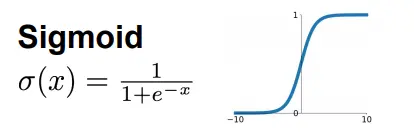

\n
    
    
    鸣谢@Leonard的倾情分享

\n\n\n\n

一些基础的语法笔记之后再补……先写一些实践过程（实现一个minist手写数字识别器，按理是单层的神经网络，之前看敖神手搓过，不过没有记录，现在用torch的框架写一遍，以后不做这个领域的工作的话至少还能用上这些基础）

\n\n\n\n

## 1.preparation

\n\n\n\n

最基础的当然是配置好对应平台的torch环境，有条件可以考虑CUDA，不过暂时似乎可以不用，这种小程序拿CPU也行，对并行计算能力要求不高

\n\n\n\n
    
    
    import torch\nimport torchvision\nfrom torch.utils.data import DataLoader

\n\n\n\n

其次就是准备对应的数据集以及训练参数，我们按照教程所述配置如下

\n\n\n\n
    
    
    n_epochs = 3\nbatch_size_train = 64\nbatch_size_test = 1000\nlearning_rate = 0.01\nmomentum = 0.5\nlog_interval = 10\nrandom_seed = 1\ntorch.manual_seed(random_seed)

\n\n\n\n

解释一下其中每个参数  
一个epoch , 表示： 所有的数据送入网络中， 完成了一次前向计算 + [反向传播](<https://so.csdn.net/so/search?q=%E5%8F%8D%E5%90%91%E4%BC%A0%E6%92%AD&spm=1001.2101.3001.7020>)的过程。  
由于一个epoch 常常太大， 分成 几个小的 baches .  
**batchsize**  
每个batch 中： 训练样本的数量。  
batch size 大小的选择也很重要， 最优化网络模型的性能+速度。  
当数据量较小， 计算机可以承载只有1个batch 的训练方式时， 收敛效果会好。

\n\n\n\n

#### **Momentum（动量）优化算法**

\n\n\n\n

在[深度学习](<https://so.csdn.net/so/search?q=%E6%B7%B1%E5%BA%A6%E5%AD%A6%E4%B9%A0&spm=1001.2101.3001.7020>)中，**Momentum（动量）优化算法** 是对梯度下降法的一种优化， 它在原理上模拟了物理学中的动量，已成为目前非常流行的深度学习优化算法之一。在介绍动量优化算法前，需要对 **指数加权平均法** 有所了解，它是动量优化算法的理论基础

\n\n\n\n

下图表明了传统的[梯度下降](<https://so.csdn.net/so/search?q=%E6%A2%AF%E5%BA%A6%E4%B8%8B%E9%99%8D&spm=1001.2101.3001.7020>)法会存在的问题，即训练轨迹会呈现锯齿状，这无疑会大大延长训练时间。同时，由于存在摆动现象，学习率只能设置的较小，才不会因为步伐太大而偏离最小值。

\n\n\n\n\n\n\n\n

#### 优化思路

\n\n\n\n

一个很朴素的想法便是让纵向的摆动尽量小，同时保持横向的运动方向比较平稳。为此，需要知道梯度在过去的一段时间内的大致走向，以消除当前轮迭代梯度向量存在的方向抖动。

\n\n\n\n\n\n\n\n

problems:

\n\n\n\n

1、较早的梯度对梯度的大致走向预测几乎失去了作用；

\n\n\n\n

2、较早的梯度抖动的较为严重，最近的梯度抖动要弱一些，如果权重都相同，梯度的大致走向预测可能不精确；

\n\n\n\n

3、在梯度下降的后期，参数的搜索空间基本上处于一个凸集上，梯度的每个分量的大小和方向基本固定，不断的将大小和方向基本固定的分量做累加，梯度会变得非常大，造成无法收敛到局部最优。

\n\n\n\n\n\n\n\n

#### 四、基于Momentum的梯度更新

\n\n\n\n

     基本的梯度更新规则如下，其中  表示学习率。

\n\n\n\n\n\n\n\n\n\n\n\n

     根据上述分析，引入指数加权平均后，  的更新规则为：

\n\n\n\n\n\n\n\n\n\n\n\n

     新的梯度更新规则变为

\n\n\n\n\n\n\n\n\n\n\n\n

     关于摩擦系数 ：

\n\n\n\n

> \n
> 
> 1、为 0 时，退化为未优化前的梯度更新；
> 
> \n\n\n\n
> 
> 2、为 1 时， 表示完全没有摩擦，如前所述，这样会存在大的问题；
> 
> \n\n\n\n
> 
> 3、取 **0.9**  是一个较好的选择。可能是 **0.9**  的 **60**  次方约等于**  0.001**，相当仅考虑最近的60轮迭代所产生的的梯度，这个数值看起来相对适中合理。
> 
> \n

\n\n\n\n

其他的之后我再努力理解吧

\n\n\n\n

接下来就要加载数据集了

\n\n\n\n
    
    
    train_loader = torch.utils.data.DataLoader(\n    torchvision.datasets.MNIST('./data/', train=True, download=True,\n                               transform=torchvision.transforms.Compose([\n                                   torchvision.transforms.ToTensor(),\n                                   torchvision.transforms.Normalize(\n                                       (0.1307,), (0.3081,))\n                               ])),\n    batch_size=batch_size_train, shuffle=True)\ntest_loader = torch.utils.data.DataLoader(\n    torchvision.datasets.MNIST('./data/', train=False, download=True,\n                               transform=torchvision.transforms.Compose([\n                                   torchvision.transforms.ToTensor(),\n                                   torchvision.transforms.Normalize(\n                                       (0.1307,), (0.3081,))\n                               ])),\n    batch_size=batch_size_test, shuffle=True)

\n\n\n\n

使用以上的方式下载数据集并且按照batch size做对应的分割

\n\n\n\n

可以用matplotlib画些图看一眼

\n\n\n\n
    
    
    import matplotlib.pyplot as plt\nfig = plt.figure()\nfor i in range(6):\n  plt.subplot(2,3,i+1)\n  plt.tight_layout()\n  plt.imshow(example_data[i][0], cmap='gray', interpolation='none')\n  plt.title("Ground Truth: {}".format(example_targets[i]))\n  plt.xticks([])\n  plt.yticks([])\nplt.show()

\n\n\n\n\n\n\n\n

## 2.Construct the Net

\n\n\n\n

我们将使用两个2d卷积层，然后是两个全连接(或线性)层。作为激活函数，我们将选择整流线性单元(简称ReLUs)，作为正则化的手段，我们将使用两个dropout层。在PyTorch中，构建网络的一个好方法是为我们希望构建的网络创建一个新类。让我们在这里导入一些子模块，以获得更具可读性的代码。

\n\n\n\n

首先我们理解一下神经网络中各个层的含义

\n\n\n\n

### 全连接层

\n\n\n\n

假设全连接层的输入是个4096维的列向量，一般我们把这个向量叫做特征向量（卷积层提取到的特征的输出），经过全连接层得到一个10维的列向量输出（也就是10分类每一类别的评分）。我们如果把输入和输出都看成一个个节点的话，节点与节点之间的关系可以用下图来表示：

\n\n\n\n\n\n\n\n

当然，还有另一种情况，就是输入不是一个行向量，而是一个特征图。假设这个特征图的shape为 [7,7,1024] ，也就是说长宽分别为7，深度为1024的特征图。当我用shape为 [7,7] 的卷积窗进行无pad卷积时得到 [1,1,4098] 的输出，这一层我们也称为全连接层，至于为什么我们在讲卷积层的时候说。

\n\n\n\n

\n
  * **卷积层**
\n
\n\n\n\n

卷积层其实主要是卷积的过程，大致意思是给个模板，在图片上滑动，滑到的区域对应位置相乘再相加。这个过程大家都懂。但是在看论文和代码时，经常会分析一个shape的输入经过一个卷积层后得到的输出shape应该是多少。初学者可能经常会在这犯迷糊（比如我）。后来真正弄清这中间的过程，其实分析起来也不难了。

\n\n\n\n

假设输入的shape为 [1,224,224,3] 经过strid=2,padding=same,窗口shape为 [7,7] 的卷积，得到shape为 [1,112,112,64] 的输出。

\n\n\n\n

首先解释下输入输出中shape的四个数字的含义，第一个代表batch，也就是图片的数量，一般输入的batch是多少，输出的batch是多少。第二和第三个表示图片（特征图）的长度和宽度，第四个表示的图片（特征图）的深度（可以理解为多个二维的像素矩阵叠加在一起）。具体的卷积的话，第一步可以用下图表示：

\n\n\n\n\n\n\n\n

从图中可以看出，这时候我们的weight的深度也变为3了，也就是7X7X3个参数，然后这个滑窗在深度为3的图片上滑动，滑到的区域，也就是一个三维区域，在这个三维区域内对应的像素值与滑窗对应位置的权重相乘，然后将乘到的7X7X3个数字加起来作为我们输出特征图的一个位置的像素值。也就是说我们输出图的一个像素值，是由输入特征图的某个区域内所有的7X7X3个像素值经过线性运算得到的。

\n\n\n\n

说到这，大家是不是想到刚刚说到的全连接层，全连接层的每一个输出元素都是由所有的输入元素经过线性运算得到的，而在卷积过程中，我们得到的每个输出元素，只是由输入中的部分元素（像素），本例子中是7X7X3个像素得到的，所以这种连接结构是**非全连接** 的。当然，当卷积窗口足够大的时候也不是不能叫做全连接层

\n\n\n\n

**线性层/非线性层**

\n\n\n\n

大家有没有发现，之前谈到的无论是全连接层还是卷积层的计算都是简单的乘加运算，也称之为线性运算，这样我们可以作为线性层。但是，线性层的特征表达能力是有限的，所以在这些线性计算之后又引入了非线性计算，增强模型特征的表达能力，也就是大家熟知的激活层，也称为非线性层。这里就列几个激活函数把，具体的就不细究了。

\n\n\n\n\n\n\n\n\n\n\n\n
    
    
    import torch.nn as nn\nimport torch.nn.functional as F\nimport torch.optim as optim\n\nclass Net(nn.Module):\n    def __init__(self):\n        super(Net, self).__init__()\n        self.conv1 = nn.Conv2d(1, 10, kernel_size=5)\n        self.conv2 = nn.Conv2d(10, 20, kernel_size=5)\n        self.conv2_drop = nn.Dropout2d()\n        self.fc1 = nn.Linear(320, 50)\n        self.fc2 = nn.Linear(50, 10)\n    def forward(self, x):\n        x = F.relu(F.max_pool2d(self.conv1(x), 2))\n        x = F.relu(F.max_pool2d(self.conv2_drop(self.conv2(x)), 2))\n        x = x.view(-1, 320)\n        x = F.relu(self.fc1(x))\n        x = F.dropout(x, training=self.training)\n        x = self.fc2(x)\n        return F.log_softmax(x)

\n\n\n\n

\n