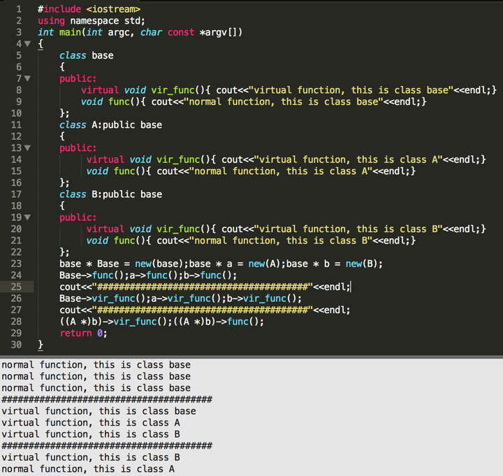
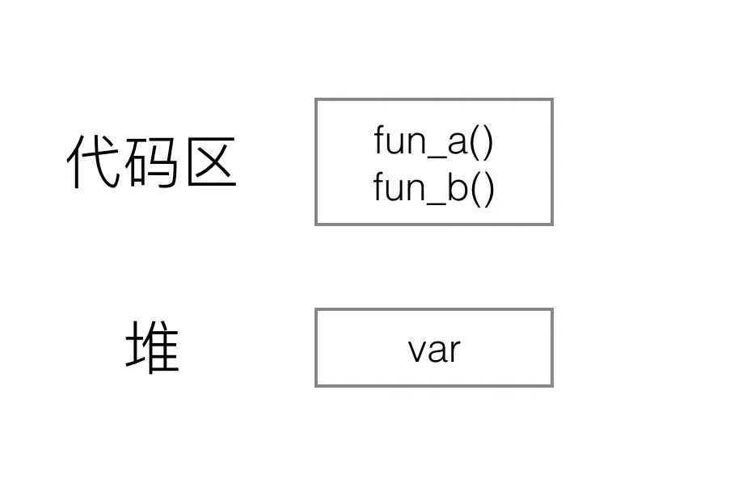
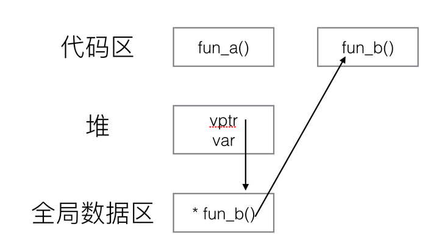

在研究虚函数之前，首先我们需要了解多态的概念

“多态（英语：polymorphism），是指计算机程序运行时，相同的消息可能会送给多个不同的类别之对象，而系统可依据对象所属类别，引发对应类别的方法，而有不同的行为。简单来说，所谓多态意指相同的消息给予不同的对象会引发不同的动作称之。”其实更简单地来说，就是“在用父类指针调用函数时，实际调用的是指针指向的实际类型（子类）的成员函数”。多态性使得程序调用的函数是在运行时动态确定的，而不是在编译时静态确定的。而虚函数则是加了virtual修饰词的类的成员函数。

在上述例子中，我们首先定义了一个基类base，基类有一个名为vir_func的虚函数，和一个名为func的普通成员函数。而类A，B都是由类base派生的子类，并且都对成员函数进行了重载。然后我们定义三个base*类型的指针Base、a、b分别指向类base、A、B。可以看到，当使用这三个指针调用func函数时，调用的都是基类base的函数。而使用这三个指针调用虚函数vir_func时，调用的是指针指向的实际类型的函数。最后，我们将指针b做强制类型转换，转换为A*类型，然后分别调用func和vir_func函数，发现普通函数调用的是类A的函数，而虚函数调用的是类B的函数。

以上，我们可以得出结论“**当使用类的指针调用成员函数时，普通函数由指针类型决定，而虚函数由指针指向的实际类型决定** ”。那么，虚函数又是怎么实现的呢？

## 对象的内存布局

在解释虚函数的实现方式之前，我们首先需要了解对象的内存布局，在这里先做个简单地介绍，后续再专门写一篇详细介绍对象内存布局的文章（这也是一个面试必问题）。对于一个只包含非静态成员变量和普通成员函数的类，如“class C {void fun_a();void fun_b();int var}；”，其内存布局如下图：

其中成员函数放在代码区，为该类的所有对象公有，即不管新建多少个该类的对象，所对应的都是同一个函数存储区的函数。而成员变量则为各个对象所私有，即每新建一个对象都会新建一块内存区用来存储var值。

在调用成员函数时，程序会根据类的类型，找到对应代码区所对应的函数并进行调用。

那虚函数是怎么实现的呢？

这时如果sizeof一个类D的对象，会发现比类C的对象大4个字节。多出来的这4个字节就是实现虚函数的关键----虚函数表指针vptr。这个指针指向一张名为“虚函数表”（vtbl）的表，而表中的数据则为函数指针，存储了虚函数fun_b()具体实现所对应的位置。注意，普通函数、虚函数、虚函数表都是同一个类的所有对象公有的，只有成员变量和虚函数表指针是每个对象私有的，sizeof的值也只包括vptr和var所占内存的大小（也是个常出现的问题），并且vptr通常会在对象内存的最起始位置。

当类有多个虚函数时，仍然只有一个虚函数表指针vptr，而此时的虚函数表vtbl中会有多个函数指针，分别指向对应的虚函数实现区域。在重复一遍虚函数实现的过程：**通过对象内存中的vptr找到虚函数表vtbl，接着通过vtbl找到对应虚函数的实现区域并进行调用。**

## **构造函数和析构函数可以是虚函数吗** ？

答案是**构造函数不能是虚函数，析构函数可以是虚函数且推荐最好设置为虚函数** 。

首先，我们已经知道虚函数的实现则是通过对象内存中的vptr来实现的。而构造函数是用来实例化一个对象的，通俗来讲就是为对象内存中的值做初始化操作。

那么在构造函数完成之前，vptr是没有值的，也就无法通过vptr找到作为虚函数的构造函数所在的代码区，所以构造函数只能作为普通函数存放在类所指定的代码区中。

为什么析构函数推荐最好设置为虚函数呢？如文章开头的例子中，当我们delete(a)的时候，如果析构函数不是虚函数，那么调用的将会是基类base的析构函数。而当继承的时候，**通常派生类会在基类的基础上定义自己的成员** ，此时我们当时是希望可以调用派生类的析构函数对新定义的成员也进行析构啦。
