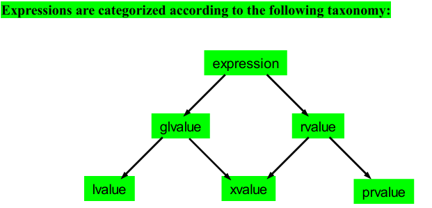

在 C++ 或者 C 语言中，一个[表达式](<https://so.csdn.net/so/search?q=%E8%A1%A8%E8%BE%BE%E5%BC%8F&spm=1001.2101.3001.7020>)（可以是字面量、变量、对象、函数的返回值等）根据其使用场景不同，分为**左值表达式** 和**右值表达式** 。确切的说 C++ 中左值和右值的概念是从 C 语言继承过来的。

左值（lvalue）和右值（rvalue）是比较基础的概念，虽然平常几乎用不到，但C++11之后变得十分重要，它是理解 move/forward 等新语义的基础。

    
    int a; _// a 为左值
_ __a = 3;_// 3 为右值_

> 左值的英文简写为“****lvalue**** ”，右值的英文简写为“****rvalue**** ”。很多人认为它们分别是"left value"、"right value" 的缩写，其实不然。lvalue 是“locator value”的缩写，可意为存储在内存中、有明确存储地址（可寻址）的数据，而 rvalue 译为 "read value"，指的是那些可以提供数据值的数据（不一定可以寻址，例如存储于寄存器中的数据）。
> 
> CSDN

In C++03, an expression is either an **rvalue**  or an **lvalue**.

In C++11, an expression can be an:

  1. **rvalue**

  2. **lvalue**

  3. **xvalue**

  4. **glvalue**

  5. **prvalue**

最完整最权威的解释应该在这里[n3055.pdf (open-std.org)](<https://www.open-std.org/jtc1/sc22/wg21/docs/papers/2010/n3055.pdf>)

不过stackoverflow也说它太长了，所以答主把它做了一些简单的浓缩处理，得到了以下的基本规则

  * An **lvalue**  (so-called, historically, because lvalues could appear on the left-hand side of an assignment expression) designates a function or an object. _[Example: If  `E` is an expression of pointer type, then `*E` is an lvalue expression referring to the object or function to which `E` points. As another example, the result of calling a function whose return type is an lvalue reference is an lvalue.]_

  * An **xvalue**  (an “eXpiring” value) also refers to an object, usually near the end of its lifetime (so that its resources may be moved, for example). An xvalue is the result of certain kinds of expressions involving rvalue references. _[Example: The result of calling a function whose return type is an rvalue reference is an xvalue.]_

  * A **glvalue**  (“generalized” lvalue) is an **lvalue**  or an **xvalue**.

  * An **rvalue**  (so-called, historically, because rvalues could appear on the right-hand side of an assignment expression) is an xvalue, a temporary object or subobject thereof, or a value that is not associated with an object.

  * A **prvalue**  (“pure” rvalue) is an rvalue that is not an xvalue. _[Example: The result of calling a function whose return type is not a reference is a prvalue]_

最简单的方式：

判断某个表达式是左值还是右值的方法：

① 可位于赋值号（=）左侧的表达式就是左值；反之，只能位于赋值号右侧的表达式就是右值。

    
    int a = 5;
5 = a; //错误，5 不能为左值

/*
其中a是一个左值，字面值5是一个右值
*/

【注意】 C++中的左值也可以当作右值使用。

    
    int b = 10; // b 是一个左值
a = b; // a、b 都是左值，只不过将 b 可以当做右值使用

 ② 有名称的、可以获取到存储地址的表达式即为左值；反之则是右值。

 上述示例中变量 a、b 是变量名且通过 &a 和 &b 可以获得他们的存储地址，因此 a 和 b 都是左值；反之，字面量 5、10，它们既没有名称，也无法获取其存储地址（字面量通常存储在寄存器中，或者和代码存储在一起），因此 5、10 都是右值。

在中文网站对于这两种基本的约束做出了这样的解释，接下来我们仔细解读一下那一份pdf来了解c++11之后的数值类型

## c0x(也即c11)背景

The term “rvalue” implies certain characteristics that are incompatible with the  
intended uses for rvalue references.

Rvalues are anonymous and can be copied at will, with the copy assumed to be equivalent to the original. Rvalue references, however, designate（指派） a specific object in memory (even if it is a temporary), and that identity must be maintained. 

rvalue引用是指向内存中特定对象的引用（即使这个对象是临时的）这一点和rvalue的非持久化矛盾  
• The type of an rvalue is fully known – that is, its type must be complete, and its static type is the same as its dynamic type. By contrast, an rvalue reference must support polymorphic 

rvalue的类型是完全已知的，意味着在编译时就已知其类型。与此相反，rvalue引用必须支持多态行为，这意味着它们可以指向不同类型的对象  
behavior and should be able to have an incomplete type.  
• The type of a non-class rvalue is never cv-qualified. An rvalue reference, however, can be bound to a const or volatile non-class object, and that qualification must be preserved.

非类rvalue的类型永远不会被cv-qualified，即它们不会被声明为const或volatile。因为不必要。而rvalue引用可以绑定到const或volatile的非类对象。当rvalue引用绑定到这样的对象时，这些cv-qualification必须被保留。

我们考虑了右值引用类型两种的解决办法：一种是iBaby传统的rvalue视为带有一大堆限制的rvalue，但要在rvalue的规范中添加各种警告和限制，以便那些来自rvalue引用的rvalue具有特殊特性。这种方法可以被称为“有趣的rvalue”（funny rvalue）方法。

所以建议采用一种替代方案：必须看成左值，不过 需要一些例外把它们可以当做右值来处理，比如之前提到的一些情况

在C++11及之后的版本中，引入了右值引用（rvalue reference）和与之相关的概念，包括xvalues和glvalues。以下是一些例子，用以说明lvalues、xvalues和右值引用之间的区别和关系：

### Lvalue（左值）的例子：

    
    int variable = 10; <em>// variable是一个lvalue，因为它是一个命名的对象。</em>
int& reference = variable; <em>// reference是一个lvalue reference，因为它引用了一个已命名的对象。</em>

### Xvalue（即将过期的值）的例子：

    
    int&& xvalueRef = std::move(variable); <em>// xvalueRef是一个xvalue reference，它绑定到一个即将被移动的对象。</em>

在这个例子中，`std::move`操作将`variable`转换为一个xvalue，即一个即将过期的值。`xvalueRef`是一个xvalue引用，它绑定到了这个即将过期的值。这意味着`variable`的资源可以被移动到另一个对象，而`xvalueRef`则表示这个移动操作的中间状态。

### 右值引用与xvalues的关系：

    
    int&& xvalueRef = std::move(variable); <em>// xvalue reference绑定到一个通过std::move转换的lvalue。</em>
int&& prvalueRef = 20; <em>// prvalue reference绑定到一个字面量，这一个字面量是一个prvalue。</em>

在这里，`std::move`将`variable`转换为一个xvalue，而`prvalueRef`直接绑定到一个字面量，这个字面量是一个prvalue（纯右值）。xvalue和prvalue都可以通过右值引用来捕获和操作。

### 总结区别：

  * **Lvalues** ：代表可以取地址的表达式，通常是变量或其他命名对象的引用。lvalues允许对对象进行修改。

  * **Xvalues** ：代表即将被移动或销毁的临时对象。xvalues允许资源的转移，但它们本身是临时的，不能直接访问。

  * **右值引用** ：可以绑定到xvalues或prvalues的引用。它们用于移动语义，允许资源从一个对象转移到另一个对象，而不需要复制。

通过这些例子，我们可以看到lvalues和xvalues在C++中的作用和区别，以及右值引用如何与它们交互，从而实现高效的资源管理和移动语义。这些概念在C++11及之后的版本中非常重要，因为它们是实现现代C++高效编程的基础。

一个表达式是xvalue（即将过期的值）的情况如下：

  * 它是调用一个返回类型为对象类型的rvalue引用的函数的结果，无论是隐式调用还是显式调用；

  * 它是对对象类型的rvalue引用进行类型转换的结果；

  * 它是一个类成员访问表达式，该表达式指定了一个非静态数据成员，而对象表达式是xvalue；

  * 它是一个.*指针到成员的表达式，其中第一个操作数是xvalue，第二个操作数是指向数据成员的指针。

In general, the effect of this rule is that named **rvalue references are treated as lvalues and unnamed rvalue references to objects are treated as xvalues** ;**rvalue references to functions** are treated as lvalues whether named or not.

    
     [Example:
  struct A {
    int m;
  };
  A&& operator+(A, A);
  A&& f();
  A a;
  A&& ar =  static_cast<A&&>(a);

The expressions f(),f().m,static_cast(a), and a + a are xvalues. The expression ar is an lvalue dynamic type of type A. —end example]

标准委员会更改c++标准的文件还是太事无巨细了，只有对于某一特定类型困惑的时候比较适合去看，所以我们先去看cpp_reference中的对应解释

## cppreference Value categories

ach C++ [expression](<https://en.cppreference.com/w/cpp/language/expressions>) (an operator with its operands, a literal, a variable name, etc.) is characterized by two independent properties: a _[type](<https://en.cppreference.com/w/cpp/language/type>)_  and a _value category_. Each expression has some non-reference type, and each expression belongs to exactly one of the three primary value categories: [_prvalue_](<https://en.cppreference.com/w/cpp/language/value_category#prvalue>), [_xvalue_](<https://en.cppreference.com/w/cpp/language/value_category#xvalue>), and [_lvalue_](<https://en.cppreference.com/w/cpp/language/value_category#lvalue>).

  * a [glvalue](<https://en.cppreference.com/w/cpp/language/value_category#glvalue>) (“generalized” lvalue) is an expression whose evaluation determines the identity of an object or function;

  * a [prvalue](<https://en.cppreference.com/w/cpp/language/value_category#prvalue>) (“pure” rvalue) is an expression whose evaluation

  * computes the value of an operand of a built-in operator (such prvalue has no  _result object_), or

  * initializes an object (such prvalue is said to have a  _result object_).

The result object may be a variable, an object created by [new-expression](<https://en.cppreference.com/w/cpp/language/new>), a temporary created by [temporary materialization](<https://en.cppreference.com/w/cpp/language/implicit_conversion#Temporary_materialization>), or a member thereof. Note that non-void [discarded](<https://en.cppreference.com/w/cpp/language/expressions#Discarded-value_expressions>) expressions have a result object (the materialized temporary). Also, every class and array prvalue has a result object except when it is the operand of [`decltype`](<https://en.cppreference.com/w/cpp/language/decltype>);

  * an [xvalue](<https://en.cppreference.com/w/cpp/language/value_category#xvalue>) (an “eXpiring” value) is a glvalue that **denotes an object whose resources can be reused** ;

  * an [lvalue](<https://en.cppreference.com/w/cpp/language/value_category#lvalue>) is a glvalue that is not an xvalue;

  * an [rvalue](<https://en.cppreference.com/w/cpp/language/value_category#rvalue>) is a prvalue or an xvalue;

lvalue和rvalue对应的两个误区区分（由于历史原因l和r具备了左右的含义，所以这里要做出适当的澄清）

    
    void foo();

void baz()
{
    int a; // Expression `a` is lvalue
    a = 4; // OK, could appear on the left-hand side of an assignment expression

    int &b{a}; // Expression `b` is lvalue
    b = 5; // OK, could appear on the left-hand side of an assignment expression

    const int &c{a}; // Expression `c` is lvalue
    c = 6;           // ill-formed, assignment of read-only reference

    // Expression `foo` is lvalue
    // address may be taken by built-in address-of operator
    void (*p)() = &foo;

    foo = baz; // ill-formed, assignment of function
}

    
    #include <iostream>

struct S
{
    S() : m{42} {}
    S(int a) : m{a} {}
    int m;
};

int main()
{
    S s;

    // Expression `S{}` is prvalue
    // May appear on the right-hand side of an assignment expression
    s = S{};

    std::cout << s.m << '\
';

    // Expression `S{}` is prvalue
    // Can be used on the left-hand side too
    std::cout << (S{} = S{7}).m << '\
';
}

## primary categories

### lvalue:

  * the **name** of a variable, a function, a [template parameter object](<https://en.cppreference.com/w/cpp/language/template_parameters#Non-type_template_parameter>)(since C++20), or a data member, regardless of type, such as [std::cin](<http://en.cppreference.com/w/cpp/io/cin>) or [std::endl](<http://en.cppreference.com/w/cpp/io/manip/endl>).**Even if the variable's type is rvalue reference** , the expression consisting of its name is an lvalue expression (but see [Move-eligible expressions](<https://en.cppreference.com/w/cpp/language/value_category#Move-eligible_expressions>));

  * a function call or an overloaded operator expression, whose return type is lvalue reference, such as [std::getline](<http://en.cppreference.com/w/cpp/string/basic_string/getline>)([std::cin](<http://en.cppreference.com/w/cpp/io/cin>), str), [std::cout](<http://en.cppreference.com/w/cpp/io/cout>) << 1, str1 = str2, or ++it;

  * a = b, a += b, a %= b, and all other built-in [assignment and compound assignment](<https://en.cppreference.com/w/cpp/language/operator_assignment>) expressions;

  * ++a and --a, the built-in [pre-increment and pre-decrement](<https://en.cppreference.com/w/cpp/language/operator_incdec#Built-in_prefix_operators>) expressions;

  * *p, the built-in [indirection](<https://en.cppreference.com/w/cpp/language/operator_member_access#Built-in_indirection_operator>) expression;

  * a[n] and p[n], the built-in [subscript](<https://en.cppreference.com/w/cpp/language/operator_member_access#Built-in_subscript_operator>) expressions, where one operand in a[n] is an array lvalue(since C++11);

  * a.m, the [member of object](<https://en.cppreference.com/w/cpp/language/operator_member_access#Built-in_member_access_operators>) expression, except where `m` is a member enumerator or a non-static member function, or where a is an rvalue and `m` is a non-static data member of object type;

  * p->m, the built-in [member of pointer](<https://en.cppreference.com/w/cpp/language/operator_member_access#Built-in_member_access_operators>) expression, except where `m` is a member enumerator or a non-static member function;

  * a.*mp, the [pointer to member of object](<https://en.cppreference.com/w/cpp/language/operator_member_access#Built-in_pointer-to-member_access_operators>) expression, where a is an lvalue and `mp` is a pointer to data member;

  * p->*mp, the built-in [pointer to member of pointer](<https://en.cppreference.com/w/cpp/language/operator_member_access#Built-in_pointer-to-member_access_operators>) expression, where `mp` is a pointer to data member;

  * a, b, the built-in [comma](<https://en.cppreference.com/w/cpp/language/operator_other#Built-in_comma_operator>) expression, where b is an lvalue;

  * a ? b : c, the [ternary conditional](<https://en.cppreference.com/w/cpp/language/operator_other#Conditional_operator>) expression for certain b and c (e.g., when both are lvalues of the same type, but see [definition](<https://en.cppreference.com/w/cpp/language/operator_other#Conditional_operator>) for detail);

  * a [string literal](<https://en.cppreference.com/w/cpp/language/string_literal>), such as "Hello, world!";

  * a cast expression to lvalue reference type, such as static_cast<int&>(x) or static_cast<void(&)(int)>(x);

  * a non-type [template parameter](<https://en.cppreference.com/w/cpp/language/template_parameters>) of an lvalue reference type;

    
    int&& foo = 10; // foo 是一个右值引用
// 但是，"foo" 是一个左值表达式，因为它表示一个具体的，已命名的对象
int* p = &foo; // 这是合法的

### prvalue

The following expressions are _prvalue expressions_ :

  * a [literal](<https://en.cppreference.com/w/cpp/language/expressions#Literals>) (except for [string literal](<https://en.cppreference.com/w/cpp/language/string_literal>)), such as 42, true or nullptr;

  * a function call or an overloaded operator expression, whose return type is non-reference, such as str.substr(1, 2), str1 + str2, or it++;

  * a++ and a--, the built-in [post-increment and post-decrement](<https://en.cppreference.com/w/cpp/language/operator_incdec#Built-in_postfix_operators>) expressions;

  * a + b, a % b, a & b, a << b, and all other built-in [arithmetic](<https://en.cppreference.com/w/cpp/language/operator_arithmetic>) expressions;

  * a && b, a || b, !a, the built-in [logical](<https://en.cppreference.com/w/cpp/language/operator_logical>) expressions;

  * a < b, a == b, a >= b, and all other built-in [comparison](<https://en.cppreference.com/w/cpp/language/operator_comparison>) expressions;

  * &a, the built-in [address-of](<https://en.cppreference.com/w/cpp/language/operator_member_access#Built-in_address-of_operator>) expression;

  * a.m, the [member of object](<https://en.cppreference.com/w/cpp/language/operator_member_access#Built-in_member_access_operators>) expression,**where`m` is a member enumerator or a non-static member function[[2]](<https://en.cppreference.com/w/cpp/language/value_category#cite_note-pmfc-2>);**

  * p->m, the built-in [member of pointer](<https://en.cppreference.com/w/cpp/language/operator_member_access#Built-in_member_access_operators>) expression, where `m` is a member enumerator or a non-static member function[[2]](<https://en.cppreference.com/w/cpp/language/value_category#cite_note-pmfc-2>);

  * a.*mp, the [pointer to member of object](<https://en.cppreference.com/w/cpp/language/operator_member_access#Built-in_pointer-to-member_access_operators>) expression, where `mp` is a pointer to member function[[2]](<https://en.cppreference.com/w/cpp/language/value_category#cite_note-pmfc-2>);

  * p->*mp, the built-in [pointer to member of pointer](<https://en.cppreference.com/w/cpp/language/operator_member_access#Built-in_pointer-to-member_access_operators>) expression, where `mp` is a pointer to member function[[2]](<https://en.cppreference.com/w/cpp/language/value_category#cite_note-pmfc-2>);

  * a, b, the built-in [comma](<https://en.cppreference.com/w/cpp/language/operator_other#Built-in_comma_operator>) expression, where b is an prvalue;

  * a ? b : c, the [ternary conditional](<https://en.cppreference.com/w/cpp/language/operator_other#Conditional_operator>) expression for certain b and c (see [definition](<https://en.cppreference.com/w/cpp/language/operator_other#Conditional_operator>) for detail);

  * a cast expression to non-reference type, such as static_cast<double>(x), [std::string](<http://en.cppreference.com/w/cpp/string/basic_string>){}, or (int)42;

  * the [`this`](<https://en.cppreference.com/w/cpp/language/this>) pointer;

  * an [enumerator](<https://en.cppreference.com/w/cpp/language/enum>);

  * a non-type [template parameter](<https://en.cppreference.com/w/cpp/language/template_parameters>) of a scalar type;

a [lambda expression](<https://en.cppreference.com/w/cpp/language/lambda>), such as { return x * x; };| (since C++11)  
---|---  
a [requires-expression](<https://en.cppreference.com/w/cpp/language/constraints>), such as requires (T i) { typename T::type; };a specialization of a [concept](<https://en.cppreference.com/w/cpp/language/constraints>), such as [std::equality_comparable](<http://en.cppreference.com/w/cpp/concepts/equality_comparable>)<int>.  

### xvalue

The following expressions are _xvalue expressions_ :

  * a.m, the [member of object](<https://en.cppreference.com/w/cpp/language/operator_member_access#Built-in_member_access_operators>) expression, where a is an rvalue and `m` is a non-static data member of an object type;

  * a.*mp, the [pointer to member of object](<https://en.cppreference.com/w/cpp/language/operator_member_access#Built-in_pointer-to-member_access_operators>) expression, where a is an rvalue and `mp` is a pointer to data member;

  * a, b, the built-in [comma](<https://en.cppreference.com/w/cpp/language/operator_other#Built-in_comma_operator>) expression, where b is an xvalue;

  * a ? b : c, the [ternary conditional](<https://en.cppreference.com/w/cpp/language/operator_other#Conditional_operator>) expression for certain b and c (see [definition](<https://en.cppreference.com/w/cpp/language/operator_other#Conditional_operator>) for detail);

a function call or an overloaded operator expression, whose return type is rvalue reference to object, such as std::move(x);a[n], the built-in [subscript](<https://en.cppreference.com/w/cpp/language/operator_member_access#Built-in_subscript_operator>) expression, where one operand is an array rvalue;a cast expression to rvalue reference to object type, such as static_cast<char&&>(x);| (since C++11)  
---|---  
any expression that designates a temporary object, after [temporary materialization](<https://en.cppreference.com/w/cpp/language/implicit_conversion#Temporary_materialization>);| (since C++17)  
a [move-eligible expression](<https://en.cppreference.com/w/cpp/language/value_category#Move-eligible_expressions>).  

    
    struct Foo {
    int x;
};
Foo foo; // foo 是一个左值
Foo* p = &foo; // p 是一个左值
int Foo::*pm = &Foo::x; // pm 是一个左值

在上述代码中，`foo` 和 `p` 都是左值，因为它们都是具名对象，我们可以获取它们的地址。

    
    (p->*pm) = 42; // (p->*pm) 是一个左值

在这个例子中，`(p->*pm)` 是一个左值，因为它表示一个具体的，已命名的对象，我们可以对它进行赋值操作。

    
    Foo().x; // Foo().x 是一个将亡值（xvalue）

在这个例子中，`Foo().x` 是一个将亡值（xvalue），因为 `Foo()` 是一个临时对象，其成员 `x` 的生命周期即将结束。

    
    42; // 42 是一个纯右值（prvalue）

在这个例子中，`42` 是一个纯右值（prvalue），因为它不表示任何对象，只表示一个值。

## Mixed categories

### glvalue

A _glvalue expression_  is either lvalue or xvalue.

Properties:

  * A glvalue may be implicitly converted to a prvalue with lvalue-to-rvalue, array-to-pointer, or function-to-pointer [implicit conversion](<https://en.cppreference.com/w/cpp/language/implicit_conversion>).

  * A glvalue may be [polymorphic](<https://en.cppreference.com/w/cpp/language/object#Polymorphic_objects>): the [dynamic type](<https://en.cppreference.com/w/cpp/language/type#Dynamic_type>) of the object it identifies is not necessarily the static type of the expression.

  * A glvalue can have [incomplete type](<https://en.cppreference.com/w/cpp/language/type#Incomplete_type>), where permitted by the expression.

### rvalue

An _rvalue expression_  is either prvalue or xvalue.

Properties:

  * Address of an rvalue cannot be taken by built-in address-of operator: &int(), &i++[[3]](<https://en.cppreference.com/w/cpp/language/value_category#cite_note-3>), &42, and &std::move(x) are invalid.

  * An rvalue can't be used as the left-hand operand of the built-in assignment or compound assignment operators.

  * An rvalue may be used to [initialize a const lvalue reference](<https://en.cppreference.com/w/cpp/language/reference_initialization>), in which case the lifetime of the temporary object identified by the rvalue is [extended](<https://en.cppreference.com/w/cpp/language/reference_initialization#Lifetime_of_a_temporary>) until the scope of the reference ends.

An rvalue may be used to [initialize an rvalue reference](<https://en.cppreference.com/w/cpp/language/reference_initialization>), in which case the lifetime of the temporary object identified by the rvalue is [extended](<https://en.cppreference.com/w/cpp/language/reference_initialization#Lifetime_of_a_temporary>) until the scope of the reference ends.When used as a function argument and when [two overloads](<https://en.cppreference.com/w/cpp/language/overload_resolution>) of the function are available, one taking rvalue reference parameter and the other taking lvalue reference to const parameter, an rvalue binds to the rvalue reference overload (thus, if both copy and move constructors are available, an rvalue argument invokes the [move constructor](<https://en.cppreference.com/w/cpp/language/move_constructor>), and likewise with copy and move assignment operators).  
---  

以上对于c++中的各种类型做出了足够详尽的分类，不过我们仍然不清楚rvalue,lvalue乃至xvalue,prvalue的使用和实际场景的作用，所以我refer to了一篇相对比较优质的知乎文章寻求帮助[C++11朝码夕解: move和forward - 知乎 (zhihu.com)](<https://zhuanlan.zhihu.com/p/55856487>)

注意：以下文章中暴论颇多，有一些“原则式的错误”，比如对于move和forward的说明误导性很大

## **太长不看细节: TL;DR:**

(1) 问题: 临时变量copy开销太大

(2) 引入: rvalue, lvalue, rvalue reference概念

(3) 方法: rvalue reference传临时变量, move语义避免copy

(4) 优化: forward同时能处理rvalue/lvalue reference和const reference

## **两个C++的基础背景**

  1. C++传值默认是copy

  2. copy开销很大

    
    func("some temporary string"); //初始化string, 传入函数, 可能会导致string的复制
v.push_back(X()); //初始化了一个临时X, 然后被复制进了vector
a = b + c; //b+c是一个临时值, 然后被赋值给了a
x++; //x++操作也有临时变量的产生
a = b + c + d; //c+d一个临时变量, b+(c+d)另一个临时变量

我看到这里做出了我的猜测：这几个应该需要把常量字符串当成一个xvalue来做，然后及时销毁，或者创建生命周期足够长的引用，而无需拷贝

以上copy操作有没有必要呢? 有些地方可不可以省略呢? 我们来看看下面一个案例, 之后我们会用到它来推导出为什么我们需要move和forward:

假如有一个class A, 带有一个set函数, 可以传两个参数赋值class里的成员变量:

    
    class A{...};
void A::set(const string & var1, const string & var2){
  m_var1 = var1;  //copy
  m_var2 = var2;  //copy
}

下面这个写法是没法避免copy的, 因为怎么着都得把外部初始的string传进set函数, 再复制给成员变量:

    
    A a1;
string var1("string1");
string var2("string2");
a1.set(var1, var2); // OK to copy

但下面这个呢? 临时生成了2个string, 传进set函数里, 复制给成员变量, 然后这两个临时string再被回收. 是不是有点多余?

    
    A a1;
a1.set("temporary str1","temporary str2"); //temporary, unnecessary copy

上面复制的行为, 在底层的操作很可能是这样的:

(1)临时变量的内容先被复制一遍  
(2)被复制的内容覆盖到成员变量指向的内存  
(3)临时变量用完了再被回收

这里能不能优化一下呢? 临时变量反正都要被回收, 如果能直接把临时变量的内容, 和成员变量内容交换一下, 就能避免复制了? 如下:

(1)成员变量内部的指针指向"temporary str1"所在的内存  
(2)临时变量内部的指针指向成员变量以前所指向的内存  
(3)最后临时变量指向的那块内存再被回收

上面这个操作避免了一次copy的发生, 其实它就是所谓的move语义.

那么这个临时变量, 在以前是解决不了了. 为了填这个坑, 蛋疼的C++委员会就说, 不如把C++搞得更复杂一些吧!

于是就引入了rvalue和lvalue的概念, 之前说的那些临时变量就是rvalue. 上面说的避免copy的操作就是`std::move`

传临时变量的时候, 可以传`T &&`, 叫rvalue reference(右值引用), 它能接收rvalue(临时变量), 之后再调用`std::move`就避免copy了.

    
    void set(string && var1, string && var2){
  //avoid unnecessary copy!
  m_var1 = std::move(var1);  
  m_var2 = std::move(var2);
}
A a1;
//temporary, move! no copy!
a1.set("temporary str1","temporary str2");

## **新的问题: 避免重复**

现在终于能处理临时变量了, 但如果按上面那样写, 处理临时变量用右值引用`string &&`, 处理普通变量用const引用`const string &`... 这边出现了麻烦的重载问题

这代码量有点大呀? 每次都至少要写两遍, overload一个新的method吗?

回忆一下程序员的核心价值观是什么? 避免重复!

## **perfect forward (完美转发)**

上面说的各种情况, 包括传`const T &`, `T &&`, 都可以由以下操作代替:

    
    template<typename T1, typename T2>
void set(T1 && var1, T2 && var2){
  m_var1 = std::forward<T1>(var1);
  m_var2 = std::forward<T2>(var2);
}
//when var1 is an rvalue, std::forward<T1> equals to static_cast<[const] T1 &&>(var1)
//when var1 is an lvalue, std::forward<T1> equals to static_cast<[const] T1 &>(var1)

forward能转发下面所有的情况:

    
    [const] T &[&]

也就是:

    
    const T &
T &
const T &&
T &&

## **那我们有了forward为什么还要用move?**

技术上来说, forward确实可以替代所有的move.

可能会有人在这里和我杠吧. 这你得去和"Effective Modern C ++"的作者Scott Meyers去争了:

> 

> 
> "From a purely technical perspective, the answer is yes: std::forward can do it all. std::move isn’t necessary. "  
> 来源：[https://stackoverflow.com/a/28828689](<https://link.zhihu.com/?target=https%3A//stackoverflow.com/a/28828689>)
> 
> 

但还有一些问题:

首先, forward常用于template函数中, 使用的时候必须要多带一个template参数T: `forward<T>`, 代码略复杂;

还有, 明确只需要move的情况而用forward, 代码意图不清晰, 其他人看着理解起来比较费劲.

**更技术上来说, 他们都可以被static_cast替代**. 为什么不用static_cast呢? 也就是为了读着方便易懂.

ref: [https://stackoverflow.com/quest](<https://link.zhihu.com/?target=https%3A//stackoverflow.com/questions/28828159/usage-of-stdforward-vs-stdmove>)

## Some other articles

## 1\. std::move

别看它的名字叫move，其实std::move并不能移动任何东西，它唯一的功能是将一个`左值/右值强制转化为右值引用`，继而可以通过右值引用使用该值，所以称为`移动语义`。

std::move的**作用** ：将对象的状态或者所有权从一个对象转移到另一个对象，只是转移，没有内存的搬迁或者内存拷贝所以可以提高利用效率,改善性能。 它是怎么个转移法，将在文章的最后面解释。

`看到std::move的代码，意味着给std::move的参数，在调用之后，就不再使用了。`

函数原型：

    
    /**
 *  @brief  Convert a value to an rvalue.
 *  @param  __t  A thing of arbitrary type.
 *  @return The parameter cast to an rvalue-reference to allow moving it.
*/
template <typename T>
typename remove_reference<T>::type&& move(T&& t)
{
\treturn static_cast<typename remove_reference<T>::type&&>(t);
}

    
    /// remove_reference
  template<typename _Tp>
    struct remove_reference
    { typedef _Tp   type; };
  template<typename _Tp>
    struct remove_reference<_Tp&>
    { typedef _Tp   type; };
  template<typename _Tp>
    struct remove_reference<_Tp&&>
    { typedef _Tp   type; };

### 参数讨论

先看`参数 T&& t`，其参数看起来是个右值引用，其是不然！！！

因为T是个模板，当右值引用和模板结合的时候，就复杂了。`T&&`并不一定表示右值引用，它可能是个左值引用又可能是个右值引用。

再弄个清爽的代码解释一下：

    
    template<typename T>
void func( T&& param){

}
func(5);  <em>//15是右值， param是右值引用</em>
int a = 10; <em>//</em>
func(a); <em>//x是左值, param是左值引用</em>

这里的`&&`是一个**未定义的引用类型** ，称为  
`通用引用 Universal References`  
(https://isocpp.org/blog/2012/11/universal-references-in-c11-scott-meyers）

它必须被初始化，它是左值引用还是右值引用却决于它的初始化，如果它被一个左值初始化，它就是一个左值引用；如果被一个右值初始化，它就是一个右值引用。

**注意** ，只有当发生自动类型推断时（如函数模板的类型自动推导，或auto关键字），`&&`才是一个`Universal References`。

### 通用引用

这里还可以再深入一下**通用引用** ，解释为什么它一会可以左值引用，一会可以右值引用。  
既然T是个模板，那T就可以是string，也可以是string&，或者string&&。  
那参数就变成  
(string&& && param)了  
这么多&怎么办？好吓人！！！  
没事，稳住，C++ 11立了规矩，太多&就要折叠一下(也就是传说中的`引用折叠`)。具体而言

> 

> 
> X& &、X&& &、X& &&都折叠成X&
> 
> 

> 

> 
> X&& &&折叠成X&&
> 
> 
这里有一个非常好的介绍universal refrence的示例代码

    
    #include <iostream>
#include <type_traits>
#include <string>
using namespace std;
template<typename T>
void func(T&& param) {
    if (std::is_same<string, T>::value)
        std::cout << "string" << std::endl;
    else if (std::is_same<string&, T>::value)
        std::cout << "string&" << std::endl;
    else if (std::is_same<string&&, T>::value)
        std::cout << "string&&" << std::endl;
    else if (std::is_same<int, T>::value)
        std::cout << "int" << std::endl;
    else if (std::is_same<int&, T>::value)
        std::cout << "int&" << std::endl;
    else if (std::is_same<int&&, T>::value)
        std::cout << "int&&" << std::endl;
    else
        std::cout << "unkown" << std::endl;
}
int getInt() {
    return 10;
}
int main() {
    int x = 1;
    func(1); // 传递参数是右值 T推导成了int, 所以是int&& param, 右值引用
    func(x); // 传递参数是左值 T推导成了int&, 所以是int&&& param, 折叠成 int&,左值引用
    func(getInt());// 参数getInt是右值 T推导成了int, 所以是int&& param, 右值引用
    return 0;
}

### 1.5 std::move的常用例子

#### 1.5.1 用于vector添加值

以下是一个经典的用例：

    

//摘自https://zh.cppreference.com/w/cpp/utility/move
#include <iostream>
#include <utility>
#include <vector>
#include <string>
int main()
{
    std::string str = "Hello";
    std::vector<std::string> v;
    //调用常规的拷贝构造函数，新建字符数组，拷贝数据
    v.push_back(str);
    std::cout << "After copy, str is \\"" << str << "\\"\
";
    //调用移动构造函数，掏空str，掏空后，最好不要使用str
    v.push_back(std::move(str));
    std::cout << "After move, str is \\"" << str << "\\"\
";
    std::cout << "The contents of the vector are \\"" << v[0]
                                         << "\\", \\"" << v[1] << "\\"\
";

**After copy, str is "Hello"  
After move, str is ""  
The contents of the vector are "Hello", "Hello"**

## std::foward

有了前面的讨论，这个就简单一些了，不铺的很开。先看函数原型

    
      /**
   *  @brief  Forward an lvalue.
   *  @return The parameter cast to the specified type.
   *
   *  This function is used to implement "perfect forwarding".
   */
  template<typename _Tp>
    constexpr _Tp&&
    forward(typename std::remove_reference<_Tp>::type& __t) noexcept
    { return static_cast<_Tp&&>(__t); }
  /**
   *  @brief  Forward an rvalue.
   *  @return The parameter cast to the specified type.
   *
   *  This function is used to implement "perfect forwarding".
   */
  template<typename _Tp>
    constexpr _Tp&&
    forward(typename std::remove_reference<_Tp>::type&& __t) noexcept
    {
      static_assert(!std::is_lvalue_reference<_Tp>::value, "template argument"
            " substituting _Tp is an lvalue reference type");
      return static_cast<_Tp&&>(__t);
    }

有两个函数：  
第一个，参数是左值引用，可以接受左值。  
第二个，参数是右值引用，可以接受右值。

反正不管怎么着，都是一个引用，那就都是别名，也就是谁读取std::forward，都直接可以得到std::foward所赋值的参数。

# C++的std::move与std::forward原理大白话总结

[newchenxf](<https://blog.csdn.net/newchenxf>)于 2021-06-18 18:28:12 发布

阅读量4.5k 收藏 58

点赞数 15

分类专栏： [C++](<https://blog.csdn.net/newchenxf/category_11006417.html>)

版权

[C++专栏收录该内容](<https://blog.csdn.net/newchenxf/category_11006417.html>)

7 篇文章2 订阅

订阅专栏

阅读大型的C++开源项目代码，基本逃不过std::move和std::forward，例如[webRTC](<https://so.csdn.net/so/search?q=webRTC&spm=1001.2101.3001.7020>)。  
所以搞懂其原理，很有必要。

网络上已有不少文章介绍（见@参考），但是比较分散，所以我把自认为的关键点，加上一些自己的想法，提取总结一下。

## 1\. std::move

别看它的名字叫move，其实std::move并不能移动任何东西，它唯一的功能是将一个`左值/右值强制转化为右值引用`，继而可以通过右值引用使用该值，所以称为`移动语义`。

std::move的**作用** ：将对象的状态或者所有权从一个对象转移到另一个对象，只是转移，没有内存的搬迁或者内存拷贝所以可以提高利用效率,改善性能。 它是怎么个转移法，将在文章的最后面解释。

`看到std::move的代码，意味着给std::move的参数，在调用之后，就不再使用了。`

### 1.1 函数原型

函数定义原型：

    
     _/**
 *  @brief  Convert a value to an rvalue.
 *  @param  __t  A thing of arbitrary type.
 *  @return The parameter cast to an rvalue-reference to allow moving it.
*/_ 
template <typename T>
typename remove_reference<T>::type&& move(T&& t)
{
\treturn static_cast<typename remove_reference<T>::type&&>(t);
}

用到的remove_reference定义

    
     _/// remove_reference_ 
  template<typename _Tp>
    struct remove_reference
    { typedef _Tp   type; };
  template<typename _Tp>
    struct remove_reference<_Tp&>
    { typedef _Tp   type; };
  template<typename _Tp>
    struct remove_reference<_Tp&&>
    { typedef _Tp   type; };

### 1.2 参数讨论

先看`参数 T&& t`，其参数看起来是个右值引用，其是不然！！！

因为T是个模板，当右值引用和模板结合的时候，就复杂了。`T&&`并不一定表示右值引用，它可能是个左值引用又可能是个右值引用。

再弄个清爽的代码解释一下：

    
    template<typename T>
void func( T&& param){

}
func(5);  _//15是右值， param是右值引用_ 
int a = 10; _//_ 
func(a); _//x是左值, param是左值引用_ 

这里的`&&`是一个**未定义的引用类型** ，称为  
`通用引用 Universal References`  
(https://isocpp.org/blog/2012/11/universal-references-in-c11-scott-meyers）

它必须被初始化，它是左值引用还是右值引用却决于它的初始化，如果它被一个左值初始化，它就是一个左值引用；如果被一个右值初始化，它就是一个右值引用。

**注意** ，只有当发生自动类型推断时（如函数模板的类型自动推导，或auto关键字），`&&`才是一个`Universal References`。

### 1.3 通用引用

这里还可以再深入一下**通用引用** ，解释为什么它一会可以左值引用，一会可以右值引用。  
既然T是个模板，那T就可以是string，也可以是string&，或者string&&。  
那参数就变成  
(string&& && param)了  
这么多&怎么办？好吓人！！！  
没事，稳住，C++ 11立了规矩，太多&就要折叠一下(也就是传说中的`引用折叠`)。具体而言

> 

> 
> X& &、X&& &、X& &&都折叠成X&
> 
> 

> 

> 
> X&& &&折叠成X&&
> 
> 

所以，想知道 param 最终是什么引用，就看T被推导成什么类型了。  
可以用下面的一个测试程序，来验证。

    
    #include <iostream>
#include <type_traits>
#include <string>
using namespace std;
template<typename T>
void func(T&& param) {
    if (std::is_same<string, T>::value)
        std::cout << "string" << std::endl;
    else if (std::is_same<string&, T>::value)
        std::cout << "string&" << std::endl;
    else if (std::is_same<string&&, T>::value)
        std::cout << "string&&" << std::endl;
    else if (std::is_same<int, T>::value)
        std::cout << "int" << std::endl;
    else if (std::is_same<int&, T>::value)
        std::cout << "int&" << std::endl;
    else if (std::is_same<int&&, T>::value)
        std::cout << "int&&" << std::endl;
    else
        std::cout << "unkown" << std::endl;
}
int getInt() {
    return 10;
}
int main() {
    int x = 1;
    func(1); _// 传递参数是右值 T推导成了int, 所以是int && param, 右值引用_
    func(x); _// 传递参数是左值 T推导成了int &, 所以是int&&& param, 折叠成 int&,左值引用_
    func(getInt());_// 参数getInt是右值 T推导成了int, 所以是int && param, 右值引用_
    return 0;
}

### 1.4 返回值

我们以T为string为例子，简化一下函数定义：

    
     _//T的类型为string_ 
 _//remove_reference <T>::type为string _
 _//整个std::move被实例如下_ 
string&& move(string&& t) _//可以接受右值_ 
{
    return static_cast<string&&>(t);  _//返回一个右值引用_ 
}

显而易见，用static_cast，返回的一定是个右值引用。

综上，`std::move基本等同于一个类型转换：static_cast<T&&>(lvalue);`

即，输入可以是左值，右值，输出，是一个右值引用。

### 1.5 std::move的常用例子

#### 1.5.1 用于vector添加值

以下是一个经典的用例：

    

 _//摘自https://zh.cppreference.com/w/cpp/utility/move_ 
#include <iostream>
#include <utility>
#include <vector>
#include <string>
int main()
{
    std::string str = "Hello";
    std::vector<std::string> v;
    _//调用常规的拷贝构造函数，新建字符数组，拷贝数据_ 
    v.push_back(str);
    std::cout << "After copy, str is \\"" << str << "\\"\
";
    _//调用移动构造函数，掏空str，掏空后，最好不要使用str_ 
    v.push_back(std::move(str));
    std::cout << "After move, str is \\"" << str << "\\"\
";
    std::cout << "The contents of the vector are \\"" << v[0]
                                         << "\\", \\"" << v[1] << "\\"\
";

输出：

    
    After copy, str is "Hello"
After move, str is ""
The contents of the vector are "Hello", "Hello"

#### 1.5.2 用于unique_ptr传递

    
    #include <stdio.h>
#include <unistd.h>
#include <memory>
#include <iostream>
 _/***** 类定义开始****/_ 
class TestC {
public:
    TestC(int tmpa, int tmpb):a(tmpa),b(tmpb) {
        std::cout<< "construct TestC " << std::endl;
    }
    ~TestC() {
        std::cout<< "destruct TestC " << std::endl;
    }
    void print() {
        std::cout << "print a " << a << " b " << b << std::endl;
    }
private:
    int a = 10;
    int b = 5;
};
void TestFunc(std::unique_ptr<TestC> ptrC) {
    printf("TestFunc called \
");
    ptrC->print();
}
 _/***** 类定义结束****/_ 

int main(int argc, char* argv[]) {
    std::unique_ptr<TestC> gPtrC(new TestC(2, 3));
    _//初始化也可以写成如下这一句_ 
    _//std::unique_ptr <TestC> gPtrC = std::make_unique<TestC>(2, 3);_
    TestFunc(std::move(gPtrC));
    _//执行下面这一句会崩溃，因为gPtrC已经没有控制权_ 
    gPtrC->print();
    return 0;
}
1234567891011121314151617181920212223242526272829303132333435363738394041424344

输出：

    
    construct TestC 
TestFunc called 
print a 2 b 3
destruct TestC 

从日志可见，只有一次构造。

这种类型的代码，在大型开源项目，如webRTC，随处可见。下次看到了不用纠结，不用关心细节了。只要直到最后拿到unique_ptr的变量（左值）有控制权就行了。

### 1.6 再说转移对象控制权

从@1.5.2的例子，看到std::move(gPtrC)之后，执行gPtrC->print();会崩溃？这是为什么呢？  
其是，不全部是std::move的功劳，还需要使用方，即unique_ptr配合才行。

请看这篇文章：  
https://blog.csdn.net/newchenxf/article/details/116274506  
当调用  
TestFunc(std::move(gPtrC));  
这TestFunc的参数ptrC要初始化，调用的是operator=，我把关键代码截取如下：

    
    class unique_ptr
{
private:
\tT * ptr_resource = nullptr;
\t...
    unique_ptr& operator=(unique_ptr&& move) noexcept
\t{
\t\tmove.swap(*this);
\t\treturn *this;
\t}
 _// swaps the resources_ 
\tvoid swap(unique_ptr<T>& resource_ptr) noexcept
\t{
\t\tstd::swap(ptr_resource, resource_ptr.ptr_resource);
\t}
1234567891011121314151617

从函数看，执行完赋值后，智能指针的托管对象，即ptr_resource，交换了。  
本来函数的参数ptrC，托管对象ptr_resource为空，现在换来了一个有用的，把空的，换给了gPtrC，于是gPtrC的资源为空，所以gPtrC使用资源时，也遇到空指针的错误了！

## 2\. std::foward

有了前面的讨论，这个就简单一些了，不铺的很开。先看函数原型：

    
      _/**
   *  @brief  Forward an lvalue.
   *  @return The parameter cast to the specified type.
   *
   *  This function is used to implement "perfect forwarding".
   */_ 
  template<typename _Tp>
    constexpr _Tp&&
    forward(typename std::remove_reference<_Tp>::type& __t) noexcept
    { return static_cast<_Tp&&>(__t); }
  _/**
   *  @brief  Forward an rvalue.
   *  @return The parameter cast to the specified type.
   *
   *  This function is used to implement "perfect forwarding".
   */_ 
  template<typename _Tp>
    constexpr _Tp&&
    forward(typename std::remove_reference<_Tp>::type&& __t) noexcept
    {
      static_assert(!std::is_lvalue_reference<_Tp>::value, "template argument"
            " substituting _Tp is an lvalue reference type");
      return static_cast<_Tp&&>(__t);
    }

有两个函数：  
第一个，参数是左值引用，可以接受左值。  
第二个，参数是右值引用，可以接受右值。

根据引用折叠的原理，如果传递的是左值，Tp推断为string&，则返回变成  
static_cast<string& &&>，也就是static_cast<string&>，所以返回的是左值引用。

如果传递的是右值，Tp推断为string或string&&，则返回变成  
static_cast<string&&>，所以返回的是右值引用。

反正不管怎么着，都是一个引用，那就都是别名，也就是谁读取std::forward，都直接可以得到std::foward所赋值的参数。

这就是`完美转发`的基本原理！

### 2.1 std::forward的常用例子

阅读一些大型项目代码，发现std::forward常用于Lambda函数的完美转发。  
我从项目中抽取了代码，来说明其使用方式。具体见下面。

    
    /**
 * 编译：g++ test_forward.cpp -lpthread -o out
 * 执行：./out
 * 
 * 这是测试代码，不够严谨，仅为了说明std::forward的用途
 * 例子的意思是，希望执行一个函数，函数放在子线程执行，函数由业务方随时定义
 * */
#include <stdio.h>
#include <unistd.h>
#include <memory>
#include <iostream>
#include <thread>
template <typename Closure>
class ClosureTask {
public:
    explicit ClosureTask(std::string &&name, Closure &&closure):
        name_(std::forward<std::string>(name)),
        closure_(std::forward<Closure>(closure)) {
        }

    bool DoTask() {
        closure_();//执行Lambda函数
        return true;
    }
private:
    typename std::decay<Closure>::type closure_;
    std::string name_;
};

// 异步调用，非阻塞
template <typename Closure>
void PostTask(std::string &&name, Closure &&closure)
{
    std::unique_ptr<ClosureTask<Closure>> queueTask(
        //用forward透传name
        new ClosureTask<Closure>(std::forward<std::string>(name),
        //用forward透传closure
        std::forward<Closure>(closure)));
    printf("PostTask\
");
    //启动一个线程执行任务，taskThread的第二个参数，也是一个Lambda表达式
    std::thread taskThread([=, &queueTask]() {//=号表示外部的变量都可以在表达式内使用， &queueTask表示表达式内部要使用该变量
        printf("start thread\
");
        queueTask->DoTask();
        printf("thread done\
");
    });
    taskThread.detach();
}
int main(int argc, char* argv[]) {
    printf("start\
");
    //参数2，传递的是Lambda表达式
    //Lambda 是最新的 C++11 标准的典型特性之一。Lambda 表达式把函数看作对象
    PostTask("TestForward",  mutable {
        //执行一个任务，任务的内容就在这里写
        printf("I want to do something here\
");
    });
    return 0;
}

不过最符合我对于解释的预期的其实是copilot生成的回复，比较偏向于即学即用

在C++中，`std::move` 和 `std::forward` 都是用于支持右值引用和完美转发的工具。它们的主要区别在于它们的用途和行为。

  * `std::move` 是用于将其参数转换为右值（更准确地说是xvalue），这主要用于转移语义，即允许我们将资源从一个对象移动到另一个对象，而不是复制。这对于管理大型资源（如动态内存，文件句柄等）的对象非常有用。

    
    std::string str1 = "Hello, world!";
std::string str2 = std::move(str1); // 将 str1 的资源移动到 str2

在上述代码中，`std::move` 将 `str1` 转换为右值，这使得 `str2` 的构造函数可以接管 `str1` 的内存，而不是进行复制。此后，`str1` 将不再拥有该内存。

  * `std::forward` 是用于完美转发的，它可以保留其参数的值类别。这主要用于模板编程，当我们希望函数模板的参数保持其原始值类别（左值或右值）时。

    
    template <typename T>
void wrapper(T&& arg) {
    foo(std::forward<T>(arg)); // 完美转发 arg 到 foo
}

在上述代码中，`std::forward` 用于在 `wrapper` 函数内部将 `arg` 完美转发到 `foo`。如果 `arg` 是左值，则 `std::forward` 会产生左值；如果 `arg` 是右值，则 `std::forward` 会产生右值。

总的来说，`std::move` 和 `std::forward` 都是现代C++中非常重要的工具，它们使我们能够更有效地管理和使用资源。希望这个解释对你有所帮助！如果你还有其他问题，欢迎随时向我提问。😊
