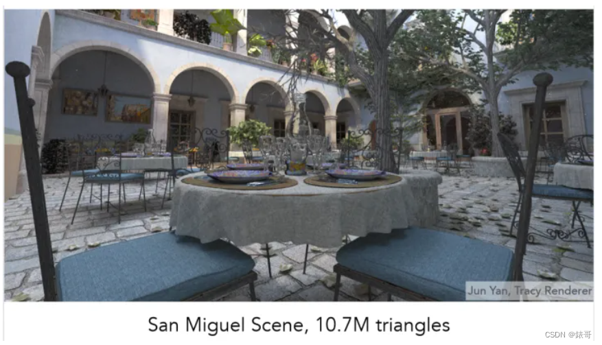

\n

在图形学中，尤其是使用光线追踪技术时，比较重要、并且也必须要处理的问题就是：如何以比较快的速度求出光线与渲染物体之间的交点,在简单的一些光追场景这自然是无需担心的。但是到了真正的应用场景，比如说一些包含大量独立物体的世界中，如下图这样一个场景，一共就有10.7M的三角形面，你可以想象一下一共需要多少次求交运算吗？

\n\n\n\n\n\n\n\n

所以这时候就需要考虑如何

\n\n\n\n

本文参考文章：[从零开始学图形学：通俗讲解简单加速结构——k-d tree, SAH, BVH - 知乎 (zhihu.com)](<https://zhuanlan.zhihu.com/p/349594815>)  
[计算机图形学十三加速结构_opengl 空间加速结构-CSDN博客](<https://blog.csdn.net/weixin_44683202/article/details/128671467>)

\n\n\n\n

根据最基础的whitted style ray_tracing从摄像机发射射线，在反射、折射的材质上反弹，在每个反弹点上计算能量，回溯时加起来做着色。需要解决的核心问题自然就是：如何判断射线与三角形相交

\n\n\n\n

如果每条射线需要枚举所有的三角形做判断，那复杂度高达**三角形个数*像素个数*平均反弹次数** 。

\n\n\n\n

所以我们需要做出加速，因为一条光线并不可能触碰到所有的三角形面片，也就是说大部分的检测都是毫无意义的，

\n\n\n\n

## 基于空间的加速结构

\n\n\n\n

这种方法把**物体所在的空间** 划分成若干组，再利用数据结构把它们串起来加速查询。原本的物体则被分配到组内。查询时，如果该组内所有物体都不可能被射线穿过，那么忽略。

\n\n\n\n

\n