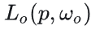
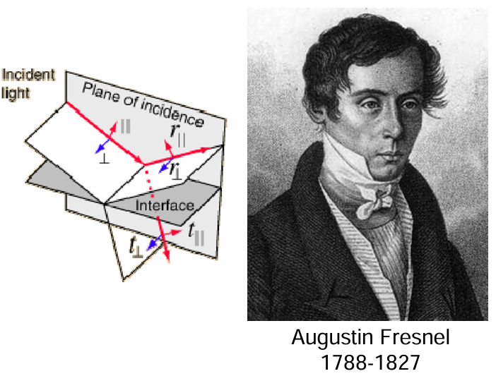
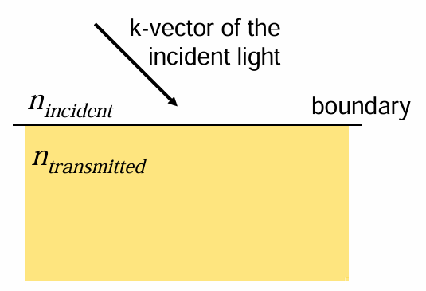
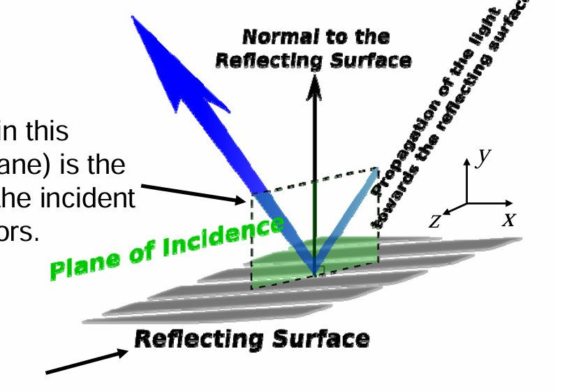
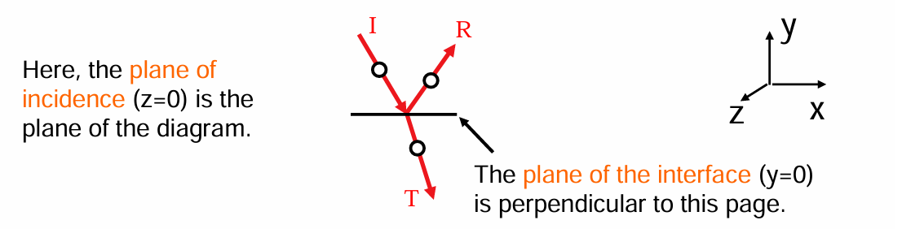
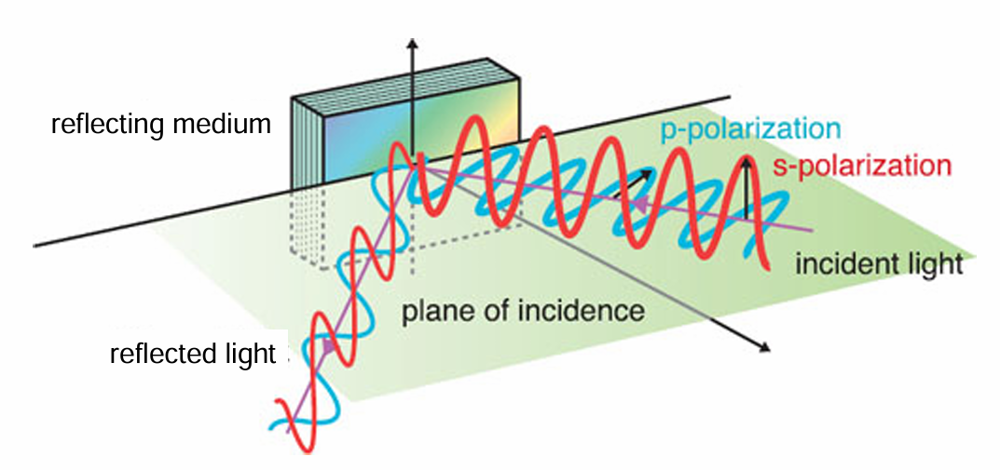
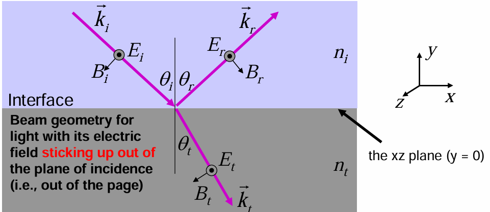
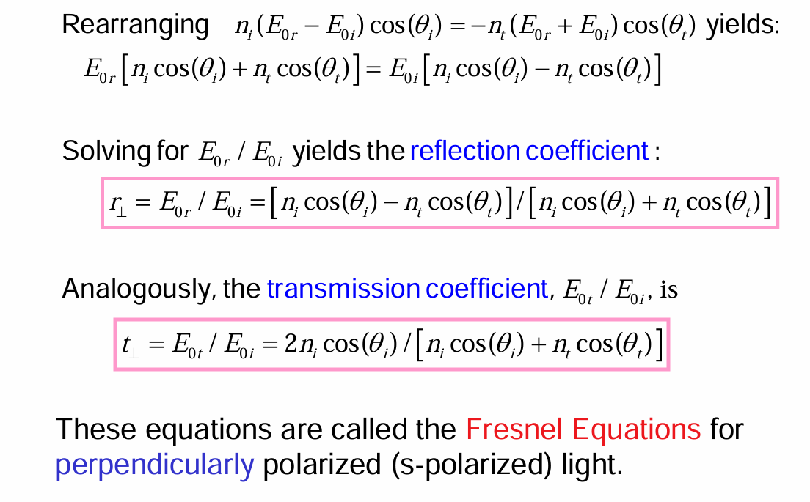
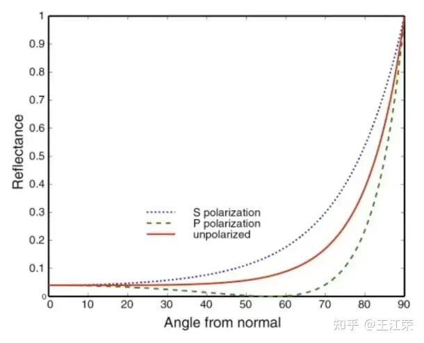
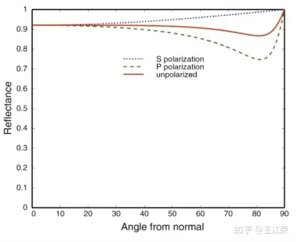

研究这个内容的契机在于应学长的指导我先去理解dieletric material相关的代码内容，即导体材料的渲染。之前我只学习过简单的渲染方程，其实至今我也没办法保证徒手写出来的渲染方程的正确性，可能还有很多的不熟练与不了解，所以这一部分的内容我也出现了很多新问题，菲涅尔方程就是其中之一。所以究竟什么是菲涅尔方程？在渲染中占据什么样的地位？我们应该怎么应用这样一个基础理论并且助力于真实性渲染？接下来的博客内容就是为了解决这样的问题

菲涅尔效应在我们的日常生活中无处不在，下面来个例子三连：

我们去公园的池塘喂鲤鱼，当爆米花丢的比较近的时候，我们可以看见水底下成群的鲤鱼在抢吃的。但是当我们把爆米花丢的很远时，却看不见水底下那些如狼似虎的鲤鱼，只能看见水面上的倒影。

近处可以看清水下，远处则能看见倒影

上面这些生活中常见的现象就是菲涅尔效应

那么我们怎么用跟科学的术语来描述这个它们呢？我们能够看见水底下或者玻璃后的东西，那肯定是光线发生了**折射** 所导致的。而对于水面上的倒影或者是玻璃变得像镜子一样这些都是因为光线发生了**反射** 所导致的。通过前面的现象，我们可以发现，当我们人眼离物体表面（玻璃，水或者桌子等）比较近时，此时我们的**视线几乎与表面垂直** ，我们可以看见更多折射过来的光（水底的鱼，玻璃外的东西）。而当们人眼离物体表面比较远时，此时我们的**视线几乎与表面平行** ，我们可以看见更多反射过来的光（倒影）

那么在我们渲染的时候，自然要把这个现象给考虑进去，才能够达到以假乱真的目的。因此我们自然需要一个公式，能够**描述** 出在不同入射光的情况下，反射光与折射光所占的**比例** ，这个公式就是菲涅尔方程

## 菲涅尔方程

当光线碰撞到一个表面的时候，**菲涅尔方程会根据观察角度告诉我们被反射的光线所占的百分比** 。利用这个反射比率和能量守恒原则，我们可以直接得出光线被折射的部分以及光线剩余的能量。将其应用在**BRDF** 当中，我们就可以更加精准的计算出渲染方程中的值

我们假设入射光与法线的夹角为 𝜃𝑖 ，折射光与法线的夹角为 𝜃𝑡 。由于折射还和介质的折射率有关，例如空气中的光射入水中，我们需要知道空气和水分别对应的折射率，我们再假设入射光所在介质的折射率为 𝑛1 ，物体的折射率为 𝑛2 。由于**光的偏振** （极化）现象，我们可以得到**S偏振光** 和 **P偏振光** 分别对应的菲涅尔方程，如下：

[latex]
$$R_s = \\\left| \\\frac{n_1\\\cos\\\theta_i -n_2\\\cos\\\theta_t}{n_1\\\cos\\\theta_i +n_2\\\cos\\\theta_t}\\\right|^2$$
$$R_p = \\\left| \\\frac{n_1\\\cos\\\theta_t -n_2\\\cos\\\theta_i}{n_1\\\cos\\\theta_t +n_2\\\cos\\\theta_i}\\\right|^2$$

这里我们先停一停，以上是我跟着知乎[菲涅尔方程（Fresnel Equation） - 知乎 (zhihu.com)](<https://zhuanlan.zhihu.com/p/375746359>)进行的思考流程，不过对于这里的偏振概念似乎还要进一步探究

我们把视野放到brown University的介绍中，

What happens when light, **propagating in a uniform medium, encounters a smooth interface**  
which is the boundary of another medium (with a different refractive index)?

指的就是光在接触另一种介质的边界时会发生什么？

我们首先做出一些定义or规约

入射面**Plane of incidence** 和接触面**Plane of the interface**

**Plane of incidence**(in this illustration, the yz plane) is the plane that contains the incident and reflected k-vectors.

**Plane of the interface**(y=0, the xz plane) is the plane that defines the interface between the two materials

### “S” and “P” polarizations

一个关键问题：电场指向哪个方向？有两种截然不同的可能性。

  1. “S” polarization is the **perpendicular polarization** , and it sticks up out of the plane of incidence

  2. “P” polarization is the **parallel polarization** , and it lies parallel to the plane of incidence.

In other words, The component of the E-field that lies in the xz plane is continuous as you move across the plane of the interface. Here, all E-fields are in the z-direction, which is in the plane of the interface.

换言之，当您在界面平面上移动时，位于 xz 平面中的 E 场分量是连续的。在这里，所有电子场都在 z 方向上，即在界面的平面上。

具体的推导过程略（可见[lecture13_0.pdf (brown.edu)](<https://www.brown.edu/research/labs/mittleman/sites/brown.edu.research.labs.mittleman/files/uploads/lecture13_0.pdf>)）

所以这个时候我们可以试着使用反射定律修改上面的菲涅尔方程

[latex]
$$R_s = \\\left| \\\frac{n_1\\\cos\\\theta_i -n_2\\\sqrt{1-\\\left(\\\frac{n_1}{n_2}\\\sin\\\theta_i\\\right)^2}}{n_1\\\cos\\\theta_i +n_2\\\cos\\\theta_t}\\\right|^2$$
$$R_p = \\\left| \\\frac{n_1\\\sqrt{1-\\\left(\\\frac{n_1}{n_2}\\\sin\\\theta_i\\\right)^2} -n_2\\\cos\\\theta_i}{n_1\\\sqrt{1-\\\left(\\\frac{n_1}{n_2}\\\sin\\\theta_i\\\right)^2} +n_2\\\cos\\\theta_i}\\\right|^2$$

如果我们不考虑偏振的情况，那么菲涅尔方程即是上面两者的平均值：

[latex]
$$R= \\\frac{R_s+R_p}{2}$$

通过理论计算以及实验证明，在通常情况下，我们在反射光垂直于折射光时，**反射光中平行于入射面的振动会完全消失，只剩下垂直于入射面的振动** 。也就是说此时反射光变成了振动方向垂直于入射面的线偏振光。

此时的入射角被称为**布儒斯特角** ，记为 𝑖𝐵

由图，根据折射定律可知

[latex]
$$\\\frac{n_1}{n_2} = \\\frac{\\\sin i_B}{\\\sin i_\\\gamma}=\\\frac{\\\sin i_B}{\\\cos i_B}=\\\tan i_B$$

利用菲涅尔方程，我们就可以根据不同的反射率画出 R 与 𝜃𝑖 的对应关系图，如下：

图中代表的是折射率为1.5的**绝缘体** （例如某种玻璃）的反射情况。可以发现当夹角为0时，即入射光垂直于表面，反射光的比例只有4%左右，而当夹角为90度时，即入射光平行于表面，反射比例将近100%，符合我们前面所说的菲涅尔效应。

我们再来看一个**导体** （比如铜镜）的关系图，如下：

可以发现即使光线垂直于导体表面，但是依旧有90%的光被反射。这也证实了为什么我们可以用铜来做镜子，却没法使用玻璃来做镜子。

比起菲涅尔方法，我们有一些更加简洁快速的近似方式，称之为：

## Schlick近似法

从上面两个关系图中，我们可以发现，反射比例和夹角的关系，基本上都是由基础反射率以某种类似的曲线增长到1

其中基础反射率的值我们很好求得，因为此时 cos⁡𝜃𝑖=1 ，带入前面的公式可得：

[latex]
$$R_0 = \\\left( \\\frac{n_1-n_2}{n_1+n_2}\\\right)^2$$

例如水的折射率为1.333，对应的 𝑅0 即为(0.333/2.333)²=0.02。接下来的问题就是怎么用一个简单的函数使得反射率能随着 𝜃𝑖 的增长以类似某种指数增长的方式从基础反射率变为1，这里**Schlick为我们提供了一种近似方程** ：

[latex]
$$R=R_0 + (1-R_0)(1-\\\cos\\\theta_i)^5$$
