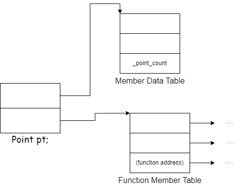
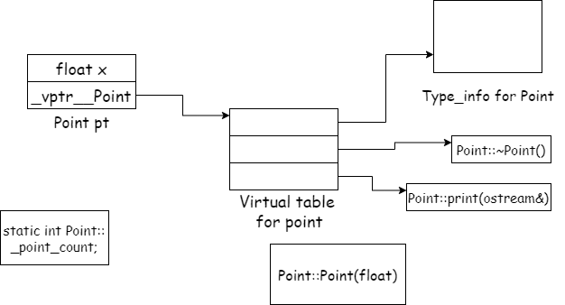
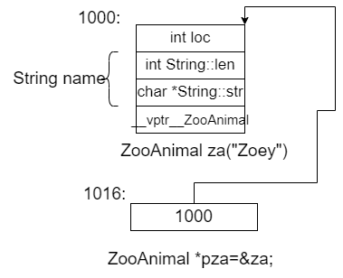

11年侯捷老师翻译的大师Lippman的经典作品，至少到现在还有一定的价值在，做一些简单的总结记录，提升一下自己的cpp理解

## 第一章：关于对象

在原始的C语言中，“数据”和“处理数据的函数”是分离的，即语言本身没有支持“数据和函数”之间的关联性。这种写法一般我们称之为程序性的（procedural）因此一般我们处理的时候就是struct声明一个结构体，然后声明一些函数或者宏来操作其中的数据。

而在c++中，对于同样的东西我们可以使用独立的ADT来实现，比如这里我们说实现Point3d的数据结构，就可以使用单层或者三层的class来实现（三层即逐级继承去写就行）

### 加上封装之后的布局成本

经常会有人提到，从原本的struct转到class之后，布局成本增加了多少，答案是并没有增加成本，三个data members直接蕴含在class objects之中，而那些Function虽然出现在class的声明中，但是并不会出现在object中，non-inline的只会产生一个函数实例，而inline的也只会在每一个使用者（模块）中产生一个自己的函数实例，所以其实在这个地方，产生额外开销的其实主要是virtual引起的

  * virtual function机制，用于支持有效率的的“执行期“绑定

  * virtual base class 用以实现“多次出现在继承体系中的base class”，有一个单一而被共享的实例

### 1.1C++对象模式

#### 简单对象模型

最简单的模型设计中国，把一个个指向成员的slot放在模型中，付出的是执行期的效率以及空间，members按照声明的顺序把指针存在一个point对象中

#### 表格驱动对象模型

为了对于一切的classes的所有objects都有一致的表达方式，另一种方式是把所有的members相关的信息全部抽出来，放在一个data member table中以及一个member function table，member data直接持有data本身

#### 实际的c++对象模型

这一模型设计继承了最简单的对象模型设计，并且对于内存和存取时间进行了对应的优化

  * C++对象模型有以下几点

    * 每个类中存放一个指针称为**vptr** ，指向**虚函数表**

    * 表中每个都指向一个虚函数

    * **非静态数据成员** 放在类对象**内**

    * **静态数据成员** 放在类对象**外**

    * **静态和非静态成员函数** 也放在类对象**外**

    * 虚函数则不同

在虚拟继承的情况下，base class不管在继承串链中被派生多少次，永远只会存在一个实例，比如在iostream中只存在一个virtual ios base class的一个实例

#### 对象模型如何影响程序

这对于我们这种程序员带来什么意义呢？不同的对象模型，会导致“现有的程序代码必须修改”以及“加入新的程序代码”两个结果，比如下面这个函数，class X 定义了一个copy constructor、一个virtual destructor和一个virtual function foo：

    
    X foobar()
{
    X xx;
    X *px = new X;

    xx.foo();
    px->foo();

    delete px;
    return x;
}

在修改之后：

    
    void foobar(X& _result)
{
    //按原来的程序需要构造两个临时变量
    //所以这里使用引用的方式来返回结果
    //调用构造函数
    _result.X::X();
    //申请内存（其实就是operator new(size_t size)）
    px = _new(sizeof(X));
    //如果申请内存成功就调用构造函数
    if( px != 0)
        px->X::X();
    //扩展xx.foo()但是不使用virtual机制
    //以_result 取代xx
    foo(&_result);
    //使用virtual机制扩展px-foo()
      (*px->vtbl[2])(px)

      //扩展delete px;
      if(px!=0){
        (*px-<vtbl[1])(px);
        _delete(px);
      }  
      //无需使用named return statement
      return;
    }

### 1.2关键词所带来的差异

如果不是努力维护与C之间的兼容性，我们的C++远可以比现在更简单些。比如，丢掉C语言的声明语法就可以免去很多在调用上的区分

同样的，假如C++不需要支持C原有的struct，那么class的观念完全可以借助关键词**class** 来支持，实际上，经常会有人问道：什么时候一个人应该在c++中使用class取代struct？

**作者的答案是：绝不！**

#### 策略正确的struct

C程序员的巧计又是在C++中却是程序员的陷阱，比如说吧单一元素的数组放在某个struct的末端，那么这样的struct就能获得可变大小的数组

如果我们改用class来声明，而该class是

  * 指定多个access sections，内含数据

  * 从另一个class派生而来

  * 定义了一个或者多个virtual functions

**C++ Standard要求，在同一个access section内，只要较晚出现的成员在类对象中有较高的地址即可。因此成员在内存中未必是连续的，中间可能会被填充一些字节（上面提到的padding）；也可能会有编译器合成的一些内部使用的成员（data member），以支持整个对象模型（比如指向虚函数表或虚拟继承中指向父类的指针）。**

C++ Standard允许编译器将多个access sections中的成员自由排列而**不必在乎它们在类中的声明顺序** 。但**目前大部分编译器都是讲一个以上的access sections连锁在一起，依照声明顺序成为一个连续区块** 。而且access sections的数量不会带来额外负担，在3个public中声明3个int和在1个public中声明3个int，得到的对象大小是一样的。

其他一些空间分配细节可以看这篇[C++对象之内存（无继承） - Irene_f - 博客园 (cnblogs.com)](<https://www.cnblogs.com/saltedreed/p/11922532.html>)

如果一个程序员需要拥有C声明的那种struct布局，可以抽出来**单独** 成为struct声明，并且和C++部分**组合** 起来

### 1.3对象的差异

C++程序设计模型支持三种程序设计模式（programming paradigms）

#### 1.程序模型

就和原始的C一样，C++支持类似的东西。比如说你写一段字符串处理的功能

#### 2.抽象数据类型模型

此模型所谓的“抽象”是和一组表达式一起提供的，那时其运算定义仍然隐而未明，比如string风格字符串的处理

#### 3.面向对象模型

在此模型中有一些彼此相关的类型，通过一个抽象的base class被封装起来，比如说Library_material class就是一个，真正的subtypes比如说Book、Video、Compact_Disc、Puppet、Laptop等等都可以从这个class派生过去

#### 指针的类型

但是，一个指向ZooAnimal的指针是如何地与一个指向整数的指针或者一个指向template Array的指针有所不同呢？

以内存需求的观点来讲其实没有什么不同！其中存在的差异，既不在其指针表示法不同，也不再其内容（表示的地址）不同，而在于其寻址出来的object的类型不同。也就是说，**指针类型会教到编译器如何解释某个特定地址中的内存内容及其大小**

比如说在这个ZooAnimal的类型实例中就可以判断出对应的实例所横跨的地址空间

## 第二章：构造函数语意学

## 第三章：Data语意学

## 第四章：Function语意学

## 第五章：构造、析构、拷贝语意学

## 第六章：执行期语意学

## 第七章：站在对象模型的尖端
