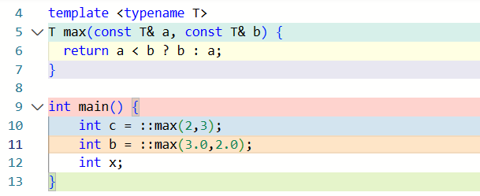
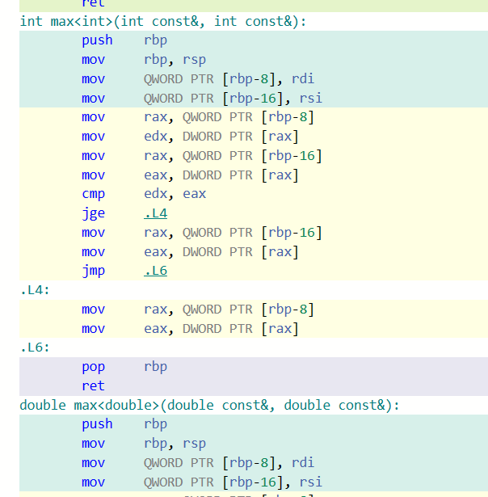
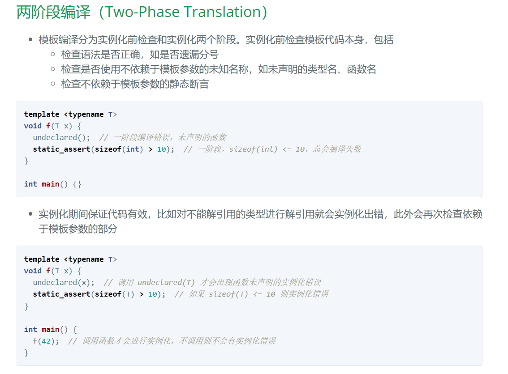

\n

这篇文章主要来源于C++ Templates一书，英文为《C++ Templates: The Complete Guide》

\n\n\n\n

## 函数模板

\n\n\n\n

### 初探函数模版

\n\n\n\n

函数模板提供了一种函数行为，该函数行为可以使用多种不同的类型进行调用

\n\n\n\n
    
    
    template <typename T>\nT max(const T& a, const T& b) {\n  return a < b ? b : a;\n}

\n\n\n\n

像这样的一个模板指定了一个“返回两个值中的最大者”的**函数家族** ，这两个值是通过函数参数a和b传递给改函数模板的，此时参数的类型还未确定，就用模板参数T来确定。

\n\n\n\n

一般的，模板参数就必须使用如下的语法来声明

\n\n\n\n
    
    
    template <comma-separated-list-of-parameters>\n//template<用逗号隔开的参数列表>

\n\n\n\n

在我们这个例子力，参数列表是typename T 。这个typename是一种关键字，到目前位置它是c++程序使用最广泛的模板参数，同样地可以用其他的没错，比如鉴于历史原因可能会有class来代替typename

\n\n\n\n

函数模板通常不用声明为 inline，唯一例外的是特定类型的全特化，因为编译器可能忽略 inline，函数模板是否内联取决于编译器的优化策略

\n\n\n\n

对于你定义的模版，并不是吧模板编译成一个可以处理任何类型的单一实体，而是对于实例化模版岑书的每种类型，都从模板中产生一个不同的实体,比如下面这个例子

\n\n\n\n\n\n\n\n\n\n\n\n

最终编译结果中有两个独立的实例存在，而对于一开始定义的模板而言并没有单独的编译过程，而且这样的实例化过程是自动的。因此我们得到一些结论：模板在被使用时被调用了两次：

\n\n\n\n

\n
  1. 实例化之前，先检查模板代码本身，查看语法是否正确，在这里会发现错误的语法，比如说什么分号遗漏，类型错误等
\n\n\n\n
  2. 在实例化期间，检查模板代码，查看是否所有的调用都有效
\n
\n\n\n\n\n\n\n\n

注意，实参的演绎是不允许自动类型转换的，你可以强制类型转换或者显式指定

\n\n\n\n

### 模板参数

\n\n\n\n

函数模板有两种类型的参数：

\n\n\n\n

\n
  1. 模板参数：位于函数模板名称的前面，在一对尖括号内部进行声明
\n\n\n\n
  2. 调用参数：位于函数模板名称之后，在一对圆括号内部进行声明
\n
\n\n\n\n
    
    
    template <typename T>

\n\n\n\n
    
    
    ...max(T const& a ,T const& b)

\n\n\n\n

同样地，函数模板也可以被重载，一般就是重载的参数数量，和普通非模板函数重载

\n\n\n\n

### 模板实参推导

\n\n\n\n
    
    
    #include <cassert>\n#include <string>\n\nnamespace jc {\n\ntemplate <typename T>\nT max(const T& a, const T& b) {\n  return a < b ? b : a;\n}\n\n}  // namespace jc\n\nint main() {\n  assert(jc::max(1, 3) == 3);          // T 推断为 int\n  assert(jc::max(1.0, 3.14) == 3.14);  // T 推断为 double\n  std::string s1 = "down";\n  std::string s2 = "demo";\n  assert(jc::max(s1, s2) == "down");  // T 推断为 std::string\n}

\n\n\n\n

调用模板时，如果不显式指定模板参数类型，则编译器会根据传入的实参推断模板参数类型

\n\n\n\n

**字符串字面值传引用会推断为字符数组**

\n\n\n\n

（传值则推断为 `const char*`，数组和函数会 decay 为指针）

\n\n\n\n

对于推断不一致的情况，可以显式指定类型而不使用推断机制，或者强制转换实参为希望的类型使得推断结果一致

\n\n\n\n
    
    
    #include <cassert>\n#include <string>\n\nnamespace jc {\n\ntemplate <typename T, typename U>\nT max(const T& a, const U& b) {\n  return a < b ? b : a;\n}\n\n}  // namespace jc\n\nint main() {\n  std::string s = "demo";\n  assert(jc::max<std::string>("down", "demo") == "down");\n  assert(jc::max(std::string{"down"}, s) == "down");\n}

\n\n\n\n

  * 也可以增加一个模板参数，这样每个实参的推断都是**独立的，** 不会出现矛盾

\n\n\n\n
    
    
    #include <cassert>\n\nnamespace jc {\n\ntemplate <typename T, typename U>\nT max(const T& a, const U& b) {\n  return a < b ? b : a;\n}\n\n}  // namespace jc\n\nint main() {\n  assert(jc::max(1, 3.14) == 3);  // T 推断为 int，返回值截断为 int\n  assert(jc::max<double>(1, 3.14) == 3.14);\n}

\n\n\n\n

**模板实参不能推断返回类型，必须显式指定** （C++14 允许 auto 作为返回类型）

\n\n\n\n
    
    
    #include <cassert>\n\nnamespace jc {\n\ntemplate <typename RT, typename T, typename U>\nRT max(const T& a, const U& b) {\n  return a < b ? b : a;\n}\n\n}  // namespace jc\n\nint main() {\n  assert(jc::max<double>(1, 3.14) == 3.14);\n  assert((jc::max<double, int, int>(1, 3.14) == 3));\n}

\n\n\n\n

### type traits

\n\n\n\n

对于类型进行计算的模板称为 type traits，也可以称为元函数，比如用 [std::common_type](<https://en.cppreference.com/w/cpp/types/common_type>) 来计算不同类型中最通用的类型（我理解的话像是找最近公共父类这样子？）

\n\n\n\n
    
    
    #include <cassert>\n#include <type_traits>\n\nnamespace jc {\n\ntemplate <typename T, typename U, typename RT = std::common_type_t<T, U>>\nRT max(const T& a, const U& b) {\n  return a < b ? b : a;\n}\n\n}  // namespace jc\n\nint main() { assert(jc::max(1, 3.14) == 3.14); }

\n\n\n\n

### 重载

\n\n\n\n

1.当类型同时匹配普通函数和模板时，优先匹配普通函数  
2.模板参数不同就会构成重载，如果对于给定的实参能同时匹配两个模板，重载解析会优先匹配更特殊的模板，如果同样特殊则产生二义性错误

\n\n\n\n
    
    
    #include <cassert>\n\nnamespace jc {\n\ntemplate <typename T, typename U>\nint f(const T&, const U&) {\n  return 1;\n}\n\ntemplate <typename RT, typename T, typename U>\nint f(const T& a, const U& b) {\n  return 2;\n}\n\n}  // namespace jc\n\nint main() {\n  assert(jc::f(1, 3.14) == 1);\n  assert(jc::f<double>(1, 3.14) == 2);\n  //   jc::f<int>(1, 3.14);  // 二义性错误\n}

\n\n\n\n

注意不能返回 C-style 字符串的引用

\n\n\n\n
    
    
    namespace jc {\n\ntemplate <typename T>\nconst T& f(const char* s) {\n  return s;\n}\n\n}  // namespace jc\n\nint main() {\n  const char* s = "downdemo";\n  jc::f<const char*>(s);  // 错误：返回临时对象的引用\n}

\n\n\n\n

这样的错误可能会在无意间引入

\n\n\n\n
    
    
    #include <cstring>\n\nnamespace jc {\n\ntemplate <typename T>\nconst T& max(const T& a, const T& b) {\n  return b < a ? a : b;\n}\n\n// 新增函数来支持 C-style 参数\nconst char* max(const char* a, const char* b) {\n  return std::strcmp(a, b) < 0 ? b : a;\n}\n\ntemplate <typename T>\nconst T& max(const T& a, const T& b, const T& c) {\n  return max(max(a, b), c);  // max("down", "de") 返回临时对象的引用\n}\n\n}  // namespace jc\n\nint main() {\n  const char* a = "down";\n  const char* b = "de";\n  const char* c = "mo";\n  jc::max<const char*>(a, b, c);  // 错误：返回临时对象的引用\n}

\n\n\n\n

只有在函数调用前声明的重载才会被匹配，即使后续有更优先的匹配，由于不可见也会被忽略

\n\n\n\n

字符串字面值传引用会推断为字符数组，为此需要为原始数组和字符串字面值提供特定处理的模板

\n\n\n\n

\n\n\n\n

## 类模板

\n\n\n\n

### 类模板Stack的实现

\n\n\n\n

与函数模板的处理方式亦一样，我们在一个头文件中声明和定义类Stack<>

\n\n\n\n
    
    
    #include <vector>\n#include <stdexcept>\n\ntemplate <typename T>\nclass Stack{\n  private:\n    std::vector<T> elems;\n    \n  public:\n    void push(T const&);\n    void pop();\n    T top() const;\n    bool empty() const {\n      return elems.empty();\n    }\n\n};\n\ntemplate <typename T>\nvoid Stack<T>::push(T const& elem){\n  Stack.push_back(elem);\n}\n\ntemplate<typename T>\nvoid Stack<T>::pop (){\n  if(elems.empty()){\n    throw std::out_of_range("Stack<>::pop(): empty stack");\n  }\n  elems.pop_back();\n}\n\ntemplate <typename T>\nT Stack<T>::top const{\n  if(elems.empty()){\n    throw std::out_of_range("Stack<>::top(): empty stack");\n  }\n  return elems.back();\n}\n

\n\n\n\n

可以看到类模板Stack<>是通过C++标准的vector来实现的，因此我们不需要自己实现内存管理、拷贝构造函数和赋值运算符。

\n\n\n\n

类模板同样可以使用实参来特化，写成

\n\n\n\n
    
    
    template<>\nclass Stack<std::string>{\n...\n}

\n\n\n\n

同样地，还有一些局部特化的办法（即为偏特化）

\n\n\n\n
    
    
    #include <cassert>\n\nnamespace jc {\n\ntemplate <typename T>\nclass A {\n public:\n  int f() { return 1; }\n};\n\ntemplate <typename T>\nclass A<T*> {\n public:\n  int f() { return 2; }\n  int g() { return 3; }\n};\n\n}  // namespace jc\n\nint main() {\n  jc::A<int> a;//使用A<T>\n  assert(a.f() == 1);\n  jc::A<int*> b;//使用A<*T>\n  assert(b.f() == 2);\n  assert(b.g() == 3);\n  jc::A<jc::A<int>*> c;\n  assert(c.f() == 2);\n  assert(c.g() == 3);\n}

\n\n\n\n
    
    
    namespace jc {\n\ntemplate <typename T, typename U>\nstruct A;  // primary template\n\ntemplate <typename T>\nstruct A<T, T> {\n  static constexpr int i = 1;\n};\n\ntemplate <typename T>\nstruct A<T, int> {\n  static constexpr int j = 2;\n};\n\ntemplate <typename T, typename U>\nstruct A<T*, U*> {\n  static constexpr int k = 3;\n};\n\n}  // namespace jc\n\nusing namespace jc;\n\nstatic_assert(A<double, double>::i == 1);\nstatic_assert(A<double, int>::j == 2);\nstatic_assert(A<int*, double*>::k == 3);\n\nint main() {\n  //   A<int, int>{};    // 错误，匹配 A<T, T> 和 A<T, int>\n  //   A<int*, int*>{};  // 错误，匹配 A<T, T> 和 A<T*, U*>\n}

\n\n\n\n

如果多个特化中，有一个匹配程度最高，则不会有二义性错误

\n\n\n\n
    
    
    namespace jc {\n\ntemplate <typename T, typename U>\nstruct A;\n\ntemplate <typename T>\nstruct A<T, T> {\n  static constexpr int i = 1;\n};\n\ntemplate <typename T>\nstruct A<T, int> {\n  static constexpr int j = 2;\n};\n\ntemplate <typename T, typename U>\nstruct A<T*, U*> {\n  static constexpr int k = 3;\n};\n\ntemplate <typename T>\nstruct A<T*, T*> {\n  static constexpr int k = 4;\n};\n\n}  // namespace jc\n\nstatic_assert(jc::A<double, double>::i == 1);\nstatic_assert(jc::A<double, int>::j == 2);\nstatic_assert(jc::A<int*, double*>::k == 3);\nstatic_assert(jc::A<double*, int*>::k == 3);\nstatic_assert(jc::A<int*, int*>::k == 4);\nstatic_assert(jc::A<double*, double*>::k == 4);\n\nint main() {}

\n\n\n\n

偏特化常用于元编程,偏特化遍历 [std::tuple](<https://en.cppreference.com/w/cpp/utility/tuple>)

\n\n\n\n

### 缺省模板实参（模板的模板参数）

\n\n\n\n

对于类模板，你可以为模板参数定义缺省值，这些值就被成为缺省模板实参，例如，在先前的类Stack<>中，你可以吧用于管理元素的容器定义为第2个模板参数，并且使用vector作为缺省值

\n\n\n\n
    
    
    namespace _space2\n{\n\t//指定缺省模板实参，并且，指定的模板实参还可以是之前的模板类型参数\n\ttemplate<typename T,typename U = std::vector<T> >\n\tclass stack\n\t{\n\tprivate:\n\t\tU elems;\n\tpublic:\n\t\tstack()\n\t\t{\n\t\t\tcout << "_space2::stack" << endl;\n\t\t}\n\tpublic:\n\t\tvoid pop(); //切记不能加const\n\t\tT top() const;\n\t\tbool empty() const;\n\t\tvoid push(T const&);//切记不能加const\n\t};\n\n\ttemplate<typename T,typename U>\n\tbool stack<T,U>::empty() const\n\t{\n\t\treturn elems.empty();\n\t}\n\n\ttemplate<typename T, typename U>\n\tvoid stack<T, U>::push(T const& i) \n\t{\n\t\telems.push_back(i);\n\t}\n\n\ttemplate<typename T, typename U>\n\tT stack<T, U>::top() const\n\t{\n\t\tif (stack<T, U>::empty())\n\t\t{\n\t\t\tcout << "------" << endl;\n\t\t\treturn 0;\n\t\t}\n\t\treturn elems.back();\n\t}\n\n\t//template<typename T, typename U = std::vector<T>>\n\ttemplate<typename T,typename U>\n\tvoid stack<T, U>::pop() \n\t{\n\t\tif (stack<T, U>::empty())\n\t\t{\n\t\t\tcout << "##########" << endl;\n\t\t\treturn;\n\t\t}\n\t\telems.pop_back();\n\t}\n\n\t/*\n\t1:类模板含有两个模板参数，因此，每个成员函数的定义都必须具有这两个参数。\n\t2:类模板参数缺省值还可以是之前的形参。\n\t\n\t*/\n}\n

\n\n\n\n

## 非类型模板参数

\n\n\n\n

非类型模板参数表示在编译期或链接期可以确定的常量值

\n\n\n\n

在模板的设计中，也可以使用元素固定的数组来实现stack，有点在于无论是你亲自管理还是标准容器来管理内存，都可以避免这些内存管理开销，加入一个MAX_SIZE的参数来指定最多可包含的数量

\n\n\n\n
    
    
    template <typename T ,int MAX_SIZE>

\n\n\n\n

就像这个样子的指定

\n\n\n\n

\n