\n

## 1.蒙特卡罗方法

\n\n\n\n

[蒙特卡洛方法](<https://so.csdn.net/so/search?q=%E8%92%99%E7%89%B9%E5%8D%A1%E6%B4%9B%E6%96%B9%E6%B3%95&spm=1001.2101.3001.7020>)的理论支撑其实是概率论或统计学中的大数定律。基本原理简单描述是先大量模拟，然后计算一个事件发生的次数

\n\n\n\n

例一：计算圆周率pi（π）值  
实验原理

\n\n\n\n

在正方形内部有一个相切的圆，圆面积/正方形面积之比是(PixRxR)/(2Rx2R)= Pi/4。在这个正方形内随机产生n个点，假设点落在圆内的概率为P，那么P=圆面积/正方形面积，则P= Pi/4。如何计算点落在圆内的概率P？可以计算点与中心点的距离，判断是否落在圆的内部，若这些点均匀分布，用M表示落到圆内投点数 ， N表示总的投点数，则圆周率Pi=4P=4xM/N。

\n\n\n\n

实验步骤

\n\n\n\n

（1）将圆心设在原点（0，0），以R为半径形成圆，则圆面积为PixRxR  
（2）将该圆外接正方形, 坐标为（-R，-R）（R，-R）（R， R）（-R，R），则该正方形面积为R*R  
（3）随即取点（X，Y），使得-R <=X<=R并且-R <=Y<=R，即点在正方形内  
（4）通过公式 XxX+YxY<= RxR判断点是否在圆周内（直角三角形边长公式）。  
（5）设所有点（也就是实验次数）的个数为N，落在圆内的点（满足步骤4的点）的个数为M，则P=M/N，于是Pi=4xM/N。  
（6）运行结果为3.143052

\n\n\n\n
    
    
    def cal_pai_mc(n=1000000):\n r = 1.0\n a, b = (0.0, 0.0)\n x_neg, x_pos = a - r, a + r\n y_neg, y_pos = b - r, b + r\n m = 0\n for i in range(0, n+1):\n x = random.uniform(x_neg, x_pos)\n y = random.uniform(y_neg, y_pos)\n if x**2 + y**2 <= 1.0:\n m += 1\n return (m / float(n)) * 4\n

\n\n\n\n

从我的理解来看，在CG中，蒙特卡罗方法常常用于随机选取光线与采样点，便于以尽可能低的时间复杂度得到一个区域的大致（光照）情况，所以在建模领域，蒙特卡洛应该多用于一些"图形化"或者离散的数据处理，比如说有一些已有的函数中获得一些特定散点，估计一些区域分布图，蒙特卡罗是合适的办法

\n\n\n\n

回到线性规划，当题目中体积“怎样安排”，“尽量多、少”“利润最大”等等求最优值之类的东西

\n\n\n\n

\n\n\n\n

## 2.非线性规划以及其他规划方式

\n\n\n\n

### 2.1非线性规划

\n\n\n\n

非线性规划即规划的函数非线性的意思

\n\n\n\n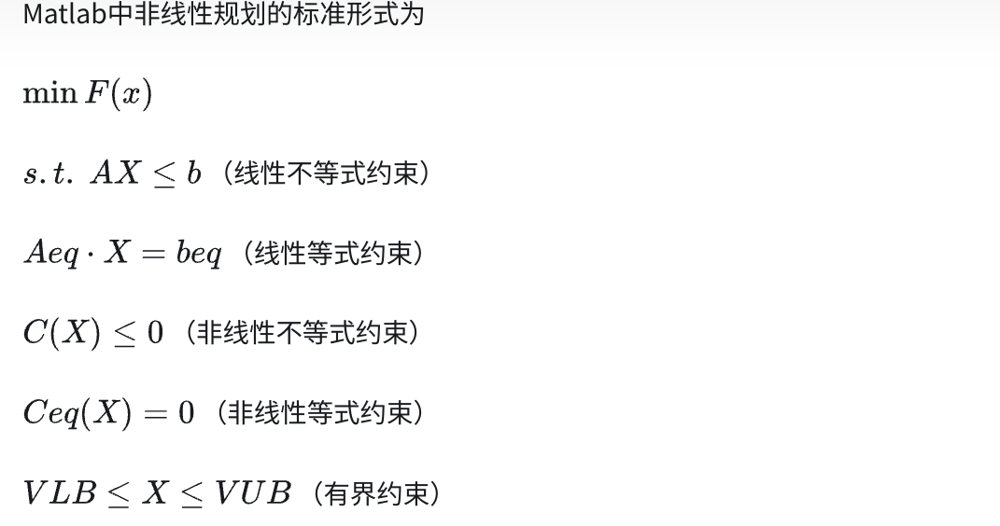\n\n\n\n

调用格式：

\n\n\n\n

[x, fval, exitflag, output, lambda, grad,  
hessian]=fmincon(‘fun’, X0, A, b, Aeq, beq, VLB, VUB, ‘nonlcon’, options)

\n\n\n\n

其中，大部分参数同线性规划；

\n\n\n\n

‘fun’为用M-文件定义的目标函数F(x)；

\n\n\n\n

‘nonlcon’为用M-文件定义的非线性向量函数[ C(x), Ceq(x) ]

\n\n\n\n

举个建模的例子：

\n\n\n\n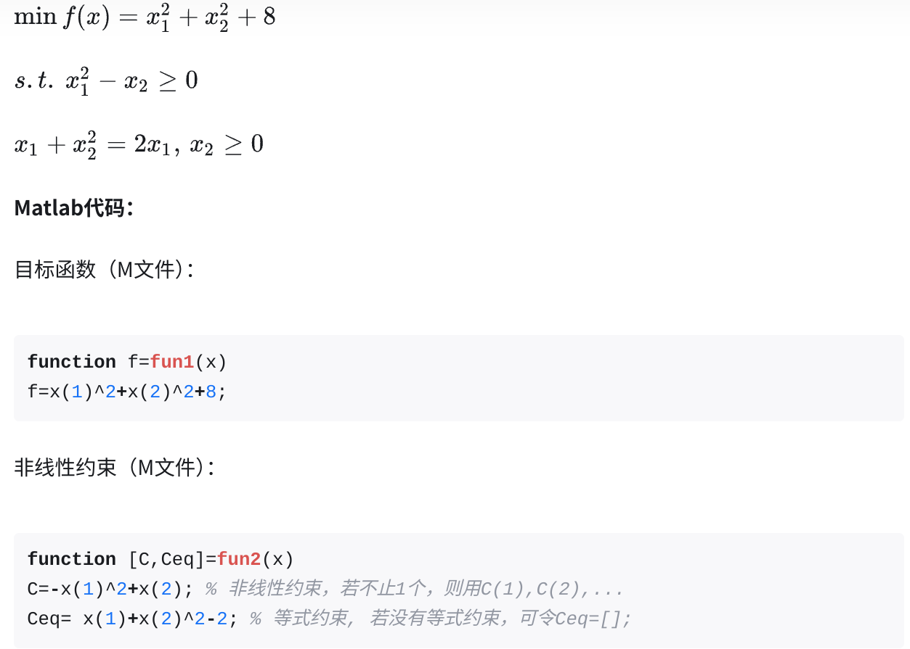\n\n\n\n

### 主程序：

\n\n\n\n
    
    
    x0 = rand(2,1);\n\nVLB = zeros(2,1);\n\n[x,fval,exitflag,output,lambda,grad,hessian] =  fmincon('fun1',x0,[],[],[],[],VLB,[],'fun2')\n

\n\n\n\n

**运行结果（部分）** ：

\n\n\n\n

exitflag = 1 优化成功

\n\n\n\n

x = 1.0000 最优解

\n\n\n\n

1.0000

\n\n\n\n

fval = 10.0000  
目标值

\n\n\n\n

grad = 2.0000

\n\n\n\n

2.0000

\n\n\n\n

hessian = 1.4338 0.4960

\n\n\n\n

0.4960  
0.5902

\n\n\n\n

**Lingo代码** ：

\n\n\n\n
    
    
    model:\n\nmin=x1^2+x2^2+8;\n\nx1^2-x2>0;\n\nx1+x2^2=2;\n\nend\n

\n\n\n\n

**运行结果** ：Global optimal solution found.

\n\n\n\n

Objective value: 10.00000

\n\n\n\n

  
Variable Value

\n\n\n\n

X1 1.000000

\n\n\n\n

X2 1.000000

\n\n\n\n

### 2.2整数规划

\n\n\n\n

\n\n\n\n

## 3.聚类分析

\n\n\n\n

[聚类分析（超全超详细版）-CSDN博客](<https://blog.csdn.net/weixin_43584807/article/details/105539675>)

\n\n\n\n

[1032队-C题](<../../assets/images/2024/05/1032队-C题.pdf>)[下载](<../../assets/images/2024/05/1032队-C题.pdf>)

\n\n\n\n

### 文章解读

\n\n\n\n

### 全文概述（by kimi AI）

\n\n\n\n

这篇文章的主题是关于网络行为评估模型在反恐领域的应用。主要内容涉及以下几个方面：

\n\n\n\n

\n
  1. **问题描述** ：文章提出了三个任务，包括构建数学模型来获取风险指数评估监控对象的情况，开发统计技术对大量监控数据进行有效、快速和自动化的分类，以及如果美国总统奥巴马就反恐问题征求意见，作者会给出什么建议。
\n\n\n\n
  2. **问题分析** ：文章分析了风险评估、恐怖主义的特点、行为心理学、风险指数和推动-拉动因素等。
\n\n\n\n
  3. **模型构建** ：文章建立了风险评估模型和K-均值聚类分析模型。风险评估模型通过用户的网络活动（如邮件、浏览网站、游戏、YouTube视频、在线交易和GPS定位）来分类用户，并为每种活动确定相应的风险指数，然后通过蒙特卡洛模拟数据，计算不同用户的风险指数。K-均值聚类分析模型使用改进的K-均值算法对用户的风险指数进行分类。
\n\n\n\n
  4. **模型应用** ：文章讨论了如何将模型应用于实际的反恐工作中，包括建立有效的互联网检测和监督系统，人性化的心理引导系统，以及改进反恐机构。
\n\n\n\n
  5. **未来工作** ：文章提出了模型的局限性和改进方向，包括模型评估、敏感性分析和模型改进。
\n
\n\n\n\n

他们所使用的建模方式主要包括：

\n\n\n\n

\n
  * **风险评估模型** ：该模型基于用户的网络活动，从用户/地址/类型、时间、数量和频率四个方面分析风险指数。模型使用蒙特卡洛理论来确定风险指数的价值，并为不同的网络活动分配权重，以获得用户的最终风险指数。
\n\n\n\n
  * **K-均值聚类分析模型** ：这是一个基于风险指数的分类方法，使用改进的K-均值算法，允许数据点以不同的概率属于多个类别（模糊聚类）。模型使用欧几里得距离作为相似性度量，并采用迭代过程来最小化目标函数，从而确定聚类中心和成员函数。
\n
\n\n\n\n

文章中还提到了使用C++编写程序来实现这些模型，并使用了二进制枚举子集算法来降低程序复杂性。此外，文章讨论了模型的优势和局限性，优势包括模型的详细性、客观性和清晰性，以及使用蒙特卡洛方法进行风险指标模拟的合理性。局限性包括模型权重的主观性和对原始中心值的依赖性。

\n\n\n\n

总的来说，这篇文章提出了一个结合互联网行为分析和风险评估的综合性模型，旨在为反恐提供科学依据和技术支持。

\n\n\n\n

所以我们可以看一下这篇文章构建均值聚类分析和蒙特卡洛风险评估模型的流程

\n\n\n\n

### 模型分解：

\n\n\n\n

#### 蒙特卡洛风险评估模型

\n\n\n\n

其中首先运用二进制枚举子集算法BinaryEnumeration Subset ，生成了足量的数据模式，具体解释如下

\n\n\n

Binary Enumeration Subset Algorithm（二进制枚举子集算法）是一种组合算法，它用于生成一个集合的所有可能子集的枚举。在很多问题中，我们需要考虑一个集合的所有子集，例如在组合优化问题、某些类型的搜索算法或者在计算资源有限的情况下评估所有可能的候选解时。

\n

### 算法原理：

\n

给定一个集合`S`，它包含`n`个元素，我们可以将这个集合的每个元素对应到一个二进制数的位，其中元素与位的对应关系是固定的。集合`S`的一个子集可以由一个二进制数表示，如果子集中包含`S`的第`i`个元素，则二进制数的第`i`位为1，否则为0。

\n

### 算法步骤：

\n

\n
  1. \n

初始化：创建一个长度为`n`的二进制数序列，其中`n`是集合`S`中元素的数量。

\n
\n
  2. \n

枚举子集：从二进制数`000...0`（不包括，因为它代表空集）开始，使用二进制枚举的方法生成下一个子集。这可以通过逐位检查并翻转最右边的1来实现，直到遇到0，然后继续这个过程，直到生成所有可能的子集。

\n
\n
  3. \n

生成子集：对于每个生成的二进制数，将其转换为集合的子集。例如，如果集合`S = {a, b, c}`，则二进制数`101`表示子集`{a, c}`。

\n
\n
  4. \n

应用子集：将每个生成的子集应用到具体的问题中，例如计算风险指数、评估解的质量等。

\n
\n
\n

### 文章中的应用：

\n

在文章中，Binary Enumeration Subset Algorithm 被用来生成所有可能的网络活动组合，以便于模拟用户的网络行为。具体步骤如下：

\n

\n
  1. \n

定义活动：定义了六种网络活动，分别用`Email`, `Web`, `Game`, `YouTube`, `Bank`, `Gps`表示。

\n
\n
  2. \n

生成组合：使用二进制枚举子集算法生成所有可能的活动组合，确保每种组合至少包含三种活动，最多包含六种活动。

\n
\n
  3. \n

模拟数据：对于每种组合，随机生成相应的网络行为数据，并计算风险指数。

\n
\n
  4. \n

输出结果：将每个用户的风险指数输出到文件中，用于后续的分析和聚类。

\n
\n
\n

通过这种方法，文章中的模型能够处理大量的模拟数据，并为每个用户计算出一个综合的风险指数，这个指数反映了用户的网络行为模式。然后，利用这个风险指数进行K-均值聚类分析，以识别可能的恐怖主义行为风险。

\n\n\n

### 聚类分析详解

\n\n\n\n

聚类分析的实质是根据多种因素，根据在数据中发现的描述对象及其关系的信息，将数据对象分组。目的是，组内的对象相互之间是相似的（相关的），而不同组中的对象是不同的（不相关的）。组内相似性越大，组间差距越大，说明聚类效果越好。

\n\n\n\n

我们很多时候逛电商网站都会收到一些推销活动的通知，但是我们之前也没关注过那个商品，这些电商网站是为什么决定给我们推销这个商品的呢？这是因为电商网站，可以根据用户的年龄、性别、地址以及历史数据等等信息，将其分为，比如“年轻白领”、“一家三口”、“家有一老”、”初得子女“等等类型，然后你属于其中的某一类，电商网站根据这类用户的特征向其发起不同的优惠活动。那在利用用户的这些数据将用户分为不同的类别时，就会用到聚类分析。

\n\n\n\n

每个聚类中的都具有“一组”相似的特征，摆脱了单个特征分类的交错与不足，聚类效果的好坏依赖于两个因素：**1.衡量距离的方法（distance measurement）**  2.**聚类算法（algorithm）**

\n\n\n\n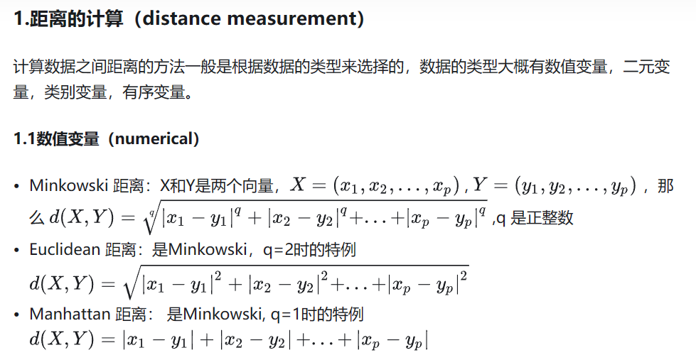\n\n\n\n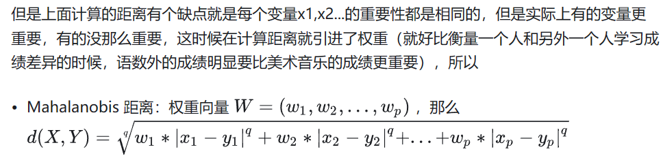\n\n\n\n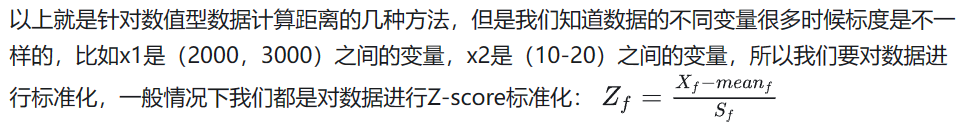\n\n\n\n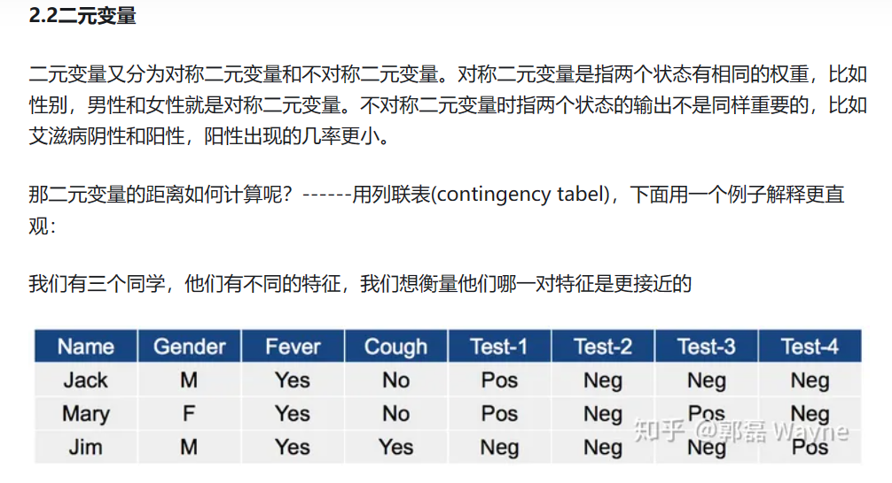\n\n\n\n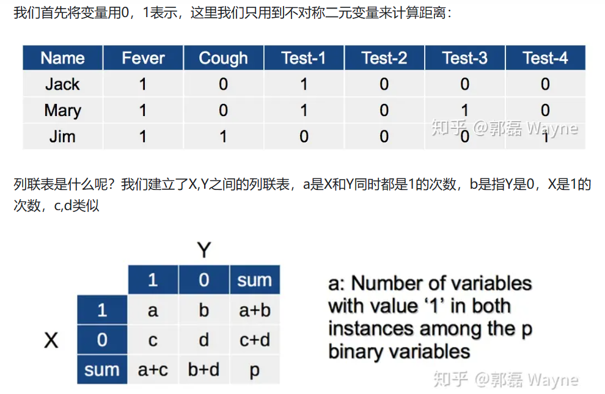\n\n\n\n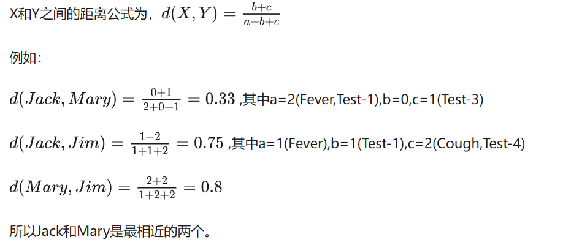\n\n\n\n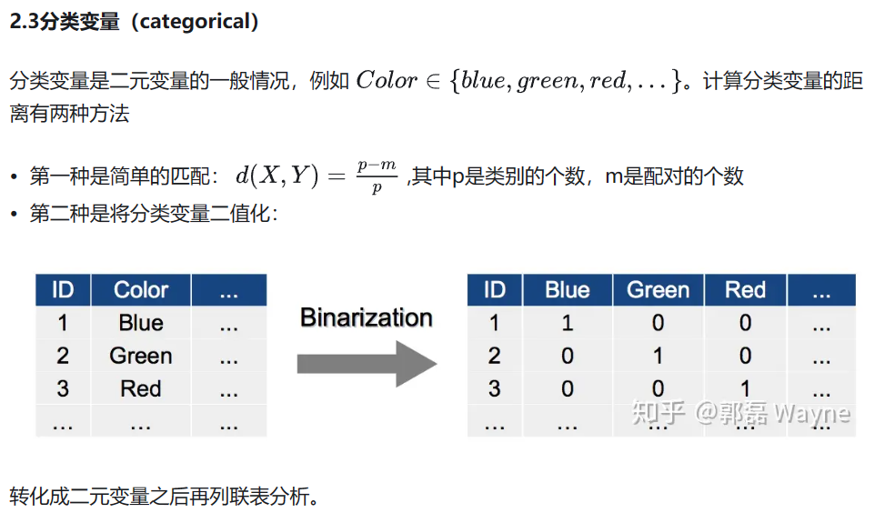\n\n\n\n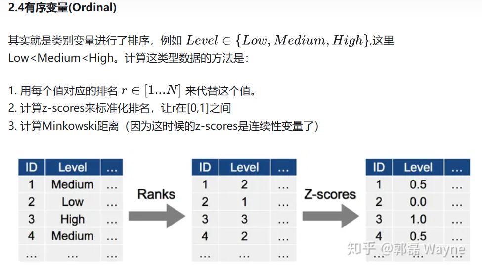\n\n\n\n

**2.1K-均值聚类(k-means)**

\n\n\n\n

2.1.1算法

\n\n\n\n

> \n
> 
> 1\. 选择 K 个初始质心，初始质心**随机选择** 即可，每一个质心为一个类（除了第一次的知心，剩下的质心都是求出来的）  
> 2\. 把每个观测指派到离它最近的质心，与质心形成新的类  
> 3\. 重新计算每个类的质心，**所谓质心就是一个类中的所有观测的平均向量** （这里称为向量，是因为每一个观测都包含很多变量，所以我们把一个观测视为一个多维向量，维数由变量数决定）。  
> 4\. 重复2. 和 3.  
> 5\. 直到质心不在发生变化时或者到达**最大迭代次数** 时
> 
> \n

\n\n\n\n\n\n\n\n\n\n\n\n\n\n\n\n\n\n\n\n\n\n\n\n\n\n\n\n

**2.2层次聚类(Hierarchical)**

\n\n\n\n

其核心思想是，把每一个单个的观测都视为一个类，而后计算各类之间的距离，选取最相近的两个类，将它们合并为一个类。新的这些类再继续计算距离，合并到最近的两个类。如此往复，最后就只有一个类。然后用**树状图** 记录这个过程，这个树状图就包含了我们所需要的信息。

\n\n\n\n

2.2.1算法

\n\n\n\n

> \n
> 
> 1\. 计算类与类之间的距离，用邻近度矩阵记录  
> 2\. 将最近的两个类合并为一个新的类  
> 3\. 根据新的类，更新邻近度矩阵  
> 4\. 重复2. 3.  
> 5\. 到只只剩下一个类的时候，停止
> 
> \n

\n\n\n\n

2.2.2例子

\n\n\n\n

有一组数据D={a,b,c,d,e} 给了它们之间的距离矩阵。

\n\n\n\n

首先，每一个例子都是一个类：

\n\n\n\n\n\n\n\n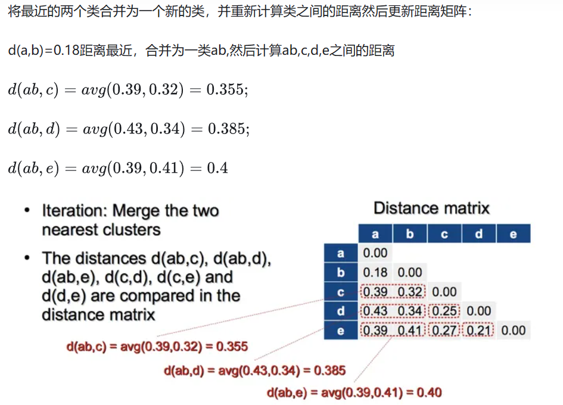\n\n\n\n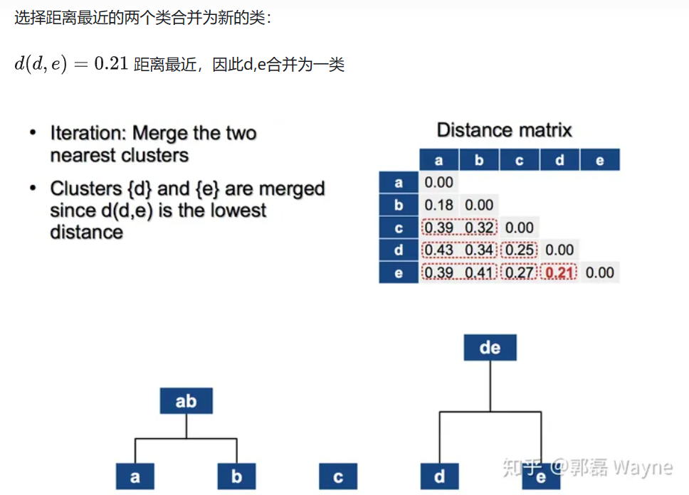\n\n\n\n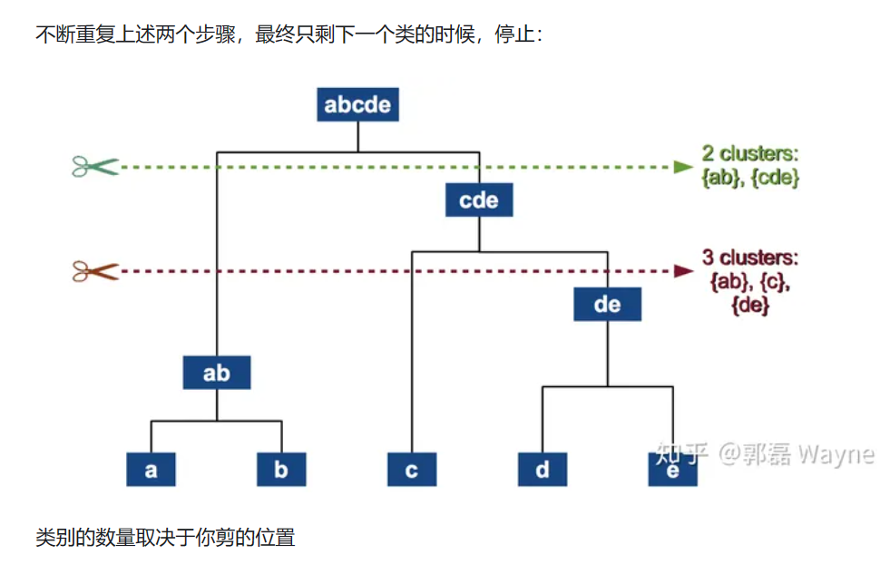\n\n\n\n

**2.3根据密度的聚类**

\n\n\n\n

其核心思想是在数据空间中找到分散开的密集区域，简单来说就是**画圈** ，其中要定义两个参数，一个是圈的最大半径，**一个是一个圈里面最少应该容纳多少个点** 。

\n\n\n\n

2.3.1算法

\n\n\n\n

> \n
> 
> 1从数据集中随机选择核心点  
> 2.以一个核心点为圆心,做半径为V的圆,选择圆内圈入点的个数满足密度阈值的核心点,因此称这些点为核心对象,且将圈内的点形成一个簇,其中核心点直接密度可达周围的其他实心原点;  
> 3.合并这些相互重合的簇
> 
> \n

\n\n\n\n

剩下的用的少一些的聚类算法：[一篇文章透彻解读聚类分析（附数据和R代码） - 知乎 (zhihu.com)](<https://zhuanlan.zhihu.com/p/37856153>)

\n\n\n\n

### 箱线图补充

\n\n\n\n

[箱线图](<https://so.csdn.net/so/search?q=%E7%AE%B1%E7%BA%BF%E5%9B%BE&spm=1001.2101.3001.7020>)（Boxplot）也称**箱须图** （Box-whisker [Plot](<https://so.csdn.net/so/search?q=Plot&spm=1001.2101.3001.7020>)），是利用数据中的五个统计量：最小值、第一四分位数、中位数、第三四分位数与最大值来描述数据的一种方法，它也可以粗略地看出数据是否具有有对称性，分布的分散程度等信息，特别可以用于对几个样本的比较。**箱形图最大的优点就是不受异常值的影响，能够准确稳定地描绘出数据的离散分布情况，同时也利于数据的清洗。**

\n\n\n\n

\n\n\n\n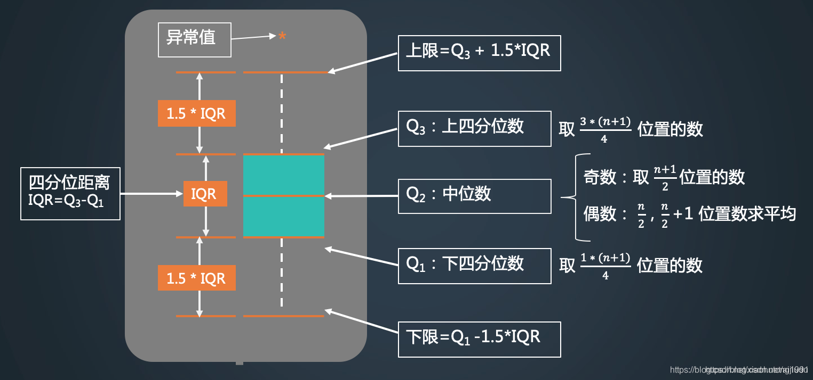\n\n\n\n

绘制方式：

\n\n\n\n
    
    
    # 绘制箱线图\nfig_ratings = go.Figure()\nfig_ratings.add_trace(go.Box(y=restaurants_df['weighted_rating_value'], name='Weighted Rating'))\nfig_ratings.add_trace(go.Box(y=restaurants_df['aggregated_rating_count'], name='Aggregated Rating Count'))\nfig_ratings.update_layout(title='Statistical Summary of Restaurant Ratings', \n                          yaxis_title='Value', xaxis_title='Rating Type')\nfig_ratings.show()

\n\n\n\n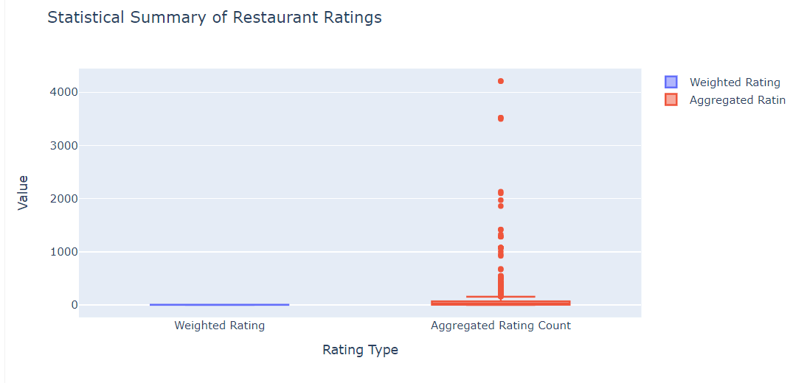\n\n\n\n

学会了聚类分析方法咱接着看论文

\n\n\n\n

论文里面通过BES得到了网络浏览的数据，我们将针对这些数据进行聚类分析  
论文采取的是一种优化的Kmeans聚类算法，称为FCM

\n\n\n\n

FCM（Fuzzy C-Means，模糊C均值）算法是一种用于数据聚类的模糊逻辑方法。它是一种改进的K-均值聚类算法，允许一个数据点以不同的概率属于多个类别。FCM算法在许多领域都有应用，包括图像分割、模式识别、数据分析等。

\n\n\n\n

### FCM算法的原理和步骤：

\n\n\n\n

\n
  1. **初始化** ：选择聚类的数量C，并随机选择C个对象作为初始聚类中心。
\n\n\n\n
  2. **计算隶属度** ：对于每个数据点，计算它属于每个聚类中心的隶属度。隶属度是通过数据点到聚类中心的距离来计算的，通常使用欧几里得距离。
\n\n\n\n
  3. **更新聚类中心** ：根据数据点的隶属度，重新计算每个聚类的中心。
\n\n\n\n
  4. **迭代** ：重复步骤2和3，直到满足停止条件，如聚类中心的变化小于某个阈值，或者达到预设的迭代次数。
\n\n\n\n
  5. **得到聚类结果** ：最终的聚类中心和数据点的隶属度表示了数据的聚类结果。
\n
\n\n\n\n

### FCM算法的数学表达：

\n\n\n\n

FCM的目标是最小化以下目标函数：

\n\n\n\n[latex]\n$$J(U,C) = \\\sum^n_{i=1}\\\sum^e_{j=1}u^m_{ij}d^2_{ij}$$\n\n\n\n

其中：

\n\n\n\n

\n
  * 𝑛 是数据点的数量。
\n\n\n\n
  * 𝑐是聚类的数量。
\n\n\n\n
  * 𝑈是隶属度矩阵，其元素 𝑢𝑖𝑗表示第 𝑖个数据点属于第 𝑗 个聚类的隶属度。
\n\n\n\n
  * 𝑚 是一个常数（通常大于1），用于控制模糊化的程度。
\n\n\n\n
  * 𝑑𝑖𝑗​ 是第 𝑖 个数据点和第 𝑗 个聚类中心之间的欧几里得距离。
\n\n\n\n
  * 𝐶 是聚类中心的集合。
\n
\n\n\n\n

### 更新规则：

\n\n\n\n

\n
  1. **隶属度更新** ：使用以下公式计算隶属度：
\n
\n\n\n\n[latex]\n$$\nu_{ij} = \\\frac{\\\left(\\\frac{d_{ij}}{d_{kj}}\\\right)^{-2/m}} {\\\sum_{k=1}^{c} \\\left(\\\frac{d_{ij}}{d_{kj}}\\\right)^{-2/m}}\n$$\n\n\n\n\n
  2. **聚类中心更新** ：使用以下公式计算新的聚类中心 𝑐𝑗 _cj_ ​ ：
\n
\n\n\n\n[latex]\n$$ c_j = \\\frac{\\\sum_{i=1}^{n} u_{ij}^m x_i}{\\\sum_{i=1}^{n} u_{ij}^{m-1}} $$\n\n\n\n

其中 𝑥𝑖​ 是原始数据空间中的第 𝑖 个数据点。

\n\n\n\n

### FCM算法的特点：

\n\n\n\n

\n
  * **模糊聚类** ：允许数据点**以不同的概率属于多个聚类** 。
\n\n\n\n
  * **灵活性** ：通过隶属度矩阵提供了数据点聚类隶属关系的详细视图。
\n\n\n\n
  * **局部最优** ：FCM算法可能会收敛到局部最优解，而不是全局最优解。
\n\n\n\n
  * **参数选择** ：算法的性能依赖于初始聚类中心的选择和参数 𝑚 _m_  的值。
\n
\n\n\n\n

在文章中，FCM算法被用于分析用户的**风险指数** ，通过模糊聚类的方式将用户分为不同的风险等级，这有助于更细致地区分用户的潜在风险，并为反恐措施提供数据支持。

\n\n\n\n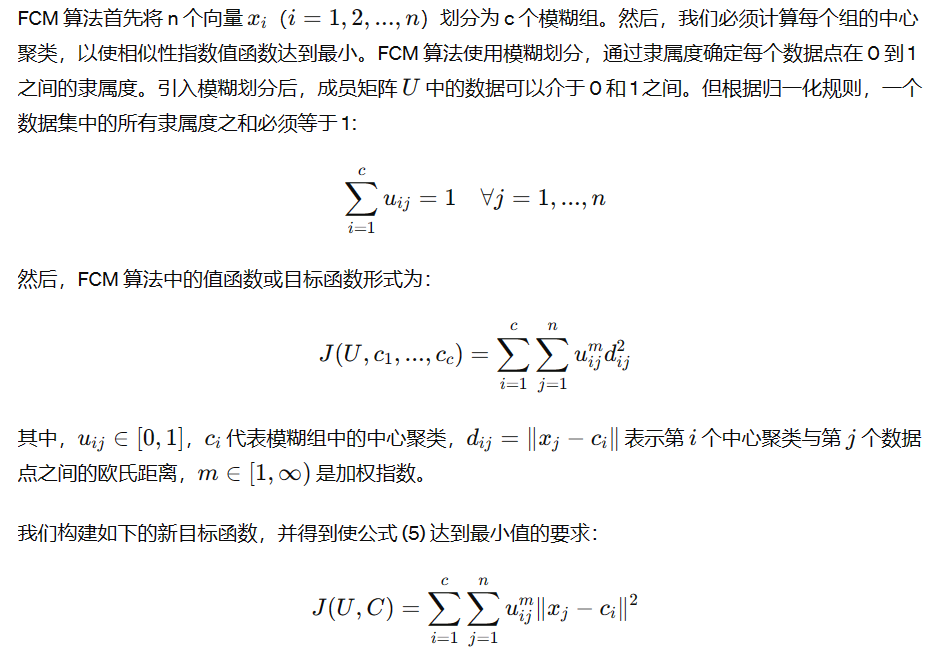\n\n\n\n

[Fuzzy C-Means Clustering on Iris Dataset (kaggle.com)](<https://www.kaggle.com/code/prateekk94/fuzzy-c-means-clustering-on-iris-dataset/notebook>)

\n\n\n\n

这边是Kaggle上面基于Fuzzy C-Means Clustering的一篇实战，这一篇的分析更加深入本质，以此为结

\n\n\n\n

## 4.启发式算法

\n\n\n\n

**遗传算法(GA)：** 用于解决各种规划问题优化算法，模拟物竞天择的生物进化过程，通过维护一个潜在解的群体执行了多方向的搜索，并支持这些方向上的信息构成和交换。

\n\n\n\n

\n\n\n\n

**粒子群算法(PSO)：** 用于解决各种规划问题优化算法，将每个解看作搜索空间中的一个粒子。每个粒子都有一定的速度，其大小根据自身历史经验和种群经验进行动态调整，通过不断地迭代飞行来寻找空间中最优解的位置。

\n\n\n\n

**模拟退火算法(SA)：** 用于解决各种规划问题优化算法，其出发点是基于物理中固体物质的退火过程与一般组合优化问题之间的相似性。从某一较高初温出发，伴随温度参数的不断下降,结合概率突跳特性在解空间中随机寻找目标函数的全局最优解。

\n\n\n\n

**蒙特卡洛算法：** 用于解决各种规划问题优化算法，是一种使用随机数来解决规划问题的方法，其精确度很大程度取决于实验次数。

\n\n\n\n

## 5.Gradient Boosting

\n\n\n\n

\nhttps://www.freezetheflame.cc/2024/05/16/%e5%86%b3%e7%ad%96%e6%a0%91%ef%bc%88decision-tree%ef%bc%89\n

\n