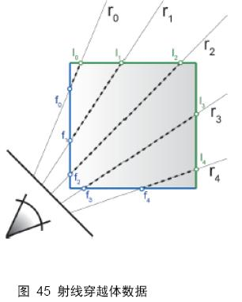
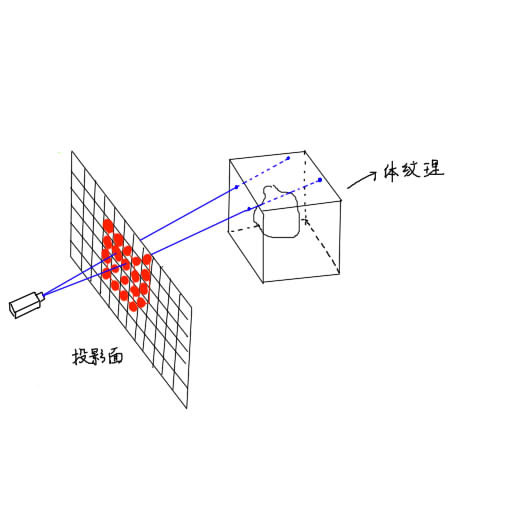
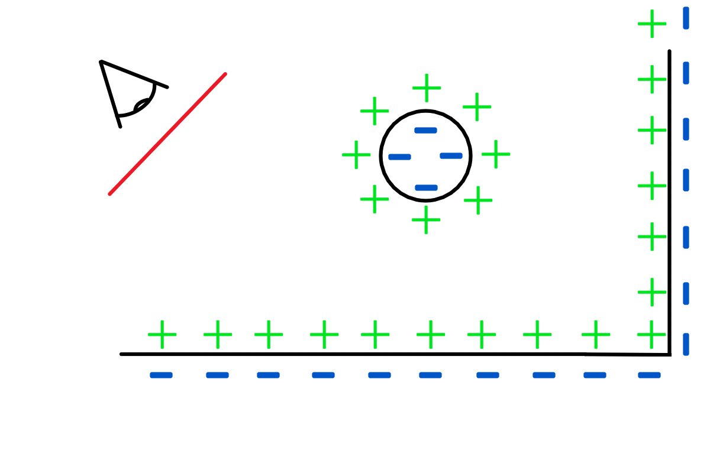

\n

//TODO: ray marching in volumetric lighting and shadows

\n\n\n\n

## 纹理采样的ray marching

\n\n\n\n

光线行军，算法思想很直观：首先有一个3D的体纹理，然后从相机发射n条射线，射线有一个采样的步长。当射线处在体纹理中时，每个步长采一次样，获取纹理值（实际上表示该点的密度值），计算光照，然后和该条射线当前累积的颜色值进行混合。

\n\n\n\n

为什么这样就可以渲染出正确的图案呢？因为光路是可逆的，从光源射出的光线经过散射，最终进入摄像机的效果等同于从摄像机发出的射线进行着色和采样，这个raytracing的道理是一样的。

\n\n\n\n\n\n\n\n

这种算法很适合在GPU上实现，因为每条射线的计算都是独立并行的，GPU在大量并行计算上有先天的优势。为了在GPU上实现，我们需要解决的问题主要有2个：

\n\n\n\n

\n
  1. 哪些片段需要raymarching。
\n\n\n\n
  2. raymarching的方向和终点在哪里。
\n
\n\n\n\n

### 确定Ray Marching的片段

\n\n\n\n

体绘制首先需要一个**载体(proxy geometry)** ，也就是为了确定屏幕上的哪些像素是属于某个体纹理的。这个问题很容易就让人联想到包围盒，问题也就引刃而解。

\n\n\n\n\n\n\n\n

## 渲染层面的ray marching

\n\n\n\n

Ray Marching相当近似于光追，只不过在操作处理上有一点不同：把表面作为“距离场”处理，光追则不同：“Ray tracing is based on the principle that we can compute **analytically ray-surface intersections** , being with triangles or more complex surfaces.”基本都是三角形或者更复杂的表面求交，所以我们就只能展示出“我们能够计算光线表面交点的部分”

\n\n\n\n

Thus, Ray Marching comes into place and allows us to display any surface defined by an expression 𝑓(𝑥,𝑦,𝑧)=0 such that ‖∇𝑓‖=1, in other words a distance field

\n\n\n\n

### Main Principle

\n\n\n\n

The main principle of Ray Marching remains similar to Ray Tracing: for **each pixel** of the screen, we cast a ray spreading from the camera center to the pixel, however instead of computing ray surface intersections by solving an equation, we iterate through the generated ray step by step and check if we intersect a surface at each step by evaluating the scene SDF at the current location. More precisely, for a given ray 𝑟(𝑡)=𝑑→𝑡+𝑐𝑐𝑎𝑚𝑒𝑟𝑎 and a given surface, we compute the SDF of the surface 𝑓(𝑟(𝑡)) and check if it equals 0. If not, we increase 𝑡 by a given amount 𝛿𝑡. Note that 𝑡=0 at the beginning of this process and that 𝑓(𝑟(0)) should be positive. In practice 𝑓(𝑟(𝑡))=0 never occurs in our programming world, instead we will check if 𝑓(𝑟(𝑡))≤0 meaning that we went through the surface.

\n\n\n\nRepresentation of a scene SDF\n\n\n\n

Note that each surface like a Sphere or a Plane defines its own SDF that represents the closest distance from any given 3D point 𝑝 to the surface. Ray Marching also gives us the opportunity to combine each SDF with different operators in order to build multiple scenes with the same surfaces. The basic operation being the union of a SDF :

\n\n\n\n

\n