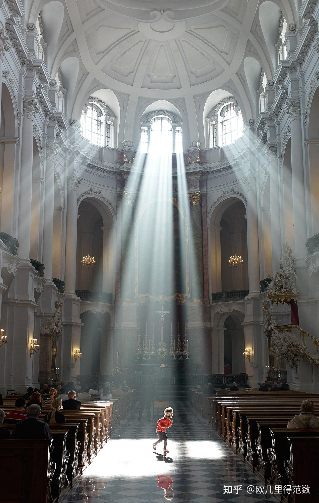
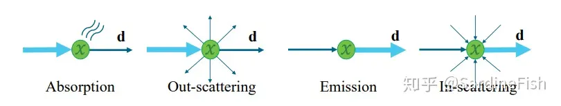
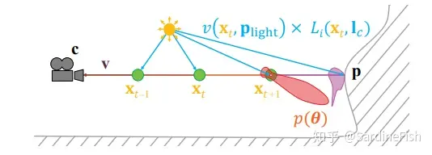
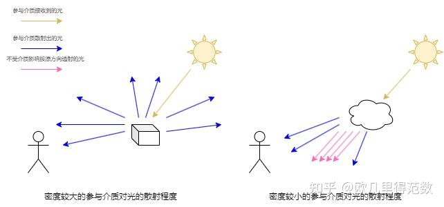
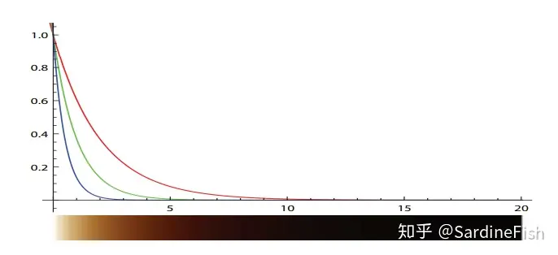
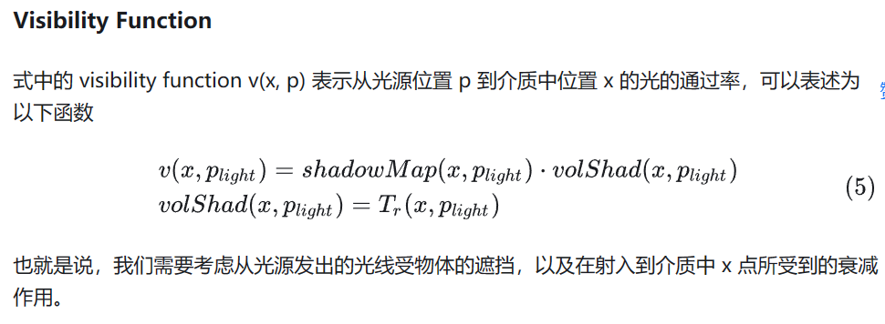
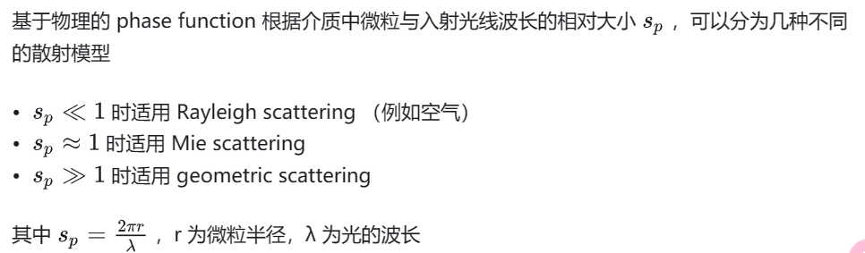
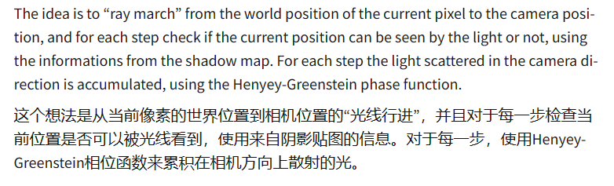
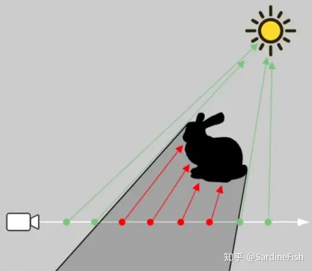
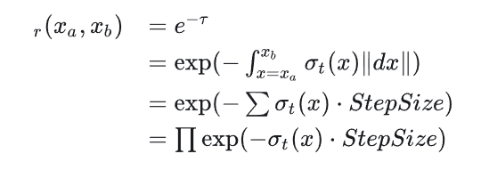

## 1什么是体积光？

在现实环境中，我们有时候会看到光路从云之间洒下来，在带有一些烟雾的舞台上可以看到聚光灯下具有“体积”的光，这种现象名为**丁达尔效应Tyndall effect** ，又称丁达尔现象、延得耳效应（也被广大网友玩梗无数称作各种XXX效应，如达尔文效应等），其原理是**光被悬浮的胶体粒子散射** 。下图中德国宫廷主教座堂内被散射而显现的光路，是丁达尔效应的一个典型例子。

这里有非常明显的效应产生，即光线遇到细小颗粒发生了相当多次的散射

光在介质中传播，会受以下四种因素而发生改变：

  * **Absorption** ，光线被物质吸收并由光能**转化为其他能量**

  * **Out-scattering** ，光线被介质中的微粒向外**散射**

  * **Emission** ，介质由于黑体辐射等因素产生**自发光**

  * **In-scattering** ，从其他地方**散射到当前光路上** 的光线

其中，介质对光线的吸收和散射会影响光线在介质中的**透射率 (transmittance)** 。

我们可以用下式来描述一个点光源发出的光线在介质中的散射效果：

[latex]
$$
L_i(c,v) = T_r(c,p)L_o(p,v)+ \\\int^{||p-c||}_{t=0}T_r(c,c-vt)L_{scat}(c-vt,v)\\\sigma_sdt
$$

其中的Lr表示的是介质中某一位置 x 到摄像机位置 c 的光线透射率函数，Lscat表示的是介质中 x 点向视线方向 v 的散射光

**Transmittance**

光线在介质中两点 𝑥𝑎,𝑥𝑏 间的透射率可以用下式描述

[latex]
$$
T_r(x_a,x_b) = e^{-\\\tau}
$$

其中

[latex]
$$
\\\tau = \\\int^{x_b}_{x=x_a}\\\sigma_t(x)||dx||
$$

该式又被称为 **Beer-Lambert Law** ,σx代表的事x处对光线的衰减率，包括吸收和向外散射，即transmittance = absorb + scattering

τ被称为 optical depth，表示最终对光线的衰减量，没有单位。在该式下，越高的衰减率或者更长的距离，都会使得 optical depth 增大，并得到更低的光线透射率。σt 可以具有 RGB 分量，例如下图是 σt = (0.5, 1.0, 2.0) 的介质中的光线透射率与透射距离的关系，以及表现出来的散射颜色。

**Scattering**

在介质中的 x 处，从点光源发出的光线散射到 v 方向上的光，可以通过下式表述

[latex]
$$
L_{scat}(x,v) = \\\pi \\\sum_{i=1}^np(v,l_{c_i})v(x,p_{light_i})c_{light_i}(||x-p_{light_i}||)
$$

**phase function**

phase function 用于描述在宏观上光线在介质中经过散射到各方向上的概率分布，通常表示为入射与出射光线夹角 θ 的函数 p(θ). 因为能量守恒，phase function 在单位球上的积分必须等于1

  1. 对于相对（光的波长）尺寸很小的粒子，发生**瑞利散射** ，比如空气。

  2. 对于相对尺寸接近1的粒子，发生**米氏散射** ，常见的粒子为雾中的聚光灯、太阳方向上的云，也就是**体积光对应的Phase function** 。

  3. 当粒子尺寸明显大于光线波长，发生**几何散射** 。

**Rayleigh Scattering**

[latex]
$$
p(\\\theta) = \\\frac{3}{16\\\pi}(1+\\\cos^2\\\theta)
$$

**Mie Scattering (Henyey-Greenstein phase function)**  [3]

[latex]
$$
p_{hg}(\\\theta,g) = \\\frac{1-g^2}{4\\\pi(1+g^2-2g\\\cos\\\theta)^{1.5}}
$$

式中参数 g 影响散射光在顺光或逆光方向上的相对强度，取值范围 [-1, 1]。Blasi 提出了该式的快速近似实现（又常称为 Schlick phase function）

[latex]
$$
p(\\\theta,k) = \\\frac{1-k^2}{4\\\pi(1+k\\\cos\\\theta)^2} \\\approx 1.55g - 0.55g^2
$$

**Geometric Scattering**

当介质中微粒显著大于光的波长时，光线将会发生折射与反射，要从宏观上模拟这样的散射现象，通常需要非常复杂的散射模型，例如体积云的渲染

## 实时的体积光渲染方案

### Volumetric Data

### 

体积渲染中材质的一个重要属性是 transmittance 函数中的衰减率 σt，我们可以假定整个材质中 σt 是均等的，例如在匀质胶体中。而对于一些大气中的云雾、烟雾，其内部各处的 σt 是不均等的，我们可以利用一个 3D Texture 储存和表示一个非均匀介质中各处的 σt，也可以基于解析函数实时计算，例如 3D Perlin Noise

### Ray-marching

It’s really simple, but as often with raymarching it can quickly become expensive as it require a certain amount of rays to capture details, and that’s why the ray marching is done in a downscaled texture.

在实时渲染中，通常采用 ray-marching 的方式实现介质中散射光的渲染。即对屏幕上每个像素，计算从摄像机发出的视线光线，在介质中以一个特定的步长迭代步进，并在每次步进的位置向光源再做一次 ray-marching 计算入射光强度，再根据 phase function 和 transmittance function 计算从当前位置到摄像机的散射光强度。ray marching可以详见下文

https://www.freezetheflame.cc/2024/05/15/ray-marching

参考[《在 Unity 中实现体积光渲染》](<https://zhuanlan.zhihu.com/p/124297905>)，其中提到，实时Ray-marching的代价巨大，因此可以**对模型简化** ：

  1. 省略从光源入射到介质的透光率Transmittance积分。

  2. 估计入射光经过的距离和介质的平均衰减率（考虑均匀介质）。

  3. 根据效果需要，决定是否考虑阴影。

### Simple Implementation

我们可以将体积渲染通过以下伪代码表示

    
    float3 scattering(float3 ray, float near, float far)
{
    float3 transmittance = 1;
    float3 totalLight = 0;
\tfor(float distance = near; distance < far; distance += StepSize)
    {
        float3 pos = CameraPosition + distance * ray;
        float3 extinction = ExtinctionAt(pos);
        transmittance *= exp(-StepSize * extinction);
        float3 inScatterFactor = extinction - Absorbtion;
        totalLight += transmittance * lightAt(pos) * inScatterFactor * Phase(lightDir, viewDir) * StepSize;
\t}
}
float3 lightAt(float3 pos)
{
    float3 lightDir = DirectionTowardLight;
    float3 transmittance = 1;
    for(float len = 0; len < DistanceToLight; len += StepSize)
    {
        float x = pos + lightDir * len;
        transmittance *= exp(-StepSize * ExtinctionAt(x));
    }
    float shadow = ShadowAt(pos);
    return LightColor * transmittance * shadow;
}

其中的 `ExtinctionAt(x)` 表示介质中 `x` 处的衰减率，可以表示为一个恒定的量（均匀介质），或是采样 3D Texture，或是用解析式计算。`Phase(l,v)` 可以根据需要，选择不同的 Phase Function 模型。`ShadowAt(x)` 可以通过采样 shadow map 实现。

式中采用累乘的方式步进计算 `transmittance`，避免多次积分计算，原理如下：

//TODO:非全局光源的设计和实现、unity URP的体积光实践，Moer内嵌体积光实践
