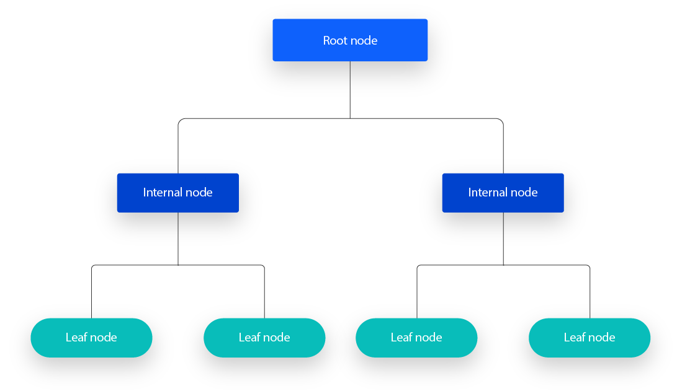
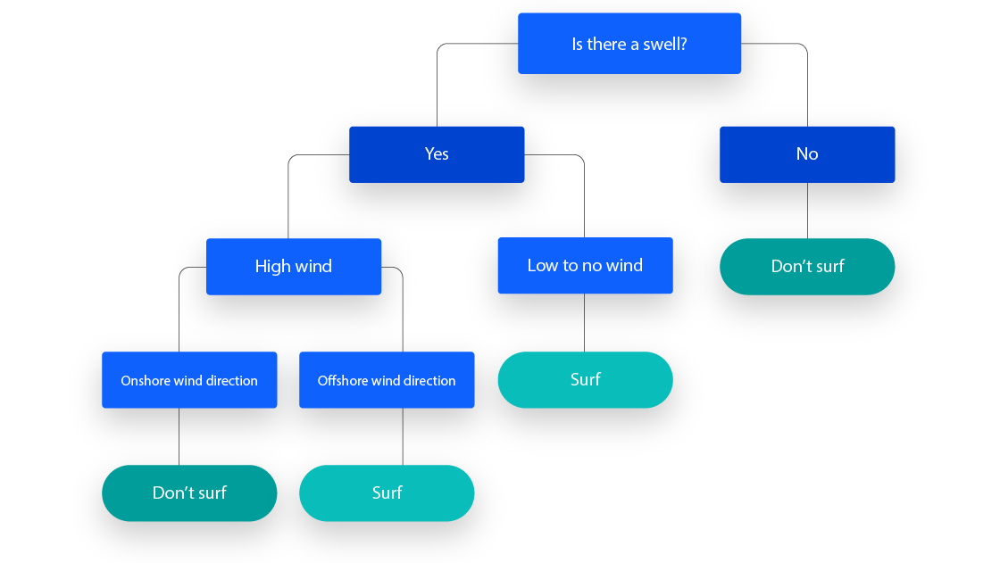
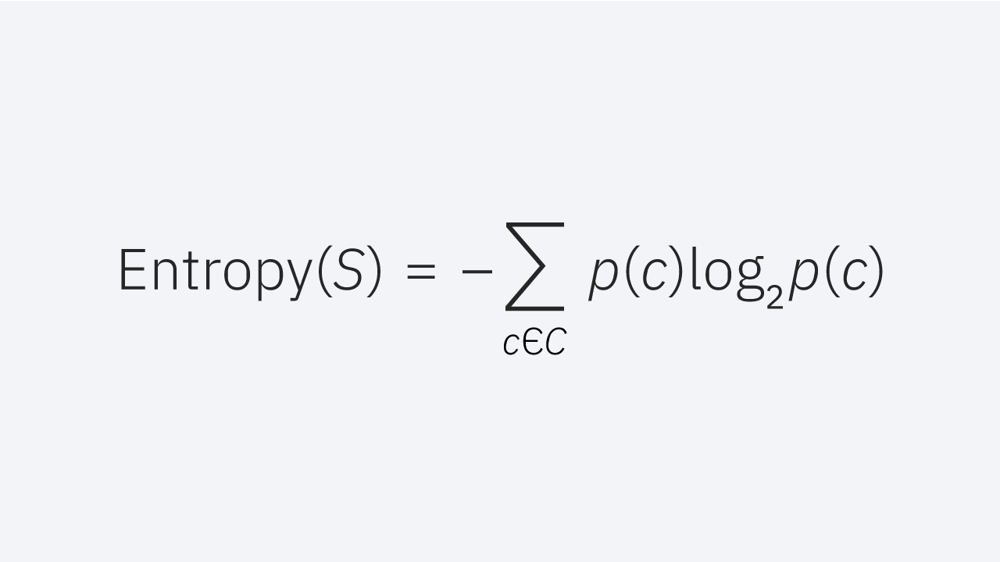
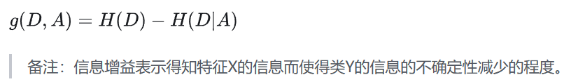
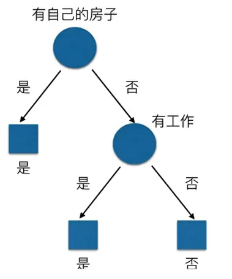
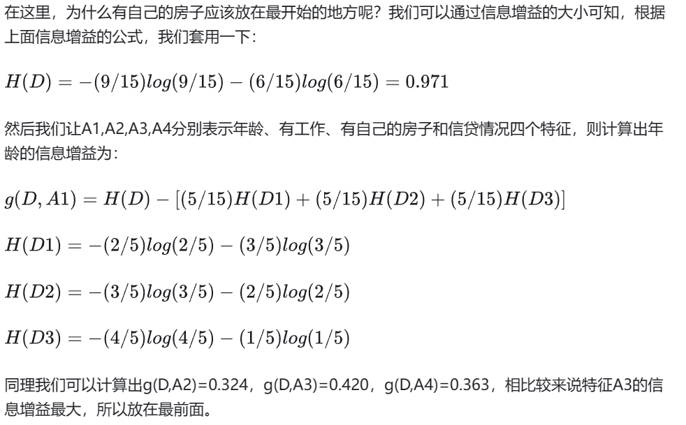

> \n
> 
> 背景：决策树方法在分类、预测、规则提取等领域有着广泛应用。20世纪70年代后期和80年代初期，机器学习研究者J.Ross Quinlan提出了ID3算法以后，决策树在机器学习、数据挖掘领域得到极大的发展。Quinlan后来又提出了C4.5，成为新的监督学习算法。1984年，几位统计学家 提出了CART分类算法。ID3和CART算法几乎同时被提出，但都是采用类似的方法从训练样本中学习决策树。——《Python数据分析与挖掘实战》
> 
> \n

\n\n\n

## 决策树介绍

\n\n\n\n

决策树是一个预测模型，它代表的是对象属性与对象值之间的一种映射关系。树中每个节点表示某个对象，而每个分叉路径则代表某个可能的属性值，而每个叶节点则对应从根节点到该叶节点所经历的路径所表示的对象的值。

\n\n\n\n\n\n\n\n

一个决策树包含三种类型的节点：

\n\n\n\n

\n
  1. 决策节点：通常用矩形框来表示
\n\n\n\n
  2. 机会节点：通常用圆圈来表示
\n\n\n\n
  3. 终结节点：通常用三角形来表示
\n
\n\n\n\n\n\n\n\n

## 决策树的算法（Types of Decision Trees）

\n\n\n\n\n\n\n\n

**ID3:  **Ross Quinlan is credited within the development of ID3, which is shorthand for “Iterative Dichotomiser 3.” This algorithm leverages entropy and information gain as metrics to evaluate candidate splits. Some of Quinlan’s research on this algorithm from 1986 can be found [here](<https://hunch.net/~coms-4771/quinlan.pdf>) (link resides outside ibm.com).  
\- ID3：Ross Quinlan参与了ID3的开发，这是“迭代二分器3”的简写。该算法利用熵和信息增益作为度量来评估候选分裂。Quinlan从1986年开始对该算法的一些ibm.com

\n\n\n\n

**C4.5:  **This algorithm is considered a later iteration of ID3, which was also developed by Quinlan. It can use information gain or gain ratios to evaluate split points within the decision trees.   
\- C4.5：该算法被认为是ID3的后期迭代，也是由Quinlan开发的。它可以使用信息增益或增益比来评估决策树中的分裂点。

\n\n\n\n

**CART:  **The term, CART, is an abbreviation for “classification and regression trees” and was introduced by Leo Breiman. This algorithm typically utilizes Gini impurity to identify the ideal attribute to split on. Gini impurity measures how often a randomly chosen attribute is misclassified. When evaluating using Gini impurity, a lower value is more ideal.   
\- CART：术语CART是“分类和回归树”的缩写，由Leo Breiman提出。该算法通常利用基尼不纯度来确定要分割的理想属性。基尼不纯度度量随机选择的属性被错误分类的频率。当使用Gini杂质进行评价时，较低的值更理想。

\n\n\n\n

要理解这三个算法，首先需要理解信息增益以及基尼杂质等的问题，所以我们先了解一下与信息增益密切相关的信息熵

\n\n\n\n

## 信息熵介绍 _Entropy and Information Gain_

\n\n\n\n

如果不先讨论熵，就很难解释信息增益。熵是一个源于信息论的概念，它衡量样本值的不纯性。它由以下公式定义，其中：

\n\n\n\n\n\n\n\n

\n
  * S represents the data set that entropy is calculated   
S表示计算熵的数据集
\n\n\n\n
  * c represents the classes in set, S  
c表示集合S中的类
\n\n\n\n
  * p(c) represents the proportion of data points that belong to class c to the number of total data points in set, S  
p（c）表示属于类别c的数据点与集合S中的总数据点的数量的比例
\n
\n\n\n\n

熵值可以介于0和1之间。如果数据集S中的所有样本都属于一个类，则熵将等于零。如果一半的样本被分类为一类，另一半被分类为另一类，则熵将在1处达到最高。为了选择最好的特征进行分割并找到最佳决策树，应该使用具有最小熵的属性。信息增益表示在给定属性上分割之前和之后的熵的差异。具有最高信息增益的属性将产生最好的分裂，因为它在根据其目标分类对训练数据进行分类方面做得最好。以下则是条件熵的公式

\n\n\n\n\n\n\n\n

决策树的划分依据是信息增益：

\n\n\n\n

所谓的信息增益是指特征A对训练数据集D的信息增益g（D,A）定义为集合D的信息熵H(D)与特征A给定条件下D的信息条件熵H(D|A)之差，即公式为：

\n\n\n\n\n\n\n\n

一些例子

\n\n\n\n\n\n\n\n

首先可以搓出最基本的决策树：

\n\n\n\n\n\n\n\n\n\n\n\n

### 基尼系数

\n\n\n\n

除此之外我们还要考虑基尼杂质的问题，Gini杂质是数据集中的随机数据点如果根据数据集的类分布进行标记，则错误分类的概率。与熵类似，如果集合S是纯的（即属于一个类），那么它的不纯性为零。这由以下公式表示：（这个东西和熵很类似）

\n\n\n\n\n\n\n\n

## 决策树的优劣

\n\n\n\n

### 优点：

\n\n\n\n

**Easy to interpret:  **The Boolean logic and visual representations of decision trees make them easier to understand and consume. The hierarchical nature of a decision tree also makes it easy to see which attributes are most important, which isn’t always clear with other algorithms, like [neural networks](<https://www.ibm.com/topics/neural-networks>).  
\- 易于解释：决策树的布尔逻辑和可视化表示使其更容易理解和使用。决策树的层次性也使得它很容易看到哪些属性是最重要的，这在其他算法中并不总是很清楚，比如神经网络。

\n\n\n\n

**Little to no data preparation required:  **Decision trees have a number of characteristics, which make it more flexible than other classifiers. It can handle various data types—i.e. discrete or continuous values, and continuous values can be converted into categorical values through the use of thresholds. Additionally, it can also handle values with missing values, which can be problematic for other classifiers, like Naïve Bayes.    
\- 几乎不需要数据准备：决策树具有许多特性，这使得它比其他分类器更灵活。它可以处理各种数据类型，即离散或连续值，连续值可以通过使用阈值转换为分类值。此外，它还可以处理带有缺失值的值，这对于其他分类器（如朴素贝叶斯）来说可能是个问题。

\n\n\n\n

**\- More flexible:**  Decision trees can be leveraged for both classification and regression tasks, making it more flexible than some other algorithms. It’s also insensitive to underlying relationships between attributes; this means that if two variables are highly correlated, the algorithm will only choose one of the features to split on.   
\- 更灵活：决策树可以用于分类和回归任务，使其比其他算法更灵活。它对属性之间的底层关系也不敏感;这意味着如果两个变量高度相关，算法将只选择其中一个特征进行分割。

\n\n\n\n

### 缺点

\n\n\n\n

**\- Prone to overfitting:**  Complex decision trees tend to overfit and do not generalize well to new data. This scenario can be avoided through the processes of pre-pruning or post-pruning. Pre-pruning halts tree growth when there is insufficient data while post-pruning removes subtrees with inadequate data after tree construction.   
\- 倾向于过拟合：复杂的决策树倾向于过拟合，并且不能很好地推广到新数据。这种情况可以通过预修剪或后修剪的过程来避免。当数据不足时，预修剪停止树的生长，而后修剪在树构建之后移除数据不足的子树。

\n\n\n\n

**\- High variance estimators:  **Small variations within data can produce a very different decision tree. [Bagging](<https://www.ibm.com/topics/bagging>), or the averaging of estimates, can be a method of reducing variance of decision trees. However, this approach is limited as it can lead to highly correlated predictors.    
\- 高方差估计：数据中的微小变化可能会产生非常不同的决策树。Bagging或估计的平均值可以是减少决策树方差的方法。然而，这种方法是有限的，因为它可能导致高度相关的预测。

\n\n\n\n

**\- More costly:  **Given that decision trees take a greedy search approach during construction, they can be more expensive to train compared to other algorithms.   
\- 更昂贵：鉴于决策树在构建过程中采用贪婪搜索方法，与其他算法相比，它们的训练成本可能更高。

\n\n\n\n

## 实践：

\n\n\n\n

我们试着使用决策树来解决Titanic Disaster这个预测模型

\n\n\n\n
    
    
    # 首先导入需要的包\nfrom sklearn.model_selection import train_test_split, GridSearchCV\nfrom sklearn.preprocessing import StandardScaler\nfrom sklearn.metrics import classification_report\nfrom sklearn.tree import DecisionTreeClassifier, export_graphviz\nimport pandas as pd

\n\n\n\n
    
    
    def descision():\n    """\n    决策树对泰坦尼克号进行预测生死\n    :return:None\n    """\n    titan = pd.read_csv("http://biostat.mc.vanderbilt.edu/wiki/pub/Main/DataSets/titanic.txt")\n\n    # 处理数据，找出特征值和目标值\n    x = titan[['pclass', 'age', 'sex']]\n\n    y = titan['survived']\n    print(x)\n\n    # 缺失值处理\n    x['age'].fillna(x['age'].mean(), inplace=True)\n\n    # 分割数据集到训练集和测试集\n    x_train, x_test, y_train, y_test = train_test_split(x, y, test_size=0.25)\n\n    # 进行处理(特征工程)\n    dict = DictVectorizer(sparse=False)\n\n    x_train = dict.fit_transform(x_train.to_dict(orient="records"))\n\n    print(dict.get_feature_names())\n\n    x_test = dict.transform(x_test.to_dict(orient="records"))\n\n    print(x_train)\n\n    # 用决策树进行预测\n    dec = DecisionTreeClassifier()\n\n    dec.fit(x_train, y_train)\n\n    # 预测准确率\n    print("预测的准确率为：", dec.score(x_test, y_test))\n\n    # 导出决策树的结构\n    export_graphviz(dec, out_file="./tree.dot", feature_names=['age', 'pclass=1st', 'pclass=2nd', 'pclass=3rd', 'sex=female', 'sex=male'])\n\n\nif __name__=="__main__":\n    descision()

\n\n\n\n

这边用到了一个我不熟悉领域的知识点，特征工程的提取处理，感觉新开一个坑来讨论一下这个东西

\n\n\n\n

\n\n\n\n

\nhttps://www.freezetheflame.cc/2024/05/17/%e7%89%b9%e5%be%81%e5%b7%a5%e7%a8%8b%ef%bc%88feature-engineering%ef%bc%89\n

\n