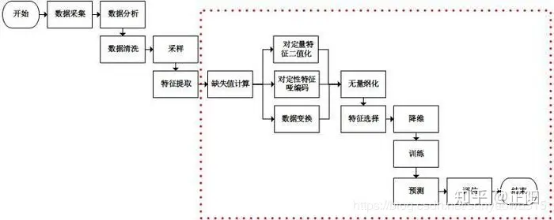
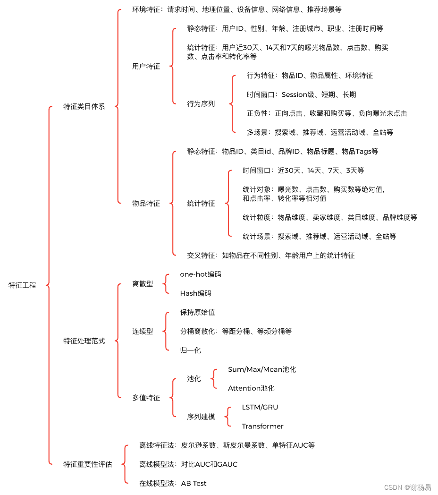

\n

Feature Engineering is the process of creating new features or transforming existing features to improve the performance of a machine-learning model. It involves selecting relevant information from raw data and transforming it into a format that can be easily understood by a model.

\n\n\n\n

## 特征工程是什么？

\n\n\n\n

这点解释起来很简单，即把数据转换成机器可以理解的形式

\n\n\n\n

\n
  * 特征工程（Feature Engineering）特征工程是将原始数据转化成更好的表达问题本质的特征的过程，使得将这些特征运用到预测模型中能提高对不可见数据的模型预测精度。
\n\n\n\n
  * 特征工程简单讲就是发现对因变量y有明显影响作用的特征，通常称自变量x为特征，特征工程的目的是发现重要特征。
\n\n\n\n
  * 如何能够分解和聚合原始数据，以更好的表达问题的本质？这是做特征工程的目的。 “feature engineering is manually designing what the input x’s should be.” “you have to turn your inputs into things the algorithm can understand.”
\n
\n\n\n\n\n\n\n\n

In the context of machine learning, a feature (also known as a variable or attribute) is an individual measurable property or characteristic of a data point that is used as input for a machine learning algorithm.

\n\n\n\n

所谓feature,一定是一系列可量化的东西，Features can be**numerical,** **categorical** , or **text-based** , and they represent different aspects of the data that **are relevant to the problem at hand**.

\n\n\n\n

特征和属性不同，特征必须是“related”的（对于眼下的问题而言），而属性未必。在数据挖掘模型中，特征工程是最耗时间的一步

\n\n\n\n

特征工程是一个包含内容很多的主题，也被认为是成功应用机器学习的一个很**重要** 的环节。如何充分利用数据进行预测建模就是特征工程要解决的问题！ “实际上，所有机器学习算法的成功取决于如何呈现数据。” 

\n\n\n\n

“特征工程是一个看起来不值得在任何论文或者书籍中被探讨的一个主题。但是他却对机器学习的成功与否起着至关重要的作用。机器学习算法很多都是由于建立一个学习器能够理解的工程化特征而获得成功的。”——ScottLocklin，in “Neglected machine learning ideas”

\n\n\n\n

## 什么是特征重要性？

\n\n\n\n

特征重要性，可以被认为是一个选择特征重要的评价方法。特征可以被分配一个分值，然后按照这个分值排序，那些具有较高得分的特征可以被选出来包含在训练集中，同时剩余的就可以被忽略。特征重要性得分可以帮助我们抽取或者构建新的特征。挑选那些相似但是不同的特征作为有用的特征。 如果一个特征与因变量（被预测的事物）高度相关，那么这个特征可能很重要。**相关系数和其他单变量的方法（每一个变量被认为是相互独立的）是比较通用的评估方法。** 更复杂的方法是通过预测模型算法来对特征进行评分。这些预测模型内部有这样的特征选择机制，比如MARS，随机森林，梯度提升机。这些模型也可以得出变量的重要性。

\n\n\n\n

## 如何进行特征工程

\n\n\n\n\n\n\n\n

### **Types of Feature Creation:  
特征创建类型：**

\n\n\n\n

\n
  1. **Domain-Specific:  **Creating new features based on domain knowledge, such as creating features based on business rules or industry standards.  
领域特定：基于领域知识创建新功能，例如基于业务规则或行业标准创建功能。
\n\n\n\n
  2. **Data-Driven:  **Creating new features by observing patterns in the data, such as calculating aggregations or creating interaction features.  
数据驱动：通过观察数据中的模式来创建新特征，例如计算聚合或创建交互特征。
\n\n\n\n
  3. **Synthetic:  **Generating new features by combining existing features or synthesizing new data points.  
合成：通过组合现有特征或合成新数据点来生成新特征。
\n
\n\n\n\n\n\n\n\n

我觉得知乎@正阳 总结的非常到位，即特征工程的实践，主要分为这些步骤：评估特征使用方案

\n\n\n\n

、制定特征获取方案，比如说怎么获取并且存储这些特征。通过这些前期工作之后就进入到**特征处理** 的核心了，

\n\n\n\n

在特征处理阶段，首先我们要对已有的特征集合进行清理，主要包括：清理异常数据和按比例采样两种，核心是为了协调特征处理数据集的平衡性，避免出现极端情况，这一点称为“特征清洗”

\n\n\n\n

在清洗完之后的预处理，要分情况而言做对应的处理，比如说单个特征进行一些归一化、离散化以及变换的操作，多特征则首先考虑是否有降维（降低复杂性）的需要，其次则考虑主动选择特征

\n\n\n\n

除此之外，在以上的特征工程活动之中，还需要注意特征监控的“检查”工作，比如说特征在处理过程中是否体现出其有效性，在处理过后特征集合的质量是否出现下降之类。

\n\n\n\n\n\n\n\n

我们分模块来探讨这些问题

\n\n\n\n

##  1.数据获取

\n\n\n\n

要实现特征工程目标，要用到什么数据？需要结合特定业务，具体情况具体分析。 重点考虑如下三方面： ①数据获取途径 - 如何获取特征（接口调用or自己清洗or/github资源下载等） - 如何存储？（/data/csv/txt/array/Dataframe//其他常用分布式）

\n\n\n\n

②数据可用性评估 - 获取难度 - 覆盖率 - 准确率

\n\n\n\n

③特征维度

\n\n\n\n

## 数据描述（Feature Describe）

\n\n\n\n

通过数据获取，我们得到未经处理的特征，这时的特征可能有以下问题： - 存在缺失值：缺失值需要补充。 - 不属于同一量纲：即特征的规格不一样，不能够放在一起比较。 - 信息冗余：对于某些定量特征，其包含的有效信息为区间划分，例如学习成绩，假若只关心“及格”或不“及格”，那么需要将定量的考分，转换成“1”和“0”表示及格和未及格。 - 定性特征不能直接使用：某些机器学习算法和模型只能接受定量特征的输入，那么需要将定性特征转换为定量特征。 - 信息利用率低：不同的机器学习算法和模型对数据中信息的利用是不同的。

\n\n\n\n

那么最好先对数据的整体情况做一个描述、统计、分析，并且可以尝试相关的可视化操作。主要可分为以下几方面：

\n\n\n\n

### 1 数据结构

\n\n\n\n

### 2 质量检验

\n\n\n\n

标准性、唯一性、有效性、正确性、一致性、缺失值、异常值、重复值

\n\n\n\n

### 3 分布情况

\n\n\n\n

统计值

\n\n\n\n

包括max, min, mean, std等。python中用pandas库序列化数据后，可以得到数据的统计值。

\n\n\n\n

探索性数据分析（EDA，Exploratory Data Analysis）

\n\n\n\n

集中趋势、离中趋势、分布形状

\n\n\n\n

其中还包括一个重要的方面：特征类目体系

\n\n\n\n

掌握特征类目体系，有利于提升特征丰富度，完善特征工程体系。在具体的业务场景中，可以将自己想象为一个真实用户，思考哪些特征对用户点击和转化有比较大的影响。深度学习赋予了特征自动交叉的能力，降低了对领域知识的要求，但不代表不需要加强业务理解能力。

\n\n\n\n

一般来说主要包括**环境特征（Context Feature）、用户特征（User Feature）和物品特征（Item Feature）三大类** 。环境特征一般需要用户授权才能获取，不同业务场景所需的环境特征会有一定区别，可以枚举如下：

\n\n\n\n

\n
  1. **请求时间** ：如请求发生在周几，是否节假日，发生在几点，当前季节等。
\n\n\n\n
  2. **地理位置** ：如用户当前所在的国家、省份、城市，以及当地天气和温度等。
\n\n\n\n
  3. **设备信息** ：如手机机型、手机厂商、操作系统（Android/IOS）等。
\n\n\n\n
  4. **网络信息** ：如运营商渠道、网络类型（WIFI/5G/4G）等。
\n\n\n\n
  5. **客户端信息** ：如请求渠道（APP/小程序/H5/PC等）、APP版本号等
\n\n\n\n
  6. **推荐场景** ：如首页推荐、相关推荐、详情页推荐等
\n
\n\n\n\n

用户特征通常也称用户画像，主要包括用户静态特征、统计特征和行为序列特征三大类，一般也需要用户授权才能获取和使用。用户特征有利于提高个性化分发能力，可以枚举如下：

\n\n\n\n

\n
  1. **静态特征：** 如用户ID、性别、年龄、注册城市、职业、注册时间、是否VIP、是否新用户、是否已婚，以及是否有小孩等。静态特征通常区分度很高，是推荐系统中的强信号。比如不同性别和年龄的用户，其兴趣差异会很大。是否有小孩，会直接决定用户是否对母婴类目商品有兴趣。静态特征一般很少变动，适用范围广，可以应用到多个不同业务场景中。其难点在于不好收集，需要用户主动提供且授权，才能使用。另外一般需要加密存储，防止用户隐私信息泄露。
\n\n\n\n
  2. **统计特征：** 如用户近30天、14天和7天的曝光物品数、点击数、购买数、点击率和转化率等。统计特征包括绝对值和相对值两大类，绝对值用来刻画流量信息，相对值则可以刻画效率信息。相对值需要注意其置信度，例如“曝光数2次、点击数1次”，和“曝光数200次、点击数100次”两组特征，点击率虽然同为0.5，但前者置信度明显不足。统计特征大多为后验特征，经过了真实场景充分验证，对模型帮助很大。最后需要注意的是，统计特征容易出现数据穿越问题，生产时要小心。例如构造天级样本时，千万不要把当天的统计数据也计算进去了。
\n\n\n\n
  3. **  行为序列特征**：目前，针对用户行为序列特征的研究很多，它是当前算法模型效果提升的关键。一个历史行为，可以包括被行为（如被点击）物品的ID，还可以包括其类目ID、品牌ID和卖家ID等物品属性特征，以及历史行为距离当前时间间隔等环境特征。按时间窗口划分，有Session级行为序列、短期行为序列和长期行为序列。按用户反馈正负性划分，有点击、购买和收藏等正反馈序列，和曝光未点击等负反馈序列。构建全面而丰富的用户行为序列，可以充分挖掘用户兴趣，有利于提升模型效果和用户体验。
\n
\n\n\n\n

物品特征主要包括物品静态特征、统计特征和交叉特征三大类。物品是推荐这一行为的实体，充分挖掘其特征有助于筛选出高质量，且用户喜欢的物品。物品特征可以枚举如下：

\n\n\n\n

\n
  1. **静态特征** ：如物品ID、类目ID、品牌ID、卖家ID、价格、标题和上架时间等。其在不同场景下有一定的区别，比如电商场景和短视频场景。这些特征可由机器识别、运营标注和卖家（或创作者）填写等多种方式产出。
\n\n\n\n
  2. **统计特征** ：如物品近30天、14天和7天的曝光数、点击数、购买数、点击率和转化率等。统计特征可以表征物品的热度、质量和转化效率等信息，重要性很高。按时间窗口划分，有近30天、近14天、近7天和近3天等构造方法。按统计对象划分，有曝光数、点击数、购买数等绝对值，和点击率、转化率等相对值。按统计粒度划分，既可以统计物品本身数据，还可以统计物品的卖家、对应类目、对应品牌的各项数据。按统计场景划分，可以对推荐、搜索、运营活动和全站等多个场景分别统计。跟用户侧一样，物品统计特征也要注意数据穿越问题。
\n\n\n\n
  3. **交叉特征** ：物品与用户交叉特征，比如物品在不同性别、年龄用户上的统计特征。有利于挖掘物品在不同人群上的流量和效率表现情况，缓解“辛普森悖论”问题，从而让个性化分发更准确。虽然深度模型可以实现自动特征交叉，但交叉不一定充分。另外交叉特征是强信号特征，可以降低模型学习难度，从而让它将精力用在其他更需要学习的地方。因此，手工构造关键的交叉特征，目前仍然有重要意义。一般来说，用户特征与物品特征间交叉，比用户特征之间，或物品特征之间交叉，更为重要。
\n
\n\n\n\n

以上的特征类目信息大多来自于“推荐系统”的角度（本文[推荐算法架构7：特征工程（吊打面试官，史上最全！）_特征工程技术架构-CSDN博客](<https://blog.csdn.net/u013510838/article/details/135123291>)），所以主要参考他对于特征的分类

\n\n\n\n

## 特征处理范式

\n\n\n\n

收集到原始特征后，还需要进一步进行**离散化、归一化、池化和缺失值填充** 等处理，才能输入到模型中。特征处理有助于让模型学习更高效，更鲁棒，因此同样十分重要。针对不同类型的特征，会有不同的处理方法。特征类型主要有离散型、连续型和多值特征三大类。

\n\n\n\n

离散型特征，一般也称为类别型特征，如物品ID、类目ID和品牌ID等。类别型特征枚举值多，区分度高，是推荐系统中的强信号。而且大多是静态特征，不需要后验数据，冷启动效果好。离散型特征主要有如下处理方法：

\n\n\n\n

\n
  1. **one-hot编码** ：每个类别为一个二进制向量，向量中每个维度代表一个类别取值，只有一个维度的值为1，其余均为0。one-hot编码简单易用，是机器学习中经常采用的编码方法。但当特征类别值较多时，会遇到“维度灾难”问题。
\n\n\n\n
  2. **Hash编码：** 利用Hash函数，对原始值进行变换和降维。有较强的压缩能力，特别适合于类别值很多的特征。同时其计算速度很快，额外开销小。但有一定概率会将不同原始值Hash为同一值，存在Hash冲突问题，可能影响算法准确度。另外Hash编码会导致原始值难以识别，可解释性降低。
\n
\n\n\n\n

连续型特征，如用户侧和物品侧的各项统计特征。它可以有效表征用户活跃度、物品质量、物品转化效率等信息，因此十分重要。另外很多连续型特征同时也是后验特征，经过了大量真实用户检验，可以提升模型预估准确性。连续型特征主要有如下处理方法：

\n\n\n\n

\n
  1. **保持原始值：** 可以将连续型特征，直接与类别型特征的Embedding编码向量，拼接起来，然后输入到模型中。DeepCrossing[2]等早期深度模型通常采用这一方案。它操作简单，容易实现，但泛化能力差，且容易受异常值影响。
\n\n\n\n
  2. **分桶离散化：** 目前常用的方法，利用预先定义的分桶边界值，将连续值归入对应桶内。这种方法有利于提升模型泛化能力，降低过拟合问题，同时对异常值不敏感，因此应用十分广泛。有等距分桶和等频分桶等多种具体实现方式，一般来说正样本等频分桶效果较好。分桶法的缺点是位于分桶边界附近的数值，即使差距很小，也有可能会被归入不同的桶内。最后，分桶法需要注意尽量让每个桶内都有充足样本，且样本不要集中于个别桶内。
\n\n\n\n
  3. **归一化：** 有最大最小值归一化、对数函数转换、区间缩放法等多种方法。归一化有利于降低个别特征的主导地位，让模型学习更平稳，并加快收敛速度。
\n
\n\n\n\n

多值特征，最典型的就是用户行为序列，以及用户Tag、物品Tag和物品标题等特征。推荐系统中，绝大多数的特征都是单值的，比如用户性别和年龄。但有部分特征是数组等多值形式，比如物品标题由多个字组成，用户行为序列由多个历史行为组成等。多值特征的数组长度不固定，无法直接输入到模型中，因此需要转换为固定长度，主要方法有：

\n\n\n\n

\n
  1. **池化：** 如最大值池化、求和池化和平均池化等方法。先利用离散型特征或连续型特征的处理方法，对多值特征中的每个特征值进行转换，并进行Embedding编码。然后对它们求最大值、求和或求平均，将其压缩为一个单值Embedding向量。这种方法比较简单，计算耗时低，但没有考虑不同特征值之间的重要性差别。为了解决这一问题，Attention[3]池化被提出。它先计算每个特征值的权重，然后再加权求和。目前物品标题等普通多值特征常使用平均池化，而用户行为序列则可以使用Attention池化。
\n\n\n\n
  2. **序列建模：** 常用在用户行为序列特征的处理中。它利用LSTM[4]或GRU[5]等循环神经网络，或Transformer[6]网络进行信息抽取，并将不定长的原始序列转换为一个定长向量，然后再输入到模型上层网络中。Transformer表达能力强，并行计算快，目前已经成为了行为序列建模的主流方案。
\n
\n\n\n\n

特征工程中，还经常碰到缺失值和异常值问题。对于缺失值，可以用平均值、固定值、中位数或近邻值进行填充，也可以看做一种普通数值而不填充。对于异常值，可以做最值截断、平滑或直接去除等操作。

\n\n\n\n

## 2.特征处理（Feature Processing）

\n\n\n\n

（1）缺失值处理

\n\n\n\n

有些特征可能因为无法采样或者没有观测值而缺失.例如距离特征，用户可能禁止获取地理位置或者获取地理位置失败，此时需要对这些特征做特殊的处理，赋予一个缺失值。我们在进行模型训练时，不可避免的会遇到类似缺失值的情况，下面整理了几种填充空值的方法

\n\n\n\n

### 1）缺失值删除（dropna）

\n\n\n\n

### ①删除实例

\n\n\n\n

### ②删除特征

\n\n\n\n

### 2）缺失值填充（fillna）

\n\n\n\n

#### ①用固定值填充

\n\n\n\n

对于特征值缺失的一种常见的方法就是可以用固定值来填充，例如0，9999， -9999, 例如下面对灰度分这个特征缺失值全部填充为-99

\n\n\n\n
    
    
    data['灰度分'] = data['灰度分'].fillna('-99')

\n\n\n\n

#### ②用均值填充

\n\n\n\n

对于数值型的特征，其缺失值也可以用未缺失数据的均值填充，下面对灰度分这个特征缺失值进行均值填充

\n\n\n\n
    
    
    data['灰度分'] = data['灰度分'].fillna(data['灰度分'].mean()))

\n\n\n\n

#### ③用众数填充

\n\n\n\n

与均值类似，可以用未缺失数据的众数来填充缺失值

\n\n\n\n
    
    
    data['灰度分'] = data['灰度分'].fillna(data['灰度分'].mode()))

\n\n\n\n

#### ④用上下数据进行填充

\n\n\n\n

\n
  * 用前一个数据进行填充
\n
\n\n\n\n
    
    
    data['灰度分'] = data['灰度分'].fillna(method='pad')

\n\n\n\n

\n
  * 用后一个数据进行填充
\n
\n\n\n\n
    
    
    data['灰度分'] = data['灰度分'].fillna(method='bfill')

\n\n\n\n

#### ⑤用插值法填充

\n\n\n\n
    
    
    data['灰度分'] = data['灰度分'].interpolate()

\n\n\n\n

#### ⑥用KNN进行填充

\n\n\n\n
    
    
    from fancyimpute import BiScaler, KNN, NuclearNormMinimization, SoftImpute\ndataset = KNN(k=3).complete(dataset)

\n\n\n\n

#### ⑦random forest进行填充

\n\n\n\n
    
    
    from sklearn.ensemble import RandomForestRegressor\nzero_columns_2 = ['机构查询数量', '直接联系人数量', '直接联系人在黑名单数量', '间接联系人在黑名单数量',\n                '引起黑名单的直接联系人数量', '引起黑名单的直接联系人占比']\n#将出现空值的除了预测的列全部取出来，不用于训练                \ndataset_list2 = [x for x in dataset if x not in zero_columns_2]\ndataset_2 = dataset[dataset_list2]\n# 取出灰度分不为空的全部样本进行训练\nknow = dataset_2[dataset_2['灰度分'].notnull()]\nprint(know.shape) #26417, 54\n# 取出灰度分为空的样本用于填充空值\nunknow = dataset_2[dataset_2['灰度分'].isnull()]\nprint(unknow.shape) #2078, 54\ny = ['灰度分']\nx = [1]\nknow_x2 = know.copy()\nknow_y2 = know.copy()\nprint(know_y2.shape)\n#\nknow_x2.drop(know_x2.columns[x], axis=1, inplace=True)\nprint(know_y2.shape)\nprint(know_x2.shape)\n#\nknow_y2 = know[y]\n# RandomForestRegressor\nrfr = RandomForestRegressor(random_state=666, n_estimators=2000, n_jobs=-1)\nrfr.fit(know_x2, know_y2)\n# 填充为空的样本\nunknow_x2 = unknow.copy()\nunknow_x2.drop(unknow_x2.columns[x], axis=1, inplace=True)\nprint(unknow_x2.shape) #(2078, 53)\nunknow_y2 = rfr.predict(unknow_x2)\nunknow_y2 = pd.DataFrame(unknow_y2, columns=['灰度分'])

\n\n\n\n

#### ⑧使用fancyimpute包中的其他方法

\n\n\n\n
    
    
    <em># matrix completion using convex optimization to find low-rank solution</em>\n<em># that still matches observed values. Slow!</em>\nX_filled_nnm = NuclearNormMinimization().complete(X_incomplete)\n<em># Instead of solving the nuclear norm objective directly, instead</em>\n<em># induce sparsity using singular value thresholding</em>\nX_filled_softimpute = SoftImpute().complete(X_incomplete_normalized)\n<em># print mean squared error for the three imputation methods above</em>\nnnm_mse = ((X_filled_nnm[missing_mask] - X[missing_mask]) ** 2).mean()\n<em># print mean squared error for the three imputation methods above</em>\nnnm_mse = ((X_filled_nnm[missing_mask] - X[missing_mask]) ** 2).mean()\nprint("Nuclear norm minimization MSE: %f" % nnm_mse)\nsoftImpute_mse = ((X_filled_softimpute[missing_mask] - X[missing_mask]) ** 2).mean()\nprint("SoftImpute MSE: %f" % softImpute_mse)\nknn_mse = ((X_filled_knn[missing_mask] - X[missing_mask]) ** 2).mean()\nprint("knnImpute MSE: %f" % knn_mse)

\n\n\n\n

#### ⑨缺失值作为数据的一部分不填充

\n\n\n\n

LightGBM和XGBoost都能将NaN作为数据的一部分进行学习，所以不需要处理缺失值。

\n\n\n\n

### 3)异常值处理

\n\n\n\n

#### 1）特征异常平滑

\n\n\n\n

\n
  * 基于统计的异常点检测算法 例如极差，四分位数间距，均差，标准差等，这种方法适合于挖掘单变量的数值型数据。
\n\n\n\n
  * 基于距离的异常点检测算法 主要通过距离方法来检测异常点，将数据集中与大多数点之间距离大于某个阈值的点视为异常点，主要使用的距离度量方法有绝对距离(曼哈顿距离)、欧氏距离和马氏距离等方法。
\n\n\n\n
  * 基于密度的异常点检测算法 考察当前点周围密度，可以发现局部异常点。
\n
\n\n\n\n

#### （3）重复值处理

\n\n\n\n

根据需求判断是否需要去重操作

\n\n\n\n

#### （4）数据格式处理

\n\n\n\n

\n
  * 数字类型的转换
\n\n\n\n
  * 数字单位的调整
\n\n\n\n
  * 时间格式的处理
\n
\n\n\n\n

#### （5）数据采样

\n\n\n\n

多的类别过采样/少的类别欠采样来平衡分布欠采样（undersampling）和过采样（oversampling）会对模型带来不一样的影响。

\n\n\n\n

## 

\n