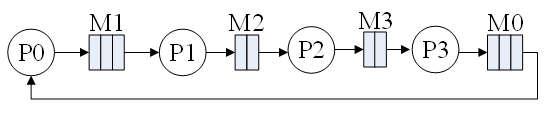
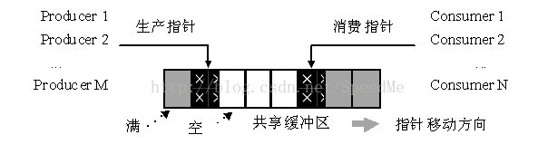
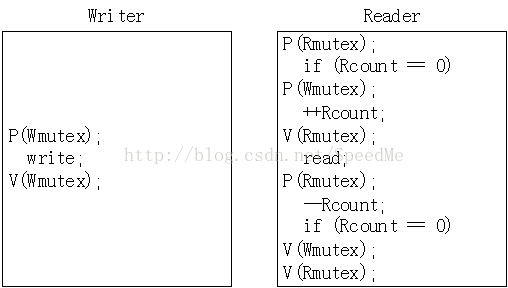
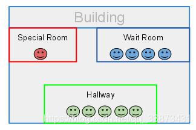
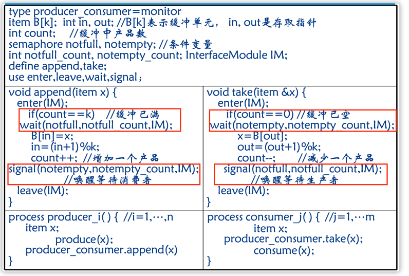

\n

一些关于PV信号量以及常见的并发调度例题和理论

\n\n\n\n

## PV信号量

\n\n\n\n

###  PV操作定义

\n\n\n\n

信号量是一类特殊的变量，程序对其访问都是原子 操作，且只允许对它进行P(信号变量)和V(信号变量) 操作。

\n\n\n\n

• 二元信号量：取值仅为“0”或“1”，主要用作**实现互斥** ；

\n\n\n\n

• 一般信号量：初值为可用物理资源的总数，用于**进程间的协作同步问题**

\n\n\n\n

\n
  * 一个信号量可能被初始化为一个非负整数.
\n\n\n\n
  * semWait 操作（P操作）使信号量减1。若值为负，则执行 semWait的进程被阻塞。否则进程继续执行。
\n\n\n\n
  * semSignal操作（V操作）使信号量加1。若值小于或等于零， 则被semWait操作阻塞的进程被解除阻塞
\n
\n\n\n\n

总而言之：**P操作负责分配资源，没有资源的时候就等着（进入阻塞队列）。V操作负责释放资源，在阻塞队列不为空的时候唤醒某个进程进入临界区** 。

\n\n\n\n

【PV】四个进程Pi（i=0…3）和四个信箱Mj（j=0…3），进程间借助相邻信箱传递消息，即Pi每次从Mi中取一条消息，经加工后送入M[(i+1) mod 4]，其中M0、M1、M2、M3分别可存放3、3、2、2个消息。初始状态下，M0装了三条消息，其余为空。试以P、V操作为工具，写出Pi（i=0…3）的同步工作算法。

\n\n\n\n\n\n\n\n

大致思路是：先从自己的信箱里取出一个（P操作-1）然后加工处理完，通知上一个人可以投递了（V+1）。然后申请投递下一家的信箱（P操作），允许后信息加入该队列，并增加下家信箱中已有信息的个数（V操作）

\n\n\n\n
    
    
    Sput0:=0 sput1:=3 sput2:=2 sput3:=2 // Mi中目前可放的信息数\nsget0:=3 sget1:=0 sget2:=0 sget3:=0//Mi中目前已有的信息数\nM0,M1,M2,M3分别代表信箱\nP0:\nWhile(true){\n\tP(sget0);\n\tMessage0:=M0.getMessage();\n\tProduce message0;\n\tV(sput0);\n\tP(sput1);\n\tM1.add(messgae0);\n\tV(sget1);\n}\nP1:\nWhile(true){\n\tP(sget1);\n\tMessage1:=M1.getMessage();\n\tProduce message1;\n\tV(sput1);\n\tP(sput2);\n\tM2.add(message1);\n\tV(sget2);\n}\nP2:\nWhile(true){\n\tP(sget2);\n\tMessage2:=M2.getMessage();\n\tProduce message2;\n\tV(sput2);\n\tP(sput3);\n\tM3.add(message2);\n\tV(sget3)\n}\nP3:\nWhile(true){\n\tP(sget3);\n\tMessage3:=M3.getMessage();\n\tProduce message3;\n\tV(sput3);\n\tP(sput0);\n\tM0.add(message3);\n\tV(sget0);\n}\n

\n\n\n\n

### 使用PV操作解决三个常见问题

\n\n\n\n

 _a.生产者-消费者（缓冲区问题）_

\n\n\n\n\n\n\n\n

生产者一消费者问题(producer-consumerproblem)是指若干进程通过有限的共享缓冲区交换数据时的缓冲区资源使用问题。假设“生产者”进程不断向共享缓冲区写人数据(即生产数据)，而“消费者”进程不断从共享缓冲区读出数据(即消费数据)；共享缓冲区共有n个；任何时刻只能有一个进程可对共享缓冲区进行操作。所有生产者和消费者之间要协调，以完成对共享缓冲区的操作。

\n\n\n\n
    
    
    生产者进程结构：\n\ndo{  \n     P(empty) ;  #缓冲区能不能放得下\n     P(mutex) ;  #临界区有没有进程在操作缓冲区\n      \n     add nextp to buffer  \n      \n     V(mutex) ;  #释放临界区\n     V(full) ;  #+1库存\n}while(1) ;\n消费者进程结构：\n\ndo{  \n     P(full) ;  \n     P(mutex) ;  \n      \n     remove an item from buffer to nextp  \n      \n     V(mutex) ;  \n     V(empty) ;  \n}while(1) ; 

\n\n\n\n

注意：这里每个进程中各个P操作的次序是重要的。各进程必须先检查自己对应的资源数在确信有可用资源后再申请对整个缓冲区的互斥操作；否则**，先申请对整个缓冲区的互斥操后申请自己对应的缓冲块资源，就可能死锁。** 出现死锁的条件是，申请到对整个缓冲区的互斥操作后，才发现自己对应的缓冲块资源，这时已不可能放弃对整个缓冲区的占用。如果采用AND信号量集，相应的进入区和退出区都很简单。如生产者的进入区为Swait(empty，mutex)，退出区为Ssignal(full，mutex)。

\n\n\n\n

 _b.作者读者问题_

\n\n\n\n

读者一写者问题(readers-writersproblem)是指多个进程对一个共享资源进行读写操作的问题。

\n\n\n\n

假设“读者”进程可对共享资源进行读操作，“写者”进程可对共享资源进行写操作；任一时刻“写者”最多只允许一个，而“读者”则允许多个。即对共享资源的读写操作限制关系包括：“读—写，互斥、“写一写”互斥和“读—读”允许。

\n\n\n\n\n\n\n\n

我们可认为**写者之间、写者与第一个读者之间** 要对共享资源进行互斥访问，而后续读者不需要互斥访问。为此，可设置两个信号量Wmutex、Rmutex和一个公共变量Rcount。其中：Wmutex表示“允许写”，初值是1；公共变量Rcount表示“正在读”的进程数，初值是0；Rmutex表示对Rcount的互斥操作，初值是1。

\n\n\n\n
    
    
    int count = 0; // 记录正在访问的进程数量\n信号量 busy = 1; // “完成事件”的互斥锁\n信号量 mutex = 1; // 变量 count 的互斥锁\n\nProcess(){\n    while(1){\n        P(mutex);\n        count++; // 访问资源的进程数量加 1\n        if (count == 1){ // （1）如果发现自己是第一个访问的进程，需要负责加锁\n            P(busy);\n        }\n        V(mutex);\n        \n        完成事件; // （2）访问临界资源、完成临界事件\n        \n        P(mutex);\n        count--; // 访问完毕，访问资源的进程数量减 1\n        if (count == 0){ // （3）如果发现自己是最后一个访问的进程，需要负责解锁\n            V(busy);\n        }\n        V(mutex);\n    }\n}\n\n

\n\n\n\n

对读者一写者问题，也可采用一般“信号量集”机制来实现。如果我们在前面的读写操作限制上再加一个限制条件：同时读的“读者”最多R个。这时，可设置两个信号量Wmutex和Rcount。其中：Wmutex表示“允许写”，初值是¨Rcount表示“允许读者数目”，初值为R。为采用一般“信号量集”机制来实现的读者一写者算法。

\n\n\n\n

总结来讲，我们需要实现互斥量的变量有：需要存储的区域的上限（即是否可存入）与当前数量（是否可取出），以及操作的信号量（缓冲区是否可操作（此操作包括存以及取））

\n\n\n\n

例题：

\n\n\n\n

PV操作。

\n\n\n\n

一个仓库，最多能放A，B产品各m个。每次生产需要A，B产品各一个。两组供应商分别生产A，B产品。当某个产品的数量比另一个产品数量多n(n<m)个时，仓库暂时停止该产品的进货，集中进货另一个产品。

\n\n\n\n

为了实现上述仓库管理系统，我们需要利用PV操作（P操作和V操作，P代表等待操作，V代表信号操作）来控制并发。假设使用信号量来管理仓库中的A和B产品的数量以及进货和生产的过程。以下是一个伪代码示例：

\n\n\n\n

### 变量和信号量定义

\n\n\n\n
    
    
    int A_count = 0;    // A产品的数量\nint B_count = 0;    // B产品的数量\nint m = 100;        // 每种产品的最大存放数量\nint n = 10;         // 数量差的阈值\n\nSemaphore A_mutex = 1;    // 保护A_count的互斥信号量\nSemaphore B_mutex = 1;    // 保护B_count的互斥信号量\nSemaphore A_empty = m;    // 表示A产品仓库的空位数量\nSemaphore B_empty = m;    // 表示B产品仓库的空位数量\nSemaphore A_full = 0;     // 表示A产品的库存数量\nSemaphore B_full = 0;     // 表示B产品的库存数量\nSemaphore prod = 0;       // 表示可以进行生产的信号量

\n\n\n\n

### 生产者进货A产品线程

\n\n\n\n
    
    
    void producerA() {\n    while (true) {\n        P(A_empty);           // 等待A产品有空位\n        P(A_mutex);           // 进入临界区，修改A_count\n        if (A_count - B_count < n) {\n            A_count++;        // 增加A产品的数量\n            V(A_full);        // 通知有一个A产品可用\n        }\n        V(A_mutex);           // 离开临界区\n    }\n}

\n\n\n\n

### 生产者进货B产品线程

\n\n\n\n
    
    
    void producerB() {\n    while (true) {\n        P(B_empty);           // 等待B产品有空位\n        P(B_mutex);           // 进入临界区，修改B_count\n        if (B_count - A_count < n) {\n            B_count++;        // 增加B产品的数量\n            V(B_full);        // 通知有一个B产品可用\n        }\n        V(B_mutex);           // 离开临界区\n    }\n}

\n\n\n\n

### 消费者生产线程

\n\n\n\n
    
    
    void consumer() {\n    while (true) {\n        P(A_full);            // 等待有A产品可用\n        P(B_full);            // 等待有B产品可用\n        P(A_mutex);           // 进入临界区，修改A_count\n        P(B_mutex);           // 进入临界区，修改B_count\n\n        A_count--;            // 消费一个A产品\n        B_count--;            // 消费一个B产品\n\n        V(A_empty);           // 通知A产品有一个空位\n        V(B_empty);           // 通知B产品有一个空位\n\n        V(A_mutex);           // 离开临界区\n        V(B_mutex);           // 离开临界区\n\n        V(prod);              // 可以进行生产\n    }\n}

\n\n\n\n

### 生产控制线程

\n\n\n\n
    
    
    void productionControl() {\n    while (true) {\n        P(prod);              // 等待可以进行生产的信号量\n\n        // 执行生产操作\n        // ...\n    }\n}

\n\n\n\n

### 主程序

\n\n\n\n
    
    
    int main() {\n    // 启动生产者和消费者线程\n    std::thread producerAThread(producerA);\n    std::thread producerBThread(producerB);\n    std::thread consumerThread(consumer);\n    std::thread productionControlThread(productionControl);\n\n    // 等待线程结束（通常主程序不会结束）\n    producerAThread.join();\n    producerBThread.join();\n    consumerThread.join();\n    productionControlThread.join();\n\n    return 0;\n}

\n\n\n\n

在这个伪代码示例中，使用信号量和互斥锁来确保并发操作的正确性。通过对A产品和B产品的数量进行控制，当其中一种产品的数量比另一种产品多n个时，暂停该产品的进货，集中进货另一种产品。此外，通过使用信号量`prod`来协调生产过程。

\n\n\n\n

## 管程

\n\n\n\n

### 管程的定义

\n\n\n\n

"管程是一种机制，用于强制并发线程对一组共享变量的互斥访问（或等效操作）。此外，管程还提供了**等待** 线程满足特定条件的机制，并**通知** 其他线程该条件已满足的方法。"

\n\n\n\n

这个定义描述了管程的两个主要功能：

\n\n\n\n

\n
  1. **互斥访问** ：管程确保多个线程对共享变量的访问互斥，即同一时间只有一个线程可以访问共享资源，以避免竞态条件和数据不一致性问题。
\n\n\n\n
  2. **条件等待** 和**通知** ：管程提供了等待线程满足特定条件的机制，线程可以通过条件变量等待某个条件满足后再继续执行，或者通过条件变量通知其他线程某个条件已经满足。
\n
\n\n\n\n

> \n
> 
> \n可以将管程理解为一个房间，这个房间里有一些共享的资源，比如变量、队列等。同时，房间有一个门，只有一把钥匙。多个线程或进程需要访问房间内的资源时，它们需要先获得这把钥匙，一次只能有一个线程或进程持有钥匙，进入房间并访问资源。其他线程或进程必须等待，直到当前持有钥匙的线程或进程释放钥匙，才能获得钥匙进入房间。  
> 此外，管程还提供了条件变量，类似于房间内的提示牌。线程在**进入房间后** ，如果发现某个条件不满足（比如队列为空），它可以**通过条件变量** 来知道自己需要等待，**暂时离开** 房间，并将钥匙交给下一个等待的线程。当其他线程满足了等待的条件（比如向队列中添加了元素），它可以通过条件变量通知告诉正在等待的线程，使其**重新获得钥匙** 进入房间，并继续执行。

\n\n\n\n

管程提供了一种高级的同步原语，它将共享资源和对资源的操作封装在一个单元中，并提供了对这个单元的访问控制机制。

\n\n\n\n

相比于信号量机制，用管程编写程序更加简单，写代码更加轻松。

\n\n\n\n

管程由以下几个主要部分组成：

\n\n\n\n

\n
  1. 共享变量：管程中包含了共享的变量或数据结构，多个线程或进程需要通过管程来访问和修改这些共享资源。
\n\n\n\n
  2. 互斥锁（Mutex）：互斥锁是管程中的一个关键组成部分，用于确保在同一时间只有一个线程或进程可以进入管程。一旦一个线程或进程进入管程，其他线程或进程必须等待，直到当前线程或进程退出管程。
\n\n\n\n
  3. **条件变量** （Condition Variables）：条件变量用于实现线程或进程之间的等待和通知机制。当一个线程或进程需要等待某个条件满足时（比如某个共享资源的状态），它可以通过条件变量进入等待状态。当其他线程或进程满足了这个条件时，它们可以通过条件变量发送信号来唤醒等待的线程或进程。
\n\n\n\n
  4. 管程接口（对管程进行操作的函数）：管程还包括了一组操作共享资源的接口或方法。这些接口定义了对共享资源的操作，并且在内部实现中包含了互斥锁和条件变量的管理逻辑。其他线程或进程通过调用这些接口来访问共享资源，从而确保了对共享资源的有序访问。
\n
\n\n\n\n

在Hoare管程中，因为管程是互斥进入的，所以当一个进程试图进入一个已被占用的管程时，应该在管程的入口处等待。为此，在管程的入口处设置了一个进程等待队列，如果出现了P进程唤醒了Q，那么P等待Q执行，如果进程Q执行，又唤醒了进程R，那么Q等待R执行，这就是HOARE语义。因此我们会看到管程中可能会出现多个进程。为了管理这些管程内的等待队列，在管程内就专门设置了一个进程等待队列，这个队列里的进程会比入口等待队列的进程的优先级高。

\n\n\n\n\n\n\n\n

Hoare模型里面，T2线程通知完T1线程后，T2马上阻塞，T1马上执行；等T1执行完之后再唤醒T2线程，也能保证同一时刻只有一个线程在执行，**但是T2多了一次阻塞唤醒操作** 。

\n\n\n\n

用管程解决生产者消费者问题

\n\n\n\n
    
    
    #include <iostream>\n#include <queue>\n#include <mutex>\n#include <condition_variable>\n#include <thread>\n \nclass Monitor {\nprivate:\n    std::queue<int> buffer;               // 共享的缓冲区\n    int maxSize;                          // 缓冲区的最大容量\n    std::mutex mtx;                       // 互斥锁\n    std::condition_variable bufferFull;   // 缓冲区满的条件变量\n    std::condition_variable bufferEmpty;  // 缓冲区空的条件变量\n \npublic:\n    Monitor(int size) : maxSize(size) {}\n \n    void produce(int item) {\n        std::unique_lock<std::mutex> lock(mtx);\n        while (buffer.size() == maxSize) {\n            bufferFull.wait(lock);  // 缓冲区满，生产者等待\n        }\n        buffer.push(item);\n        std::cout << "Produced item: " << item << std::endl;\n        bufferEmpty.notify_one();   // 通知一个消费者\n    }\n \n    int consume() {\n        std::unique_lock<std::mutex> lock(mtx);\n        while (buffer.empty()) {\n            bufferEmpty.wait(lock);  // 缓冲区空，消费者等待\n        }\n        int item = buffer.front();\n        buffer.pop();\n        std::cout << "Consumed item: " << item << std::endl;\n        bufferFull.notify_one();    // 通知一个生产者\n        return item;\n    }\n};\n \nMonitor monitor(5);  // 缓冲区大小为5\n \nvoid producer() {\n    for (int i = 1; i <= 10; ++i) {\n        monitor.produce(i);\n        std::this_thread::sleep_for(std::chrono::milliseconds(500));  // 生产间隔500ms\n    }\n}\n \nvoid consumer() {\n    for (int i = 1; i <= 10; ++i) {\n        int item = monitor.consume();\n        std::this_thread::sleep_for(std::chrono::milliseconds(800));  // 消费间隔800ms\n    }\n}\n \nint main() {\n    std::thread producerThread(producer);\n    std::thread consumerThread(consumer);\n \n    producerThread.join();\n    consumerThread.join();\n \n    return 0;\n}

\n\n\n\n

这个示例中，我们创建了一个`Monitor`类，它包含了一个共享的缓冲区`buffer`、缓冲区的最大容量`maxSize`、互斥锁`mtx`和两个条件变量`bufferFull`和`bufferEmpty`。

\n\n\n\n

生产者通过调用`monitor.produce(item)`来生产一个物品，并将其放入缓冲区中。如果缓冲区已满，则生产者线程会等待，直到有消费者消费一个物品并通知生产者。

\n\n\n\n

消费者通过调用`monitor.consume()`来从缓冲区中消费一个物品。如果缓冲区为空，则消费者线程会等待，直到有生产者生产一个物品并通知消费者。

\n\n\n\n

在主函数中，我们创建了一个生产者线程和一个消费者线程，并让它们并发运行。生产者生产10个物品，消费者消费10个物品。每个生产和消费操作之间有一定的时间间隔，以便观察到生产者和消费者的交替执行。

\n\n\n\n

通过使用管程，我们保证了生产者和消费者之间的同步和互斥访问，避免了缓冲区的竞争条件，实现了正确而安全的生产者-消费者问题的解决方案。

\n\n\n\n

## 一些实际应用的例题

\n\n\n\n

1.【PV、管程】有一个阅览室，读者进入时必须先在一张登记表上登记，此表为每个座位列出一个表目，包括座位号、姓名，读者离开时要注销登记信息；假如阅览室共有100个座位。试用：①信号量和PV操作；②管程，实现用户进程的同步算法。

\n\n\n\n

要实现一个阅览室读者登记系统，可以使用信号量和PV操作以及管程来实现用户进程的同步算法。以下分别描述这两种方法。

\n\n\n\n

### 1\. 使用信号量和PV操作

\n\n\n\n

#### 信号量定义

\n\n\n\n

\n
  * `mutex`：用于保护对登记表的访问，初始值为1。
\n\n\n\n
  * `seats`：表示空闲座位的数量，初始值为100。
\n
\n\n\n\n

#### 伪代码

\n\n\n\n
    
    
    // 信号量初始化\nsemaphore mutex = 1;\nsemaphore seats = 100;\n\n// 登记表，数组模拟\nstruct Seat {\n    int seatNumber;\n    char name[50];\n} registerTable[100];\n\n// 进入阅览室（登记）\nvoid enterLibrary(char* name) {\n    wait(seats);     // P操作，等待空闲座位\n    wait(mutex);     // P操作，进入临界区\n\n    // 临界区开始\n    for (int i = 0; i < 100; i++) {\n        if (registerTable[i].seatNumber == -1) {  // 找到空闲座位\n            registerTable[i].seatNumber = i;\n            strcpy(registerTable[i].name, name);\n            break;\n        }\n    }\n    // 临界区结束\n\n    signal(mutex);   // V操作，退出临界区\n}\n\n// 离开阅览室（注销）\nvoid leaveLibrary(char* name) {\n    wait(mutex);     // P操作，进入临界区\n\n    // 临界区开始\n    for (int i = 0; i < 100; i++) {\n        if (strcmp(registerTable[i].name, name) == 0) {  // 找到对应的登记信息\n            registerTable[i].seatNumber = -1;\n            registerTable[i].name[0] = '\\0';\n            break;\n        }\n    }\n    // 临界区结束\n\n    signal(mutex);   // V操作，退出临界区\n    signal(seats);   // V操作，释放一个座位\n}

\n\n\n\n

### 2\. 使用管程

\n\n\n\n

#### 管程定义

\n\n\n\n

管程封装了对登记表的操作，保证并发访问的安全性。

\n\n\n\n
    
    
    class ReadingRoom {\n    private int availableSeats = 100;\n    private Seat[] registerTable = new Seat[100];\n\n    public ReadingRoom() {\n        for (int i = 0; i < 100; i++) {\n            registerTable[i] = new Seat(-1, "");\n        }\n    }\n\n    // 管程方法\n    public synchronized void enterLibrary(String name) throws InterruptedException {\n        while (availableSeats == 0) {\n            wait();\n        }\n        for (int i = 0; i < 100; i++) {\n            if (registerTable[i].seatNumber == -1) {\n                registerTable[i].seatNumber = i;\n                registerTable[i].name = name;\n                availableSeats--;\n                break;\n            }\n        }\n        notifyAll(); // 通知其他等待线程\n    }\n\n    public synchronized void leaveLibrary(String name) {\n        for (int i = 0; i < 100; i++) {\n            if (registerTable[i].name.equals(name)) {\n                registerTable[i].seatNumber = -1;\n                registerTable[i].name = "";\n                availableSeats++;\n                break;\n            }\n        }\n        notifyAll(); // 通知其他等待线程\n    }\n\n    private static class Seat {\n        int seatNumber;\n        String name;\n\n        Seat(int seatNumber, String name) {\n            this.seatNumber = seatNumber;\n            this.name = name;\n        }\n    }\n}

\n\n\n\n

### 使用管程的进程示例

\n\n\n\n
    
    
    class Reader extends Thread {\n    private ReadingRoom room;\n    private String name;\n\n    public Reader(ReadingRoom room, String name) {\n        this.room = room;\n        this.name = name;\n    }\n\n    public void run() {\n        try {\n            room.enterLibrary(name);\n            System.out.println(name + " has entered the library.");\n            // 模拟阅读\n            Thread.sleep((int) (Math.random() * 10000));\n            room.leaveLibrary(name);\n            System.out.println(name + " has left the library.");\n        } catch (InterruptedException e) {\n            e.printStackTrace();\n        }\n    }\n}\n\npublic class Main {\n    public static void main(String[] args) {\n        ReadingRoom room = new ReadingRoom();\n        for (int i = 1; i <= 120; i++) {  // 创建120个读者线程，超过100个座位\n            new Reader(room, "Reader-" + i).start();\n        }\n    }\n}

\n\n\n\n

### 总结

\n\n\n\n

\n
  * 使用信号量和PV操作可以细粒度控制访问，但代码可能显得繁琐。
\n\n\n\n
  * 使用管程可以封装并发控制逻辑，使得代码更易于理解和维护。
\n
\n\n\n\n

两种方法各有优劣，可以根据具体情况选择合适的方法来实现读者进程的同步。

\n\n\n\n

生产者消费者的管程解决：

\n\n\n\n\n\n\n\n

注意“进程同步和进程互斥”两类问题的不同分析方式

\n