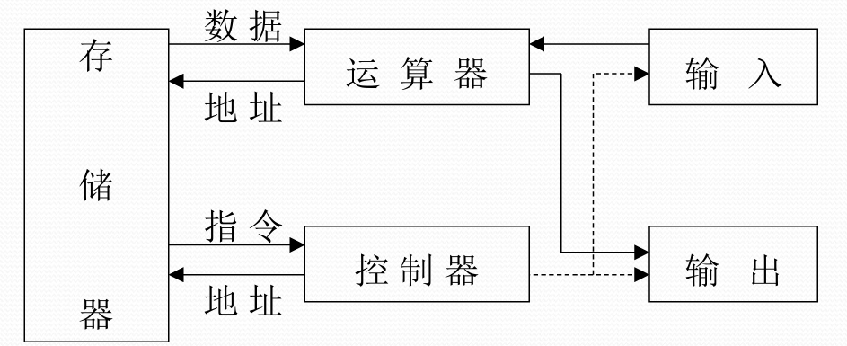
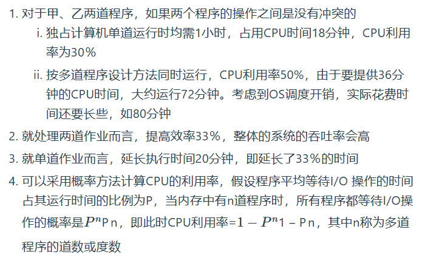

关键词：南京大学 软件学院 操作系统 期末复习 homework 作业 2024 22级

## 第一章：计算机操作系统概述

### 计算机的定义：

电子数字计算机，是一种能够自行按照已设定的程序进行数据处理的电子设备  
它是，是软件与硬件相结合、面向系统、侧重应用的自动化求解工具

### 冯·诺依曼结构

1945年6月冯·诺伊曼等发表了著名的“101页报告”，指出计算机分为**运算器、逻辑控制器、存储器、输入设备和输出设备** 五大部件，发展至今，大多数机器结构并未突破冯·诺依曼结构。

### 操作系统中最基本的抽象

  1. 进程抽象:对已进入主存正在运行的程序在处理器上操作的状态集的抽象

  2. 虚存抽象:是物理内存的抽象，进程可获得一个硕大的连续地址空间来存放可执行程序和数据，可使用虚拟地址来引用物理主存单元。

  3. 文件抽象:是对设备(磁盘)的抽象

总路线：

### 多道程序设计

**指允许多个作业(程序)同时进入计算机系统的内存并启动交替计算的方法**

  1. CPU速度与I/O速度不匹配的矛盾，非常突出

  2. 只有让多道程序同时进入内存争抢CPU运行，才可以够使得CPU和外围设备充分并行，从而提高计算机系统的使用效率

  1. **多道程序设计的特点** 

     1. CPU与外部设备充分并行

     2. 外部设备之间充分并行

     3. 发挥CPU、内存和设备的使用效率

     4. 提高单位时间的算题量(吞吐率)

  1. 进入内存执行的程序建立管理实体：**进程** 动态概念，驻留在操作系统中

  2. OS应该能管理与控制进程程序的执行

  3. OS协调管理各类资源在进程间的使用

     1. 处理器的管理和调度

     2. 主存储器的管理和调度

     3. 其他资源的管理和调度

     4. 信号量的管理和调度

**多道程序系统的实现要点**

  1. 如何使用资源：调用操作系统提供的服务例程(如何陷入操作系统)

  2. 如何复用CPU：调度程序(在CPU空闲时让其他程序运行)

  3. 如何使CPU与I/O设备充分并行：设备控制器与通道(专用的I/O处理器)

  4. 如何让正在运行的程序让出CPU：中断(中断正在执行的程序，引入OS处理)，能够恢复现场而不是从头运行

  5. 需要注意的是道数是受到物理资源的制约的

### 总线及其组成

#### 总线定义

  1. **总线** 是计算机各种功能部件之间发送信息的**公共通信干线** ，它是CPU、内存、输入输出设备传递信息的**公用通道**

  2. 计算机的各个部件通过**总线** 相连接，**外围设备** 通过相应的接口电路再与总线相连接，从而形成了计算机硬件系统。

  3. 按照所传输的信息种类，总线包括

     1. 控制线

     2. 数据线

     3. 地址线

**分类**

  1. 内部总线:用于CPU芯片内部连接各元件

  2. 系统总线:用于连接CPU、存储器和各种I/O模块等主要部件

     1. PCI总线用来连接块设备

     2. E(ISA)主要是用来处理字符型输入设备，输入速度较慢

  3. 通信总线:用于计算机系统之间通信

## 第六章：并发程序设计

https://www.freezetheflame.cc/2024/05/27/pv%e4%bf%a1%e5%8f%b7%e9%87%8f%e4%b8%8e%e7%ae%a1%e7%a8%8b%e6%93%8d%e4%bd%9c

关于PV和管程操作
