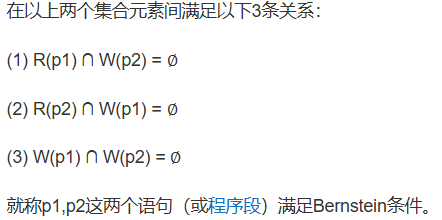
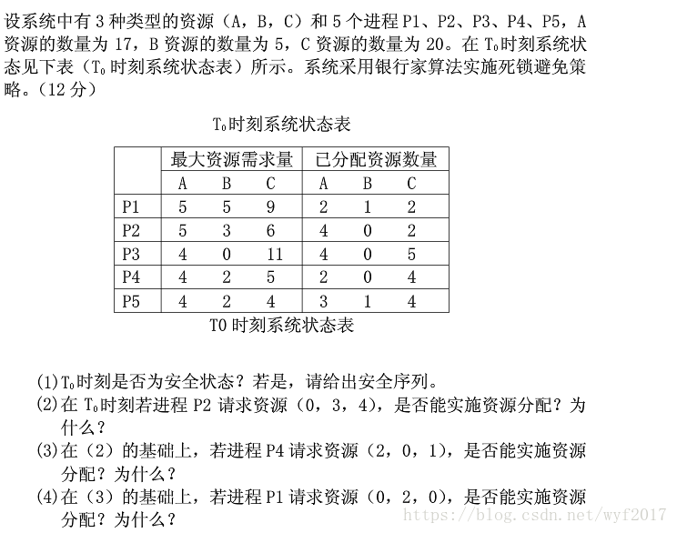
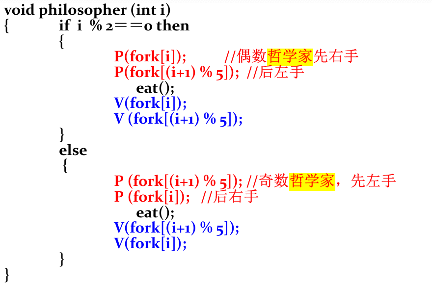

\n

首先阐释一下并发进程判断的基本原理：

\n\n\n\n

## Bernstein并发进程的制约关系条件

\n\n\n\n\n\n\n\n

同样的，还要考虑到并发进程之间的制约关系：竞争与协作

\n\n\n\n

## 并发进程之间的竞争和协作关系

\n\n\n\n

第一种是**竞争关系** ，一个进程的执行可能影响到同其竞争资源的其他进程，如果两个进程要访问同一资源，那么，一个进程通过操作系统分配得到该资源，另一个将不得不等待  
第二种是**协作关系** ，某些进程为完成同一任务需要分工协作，由于合作的每一个进程都是独立地以不可预知的速度推进，这就需要相互协作的进程在某些协调点上协调各自的工作。当合作进程中的一个到达协调点后，在尚未得到其伙伴进程发来的消息或信号之前应阻塞自己，直到其他合作进程发来协调信号或消息后方被唤醒并继续执行

\n\n\n\n

## 一、银行家算法

\n\n\n\n

**银行家算法** 是一种用来避免操作系统死锁出现的有效算法，所以在引入银行家算法的解释之前，有必要简单介绍下**死锁** 的概念。

\n\n\n\n

### 死锁：是指两个或两个以上的进程在执行过程中，由于竞争资源或者由于**彼此通信** 而造成的一种阻塞的现象，若无外力作用，它们都将无法推进下去。此时称系统处于死锁状态或系统产生了死锁，这些永远在互相等待的进程称为死锁进程。

\n\n\n\n

死锁的发生必须具备以下**四个必要条件** ：

\n\n\n\n

1）**互斥条件** ：指进程对所分配到的资源进行排它性使用，即在一段时间内某资源只由一个进程占用。如果此时还有其它进程请求资源，则请求者只能等待，直至占有资源的进程用毕释放。  
2）**请求和保持条件** ：指进程已经保持至少一个资源，但又提出了新的资源请求，而该资源已被其它进程占有，此时请求进程阻塞，但又对自己已获得的其它资源保持不放。  
3）**不抢占条件** ：指进程已获得的资源，在未使用完之前，不能被剥夺，只能在使用完时由自己释放。  
4）**循环等待条件** ：指在发生死锁时，必然存在一个进程——资源的环形链，即进程集合{P0，P1，P2，···，Pn}中的P0正在等待一个P1占用的资源；P1正在等待P2占用的资源，……，Pn正在等待已被P0占用的资源。

\n\n\n\n

所以作为解决死锁问题的著名算法之一，银行家算法的着眼点就在于确保以上四个条件之一不出现，那就不可能出现死锁，所以这更像是一种预防措施

\n\n\n\n

为实现银行家算法，系统必须设置若干数据结构，同时要解释银行家算法，必须先解释操作系统安全状态和不安全状态。

\n\n\n\n

**安全序列:** 是指一个进程序列{P1，…，Pn}是安全的，即对于每一个进程Pi(1≤i≤n），它以后尚需要的资源量不超过系统当前剩余资源量与之前所有进程Pj (j < i )当前占有资源量之和。

\n\n\n\n

**安全状态** ：如果存在一个由系统中所有进程构成的安全序列P1，…，Pn，则系统处于安全状态。安全状态一定是没有死锁发生。

\n\n\n\n

**不安全状态** ：不存在一个安全序列。不安全状态不一定导致死锁。

\n\n\n\n

银行家算法中设计了很多的数据结构，具体如下

\n\n\n\n

**数据结构** ：  
1）**可利用资源向量Available**  
是个含有m个元素的数组，其中的每一个元素代表一类可利用的资源数目。如果Available[j]=K，则表示系统中现有Rj类资源K个。  
2）**最大需求矩阵Max** （或者claim）  
这是一个n×m的矩阵，它定义了系统中n个进程中的每一个进程对m类资源的最大需求。如果Max[i,j]=K，则表示进程i需要Rj类资源的最大数目为K。  
3）**分配矩阵Allocation**  
这也是一个n×m的矩阵，它定义了系统中每一类资源当前已分配给每一进程的资源数。如果Allocation[i,j]=K，则表示进程i当前已分得Rj类资源的 数目为K。  
4）**需求矩阵Need**  
这也是一个n×m的矩阵，用以表示每一个进程尚需的各类资源数。如果Need[i,j]=K，则表示进程i还需要Rj类资源K个，方能完成其任务。

\n\n\n\n

Need[i,j]=Max[i,j]-Allocation[i,j]

\n\n\n\n

银行家算法具体阐释：

\n\n\n\n
    
    
    设Request(i)是进程Pi的请求向量，如果Request(i)[j]=k，表示进程Pi需要K个R(j)类型的资源。当Pi发现资源请求后系统将进行下列步骤\n\n(1)如果Request(i)[j] <= Need[i,j],边转向步骤2),否则认为出错，因为它所请求的资源数已超过它所宣布的最大值。\n\n(2)如果Request(i)[j] <= Available[i,j]，便转向步骤3)，否则，表示尚无足够资源，Pi需等待。\n\n(3)系统试探着把资源分配给进程Pi，并需要修改下面数据结构中的数值；\n\nAvailable[j] = Available[j] - Request(i)[j];\n\nAllocation[i,j] = Allocation[i,j] + Request(i)[j];\n\nNeed[i,j] = Need[i,j] - Request(i)[j];

\n\n\n\n

两道例题

\n\n\n\n\n\n\n\n

**从图中数据我们可以利用银行家算法的四个数据结构，来描述当前的系统状态**

\n\n\n\n| Max| Allocation| Need| Available  
---|---|---|---|---  
 | A| B| C| A| B| C| A| B| C|  A     B     C  
P1| 5| 5| 9| 2| 1| 2| 3| 4| 7|  **2     3      3**  
P2| 5| 3| 6| 4| 0| 2| 1| 3| 4|    
P3| 4| 0| 11| 4| 0| 5| 0| 0| 6|    
P4| 4| 2| 5| 2| 0| 4| 2| 2| 1|    
P5| 4| 2| 4| 3| 1| 4| 1| 1| 0|   
\n\n\n\n

****因为系统资源R=（17,5,20）而系统分配给这几个线程的资源为Allocation=(15,2,17) 则可以求出Available=（2,3,3）****

\n\n\n\n

**(1)** 在T0时刻，由于Availabel大于等于Need中 P5 所在行的向量，因此Availabel能满足 P5 的运行，在 P5 运行后，系统的状态变更为如下图所示:

\n\n\n\n | Work| Need| Allocation| Work+Allocation| finsh  
---|---|---|---|---|---  
 | A| B| C| A| B| C| A| B| C| A| B| C  
P5| 2| 3| 3| 1| 1| 0| 3| 1| 4| 5| 4| 7| true  
P4| 5| 4| 7| 2| 2| 1| 2| 0| 4| 7| 4| 11| true  
P3| 7| 4| 11| 0| 0| 6| 4| 0| 5| 11| 4| 16| true  
P2| 11| 4| 16| 1| 3| 4| 4| 0| 2| 15| 4| 18| true  
P1| 15| 4| 8| 3| 4| 7| 2| 1| 2| 17| 5| 20| true  
\n\n\n\n

**因此，在T0时刻，存在安全序列：P5，P4，P3，P2，P1（并不唯一）**

\n\n\n\n

(2)P2请求资源，P2发出请求向量Request(i)(0,3,4),系统根据银行家算法进行检查;

\n\n\n\n

 ① P2 申请资源Reuqest(i)（0,3,4）<=Need中 P2 所在行向量Need(i)（1,3,4）

\n\n\n\n

 ② P2 申请资源Reuqest(i)（0,3,4）>=可以利用资源向量Availabel（2,3,3），所以，该申请不给于分配

\n\n\n\n

(3)P4请求资源，P4发出请求向量Request(i)(2,0,1),系统根据银行家算法进行检查;

\n\n\n\n

 ①Reuqest(i)（2,0,1）<= Need(i)（2,2,1）

\n\n\n\n

 ② Reuqest(i)（2,0,1 <= Availabel（2,3,3）

\n\n\n\n

 ③对 P4 的申请（2,0,1）进行预分配后，系统的状态为：

\n\n\n\n | Max| Allocation| Need| Available  
---|---|---|---|---  
 | A| B| C| A| B| C| A| B| C| A    B   C  
P1| 5| 5| 9| 2| 1| 2| 3| 4| 7|  0   3    2  
P2| 5| 3| 6| 4| 0| 2| 1| 3| 4|    
P3| 4| 0| 11| 4| 0| 5| 0| 0| 6|    
P4| 4| 2| 5| 4| 0| 5| 0| 2| 0|    
P5| 4| 2| 4| 3| 1| 4| 1| 1| 0|   
\n\n\n\n

可利用资源向量Availabel=（0,3,2），大于Need中 P4 所在行的向量（0,2,0），因此可以满足 P4 的运行。P4 运行结束后，系统的状态变为：

\n\n\n\n | Work| Need| Allocation| Work+Allocation| finsh  
---|---|---|---|---|---  
 | A| B| C| A| B| C| A| B| C| A| B| C  
P4| 0| 3| 2| 0| 2| 0| 4| 0| 5| 4| 3| 7| true  
P5| 4| 3| 7| 1| 1| 0| 3| 1| 4| 7| 4| 11| true  
P3| 7| 4| 11| 0| 0| 6| 4| 0| 5| 11| 4| 16| true  
P2| 11| 4| 16| 1| 3| 4| 4| 0| 2| 15| 4| 18| true  
P1| 15| 4| 18| 3| 4| 7| 2| 1| 2| 17| 5| 20| true  
\n\n\n\n

 同理依次推导，可计算出存在安全序列P4，P5，P3，P2，P1(并不唯一）

\n\n\n\n

(4)P1请求资源，P1发出请求向量Request(i)(0,2,0),系统根据银行家算法进行检查;

\n\n\n\n

 ①Request(i)(0,2,0)<= Need(i)（3,4,7）

\n\n\n\n

 ② Request(i)(0,2,0)<= Availabel（2,3,3）

\n\n\n\n

 ③对 P1 的申请（0,2,0）进行预分配后，系统的状态为：

\n\n\n\n | Max| Allocation| Need| Available  
---|---|---|---|---  
 | A| B| C| A| B| C| A| B| C| A  B  C  
P1| 5| 5| 9| 2| 3| 2| 3| 2| 7| 0  1  2    
P2| 5| 3| 6| 4| 0| 2| 1| 3| 4|    
P3| 4| 0| 11| 4| 0| 5| 0| 0| 6|    
P4| 4| 2| 5| 2| 0| 4| 2| 2| 1|    
P5| 4| 2| 4| 3| 1| 4| 1| 1| 0|   
\n\n\n\n

由于Availabel不大于等于 P1 到 P5 任一进程在Need中的需求向量，因此系统进行预分配后

\n\n\n\n

处于不安全状态，所以对于 P1 申请资源（0,2,0）不给予分配。

\n\n\n\n

注意:因为(4)是建立在第(3)问的基础上的所以Available=（0,3,2）-（0,2,0）=（0,1,2）

\n\n\n\n

\n\n\n\n

## 二、生产者消费者问题

\n\n\n\n

生产者消费者（producer—customer）问题是一个非常著名的进程同步问题。它描述的是：生产者进程在生产“产品”，消费者进程则消费这些“产品”，在生产者进程和消费者进程之间存在一个**缓冲池** （生产者将生产的产品放入该缓冲池，消费者则消费该缓冲池中的产品）。所有生产者进程、消费者进程都是相互独立的（即**以异步的方式运行** ），但他们之间同时必须**保持同步** （即不允许消费者进程到空缓冲区取产品，也不允许生产者进程向满缓冲区存入产品）

\n\n\n\n

我们使用**队列（先进先出表）Queue** 来表示上述具有n个缓冲区的缓冲池。每投入（取出）一个产品，缓存池中就相应的插入（删除）一个节点。由于该缓冲池是被组织成[队列](<https://so.csdn.net/so/search?q=%E9%98%9F%E5%88%97&spm=1001.2101.3001.7020>)的形式，因此，队空队满的判断条件分别如下：

\n\n\n\n
    
    
    q->front == q->rear;    //队空\nq->front == (q->rear+1)%SIZE;    //队满

\n\n\n\n

此外，我们引入一个整型变量num，置其初值为0，当生产者（消费者）进程向缓冲池投入（取走）一个产品时，num对应的加一（减一）。

\n\n\n\n

所以最后大概构建出如下的解决思路：

\n\n\n\n
    
    
    void producer()\n{\n    sem_wait();\n    lockf();\n    QueueFull();\n    Enqueue();\n    unlockf();\n    sem_post();\n}\nvoid customer()\n{\n    sem_wait();\n    lockf();\n    QueueEmpty();\n    Dequeue();\n    unlockf();\n    sem_post();\n}

\n\n\n\n

但是，仔细思考就会发现，仅仅只是这样是远远不够的。我们还必须保证**队满不入、队空不取。** 因此，在上述结构的基础上，我们加入条件判断机制。

\n\n\n\n
    
    
    #include <stdio.h>\n#include <pthread.h>\n#include <semaphore.h>\n#include <string.h>\n#include <time.h>\n#include <stdlib.h>\n#include <unistd.h>\n \n#define TRUE  1\n#define FALSE 0\n#define SIZE 11\n \ntypedef int QueueData;\t//定义一个整型变量QueueData，与为基本数据类型定义新的别名方法一样 \n \ntypedef struct _queue   //队列结构体\n{\n\tint data[SIZE];\n\tint front;     // 指向队头的下标\n\tint rear;      // 指向队尾的下标\n}Queue;\n \nstruct data             //信号量结构体\n{\n\tsem_t count;\n\tQueue q;\n};\n \nstruct data sem;\npthread_mutex_t mutex;\t//互斥变量使用特定的数据类型 \nint num = 0; \n \nint InitQueue (Queue *q)   // 队列初始化\n{\n\tif (q == NULL)\n\t{\n\t\treturn FALSE;\n\t}\n\tq->front = 0;\n\tq->rear  = 0;\n\treturn TRUE;\n}\n \nint QueueEmpty (Queue *q)      //判断空队情况\n{\n\tif (q == NULL)\n\t{\n\t\treturn FALSE;\n\t}\n\treturn q->front == q->rear;\n}\n \nint QueueFull (Queue *q)     //判断队满的情况\n{\n\tif (q == NULL)\n\t{\n\t\treturn FALSE;\n\t}\n\treturn q->front == (q->rear+1)%SIZE;\n} \n \nint DeQueue (Queue *q, int x)   //出队函数\n{\n\tif (q == NULL)\n\t{\n\t\treturn FALSE;\n\t}\n\tif (QueueEmpty(q))\n\t{\n\t\treturn FALSE;\n\t}\n\tq->front = (q->front + 1) % SIZE;\n\tx = q->data[q->front];\n\treturn TRUE;\n}\n \nint EnQueue (Queue *q, int x)   //进队函数\n{\n\tif (q == NULL)\n\t{\n\t\treturn FALSE;\n\t}\t\n\tif (QueueFull(q))\n\t{\n\t\treturn FALSE;\n\t}\t\n\tq->rear = (q->rear+1) % SIZE;\n\tq->data[q->rear] = x;\n\treturn TRUE;\n}\n \nvoid *Producer()\n{\n\tint i=0;\n\twhile(i<10)\n\t{\n\t\ti++;\n\t\tint time = rand() % 10 + 1;          //随机使程序睡眠0点几秒           \n\t\tusleep(time * 100000);\n\t\t                                      \n\t\tsem_wait(&sem.count);                 //信号量的P操作（使信号量的值减一） \n\t\tpthread_mutex_lock(&mutex);           //互斥锁上锁\n\t\tif(!QueueFull(&sem.q))\t\t\t\t\t//若队未满 \n\t\t{\n\t\t\tnum++;                                \n\t\t\tEnQueue (&sem.q, num);              //消息进队\n\t\t\tprintf("生产了一条消息,count=%d\\n", num); \n\t\t}                                      \n\t\telse\tprintf("Full\\n");                                       \n\t\tpthread_mutex_unlock(&mutex);         //互斥锁解锁\n\t\tsem_post(&sem.count);                  //信号量的V操作（使信号量的值加一） \n\t}\n\tprintf("i(producer)=%d\\n",i);\n}\n \nvoid *Customer()\n{\n\tint i=0;\n\twhile(i<10)\n\t{\n\t\ti++;\n\t\tint time = rand() % 10 + 1;   //随机使程序睡眠0点几秒\n\t\tusleep(time * 100000);\n\t\t\n\t\tsem_wait(&sem.count);           //信号量的P操作\n\t\tpthread_mutex_lock(&mutex);    //互斥锁上锁\n\t\t\n\t\tif(!QueueEmpty(&sem.q))\t\t\t//若队未空 \n\t\t{\n\t\t\tnum--;\n\t\t\tDeQueue (&sem.q, num);       //消息出队\n\t\t\tprintf("消费了一条消息,count=%d\\n",num);\n\t\t}\n\t\telse\tprintf("Empty\\n");\n\t\tpthread_mutex_unlock(&mutex);  //互斥锁解锁\n\t\tsem_post(&sem.count);         //信号量的V操作\n\t}\n\tprintf("i(customer)=%d\\n",i);\n}\n \nint main()\n{\n\tsrand((unsigned int)time(NULL));\n\t\n\t//信号量地址，信号量在线程间共享，信号量的初始值 \n\tsem_init(&sem.count, 0, 10);    //信号量初始化（做多容纳10条消息，容纳了10条生产者将不会生产消息）\n\t\n\tpthread_mutex_init(&mutex, NULL);  //互斥锁初始化\n\t\n\tInitQueue(&(sem.q));   //队列初始化\n\t\n\tpthread_t producid;\n\tpthread_t consumid;\n\t\n\tpthread_create(&producid, NULL, Producer, NULL);   //创建生产者线程\n\tpthread_create(&consumid, NULL, Customer, NULL);   //创建消费者线程\n\t\n\tpthread_join(consumid, NULL);    //线程等待，如果没有这一步，主程序会直接结束，导致线程也直接退出。\n\t\n\tsem_destroy(&sem.count);         //信号量的销毁 \n\t\n\tpthread_mutex_destroy(&mutex);   //互斥锁的销毁\n\t\n\treturn 0;\n}

\n\n\n\n

## 三、哲学家进餐问题

\n\n\n\n

该问题描述的是五个哲学家共用一张圆桌，分别坐在周围的五张椅子上，在圆桌上有五个碗和五只筷子，他们的生活方式是交替的进行思考和进餐。平时，一个哲学家进行思考，饥饿时便试图取用其左右最靠近他的筷子，只有在他拿到两只筷子时才能进餐。进餐完毕，放下筷子继续思考。

\n\n\n\n

在哲学家问题中常常会遇到死锁的问题，所以这道题的核心点在于把筷子作为临界资源处理

\n\n\n\n

经过分析可知，放在桌子上的5根筷子属于**临界资源，** 在一段时间内只允许一位哲学家使用。为了实现对筷子的互斥使用，可以用一个信号量来表示一根筷子，由这5个信号量组成一个信号量数组。其描述如下：

\n\n\n\n

semaphore chopstick[5]={1,1,1,1,1);

\n\n\n\n

所有的信号量初始化为1，第 i 位哲学家的行为可描述如下：

\n\n\n\n
    
    
    while(1)\n{\n    think();\n    hungry();\n    wait(chopstick[i]);\n    wait(chopstick[(i+1)%5]);\n    eat();\n    signal(chopstick[i]);\n    signal(chopstick[(i+1)%5]);\n}

\n\n\n\n

这样的分开取筷子的方式就可能导致死锁

\n\n\n\n

几种可能的方式：

\n\n\n\n

(1) 至多允许四个哲学家同时取叉子 (C. A. R. Hoare方案)  
(2) 奇数号先取左手边的叉子，偶数号先取右手边的叉子  
(3) 每个哲学家取到手边的两把叉子才吃，否则一把叉子也不取

\n\n\n\n
    
    
     semaphore fork[5];\n for (int i=0;i<5;i++)\n     fork[i]= 1;\n semaphore room=4;   //该解法突破了进入临界区的进程容量为1的限制\n//增加一个侍者，设想有两个房间1号房间是会议室，2号房间是餐厅\ncobegin\n   process philosopher_i( ){/*i=0,1,2,3, 4 */\n      while(true) {\n      think( );\n      P(room);  //控制最多允许4位哲学家进入2号房间餐厅取叉子\n      P(fork[i]);\n      P(fork[(i+1)%5]); \n      eat( );\n      V(fork[i]);\n      V(fork[(i+1)%5]);\n      V(room);\n   }\n }\n coend

\n\n\n\n\n\n\n\n

仅当哲学家左右两只筷子同时可用时，才允许他拿起筷子。即：要求每个哲学家先获得两个临界资源后方能进餐；这在本质上就是AND信号量机制。

\n\n\n\n
    
    
    while (1) {think();hungry();Swait(chopsticks[i],chopsticks[(i+1)%5]);eat();Signal(chopsticks[i],chopsticks[(i+1)%5]);   }

\n\n\n\n

AND信号量的实质就是锁住全部的临界资源，当一个哲学家企图拿筷子的时候，就将所有的资源锁住，然后让他去拿他需要的筷子，等他取到他需要的筷子之后，就解锁，然后让其他哲学家取筷子。由于C语言库中并没有Swait的相关函数，因此，我们利用全局互斥变量来完成这一目的。

\n\n\n\n

## 四、读者写者问题

\n\n\n\n

一个数据问价或记录可以被多个进程共享，我们把**只读该文件的进程称为“读者进程”，其他进程为“写者进程”** 。允许多个进程同时读一个共享对象，但不允许一个写者进程和其他写者进程或读者进程同时访问共享对象。即：保证一个写者进程必须与其他进程互斥的访问共享对象的同步问题；读者-写者问题常用来测试新同步原语

\n\n\n\n

思路：**读者和写者是互斥的，写者和写者是互斥的，读者和读者不互斥** ；两类进程，一种是写者，另一种是读者。写者很好实现，因为它和其他任何进程都是互斥的，因此**对每一个写者进程都给一个互斥信号量的P、V操作即可** ；而读者进程的问题就较为复杂，它与写者进程是互斥的，而又与其他的读者进程是同步的，因此不能简单的利用P、V操作解决。

\n\n\n\n

### （一）**读者优先算法**

\n\n\n\n

\n