## 选择题部分

### 第一、二章软件工程概论

1.软件开发活动中，软件解决方案是哪个活动的结果？ A : 需求开发 B : 软件设计 C : 软件构造 D : 软件测试

1

A 软件开发活动和产物（P67，P68）

软件开发活动中，软件设计的目的是什么？ A : 要做什么 B : 怎么做 C : 进行构建 D : 检测构建结果

1

B软件设计阶段是确定软件系统的架构、组件、接口和其他特性的过程。它是为了解决“怎么做”的问题，即确定如何实现软件的功能和性能需求。

### 第三、四章：项目启动

### 第五章：软件需求基础

1.以下哪项不在IEEE规定的需求分类中？ A : 功能需求 B : 项目需求 C : 约束 D : 对外接口

1

B IEEE定义的需求对应的应该是软件需求

2.说明下列需求属于下面的哪种类型：  
系统应该存储3年的交易数据 A : 环境约束 B : 性能需求 C : 质量需求 D : 对外接口 E : 功能需求

1

B性能是指资源利用效率的需求，题干是对存储资源利用的要求

3.以下需求内容和需求分类对应正确的是？   
A : 系统应该能够存储至少10万条用户数据 -> 功能需求   
B : 管理员只能查看用户信息而不能修改 -> 约束   
C : 系统应支持使用第三方凭证如Google, Github登录 -> 功能需求   
D : 《工业和信息化部关于开展移动互联网应用程序备案工作的通知》-> 质量属性

1

C（A, 性能 / B, 质量 / D, 约束）

4.说明下列需求属于那种类型：

该软件管理工具软件必须帮助项目管理者进行开发管理工作，以通过CMMI-4的评估 A : 业务需求 B : 用户需求 C : 系统需求 D : 约束

1

B这个软件本身是软件管理的支撑软件，这个是这个软件的功能。

5.说明下列需求分别属于下面的哪种类型：  
产品在发布1年之后，必须在出版的A、B、C三个产品评论刊物中被评为最可靠的产品 A : 业务需求 B : 用户需求 C : 系统级(功能)需求 D : 约束

1

A

6.说明需求属于下面的哪种类型：（ ） 商品标识的类型要能够在0.5个人月内更改为长整型 A : 功能需求 B : 质量需求 C : 数据需求 D : 性能需求 E : 对外接口 F : 约束

1

B可修改性是质量需求的一种

7.说明需求属于下面的哪种类型：（ ） 默认的信用卡类型是“银联” A : 性能需求 B : 对外接口 C : 功能需求 D : 质量需求 E : 数据需求 F : 约束

1

E数据默认值的设定属于数据需求

8.为了完成高层目标而需要达成的需求是什么需求？ A : 系统级需求 B : 业务需求 C : 用户需求 D : 目标需求

1

B业务需求来⾃现实：系统建⽴的战略出发点，表现为⾼层次的⽬标

9.下面信息内容是哪一种？（ ） 超市的成本主要由人力成本和库存成本组成 A : 问题 B : 问题域信息 C : 软件规格 D : 需求

1

B问题域是指问题所存在的上下文或环境，包括所有相关的因素、条件和约束。它是问题本身及其影响范围的描述。

10.“软件产品必须能够在3秒内对用户请求作出响应”属于软件需求中的（      ）。 A : 逻辑需求 B : 非功能需求 C : 功能需求 D : 设计约束

1

B因为准确来讲这是一个性能需求

### 第七章：需求文档化以及验证（规格以及测试）

软件规格说明书（Software Requirements Specification, SRS）侧重于： A : 交互流程 B : 独立需求 C : 软件系统处理细节 D : 用户界面设计

1

C此细节非彼细节

在度量需求时，以下哪项不是度量的需求指标？ A : 用例的数量 B : 平均每个用例中的场景数量 C : 软件需求的数量 D : 程序员的满意度

1

D重点在于记住这些正确选项

### 第八章：软件设计基础

1.软件设计中的“形式化方法”主要用于什么？ A : 提高软件的执行效率 B : 验证软件设计的正确性 C : 增加软件的可读性 D : 减少软件的开发成本

1

B文档中提到形式化方法设计是软件设计方法之一，它通过使用数学和逻辑来验证软件设计的正确性。

2.软件设计中的“信息隐藏”技术主要用于： A : 增强软件的安全性 B : 减少模块间的依赖 C : 提升软件的运行速度 D : 增加软件的复杂性

1

B文档中提到信息隐藏是中层设计的一个目标，它有助于实现模块间的尽可能独立，从而减少依赖。

3.软件设计的核心思想包括以下哪项？ A : 程序的运行效率 B : 分解与抽象 C : 软件的市场需求 D : 用户的操作习惯

1

B文档中提到软件设计的核心思想是分解与抽象，这有助于控制软件的复杂性

4.软件设计中描述结构化设计模型的动态模型，不包括哪一个？ A : 状态图 B : 流程图 C : 结构图 D : 数据流图

1

A状态图是面向对象设计的动态模型之一。

5.软件设计的分层通常包括哪些层次？ A : 硬件层、操作系统层、应用层 B : 低层设计、中层设计、高层设计 C : 数据层、逻辑层、表示层 D : 需求分析层、设计层、实现层

1

B软件设计的分层低层设计、中层设计和高层设计。

### 第九、十章：软件体系结构基础及设计与构建

1.在ADL中，下面的声明哪个属于实例类型 A :

component Split = 

port in [in protocol]

port toUpper [toUpper protocol]

port toLower[toLower protocol]

 spee [Split specification] B :

connector pipe-connector=

role producer [producer protocol]

role consumer [consumer protocol]

glue [glue protocol] C : s:Split D : s.toUpper as pipe1.producer

1

C

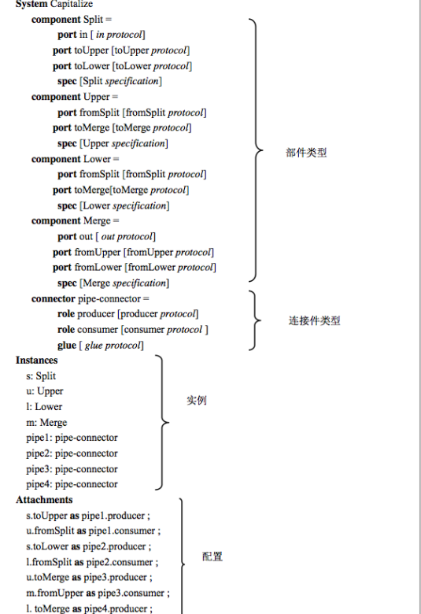

2.分层风格不适用于哪种类型的系统 A : 主要功能是能够在不同抽象层次上进行任务分解的复杂处理 B : 能够建立不同抽象层次之间的稳定交互协议 C : 有很高的实时性能要求，不能够容忍稍许的延迟 D : 需要进行并行开发的软件系统

1

C分层风格（P63-P67）

4.持续集成

1
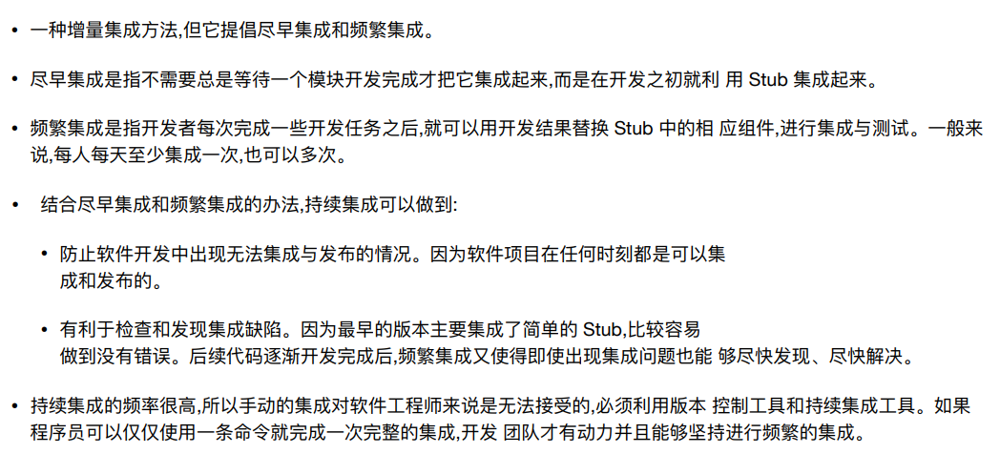

### 第十一章：人机交互

1.对于人机交互设计的过程，正确的排序是： A : 需求开发，软件设计（导航设计、界面设计、界面原型化、界面评估与修正），构造、测试与维护 B : 软件设计（导航设计、界面设计、界面原型化、界面评估与修正），需求开发，构造、测试与维护 C : 需求开发，软件设计（界面设计、界面原型化、导航设计、界面评估与修正），构造、测试与维护 D : 需求开发，构造、测试与维护，软件设计（导航设计、界面设计、界面原型化、界面评估与修正）

1

A人机交互设计的过程（P65）

2.根据反馈的经验，以下哪个关于用户响应时间的陈述是正确的？ A : 用户对响应时间没有偏好，因此系统可以忽略它 B : 响应时间超过15秒对用户来说是理想的，因为它允许用户更深入地思考 C : 用户会根据响应时间的变化调整自己的工作方式，且适当的响应时间可以提高效率，但也可能增加出错率 D : 对于所有任务类型，响应时间都应保持在50～150毫秒，以确保最佳用户体验

1

C反馈（P57）

### 第十二章：详细设计（代码层面）

1.面向对象设计中设计模型建立过程包括： 1. 抽象类的职责 2. 抽象类之间的关系 3. 抽象对象之间的协作 4. 添加辅助类 5. 明确对象的创建 6. 选择合适的控制风格 A : 234 B : 1234 C : 123456 D : 456

1

C参考PPT《详细设计》P29

2.控制器模式中主要决策通过对象网络分布，由少数控制器进行主要决策的控制风格是哪一种？ A : 发布式模式 B : 分散式模式 C : 集中式模式 D : 委托式模式

1

D注意这里是“少量”控制“主要”，所以这么推断 参考PPT《详细设计》P78

3.在面向对象设计中，辅助类通常不包括以下哪一项？ A : 接口类 B : 显示类 C : 控制器类 D : 数据类

1

B辅助类主要包括接口类、数据类（记录）、启动类，控制器类、实现数据类型的类、容器类

### 第十三章：详细设计的模块化和隐藏

### 第十四章：详细设计中基于OOP的模块化

### 第十五章：详细设计中基于OOP的隐藏

1.继承耦合性最高的继承类型是： A : 修改（modification）- 规格 B : 精化（refinement）- 规格 C : 扩展（extension） D : 无（nil）

1

A考点：继承耦合（P25）

### 第十六章：设计模式

### 第十七十八章：软件构造和代码设计

### 第十九章：软件测试

### 第二十、二十一章：软件交付、维护与演化

### 第二十二、二十三章：软件过程模型和职业基础

## 简答题部分

### 第一、二章：软件工程概论

**1.【重要】软件工程（名词解释）**

一共2点

(1)应⽤系统的、规范的、可量化的⽅法，来开发、运⾏和维护软件，即将⼯程应⽤到软件。  
(2)对(1)中各种⽅法的研究。

2.【重要】从1950s—2000s之间的特点（简答）

简答题目简单概述即可

1950s：科学计算；以机器为中⼼进⾏编程；像⽣产硬件⼀样⽣产软件。  
1960s：业务应⽤（批量数据处理和事物计算）；软件不同于硬件；⽤软件⼯艺的⽅式⽣产软件。  
1970s：结构化⽅法；瀑布模型；强调规则和纪律。它们奠定了软件⼯程的基础，是后续年代软件⼯程发展  
的⽀撑。  
1980s：追求⽣产⼒最⼤化；现代结构化⽅法/⾯向对象编程⼴泛应⽤；重视过程的作⽤。  
1990s：企业为中⼼的⼤规模软件系统开发；追求快速开发、可变更性和⽤户价值；web应⽤出现  
2000s：⼤规模web应⽤；⼤量⾯向⼤众的web产品；追求快速开发、可变更性、⽤户价值和创新。

### 第三、四章：项目启动

1有哪些团队结构

三个

  1. 主程序员团队

  2. 民主团队

  3. 开放团队

2.如何管理团队？

四个办法

建立团队章程、持续沟通、和谐沟通、避免团队杀手

3.质量保障有哪些措施？结合实验进⾏说明

5个角度分别去讲

**（1）需求开发** 需求评审和需求度量  
**（2）体系结构** 体系结构评审和集成测试（持续集成）  
**（3）详细设计** 详细设计评审、设计度量和集成测试（持续集成）  
**（4）构造阶段** 代码评审、代码度量和测试（测试驱动和持续集成）  
**（5）测试阶段** 测试、测试度量  
要及时的根据保障计划进⾏质量验证，质量验证的⽅法主要有评审、测试和质量度量三种

4.配置管理有哪些活动？实验中是如何进⾏配置管理的

5点

**（1）标识配置项版本管理（2）变更控制（3）配置审计（4）状态报告（5）软件发布管理**

### 第五章：软件需求基础

1.**需求是什么？（定义）**

三点

(1)⽤户为了解决问题或达到某些⽬标所需要的条件或能⼒；  
(2)系统或系统部件为了满⾜合同、标准、规范或其他正式⽂档所规定的要求⽽需要具备的条件或能⼒；  
(3)对(1)或(2)中的⼀个条件或⼀种能⼒的⼀种⽂档化表述。

2.**需求的三个层次区分**

三方面描述，详见实例题目

【业务需求】——来⾃现实：系统建⽴的战略出发点，表现为⾼层次的⽬标（Objective），它描述了组织  
为什么要开发系统 ，为了满⾜⽤户的业务需求，需求⼯程师需要描述系统⾼层次的解决⽅案，定义系统应  
该具备的特性（Feature）  
【⽤户需求】——来⾃现实：执⾏实际⼯作的⽤户对系统所能完成的具体任务的期望，描述了系统能够帮助⽤户做些什么。对所有的⽤户需求，都应该有充分的问题域知识作为背景⽀持特性：模糊、不清晰 ；多特性混杂 ；多逻辑混杂  
【系统级需求】——来⾃软件：⽤户对系统⾏为的期望，每个系统级需求反映了⼀次外界与系统的交互⾏  
为，或者系统的⼀个实现细节。描述了开发⼈员需要实现什么

3。**需求的类型区分**

1

1.功能需求：软件系统需求中最常见主要重要的。在不考虑物理约束的情况下，用户希望系统能执行的活动。 注意UR（用户需求）和SR（系统需求）都可以是功能需求。  
2.性能需求：定义了系统必须多好多块的完成专门的功能。如   
速度：所有用户查询都必须在10秒内完成   
容量：系统所能存储的数据量至少10万个   
（可以限定性能目标的同时给出一定的灵活性）  
PR7：（最低标准）在200用户并发时，系统不能崩溃 （一般标准）在200用户并发时，系统应该在80%内正常工作 （理想标准）在200用户并发时，系统应该能保持正常的工作状态 实时性：检测到病人的异常后，监控器必须在0.5秒内发出警告  
3.质量需求（显式+隐式） 可靠性：  
QA1：在客户端和服务器端通信时，如果网络故障，系统不能出现故障。   
可用性：QA2：系统的可用性要达到98%   
安全性：QA3：收银员只能查看不能修改、删除会员信息   
可维护性：QA4：如果系统要增加新的特价类型，要能够在2个人月内完成   
可移植性：QA5：服务器要能够在一个人月内从windows7操作系统更换到××系统  
4）对外接口：用户界面，硬件接口，软件接口，网络通信接口   
5）约束：进行系统构造是需要遵守的约定，例如编程语言、硬件设备等   
6）数据需求:需要在数据库、文件或者其他介质中存储的数据描述 每个功能使用的数据信息，使用频率，可访问性要求，数据实体及其关系，完整性约束，数据保持要求。 DR1：系统需要存储的数据实体及其关系为图。。所示的内容 DR2：系统需要存储1年的销售记录和退货记录  

  1. 项目需求(人的数量、计划成本、时间)

     * R5：项⽬的成本要控制在60万元人民币以下。

     * R6：项⽬要在6个月内完成。

  2. 过程需求(人的分工、合作、方法、工具)

     * R7：在开发中，开发者要提交软件需求规格说明文档、设计描述文档和测试报告。

     * R8：项目要使用持续集成⽅法进行开发。

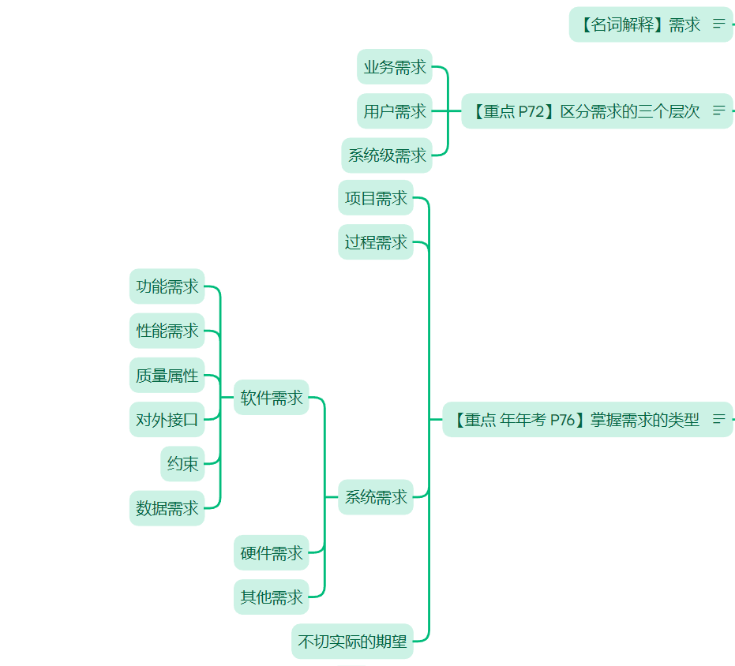

### 第六章：需求分析方法（各种画图，铁铁）

1.用例图的建立要点

主要是用例图的各个要素以及包含的重点

【重要】建⽴⽤例图  
•参与者是与开发的系统进⾏交互的⽤户或其他系统等⾓⾊  
•⽤例图中⼀个单⼀的参与者可以代表多个⽤户（或系统）  
•⼀个单⼀的⽤户（或系统）可能扮演多种⾓⾊  
•参与者不⼀定是⼈，例如，需要从当前系统获取信息的外部系统也是参与者  
步骤：1）⽬标分析与解决⽅向确定 2）寻找参与者 3）寻找⽤例 4）细化⽤例

四要素：用例、参与者、关系、系统边界

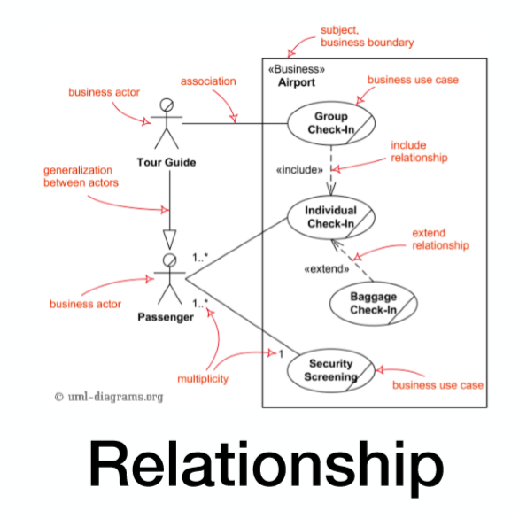

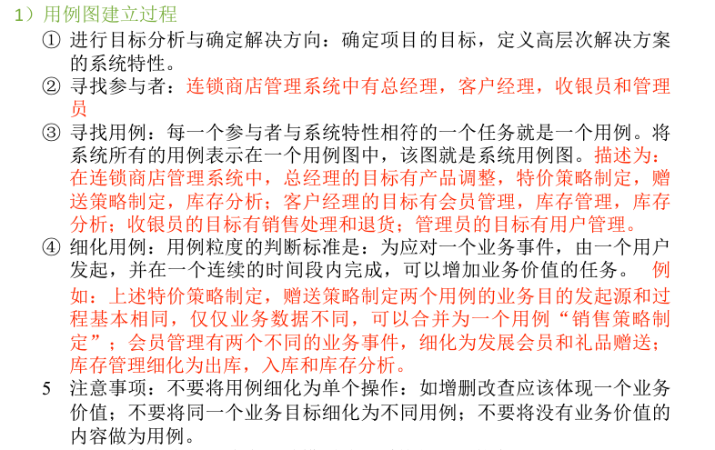

2.建⽴分析类图（概念类图／领域模型）要点

分析类图的基本元素和绘制时的注意点

四种箭头

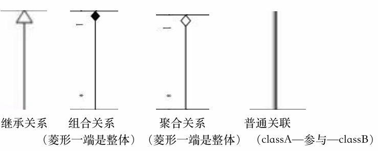

分析类图：（UML类图）  
基本元素：对象、类、链接、关联（聚合）和继承。  
类（对象）之间的直线代表关联（链接）。  
在“整体”的关联端用空心菱形代表聚合，用实心菱形代表组合，三角形空心箭头代表继承。  
建立概念类图：1）对每个用例文本描述识别候选类 2）将局部概念类图合并建立系统概念类图。  
建立局部概念类图：  
1）识别候选类（划出名词和名词短语）  
2）确定概念类（准则：依据系统需求，该类的对象实例的状态和行为是否全部必要）  
3）识别关联（发现协作，分析关系）  
4）识别重要属性（添加协作时的必要信息）

（继承：带三角箭头的实线，箭头指向父类 组合：是整体与部分的关系，但部分不能离开整体而单独存在 聚合：是整体与部分的关系，但部分能离开整体而单独存在）

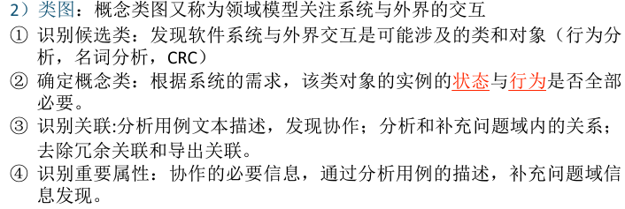

3.系统顺序图

使用什么线条标识不同信息、特定的框图表示含义
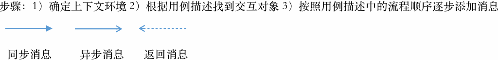

（1）异步消息的箭头⽆论是从⽤户到系统还是从系统到⽤户都是⼀样的  
（2）opt标签表⽰可选；loop标签表⽰循环，要在旁边⽤［］内写循环条件；alt标签表⽰候选（基本上只  
会放⼀次返回消息），每⼀种可选分⽀之间要⽤虚线分割，⽽且在表⽰执⾏态的圆柱上⾯要写监护条件，  
放在［］⾥⾯。

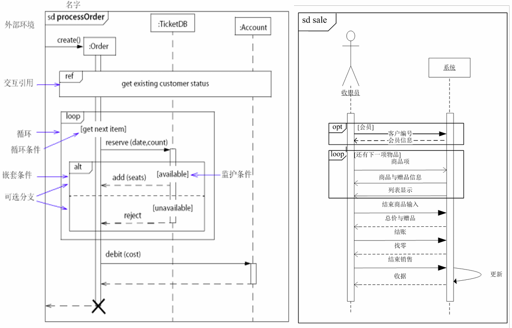

重点展示系统级事件，：1）确定上下文环境 2）根据用例描述找到交互对象 3）按照流程顺序逐步添加信息

4.状态图

绘制要点
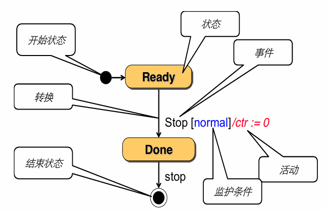

  * 状态: ⼀组观察到的情况，在⼀个给定的时间描述系统⾏为

  * 状态转换: 从⼀个状态到另⼀个状态的转移

  * 事件: 导致系统表现出可预测⾏为的事件

  * 活动: 作为产⽣转换的结果⽽发⽣的过程  
步骤：1）确定上下⽂环境 2）识别状态 3）建⽴状态转换 4）补充详细信息，完善状态图  
注意：并不是所有的状态图都有开始态和结束态，开始态通常只有⼀个，结束态可以有多个

### 第七章：需求文档化以及验证（规格以及测试）

1.为什么建⽴需求规格说明？结合试验说明

1

（1）软件开发过程中，⼦任务与⼈员之间存在错综复杂的关系，存在⼤量的沟通和交流，所以要编写软  
件开发中要编写不同类型的⽂档，每种⽂档都是针对项⽬中需要⼴泛交流的内容。因为软件需求需要进⾏  
⼴泛交流，所以要把需求⽂档化。  
（2）需求规格说明是在软件产品的⾓度以系统级需求列表的⽅式描述软件系统解决⽅案  
⽤例侧重于交互流程，规格（解决⽅案）侧重于独⽴需求  
⽤例以⼀次交互为基础，规格需求以⼀次交互中的软件系统处理细节为基础

2.对给定的需求规格说明⽰例，判定并修正其错误。

⾸先了解需求⽂档化要点：

1）技术⽂档写作要点（简洁，精确，易读，易修改）；  
2）需求书写要点（使⽤⽤户术语，可验证，可⾏性）；  
3）需求规格说明⽂档书写要点（充分利⽤标准的⽂档模板，保持所以内容位置得当；保持⽂档内的需求  
集具有完备性和⼀致性；为需求划分优先级）

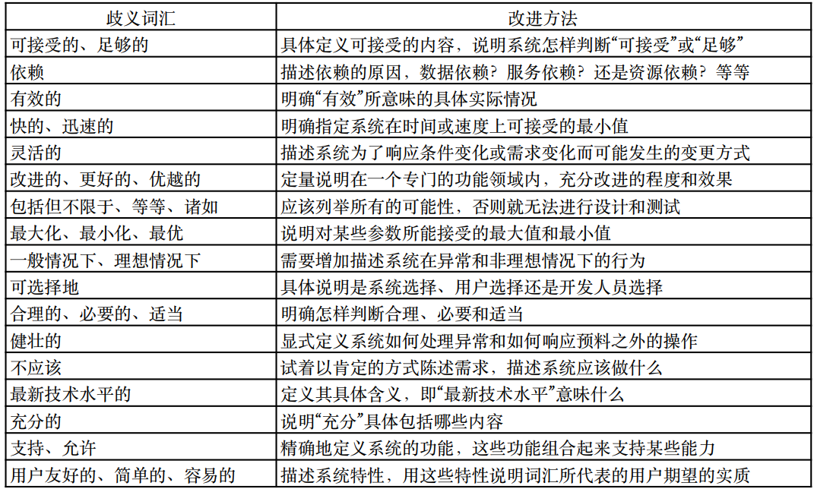

付款过程完成后，相关信息应被添加到日志⽂件  
该系统应被构造成将来很容易添加新功能  
计算购买的汽油的价格：该类汽油每加仑的价格乘以购买的加仑数（使用两位小数点表示加仑小数部分）  
该系统⼀周7天，⼀天24小时都可用

### 第八章：软件设计基础

1.软件设计（名词解释）

1

a)为使⼀软件系统满⾜规定的需求⽽定义系统或部件的体系结构、部件、接口和其他特征的过程；  
b)设计过程的结果。

2.软件设计的核心思想

分解、抽象、层次性
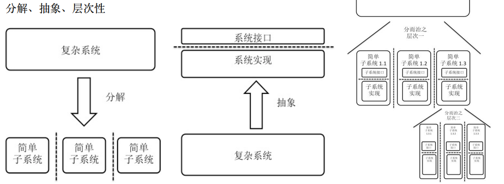

3.软件⼯程设计的三个层次，各层的主要思想

1
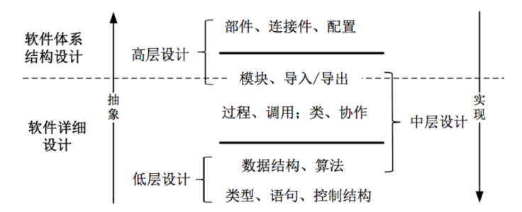

### 第九、十章：软件体系结构基础及设计与构建

1.体系结构的风格的优缺点（常见风格模式列举）、

①主程序、子程序风格

部件：程序、函数、模块  
连接件：它们之间的调⽤  
控制从⼦程序层次结构顶部开始且向下移动  
层次化分解：基于定义使⽤关系  
单线程控制  
隐含⼦系统结构：⼦程序通常合并成模块  
层次化推理：⼦程序的正确性依赖于它调⽤的⼦程序的正确性

**优点：**  
流程清晰，易于理解；强控制性。  
**缺点：**  
a.程序调⽤是⼀种强耦合的连接⽅式，⾮常依赖交互⽅的接口规格，使得系统难以修改和复⽤；   
b.基于程序调⽤（声明－使⽤）关系的连接⽅式限制了各部件之间的数据交互，可能会使得不同部件使⽤隐  
含的共享数据交流，产⽣不必要的公共耦合，进⽽破坏它的“正确性”控制能⼒。  
实现：功能分解、集中控制，每个构件⼀个模块实现，主要是单向依赖。使⽤utility或tools等基础模块

②面向对象式风格

部件: 对象或模块  
连接件: 功能或调⽤（⽅法）  
数据表⽰对于其他对象是隐藏的  
对象负责保持数据表⽰的完整性（例如⼀些不变量）  
每个对象都是⾃主代理  
优点：内部实现的可修改性；易开发、易理解、易复⽤的结构组织。  
缺点：接口的耦合性；标识的耦合性；副作⽤（Ex：A和B都修改C）。  
适⽤于核⼼问题是识别和保护相关机构信息（数据）的应⽤  
数据表⽰和相关操作封装在抽象数据类型，例: 抽象数据类型  
实现：任务分解，（委托式）分散式控制，每个构件⼀个模块实现，使⽤接口将双向依赖转换为单向依赖  
将每个构件分割为多个模块，以保证单向依赖，使⽤utility或tools等基础模块

③分层风格

上层调⽤下层，禁⽌逆向调⽤，跨层调⽤  

部件: 通常是程序或对象的集合  
连接件: 通常是有限可见度下的程序调⽤或⽅法调⽤  
优点：设计机制清晰，易于理解；⽀持并⾏开发；更好的可复⽤性与内部可修改性。  
缺点：交互协议难以修改；性能损失；难以确定层次数量和粒度。  
应⽤：适⽤于包含不同类服务的应⽤，⽽且这些服务能够分层组织  
尤其当应⽤可能在某些层改变，例如交互，通信，硬件，平台等  
例⼦:分层通信协议，每⼀层在某种程度的抽象上提供了通信的基底，低层定义了低层次的交互最底层是硬  
件连接（物理层）  
实现：关注点分离（每层逐次抽象），层间接口使⽤固定协议（固定控制），每层⼀或多个模块实现，单  
向依赖，层间数据传递建⽴专门模块，使⽤utility或tools等基础模块

④MVC风格

Model⼦系统被设计成不依赖任何View或Controller⼦系统  
它们状态的改变会传播到View⼦系统  
部件：Model部件负责维护领域知识和通知视图变化；View部件负责给⽤户显⽰信息和将⽤户⼿势发送给  
控制器；Controller改变模型的状态、将⽤户操作映射到模型更新、选择视图进⾏响应  
连接件: 程序调⽤，消息，事件  
优点：易开发性；视图和控制的可修改性；适宜于⽹络系统开发的特征。  
缺点：复杂性；模型修改困难。  
适⽤于以下应⽤:在运⾏时，⽤户界⾯的改变很容易且是可能的  
⽤户界⾯的调整或移植不会影响该应⽤功能部分的设计和编码  
例:Web 应⽤  
实现：特定技术，通常专⽤于WEB：Model与Controller单向，Controller与View双向，Model与View双向  
典型实现：View：JSP，HTML；Controller：Servlet；Model：JavaBean

2.体系结构设计的过程

8点

  * 分析关键需求和限制条件；

  * 通过选择体系结构风格，确定顶层架构；

  * 实现功能需求的逻辑映射；

  * 通过构件的逐层设计从逻辑视⾓向物理视⾓的转化；

  * 添加辅助构件；

  * 完善构件之间接口的定义；

  * 完善数据的定义。

  * 迭代过程3-8

3.包的原则

最⾼原则:包与包之间不能有重复和冗余、复⽤发布等价原则、共同封闭原则、共同复⽤原  
则、⽆环依赖原则、稳定依赖原则、稳定抽象原则

复用发布等价原则REP

（1）复⽤发布等价原则REP：（不要把很多⽤例放在⼀个包）为复⽤者聚合构件（类），单⼀的类通常不  
可复⽤，⼏个协作类组成⼀个包  
⼀个包中的类应该形成⼀个可复⽤和可发布的模块，模块提供⼀致的功能，减少复⽤者的⼯作

共同封闭原则CCP

（不要把⼀个⽤例拆成多个包）当⼀个变化是必要的，如果该变化影响尽可能少的包，则对程序员是有利  
的，因为需要时间编译和链接以及重新⽣效  
把具有相似闭包的类聚合在⼀起，包闭合了预期的变化  
限制对⼀些包的修改，减少包的发布频率，减少程序员的⼯作

共同复⽤原则CRP

常常导致细分包，获得更多更⼩更集中的包，减少复⽤者的⼯作  
CCP和CRP原则相互排斥，例如它们不能同时被满⾜：CRP使得复⽤者的⼯作更简单，⽽CCP使维护者的⽣  
活更简单；CCP努⼒让包尽可能⼤，⽽CRP设法让包很⼩。项⽬的早期，架构师可能以CCP为主导来辅助  
开发和维护。架构稳定后，架构师可能重构包结构，为了外部复⽤者⽽最⼤化CRP。

⽆环依赖原则ACP

包的依赖结构应是⼀个有向⽆环图  
⼀块块地稳固和发布项⽬，以⾃上⽽下的层次结构组织包依赖  
解决：分解包／抽象依赖

稳定依赖原则SDP
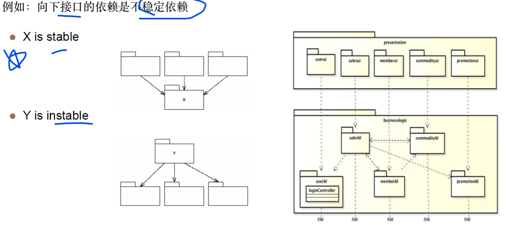

稳定抽象原则SAP

稳定包应是抽象包，不稳定包应是具体包  
稳定包包含⾼层设计，抽象它们使得对扩展开发对修改关闭（OCP）。⼀些灵活性留在稳定的难以改变的  
包中。  
对象创建：⽅案⼀: Spring⽅案,需要事先明确依赖关系  
在程序启动时,第三⽅(初始化程序)⼀次性创建完成对象实例并set给上⼀层  
Service：View——Logic；DAO: Logic——Data  
⽅案⼆: 也适⽤于⾮层间的包依赖解除  
构造⼀个第三⽅(Factory)负责创建具体对象实例  
上层和下层都依赖于第三⽅，但第三⽅可以视作例外（即不影响层间独⽴关系）

4.体系结构构件之间接口的定义

1+3

根据分配的需求确定模块对外接口，如逻辑层接口根据界⾯的需求得到，数据层接口根据逻辑层调⽤得到  
根据刺激与响应确定接口，依据详细规格明确接口内容（数据、返回值）  
（1）通常情况下，VIEW的required接口可以直接作为相应Logic的Provided  
（2）通常情况下，LOGIC的required接口需要分解为同层模块和不同Data的Provided  
（3）Data⼀般没有层间依赖，接口通常来⾃于上⼀层的相应模块

5.Stub 和Driver

1

### 总结：驱动模块（Driver）和桩模块（Stub）

在传统的单元测试中，驱动模块和桩模块是两个重要的组成部分。它们的主要功能和作用如下：

#### 驱动模块（Driver）

**目的** ：

  * 模拟被测试模块的上一级模块，相当于被测模块的主程序。

  * 访问类库的属性和方法，检测类库的功能是否正确。

  * 自动调用被测试模块中的函数，设置测试环境。

**功能** ：

  * 接收数据并传送给被测模块。

  * 启用被测模块并打印出相应的结果。

  * 通过模拟用户操作行为（如选择选项或按下按钮）进行测试，而无需真正与用户界面交互。

**使命** ：

  * 根据测试用例的设计去调用被测试模块。

  * 判断被测试模块的返回值是否与测试用例的预期结果相符。

#### 桩模块（Stub）

**目的** ：

  * 模拟被测试模块所调用的模块，而不是软件产品的组成部分。

  * 为被测模块提供模拟的下级模块功能（替身模块），确保测试环境的独立性。

**功能** ：

  * 模拟被调用模块的行为，在被调用时返回静态值。

  * 替代被测模块的接口，接受或传递被测模块的数据。

**使命** ：

  * 使程序能够编译通过。

  * 模拟返回被代替模块的各种可能返回值，根据测试用例的情况决定返回值。

### 示例

#### 驱动模块示例

假设我们有一个被测试模块 `Calculator`，具有一个方法 `add(int a, int b)` 用于加法运算。

**驱动模块代码示例** ：

java复制

    
    public class CalculatorDriver {
    public static void main(String[] args) {
        Calculator calculator = new Calculator();
        int result = calculator.add(2, 3);
        // 检查返回值是否正确
        if (result == 5) {
            System.out.println("Test Passed");
        } else {
            System.out.println("Test Failed");
        }
    }
}

#### 桩模块示例

假设我们有一个被测试模块 `OrderService`，它需要调用 `CustomerService` 的方法 `getCustomerAddress(int customerId)`。

**被测试模块代码示例** ：

java复制

    
    public class OrderService {
    private CustomerService customerService;
    public OrderService(CustomerService customerService) {
        this.customerService = customerService;
    }
    public String getOrderShippingAddress(int customerId) {
        return customerService.getCustomerAddress(customerId);
    }
}

**桩模块代码示例** ：

java复制

    
    public class CustomerServiceStub extends CustomerService {
    @Override
    public String getCustomerAddress(int customerId) {
        // 模拟返回值
        return "123 Newton Street";
    }
}

**使用桩模块进行测试的驱动模块代码示例** ：

java复制

    
    public class OrderServiceDriver {
    public static void main(String[] args) {
        CustomerServiceStub customerServiceStub = new CustomerServiceStub();
        OrderService orderService = new OrderService(customerServiceStub);

        String address = orderService.getOrderShippingAddress(1);
        // 检查返回值是否正确
        if (address.equals("123 Newton Street")) {
            System.out.println("Test Passed");
        } else {
            System.out.println("Test Failed");
        }
    }
}

### 总结

  * **驱动模块（Driver）** ：用于模拟上一级模块，调用被测试模块并验证其功能。

  * **桩模块（Stub）** ：用于模拟下一级被调用模块，提供静态返回值以确保测试的独立性和简化测试过程。

通过合理使用驱动模块和桩模块，可以提高单元测试的效率和准确性，确保软件模块在独立条件下的正确性。

6.ATAM架构权衡评估方法

1

  1. **介绍ATAM**  \- 向利益相关者介绍ATAM的概念，并回答有关该过程的任何问题。

  2. **展示业务驱动因素**  \- 过程中的每个人都展示和评估系统的业务驱动因素。

  3. **介绍架构**  \- 架构师向团队展示高层次的架构，并提供“适当的细节”。

  4. **识别架构方法**  \- 团队提出并讨论系统的不同架构方法。

  5. **生成质量属性树**  \- 定义系统的核心业务和技术需求，并将其映射到适当的架构属性。为给定需求呈现一个场景。

  6. **分析架构方法**  \- 分析每个场景，根据优先级进行评分。然后将架构与每个场景进行评估。

  7. **集思广益并优先排序场景**  \- 在较大的利益相关者群体中，提出当前场景并进行扩展。

  8. **分析架构方法**  \- 在已有的更大利益相关者群体的知识基础上，再次执行步骤6。

  9. **展示结果**  \- 向利益相关者提供完整的文档。

7.4+1视图模型

1
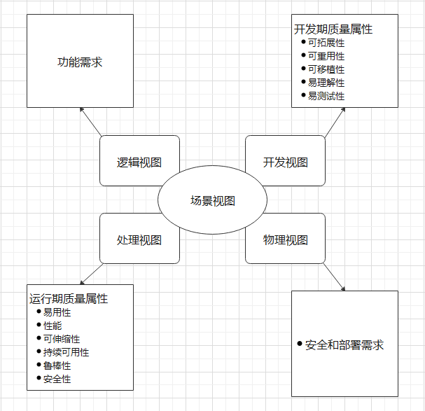

### 第十一章：人机交互

1.人机交互的可用性

1

易⽤性是⼈机交互中⼀个既重要又复杂的概念。它不仅关注⼈使⽤系统的过程，同时还关注系统对使⽤它  
的⼈所产⽣的作⽤，因为⽐较复杂，所以易⽤性不是⼀个单⼀的质量维度，⽽是多维度的质量属性。从易  
于度量的⾓度讲，易⽤性的常⽤维度包括：易学性、易记性、有效率、低出错率和主观满意度。

2.列出5个人机交互原则进行解释（例子违反了哪些界面设计原则）

1

1）简洁设计：（7+2原则）不要使用太大的菜单，不要在一个窗口表现过多的信息类别，不要在一个表单中使用太多的字体和颜色作为线索  
2）一致性设计：①一个系统相似的任务具有一致的交互机制，用户一致的精神模型②还有用户使用类似系统的习惯  
3）低出错率设计：帮助人们避免犯错，尽可能设计不让用户犯严重错误的系统，具体可以是将不适当的菜单选项功能以灰色的显示屏蔽，禁止数值输入域内出现字母等等  
4）易记性设计：减少短期记忆负担，使用逐层方式显现信息，使用的直观的快捷方式，设计有意义的默认值  
5）可视化设计要点

（1）不要暴露内部结构  
例⼦：该设计明显暴露了软件结构，三个独⽴软件过程：创建、更新、解除  
（2）展⽰细节——所见即所得  
（3）常见界⾯类型：软件系统通常同时使⽤多种界⾯类型，以适应差异性的⽤户和任务。

3.精神模型，差异性  
（1）精神模型就是⽤户进⾏⼈机交互时头脑中的任务模型  
依据精神模型可以进⾏隐喻（Metaphor）设计：隐喻又被称为视觉隐喻，是视觉上的图像，但会被⽤户映  
射为业务事物。⽤户在识别图像时，会依据隐喻将控件功能与已知的熟悉事物联系起来，形成任务模型；  
隐喻本质上是在⽤户已有知识的基础上建⽴⼀组新的知识，实现界⾯视觉提⽰和系统功能之间的知觉联  
系。  
（2）⽤户希望看到的+希望⽤户看到的：识别并添加哪些能够帮助⽤户完成任务的功能，任务的频率也要  
纳⼊考虑  
常见错误：加⼊⼀些容易加⼊（例如正好是⼀个独⽴的软件过程）的功能，这会扰乱⽤户的精神模型，影  
响使⽤过程的顺利性  
（3）新⼿⽤户：关注易学性，进⾏业务导航，尽量避免出错  
专家⽤户：关注效率  
熟练⽤户：在易学性和效率之间进⾏折中  
好的⼈机交互应该为不同的⽤户群体提供差异化的交互机制。  
既为新⼿⽤户提供易学性⾼的⼈机交互机制（图形界⾯）  
又为专家⽤户提供效率⾼的⼈机交互机制（命令⾏、快捷⽅式、热键）

4.导航 、反馈、协作式设计  
（1）导航：主动将⾃⼰的产品和服务简明扼要地告诉⽤户，⽬的是为⽤户提供⼀个很好的完成任务的⼊  
口，好的导航会让这个⼊口⾮常符合⼈的精神模型。  
全局结构按照任务模型将软件产品的功能组织起来，并区分不同的重要性和主题提供给不同的⽤户。全局  
结构常⽤的导航控件包括窗口、菜单、列表、快捷⽅式、热键等等。全局结构的设计主要以功能分层和任  
务交互过程为主要依据。  
局部结构通过安排界⾯布局细节，制造视觉上的线索来给⽤户提供导航。局部结构常⽤的导航控件包括可  
视化控件布局与组合、按钮设置、⽂本颜⾊或字体⼤⼩等等。局部结构的设计主要以⽤户关注的任务细节  
为主要依据。  
（2）反馈：让⽤户能够意识到⾏为的结果，但不能打断⽤户⼯作时的意识流  
⽤户喜欢较短的响应时间；较长的响应时间（>15秒）具有破坏性；  
⽤户会根据响应时间的变化调整⾃⼰的⼯作⽅式；  
较短的响应时间导致了较短的⽤户思考时间；较快的节奏可能会提⾼效率，但也会增加出错率；  
根据任务选择适当的响应时间：打字、光标移动、⿏标定位：50～150毫秒；简单频繁的任务：1秒；普通  
的任务：2～4秒；复杂的任务：8～12秒  
响应时间适度的变化是可接受的；意外延迟可能具有破坏性；经验测试有助于设置适当的响应时间。  
（3）协作式设计：  
A.简洁设计（摘要图⽚优于⽂字描述）  
列举、隐藏、赋予（标签、图标等线索暗⽰）  
B.⼀致性设计（确认与删除键相对位置不⼀致）  
C.低出错率设计（⽤具体的指导来提⽰⽤户出错）  
限制输⼊：列表、可选框等选择性组件代替输⼊框；按钮代替命令⾏；限定输⼊：类型，范围，格式…  
限制范围：简单化单步操作  
辅助：事前提⽰；事后检查；随时可以撤销  
D.易记性设计  
减少短期记忆负担；使⽤逐层递进的⽅式展⽰信息；使⽤直观的快捷⽅式。重新认知⽐记忆更容易；设置  
有意义的缺省值，可以帮助⽤户减少记忆负担。

### 第十二章：详细设计（代码层面）

1.详细设计的出发点：

1

需求开发的结果（需求规格说明和需求分析模型）和软件体系结构的结果（软件体系结构设计⽅案与原型）

2.职责的GRASP原则

1

模式：每一个模式描述了一个在我们周围不断重复发生的问题，以及该问题的解决方案的核心。

GRASP，全称为**General Responsibility Assignment Software Pattern** ，即**通用职责分配软件模式** ，它由《UML和模式应用》(_Applying UML and Patterns_)一书作者Craig Larman提出。与其将它们称之为设计模式，不如称之为设计原则，因为它是站在面向对象设计的角度，告诉我们**怎样设计问题空间中的类与分配它们的行为职责，以及明确类之间的相互关系等** ，而不像GoF模式一样是针对特定问题而提出的解决方案。因此GRASP站在一个更高的角度来看待面向对象软件的设计，**它是GoF设计模式的基础** 。GRASP是**对象职责分配** 的基本原则，其核心思想是**职责分配(Responsibility Assignment)，用职责设计对象(Designing Objects with Responsibilities)。** 它包含如下9个基本特征或原则：

#### 1\. 信息专家 (Information Expert)

**     (1) 问题：**给对象分配职责的通用原则是什么？

**       (2) 解决方案：**将职责分配给拥有履行一个职责所必需信息的类，即信息专家。

**       (3) 分析：**信息专家模式是面向对象设计的最基本原则。通俗点来讲，就是一个类只干该干的事情，不该干的事情不干。在系统设计时，需要将职责分配给具有实现这个职责所需要信息的类。**信息专家模式对应于面向对象设计原则中的单一职责原则。**

**      例如：常见的网上商店里的购物车(ShopCar),需要让每种商品(SKU)只在购物车内出现一次，购买相同商品，只需要更新商品的数量即可。如下图：**

针对这个问题需要权衡的是，比较商品是否相同的方法需要放到那里类里来实现呢？分析业务得知需要根据商品的编号(SKUID)来唯一区分商品，而商品编号是唯一存在于商品类里的，所以根据信息专家模式，应该把比较商品是否相同的方法放在商品类里。

#### 2\. 创造者(Creator)

**      (1) 问题：**谁应该负责产生类的实例？

**       (2) 解决方案：**如果符合下面的一个或者多个条件，则可将**创建类A实例的职责分配给类B** ：

  * B包含A；

  * B聚合A；

  * B拥有初始化A的数据并在创建类A的实例时将数据传递给类A；

  * B记录A的实例；

  * B频繁使用A。

      此时，我们称类B是类A对象的创建者。如果符合多个条件，类B聚合或者包含类A的条件优先。

**       (3) 分析：如果一个类创建了另一个类，那么这两个类之间就有了耦合，也可以说产生了依赖关系。依赖或耦合本身是没有错误的，但是它们带来的问题就是在以后的维护中会产生连锁反应，而必要的耦合是逃不掉的，我们能做的就是正确地创建耦合关系，不要随便建立类之间的依赖关系，那么该如何去做呢？就是要遵守创建者模式规定的基本原则，凡是不符合以上条件的情况，都不能随便用A创建B。**创建对象是面向对象系统中最普遍的活动之一，因此，确定一个分配创建对象的通用职责非常重要。如果职责分配合理，设计就能降低耦合，提高设计的清晰度、封装性和重用性。通常情况下，如果对象的创建过程不是很复杂，则根据上述原则，由使用对象的类来创建对象。但是如果创建过程非常复杂，而且可能需要重复使用对象实例或者需要从外部注入一个对象实例，此时，可以委托一个专门的工厂类来辅助创建对象。**创建者模式与各种工厂模式（简单工厂模式、工厂方法模式和抽象工厂模式）相对应。** 例如：因为订单(Order)是商品(SKU)的容器，所以应该由订单来创建商品。如下图：

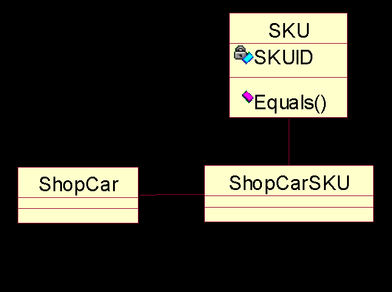

这里因为订单是商品的容器，也只有订单持有初始化商品的信息，所以这个耦合关系是正确的且没办法避免的，所以由订单来创建商品。

#### 3\. Low coupling (低耦合)

**      (1) 问题：**怎样支持低的依赖性，减少变更带来的影响，提高重用性？

**       (2) 解决方案：**分配一个职责，使得保持低耦合度。

**       (3) 分析：耦合是评价一个系统中各个元素之间连接或依赖强弱关系的尺度**，具有低耦合的元素不过多依赖其他元素。此处的元素可以是类，也可以是模块、子系统或者系统。具有高耦合的类过多地依赖其他类，这种设计将会导致：一个类的修改导致其他类产生较大影响；系统难以维护和理解；系统重用性差，在重用一个高耦合的类时不得不重用它所依赖的其他类。因此需要对高耦合的系统进行重构。

      类A和类B之间的耦合关系体现如下：A具有一个B类型的属性；A调用B的方法；A的方法包含对B的引用，如方法参数类型为B或返回类型为B；A是B的直接或者间接子类；B是一个接口，A实现了该接口。低耦合模式鼓励在进行职责分配时不增加耦合性，从而避免高耦合可能产生的不良后果。在进行类设计时，需要保持类的独立性，减少类变更所带来的影响，它通常与信息专家模式和高内聚模式一起出现。为了达到低耦合，我们可以通过如下方式对设计进行改进：

  * 在类的划分上，应当尽量创建松耦合的类，类之间的耦合度越低，就越有利于复用，一个处在松耦合中的类一旦被修改，不会对关联的类造成太大波及；

  * 在类的设计上，每一个类都应当尽量降低其成员变量和成员函数的访问权限；

  * 在类的设计上，只要有可能，一个类型应当设计成不变类；

  * 在对其他类的引用上，一个对象对其他对象的引用应当降到最低。

例如：Creator模式的例子里，实际业务中需要另一个出货人来清点订单(Order)上的商品(SKU)，并计算出商品的总价，但是由于订单和商品之间的耦合已经存在了，那么把这个职责分配给订单更合适，这样可以降低耦合，以便降低系统的复杂性。如下图：

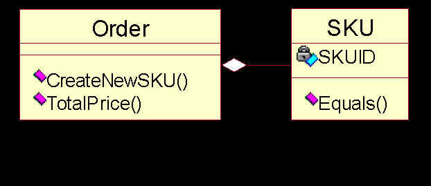

这里我们在订单类里增加了一个TotalPrice()方法来执行计算总价的职责，没有增加不必要的耦合。

#### 5\. 控制器 (Controller)

**      (1) 问题：**谁应该负责处理一个输入系统事件？

**       (2) 解决方案：**把接收或者处理系统事件消息的职责分配给一个类。这个类可以代表：

  * 整个系统、设备或者子系统；

  * 系统事件发生时**对应的用例场景** ，在**相同** 的用例场景中使用**相同** 的控制器来**处理所有的系统事件** 。

**       (3) 分析：**一个控制器是负责接收或者处理系统事件的非图形用户界面对象。一个控制器定义一组系统操作方法。在控制器模式中，要求系统事件的接收与处理通常由一个高级类来代替；一个子系统需要定义多个控制器，分别对应不同的事务处理。通常，一个控制器应当把要完成的功能委托给其他对象，它只负责协调和控制，本身不完成太多的功能。它可以将用户界面所提交的请求转发给其他类来处理，控制器可以重用，且不能包含太多业务逻辑，一个系统通常也不能设计一个统一的控制器。控制器模式与MVC模式相对应，**MVC是一种比设计模式更加高级的架构模式** 。   

#### 7\. 纯虚构 (Pure Fabrication)

**      (1) 问题：**当不想破坏高内聚和低耦合的设计原则时，谁来负责处理这种情况？

**       (2) 解决方案：**将一组高内聚的职责分配给一个虚构的或处理方便的“行为”类，它并不是问题域中的概念，而是虚构的事务，以达到支持高内聚、低耦合和重用的目的。

**       (3) 分析：**纯虚构模式用于解决高内聚和低耦合之间的矛盾，它要求将一部分类的职责转移到纯虚构类中，在理想情况下，分配给这种虚构类的职责是为了达到高内聚和低耦合的目的。在实际操作过程中，纯虚构有很多种实现方式，例如将数据库操作的方法从数据库实体类中剥离出来，形成专门的数据访问类，通过对类的分解来实现类的重用，新增加的数据访问类对应于数据持久化存储，它不是问题域中的概念，而是软件开发者为了处理方便而产生的虚构概念。纯虚构可以消除由于信息专家模式带来的低内聚和高耦合的坏设计，得到一个具有更好重用性的设计。在系统中引入抽象类或接口来提高系统的扩展性也可以认为是纯虚构模式的一种应用。纯虚构模式通常基于相关功能的划分，是一种以功能为中心的对象或行为对象。**在很多设计模式中都体现了纯虚构模式，例如适配器模式、策略模式等等。**

例如：上面多态模式的例子，如果我们的绘图程序需要支持不同的系统，那么因为不同系统的API结构不同，绘图功能也需要不同的实现方式，那么该如何设计更合适呢？如下图：

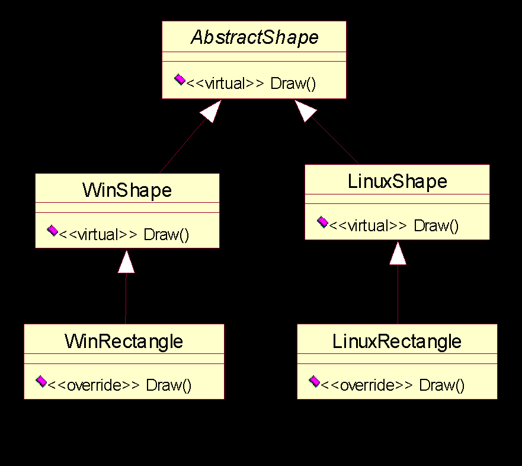

这里我们可以看到，因为增加了纯虚构类AbstractShape，不论是哪个系统都可以通过AbstractShape类来绘制图形，我们即没有降低原来的内聚性，也没有增加过多的耦合，可谓鱼肉和熊掌兼得！

3.职责分配

即如何通过职责建立静态模型以及职责的划分关系

通过职责建⽴静态模型：⾯向对象分解中，系统是由很多对象组成的。对象各⾃完成相应的职责，从⽽协  
作完成⼀个⼤的职责。类的职责主要有两部分构成：属性职责和⽅法职责。类与类之间也不是孤⽴存在的，  
它们之间存在⼀定的关系。关系表达了相应职责的划分和组合。它们的强弱顺序为：依赖<关联<聚合<组  
合<继承。

4.协作

1

根据协作建⽴动态模型：（1）从⼩到⼤，将对象的⼩职责聚合形成⼤职责；  
（2）⼤到⼩，将⼤职责分配给各个⼩对象。通过这两种⽅法，共同完成对协作的抽象。

5.控制风格

1

为了完成某⼀个⼤的职责，需要对职责的分配做很多决策。控制风格决定了决策由谁来做和怎么做决策  
分散式：所有系统⾏为在对象⽹络中⼴泛传播  
集中式：少数控制器记录所有系统⾏为的逻辑  
委托式（授权式）：决策分布在对象⽹络中，⼀些控制器作主要决策

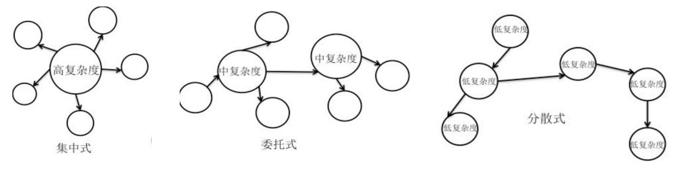

6.建⽴设计类图或详细顺序图

1

抽象类的职责->抽象类之间的关系->添加辅助类  
辅助类：接口类、记录类（数据类）、 启动类、控制器类、实现数据类型的类、容器类

### 第十三章：详细设计的模块化和隐藏

1.耦合与内聚

分别阐释概念，并且需要了解一些“评价式”的量化手段

（⼀）耦合：描述的是两个模块之间的关系的复杂程度。  
耦合根据其耦合性由⾼到低分为⼏个级别：模块耦合性越⾼，模块的划分越差，越不利于软件的变更和重  
⽤。1、2、3不可接受，4、5可以被接受，6最理想  
（1）内容耦合（⼀个模块直接修改另⼀个模块的内容，如GOTO语句；某些语⾔机制⽀持直接更改另⼀  
个模块的代码；改变另⼀个模块的内部数据）  
（2）公共耦合（全局变量，模块间共享全局数据，例⼦：全局变量）  
（3）重复耦合（模块间有重复代码）  
（4）控制耦合（⼀个模块给另⼀个模块传递控制信息，如“显式星期天”）  
（5）印记耦合（共享数据结构却只是⽤了⼀个部分）  
（6）数据耦合（模块间传参只传需要的数据，**最理想** ）  
（⼆）内聚(cohesion)：表达的是⼀个模块内部的联系的紧密性。  
内聚性由⾼到低分为：内聚性越⾼越好，越低越不易实现变更和重⽤，3、4、5等价，1、2最好，6、7不能  
接受。  
（1）信息内聚（模块进⾏许多操作，各⾃有各⾃的⼊口点，每个操作代码相对独⽴，⽽且所有操作都在  
相同的数据结构上进⾏：如栈）  
（2）功能内聚（只执⾏⼀个操作或达到⼀个⽬的）  
（3）通信内聚（对相同数据执⾏不同的操作：查书名、查书作者、查书出版商）  
（4）过程内聚（与步骤有关：守门员传球给后卫、后卫传给中场球员、中场球员传给前锋）  
（5）时间内聚（与时间有关：起床、刷⽛、洗脸、吃早餐）  
（6）逻辑内聚（⼀系列可替换的操作：如坐车、坐飞机）  
（7）偶然内聚（多个不相关的操作：修车、烤⾯包、遛狗、看电影）

块进⾏许多操作，各⾃有各⾃的⼊口点，每个操作代码相对独⽴，⽽且所有操作都在  
相同的数据结构上进⾏：如栈

内聚模式| 概念| 举个例子  
---|---|---  
偶然内聚| 各个元素关系比较松散| 不认识的几个人，偶然之下几个人被分到一个班了  
逻辑内聚| 各个元素逻辑上是有关系的，但实际功能来看是没有关系的| 哥几个都擅长体育，逻辑上说应该有关系，然而并无  
时间内聚| 各个元素必须再同一时间内执行（比如系统初始化）| 哥几个每次到吃饭这个时间点，都要去食堂  
过程内聚| 元素之间有顺序关系，调用前面元素之后，紧接着调用后面的| 体测时候按学号来，5号之后就是6号了  
通信内聚| 所有元素都操作统一数据集，或生成统一数据集| 哥几个都共享同一台电脑，文件数据都放一起  
顺序内聚| 元素都相关同一功能，前一元素的输出就是下一元素的输入。| 还是体测，只不过这次前个哥们偷偷告诉你体测的要诀  
功能内聚| 所有元素共同完成一个功能| 哥几个一起做个项目，少谁都不完整，都实现不了目标  

2.信息隐藏基本思想

模块隐藏的内容

每个模块都隐藏⼀个重要的设计决策——职责。职责体现为模块对外的⼀份契约，并且在这份契约之下隐  
藏的只有这个模块知道的决策或者说秘密，决策实现的细节仅⾃⼰知道。  
模块的信息隐藏：模块的秘密（容易变更的地⽅）：根据需求分配的职责、内部实现机制。

耦合的处理？

  * 分层风格：仅程序调用与简单数据传递

  * 包设计：消除重复

  * 分包：接⼝最小化

  * 创建者模式：不增加新的耦合

  * 控制者模式：解除View与Logical的直接耦合

内聚的处理？

  * 分层：层间职责分配⾼内聚，层内分包⾼内聚

  * 信息专家模式

  * 控制器与委托式控制风格  

  * 信息隐藏处理？

  * 分层与分包：消除职责重复、最小化接⼝：View独立？数据库连接独立？

  * 模块信息隐藏：模块需求分配与接⼝定义

  * 类信息隐藏：协作设计，接⼝定义

  * 变化设计？分层风格、RMI

### 第十四章：详细设计中基于OOP的模块化

1.模块化的原则

1

1)全局变量是有害的  
2)显式（代码清晰，不进⾏不必要的隐藏，但可能与可修改性冲突）  
3)不要有代码重复  
4)针对接口编程  
5)迪⽶特法则（不要跟陌⽣⼈说话）  
6)接口分离原则（ISP）  
7)Liskov替换原则(LSP:⼦类型可替换掉基类型，⼀棵满⾜lSP的继承树耦合度是1)  
8)使⽤组合代替继承（适⽤于不符合LSP但想要进⾏代码复⽤）  
9)单⼀职责原则

1、2、3针对降低隐式耦合，4、5、6针对降低访问耦合，7、8针对降低继承耦合，9和信息专家原则⽤  
于提⾼继承内聚，亦可以看作是降低继承耦合之⽤

注1：级联调⽤的问题在：难以应对变更＋代码难理解。应对的⽅法：采⽤委托式调⽤。  
注2：何时接口分离：出现于有⼀个负责各种交互的公共接口与各个具体类直接存在使⽤关系，使得权限  
混乱，可能造成不必要的⿇烦。解决⽅案：保留⼤接口并提取出⼏个⼩借口，通过具体类使⽤⼩接口，再  
⽤⼤接口实现⼩接口即可。

### 第十五章：详细设计中基于OOP的隐藏

1.信息隐藏的含义

需要隐藏的两种常见设计决策

  * 需求（模块说明的主要秘密）与实现——暴露外部表现，封装内部结构

  * 实现机制变更（模块说明的次要秘密）——暴露稳定抽象接口，封装具体实现细节  
⾯向对象机制

  * 封装：封装类的职责，隐藏职责的实现＋预计将要发⽣的变更

  * 抽象类（接口）/继承（实现）：抽象它的接口，并隐藏其内部实现

2.封装：

封装的含义、观点与原则行为

（1）含义1：数据与⾏为集中在⼀起  
含义2：接口与实现相分离：⼀个类可以分成两个部分，接口和实现接口是类的外部表现，对外公开；实现是类的内部结构，内部隐藏

（2）封装的初始观点：把数据（内部结构）隐藏在抽象数据类型内  
新观点（信息隐藏）：隐藏任何东西：数据与⾏为、复杂内部结构、其他对象、⼦类型信息、潜在变更  
（3）封装数据与⾏为：除⾮（直接或间接）为满⾜需求（类型需要），不要将操作设置为public。类型需  
要的操作：为了满⾜⽤户任务⽽需要对象在对外协作中公开的⽅法，例如下图的4个操作（属于后⼀个对  
象，为满⾜计算商品总价的任务）

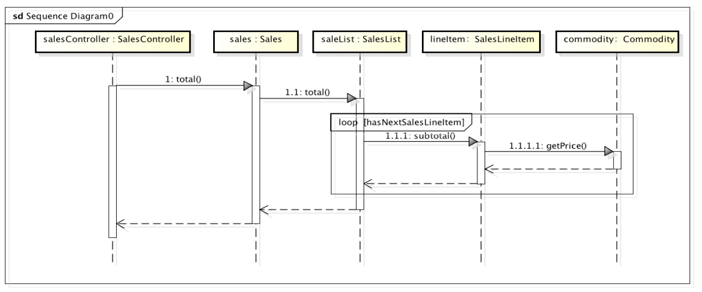

除⾮（直接或间接）为满⾜需求（类型需要），不要为属性定义getX⽅法和setX⽅法，更不要将其定义为  
public。例如上⼀⽰例中的getPrice()  
（4）封装结构：不要暴露内部的复杂数据结构，经验表明复杂数据结构是易于发⽣修改的。例如暴露了  
内部使⽤List数据结构。  
改进：Iterator模式（所有涉及到集合类型的操作都可能会出现此问题）  
（5）封装其他对象：委托⽽不是提供⾃⼰拥有的其他对象的引⽤  
除⾮Client对象已经拥有了该其他对象的引⽤，这时返回其引⽤不会增加总体设计的复杂度  
可以保证Sales只需要关联SalesList，不需要关联SalesLineItem和Commodity；从整个设计来讲，Sales不需要  
知道SalesList⾥⾯存储的是SalesLineItem的集合，更不需要知道SalesLineItem使⽤了Commodity类型  
（6）封装⼦类（LSP：⼦类必须能够替换他们的基类）  
（7）封装潜在变更：识别应⽤中可能发⽣变化的部分，将其与不变的内容分离开来  
封装独⽴出来的潜在变化部分，这样就可以在不影响不变部分的情况下进⾏修改或扩展（ DIP 和OCP）

3.开闭原则OCP：

原则

对扩展开放，对修改封闭  
违反了OCP原则的典型标志：出现了switch或者if-else  
分⽀让程序增加复杂度，修改时容易产⽣新错误（特例：创建）

4.依赖倒置原则DIP：

原则

（与⼯⼚结合紧密，解决new的创建问题）

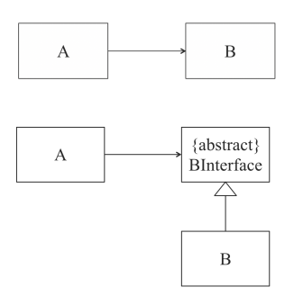

I. ⾼层模块不应依赖底层模块，两者都应依赖抽象  
II. 抽象不应依赖细节，细节应依赖抽象  
使⽤抽象类（继承）机制倒置依赖  
示例：A依赖于B：B不是抽象类，所以A依赖于具体，⽽不是抽象，如果需  
要变更B的⾏为，就会影响到A  
添加抽象类BI，让 B实现（继承）BI：A依赖于BI，B依赖于BI，BI是抽象  
类，所以是依赖于抽象，BI比较稳定，如果B发⽣变更，可以通过为BI扩展  
新的实现（⼦类型）来满⾜

5.继承耦合

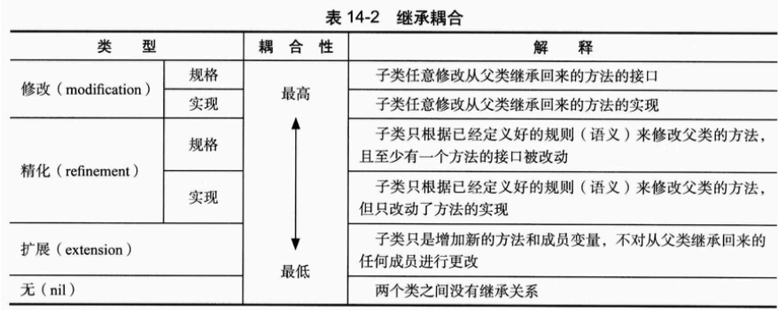

### 第十六章：设计模式

1.如何实现可修改性、可扩展性、灵活性

分别实现【可修改可扩展】和【灵活性】

需要进⾏接口和实现的分离：通过接口和实现该接口的类；通过⼦类继承⽗类  
注意：继承关系（A＋B）可能使得灵活性下降，因为⽗类接口的变化会影响⼦类，这时可以通过组合关系来解决。

利⽤抽象类机制实现可修改性和可扩展性：只要⽅法的接口保持不变，⽅法的实现代码是⽐较容易修改的，不会产⽣连锁反应。通过简单修改创建新类的代码，就可以相当容易地做到扩展新的需求（不⽤修改⼤量与类⽅法调⽤相关的代码。  
利⽤委托机制实现灵活性：继承的缺陷：⼀旦⼀个对象被创建完成，它的类型就⽆法改变，这使得单纯利⽤继承机制⽆法实现灵活性（类型的动态改变）。利⽤组合（委托）机制可以解决这个问题

2.策略模式

1

设计分析：  
1）⾸先，可以把上下⽂和策略分割为不同的类实现不同的职责。上下⽂Context类负责通过**执⾏策略** 实现  
⾃⼰职责；⽽策略类Strategy只负责**复杂策略的实现** 。  
2）其次，上下⽂类和策略类之间的关系是⽤组合代替继承。  
3）最后，各种策略则在具体策略类(ConcreteStrategy)中提供，⽽向上下⽂类提供统⼀的策略接⼜。（客户  
通常会创建⼀个ConcreteStrategy对象，然后传递给Context来灵活配置Strategy接⼜的具体实现）

应⽤场景：  
需要定义同⼀个⾏为的多种变体（可以是⼀个类的⾏为，也可是多个类的⾏为）

⼀个类定义了很多⾏为，⽽且通过switch语句进⾏选择。  
相关原则：SRP，OCP+LSP+DIP，使⽤组合  
缺点：代码难以理解（违反显式原则）；需要考虑concreteStrategy由谁来创建的问题  
可修改性、可扩展性  
符合DIP原则的抽象类（继承）机制：通过定义抽象类与继承（实现）它的⼦类强制性地做到：接⼜与实  
现的分离，进⽽实现上述质量；强制性地使⽤抽象类起到接⼜的作⽤，强制性地使⽤⼦类起到实现的作⽤  
灵活性：组合（委托）机制，动态调整所委托的类，实现灵活性

3.工厂模式

1
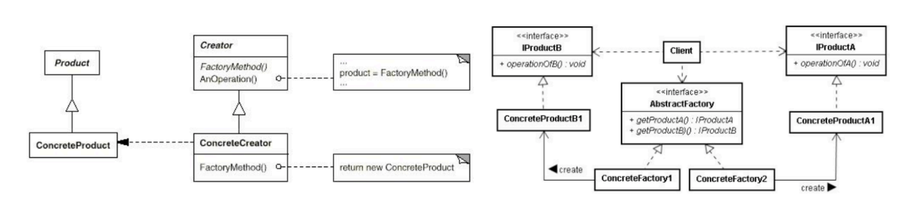

简单⼯⼚：使⽤⼀个⼯⼚对象，通过if－else等⽅式实例化需要的对象

  * ⼯⼚⽅法：⼀个抽象⽅法creator（可以在原来的类中），使⽤⼦类继承creator所在的类通过实现creator  
⽅法来实例化需要的对象（**实例化推迟到⼦类** ）。

  * 抽象⼯⼚：为应对灵活性要求，提供2套接口：⼀是表现出**稳定** 的⼯⼚⾏为的⼯⼚接口，⼆是表现出**稳定** 产品⾏为的产品接口。从⽽，实现了⼯⼚多态和产品多态。  
需要的是产品组合。有⼀个抽象⼯⼚，该抽象⼯⼚有**所有种类产品的create()** ，  
不同的产品组合拥有不同的具体⼯⼚（继承抽象⼯⼚，实现所有的create()）.  
（1）相关原则：不要重复，封装，OCP＋LSP+DIP。可能违法了显式原则。  
（2）应⽤场景：抽象⼯⼚模式可以帮助系统独⽴于如何对产品的创建、构成、表现。抽象⼯⼚模式可以让系统灵活配置拥有某多个产品族中的某⼀个。⼀个产品族的产品应该被⼀起使⽤，抽象⼯⼚模式可以强调这个限制。如果你想提供⼀个产品的库，抽象⼯⼚模式可以帮助暴露该库的接口，⽽不是实现。  
（3）应⽤注意点：隔离了客户和具体实现。客户可见的都是抽象的接口。  
使得对产品的配置变得更加灵活。  
可以使得产品之间有⼀定⼀致性。同⼀类产品可以很容易⼀起使⽤。  
但是限制是对于新的产品的类型的⽀持是⽐较困难。抽象⼯⼚的接口⼀旦定义好，就不容易变更了。  
⽽这个场景的“代价”，或者是“限制”，是⼀个⼯⼚中具体产品的种类是稳定的。

4.迭代器模式

1

通过Aggregate创建Iterator  
对于遍历这件事情，主要有2个⾏为：1）是否有下⼀个元素；2）得到下⼀个元素。所以，我们设计迭代  
器接口hasNext()和next()，分别对应前⾯2个⾏为。有了这两个接口，就可以完成遍历操作。迭代器提供的  
⽅法只提供了对集合的访问的⽅法，却屏蔽了对集合修改的⽅法，这样就对我们把集合作为参数可以做到对集合的“值传递”的效果。  
体现的原则：针对接口编程；SRP; ISP（接口分离）；OCP＋LSP  
＋DIP  
应⽤：在同⼀个集合上进⾏多种⽅式的遍历  
【题型】给出场景，应⽤设计模式写出代码  
【题型】给出代码，要求⽤设计模式改写

5.各个设计模式的特点

包括单例模式

信息隐藏——策略模式、单件模式  
对象创建——抽象⼯厂、单件模式  
接⼝编程——迭代器模式  
策略模式——减少耦合、依赖倒置  
抽象⼯厂——职责抽象、接⼝重用  
单件模式——职责抽象  
迭代器模式——减少耦合、依赖倒置

### 第十七十八章：软件构造和代码设计

1.构造包含的活动

1

详细设计；编程；测试；调试；代码评审；集成与构建；构造管理。

2.重构

1

修改软件系统的严谨⽅法，它在不改变代码外部表现的情况下改进其内部结构

3.测试驱动开发

1

测试驱动开发要求程序员在编写⼀段代码之前，优先完成该段代码的测试代码。  
测试代码之后，程序员再编写程序代码，并在编程中重复执⾏测试代码，以验证程序代码的正确性。

4.结对编程

1

两个程序员挨着坐在⼀起，共同协作进⾏软件构造活动

5.给定代码段⽰例，对其进⾏改进或发现其中的问题

12

  * 复杂决策：使⽤有意义的名称**封装复杂决策** ，例如对于决策“ If( (id>0) && (id<=MAX_ID))”，可以封装 为“If ( isIdValid(id) )”，⽅法isIdValid(id)的内容为 “return ((id>0) && (id<=MAX_ID) )”

  * 数据使⽤  
（1）不要将变量应⽤于与命名不相符的⽬的。例如使⽤变量total表⽰销售的总价，⽽不是临时客串for循环的计数器。  
（2）不要将单个变量⽤于多个⽬的。在代码的前半部分使⽤total表⽰销售总价，在代码后半部分不再需要“销售总价”信息时再⽤total客串for循环的计数器也是不允许的。  
（3）限制全局变量的使⽤，如果不得不使⽤全局变量，就明确注释全局变量的声明和使⽤处。  
（4）不要使⽤突兀的数字与字符，例如15（天）、“MALE”等，要将它们定义为常量或变量后使⽤。

  * 明确依赖关系：类之间模糊的依赖关系会影响到代码的理解与修改，⾮常容易导致修改时产⽣未预期的连锁反应。对于这些模糊的依赖关系，需要进⾏明确的注释

6.契约式设计

1

契约式设计又称断⾔式设计，它的基本思想是：如果⼀个函数或⽅法，在前置条件满⾜的情况下开始执⾏，  
完成后能够满⾜后置条件，那么这个函数就是正确、可靠的。见书上⽰例P308  
（1）异常  
（2）断⾔：assert Expression1( : Expression2)  
Expression1 是⼀个布尔表达式，在契约式设计中可以将其设置为前置条件或者后置条件；Expression2 是  
⼀个值，各种常见类型都可以；

如果Expression1 为true，断⾔不影响程序执⾏；如果Expression1 为false，断⾔抛出AssertionError 异常，如  
果存在Expression2 就使⽤它作为参数构造AssertionError。

7.防御式编程

1

防御式编程的基本思想是：在⼀个⽅法与其他⽅法、操作系统、硬件等外界环境交互时，不能确保外界都  
是正确的，所以要在外界发⽣错误时，保护⽅法内部不受损害。与契约式设计有共同点，又有很⼤的差异。  
共同点是他们都要检查输⼊参数的有效性。差异性是防御式编程将所有与外界的交互都纳⼊防御范围，如  
⽤户输⼊的有效性、待读写⽂件的有效性、调⽤的其他⽅法返回值的有效值……  
编程⽅式：异常与断⾔。

  * 输⼊参数是否合法？

  * ⽤户输⼊是否有效？

  * 外部⽂件是否存在？

  * 对其他对象的引⽤是否为NULL？

  * 其他对象是否已初始化？

  * 其他对象的某个⽅法是否已执⾏？

  * 其他对象的返回值是否正确？

  * 数据库系统连接是否正常？

  * ⽹络连接是否正常？

  * ⽹络接收的信息是否有效？

8.表驱动

1理解即可

表驱动方法是一种方案，它允许您在表中查找信息，而不是使用逻辑语句（if和 case）来查明信息。实际上，您可以使用逻辑语句选择的任何内容，都可以使用表进行选择。在简单情况下，逻辑语句更容易，更直接。随着逻辑链变得越来越复杂，表格变得越来越有吸引力。

当使用表驱动方法时，必须解决两个问题。首先，您必须解决如何在表中查找条目的问题。您可以使用一些数据直接访问表。例如，如果您需要按月对数据进行分类，则键入月表很简单。您可以使用索引为1到12的数组。

但当其他数据太笨拙，则无法用于直接查找表条目。例如，如果需要按社会保险号分类数据，则除非可以负担在表中存储999-99-9999的条目，否则就不能直接使用社会保险号直接键入表中。您被迫使用更复杂的方法。以下是在表中查找条目的方法的列表：

  * 直接访问

  * 索引访问

  * 阶梯访问

在选择表驱动法的时候，需要解决的第二个问题是，你应该在表里面存些什么。有的时候，表查询出来的结果是数据。如果你遇到的是这种情况，那么就可以把这些数据保持到表里面。在另外一些情况下，表查询出来的结果是动作（action）。在这种情况下，你可以保持一个描述该动作的代码，或者，在有些语言里，你可以保存对实现该动作的子程序的引用。无论是哪一种情况，表都会变得更为复杂

### 第十九章：软件测试

1.掌握⽩盒测试和⿊盒测试的常见⽅法，并进⾏能够优缺点⽐较。

1

（1）⿊盒测试：基于规格的技术，是把测试对象看做⼀个⿊盒⼦，完全基于输⼊和输出数据来判定测试  
对象的正确性，测试使⽤测试对象的规格说明来设计输⼊和输出数据。  
常见⽅法：等价类划分（把输⼊按照等价类划分，包括有效和⽆效）；边界值分析；决策表；状态转换。  
（2）⽩盒测试：基于代码的技术，将测试对象看成透明的，不关⼼测试对象的规格，⽽是按照测试对象  
内部的程序结构来设计测试⽤例进⾏测试⼯作。

2.能解释并区别⽩盒测试三种不同的⽅法：语句覆盖、分⽀覆盖和路径覆盖。

1
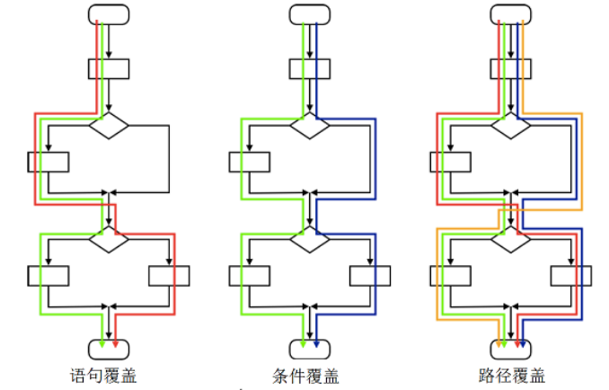

语句覆盖：确保被测试对象的每⼀⾏程序代码都⾄少执⾏⼀次  
条件覆盖：确保程序中每个判断的每个结果都⾄少满⾜⼀次  
路径覆盖：确保程序中每条独⽴的执⾏路径都⾄少执⾏⼀次 测试强度递增

给出⼀个场景，判断应该使⽤哪种测试⽅法，如何去写（JUnit基本使⽤⽅法）  
给出功能需求——写功能测试⽤例  
给出设计图——写集成测试⽤例，Stub和Driver  
给出⽅法描述——写单元测试⽤例，MockObject

### 第二十、二十一章：软件交付、维护与演化

1.软件维护的重要性

1

（1）由于会出现新的需求，如不维护软件将减⼩甚⾄失去服务⽤户的作⽤。  
（2）随着软件产品的⽣命周期越来越长，在软件⽣存期内外界环境发⽣变化的可能性越来越⼤，因此，  
软件经常需要修改以适应外界环境的改变  
（3）软件产品或多或少的会有缺陷，当缺陷暴露出来时，必须予以及时的解决

2.演化式⽣命周期模型：

1

（1）初步开发：初始开发阶段按照传统的软件开发⽅式完成第⼀个版本的软件产品开发。第⼀版的软件  
产品可以实现全部需求，也可以（通常是）只包含**部分需求** ——对⽤户来说⾮常重要和紧急的最⾼优先级  
需求。  
（2）演化：可能会有**预先安排的需求增量** ，也可能**完全是对变更请求的处理** ，它们的共同点都是保持软  
件产品的持续增值，让软件产品能够满⾜⽤户越来越多的需要，实现更⼤的业务价值。  
总的来说，该阶段可能的演化增量有：预先安排的需求增量；因为问题变化或者环境变化产⽣的变更请求；  
修正已有的缺陷；随着⽤户与开发者之间越来越相互熟悉对⽅领域⽽新增加的需求。  
演化阶段的软件产品要具备两个特征：(1) 软件产品具有较好的可演化性。⼀个软件产品在演化过程中复杂  
性会逐渐增⾼，可演化性会逐渐降低直⾄⽆法继续演化。演化阶段的软件产品虽然其可演化性低于初始开  
发阶段的软件产品，但是还没有到达⽆法演化的地步，还具有较好的可演化性。(2) 软件产品能够帮助⽤户  
实现较好的业务价值。只有这样，⽤户才会继续需要该产品，并持续提供资⾦⽀持。  
如果在演化过程中，⼀个软件产品开始不满⾜第（2）条特征，那么该产品就会提前进⼊停⽌阶段。如果  
软件产品满⾜第（2）条的同时不满⾜第（1）条特征，那么该产品就会进⼊服务阶段。如果开发团队因为  
竞争产品的出现或者其他市场考虑，也可以让同时满⾜上⾯两条特征的软件产品提前进⼊服务阶段。  
（3）服务：服务阶段的软件产品不再持续的增加⾃⼰的价值，⽽只是周期性的修正已有的缺陷。  
服务阶段的产品还仍然被⽤户使⽤，因为它仍然能够给⽤户提供⼀定的业务价值，所以开发团队仍然需要  
修正已有缺陷或者进⾏⼀些低程度的需求增量，保证⽤户的正常使⽤。  
（4）逐步淘汰：在逐步淘汰阶段，开发者已经不再提供软件产品的任何服务，也即不再继续维护该软  
件。虽然在开发者看来软件的⽣命周期已经结束，但是⽤户可能会继续使⽤处于该阶段的软件产品，因为  
它们仍然能够帮助⽤户实现⼀定的业务价值。只是⽤户在使⽤软件时必须要容忍软件产品中的各种不便，  
包括仍然存在的缺陷和对新环境的不适应。对于该阶段的产品，开发者需要考虑该产品是否可以作为有⽤  
的遗留资源⽤于新软件的开发，⽤户需要考虑如何更换新的软件产品并转移已有的业务数据。  
（5）停⽌：⼀个软件正式退出使⽤状态之后就进⾏停⽌状态。开发者不再进⾏维护，⽤户也不再使⽤。

3.⽤户⽂档、系统⽂档

知道基本概念即可

（1）⽤户⽂档：这⾥的⽂档⽀持是指为⽤户编写参考指南或者操作教程，常见的如⽤户使⽤⼿册、联机  
帮助⽂档等，统称为⽤户⽂档。  
⽂档内容的组织应当⽀持其使⽤模式，常见的是指导模式和参考模式两种。指导模式根据⽤户的任务组织  
程序规程，相关的软件任务组织在相同的章节或主题。指导模式要先描述简单的、共性的任务，然后再以  
其为基础组织更加复杂的任务描述。  
参考模式按照⽅便随机访问独⽴信息单元的⽅式组织内容。例如，按字母顺序排列软件的命令或错误消息  
列表。如果⽂档需要同时包含两种模式，就需要将其清楚地区分成不同的章节或主题，或者在同⼀个章节  
或主题内区分为不同的格式。  
（2）系统⽂档：更注重系统维护⽅⾯的内容，例如系统性能调整、访问权限控制、常见故障解决等等。  
因此，系统管理员⽂档需要详细介绍软硬件的配置⽅式、⽹络连接⽅式、安全验证与访问授权⽅法、备份  
与容灾⽅法、部件替换⽅法等等。

### 第二十二、二十三章：软件过程模型和职业基础

1.软件⽣命周期模型（**重要** ）

1

需求⼯程—软件设计—软件实现—软件测试—软件交付—软件维护

2.解释与⽐较不同的软件过程模型（要求、特征描述、优点、缺点）（**虽然很多但是都很重要所以要背背** ）

1

（1）构建-修复模型；  
特征：a.没有对开发过程进⾏规范和组织，因此⼀旦开发过程超出个⼈控制能⼒，就会导致开发过程⽆法  
有效进⾏⽽失败。  
b.对需求的真实性没有进⾏分析  
c.没有考虑软件结构的质量，导致结构在修改中越来越糟，直⾄⽆法修改  
d.没有考虑测试和程序的可维护性，也没有任何⽂档，导致难以维护  
适⽤场景：软件规模很⼩，只需要⼏百⾏程序，其开发复杂度是个⼈能⼒能够胜任的；软件对质量的要求  
不⾼，即使出错也⽆所谓；只关注开发活动，对后期维护的要求不⾼，甚⾄不需要进⾏维护。

（2）瀑布模型（⽂档驱动）  
特征：a.对于软件开发活动有明确阶段划分  
b.每个阶段的结果都必须验证，使得该模型是“⽂档驱动”  
优点：清晰的阶段划分有利于开发者以关注点分离的⽅式更好的进⾏复杂软件项⽬的开发。  
缺点：a.对⽂档期望过⾼；  
b.对开发活动的线性顺序假设（线性顺序与迭代相反）；  
c.客户、⽤户参与度不够（需求被限制在⼀个时间段）  
d.⾥程碑粒度过粗（软件复杂使得每个阶段时间长，⽆法尽早发现缺陷）

适⽤：需求⾮常成熟、稳定，没有不确定的内容，也不会发⽣变化；所需的技术成熟、可靠，没有不确定  
的技术难点，也没有开发⼈员不熟悉的技术问题；复杂度适中，不⾄于产⽣太⼤的⽂档负担和过粗的⾥程  
碑

（3）增量迭代模型（需求驱动）与演化模型互为补充  
特征：项⽬开始时，通过系统需求开发和核⼼体系结构设计活动完成项⽬的前景范围的界定，然后将后续  
开发活动组织为**多个迭代、并⾏的瀑布式开发活动** 。第⼀个迭代完成的往往是核⼼⼯作，满⾜基本需求，  
后续迭代完成附带特性。  
优点：a.更符合软件开发实践  
b.并⾏开发可以缩短产品开发时间  
c.渐进交付可以加强⽤户反馈，降低开发风险。  
缺点：a.要求⾼：软件需要有开放式的体系结构  
b.不确定性太多，导致难以在项⽬开始就确定前景和范围  
适⽤：⽐较成熟和稳定的领域

（4）演化模型（需求驱动）  
特点：更好地应对需求变更，更适⽤于需求变更⽐较频繁或不确定性较多的领域。将软件开发组织为多个  
迭代、并⾏的瀑布式开发活动。是迭代＋并⾏＋渐进  
优点：a.适⽤于需求变更频繁或者不确定性多的系统的开发  
b.并⾏开发可以缩短开发时间  
c.加强⽤户反馈，降低开发风险  
缺点：a.⽆法在项⽬早起确定项⽬范围  
b.后续迭代活动以前导迭代为基础，容易使后续迭代忽略分析与设计。退化为构建－修复⽅式。  
适⽤：不稳定领域的⼤规模软件系统

（5）原型模型（需求驱动）  
特点：⼤量使⽤抛弃式原型（抛弃式原型：通过模拟“未来”的产品，将“未来”的知识置于“现在”进⾏推敲，  
解决不确定性）。  
优点：a.加强与客户、⽤户的交流，更好的产品满意度  
b.适⽤于不确定性⼤的新颖领域  
缺点：a.成本较⾼，有耗尽时间和费⽤的风险  
b.有⼈不舍得抛弃“抛弃式原型”，使得较差代码进⼊产品，降低质量  
适⽤：有着**⼤量不确定性** 的新颖领域

（6）螺旋模型（风险驱动）  
特点：基本思想是尽早解决⽐较⾼的风险，如果有些问题实在⽆法解决，那么早发现⽐项⽬结束时再发现  
要好，⾄少损失要⼩得多。风险是指因为不确定性（对未来知识了解有限）⽽可能给项⽬带来损失的情  
况，原型能够澄清不确定性，所以原型能够解决风险。  
迭代与瀑布的结合：开发阶段是瀑布式的，风险分析是迭代的  
优点：降低风险，减少因风险造成的损失  
缺点：a.使⽤原型⽅法，为⾃⾝带来风险  
b.模型过于复杂，不利于管理者依据其组织软件开发活动。  
适⽤性：⾼风险的⼤规模软件系统开发

## 论述实例题部分

### 第一、二章软件工程概论

### 第四章：项目启动

### 第五章：软件需求基础

1.分析以下需求的层次

R1：在系统使用3个月后，销售额度应该提⾼20%（业务需求－为何开发系统）  
R2：系统要帮助收银员完成销售处理；（用户需求－帮助用户做什么）  
系统特性SF1：管理VIP顾客信息，针对每⼀个系统特性，都可以建立⼀组用户需求。例如对SF1，每⼀条  
都是用户完成具体任务所需要的功能：  
UR1.1：客户经理可以使用系统添加、修改或者删除会员个⼈信息。（用户需求）  
UR1.2：收银员使用系统进⾏销售时会记录会员的购买信息。 （用户需求）  
UR1.3：客户经理可以使用系统查看会员的个⼈信息和购买信息。（用户需求）  
UR1.4：客户经理可以使用系统查看所有会员的统计信息。 （用户需求）  
R3：收银员输⼊购买的商品时，系统要显示该商品的描述、单价、数量和总价（系统级需求－系统怎么与  
外界交互）  
对用户需求UR1.3，可以依据任务中的交互细节将之转化为系统级需求SR1.3.1∼SR1.3.4。  
SR1.3.1在接到客户经理的请求后，系统应该为客户经理提供所有会员的个⼈信息。（系统级需求）  
SR1.3.2在客户经理输⼊会员的客户编号时，系统要提供该会员的个⼈信息。（系统级需求）  
SR1.3.3在客户经理选定⼀个会员并申请查看购买信息时，系统要提供该会员的历史购买记录。  
SR1.3.4经理可以通过键盘输⼊客户编号，也可以通过读卡器输⼊客户编号。（系统级需求）  
ATM机：问题：营业厅⼈⼒成本过⾼，不吸引客户（业务需求）  
问题域：存钱、取钱、转账（用户需求）

总结下来：用户需求应该是“用户可以使用系统xxxx”，而系统级需求大部分是“blablabla之后，系统应该/能够xxxx”,并且更加的深入操作，比如说“键盘输入blabla”这种操作细节。而业务需求则是具体的一些“商业目的”或者说是问题。

### 第六章：需求分析方法（各种画图，铁铁）

1.建立下列示例的用例图

×××连锁商店是⼀家刚刚发展起来的小型连锁商店，其前身是⼀家独立的小百货门面店。  
首先是随着商店规模的扩⼤，顾客量⼤幅增长，⼿⼯作业销售迟缓，顾客购物排队现象严重，导致流失客  
源。其次是商店的商品品种增多，⽆法准确掌握库存，商品积压、缺货和报废的现象上升明显。再次是商  
店面临的竞争比以前更⼤，希望在降低成本，吸引顾客，增强竞争⼒的同时，保持盈利⽔平。  
BR1：在系统使用6个月后，商品积压、缺货和报废的现象要减少50%  
BR2：在系统使用3个月后，销售⼈员⼯作效率提⾼50%  
BR3：在系统使用6个月后，运营成本要降低15%  
范围：⼈⼒成本和库存成本，度量：检查平均员⼯数量和平均每10,000元销售额的库存成本  
BR4：在系统使用6个月后，销售额度要提⾼20%，最好情况：40%，最可能情况：20%，最坏情况：10%  
SF1：分析商品库存，发现可能的商品积压、缺货和报废现象  
SF2：根据市场变化调整销售的商品  
SF3：制定促销⼿段，处理积压商品  
SF4：与⽣产厂家联合进⾏商品促销  
SF5：制定促销⼿段进⾏销售竞争  
SF6：掌握员⼯变动和授权情况  
SF7：处理商品⼊库与出库  
SF8：发展会员，提⾼顾客回头率  
SF9：允许积分兑换商品和赠送吸引会员的礼品，提⾼会员满意度  
SF10：帮助收银员处理销售与退货任务

**如果⽤例的粒度不合适就需要进⾏细化和调整。判断标准是：⽤例描述了为应对⼀个业务事件，由⼀个⽤  
户发起，并在⼀个连续时间段内完成，可以增加业务价值的任务。**

2.**UML类图（领域模型）**

【⽰例1】  
1、如果是会员，收银员输⼊客户编号（属性、⽆⾏为）  
2、系统显示会员信息（就是会员），包括姓名（属性、⽆⾏为）与积分（属性、⽆⾏为）  
3、收银员输⼊商品标识（商品属性、⽆⾏为）  
4、系统记录并显示商品信息（有状态、有⾏为），商品信息包括商品标识、描述、数量、价格、特价  
（如果有商品特价策略的话）和本项商品总价（商品属性）  
5、系统显示已购⼊的商品清单（有状态、有⾏为），商品清单包括商品标识、描述、数量、价格、特  
价、各项商品总价和所有品总价（商品属性）  
收银员重复3-5步，直到完成所有商品的输⼊  
6、收银员结束输⼊，系统计算并显示总价（存储在账单中，有⾏为），计算根据总额特价策略（有状  
态、有⾏为）进⾏  
7、系统根据商品赠送策略和总额赠送策略计算并显示赠品清单（要），赠品清单包括各项赠品的标识、  
描述与数量（不要）  
8、收银员请顾客（就是会员）支付账单（有状态、有⾏为）  
9、顾客支付，收银员输⼊收取的现⾦数额（有属性、⽆⾏为、不要）  
10、系统给出应找的余额（有属性、⽆⾏为、不要），收银员找零  
11、收银员结束销售，系统记录销售信息（有状态、有⾏为）、商品清单、赠品清单和账单信息，并更新  
库存（有状态、有⾏为）  
12、系统打印收据（根据需求，如果是⼀次性就⽆状态⽆⾏为，如果是丢了还可以打印就有状态有⾏为）

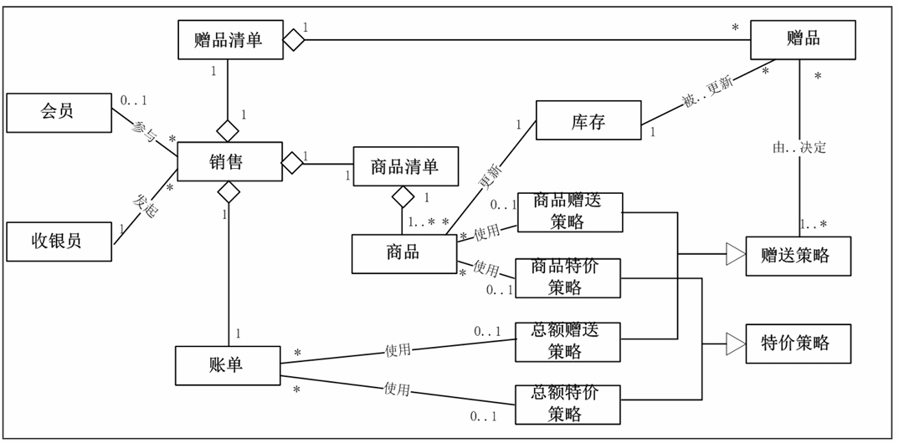

[统一建模语言UML（四）：领域模型和类图_领域模型图-CSDN博客](<https://blog.csdn.net/qq_40324906/article/details/113667947>)

3.系统顺序图

[系统分析与设计学习笔记（五）顺序图vs系统顺序图_系统顺序图和顺序图区别-CSDN博客](<https://blog.csdn.net/DavidWillo/article/details/73294409>)

4.状态图

会员信息显示状态：输⼊了客户编号，系统显示该会员信息的状态；  
商品信息显示状态：刚刚输⼊了⼀个物品项，显示该物品（和赠品）描述信息的状态；  
列表显示状态：以列表⽅式显示所有已输⼊物品项（和赠品）信息的状态；  
错误提示状态：输⼊信息错误的状态；  
账单处理状态：输⼊结束，系统显示账单信息，收银员进⾏结帐处理的状态。  
销售结束状态：更新信息，打印收据的状态。

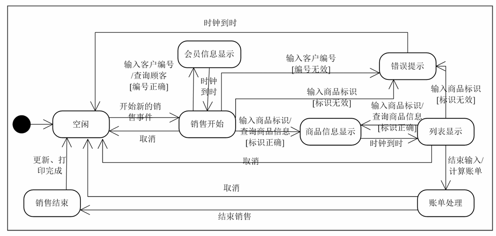

### 第七章：需求文档化以及验证（规格以及测试）

1.对给定的需求⽰例，设计功能测试⽤例（结合测试⽅法）

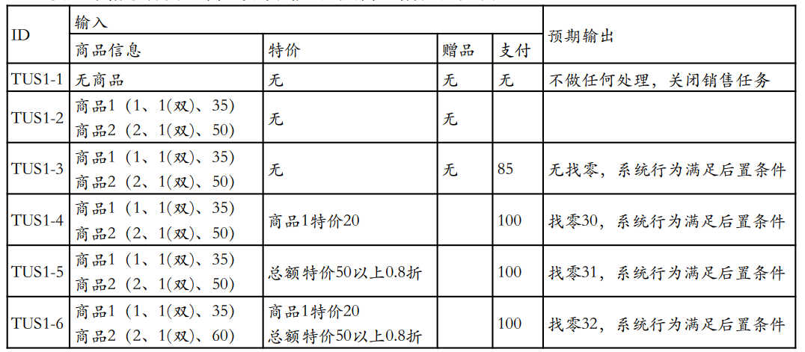

### 第八章：软件设计基础

### 第九、十章：软件体系结构基础及设计与构建

### 第十一章：人机交互

### 第十二章：详细设计（代码层面）

1.图书管理系统中有多个借阅者角色。本科生、研究生和教师。所有借阅者都可以借阅图书。  
教师借阅图书的行为和本科生,研究生略有不同时。当教师希望借阅的某种图书被 借空时,  
系统将自动通知借阅者归还图书, 本科生只可借阅普通图书，最多可同时借阅 5 本；研究  
生可以最多可同时借阅 10 本；老师可以借阅 20 本。Hyoga 同学熟悉结构化编程,给出了  
如下设计。请根 据以上借阅图书相关的**功能性需求** 和**面向对象的思想** ，**指出 Hyoga 设计  
的问题**，画出关于**借阅者的设计类图** ，并且写出**各个类和借阅相关的属性和方法的定义(不  
用实现)**。

    
    public class Borrower {
 int MAX_FOR_BACHLOR = 5; 
 int MAX_FOR_MASTER = 10; 
 int MAX_FOR_TEACHER = 20;
 public void borrowBookforBorrower (int i){ 
 if (i==0) borrowBookforBachlor ();
 else if (i==1) borrowBookforMaster (); 
 else if (i==2) borrowBookforTeacher ();
 }
 private void borrowBookforBachlor (){
 borrowBook();
 }
 private void borrowBookforMaster (){
 borrowBook(); 
 }
 private void borrowBookforTeacher(){ 
 borrowBook();
 notifyReturnBook(); 
 }
 private void borrowBook (){ 
 //借书
 ...
 }
 private void notifyReturnBook(){ //通知归还图书
 ... 
 }
}

即分析当前设计中存在的问题，并且需要给出对应的设计类图实现

首先试着分析这样的“大杂烩”存在的最明显的问题：违背了SRP原则（即单一职责原则），并且可扩展性差，违背了OCP（开闭原则），每次新增借阅者类型都需要修改整个borrow类的代码

因此我们给出了以下的解决办法与设计，首先把borrow类更改为抽象类，然后为每种借阅者类型创建具体的子类。这样可以确保每个类只有一个职责，并且便于扩展和维护。把borrow方法以及对应的借书上限数目放在继承的借阅者类型中实现即可

2.类图的绘制

主要是一些线条设计以及类的属性、方法怎么去写
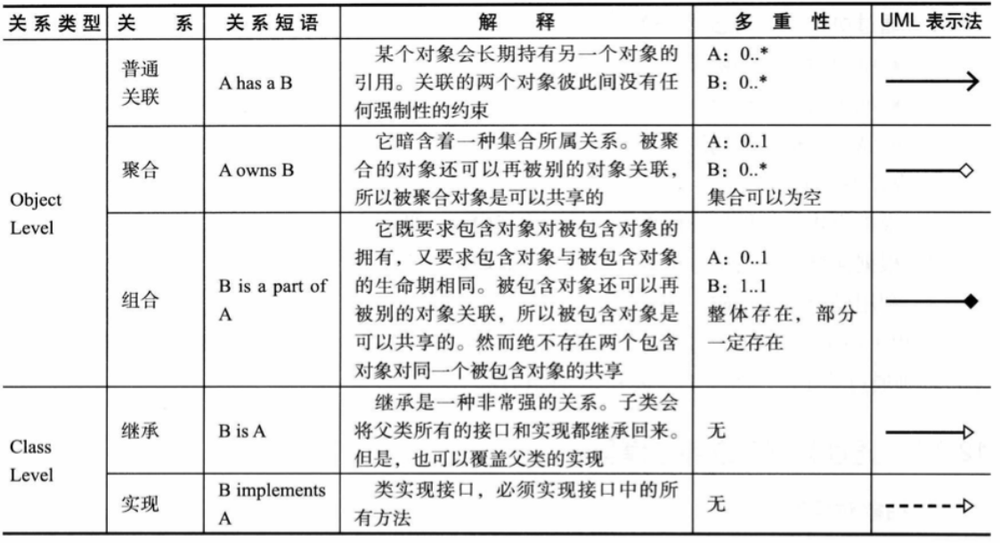

### 第十三章：详细设计的模块化和隐藏

### 第十四章：详细设计中基于OOP的模块化

### 第十五章：详细设计中基于OOP的隐藏

### 第十六章：设计模式

### 第十七十八章：软件构造和代码设计

### 第十九章：软件测试

### 第二十、二十一章：软件交付、维护与演化

### 第二十二、二十三章：软件过程模型和职业基础
