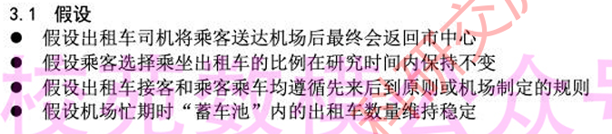
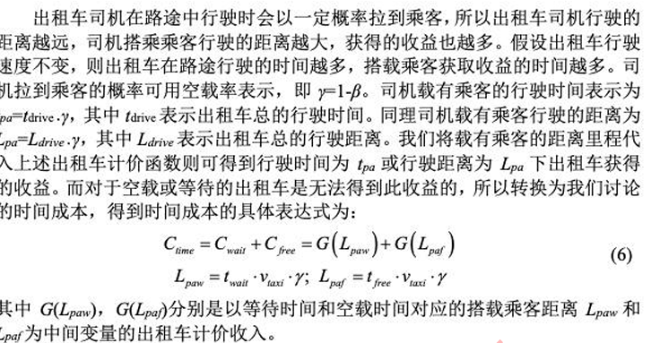
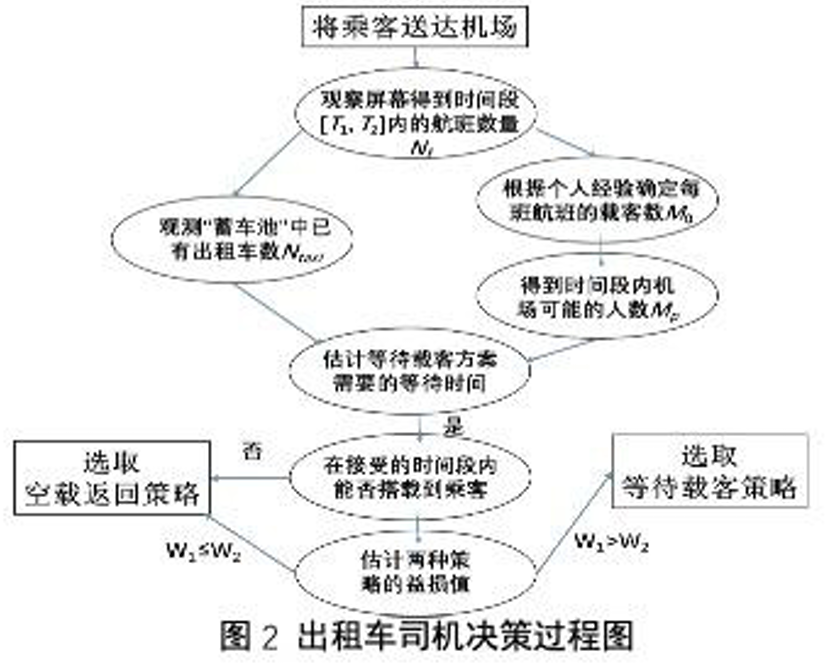
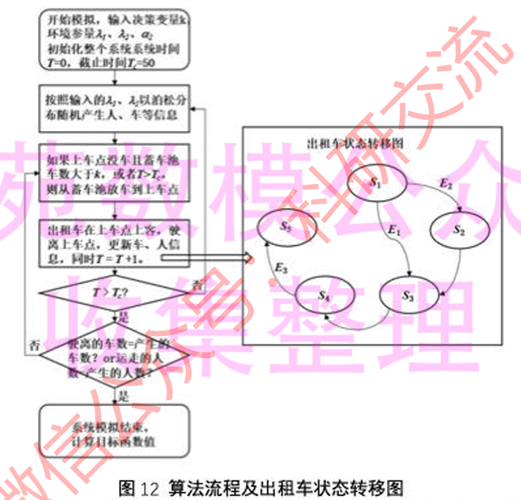
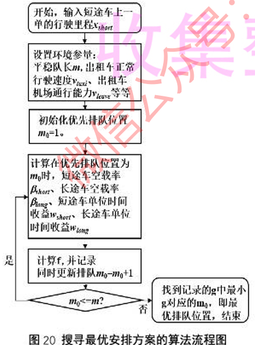

[2019年国赛C题](<../../assets/images/2024/07/2019年国赛C题.pdf>)[下载](<../../assets/images/2024/07/2019年国赛C题.pdf>)

首先我们从题目出发，题目的背景设置在送客之后机场出租车司机的行为，并且将这个行为简化为：载到客人回市区与空车回市区

其中存在着一种决策，所以以下紧跟着的四个问题全都围绕“决策”展开，即司机应该如何选择自己的策略  
1.“综合考虑机场乘客数量的变化规律和出租车司机的收益，建立出租车司机**选择决策模型** ”  
2.“收集数据，**给出该机场出租车司机的选择方案** ，并分析模型的合理性和对**相关因素** 的依赖性。”  
3.“在某些时候，经常会出现出租车排队载客和乘客排队乘车的情况。某机场“乘车区”现有两条并行车道，管理部门应如何设置“上车点”，并合理安排出租车和乘客，在保证车辆和乘客安全的条件下，使得总的乘车效率最高。”

## 优秀论文分析

### 基于系统模拟的机场出租车决策和安排模型

[2019C：基于系统模拟的机场出租车决策与安排模型](<../../assets/images/2024/07/2019C：基于系统模拟的机场出租车决策与安排模型.pdf>)[下载](<../../assets/images/2024/07/2019C：基于系统模拟的机场出租车决策与安排模型.pdf>)

本文有一个非常突出的特色就是数据的结合非常紧密，无论是数据的收集，比如机场全天动态、节假日与工作日、忙期和闲期的数据、乘车效率的计算数据，还是具体策略的分析决定，都相当全面。

本文没有采用过于复杂的模型，优点主要在于数据的全面与逻辑一致性

这是本文对于第一个模型的假设，对于这些假设有相当大的“经验性”和不确定性，究竟那些东西需要在假设中指出目前我还有一定的不确定（TODO）比如说第四点我就有一点困惑，其实这一点假设有点空洞？就相当于指出“忙期蓄车池假设可以一直满载使用”，可能有一点“过度”的样子，但是从“可模拟”的角度这样的假设并无不妥

在影响因素分析部分，他将因素分开为随机因素和确定因素，并且在随机因素中使用了一定的模型拟合（正态分布拟合），这一点是非常符合直觉的（当然我觉得假如能找到论文支持那更好）

除此之外还要分析决策影响因素的重要部分，这一点是基于假设的，所以在另外一篇论文中指出了“司机只看经济因素”，所以我觉得在分析“出租车收支”之前可以补充一点这个，这些成本“是”司机在意的因素，所以我觉得在前文补充“司机的决策会综合自己的成本以及出租车收支的权衡”等等之类的描述。

这一段分析很扎实，从问题分析的角度判断司机空载回去可能得到的收益，虽然我一开始的想法是假设在每一段路上接到的乘客的概率固定，然后一路积分得到一个具体的时间成本

下一段对比了空载返回方案和等待载客方案的两项差异

对于以上建立的模型，作者进行了实验验证，即随机选取来进行可行性验证

具体模型求解部分：

定义了一个乘车效率：

[latex]
$$
\\\eta = \\\frac{1}{\\\sum\\\limits_{i=1}^n{\\\frac{t_{pt}}{n}}+\\\sum\\\limits^m_{j=1}{\\\frac{t_{cj}}{m}}}
$$

并且施加合适的约束，给出如下图所示的模拟

所以看到这里，本篇文章的核心优势就在于，构建了一套非常系统的“模拟模型”

最后一问考察的是，如何调整短途车的排队以确保短途车因为“空载”的收益下降能够得到平衡，作者根据之前所能推出的空载率β和收益W，对于长途车和短途车进行了平衡分析，建立了对应的优化模型，然后进行具体求解（作者对于每一问的方式都是：模型准备，模型建立，模型求解，具有相当优异的条理性，值得学习）

[2019C：机场出租车司机综合决策及机场出租车管理模型](<../../assets/images/2024/07/2019C：机场出租车司机综合决策及机场出租车管理模型.pdf>)[下载](<../../assets/images/2024/07/2019C：机场出租车司机综合决策及机场出租车管理模型.pdf>)
