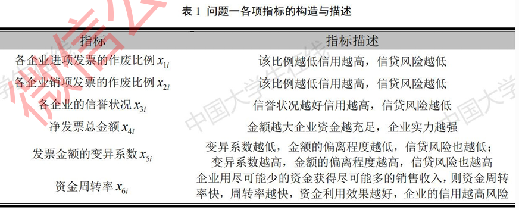
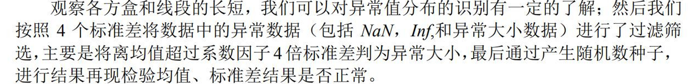
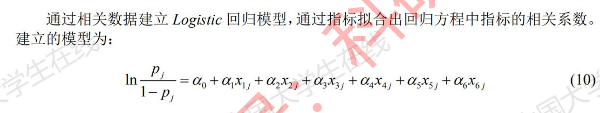

\n

[2020年国赛C题](<../../assets/images/2024/07/2020年国赛C题.docx>)[下载](<../../assets/images/2024/07/2020年国赛C题.docx>)

\n\n\n\n

在实际中，由于中小微企业规模相对较小，也缺少抵押资产，因此银行通常是依据信贷政策、企业的交易票据信息和上下游企业的影响力，向实力强、供求关系稳定的企业提供贷款，并可以对信誉高、信贷风险小的企业给予利率优惠。银行首先根据中小微企业的实力、信誉对其信贷风险做出评估，然后依据信贷风险等因素来确定是否放贷及贷款额度、利率和期限等信贷策略。

\n\n\n\n

某银行对确定要放贷企业的贷款额度为10~100万元；年利率为4%~15%；贷款期限为1年。附件1~3分别给出了123家有信贷记录企业的相关数据、302家无信贷记录企业的相关数据和贷款利率与客户流失率关系的2019年统计数据。该银行请你们团队根据实际和附件中的数据信息，通过建立数学模型研究对中小微企业的信贷策略，主要解决下列问题：

\n\n\n\n

(1) 对附件1中123家企业的信贷风险进行量化分析，给出该银行在年度信贷总额固定时对这些企业的信贷策略。

\n\n\n\n

(2) 在问题1的基础上，对附件2中302家企业的信贷风险进行量化分析，并给出该银行在年度信贷总额为1亿元时对这些企业的信贷策略。

\n\n\n\n

(3) 企业的生产经营和经济效益可能会受到一些突发因素影响，而且突发因素往往对不同行业、不同类别的企业会有不同的影响。综合考虑附件2中各企业的信贷风险和可能的突发因素（例如：新冠病毒疫情）对各企业的影响，给出该银行在年度信贷总额为1亿元时的信贷调整策略。

\n\n\n\n

**附件****1  **123家有信贷记录企业的相关数据

\n\n\n\n

**附件****2  **302家无信贷记录企业的相关数据

\n\n\n\n

**附件****3  **银行贷款年利率与客户流失率关系的2019年统计数据

\n\n\n\n

关于第一问，基本思想就是根据企业的信贷分级和是否违约来判断，怎么分配这些带宽，分配的比例是什么样子

\n\n\n\n

我们结合这些优秀的论文来看这几个子问题，我们先从模型建立比较简单的《2020C：银行基于大数据挖掘对中小微企业的信贷决策问题》开始入手

\n\n\n\n

[2020C：银行基于大数据挖掘对中小微企业的信贷决策问题](<../../assets/images/2024/07/2020C：银行基于大数据挖掘对中小微企业的信贷决策问题.pdf>)[下载](<../../assets/images/2024/07/2020C：银行基于大数据挖掘对中小微企业的信贷决策问题.pdf>)

\n\n\n\n

首先需要做好发票的整理和剔除，这篇文章在这一点上做的很值得学习，只不过我有一点觉得可以改进的地方，根据资料查询，“作废发票过多”有时候会影响企业的信誉度，当数量达到一定值的时候可以纳入考虑，我觉得需要一定程度的分析而非直接剔除（划掉，详情见下文）

\n\n\n\n\n\n\n\n

不对，以上说法作废，文章其实考虑了这一点，并且提取了6个分析因素

\n\n\n\n\n\n\n\n

并且在数据处理上，做好了仔细的清理过程，这在本篇论文的问题二上也有比较好的体现：除了除去作废发票的数据之外，还通过发票号比对（删除相同发票号）以及

\n\n\n\n\n\n\n\n

数据处理结束之后，按照相关数据建立Logistic回归模型，对于问题一和问题二来说都是如此：

\n\n\n\n\n\n\n\n

\n