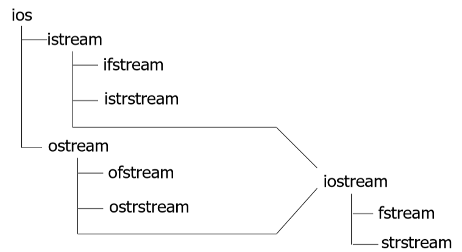
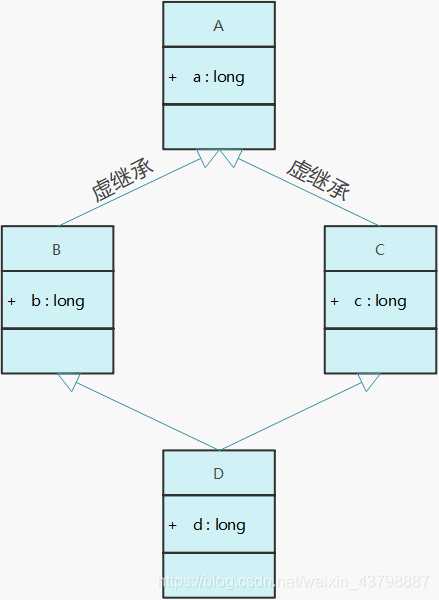
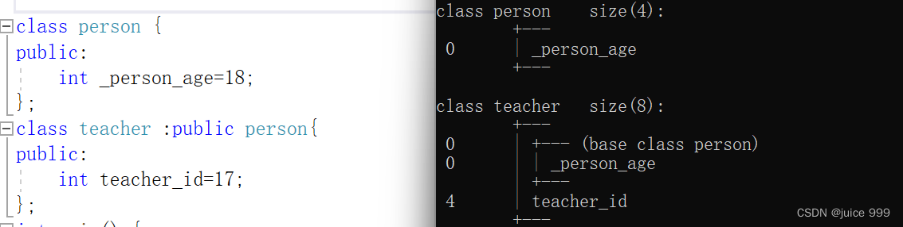
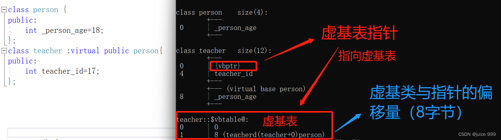
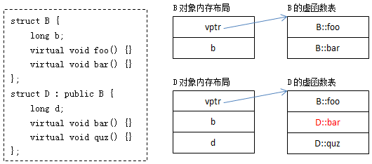
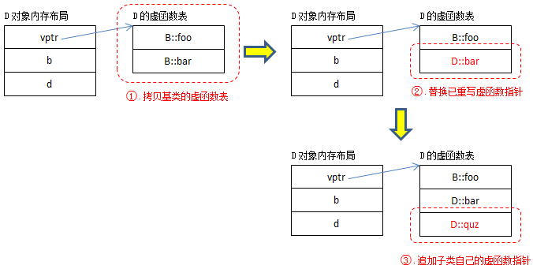
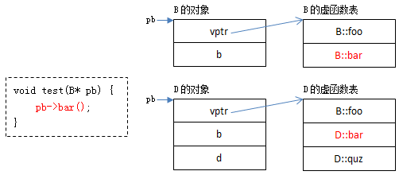
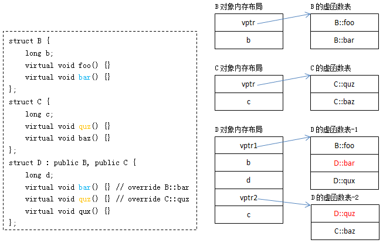
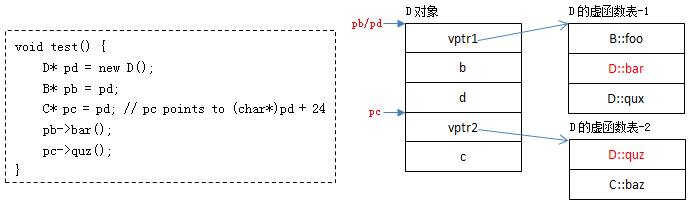

## 表达式

  1. C++中的表达式由以下三种组成:

     1. operand

     2. operator

     3. others

  2. 类型转换约定(强制类型转换)

     * coresion（不推荐，兼容C，默认的类型转换）

     * casting（包含static_cast,dynamic_cast,const_cast）区别如下

> 

> 
> **dynamic_cast** （主要就是父类转为子类带检查）
> 
> 

> 
> `dynamic_cast` can only be used with **pointers** and**references to classes (or with  `void*`)**. Its purpose is to ensure that the result of the type conversion points to a valid complete object of the destination pointer type.
> 
> 

> 
> This naturally includes _pointer upcast_  (converting from pointer-to-derived to pointer-to-base), in the same way as allowed as an _implicit conversion_.
> 
> 

> 
> But `dynamic_cast` can also _downcast_  (convert from pointer-to-base to pointer-to-derived) polymorphic classes (those with virtual members) if -and only if- the pointed object is a valid complete object of the target type. 适用于多态类的上转和下转
> 
> 

> 
> 注：**Compatibility note:**  This type of `dynamic_cast` requires _Run-Time Type Information (RTTI)_  to keep track of dynamic types. Some compilers support this feature as an option which is disabled by default. This needs to be enabled for runtime type checking using `dynamic_cast` to work properly with these types.  
> 兼容性说明：此类型 `dynamic_cast` 需要运行时类型信息 （RTTI） 来跟踪动态类型。某些编译器支持此功能作为默认禁用的选项。需要启用此功能才能用于运行时类型检查 `dynamic_cast` ，以便正确处理这些类型。
> 
> 

> 
> 对于“向下转型”有两种情况。
> 
> 

> 
> 一种是基类指针所指对象是派生类类型的，这种转换是安全的；
> 
> 

> 
> **另一种是基类指针所指对象为基类类型，在这种情况下dynamic_cast在运行时做检查，转换失败，返回结果为0；**
> 
> 

> 
> **static_cast  **（不带检查的强制转换）
> 
> 

**`static_cast` **可以在指向相关类的指针之间执行转换，不仅可以执行上行转换（从指针到派生到指针到基），还可以执行下转换（从指针到基到指针到派生）。在运行时不执行任何检查来保证正在转换的对象实际上是目标类型的完整对象。因此，由程序员来确保转换是安全的。另一方面，它不会产生 的 `dynamic_cast` 类型安全检查的开销。

Additionally, `static_cast` can also perform the following:  
此外， `static_cast` 还可以执行以下操作：

  * Explicitly call a single-argument constructor or a conversion operator.  
显式调用单参数构造函数或转换运算符。

  * Convert to _rvalue references_.  
转换为右值引用。

  * Convert `enum class` values into integers or floating-point values.  
将值转换为 `enum class` 整数或浮点值。

  * Convert any type to `void`, evaluating and discarding the value.  
将任意类型转换为 `void` ，计算并放弃该值。

  * 用于类层次结构中基类和派生类之间引用或指针的转换。  
进行上行转换（把派生类的指针或引用转换成基类表示）是安全的。  
进行下行转换（把基类的指针或引用转换成派生类表示），由于没有动态类型检查，不安全。

  * 用于基本数据类型之间的转换

  * 把空指针转换成目标类型的空指针

  * 把任何类型的表达式转换成void类型

赋值表达式

  1. C++为左值表达式

  2. 左值 = 右值表达式

     1. 左值:可以出现在赋值表达式左部的表达式，具有存放数据的空间。

     2. 类型不同时，先计算右值表达式的值，然后**转换为** 左值表达式，之后赋值

  3. 11中出现了右值表达式，`int && x = 1`

关于左值右值，更详细的我们有如下解释：

https://www.freezetheflame.cc/2024/04/12/c%e4%b8%ad%e7%9a%84%e5%87%a0%e4%b8%aa%e5%b7%a6%e4%b8%8e%e5%8f%b3/

其重要作用就是减少copy的开销对于程序的影响

剩下的表达式都不咋重要，去这里找：[2020-C++高级程序设计-C++ 表达式 - SpriCoder的博客](<https://spricoder.github.io/2020/07/01/2020-C-plus-plus-advanced-programming/2020-C-plus-plus-advanced-programming-C++%20%E8%A1%A8%E8%BE%BE%E5%BC%8F/>)

## Package Management

<https://docs.conan.io/2/tutorial/consuming_packages/build_simple_cmake_project.html>

包管理是c++项目开发的一个重要过程，以下是使用conan管理c++包的简单指南

https://www.freezetheflame.cc/2024/08/05/how-to-use-conan2-the-perfect-package-manager-for-c/

## 部分特殊符号

### 1\. ~

  1. 用在类中的析构函数之前，表示该函数是析构函数。

     1. 作用:释放对象的资源，销毁非static成员。

     2. 特点:

        1. 无参数无返回值。

        2. 每个类有且只有一个析构函数，不显式定义，系统会帮你生成一个缺省的析构函数。

        3. 析构函数不能重载，一次构造函数的调用一定有一次析构函数的调用。

  2. 用在数字或者整形变量之前，表示对该数取反操作，按照二进制取反。

### 2\. ->

  1. 用处:主要用于类类型的指针访问类的成员。

  2. A->B:

     1. A只能是指向类、结构、联合的指针。

### 3\. .

  1. 用处:主要用于访问类的成员。

### 4\. ||

  1. 用处:逻辑或

### 5\. &&

  1. 用处:逻辑与

6\. ：

  1. 用法一:表示机构内位域的定义(即一个变量占几个bit空间)

1  
2  
3| `typedef struct name{  
char a:4;  
};`  
---|---  

## 函数

  1. 函数包括

     1. 系统函数(库函数)

     2. 用户自己定义的函数

        1. 无参函数

        2. 有参函数

### 函数编译链接

  1. 编译只编译当前模块

1  
2  
3| `g(){//a.cpp  
f();//b.cpp  
}`  
---|---  

  2. 编译每个编译单元(`.cpp`)时是相互独立的，即每个cpp文件之间是不知道对方的存在的,`.cpp`编译成`.obj`后，link期时`a.obj`才会从`b.obj`中获得`f()`函数的信息(这就是为什么要预先)

  3. link时将编译的结果连接成可执行代码，主要是确定各部分的地址,将编译结果中的**地址符号全换成实地址**(call指令在a.cpp被编译时只是call f的符号，而不知道f确切的地址)

  4. 

### 函数重载：

函数重载是指在同一作用域内，可以有一组具有**相同函数名，不同参数列表** 的函数，这组函数被称为重载函数。重载函数通常用来命名一组功能相似的函数，这样做减少了函数名的数量，避免了名字空间的污染，对于程序的可读性有很大的好处。

关于C++究竟是如何解决编译重载同名函数冲突的可以看这个实验：[C++的函数重载 - 吴秦 - 博客园 (cnblogs.com)](<https://www.cnblogs.com/skynet/archive/2010/09/05/1818636.html>)

规则是一样的：“**返回类型** +**函数名** +**参数列表** ”。

#### **重载函数的调用匹配**

现在已经解决了重载函数命名冲突的问题，在定义完重载函数之后，用函数名调用的时候是如何去解析的？为了估计哪个重载函数最适合，需要依次按照下列规则来判断：

  * **精确匹配** ：参数匹配而不做转换，或者只是做微不足道的转换，如数组名到指针、函数名到指向函数的指针、T到const T；

  * **提升匹配** ：即整数提升（如bool 到 int、char到int、short 到int），float到double

  * **使用标准转换匹配** ：如int 到double、double到int、double到long double、Derived*到Base*、T*到void*、int到unsigned int；

  * **使用用户自定义匹配** ；

  * **使用省略号匹配** ：类似printf中省略号参数

因为这时候会面临一个问题：有一部分类型是可以相互转换的，在调用函数时可能会出现非精确匹配的重载函数调用方式。关于这边的规则很值得捯饬。

如果在最高层有多个匹配函数找到，调用将被拒绝（因为有歧义、模凌两可）

这时侯编译器就会报错，将错误抛给用户自己来处理：通过显示类型转换来调用等等（如f2(static_cast<int *>(0)，当然这样做很丑，而且你想调用别的方法时有用做转换）。上面的例子只是一个参数的情况，下面我们再来看一个两个参数的情况：

尤其在之后引入模版参数之后，函数重载就显得更加复杂了，之后有机会会详细展开来讲一下

### 函数调用的机制（在有同名函数的时候）

即**内层作用域的函数会隐藏外层的同名函数** ！**同样的派生类的成员函数会隐藏基类的同名函数** 。这很好理解，变量的访问也是如此，如一个函数体内要访问全局的同名变量要用“::”限定。

为了查找候选函数集，一般采用**深度优选** 搜索算法：

step1：从函数调用点开始查找，逐层作用域向外查找可见的候选函数  
step2：如果上一步收集的不在用户自定义命名空间中，则用到了using机制引入的命名空间中的候选函数，否则结束

在收集候选函数时，如果调用函数的实参类型为非结构体类型，候选函数仅包含调用点可见的函数；如果调用函数的实参类型包括类类型对象、类类型指针、类类型引用或指向类成员的指针，候选函数为下面集合的并：

  * (1)在调用点上可见的函数;

  * (2)在定义该类类型的名字空间或定义该类的基类的名字空间中声明的函数;

  * (3)该类或其基类的友元函数;

下面我们来看一个例子更直观：

    
    void f();
void f(int);
void f(double, double = 314);
names pace N
{ 
    void f(char3 ,char3);
}
classA{
    public: operat or double() { }
};
int main ( )
{
    using names pace N; //using指示符
    A a;
    f(a);
    return 0;
}

函数模板有几种方式被实例化：  
1、全特化  
非常遗憾的告诉大家，函数模板全特化后的函数，并不参与重载。这也是在大牛们的文章中“T.144: Don’t specialize function templates” 和“Why Not Specialize Function Templates? ”中都不建议使用函数模板的全特化而是强烈推荐使用普通函数的重载。  
当然，如果一定要使用特化的方法，推荐是使用类模板封装这个函数模板，再进行类似的操作。  
2、显式实例化  
显示实例已经类似于普通函数了，这个其实和写普通函数没啥质的区别了。通过一般是库的开发者为了提高编译速度而应用的一种技巧。

函数模板的偏特化没有实际意义，所以其没有偏特化的处理。这就回到了教科书上的说法：  
1、优先匹配普通函数  
2、普通模板函数  
3、如果匹配到2，其拥有全特化模板函数，则使用其。

接下来我们跟着本文引用的作者来看一个例子

    
    #include <iostream>
int TestOL(int d) { std::cout << "call TestOL int: " << d << std::endl; return 0; }
void TestOL(double d) { std::cout << "call TestOL double:" << std::endl; }
int TestOL(int d, int d1) { std::cout << "call TestOL int,int " << d << "," << d1 << std::endl; return 0; }
template<typename T>
int TestOL(T t) { std::cout << "call template TestOL T:" << t << std::endl; return 0; }
template<typename T1,typename T2>
int TestOL(T1 t1,T2 t2) { std::cout << "call template TestOL t1,t2:"<<t1<<","<<t2 << std::endl; return 0;
}
//模板函数与int函数重载，采用普通int函数，所以模板函数的全特化就无法使用
template<>
int TestOL(int t) { std::cout << "call template specialize TestOL:"<<t << std::endl;  return 0;
}
template int TestOL(int t);
//C++标准要求是如果一个模板被显示实例化后，则不能被全特化，被忽略。这可以做为一个技巧，只在明确显示实例化的编译单元进行非特化处理
//一个函数模板显示实例化只能有一次
template int TestOL<int, int>(int t, int t1);//注意，不能有实现

void TestFuncOL() {
    int d = 111;
    TestOL(100);
    TestOL(d);
    TestOL(d,100);
    double db = 3.3;
    float df = 3.f;
    TestOL(db);
    TestOL(df);
   TestOL(db,df);
   TestOL<int>(1);//显示调用全特化版本
   TestOL(db, 6);
   TestOL<int,int>(1,6);//调用显示实例化版本
}
int main()
{
    TestFuncOL();
    return 0;
}

回顾一下偏特化，就是将模板参数的部分进行特化也就是显示指定类型。对函数来说，这和写一个重载的函数有何不同？而且还不如[函数重载](<https://so.csdn.net/so/search?q=%E5%87%BD%E6%95%B0%E9%87%8D%E8%BD%BD&spm=1001.2101.3001.7020>)更容易理解和实现。下面看几个小例子：

可以在这个小例子上自行扩大测试范围，就会有清晰的理解了。所以说偏特化在函数模板上真得是没啥用处。  
另外需要注意编译通过与具体调用实现的问题，这个就涉及到模板内部的延迟加载的问题了，这个问题与重载有关系，但又有不同，有兴趣可以查看下相关的书籍。  
所以说，一句话，简单着来，不要自己给自己没事儿找事儿。

揭晓结果：

    
    call TestOL int: 100
call TestOL int: 111
call TestOL int,int 111,100
call TestOL double:
call template TestOL T:3
call template TestOL t1,t2:3.3,3
call template specialize TestOL:1
call template TestOL t1,t2:3.3,6
call template TestOL t1,t2:1,6

当你在特化的模版函数和非特化的模版函数中进行抉择时，务必要考虑函数的顺序问题

    
    //1:标准模板
template<typename T>
void testspec(T t) { std::cout << "call template testspec T:" << t << std::endl; }
//2:此处和4相同
template<> void testspec<>(int* t) { std::cout << "call template testspec *int, t:" << *t << std::endl; }
//3:此时调用此处
template<typename T>
void testspec(T* t) { std::cout << "call template testspec *T, t:" << *t << std::endl; }
//4:此处和2相同，解开注释，并把2注释掉后会调用此处。
//template<> void testspec<>(int *t) { std::cout << "call template testspec *int, t:" << *t << std::endl; }
void TestS()
{
    int data = 10;
    int* ptr = &data;
    testspec(ptr);
}

把2和4调换一下位置，则会发现产生的结果不同，他们的运行结果如标注一中所示。原因在于二者的编译虽然会产生几乎相同的结果，但是，由于重载的产生导致的结果不同。在上面的代码中，注释未解开时，2是1的全特化，2和3此时产生重载，3更合适，故而会调用3的情况；但在注释2并打开4注释时，1和3重载，4是3的特化，所以调用4。此处一定要明白，重载时，特化的函数是不参与重载的，即可清楚。

### lambda函数

Lambda表达式是一种在被调用的位置或作为[参数传递](<https://so.csdn.net/so/search?q=%E5%8F%82%E6%95%B0%E4%BC%A0%E9%80%92&spm=1001.2101.3001.7020>)给函数的位置定义匿名函数对象（闭包）的简便方法。Lambda表达式的基本语法如下：

    
    [capture list] (parameter list) -> return type { function body }

语法规则：[lambda表达式](<https://so.csdn.net/so/search?q=lambda%E8%A1%A8%E8%BE%BE%E5%BC%8F&spm=1001.2101.3001.7020>)可以看成是一般函数的函数名被略去，返回值使用了一个 -> 的形式表示。唯一与普通函数不同的是增加了“捕获列表”。

这里有一个很好的例子来说明lambda函数的实际运用方式，这一段代码在N皇后问题中应用于DFS的搜索和回溯

    
    class Solution {
public:
    vector<vector<string>> solveNQueens(int n) {
        vector<vector<string>> res;
        vector<string> board(n, string(n, '.'));
        vector<int> cols(n, 0), diag1(2*n-1, 0), diag2(2*n-1, 0);
        function<void(int)> dfs = [&](int row) {
            if (row == n) {
                res.push_back(board);
                return;
            }
            for (int col = 0; col < n; ++col) {
                if (cols[col] || diag1[row+col] || diag2[row-col+n-1]) continue;
                cols[col] = diag1[row+col] = diag2[row-col+n-1] = 1;
                board[row][col] = 'Q';
                dfs(row+1);
                board[row][col] = '.';
                cols[col] = diag1[row+col] = diag2[row-col+n-1] = 0;
            }
        };
        dfs(0);
        return res;
    }
};

  * `function<void(int)> dfs`: 这个类型定义了一个名为 `dfs` 的 lambda 函数，它接受一个整数参数 `row`，并返回 void。这里的 `void` 表示这个函数不返回任何值。

  * `[&]`: 这是捕捉列表中的一个符号，表示这个 lambda 函数会捕捉外部变量的引用。这意味着这个 lambda 函数可以访问和修改外部变量的值。

## C++命名空间

### 命名空间的理念和作用

  1. 理念

     1. 兼容

     2. 快速:理解、实现

  2. 作用:进一步解决了全局变量/函数的名冲突

  3. 在约束作用域方向，替代static

  4. 细节特点:

     1. 别名

     2. 全局

     3. 开放

     4. 可嵌套

     5. 可重载

  5. 不可以在同一作用域两次使用using-directive

    
    namespace L{
    int k;
    void f(int);
}
//using-declaration
using L::k;
using L::f;
k = 0;
f(6);
//using-directive
k = 0;
f(6);

### 命令空间的理念

  1. 兼容

     * link不冲突

     * 程序中定义新名称时不必担心与其他(比如库)冲突

     * 在库里增加名字，不影响用户

     * 不同库里含有同名元素，可选择

     * 不修改函数的前提下，可消解名冲突

     * 避免命名空间的名字之间发生冲突

     * 使名字空间可以处理标准库

  2. 原则：

     * 防冲突

     * 遇冲突，可选择

     * 易扩展，与用户独立

    
    //错误
//不要在同一个作用域中两次使用using-directive
using namespace B;
using namespace A;
…….
void g()
{ 
    f('1');
}

## C++输入输出

在流式输入输出中，主要是以下的库函数：

对象| 功能  
---|---  
istream:cin| 处理输入  
ostream:cout| 处理输出  
ostream:cerr| 处理错误  
ostream:clog| 保证log  

### 2.1. 输入原理

  1. 程序的输入都键入一个缓冲区，即输入缓冲区。

  2. 键盘输入结束后，会将数据存入缓冲区，之后cin函数直接从输入缓冲区取数据

  3. 问题在于:缓冲区中有残留数据的时候，cin输入流直接从缓冲区拿数据。

### 2.2. cin

  1. `>>`是流提取符，以空格，\\\t(Tab),\\
(回车)为终止

  2. 往往使用来赋值给变量

  3. cin的变量类型可以为int、float、char、char*、string等诸多类型。

#### 2.2.1. 数组输入

    
    //已知长度数组读入
for(int i = 0;i < n; i++){
cin >> nums[i]
}
//未知长度数组读入
while(cin >> n){//如果没有数字输入则会为NULL
nums[i] = n;
i ++;
}

#### 2.2.2. 解决格式化输入问题

    
    //Ctrl + Z 表示输入结束
//读取(0,0),(1,1)
char c;//用来读取无用的
int x1,x2,y1,y2
cin >> c >> x1 >> c >> x2 >> c >> c >> c >> y1 >> c >> y2 >> c >> c;(这个很重要)

#### 2.2.3. get方法

    
    int get();
istream& get(char& c);
istream& get(char* s, streamsize n);
istream& get(char* s, streamsize n, char delim);
istream& get(streambuf& sb);
istream& get(streambuf& sb, char delim);

  1. 结束符默认为enter，结束字符串的读写

  2. 字符串最后一个为`\\0`，并且对空格不敏感。

  3. get方法**并不会将结束符从缓冲区丢弃** ：务必注意是结束符！未必是回车。

    
    //按照字符读取
cin.get(x);
cin.get(y);//\
也可以读取到
//cin.get == c语言中的getchar()
//按照字符串读取
char ch1,ch2[10];
cout<<"请输入字符串："<<endl;
cin.get(ch2,6);//在不遇到结束符的情况下，最多可接收6-1=5个字符到ch2中，注意结束符为默认Enter
cin.get(ch1);//或ch1 = cin.get();
out<<ch2<<endl;
cout<<ch1<<"\
"<<(int)ch1<<endl;

  1. 直接回车在上面程序中会出现错误输出(越界)，处理方法`cin.clear()`:但是不会清理终止符。

    
    //调整结束符
cin.get(ch, 3, 'a');// 结束符为'a'，直接输入a(enter)
cin.get(ch2);
//注意cin.get()的返回值的问题
cin.get(ch, 3, 'a'); //此处输入a(enter)
ch2 = cin.get(); //注意与cin.get(ch2)不同
cout << ch2 << ' ' << (int)ch2 << endl;
//cin.get()
cin.get();//用来舍弃输入中不需要的字符(包含回车)，用来弥补不足，用来避免下次读入的时候再次读入

#### 2.2.4. cin.getline()

  1. `cin.getline(字符数组名,接收长度，结束符)`

  2. cin.get()超长后不会影响cin的操作，而cin.getline()如果超长会导致之后cin的错误。

### 2.2.5. getline()

  1. `getline(istream is,string str,结束符)`

    
    getline(cin,str);

### 清除缓冲区

  1. `cin.ignore(1024,'\\n');`

  2. `cin.ignore(std::numeric_limits<std::streamsize>::max(), '\\n');`

### 重定向

    
    ifstream in ("in. txt");
streambuf * cinbuf = cin. rdbuf ();//save old buf
cin. rdbuf ( in. rdbuf ());//redirect cin to in. txt !
ofstream out (" out. txt ");
streambuf * coutbuf = cout. rdbuf (); //save old buf
cout. rdbuf ( out. rdbuf ()); //redirect cout to out. txt !
string word;
cin >> word; //input from the file in. txt 
cout << word << " ";//output to the file out. txt
cin. rdbuf ( cinbuf );//reset to standard input again
cout. rdbuf ( coutbuf ); //reset to standard output again
cin >> word; //input from the standard input
cout << word; //output to the standard input

重载<<运算符：

    
    #include<iostream>
using namespace std;
class CPoint2D{
    public:
        double x, y;
        friend std::ostream& operator << (std::ostream&, CPoint2D &);
};
//全局函数
std::ostream& operator << (std::ostream& out,  CPoint2D& a){//引用类型保证能递归显示
    out << a.x << "," << a.y << std::endl;
\treturn out;
}
class CPoint3D: public CPoint2D
{   double z;

};
class CPoint3D: public CPoint2D
{   double z;
    friend ostream& operator << (ostream &, CPoint3D &);
};
ostream& operator << (ostream& out,  CPoint3D & b){
    out << b.x << "," << b.y <<","  << b.z << endl;
\treturn out;
};
CPoint2D a;
int main() {
    cout << a;
    CPoint3D b;
    cout << b;//只显示b.x和b.y，而没显示b.z
    return 0;
}
//问题:3D对象被2D指针指向，cout调用了2D的版本，解决:虚化

## c++中的数据

### 抽象数据类型 ADT

  1. Mathmatical Model

  2. 约束着我们的操作：类型决定了取值

  3. 类型系统:

     1. 强/弱:是指类型严格与否，弱类型允许进行隐式转换

     2. 静/动:静是指在编译之前就已经确定类型，而动是指在编译过程中确定类型。

     3. compiler + linker

  4. C++的特征:

     1. 强类型(通过特殊的手段是可以打破强类型的手段)（类型擦除）

     2. 动/静结合

     3. 类型安全不能代替测试

  5. 动态类型和静态类型的区别

     1. java:“666”/3，编译报错

     2. python: “666”/3，运行报错

### 类型擦除& RAII in c++

鸣谢博客：[C++: Type Erasure | Fu Zhe's Blog (fuzhe1989.github.io)](<https://fuzhe1989.github.io/2017/10/29/cpp-type-erasure/>)

Type Erasure，直译就是“类型擦除”。什么时候需要擦除类型？当我们想令一些代码具备多态性质时，我们往往没办法保留对象本身的类型，而需要用一种通用的类型去使用它们，这个时候，就需要擦除对象原有的类型。

### Type Erasure的几种形式

#### `void*`

在C语言中，很多通用算法函数都会使用`void*`作为参数类型，比如`qsort`，它的原型是：

    
    void qsort (void* base, size_t num, size_t size, int (*compare)(const void*,const void*));

为了使`qsort`有处理多种类型的能力，它只能把参数类型设为`void*`，这样我们可以用同一个`qsort`函数，处理各种各样的类型。代价就是对象原有的类型被擦除了，我们只能看到`void*`

这种方法的缺点是，它不能保证类型安全。

    
    int int_compare(const void* a, const void* b) {
    return *(const int*)a - *(const int*)b;
}
int str_compare(const void* a, const void* b) {
    return strcmp((const char*)a, (const char*)b);
}

假设我们传递了错误的`compare`，谁能知道这件事？编译器不知道，因为你把类型擦除掉了。你自己也不知道，因为代码就是你写的。测试程序可能知道，也可能不知道，因为这个时候程序的行为是未定义的。

### 继承

在面向对象语言中，继承是最常见的Type Erasure。

    
    interface Counter {
    public void Increase(int v);
    public void Decrease(int v);
    public int Value();
};
...
public class Test {
    public static void down(Counter c) {
        int count = 0;
        int oldValue = c.Value();
        while (c.Value() != 0) {
            c.Decrease(1);
            count++;
        }
        Assert.assertEqual(count, oldValue);
    }
};

在`Test.down`中，我们只知道`c`的类型是`Counter`，但不知道它是哪个实现类型，这里它的类型就被擦除了。

继承当然是比`void*`要好的，因为我们操作对象时调用的是对象具体的实现API，换句话说，我们只擦除了调用处对象的类型，实际上它并没有丢掉自己的类型，也保证了类型安全性。

继承的问题在于，它的侵入性，即它要求每个实现类型都继承自某个基类。在很多情况下，这是很难做到的，或者是很别扭的。

如果一个东西，走路像鸭子，叫声也像鸭子，那么它就是鸭子。换句话说，如果一个东西，满足我们对鸭子的所有要求，那么它就是鸭子。如果一个`T`，满足我们对`X`的所有要求，那么它就是`X`。这就是duck typing，即鸭子类型。

Python中大量应用了duck typing：

    
    class RedApple:
    def color(self):
        return 'red'
    def round_like(self):
        return True
def map_by_color(items):
    ret = defaultdict(list)
    for item in items:
        ret[item.color()].append(item)
    return ret
color_map = map_by_color([..., RedApple(), ...])

在`map_by_color`中，我们对`items`有两项要求：

  1. 可遍历。

  2. 其中每个元素都有`color`方法。

但不要求`items`或其中每个`item`继承自哪个特定的接口。

这也是Type Erasure，但明显比继承来得更自由。当然自由都是有代价的，duck typing的代价就是它的运行时性能损失。Python中每个对象都会保留自己的类型信息，在调用时进行动态绑定。Go的`interface`有着类似的用法，也有着类似的优缺点。

C++的模板也是一种duck typing：

    
    template <typename C>
int CountByColor(const C& container, Color color) {
    int count = 0;
    for (const auto& item: container) {
        if (item.Color() == color) {
            ++count;
        }
    }
    return count;
}

这里面有个模板参数`C`，我们对它的要求是：

  1. 可遍历，具体来说是支持`begin(container)`和`end(container)`两种API。

  2. 遍历出来的每个元素有`T Color() const`方法，且`T`与`Color`类型有合适的`operator==`函数存在。

所有满足这个条件的`C`都可以作为`CountByColor`的参数类型。

当然C++的模板与Python的duck typing还是有很大区别的，因为它并没有真的擦除掉元素类型：`C`是`CountByColor`原型的一部分。这样我们其实一直都保留着元素的具体类型信息，好处：

  1. 完整的类型安全性，没有任何环节丢掉了类型信息。

  2. 因此不需要动态绑定，所有环节都是静态的，没有运行时性能损失。

但也有坏处：

  1. 模板类型会作为模板函数或模板类的原型的一部分，即`vector<int>`和`vector<double>`是两个类型，没办法用一个类型来表示，也就没办法实现出上面Python例子中的`map_by_color`函数。

  2. 每次用不同的参数类型来实例化模板时，都会新生成一份代码，导致编译出来的二进制文件很大。

### C++中结合继承与Template的Type Erasure

在C++中我们可以结合继承与Template，实现出一种Type Erasure，它既有duck typing的优点，又可以将不同类型用同一种类型表示。

详情可以参考：[C++: Type Erasure | Fu Zhe's Blog (fuzhe1989.github.io)](<https://fuzhe1989.github.io/2017/10/29/cpp-type-erasure/>)

## C++数组

借由数组的机会。首先来辨析一下在c++中所使用到的内存模型，有具体如下的一些分区：

一个正在运行着的C编译程序占用的内存分为**代码区、初始化数据区、未初始化数据区、堆区 和栈区** 5个部分。

（1）代码区（text segment）。代码区指令根据程序设计流程依次执行，对于顺序指令，则只会执行一次（每个进程），如果反复，则需要使用跳转指令，如果进行递归，则需要借助栈来实现。

代码区的指令中包括操作码和要操作的对象（或对象地址引用）。如果是立即数（即具体的数值，如5），将直接包含在代码中；如果是局部数据，将在栈区分配空间，然后引用该数据地址；如果是BSS区和数据区，在代码中同样将引用该数据地址。

（2）全局**初始化数据区** /静态数据区（Data Segment）。只初始化一次。

（3）**未初始化** 数据区（BSS）。在运行时改变其值。

（4）栈区（stack）。由编译器自动分配释放，存放函数的参数值、局部变量的值等。其操作方式类似于数据结构中的栈。每当一个函数被调用，该函数返回地址和一些关于调用的信息，比如某些寄存器的内容，被存储到栈区。然后这个被调用的函数再为它的自动变量和临时变量在栈区上分配空间，这就是C实现 函数递归调用的方法。每执行一次递归函数调用，一个新的栈框架就会被使用，这样这个新实例栈里的变量就不会和该函数的另一个实例栈里面的变量混淆。

（5）堆区（heap）。用于**动态内存分配** （alloc）。堆在内存中位于bss区和栈区之间。一般由程序员分配和释放，若程序员不释放，程序结束时有可能由OS 回收。

**一个进程在运行过程中，代码是根据流程依次执行的，只需要访问一次，当然跳转和递归有可能使代码执行多次，而数据一般都需要访问多次，因此单独开辟 空间以方便访问和节约空间。**  
**临时数据及需要再次使用的代码在运行时放入栈区中，生命周期短。**  
**全局数据和静态数据有可能在整个程序执行过程中都需要访问，因此单独存储管理。**  
**堆区由用户自由分配，以便管理。**

接下来根据一段代码来解释一下代码在分配空间时候的具体行为，并且总结一下以上的知识点

    
     //main.cpp
 int a = 0;        //a在全局已初始化数据区
 char *p1;        //p1在BSS区（未初始化全局变量）
 int main()
 {
   int b;        //b在栈区
   char s[] = "abc";  //s为数组变量，存储在栈区，
   //"abc"为字符串常量，存储在已初始化数据区
   char *p1，*p2;    //p1、p2在栈区
   char *p3 = "123456";  //123456\\0在已初始化数据区，p3在栈区
   static int c =0；    //C为全局（静态）数据，存在于已初始化数据区
   //另外，静态数据会自动初始化
   p1 = (char *)malloc(10);//分配得来的10个字节的区域在堆区
   p2 = (char *)malloc(20);//分配得来的20个字节的区域在堆区
   free(p1);
   free(p2);
   return 0;
 }

之后我们回到数组的使用

  1. 数组作为参数`int a[]`

  2. 特征:

     1. 相同类型

     2. **连续存储** :0 - n-1

  3. 数组名的含义:

  * `int A[6]`的A是代表6个int的集合

  * `sizeof(A)`:6 * sizeof(int)

### 1.1. 一维数组

  1. 类型定义`T name[number]`

  2. 赋值操作，部分赋值的话，之后按照默认值

  3. 函数接口:`void f(int a[], int n);//这里面的a的身份已经发生了变化`

  * 此时a已经不知道有多少个元素了

  * C++是允许数组的越界(给予语言表达极大的灵活性)，不检查数组的越界

  * 元素个数需通过参数**显式** 给出，不可以通过sizeof来获得:`void f(char a[]);`

    
    char s1[]="abc";
cout << s1;//实际上是{'a','b','c','\\0'}
char s2[]={'a','b','c'};
cout << s2;//错误

  4. 读取字符数组的时候，我们可以根据`\\0`来判断是否字符串结束

  5. 为什么会出现"烫烫烫":`0xCC`是烫(在VS下由于未初始化，VS为了帮助你发现问题，对于未使用的内存空间我们都使用0xCC填充，0xCC是指3号中断)

  * 0xCC:烫

  * 0xCD:屯:heap(在栈部分出现的额问题)

  * 数组未初始化:在对应位置填充0xCC,其上下文填充0xFD

  * 释放内存，如果没有请0，则会帮你将内存中的值清理成一个特定的值，用来防止内存为清零。

    
    //默认初始化
int a[5] = {};    //[0, 0, 0, 0, 0]
//全部初始化为0
int a[5] = {0};    //[0, 0, 0, 0, 0]
//c++11新写法
int a[5]{};    //[0, 0, 0, 0, 0]
//注意，想要整型数组 全部初始化为1的时候不能粗暴的设置为 
int a[5] = {1};    //[1, 0, 0, 0, 0]
// 因为 数组初始化列表中的元素个数小于指定的数组长度时， 不足的元素以默认值填补。
//可以分别赋值
int a[5] = {1,1,1,1,1}; //[1,1,1,1,1]

数组的默认初始化:如果不明确指出初始化列表，那么基本类型**不会被初始化**(全局变量和静态变量除外)，所有内存都是脏数据；且自定义的类类型会为每个元素调用默认构造函数进行初始化  

    
    int a[5]{};
a[6];      //32766
a[10];    //1474921429
// Xcode会提示 Array index 10 is past the end of the array (which contains 5 elements)。虽然不会爆红，但是Xcode提示越界了。这在程序中也是需要特别注意的,越界时会取到脏数据。
string str[5];     //["","","","",""]
string str1[5] = {"","2","",""};     //["","2","',"",""]
string str2[5] = {"a"};     //["a","","","",""]

## 动态内存

  1. 操作系统中内存的一种形式

     1. 栈空间:局部变量、值传递参数

     2. 堆空间:动态内存分配的位置

  2. C:早在C之中已经有malloc和free等对动态内存操纵的函数。

     1. malloc() – memory allocation

     2. free() – free memory

  3. C++

     1. new – create space for a new object (allocate)

     2. delete – delete this object (free)

在c++中，程序员可以自己管理动态内存资源的分配，不过不恰当的管理也可能导致内存的泄漏

### 动态对象

  1. 在heap中创建

  2. new/delete(constructor/destrutor)，可以被重载

  3. 为什么要引入new和delete操作符:因为新的操作符可以解决初始化函数的析构函数的调用的问题

malloc和free是不会调用构造和析构函数的

动态对象数组的创建与撤销

    
    A *p;
p = new A[100];
delete []p;

  2. 注意:

     1. 不能显式初始化，相应的类必须有默认构造函数

     2. 初始化部分是修改比较多的

  3. 在堆上分配的内存默认不进行初始化

     1. `int *p1 = new int[5];` 默认不进行初始化

     2. `int *p2 = new int[5]();`进行默认初始化

     3. `int *p2 = new int[5]{0,1,2,3,4}`:进行显式对应函数初始化

  4. 注意:`delete []p`中的[]不可以省略

     1. 如果省略的话，是删除了数组的第一个元素。并且会破坏其中的存储数组长度

     2. `new int[100]`就可以直接delete，因为不是复杂对象

在c++11以及17中引入了更加丰富的智能指针，由于内存的自动释放，可以有效避免很多内存泄漏的情况

## C++指针与引用（classic&modern ones）

### 指针定义与基本操作

  1. 定义:`<基类型>*<指针变量>`:`void*`:可以作为所有指针的接口，void的指针类型可以被赋值为任何类型的指针。

    
    int a = 9;
int* p = &a;
int* q = p;//指向同一地址
*p = 8;
void* p1 = p;
double* q1;
p1 = q1;//是允许的

  3. 所有的指针都要初始化(Pointer Literal)

     * C++会初始化指针为0(默认初始化)，如果编译器发现指向为0，则报错，因为0地址是保留空间

     * 不允许:`char *p = (void*)`

     * 在新的C++部分中，我们引入了`nullptr`:作为不依赖任何值的指针。`Pointer p = nullptr;`

同样的，指针也带有类型，不同类型的指针所指向的地址不能相互转化

    
    int i = 88;
double d = 55.66;
int * iPtr = &i;    // int pointer pointing to an int value
double * dPtr = &d; // double pointer pointing to a double value

iPtr = &d;   // ERROR, cannot hold address of different type
dPtr = &i;   // ERROR
iPtr = i;    // ERROR, pointer holds address of an int, NOT int value

int j = 99;
iPtr = &j;  // You can change the address stored in a pointer

  1. void*

     1. 只管理地址信息`void *p;`

     2. 是指针类型的公共接口

     3. 任何操作须做强制类型转换(不然是没有意义的)

### memset()的部分具体解释

  1. 通常是为申请内存进行初始化的操作

  2. 可以将int数组的空间初始化为0或者-1

  3. 函数原型:`memset(void *s,int ch,size_t n);`

    
    struct A{...};
A a;
memset(&a,sizeof(A));
int A[100];
memset(&a[0],100);
int arr[100] = {0};
memset(arr,sizeof(arr));
memset(arr,100 * sizeof(int));//arr作为参数传递时

### Null Pointers

You can initialize a pointer to 0 or `NULL`, i.e., it points to nothing. It is called a _null pointer_. Dereferencing a null pointer (`*p`) causes an `STATUS_ACCESS_VIOLATION` exception.

    
    int * iPtr = 0;         // Declare an int pointer, and initialize the pointer to point to nothing
cout << *iPtr << endl;  // ERROR! STATUS_ACCESS_VIOLATION exception

int * p = NULL;         // Also declare a NULL pointer points to nothing

Initialize a pointer to null during declaration is a good software engineering practice.

C++11 introduces a new keyword called `nullptr` to represent null pointer.

### modern pointer

C++11 introduced the following smart pointers:

  1. `unique_ptr`: A unique ownership smart pointer, which ensures that only one owner has access to the managed object.

  2. `shared_ptr`: A shared ownership smart pointer, which allows multiple owners to share access to the managed object.

These smart pointers were designed to help prevent memory leaks and dangling pointers by automatically managing  
the lifetime of objects through their use.

Here are some key features of these smart pointers:

  * `unique_ptr`:  
\+ Owns the managed object exclusively.  
\+ Deletes the object when it goes out of scope or is reset.  
\+ Can't be copied, only moved.

  * `shared_ptr`:  
\+ Shares ownership with other `shared_ptr`s.  
\+ Deletes the object when the last shared pointer to it goes out of scope or is reset.  
\+ Can be copied and assigned.

C++14 added additional features to smart pointers, including:

  1. Support for move semantics in `unique_ptr`.

  2. The ability to use a custom deleter with `shared_ptr`.

Overall, C++11's introduction of smart pointers has made it easier to write safe, memory-efficient code in C++.

C++程序设计中使用堆内存是非常频繁的操作，堆内存的申请和释放都由程序员自己管理。程序员自己管理堆内存可以提高了程序的效率，但是整体来说堆内存的管理是麻烦的，C++11中引入了智能指针的概念，方便管理堆内存。使用普通指针，容易造成堆内存泄露（忘记释放），二次释放，程序发生异常时内存泄露等问题等，使用智能指针能更好的管理堆内存。

从较浅的层面看，智能指针是利用了一种叫做RAII（资源获取即初始化）的技术对普通的指针进行封装，这使得智能指针实质是一个对象，行为表现的却像一个指针。

智能指针的作用是防止忘记调用delete释放内存和程序异常的进入catch块忘记释放内存。另外指针的释放时机也是非常有考究的，多次释放同一个指针会造成程序崩溃，这些都可以通过智能指针来解决。

额外补充一下weak_ptr的用法

`weak_ptr` is a type of smart pointer that allows you to observe an object without assuming ownership or control  
over its lifetime. It's often used in situations where you need to access an object while avoiding strong  
references, which can prevent the object from being deleted.

### shared_ptr的使用

shared_ptr多个指针指向相同的对象。shared_ptr使用引用计数，每一个shared_ptr的拷贝都指向相同的内存。每使用他一次，内部的引用计数加1，每析构一次，内部的引用计数减1，减为0时，自动删除所指向的堆内存。shared_ptr内部的引用计数是线程安全的，但是对象的读取需要加锁。

  * 初始化。智能指针是个模板类，可以指定类型，传入指针通过构造函数初始化。也可以使用make_shared函数初始化。不能将指针直接赋值给一个智能指针，一个是类，一个是指针。例如std::shared_ptr<int> p4 = new int(1);的写法是错误的

  * 拷贝和赋值。拷贝使得对象的引用计数增加1，赋值使得原对象引用计数减1，当计数为0时，自动释放内存。后来指向的对象引用计数加1，指向后来的对象。

  * get函数获取原始指针

  * 注意不要用一个原始指针初始化多个shared_ptr，否则会造成二次释放同一内存

  * 注意避免循环引用，shared_ptr的一个最大的陷阱是循环引用，循环，循环引用会导致堆内存无法正确释放，导致内存泄漏。循环引用在weak_ptr中介绍。

  * 以下是在bootcamp中设计的有关shared_ptr的基本介绍

    
    /**
 * @file shared_ptr.cpp
 * @author Abigale Kim (abigalek)
 * @brief Tutorial code for usage of a shared pointer.
 */
// In this file, we'll talk about std::shared_ptr, which is a C++ smart pointer.
// See the intro of unique_ptr.cpp for an introduction on smart pointers.
// std::shared_ptr is a type of smart pointer that retains shared ownership of
// an object through a pointer. This means that multiple shared pointers can
// own the same object, and shared pointers can be copied.
// Includes std::cout (printing) for demo purposes.
#include <iostream>
// Includes std::shared_ptr functionality.
#include <memory>
// Includes the utility header for std::move.
#include <utility>
// Basic point class. (Will use later)
class Point {
public:
  Point() : x_(0), y_(0) {}
  Point(int x, int y) : x_(x), y_(y) {}
  inline int GetX() { return x_; }
  inline int GetY() { return y_; }
  inline void SetX(int x) { x_ = x; }
  inline void SetY(int y) { y_ = y; }
private:
  int x_;
  int y_;
};
// Function that modifies a Point object inside a shared pointer
// by passing the shared pointer argument as a reference.
void modify_ptr_via_ref(std::shared_ptr<Point> &point) { point->SetX(15); }
// Function that modifies a Point object inside a shared pointer
// by passing the shared pointer argument as a rvalue reference.
void modify_ptr_via_rvalue_ref(std::shared_ptr<Point> &&point) {
  point->SetY(645);
}
void copy_shared_ptr_in_function(std::shared_ptr<Point> point) {
  std::cout << "Use count of shared pointer is " << point.use_count()
            << std::endl;
}
int main() {
  // This is how to initialize an empty shared pointer of type
  // std::shared_ptr<Point>.
  std::shared_ptr<Point> s1;
  // This is how to initialize a shared pointer with the default constructor.
  std::shared_ptr<Point> s2 = std::make_shared<Point>();
  // This is how to initialize a shared pointer with a custom constructor.
  std::shared_ptr<Point> s3 = std::make_shared<Point>(2, 3);
  // The specific syntax for checking whether a smart pointer is empty is
  // covered in unique_ptr.cpp (line 56). Note that s1 is empty, while s2 and
  // s3 are not empty.
  std::cout << "Pointer s1 is " << (s1 ? "not empty" : "empty") << std::endl;
  std::cout << "Pointer s2 is " << (s2 ? "not empty" : "empty") << std::endl;
  std::cout << "Pointer s3 is " << (s3 ? "not empty" : "empty") << std::endl;
  // It is possible to copy shared pointers via their copy assignment and copy
  // constructor operators. Using these copy operators will increase the
  // reference count of the overall object. Also, std::shared_ptr comes with
  // a method called use_count which keeps track of the number of objects
  // currently interacting with the same internal data as the current shared
  // pointer instance.
  // First, the number of references to pointer s3 is obtained. This should be
  // 1 because s3 is the only object instance using the data in s3.
  std::cout
      << "Number of shared pointer object instances using the data in s3: "
      << s3.use_count() << std::endl;
  // Then, s4 is copy-constructed from s3.
  // This is copy-construction because it is the first time s4 appears.
  std::shared_ptr<Point> s4 = s3;
  // Now, the number of references to pointer s3's data should be 2, since both
  // s4 and s3 have access to s3's data.
  std::cout << "Number of shared pointer object instances using the data in s3 "
               "after one copy: "
            << s3.use_count() << std::endl;
  // Then, s5 is copy-constructed from s4.
  std::shared_ptr<Point> s5(s4);
  // Now, the number of references to pointer s3's data should be 3, since s5,
  // s4, and s3 have access to s3's data.
  std::cout << "Number of shared pointer object instances using the data in s3 "
               "after two copies: "
            << s3.use_count() << std::endl;
  // Modifying s3's data should also change the data in s4 and s5, since they
  // refer to the same object instance.
  s3->SetX(445);
  std::cout << "Printing x in s3: " << s3->GetX() << std::endl;
  std::cout << "Printing x in s4: " << s4->GetX() << std::endl;
  std::cout << "Printing x in s5: " << s5->GetX() << std::endl;
  // It is also possible to transfer ownership of a std::shared_ptr by moving
  // it. Note that the pointer is empty after the move has occurred.
  std::shared_ptr<Point> s6 = std::move(s5);
  // Note that s5 is now empty, s6 refers to the same data as s3 and s4, and
  // there are still 3 shared pointer instances with access to the same Point
  // instance data, not 4.
  std::cout << "Pointer s5 is " << (s5 ? "not empty" : "empty") << std::endl;
  std::cout << "Number of shared pointer object instances using the data in s3 "
               "after two copies and a move: "
            << s3.use_count() << std::endl;
  // Similar to unique pointers, shared pointers can also be passed by reference
  // and rvalue reference. See unique_ptr.cpp (line 89) for a information on
  // passing unique pointers by reference. See references.cpp for more
  // information on references. See move_semantics.cpp for more information on
  // rvalue references. Here, we present code below that calls functions that
  // modify s2 by passing a shared pointer as a reference and as a rvalue
  // reference.
  modify_ptr_via_ref(s2);
  modify_ptr_via_rvalue_ref(std::move(s2));
  // After running this code, s2 should have x = 15 and y = 645.
  std::cout << "Pointer s2 has x=" << s2->GetX() << " and y=" << s2->GetY()
            << std::endl;
  // Unlike unique pointers, shared pointers can also be passed by value. In
  // this case, the function contains its own copy of a shared pointer, which
  // destroys itself after the function is finished. In this example, before s2
  // is passed to the function by value, its use count is 1. While it is in the
  // function, its use count is 2, because there is another copy of s2's data in
  // the shared pointer instance in the function. After the function goes out of
  // scope, this object in the function is destroyed, and the use count returns
  // to 1.
  std::cout
      << "Number of shared pointer object instances using the data in s2: "
      << s2.use_count() << std::endl;
  copy_shared_ptr_in_function(s2);
  std::cout << "Number of shared pointer object instances using the data in s2 "
               "after calling copy_shared_ptr_in_function: "
            << s2.use_count() << std::endl;
  return 0;
}

### unique_ptr的使用

unique_ptr“唯一”拥有其所指对象，同一时刻只能有一个unique_ptr指向给定对象（通过禁止拷贝语义、只有移动语义来实现）。相比与原始指针unique_ptr用于其RAII的特性，使得在出现异常的情况下，动态资源能得到释放。unique_ptr指针本身的生命周期：从unique_ptr指针创建时开始，直到离开作用域。离开作用域时，若其指向对象，则将其所指对象销毁(默认使用delete操作符，用户可指定其他操作)。unique_ptr指针与其所指对象的关系：在智能指针生命周期内，可以改变智能指针所指对象，如创建智能指针时通过构造函数指定、通过reset方法重新指定、通过release方法释放所有权、通过移动语义转移所有权。

    
    /**
 * @file unique_ptr.cpp
 * @author Abigale Kim (abigalek)
 * @brief Tutorial code for usage of a unique pointer.
 */
// A smart pointer is a type of data structure used for memory management (and
// sometimes other features) in languages that don't have memory management
// built in (e.g C++) An example of a language that has memory management built
// in is any language with garbage collection, like Java or Python. Two of the
// modern C++ standard library's smart pointers (and the ones that you will use
// in class) are std::unique_ptr and std::shared_ptr. Both std::unique_ptr and
// std::shared_ptr handle memory allocation and deallocation automatically, and
// contain raw pointers under the hood. In other words, they are wrapper classes
// over raw pointers. In this file, we'll talk about std::unique_ptr.
// std::unique_ptr is a type of smart pointer that retains sole ownership of an
// object This means that no two instances of std::unique_ptr can manage the
// same object.
// Includes std::cout (printing) for demo purposes.
#include <iostream>
// Includes std::unique_ptr functionality.
#include <memory>
// String library for printing help for demo purposes.
#include <string>
// Including the utility header for std::move.
#include <utility>
// Basic point class. (Will use later)
class Point {
public:
  Point() : x_(0), y_(0) {}
  Point(int x, int y) : x_(x), y_(y) {}
  inline int GetX() { return x_; }
  inline int GetY() { return y_; }
  inline void SetX(int x) { x_ = x; }
  inline void SetY(int y) { y_ = y; }
private:
  int x_;
  int y_;
};
// Function that takes in a unique pointer reference and changes its x value to
// 445.
void SetXTo445(std::unique_ptr<Point> &ptr) { ptr->SetX(445); }
int main() {
  // This is how to initialize an empty unique pointer of type
  // std::unique_ptr<Point>.
  std::unique_ptr<Point> u1;
  // This is how to initialize a unique pointer with the default constructor.
  std::unique_ptr<Point> u2 = std::make_unique<Point>();
  // This is how to initialize a unique pointer with a custom constructor.
  std::unique_ptr<Point> u3 = std::make_unique<Point>(2, 3);
  // Here, for std::unique_ptr instance u, we use the statement (u ? "not empty"
  // : "empty") to determine if the pointer u contains managed data. The main
  // gist of this is that the std::unique_ptr class has a conversion function on
  // its objects to a boolean type, and so this function is called whenever we
  // treat the std::unique_ptr as a boolean. For instance, this can be used in
  // the following example.
  if (u1) {
    // This won't print because u1 is empty.
    std::cout << "u1's value of x is " << u1->GetX() << std::endl;
  }
  if (u2) {
    // This will print because u2 is not empty, and contains a managed Point
    // instance.
    std::cout << "u2's value of x is " << u2->GetX() << std::endl;
  }
  // Note that u1 is empty and u2 and u3 are not empty, since they were
  // initialized with a Point instance.
  std::cout << "Pointer u1 is " << (u1 ? "not empty" : "empty") << std::endl;
  std::cout << "Pointer u2 is " << (u2 ? "not empty" : "empty") << std::endl;
  std::cout << "Pointer u3 is " << (u3 ? "not empty" : "empty") << std::endl;
  // Since instances of std::unique_ptr can have only one owner, it has no copy
  // constructor. Therefore, this code won't compile. Uncomment it to try!
  // std::unique_ptr<Point> u4 = u3;
  // However, it's possible to transfer ownership of unique pointers via
  // std::move.
  std::unique_ptr<Point> u4 = std::move(u3);
  // Note that because u3 is an lvalue, it no longer contains any managed
  // object. It is an empty unique pointer. Let's retest for emptyness.
  std::cout << "Pointer u3 is " << (u3 ? "not empty" : "empty") << std::endl;
  std::cout << "Pointer u4 is " << (u4 ? "not empty" : "empty") << std::endl;
  // Lastly, let's talk about how to pass std::unique_ptr instances as arguments
  // to functions. Mainly, you should pass it as a reference so that the
  // ownership doesn't change. You can see this as an example in the function
  // SetXTo445 (line 44 in this file).
  SetXTo445(u4);
  // Now, let's print the x value of u4 to confirm that the change occured, but
  // the ownership of the Point instance has been retained to u4.
  std::cout << "Pointer u4's x value is " << u4->GetX() << std::endl;
  return 0;
}

### weak_ptr的使用

weak_ptr是为了配合shared_ptr而引入的一种智能指针，因为它不具有普通指针的行为，没有重载operator*和->,它的最大作用在于协助shared_ptr工作，像旁观者那样观测资源的使用情况。weak_ptr可以从一个shared_ptr或者另一个weak_ptr对象构造，获得资源的观测权。但weak_ptr没有共享资源，它的构造不会引起指针引用计数的增加。使用weak_ptr的成员函数use_count()可以观测资源的引用计数，另一个成员函数expired()的功能等价于use_count()==0,但更快，表示被观测的资源(也就是shared_ptr的管理的资源)已经不复存在。weak_ptr可以使用一个非常重要的成员函数lock()从被观测的shared_ptr获得一个可用的shared_ptr对象， 从而操作资源。但当expired()==true的时候，lock()函数将返回一个存储空指针的shared_ptr。

    
    #include <memory>
int main() {
    std::shared_ptr<int> ptr(new int(5));
    // Create a weak reference to the same object
    std::weak_ptr<int> weakPtr = ptr;
    // Use the weak reference to observe the object
    if (auto strongPtr = weakPtr.lock()) {
        // The object is still alive, so we can use it
        std::cout << "Object is still alive: " << *strongPtr << std::endl;
    } else {
        // The object has been deleted, so we can't use it
        std::cout << "Object has been deleted" << std::endl;
    }
    return 0;
}

### 环引用

考虑一个简单的对象建模——家长与子女：a Parent has a Child, a Child knows his/her Parent。在Java 里边很好写，不用担心内存泄漏，也不用担心空悬指针，只要正确初始化myChild 和myParent，那么Java 程序员就不用担心出现访问错误。一个handle 是否有效，只需要判断其是否non null。

public class Parent  
{  
private Child myChild;  
}  
public class Child  
{  
private Parent myParent;  
}  
在C++ 里边就要为资源管理费一番脑筋。如果使用原始指针作为成员，Child和Parent由谁释放？那么如何保证指针的有效性？如何防止出现空悬指针？这些问题是C++面向对象编程麻烦的问题，现在可以借助smart pointer把对象语义（pointer）转变为值（value）语义，shared_ptr轻松解决生命周期的问题，不必担心空悬指针。但是这个模型存在循环引用的问题，注意其中一个指针应该为weak_ptr。

原始指针的做法，容易出错

    
    #include <iostream>
#include <memory>
class Child;
class Parent;
class Parent {
private:
    Child* myChild;
public:
    void setChild(Child* ch) {
        this->myChild = ch;
    }
    void doSomething() {
        if (this->myChild) {
        }
    }
    ~Parent() {
        delete myChild;
    }
};
class Child {
private:
    Parent* myParent;
public:
    void setPartent(Parent* p) {
        this->myParent = p;
    }
    void doSomething() {
        if (this->myParent) {
        }
    }
    ~Child() {
        delete myParent;
    }
};
int main() {
    {
        Parent* p = new Parent;
        Child* c =  new Child;
        p->setChild(c);
        c->setPartent(p);
        delete c;  //only delete one
    }
    return 0;
}

就算是使用weak&shared也很容易出错

    
    #include <iostream>
#include <memory>
class Child;
class Parent;
class Parent {
private:
    std::shared_ptr<Child> ChildPtr;
public:
    void setChild(std::shared_ptr<Child> child) {
        this->ChildPtr = child;
    }
    void doSomething() {
        if (this->ChildPtr.use_count()) {
        }
    }
    ~Parent() {
    }
};
class Child {
private:
    std::shared_ptr<Parent> ParentPtr;
public:
    void setPartent(std::shared_ptr<Parent> parent) {
        this->ParentPtr = parent;
    }
    void doSomething() {
        if (this->ParentPtr.use_count()) {
        }
    }
    ~Child() {
    }
};
int main() {
    std::weak_ptr<Parent> wpp;
    std::weak_ptr<Child> wpc;
    {
        std::shared_ptr<Parent> p(new Parent);
        std::shared_ptr<Child> c(new Child);
        p->setChild(c);
        c->setPartent(p);
        wpp = p;
        wpc = c;
        std::cout << p.use_count() << std::endl; // 2
        std::cout << c.use_count() << std::endl; // 2
    }
    std::cout << wpp.use_count() << std::endl;  // 1
    std::cout << wpc.use_count() << std::endl;  // 1
    return 0;
}

正确的办法：

    

#include <iostream>
#include <memory>
class Child;
class Parent;
class Parent {
private:
    //std::shared_ptr<Child> ChildPtr;
    std::weak_ptr<Child> ChildPtr;
public:
    void setChild(std::shared_ptr<Child> child) {
        this->ChildPtr = child;
    }
    void doSomething() {
        //new shared_ptr
        if (this->ChildPtr.lock()) {
        }
    }
    ~Parent() {
    }
};
class Child {
private:
    std::shared_ptr<Parent> ParentPtr;
public:
    void setPartent(std::shared_ptr<Parent> parent) {
        this->ParentPtr = parent;
    }
    void doSomething() {
        if (this->ParentPtr.use_count()) {
        }
    }
    ~Child() {
    }
};
int main() {
    std::weak_ptr<Parent> wpp;
    std::weak_ptr<Child> wpc;
    {
        std::shared_ptr<Parent> p(new Parent);
        std::shared_ptr<Child> c(new Child);
        p->setChild(c);
        c->setPartent(p);
        wpp = p;
        wpc = c;
        std::cout << p.use_count() << std::endl; // 2
        std::cout << c.use_count() << std::endl; // 1
    }
    std::cout << wpp.use_count() << std::endl;  // 0
    std::cout << wpc.use_count() << std::endl;  // 0
    return 0;
}

### 引用（&）

**C++：** 引用就是一个变量的别名；  
与指针相似的是，引用将存储位于内存中其他位置的对象的地址。 与指针不同，初始化之后的引用无法引用不同的对象或设置为 null。 有两种类型的引用：引用命名变量的 _lvalue_  引用和引用[临时对象](<https://learn.microsoft.com/zh-cn/cpp/cpp/temporary-objects?view=msvc-170>)的 _rvalue_  引用。 `&` 运算符表示 lvalue 引用，`&&` 运算符表示 rvalue 引用或通用引用（rvalue 或 lvalue），具体取决于上下文。并且会涉及到一些引用折叠的语法

[_storage-class-specifiers_] [_cv-qualifiers_] _type-specifiers_  [_ms-modifier_] _declarator_  [**`=`**  _expression_]**`;`**

**需要注意的是：**

  * 引用在定义时需要添加`&`，在使用时不能添加`&`，使用时添加`&`表示取地址。

  * 对变量b进行修改时，变量a的值也会改变。

引用作为函数参数时有两种原因：

  1. 在函数内部会对此参数进行修改

  2. 提高函数调用和运行效率

都知道C++里提到函数就会提到形参和实参。函数的参数实质就是形参，不过这个形参的作用域只是在函数体内部，也就是说实参和形参是两个不同的东西，要想形参代替实参，肯定有一个值的传递。函数调用时，值的传递机制是通过“形参=实参”来对形参赋值达到传值目的，产生了一个实参的副本。**即使函数内部有对参数的修改，也只是针对形参，也就是那个副本，实参不会有任何更改。** 函数一旦结束，形参生命也宣告终结，做出的修改一样没对任何变量产生影响。

用除了可以作为函数形参，还可以作为函数返回值。

**说明：**

（1）以引用返回函数值，定义函数时需要在函数名前加&

（2）用引用返回一个函数值的最大好处是，在内存中不产生被返回值的副本。

当函数返回一个引用时，则返回一个指向返回值的隐式指针。这样，函数就可以放在赋值语句的左边。

不过千万要注意永远不要返回临时变量的引用，会造成不可改的后果

还有一种设计就是把需要更改的变量以引用的方式作为参数传入函数，然后在函数内对这个引用的参数进行修改，可以节省返回值的空间并且提升效率

    
    #include<iostream>
#include<vector>
class test_referemce
{
private:
    int id;
public:
    int a = 1;
    void print(){
        std::cout << "id: " << id << std::endl;
    }
    test_referemce(/* args */);
    ~test_referemce();
};
test_referemce::test_referemce(/* args */)
{
}
test_referemce::~test_referemce()
{
}
void changeId(test_referemce &a){
    a.a = 2;
}
void changeId1(test_referemce *a){
    a->a = 3;
}

void changeId2(test_referemce a){
    a.a = 3;
}
int main(){
    test_referemce a;
    changeId(a);
    std::cout << a.a << std::endl;
    changeId1(&a);
    std::cout << a.a << std::endl;
    changeId2(a);
    std::cout << a.a << std::endl;
    return 0;
}

## C++的继承

### 继承机制

  1. 基于目标代码的复用

  2. 对事物进行分类

     1. 派生类是基类的具体化

     2. 把事务(概念)以层次结构表示出来，有利于描述和解决问题

  3. 增量开发(面向接口编程)

### 单继承

  1. protected:

     1. 如果没有继承的话，protected和private是相同的

     2. 派生类可以访问基类中protected的属性的成员。

     3. 派生类不可以访问**基类中的对象** 的protected的属性。

     4. **派生类含有基类的所有成员变量**

### 继承方式

  1. public、private:访问权限只和基类中的访问权限有关

#### 2.2.1. public

  1. public:`class Undergraduated_Student: public Student`

  2. 原来的public是public，原来的private是private

  3. 如果没有特殊需要建议使用public

#### 2.2.2. private

  1. private:原来所有的都是private，但是这个private是对于Undergraduate_Student大对象而言，所以他自己还是可以访问的。

  2. 默认的继承方式

#### 2.2.3. protected

  1. 如果没有继承的话，protected和private是相同的

  2. 派生类可以访问基类中protected的属性的成员。

  3. 派生类不可以访问**基类中的对象** 的protected的属性。

  4. **派生类含有基类的所有成员变量**

### 基类和继承类的方法关系

#### 2.4.1. 派生类中的showInfo()

  1. 派生类中的showInfo():Overwirtten **重写(绝对不是覆盖)** ，隐藏基类的showInfo()函数

  2. 而并不是覆盖操作

#### 2.4.2. 基类的showInfo()

  1. 如果基类中有一个`void ShowInfo(int x)`:那么是不是从基类可以进行调用呢？

     1. 不可以(所有函数都被隐藏)

     2. 因为重定义将名空间进行了覆盖

  2. 父类中的所有的函数都不可见:但是我们可以通过指定名空间来完成访问:`using Student::showInfo`,所有的版本都可以见，这时候是重写。

#### 2.4.3. 方法调用的顺序

  1. 首先在名空间中按照名称进行匹配

  2. 一旦名称匹配，则会校验函数参数

  3. 匹配不上是不会去别的名空间进行匹配(也就是不会去student那里去匹配)

### 方法覆盖

  1. 我们需要指明覆盖:`virtual`:在对应想要重写的函数的前面写上一个virtual

  2. 虚函数实现的是多态

### 访问权限的修改方法

    
    private:
Student::nickname;//char nickname[16];语法上没问题，没有将原来的nickname变为私有的
void SetNickName();//新定义了一个private方法，父类对应方法被隐藏

  1. 声明`char nickname[16];`并没有修改可变性，语法无误，语义不对；

  1. 派生类对象的初始化

     * 由基类和派生类共同完成

  2. 构造函数的执行次序

     1. 基类的构造函数

     2. 派生类对象成员类的构造函数(注意！)

     3. 派生类的构造函数

  3. 析构函数的执行次序(与构造函数执行顺序相反)

     1. 派生类的析构函数

     2. 派生类对象成员类的析构函数

     3. 基类的析构函数

  4. 基类构造函数的调用

     * 缺省执行基类默认构造函数

     * 如果要执行基类的**非默认构造函数** ，则必须在派生类构造函数的成员初始化表中指出

### 虚基类

  1. Java不允许多继承，是因为多继承非常复杂。

  2. 继承方式:默认是private的继承方式：public、private 、protected

  3. 继承方式及访问控制的规定同单继承:重复进行继承

  4. 派生类拥有所有基类的所有成员

所以我们可以查看这篇文章了解虚继承的必要性以及对应的内存模型

[一文读懂C++虚继承的内存模型_一文读懂虚继承的内存模型-CSDN博客](<https://blog.csdn.net/weixin_43798887/article/details/118369498>)

  * 可以睡的沙发:继承sofa和Bed

  * setWeight重名:两个基类有相同部分，我们会拆分基类

  * 之后我们拆分出来setWeigth()(Base Class Decomposition)

  * 形成菱形结构:还有问题，Weigth变量依旧在，已然有两个Weigth部分

  * 解决方案:虚继承

  1. 如果直接基类有公共的基类，则该公共基类中的成员变量在多继承的派生类中有**多** 个副本

  2. 如果有一个公共的虚基类，则成员变量只有**一** 个副本

  3. 类D有两个x成员，B::x,C::x

  4. 虚继承:保留一个虚指针

     1. 虚指针指向A

     2. 可以认为是一个组合关系

  5. 合并

    
    class A;
class B: virtual public A;
class C: public virtual A;
//public virtual 和 virtual public是一致的
class D: B, C;

### 虚基类注意

  1. 虚基类的构造函数由**最新派生出** 的类的构造函数调用

     1. 原来是B构造一份A，C构造一个A

     2. 而现在是由D调用A的构造函数，在D的时候先调用A的构造函数，在B和C的时候**不再调用A的构造函数，而只是存放指针**

  2. 虚基类的构造函数优先非虚基类的构造函数执行

  3. 如果有两个基类，两个类有一个相同名称的虚函数,比如B和C都有一个同名的虚函数，到底怎么做?不做要求

并且除此之外，内存模型也在一定程度上发生了变化：

 当使用虚拟继承时，原本的父类成员 会被替换为 一个**虚基表指针** ，这个指针**指向一张虚基表** ，虚基表里存放 **虚基类与虚基表指针的偏移量** 。

### 关于虚函数（感谢[C/C++杂记：虚函数的实现的基本原理 - malecrab - 博客园 (cnblogs.com)](<https://www.cnblogs.com/malecrab/p/5572730.html>)）

简单地说，每一个含有虚函数（无论是其本身的，还是继承而来的）的类都至少有一个与之对应的虚函数表，其中存放着该类所有的虚函数对应的函数指针。例：

其中：

  * B的虚函数表中存放着B::foo和B::bar两个函数指针。

  * D的虚函数表中存放的既有继承自B的虚函数B::foo，又有重写（override）了基类虚函数B::bar的D::bar，还有新增的虚函数D::quz。

 _提示：为了描述方便，本文在探讨对象内存布局时，将忽略内存对齐对布局的影响。_

从编译器的角度来说，B的虚函数表很好构造，D的虚函数表构造过程相对复杂。下面给出了构造D的虚函数表的一种方式（仅供参考）：  

 _提示：该过程是由编译器完成的，因此也可以说：虚函数替换过程发生在编译时。_

**调用过程**

编译器只知道pb是B*类型的指针，并不知道它指向的具体对象类型 ：pb可能指向的是B的对象，也可能指向的是D的对象。

但对于“pb->bar()”，编译时能够确定的是：此处operator->的另一个参数是B::bar（因为pb是B*类型的，编译器认为bar是B::bar），而B::bar和D::bar在各自虚函数表中的偏移位置是相等的。

无论pb指向哪种类型的对象，只要能够确定被调函数在虚函数中的偏移值，待运行时，能够确定具体类型，并能找到相应vptr了，就能找出真正应该调用的函数。

 _提示：本人曾在“[C/C++杂记：深入理解数据成员指针、函数成员指针](<http://www.cnblogs.com/malecrab/p/5572119.html>)”一文中提到：虚函数指针中的ptr部分为虚函数表中的偏移值（以字节为单位）加1。_

B::bar是一个虚函数指针， 它的ptr部分内容为9，它在B的虚函数表中的偏移值为8（8+1=9）。

当程序执行到“pb->bar()”时，已经能够判断pb指向的具体类型了：

  * 如果pb指向B的对象，可以获取到B对象的vptr，加上偏移值8（(char*)vptr + 8），可以找到B::bar。

  * 如果pb指向D的对象，可以获取到D对象的vptr，加上偏移值8（(char*)vptr + 8） ，可以找到D::bar。

  * 如果pb指向其它类型对象...同理...

所以很像一种“盲人摸象”的既视感，只要知道偏移量，并且拿稳了vptr，进行偏移就能找到对应的实例函数而非虚函数了

### 多重继承

当一个类继承多个类，且多个基类都有虚函数时，子类对象中将包含多个虚函数表的指针（即多个vptr），例：

其中：D自身的虚函数与B基类共用了同一个虚函数表，因此也称B为D的主基类（primary base class）。

虚函数替换过程与前面描述类似，只是多了一个虚函数表，多了一次拷贝和替换的过程。

虚函数的调用过程，与前面描述基本类似，区别在于基类指针指向的位置可能不是派生类对象的起始位置，以如下面的程序为例：

## C++友元（类与函数）

在程序里，有些私有属性 也想让类外特殊的一些函数或者类进行访问，就需要用到友元的技术

**友元的目的**  就是让一个函数或者类 访问另一个类中的私有成员

**友元的关键字为  friend**

首先我们看看友元函数

### 友元函数

类的友元函数是定义在类外部，但有权访问类的所有私有（private）成员和保护（protected）成员。尽管友元函数的原型有在类的定义中出现过，但是友元函数并不是成员函数。

友元可以是一个函数，该函数被称为友元函数；友元也可以是一个类，该类被称为友元类，在这种情况下，整个类及其所有成员都是友元。

如果要声明函数为一个类的友元，需要在类定义中该函数原型前使用关键字 **friend** ，如下所示：

    
    class Box
{
   double width;
public:
   double length;
   friend void printWidth( Box box );
   void setWidth( double wid );
};

声明类 ClassTwo 的所有成员函数作为类 ClassOne 的友元，需要在类 ClassOne 的定义中放置如下声明：

    
    friend class ClassTwo;

具体使用友元函数如下：

    
    #include <iostream>

using namespace std;

class Box
{
   double width;
public:
   friend void printWidth( Box box );
   void setWidth( double wid );
};

// 成员函数定义
void Box::setWidth( double wid )
{
    width = wid;
}

// 请注意：printWidth() 不是任何类的成员函数
void printWidth( Box box )
{
   /* 因为 printWidth() 是 Box 的友元，它可以直接访问该类的任何成员 */
   cout << "Width of box : " << box.width <<endl;
}

// 程序的主函数
int main( )
{
   Box box;

   // 使用成员函数设置宽度
   box.setWidth(10.0);

   // 使用友元函数输出宽度
   printWidth( box );

   return 0;
}

因为友元函数没有this指针，则参数要有三种情况： 

要访问非static成员时，**需要对象做参数** ；

要访问static成员或全局变量时，则不需要对象做参数；

如果做参数的对象是全局对象，则不需要对象做参数.

可以直接调用友元函数，不需要通过对象或指针

实例代码：

    
    class INTEGER
{
    friend void Print(const INTEGER& obj);//声明友元函数
};
void Print(const INTEGER& obj）
{
    //函数体
}
void main()
{
    INTEGER obj;
    Print(obj);//直接调用
}

### 友元类

友元类的所有成员函数都是另一个类的友元函数，都可以访问另一个类中的隐藏信息（包括私有成员和保护成员）。  
当希望一个类可以存取另一个类的私有成员时，可以将该类声明为另一类的友元类。定义友元类的语句格式如下：  
friend class 类名;  
其中：friend和class是关键字，类名必须是程序中的一个已定义过的类。  
例如，以下语句说明类B是类A的友元类：  

    
    class A
{
…
public:
friend class B;
…
};

使用友元类时注意：  
(1) 友元关系**不能被继承** 。  
(2) 友元关系是单向的，不具有交换性。若类B是类A的友元，类A不一定是类B的友元，要看在类中是否有相应的声明。  
(3) 友元关系不具有传递性。若类B是类A的友元，类C是B的友元，类C不一定是类A的友元，同样要看类中是否有相应的申明

互为友元的两个类声明时是否需要**前置声明**

  1. 如果A和B不在一个命名空间不能通过编译

  2. 如果A和B在一个命名空间的话可以没有前置声明

## Usage of Standard Template Library

https://www.freezetheflame.cc/2024/03/08/stl%e5%ba%93%e8%a7%a3%e6%9e%90%e4%b8%8e%e6%89%8b%e6%90%93/

包含一些原理性的STL解释
