\n

层次分析法，即所谓的Analytic Hierarchy Process，是通过分解决策相关元素为目标、准则方案等多个层次来进行定量和定性分析

\n\n\n\n

\n
  * 指标定权
\n
\n\n\n\n

给指标制定权重，打个比方，例如选择旅游地这个决策，可能一般我们由以下5个因素组成，但是每个人（主观）对因素的重视程度不一，ahp可以实现在无需搜集数据的情况下，给这些指标制定权重。

\n\n\n\n

我们一般使用判断矩阵进行标度给分：

\n\n\n\n

\n
  1. **构建判断矩阵** ：对每一层中的准则或选项进行成对比较，判断其相对重要性。通过1到9的标度来表示相对重要性，1表示同等重要，9表示绝对重要。矩阵中元素 𝑎𝑖𝑗 _a_ _ij_ ​ 表示第 𝑖 _i_ 个元素与第 𝑗 _j_ 个元素的重要性比值。标度示例：\n\n
     * 1: 同等重要
\n\n\n\n
     * 3: 稍微重要
\n\n\n\n
     * 5: 明显重要
\n\n\n\n
     * 7: 强烈重要
\n\n\n\n
     * 9: 极端重要
\n\n\n\n
     * 2, 4, 6, 8: 表示介于上述两者之间的中间值
\n\n
\n
\n\n\n\n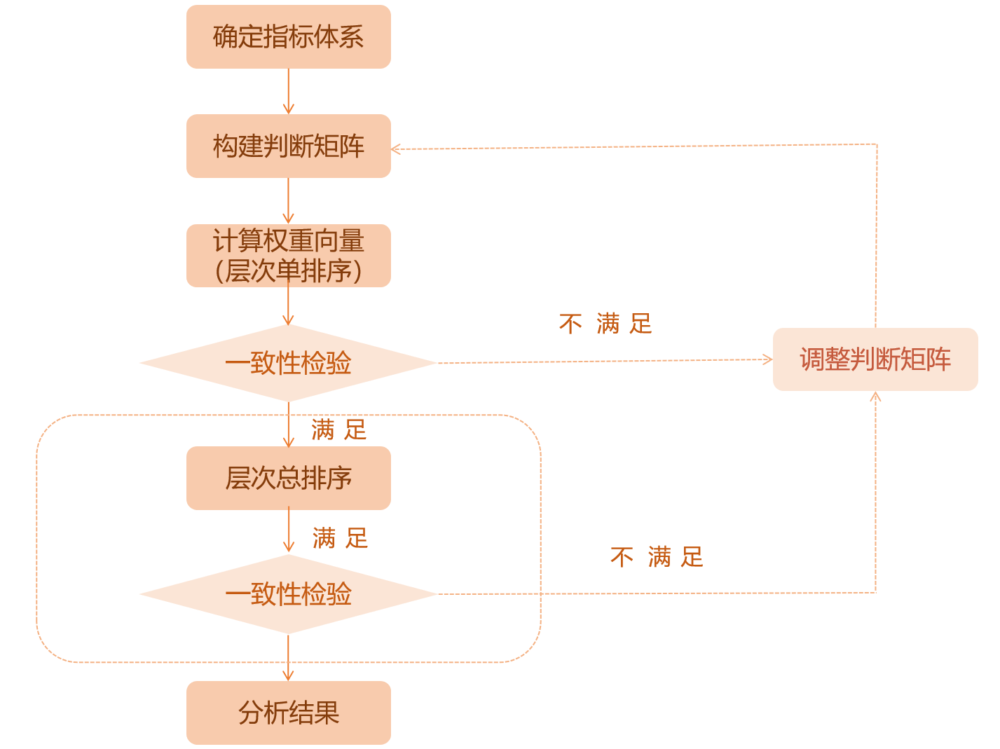\n\n\n\n

## **构建层次评价模型**

\n\n\n\n

顾名思义，在这个层次评价模型里面，我们需要确认整个决策事件的目标层、准则层、方案层

\n\n\n\n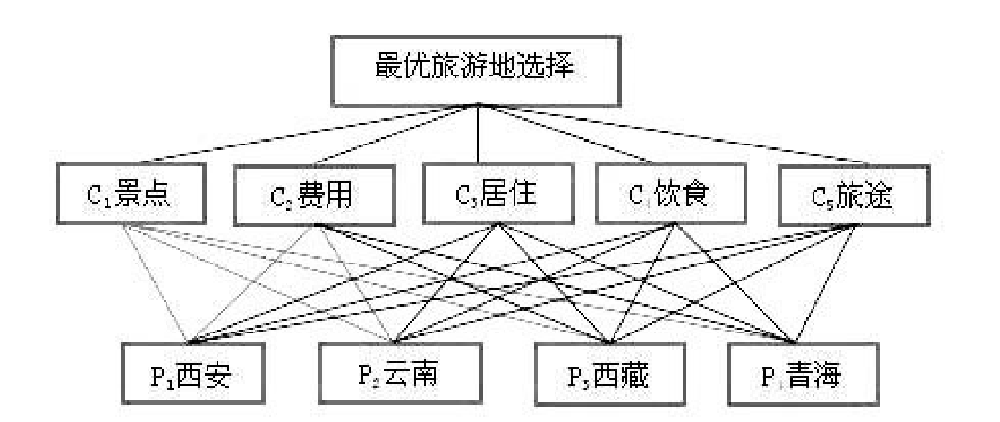\n\n\n\n

其中，

\n\n\n\n

目标层：最优旅游地选择

\n\n\n\n

准则层：景色、费用、居住、饮食、旅途

\n\n\n\n

方案层：西安、云南、西藏、青海

\n\n\n\n

需要注意的时，准则层如果有多层，例如下图所示，依次类推就行了。

\n\n\n\n

构造判断矩阵就是通过各要素之间相互两两比较，并确定各准则层对目标层的权重。

\n\n\n\n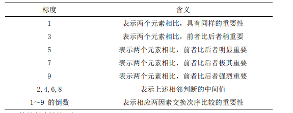\n\n\n\n

构造判断矩阵就是通过各要素之间相互两两比较，并确定各准则层对目标层的权重。

\n\n\n\n

简单地说，就是把准则层的指标进行两两判断，通常我们使用Santy的1-9标度方法给出。

\n\n\n\n

对于准则层A，我们可以构建一个

\n\n\n\n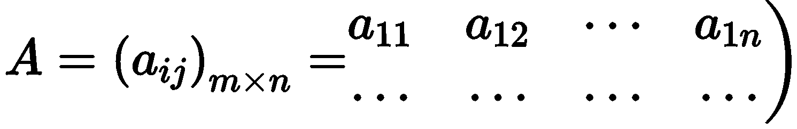\n\n\n\n

其中A 中的元素满足：

\n\n\n\n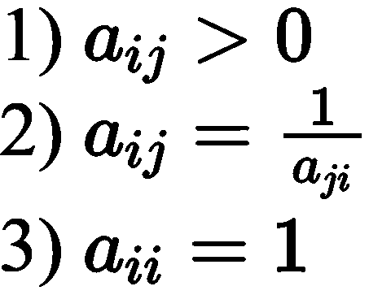\n\n\n\n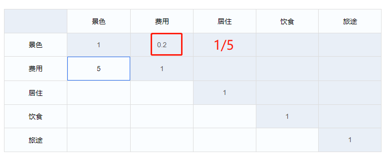\n\n\n\n

构建过程如上图所示

\n\n\n\n

## 层次单排序与一致性检验

\n\n\n\n

tep1：层次单排序

\n\n\n\n

层次单排序是指针对上一层某元素将本层中所有元素两两评比，并开展层次排序， 进行重要顺序的排列，具体计算可依据判断矩阵 A 进行，计算中确保其能够符合 AW=𝜆𝑚𝑎𝑥𝑊的特征根和特征向量条件。在此，A 的最大特征根为λmax，对应λmax的正规化的特征向量为 W，𝑤𝑖为 W 的分量，其指的是权值，与其相应元素单排序对应。 利用判断矩阵计算各因素𝑎𝑖𝑗对目标层的权重（权系数）。

\n\n\n\n

权重向量（W）与最大特征（λmax）的计算步骤（方根法或者和法）如下表所示：

\n\n\n\n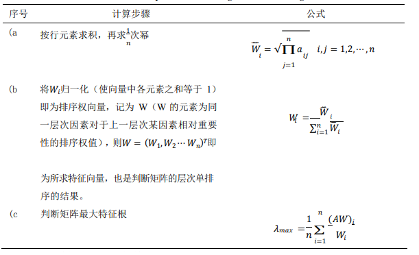\n\n\n\n

step2：求解最大特征根与CI值

\n\n\n\n

设 n 阶判断矩阵为 B，则可用以下方法求出其最大的特征根𝜆𝑚𝑎𝑥:

\n\n\n\n

BW=λW

\n\n\n\n

其中，W 是 B 的特征向量。 在层次分析法中， 我们用以下的一致性指标 CI 来检验判断的一致性指标 （Consistency Index）：

\n\n\n\n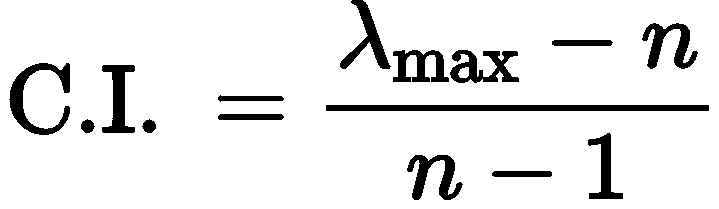\n\n\n\n

C.I.=0 表示判断矩阵完全一致，C.I.越大，判断矩阵的不一致性程度越严重。

\n\n\n\n

step3：根据CI、RI值求解CR值，判断其一致性是否通过

\n\n\n\n

Satty 模拟 1000 次得到的随机一致性指标 R.I.取值表（如下表 所示）：

\n\n\n\n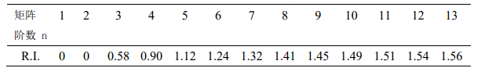\n\n\n\n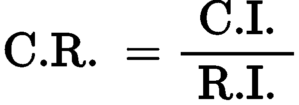\n\n\n\n

当 C.R.<0.1 时，表明判断矩阵 A 的一致性程度被认为在容许的范围内，此时可 用 A 的特征向量开展权向量计算；若 C.R.≥0.1, 则应考虑对判断矩阵 A 进行修正。

\n\n\n\n

### 2.3.1 层次单排序

\n\n\n\n

简单地说，层次单排序就是根据我们构成的判断矩阵，求解各个指标的权重。

\n\n\n\n

例如我们现在在2.2构建完成了准则层的判断矩阵A如下：

\n\n\n\n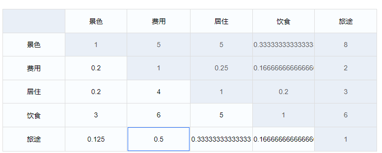\n\n\n\n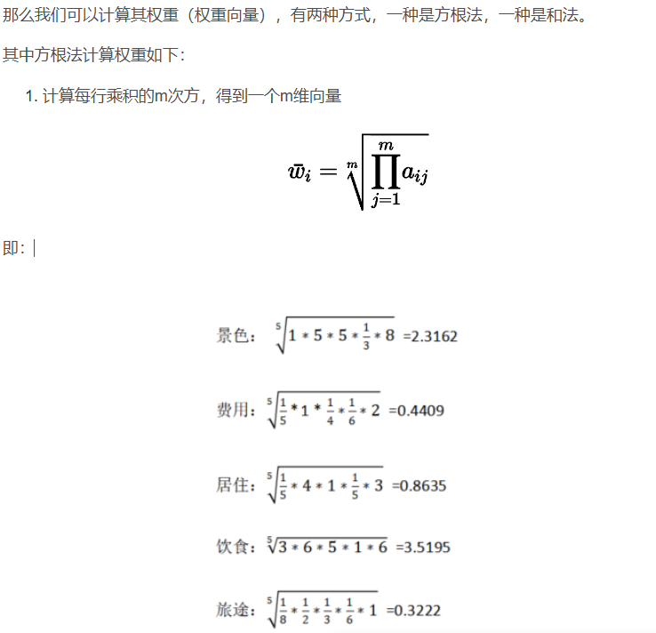\n\n\n\n

将将向量标准化即为权重向量，即得到权重

\n\n\n\n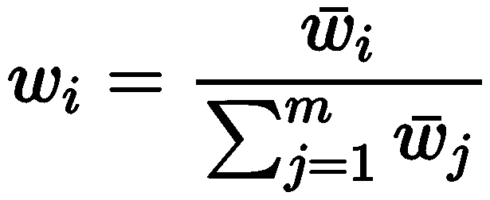\n\n\n\n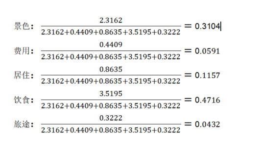\n\n\n\n

还有和法，其实差不多，适用于元素都小于1的情况

\n\n\n\n

### 求解最大特征根与CI值

\n\n\n\n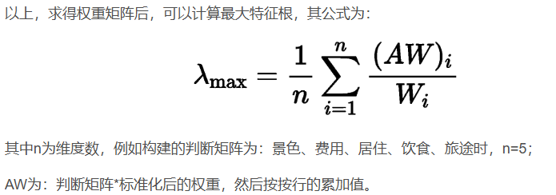\n\n\n\n指标| 景色| 费用| 居住| 饮食| 旅途  
---|---|---|---|---|---  
景色| 1| 5| 5| 0.3333| 8  
费用| 0.2| 1| 0.25| 0.1667| 2  
居住| 0.2| 4| 1| 0.2| 3  
饮食| 3| 6| 5| 1| 6  
旅途| 0.125| 0.5| 0.3333| 0.1667| 1  
\n\n\n\n

标准化后权重W为：

\n\n\n\n景色| 费用| 居住| 饮食| 旅途  
---|---|---|---|---  
0.3104| 0.0591| 0.1157| 0.4716| 0.0432  
\n\n\n\n指标| 景色| 费用| 居住| 饮食| 旅途  
---|---|---|---|---|---  
景色| 0.3104| 0.2955| 0.5785| 0.15718428| 0.3456  
费用| 0.06208| 0.0591| 0.028925| 0.07861572| 0.0864  
居住| 0.06208| 0.2364| 0.1157| 0.09432| 0.1296  
饮食| 0.9312| 0.3546| 0.5785| 0.4716| 0.2592  
旅途| 0.0388| 0.02955| 0.03856281| 0.07861572| 0.0432  
\n\n\n\n

## 层次总排序与一致性检验 

\n\n\n\n

计算某一层次所有因素对于最高层（目标层）相对重要性的权值，称为层次总排 序。该过程是从最高层次向最低层次依次进行：

\n\n\n\n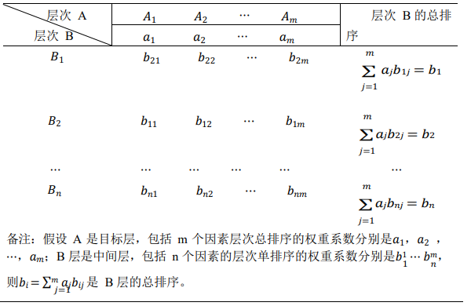\n\n\n\n

设 B 层𝐵1 ，𝐵2 ⋯ ，𝐵𝑛对上层（A 层）中因素𝐴𝑗（𝑗 = 1,2， ⋯ ，𝑚）的层次排序 一致性指标为𝐶𝐼𝑗，随机一致性指标为𝑅𝐼𝑗 ,则层次总排序的一致性比率为：

\n\n\n\n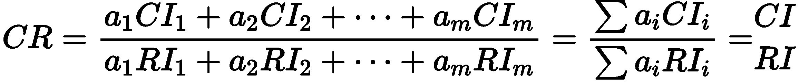\n\n\n\n

\n