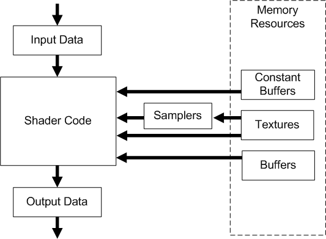

\n

HLSL 是与 DirectX 中的可编程着色器一起使用的类似 C 的高级着色器语言。

\n\n\n\n

例如，可以使用 HLSL 编写 [顶点着色器](<https://learn.microsoft.com/zh-cn/windows/win32/direct3d11/vertex-shader-stage>)(Vertex shader)或 [像素着色器](<https://learn.microsoft.com/zh-cn/windows/win32/direct3d11/pixel-shader-stage>)，并在 [Direct3D](<https://learn.microsoft.com/zh-cn/windows/win32/direct3d12/directx-12-programming-guide>) 应用程序中的呈现器实现中使用这些着色器。

\n\n\n\n

或者，可以使用 HLSL 编写计算着色器，也许可以实现物理模拟。 但是，例如，如果你倾向于编写自己的卷积运算符 (，以便在计算着色器中将图像处理) 为 HLSL，则在这种情况下，如果改用 [Direct Machine Learning (DirectML) ](<https://learn.microsoft.com/zh-cn/windows/ai/directml/dml>)，你将获得更好的性能。

\n\n\n\n

## 基本数据类型

\n\n\n\n类型| 描述  
---|---  
bool| 32位整数值用于存放逻辑值true和false  
int| 32位有符号整数  
uint| 32位无符号整数  
half| 16位浮点数(仅提供用于向后兼容)  
float| 32位浮点数  
double| 64位浮点数  
\n\n\n\n

注意：一些平台可能不支持`int`, `half`和`double`，如果出现这些情况将会使用`float`来模拟

\n\n\n\n

## 向量（Vectors） in HLSL

\n\n\n\n

向量类型可以支持2到4个同类元素

\n\n\n\n

一种表示方式是使用类似模板的形式来描述

\n\n\n\n
    
    
    vector<float, 4> vec1;  // 向量vec1包含4个float元素\nvector<int, 2> vec2;    // 向量vec2包含2个int元素\n

\n\n\n\n

另一种方式则是直接在基本类型后面加上数字

\n\n\n\n
    
    
    float4 vec1;    // 向量vec1包含4个float元素\nint3 vec2;      // 向量vec2包含3个int元素\n

\n\n\n\n

当然，只使用`vector`本身则表示为一种包含4个float元素的类型

\n\n\n\n
    
    
    vector vec1;\t// 向量vec1包含4个float元素

\n\n\n\n

### 向量的初始化方式

\n\n\n\n
    
    
    float2 vec0 = {0.0f, 1.0f};\nfloat3 vec1 = float3(0.0f, 0.1f, 0.2f);\nfloat4 vec2 = float4(vec1, 1.0f);

\n\n\n\n

### 向量的索引方式

\n\n\n\n

在HLSL中，向量具有三种重要的索引方式，包括xyzw,rgba与数组下标三种手段，具体如下

\n\n\n\n
    
    
    float4 vec0 = {1.0f, 2.0f, 3.0f, 0.0f};\nfloat f0 = vec0.x;  // 1.0f\nfloat f1 = vec0.g;  // 2.0f\nfloat f2 = vec0[2]; // 3.0f\nvec0.a = 4.0f;\t\t// 4.0f\n

\n\n\n\n

我们还可以使用`swizzles`的方式来进行赋值，可以一次性提供多个分量进行赋值操作，这些分量的名称可以重复出现：

\n\n\n\n
    
    
    float4 vec0 = {1.0f, 2.0f, 3.0f, 4.0f}; \nfloat3 vec1 = vec0.xyz;     // (1.0f, 2.0f, 3.0f)\nfloat2 vec2 = vec0.rg;      // (1.0f, 2.0f)\nfloat4 vec3 = vec0.zzxy;    // (3.0f, 3.0f, 1.0f, 2.0f)\nvec3.wxyz = vec3;           // (3.0f, 1.0f, 2.0f, 3.0f)\nvec3.yw = vec1.yy;           // (3.0f, 2.0f, 2.0f, 2.0f)\n

\n\n\n\n

## 矩阵

\n\n\n\n

矩阵的基本类型如下：

\n\n\n\n

float1x1 float1x2 float1x3 float1x4  
float2x1 float2x2 float2x3 float2x4  
float3x1 float3x2 float3x3 float3x4  
float4x1 float4x2 float4x3 float4x4

\n\n\n\n

此外，我们也可以使用类似模板的形式来描述：

\n\n\n\n
    
    
    matrix<float, 2, 2> mat1;\t// float2x2

\n\n\n\n

### 矩阵的初始化

\n\n\n\n
    
    
    float2x2 mat1 = {\n\t1.0f, 2.0f,\t// 第一行\n\t3.0f, 4.0f  // 第二行\n};\nfloat3x3 TBN = float3x3(T, B, N); // T, B, N都是float3\n

\n\n\n\n

矩阵的取值则是如下操作：

\n\n\n\n
    
    
    matrix M;\n// ...\n\nfloat f0 = M._m00;      // 第一行第一列元素(索引从0开始)\nfloat f1 = M._12;       // 第一行第二列元素(索引从1开始)\nfloat f2 = M[0][1];     // 第一行第二列元素(索引从0开始)\nfloat2 f3 = M._11_12;   // Swizzles\n

\n\n\n\n

默认的*法都是逐位相乘，所以需要自己做额外的实现才能进行x乘等复杂操作

\n\n\n\n
    
    
    float4 vec0 = 2.0f * float4(1.0f, 2.0f, 3.0f, 4.0f);    //(2.0f, 4.0f, 6.0f, 8.0f)\nfloat4 vec1 = vec0 * float4(1.0f, 0.2f, 0.1f, 0.0f);    //(2.0f, 0.8f, 0.6f, 0.0f)\n

\n\n\n\n

若要进行向量与矩阵的乘法，则需要使用`mul`函数。

\n\n\n\n

在C++代码层中，DirectXMath数学库创建的矩阵都是行矩阵，但当矩阵从C++传递给HLSL时，HLSL默认是列矩阵的，看起来就好像传递的过程中进行了一次转置那样。如果希望不发生转置操作的话，可以添加修饰关键字`row_major`：

\n\n\n\n
    
    
    row_major matrix M;

\n\n\n\n

## 数组

\n\n\n\n

和C++一样，我们可以声明数组：

\n\n\n\n
    
    
    float M[4][4];\nint p[4];\nfloat3 v[12];\t// 12个3D向量

\n\n\n\n

## 结构体(struct)

\n\n\n\n

HLSL的结构体和C/C++的十分相似，它可以存放任意数目的标量，向量和矩阵类型，除此之外，它还可以存放数组或者别的结构体类型。结构体的成员访问也和C/C++相似：

\n\n\n\n
    
    
    struct A\n{\n    float4 vec;\n};\n\nstruct B\n{\n    int scalar;\n    float4 vec;\n    float4x4 mat;\n    float arr[8];\n    A a;\n};\n\n// ...\nB b;\nb.vec = float4(1.0f, 2.0f, 3.0f, 4.0f);\n

\n\n\n\n

## 变量的修饰符

\n\n\n\n关键字| 含义  
---|---  
static| 该着色器变量将**不会暴露** 给C++应用层，需要在HLSL中自己初始化，否则使用默认初始化  
extern| 与static相反，该着色器变量将会**暴露** 给C++应用层  
uniform| 该着色器变量允许在C++应用层**被改变** ，但在着色器执行的过程中，其值始终保持不变（运行前可变，运行时不变）。着色器程序中的全局变量默认为既uniform又extern  
const| 和C++中的含义相同，它是一个**常量** ，需要被**初始化** 且不可以被修改  
\n\n\n\n

HLSL有着极其灵活的类型转换机制。HLSL中的类型转换语法和C/C++的相同。下面是一些例子：

\n\n\n\n
    
    
    float f = 4.0f;\nfloat4x4 m = (float4x4)f;\t// 将浮点数f复制到矩阵m的每一个元素当中\n\nfloat3 n = float3(...);\nfloat3 v = 2.0f * n - 1.0f;\t// 这里1.0f将会隐式转换成(1.0f, 1.0f, 1.0f)\n\nfloat4x4 WInvT = float4x4(...);\nfloat3x3 mat = (float3x3)WInvT;\t// 只取4x4矩阵的前3行前3列\n

\n\n\n\n

## 控制流语句

\n\n\n\n

HLSL也支持`if`, `else`, `continue`, `break`, `switch`关键字，此外`discard`关键字用于像素着色阶段抛弃该像素。

\n\n\n\n

条件的判断使用一个布尔值进行，通常由各种逻辑运算符或者比较运算符操作得到。注意向量之间的比较或者逻辑操作是得到一个存有布尔值的向量，不能够直接用于条件判断，也不能用于`switch`语句。

\n\n\n\n

### 判断与动态分支

\n\n\n\n

基于值的条件分支只有在程序执行的时候被编译好的着色器汇编成两种方式：**判断(predication)** 和**动态分支(dynamic branching)** 。

\n\n\n\n

如果使用的是判断的形式，编译器会提前计算两个不同分支下表达式的值。然后使用比较指令来基于比较结果来"选择"正确的值。

\n\n\n\n

而动态分支使用的是跳转指令来避免一些非必要的计算和内存访问。

\n\n\n\n

着色器程序在同时执行的时候应当选择相同的分支，以防止硬件在分支的两边执行。通常情况下，硬件会同时将一系列连续的顶点数据传入到顶点着色器并行计算，或者是一系列连续的像素单元传入到像素着色器同时运算等。

\n\n\n\n

动态分支会由于执行分支指令所带来的开销而导致一定的性能损失，因此要权衡动态分支的开销和可以跳过的指令数目。

\n\n\n\n

通常情况下编译器会自行选择使用判断还是动态分支，但我们可以通过重写某些属性来修改编译器的行为。我们可以在条件语句前可以选择添加下面两个属性之一：

\n\n\n\n属性| 描述  
---|---  
[branch]| 根据条件值的结果，只计算其中一边的内容，会产生跳转指令。默认不加属性的条件语句为branch型。  
[flatten]| 两边的分支内容都会计算，然后根据条件值选择其中一边。可以避免跳转指令的产生。  
\n\n\n\n

用法如下：

\n\n\n\n
    
    
    [flatten]\nif (x)\n{\n    x = sqrt(x);\n}

\n\n\n\n

## 函数

\n\n\n\n

函数的语法也和C/C++的十分类似，但它具有以下属性：

\n\n\n\n

\n
  1. 参数只能按值传递
\n\n\n\n
  2. 不支持递归
\n\n\n\n
  3. 只有内联函数（避免产生调用的跳转来减小开销）
\n
\n\n\n\n

此外，HLSL函数的形参可以指定输入/输出类别：

\n\n\n\n输入输出类别| 描述  
---|---  
in| 仅读入。实参的值将会复制到形参上。若未指定则默认为in  
out| 仅输出。对形参修改的最终结果将会复制到实参上  
inout| 即in和out的组合  
\n\n\n\n

例如：

\n\n\n\n
    
    
    bool foo(in bool b,\t\t\t// 输入的bool类型参数\n\tout int r1,\t\t\t\t// 输出的int类型参数\n\tinout float r2)\t\t\t// 具备输入/输出的float类型参数\n{\n    if (b)\n    {\n        f1 = 5;\n    }\n    else\n    {\n        r1 = 1;\n    }\n    \n    // 注意r1不能出现在等式的右边\n    \n    // r2既可以被读入，也可以写出结果到外面的实参上\n    r2 = r2 * r2 * r2;\n    \n    return true;\n}

\n\n\n\n

## 语义

\n\n\n\n

语义通常是附加在着色器输入/输出参数上的字符串。它在着色器程序的用途如下：

\n\n\n\n

\n
  1. 用于描述传递给着色器程序的变量参数的含义
\n\n\n\n
  2. 允许着色器程序接受由渲染管线生成的特殊系统值
\n\n\n\n
  3. 允许着色器程序传递由渲染管线解释的特殊系统值
\n
\n\n\n\n

### 顶点着色器语义

\n\n\n\n输入| 描述| 类型  
---|---|---  
BINORMAL[n]| 副法线（副切线）向量| float4  
BLENDINDICES[n]| 混合索引| uint  
BLENDWEIGHT[n]| 混合权重| float  
COLOR[n]| 漫反射/镜面反射颜色| float4  
NORMAL[n]| 法向量| float4  
POSITION[n]| 物体坐标系下的顶点坐标| float4  
POSITIONT| 变换后的顶点坐标| float4  
PSIZE[n]| 点的大小| float  
TANGENT[n]| 切线向量| float4  
TEXCOORD[n]| 纹理坐标| float4  
Output| 仅描述输出| Type  
FOG| 顶点雾| float  
\n\n\n\n

n是一个可选的整数，从0开始。比如POSITION0, TEXCOORD1等等。

\n\n\n\n

### 像素着色器语义

\n\n\n\n输入| 描述| 类型  
---|---|---  
COLOR[n]| 漫反射/镜面反射颜色| float4  
TEXCOORD[n]| 纹理坐标| float4  
Output| 仅描述输出| Type  
DEPTH[n]| 深度值| float  
\n\n\n\n

### 系统值语义 

\n\n\n\n

所有的系统值都包含前缀`SV_`。这些系统值将用于某些着色器的特定用途（并未全部列出）

\n\n\n\n系统值| 描述| 类型  
---|---|---  
SV_Depth| 深度缓冲区数据，可以被任何着色器写入/读取| float  
SV_InstanceID| 每个实例都会在运行期间自动生成一个ID。在任何着色器阶段都能读取| uint  
SV_IsFrontFace| 指定该三角形是否为正面。可以被几何着色器写入，以及可以被像素着色器读取| bool  
SV_Position| 若被声明用于输入到着色器，它描述的是像素位置，在所有着色器中都可用，可能会有0.5的偏移值| float4  
SV_PrimitiveID| 每个原始拓扑都会在运行期间自动生成一个ID。可用在几何/像素着色器中写入，也可以在像素/几何/外壳/域着色器中读取| uint  
SV_StencilRef| 代表当前像素着色器的模板引用值。只可以被像素着色器写入| uint  
SV_VertexID| 每个实例都会在运行期间自动生成一个ID。仅允许作为顶点着色器的输入| uint  
\n\n\n\n

所有的可编程着色器阶段使用通用着色器核心来实现相同的基础功能。此外，顶点着色阶段、几何着色阶段和像素着色阶段则提供了独特的功能，例如几何着色阶段可以生成新的图元或删减图元，像素着色阶段可以决定当前像素是否被抛弃等。下图展示了数据是怎么流向一个着色阶段，以及通用着色器核心与着色器内存资源之间的关系：

\n\n\n\n\n\n\n\n

**Input Data** ：顶点着色器从输入装配阶段获取数据；几何着色器则从上一个着色阶段的输出获取等等。通过给形参引入可以使用的系统值可以提供额外的输入

\n\n\n\n

**Output Data** ：着色器生成输出的结果然后传递给管线的下一个阶段。有些输出会被通用着色器核心解释成特定用途（如顶点位置、渲染目标对应位置的值），另外一些输出则由应用程序来解释。

\n\n\n\n

**Shader Code** ：着色器代码可以从内存读取，然后用于执行代码中所期望的内容。

\n\n\n\n

**Samplers** ：采样器决定了如何对纹理进行采样和滤波。

\n\n\n\n

**Textures** ：纹理可以使用采样器进行采样，也可以基于索引的方式按像素读取。

\n\n\n\n

**Buffers** ：缓冲区可以使用读取相关的内置函数，在内存中按元素直接读取。

\n\n\n\n

**Constant Buffers** ：常量缓冲区对常量值的读取有所优化。他们被设计用于CPU对这些数据的频繁更新，因此他们有额外的大小、布局和访问限制。

\n\n\n\n

## 着色器常量

\n\n\n\n

着色器常量存在内存中的一个或多个缓冲区资源当中。他们可以被组织成两种类型的缓冲区：常量缓冲区（cbuffers）和纹理缓冲区（tbuffers）。关于纹理缓冲区，我们不在这讨论。

\n\n\n\n

### 常量缓冲区(Constant Buffer)

\n\n\n\n

常量缓冲区允许C++端将数据传递给HLSL中使用，在HLSL端，这些传递过来的数据不可更改，因而是常量。常量缓冲区对这种使用方式有所优化，表现为低延迟的访问和允许来自CPU的频繁更新，因此他们有额外的大小、布局和访问限制。

\n\n\n\n

声明方式如下：

\n\n\n\n
    
    
    cbuffer VSConstants\n{\n    float4x4 g_WorldViewProj;\n    fioat3 g_Color;\n    uint g_EnableFog;\n    float2 g_ViewportXY;\n    float2 g_ViewportWH;\n}\n

\n\n\n\n

由于我们写的是原生HLSL，当我们在HLSL中声明常量缓冲区时，还**需要在HLSL的声明中使用关键字`register`手动指定对应的寄存器索引**，然后编译器会为对应的着色器阶段自动将其映射到15个常量缓冲寄存器的其中一个位置。这些寄存器的名字为`b0`到`b14`：

\n\n\n\n
    
    
    cbuffer VSConstants : register(b0)\n{\n    float4x4 g_WorldViewProj;\n    fioat3 g_Color;\n    uint g_EnableFog;\n    float2 g_ViewportXY;\n    float2 g_ViewportWH;\n}\n

\n\n\n\n

在C++端是通过`ID3D11DeviceContext::*SSetConstantBuffers`指定特定的槽(slot)来给某一着色器阶段对应的寄存器索引提供常量缓冲区的数据。

\n\n\n\n

如果是存在多个不同的着色器阶段使用同一个常量缓冲区，那就需要分别给这两个着色器阶段设置好相同的数据。

\n\n\n\n

综合前面几节内容，下面演示了顶点着色器和常量缓冲区的用法：

\n\n\n\n
    
    
    cbuffer ConstantBuffer : register(b0)\n{\n    float4x4 g_WorldViewProj;\n}\n\n\nvoid VS_Main(\n    in float4 inPos : POSITION,         // 绑定变量到输入装配器\n    in uint VID : SV_VertexID,          // 绑定变量到系统生成值\n    out float4 outPos : SV_Position)    // 告诉管线将该值解释为输出的顶点位置\n{\n    outPos = mul(inPos, g_WorldViewProj);\n}\n\n\n

\n\n\n\n

上面的代码也可以写成：

\n\n\n\n
    
    
    cbuffer ConstantBuffer : register(b0)\n{\n    float4x4 g_WorldViewProj;\n}\n\nstruct VertexIn\n{\n\tfloat4 inPos : POSITION;\t// 源自输入装配器\n\tuint VID : SV_VertexID;\t\t// 源自系统生成值\n};\n\nfloat4 VS_Main(VertexIn vIn) : SV_Position\n{\n    return mul(vIn.inPos, g_WorldViewProj);\n}\n

\n\n\n\n

有关常量缓冲区的打包规则，建议在阅读到时索引缓冲区、常量缓冲区一章时，再来参考杂项篇的HLSL常量缓冲区的打包规则。

\n