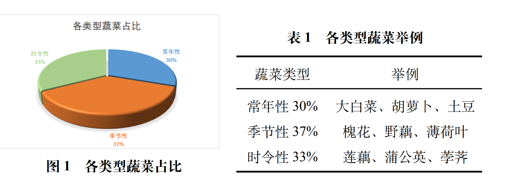
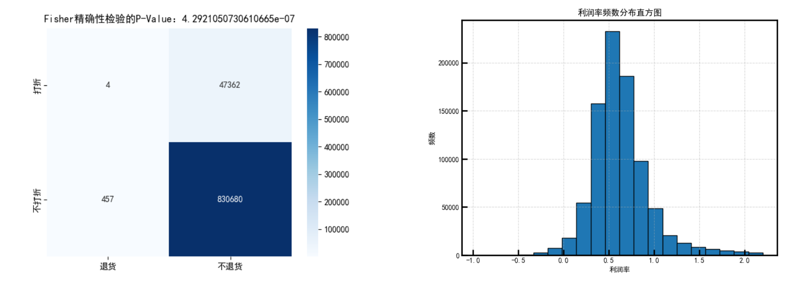
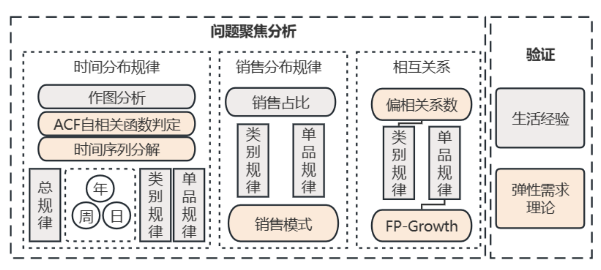

[C2023国赛](<../../assets/images/2024/08/C2023国赛.pdf>)[下载](<../../assets/images/2024/08/C2023国赛.pdf>)

该题针对蔬菜的进货交易等信息进行了如下的提问：

**问题一** ：分析数据，找出各蔬菜品类及单品销售量的分布规律与相互关系；  
**问题二** ：分析各蔬菜品类的销售总量与成本加成定价的关系，并以商超利润最大为目标。给出各蔬菜品类未来一周的日补货总量与定价策略；  
**问题三** ：根据过去一周的可售品种，在满足单品数在 27 到 33 的范围、且各单品订购量大于 2.5 千克的条件下，给出 7 月 1 日单品补货量和定价策略；  
**问题四** ：分析可能影响蔬菜补货与定价决策效果的其他因素，对上述问题进行改进说明。

然后我们针对这些问题重新回到题目里面去找信息，题目中明确指出了两个重要的决策点：补货和定价的决策，并且补充了以下约束：在不知道进货价格的时候做出采购决策、每年4-10品类较多、具有销售空间限制、运输受损的蔬菜需要打折出售

以上信息已经足够我们对这个问题以及给出的数据进行对应的处理和建模。不过这是一个数据维度较高的数据集，所以一定需要注意数据的清洗以及分类连接，不同的清洗与连接方式都深入影响着得到的结论

我们从这篇优秀论文入手进行分析

[C2023国赛228](<../../assets/images/2024/08/C2023国赛228.pdf>)[下载](<../../assets/images/2024/08/C2023国赛228.pdf>)

考虑到销售量的分布规律可分为**随时间的分布规律** 、**随每个订单的分布规律** 、**随每个品类的分布规律** 三个角度；相互关系也可分为品类间的相互关系以及单品间的相互关系

首先对于数据进行一定程度的分析与清洗，

对蔬菜的进货信息分析，发现蔬菜的供应季节、周期、时间存在明显差异，查阅相  
关资料后，本文将从供应时间的角度将蔬菜单品分为以下三类： 

  * 常年性蔬菜：这些产品可以在不同的地区或国家生产, 几乎整年都可以获得。

  * 季节性蔬菜：受气候和地理条件影响，该类产品只在特定的季节内生长与销售。

  * 时令性蔬菜：该类产品仅在某些特定的节日、假期、节气等短期时间销售。  
结合题设信息，本文设定如下分类规则：  
**规则 1：三年中某一年可供天数大于 300 天，划分为常年性蔬菜；  
规则 2：每年最大可供天数小于 15 天，划分为时令性蔬菜；**

但是结合具体数据，对于已经划分出的季节性蔬菜进行细化的筛选，再得到两个合理的规则

基于以上信息，增加如下规则：  
**规则 3：四季都可供，且各季节三年可供天数均大于 20 天，划分为常年性蔬菜；  
规则 4：各个季节三年共计可供天数均小于 20 天，划分为时令性蔬菜；**

按照这样进行的均匀分割很有利于之后进一步的数据分析

题目给出的数据中包含不同供应地的同种蔬菜，为避免其对后续建模造成影响，进行其统计分析，发现主要可以分为两种类型：

  * 销量均衡类：如黄心菜 (1) 与黄心菜 (2)，销量分别为 2911kg 与 1882kg, 共计 6 种

  * 销量失衡类：如紫茄子 (1) 与紫茄子 (2)，销量分别为 279kg 与 13602kg, 共计 13 种

但是由于同货异源类蔬菜的进价和售价并不相同，故不能将其合并，应当视作两种不同的蔬菜，故本文不对其做过多处理。

应当注意到，少量（5.39%）蔬菜由于品相等原因打折销售，极少量（5‰）订单由于未知因素被退货。前者因为打折而导致销售单价及销量发生改变、后者因为销售单价为负与正常项不同，但经过数据按时间聚合后，两类数据均不会对结果造成影响。

以上都是这篇优秀论文针对第一阶段数据进行的详细分析与处理，并且通过了丰富的图标展现，举例如下：

关于“异常”和“无关”数据的处理，可借鉴的店是对于利润率进行正态的分析，根据3σ 法则订立上限利润来筛选一轮，再剔除了没有足够数据以及上架时间过短的蔬菜产品

针对问题一建模，文章给出了很漂亮的结构分割图，并且尽可能地把这些高维度多视角地分割开来单独研究了

关于时间分割规律，作者给出了如下的设计:

  * 首先，对销售总量进行时间上的分布规律分析，观察**外部因素** 对总体销售量的影响；

  * 其次，对各品类不同时间维度上的销量分布分析，发掘人们对各个品类的**不同需求** ；

  * 最后，基于单品的**时间分类** 对各单品探究其时间分布规律。

乘法时间序列分解  
乘法分解假定时间序列是由趋势、季节性、周期性和噪声等组成部分相乘而成的，  
通常表示为：  
Yt = Tt· St· Ct· Et  
其中 Yt 为观测值，Tt 表示趋势成分，Qt 表示季节性成分，Ct 表示周期性成分，Et 表示  
随机噪音。

得到对应的时序分析之后，要着重观察其峰值，并且分析这些周期和峰值出现的原因与现实诠释
