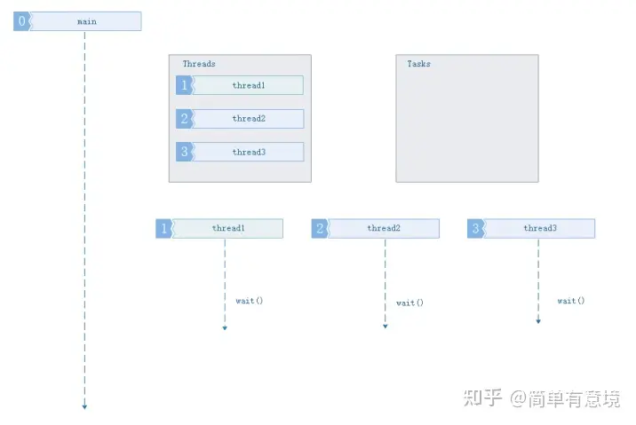
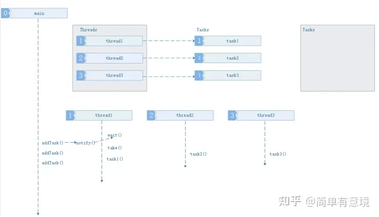
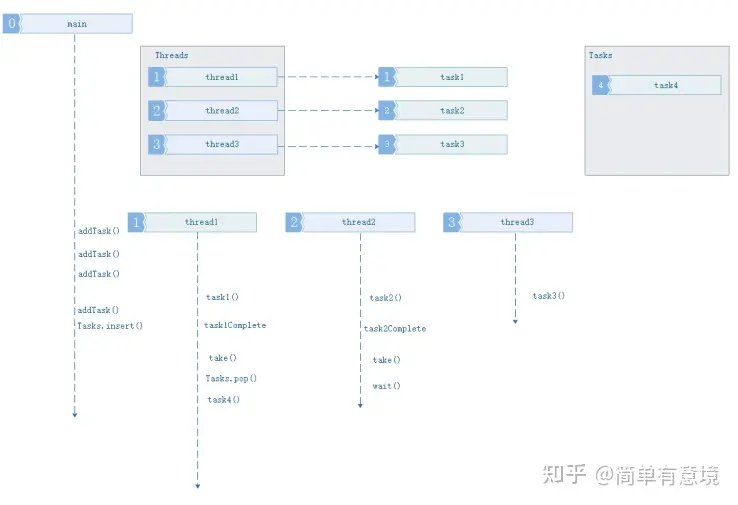
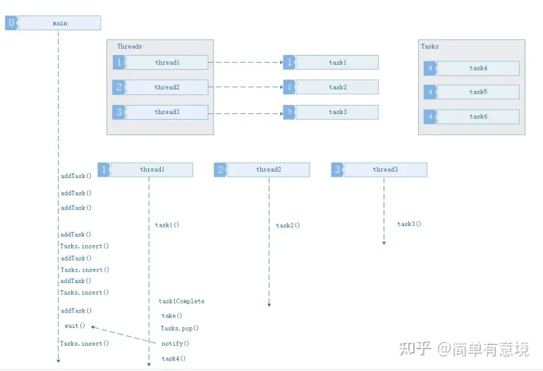

\n

[醍醐灌顶全方位击破C++线程池及异步处理 - 知乎 (zhihu.com)](<https://zhuanlan.zhihu.com/p/376235626>)

\n\n\n\n

\n\n\n\n

## 基本概念

\n\n\n\n

池化思想，又称为资源池化，是一种在计算机科学和系统工程中广泛应用的设计理念。其核心思想是**将资源统一管理和分配** ，以提高资源的使用效率，降低资源消耗，并增强系统的稳定性和响应速度。

\n\n\n\n

池化思想通过将资源（如内存、[数据库](<https://cloud.baidu.com/solution/database.html>)连接、线程等）预先分配并[存储](<https://cloud.baidu.com/product/bos.html>)在一个资源池中，当系统需要这些资源时，直接从池中获取，而不是每次需要时都重新创建。这种机制不仅可以减少资源的创建和销毁开销，还能避免资源竞争和过度消耗。

\n\n\n\n

**资源池（Resource Pooling）：**

\n\n\n\n

\n
  * 池化思想的核心概念是资源池，它是一组**可重复使用** 的资源，如数据库连接、线程、对象实例、网络连接等。
\n\n\n\n
  * 资源池中的资源可以被多个任务或线程共享，并且可以通过请求和释放的方式来管理。
\n
\n\n\n\n

## 例子 - 为何要用池？

\n\n\n\n

先举一个简单的使用篮球 例子，我们有多种策略使用篮球，并且使用篮球之后会产生一定的代价，主观上认为我们倾向于将代价最小化。

\n\n\n\n

### 策略1：（一次性使用）

\n\n\n\n

这是一种比较笨的策略，每次都买一个新的篮球用于使用，使用之后丢掉。于是我们可以得到如下代价公式：

\n\n\n\n

总代价=（买篮球代价+用篮球代价）∗使用次数

\n\n\n\n

### 策略2：（重复使用）

\n\n\n\n

在该策略中，认为篮球是可以多次使用的。于是我们可以得到如下公式：：

\n\n\n\n

总代价=买篮球代价∗篮球个数+重复代价∗使用次数+用篮球代价∗使用次数

\n\n\n\n

### 策略的选择

\n\n\n\n

上面列举了两种策略，事实上还有很多其他的策略。  
两种策略本身是没有绝对的好坏的，而是视场景而定的。但就现实情况而言（比如，使用次数很多），篮球这个例子中符合如下的规律：

\n\n\n\n

买篮球的代价∗篮球个数+复用的代价∗使用次数<买篮球的代价∗使用次数

\n\n\n\n

这意味着，复用的总代价 小于 不复用的代价，即**复用的策略更适合篮球这个例子** 。

\n\n\n\n

## **线程池的组成**

\n\n\n\n

\n
  1. 线程池管理器：初始化和创建线程，启动和停止线程，调配任务；管理线程池
\n\n\n\n
  2. 工作线程：线程池中等待并执行分配的任务
\n\n\n\n
  3. 任务接口：添加任务的接口，以提供工作[线程调度](<https://www.zhihu.com/search?q=%E7%BA%BF%E7%A8%8B%E8%B0%83%E5%BA%A6&search_source=Entity&hybrid_search_source=Entity&hybrid_search_extra=%7B%22sourceType%22%3A%22article%22%2C%22sourceId%22%3A376235626%7D>)任务的执行。
\n\n\n\n
  4. 任务队列：用于存放没有处理的任务，提供一种缓冲机制，同时具有调度功能，高优先级的任务放在队列前面
\n
\n\n\n\n

## 对象池的优势

\n\n\n\n

> \n
> 
> 通过对象创建的例子，可看出对象创建是一个复杂的过程，少数的对象的创建并不会影响程序的太多的性能，但是如果达到了数以万计，就应该考虑复用同类对象的分配了。  
> 【通俗理解】**只是替换某个已存在对象的状态（填充原对象结构中的变量），复用已存在对象分配的内存** （节省了寻找空闲堆区等方面的时间）。
> 
> \n\n\n\n
> 
> （**相当于给内存重新换了身衣服** ）  
> 这里认为，**重新创建对象的代价**  远远大于 **更换已存在对象中相关的状态变量** 。
> 
> \n

\n\n\n\n

## 线程池工作的四种情况

\n\n\n\n

### **1.3.1 没有任务要执行，缓冲队列为空**

\n\n\n\n\n\n\n\n

**1.3.2 队列中任务数量，小于等于线程池中线程任务数量**

\n\n\n\n\n\n\n\n

**1.3.3 任务数量大于线程池数量,缓冲队列未满**

\n\n\n\n\n\n\n\n

**1.3.4 任务数量大于线程池数量，缓冲队列已满**

\n\n\n\n\n\n\n\n

> \n
> 
> **Thread Safe Queue Requirement**
> 
> \n

\n\n\n\n

\n
  * How many producer are there for this queue? How many threads will be “ _pushing_ to it”?
\n\n\n\n
  * Will there be many threads “ _popping_ ” from the queue?
\n\n\n\n
  * Do we always need the “pop” operation to return something? Can it block a thread?
\n\n\n\n
  * Does the queue need to be atomic- no mutex locking allowed?
\n
\n\n\n\n

## Simple C++ Implementation for Thread Safe Queue

\n\n\n\n
    
    
    #include <queue>\n#include <condition_variable>\n#include <mutex>\n\ntemplate <typename T>\nclass Queue_Safe {\nprivate:\n    std::queue<T> q;               // Underlying queue to store elements\n    std::condition_variable cv;    // Condition variable for synchronization\n    std::mutex mtx;                // Mutex for exclusive access to the queue\n\npublic:\n    // Pushes an element onto the queue\n    void push(T const& val) {\n        std::lock_guard<std::mutex> lock(mtx); \n        q.push(val);                        \n        cv.notify_one();  // Notify one waiting thread that data is available\n    }\n\n    // Pops and returns the front element of the queue\n    T pop() {\n        std::unique_lock<std::mutex> uLock(mtx);  \n        cv.wait(uLock, [&] { return !q.empty(); });  // Wait until the queue is not empty\n        T front = q.front();                      \n        q.pop();                                  \n        return front;    \n    }                        \n};

\n\n\n\n

We can pass arguments to the start-function when creating a new thread via  _std::thread(startFunction, args)_. Those arguments are passed by value from the thread creator function because the  _std::thread_ constructor copies or moves the creator's arguments before passing them to the start-function.

\n\n\n\n

最简单的线程池的实现（基于c++11)

\n\n\n\n
    
    
    #ifndef THREAD_POOL_H\n#define THREAD_POOL_H\n\n#include <vector>\n#include <queue>\n#include <memory>\n#include <thread>\n#include <mutex>\n#include <condition_variable>\n#include <future>\n#include <functional>\n#include <stdexcept>\n\nclass ThreadPool {\npublic:\n    ThreadPool(size_t);\n    template<class F, class... Args>\n    auto enqueue(F&& f, Args&&... args) \n        -> std::future<typename std::result_of<F(Args...)>::type>;\n    ~ThreadPool();\nprivate:\n    // need to keep track of threads so we can join them\n    std::vector< std::thread > workers;\n    // the task queue\n    std::queue< std::function<void()> > tasks;\n    \n    // synchronization\n    std::mutex queue_mutex;\n    std::condition_variable condition;\n    bool stop;\n};\n \n// the constructor just launches some amount of workers\ninline ThreadPool::ThreadPool(size_t threads)\n    :   stop(false)\n{\n    for(size_t i = 0;i<threads;++i)\n        workers.emplace_back(\n            [this]\n            {\n                for(;;)\n                {\n                    std::function<void()> task;\n\n                    {\n                        std::unique_lock<std::mutex> lock(this->queue_mutex);\n                        this->condition.wait(lock,\n                            [this]{ return this->stop || !this->tasks.empty(); });\n                        if(this->stop && this->tasks.empty())\n                            return;\n                        task = std::move(this->tasks.front());\n                        this->tasks.pop();\n                    }\n\n                    task();\n                }\n            }\n        );\n}\n\n// add new work item to the pool\ntemplate<class F, class... Args>\nauto ThreadPool::enqueue(F&& f, Args&&... args) \n    -> std::future<typename std::result_of<F(Args...)>::type>\n{\n    using return_type = typename std::result_of<F(Args...)>::type;\n\n    auto task = std::make_shared< std::packaged_task<return_type()> >(\n            std::bind(std::forward<F>(f), std::forward<Args>(args)...)\n        );\n        \n    std::future<return_type> res = task->get_future();\n    {\n        std::unique_lock<std::mutex> lock(queue_mutex);\n\n        // don't allow enqueueing after stopping the pool\n        if(stop)\n            throw std::runtime_error("enqueue on stopped ThreadPool");\n\n        tasks.emplace([task](){ (*task)(); });\n    }\n    condition.notify_one();\n    return res;\n}\n\n// the destructor joins all threads\ninline ThreadPool::~ThreadPool()\n{\n    {\n        std::unique_lock<std::mutex> lock(queue_mutex);\n        stop = true;\n    }\n    condition.notify_all();\n    for(std::thread &worker: workers)\n        worker.join();\n}\n\n#endif

\n\n\n\n

\n