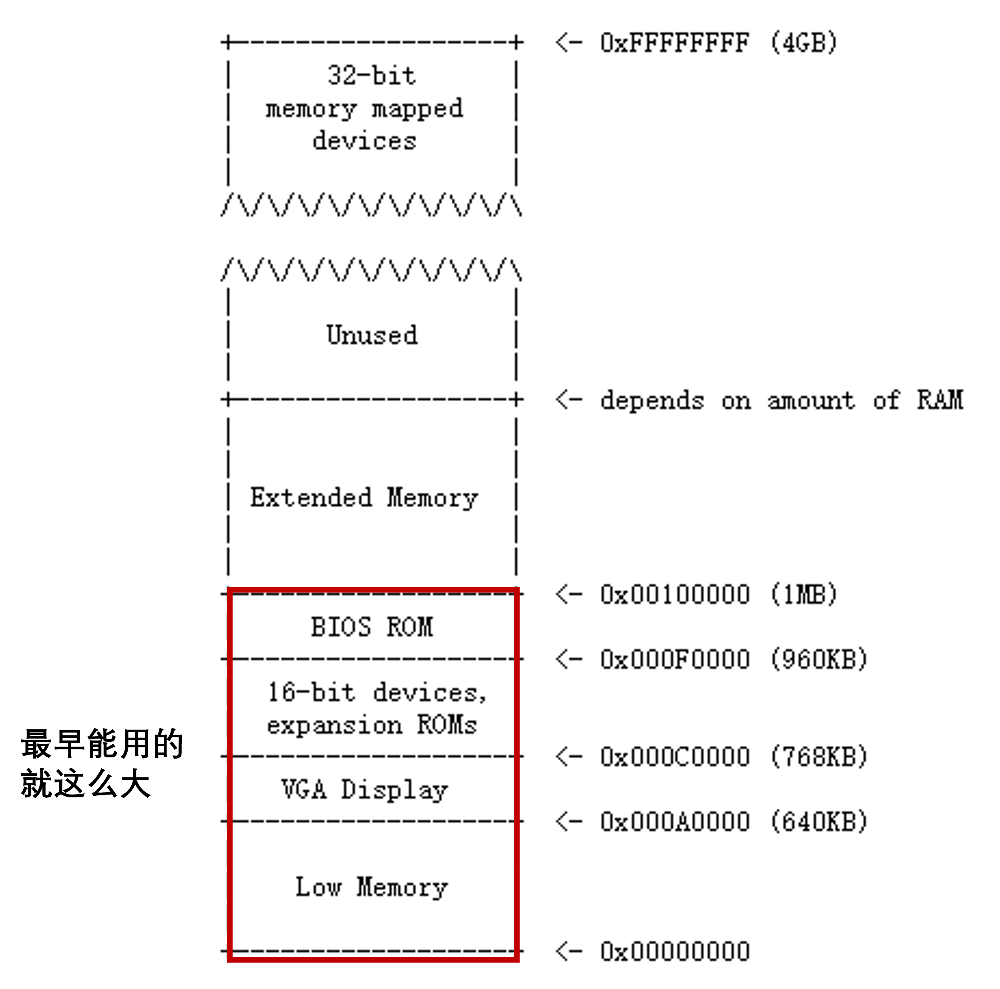
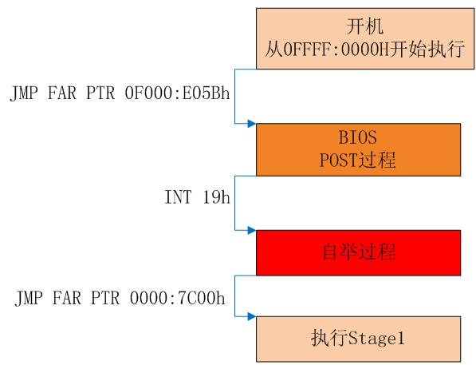

\n

## Week 1 how to start OS

\n\n\n\n

### what is BIOS

\n\n\n\n

BIOS (basic input/output system) is the program a computer's microprocessor uses to start the [computer system](<https://www.techtarget.com/searchwindowsserver/definition/system>) after it is powered on. It also manages data flow between the computer's operating system (OS) and attached devices, such as the hard disk, video adapter, keyboard, mouse and printer.

\n\n\n\n

When BIOS boots up a computer, it first **determines whether all of the necessary attachments are in place and operational.** **Any piece of hardware containing files the computer needs to start is called a  _boot device_. **After testing and ensuring boot devices are functioning, BIOS loads the OS -- or key parts of it -- into the computer's random access memory ([RAM](<https://www.techtarget.com/searchstorage/definition/RAM-random-access-memory>)) from a hard disk or diskette drive (the boot device).

\n\n\n\n

在加电后的第一条指令都是跳转到BIOS固件进行开机自检，然后将磁盘的**主引导扇区** 中的内容**加载** 到内存`0x7c00`的位置，然后**跳转** 到这里。

\n\n\n\n

### MBR(主引导扇区`Master Boot Record`)

\n\n\n\n

引导扇区，`Master Boot Record`，简称`MBR`，是磁盘里的第0个扇区。MBR占一个扇区，共512字节。

\n\n\n\n

**MBR** 里面的内容一般是一段可执行的指令，我们常常叫做**Bootloader** ，大概翻译过来就叫启动加载器。从名字就可以看出，它的主要用途是把真正的操作系统加载到内存中，然后把控制权交给OS。

\n\n\n\n

 _（注意在后面的讲义中为了方便，在表述上不再区分MBR和bootloader）_

\n\n\n\n

MBR的最后两字节是魔数0x55和0xaa，作用是告诉BIOS：这里是MBR，你找对了。把我加载上去就可以启动操作系统了。

\n\n\n\n

有了这个魔数，BIOS就可以很容易找到可启动设备了：BIOS依次将设备的首扇区加载到内存**0x7c00** 的位置，然后**检查末尾** 两个字节是否为 `0x55`和`0xaa`如果成功找到了魔数，BIOS将会跳到 `0x7c00 `的内存位置，执行刚刚加载的启动代码，这时BIOS已经完成了它的使命， 剩下的启动任务就交给 MBR了；如果没有检查到魔数，BIOS将会尝试下一个设备；如果所有的设备都不是可启动的， BIOS就会抱怨：找不到启动设备。

\n\n\n\n

#### 实模式

\n\n\n\n

在QEMU中，`i386`为了保持向后兼容性，一开机并不是我们熟悉的`保护模式`，而是`实模式`。

\n\n\n\n

实模式简单来说就是一个16位的CPU，和保护模式相比，最主要有三点区别：

\n\n\n\n

\n
  * 一是**寄存器** 不一样，实模式里只会用我们熟悉的寄存器的**低16位** ，所以名字就少了前缀“E”，具体地有：\n\n
    * 通用寄存器（16 位）：AX，BX，CX，DX，SP，BP，DI，SI
\n\n\n\n
    * 段寄存器（16 位）：CS，DS，SS，ES
\n\n\n\n
    * 状态和控制寄存器（16 位）： FLAGS，IP
\n\n
\n\n\n\n
  * 二是**寻址方式** 不一样，在实模式里，虽然有段寄存器，但没有保护模式里的段表，更没有页表，物理地址就是 **(段寄存器 <<4) + 偏移地址** 。段寄存器16位，偏移地址也是16位，所以寻址空间就是2^20=1MiB。
\n\n\n\n
  * 三是**中断处理** 不一样，不过我们现在也不关心这个东西，有兴趣的话可以去搜索一下实模式的中断向量表，现在只需要大概知道中断都是由BIOS代办的就行了。
\n
\n\n\n\n

### 计算机的物理地址

\n\n\n\n\n\n\n\n

由于初代cpu寻址能力限制，早期PC的物理地址空间将从`0x00000000`开始，到`0x000FFFFF`结束，而不是`0xFFFFFFFF`（32位）。标记为`Low Memory`的`640KB`空间是早期PC能够使用的唯一随机访问内存（RAM）。  
早期PC的物理地址空间将从`0x00000000`开始，到`0x000FFFFF`结束，而不是`0xFFFFFFFF`（32位）。**标记为`Low Memory`的`640KB`空间是早期PC能够使用的唯一随机访问内存（RAM）。**

\n\n\n\n

在早期的PC中，BIOS保存在真正的只读存储器（ROM）中，但现在的PC将BIOS存储在可更新的闪存中。 **BIOS主要负责对系统进行基本的初始化操作，如激活显卡、检查内存安装量等。**  执行这个初始化之后，**BIOS从一些适当的位置（比如硬盘）加载操作系统，并将机器的控制权传递给操作系统。**

\n\n\n\n

随着技术的发展，Intel最终使用`80286`和`80386`处理器突破了1MB的寻址，它们分**别支持16MB和4GB的物理地址空间** ，但PC架构师仍然保留了原始的1MB物理地址空间布局，以确保与现有软件的向后兼容性。因此，现代pc在物理内存中有一个从`0x000A0000`到`0x00100000`的一个洞，将RAM划分为 “`low memory`” 或 “`conventional memory`” （前640KB）和 “`extended memory`” （其他的部分）。

\n\n\n\n

###  BIOS的执行过程

\n\n\n\n

有了实模式的知识，这里第一条指令的物理地址就是`(CS<<4) + IP = 0xffff0`，正好是BIOS ROM里的最后。

\n\n\n\n

所以这里就是一条`ljmp`语句，设置`CS:IP`为`0xf000:0xe05b`，跳到了地址稍微低了一点的地方。

\n\n\n\n

然后就进入BIOS的初始化过程，可以用si看看有什么指令。概括来说是包括下面这些内容：

\n\n\n\n

\n
  * 首先，设置了`ss`和`esp`寄存器；
\n\n\n\n
  * 然后通过`cli`指令屏蔽了中断；
\n\n\n\n
  * `cld`和后面的`in`和`out`指令相关（暂时不用管）；
\n\n\n\n
  * 然后通过`in`，`out`指令和`IO`设备交互，进行初始化，打开`A20`门（暂时不用管）；
\n\n\n\n
  * 然后用`lidtw`与`lgdtw`加载`IDTR`与`GDTR`（跟保护模式有关）；
\n\n\n\n
  * 最后开启保护模式，长跳转到`BIOS`的主要模块进行执行。
\n
\n\n\n\n

而BIOS的全过程概括来说就是下面这张图。

\n\n\n\n\n\n\n\n

POST（自检）过程简单来说就是上面的初始化和检查各种外设。

\n\n\n\n

自举过程就是上面提到过的，把MBR的内容从磁盘调入内存地址为0x7c00的地方，然后检查魔数。

\n\n\n\n

在自举的最后，**关闭保护模式，回到实模式** ，跳转到Stage1执行，而Stage1就是我们前面说的MBR（即bootloader）。

\n\n\n\n

不过图上“开机”的CS:IP，好像和刚刚QEMU看到的不一样，这是因为i386只规定了开机时第一条指令的物理地址，而对应同一个物理地址，CS:IP会有多组值，而具体采用哪一组呢是厂商的自由；同样地，对于最后的0x7c00也是只规定了物理地址。

\n\n\n\n

### mbr的编译

\n\n\n\n

上面编一MBR时，为什么不用gcc而要用ld来链接呢？

\n\n\n\n

这是因为用gcc的话会给我们链接一些它的库，而其中有些库是需要Linux操作系统作为运行环境，而我们这里的MBR是要运行在裸机环境上的。

\n\n\n\n

那么ld指令的这些参数是什么意思呢？

\n\n\n\n

`-m`是指定格式，这里指定成i386架构的ELF文件；

\n\n\n\n

`-e`是指定入口函数，我们的MBR是从_start这个函数开始执行的；

\n\n\n\n

`-Ttext`是告诉ld链接到哪个地址，重定位的时候会用。MBR会被加载到0x7c00，所以这里就是0x7c00

\n\n\n\n

想更详细地了解的话，可以`man ld`看看手册，而平常`gcc`不用这么写是已经帮我们默认好了，像入口函数就是它的库里提供的，然后会从那里再跳转到我们写的`main`函数执行完再跳回去。（扯得有点远了）

\n\n\n\n

还有一个问题是有关ELF里面的入口地址。入口地址是ELF文件里的属性，记录在ELF头里。但MBR最终是一段指令，不会包括这个属性。那我们是怎么让`_start`能在最开始执行呢？

\n\n\n\n

确实这个属性对我们最后得到的MBR没什么用，不过链接成ELF需要这个属性，我们就这么假装填一下罢了。

\n\n\n\n

实际上，我们需要的是`_start`这个函数在所有指令的最开头，这样这个函数就会作为MBR的开头，被复制到0x7c00的位置，而BIOS会跳到这里执行。

\n\n\n\n

所以我们把`_start`这个函数写在`mbr.S`的最上面，这样它在所有MBR指令里就排在最前面，会被复制到0x7c00的位置，BIOS也就会跳到这里来执行。

\n\n\n\n

如果你把`print`函数放在`_start`前面的话，那么MBR指令的开头、会被复制到0x7c00的就是`print`函数，而BIOS也就会从`print`而非`_start`开始执行，就得不到我们想要的结果了。毕竟MBR的本质就是一段会被复制到0x7c00并执行的指令，所以其实制作MBR没必要纠结于ELF，关键在于其中的指令。

\n\n\n\n

除此之外，可以用其他的方法来制作MBR，比如说用NASM编译器，或者用ld配合sections.ld来直接制作MBR。这个不是我们的重点，有兴趣的可以自己玩玩。

\n\n\n\n

所以，在让MBR加载我们的kernel之前，首先要先进入保护模式。

\n\n\n\n

具体如何从实模式进入到保护模式呢？具体来讲，就是先设置段表GDT，再把CR0寄存器的最低位设为1。

\n\n\n\n

### 保护模式寻址

\n\n\n\n

在保护模式下，寻址方式会产生变化。简单来说，程序给出的32位地址不再直接解释为物理地址，而是相对于某一个段的偏移量（offset）。真正的物理地址由下式给出：

\n\n\n\n
    
    
    physical address = linear address = base address + offset

\n\n\n\n

其中的`base address`是一个32位的地址，对应某个段的基地址；而`offset`则是程序给出的32位段内偏移量。在这里我们引入了一个新概念叫线性地址（`linear address`），这个概念直到我们介绍分页机制的时候才会用到。在现阶段，线性地址就等于物理地址（`physical address`）。

\n\n\n\n

不过实际上这个基地址很烦，所以我们直接规定让它为0，这就叫“扁平模式”，此时物理地址就等于`offset`，即虚拟地址。

\n\n\n\n

当开启保护模式后，程序访在问内存时给出的就不简单是32位的物理地址了，而是由一个16位的段选择子（即段寄存器中的内容）加上32位的段内偏移量（有效地址）所构成的48位的逻辑地址（或称虚拟地址）。约定各段寄存器和offset之间的绑定关系如下：

\n\n\n\n偏移量（offset）类型| 绑定的段寄存器  
---|---  
代码段（对应eip）| CS  
数据访问| DS  
堆栈访问（对应esp和ebp）| SS  
特殊类型访问（如movs）| ES  
\n\n\n\n

一般情况下，CS指向的段是代码段，DS、ES、SS指向的是同一个数据段。

\n\n\n\n

下面是段描述符每个部分的含义：（后面会给每个段怎么设置的公式的，这里简要了解一下即可）

\n\n\n\n

\n
  * 每个段描述符为 8 个字节，共 64 位。
\n\n\n\n
  * 段基址为第 2，3，4，7 字节，共 32 位。我们模拟扁平模式，因此**段基址均为 0** 。
\n\n\n\n
  * 段限长为第 0，1 字节及第 6 字节的低 4 位，共 20 位，表示该段的最大长度。我们模拟扁平模式，因此**段限长为全 1。**
\n\n\n\n
  * G 代表粒度，说明段限长的单位是什么（4KB或者1B）。当属性 G 为 0 时，20 位段限长为实际段的最大长度（最大为 1MB）；当属性 G 为 1 时，该 20 位段限长左移 12 位后加上 0xFFF 即为实际段的最大长度（最大为 4GB）。我们模拟扁平模式，因此**这一项设置为 1** 。
\n\n\n\n
  * X 意为这一段使用操作数位数，为 1 时使用 32 位操作数，为 0 时使用 16 位操作数。**这一项设置为 1** 。
\n\n\n\n
  * AVL：Available and Reserved Bit，**通常设为 0** 。
\n\n\n\n
  * P：存在位，P 为 1 表示段在内存中。**这一项设置为 1** 。
\n\n\n\n
  * DPL：描述符特权级，取值 0-3 共 4 级；0 特权级最高，3 特权级最低，表示访问该段时 CPU 所处于的最低特权级，后续实验会详细讨论。本次实验中的段都是在最高特权级上的，因此**这一项设为 0** 。
\n\n\n\n
  * S：描述符类型标志，S 为 1 表示代码段或数据段，S 为 0 表示系统段(TSS，LDT)和门描述符。目前我们只需要代码段和数据段，因此**设置为 1。**
\n\n\n\n
  * TYPE：当 S 为 1，TYPE 表示的代码段，数据段的各种属性如下表所示（注意下面的TYPE包括了A位作为最低位）： 其中bit3代表它是代码段还是数据段；bit2通常设置为0；bit1代表读写权限，通常设置为1；bit0在初始化段表时通常设置为0。
\n
\n\n\n\n

因此有这样的实现

\n\n\n\n
    
    
    # TODO: WEEK1-os-start, code segment entry\n  .word 0xffff, 0\n  .byte 0,0x9a,0xcf,0\n  # TODO: WEEK1-os-start, data segment entry\n  .word 0xffff, 0\n  .byte 0,0x92,0xcf,0

\n\n\n\n

至于load_kernal，前面我们说过，我们的操作系统`kernel`是装在磁盘的第1~255扇区的一个ELF文件。

\n\n\n\n

所以这个任务的本质就是加载ELF文件

\n\n\n\n

ELF文件的格式：

\n\n\n\n

#### 2-2-1 ELF头

\n\n\n\n

我们可以将ELF可执行目标文件看作由三个部分组成：ELF头、程序头表、其余的ELF文件体。

\n\n\n\n
    
    
    +-------------+-----------------------+--------------------------------------+----------------------+\n| ELF Header  | Program Header Table  |        Rest of the ELF File          | Section Header Table |\n+-------------+-----------------------+--------------------------------------+----------------------+\n\n图2-5 ELF文件结构简图

\n\n\n\n

ELF头的结构可以通过在控制台中执行man elf命令进行查阅，描述如下：

\n\n\n\n
    
    
    The ELF header is described by the type Elf32_Ehdr or Elf64_Ehdr:\n _#define EI_NIDENT 16_ \n\ntypedef struct {\n    unsigned char e_ident[EI_NIDENT];\n    uint16_t      e_type;\n    uint16_t      e_machine;\n    uint32_t      e_version;\n    ElfN_Addr     e_entry;        // 程序的入口地址\n    ElfN_Off      e_phoff;        // 程序头表在ELF文件中的偏移量\n    ElfN_Off      e_shoff;\n    uint32_t      e_flags;\n    uint16_t      e_ehsize;\n    uint16_t      e_phentsize;    // 程序头表中每个表项的大小\n    uint16_t      e_phnum;        // 程序头表中包含表项的个数\n    uint16_t      e_shentsize;\n    uint16_t      e_shnum;\n    uint16_t      e_shstrndx;\n} ElfN_Ehdr;

\n\n\n\n

其中`e_entry`项是代表这个程序的入口地址，加载完后需要跳转到这个地址来进入被加载的程序。而剩下三个给出注释的就是和可执行文件装载相关的成员，事实上，我们只需要使用其中的两个，即，`e_phoff`和`e_phnum`就能够顺利地实现装载。

\n\n\n\n

#### 2-2-2 ELF文件的装载

\n\n\n\n

装载的过程简言之就是将ELF文件中的程序和数据段等需要装载到内存中的segment拷贝到内存中合适位置的过程。在ELF文件中存储了一个数组，叫做程序头表（program header table），其在ELF文件中偏移量由ELF Header中的`e_phoff`域给出。程序头表中每一项的结构可以通过`man elf`命令进行查看，摘录如下：

\n\n\n\n
    
    
    typedef struct {\n    uint32_t   p_type;\n    Elf32_Off  p_offset;\n    Elf32_Addr p_vaddr;\n    Elf32_Addr p_paddr;\n    uint32_t   p_filesz;\n    uint32_t   p_memsz;\n    uint32_t   p_flags;\n    uint32_t   p_align;\n} Elf32_Phdr;\n

\n\n\n\n

其中，`p_type`指定了表项的类型，对于类型为`PT_LOAD`类型的表项，我们需要对其进行装载。装载过程可以简述为，对于`p_type == PT_LOAD`的表项，将ELF文件中起始于`p_offset`，大小为`p_filesz`字节的数据拷贝到内存中起始于`p_vaddr`的位置，并将内存中剩余的`p_memsz - p_filesz`字节的内容清零。其过程可以由下图来表示：

\n\n\n\n
    
    
        +-------+---------------+-----------------------+\n    |       |...............|                       |\n    |       |...............|                       |  ELF file\n    |       |...............|                       |\n    +-------+---------------+-----------------------+\n    0       ^               |              \n            |<------+------>|       \n            |       |       |             \n            |       |                            \n            |       +----------------------------+       \n            |                                    |       \n Type       |   Offset    VirtAddr    PhysAddr   |FileSiz  MemSiz   Flg  Align\n LOAD       +-- 0x001000  0x00100000  0x00100000 +0x1d600  0x27240  RWE  0x1000\n                             |                       |       |     \n                             |   +-------------------+       |     \n                             |   |                           |     \n                             |   |     |           |         |       \n                             |   |     |           |         |      \n                             |   |     +-----------+ ---     |     \n                             |   |     |00000000000|  ^      |   \n                             |   | --- |00000000000|  |      |    \n                             |   |  ^  |...........|  |      |  \n                             |   |  |  |...........|  +------+\n                             |   +--+  |...........|  |      \n                             |      |  |...........|  |     \n                             |      v  |...........|  v    \n                             +-------> +-----------+ ---  \n                                       |           |     \n                                       |           |    \n                                          Memory\n\n图2-6 ELF文件的装载\n

\n\n\n\n

为了更方便地理解一个可执行文件的程序头表的内容，可以通过`readelf`命令查看ELF文件的内容，`readelf`提供了两个视角，一个是面向链接过程的section视角（`readelf -S`），另一个是面向执行的segment视角（`readelf -l`）。在这里我们关注后一个视角即可。通过对比readelf所打印出的程序头表和`Elf32_Phdr`所示的程序头表表项结构，不难理解其中的含义。所谓装载的过程即为扫描程序头表，对所有类型为`PT_LOAD`的表项执行上图中所示的装载过程。

\n\n\n\n

总结预备知识中的内容，ELF文件装载的过程如下：

\n\n\n\n

\n
  1. 读入位于ELF文件最开始位置（偏移量为0）处的ELF头，并根据其中的值e_phoff定位程序头表在ELF文件中的位置；
\n\n\n\n
  2. 顺序扫描程序头表中的每一个表项，遇到需要装载的表项时，根据表项描述的内容将相应的数据拷贝到内存相应位置。
\n
\n\n\n\n

根据copy_from_disk的定义

\n\n\n\n
    
    
    static inline void copy_from_disk(void *buf, int nbytes, int disk_offset) {\n  uint32_t cur  = (uint32_t)buf;\n  uint32_t ed   = (uint32_t)buf + nbytes;\n  uint32_t sect = (disk_offset / SECTSIZE);\n  for(; cur < ed; cur += SECTSIZE, sect ++)\n    read_disk((void *)cur, sect);\n}\n

\n\n\n\n

我们需要给elf头加载初始值，并且按照255大小的偏移去读取整个elf文件。

\n\n\n\n

在这里，我们先把整个ELF文件读到内存0x8000处，这样ELF文件偏移量a的地方就在内存`0x8000+a`处，然后根据上面讲的ELF文件格式来装载就行了。

\n\n\n\n

另外我们在boot.h里提供了`memcpy`和`memset`两个辅助函数，可以直接使用。

\n\n\n\n

加载的时候一定要注意`p_offset`是相对于哪里的偏移量，此外一定要**小心指针加法** 。

\n\n\n\n

在加载好操作系统之后，把`entry`设置为正确的`kernel`的入口地址，然后就能跳转到操作系统了。

\n\n\n\n

我们实现如下：

\n\n\n\n
    
    
    void load_kernel() {\n  // remove both lines above before write codes below\n  Elf32_Ehdr *elf = (void *)0x8000;\n  copy_from_disk(elf, 255 * SECTSIZE, SECTSIZE);\n  Elf32_Phdr *ph, *eph;\n  ph = (void*)((uint32_t)elf + elf->e_phoff);\n  eph = ph + elf->e_phnum;\n  for (; ph < eph; ph++) {\n    if (ph->p_type == PT_LOAD) {\n      // TODO: Lab1-2, Load kernel and jump\n      memcpy((void*)ph->p_vaddr, (void*)elf + ph->p_offset, ph->p_filesz);\n      memset((void*)ph->p_vaddr + ph->p_filesz, 0, ph->p_memsz - ph->p_filesz);\n    }\n  }\n  uint32_t entry = elf->e_entry;\n  ((void(*)())entry)();\n}

\n\n\n\n

接下来就是具体proc的安排问题，

\n\n\n\n

**进程** 实际上是对程序的一次运行的抽象，也是对运算资源的虚拟化。真实的进程需要管理程序运行的运算资源、执行信息等等内容，但是此时我们还没有完全实现这些功能（比如虚拟内存、中断上下文等），因此第一周时大家只需要记住**进程是对程序一次运行的抽象，进程管理了进程运行所需要的各种资源** 。这些资源我们会在后面的实现中慢慢补充进来。

\n\n\n\n
    
    
    typedef struct proc {\n  size_t entry; <em>// the address of the process entry, comment me after WEEK2-interrupt</em>\n  size_t pid;\n  enum {UNUSED, UNINIT, RUNNING, READY, ZOMBIE, BLOCKED} status;\n}

\n\n\n\n

进程的管理依靠**进程控制块（PCB）** ，它的定义你可以在`kernel/include/proc.h`中找到`proc_t`的定义，可以看到此时进程仅仅维护了进程号`pid`，以及运行状态`status`这个两个变量。其他的成员变量暂时用不到，所以就先注释着，后面实现了相应的功能再引入它们。

\n\n\n\n

还有一点要说明的是，在操作系统启动到执行第一个用户程序之间，虽然我们并没有在执行某个用户进程，但把这个在操作系统中的执行流看作一个“进程”，会对我们今后的一些操作带来方便（比如操作系统的任何时候都有”进程“在`RUNNING`），我们规定这个“伪进程”使用`pcb[0]`这个PCB，以后我们把这个进程叫做“内核进程”。

\n\n\n\n

有了这些进程相关的数据结构，下一步按照惯例应该是设计和PCB相关的API。

\n\n\n\n

下面我们来介绍一下和进程相关的API，这些API都在`kernel/src/proc.c`里。

\n\n\n\n

* * *

\n\n\n\n
    
    
    void init_proc();

\n\n\n\n

这个函数是用来设置`pcb[0]`的一些成员，以让它描述操作系统从启动到执行第一个用户程序之间的执行流所表示的“内核进程”。

\n\n\n\n

目前你只需要将`pcb[0]`的`status`设置为`RUNNING`就可以了。

\n\n\n\n

实现完之后记得去`kernel/src/main.c`里的`main`函数，取消`init_proc()`前的注释。

\n\n\n\n

在未来，我们可能会给PCB增加更多的成员，届时你需要修改这个函数以初始化新的成员。

\n\n\n\n

* * *

\n\n\n\n
    
    
    proc_t *proc_alloc();

\n\n\n\n

这个函数是用来从`pcb`中找一个空闲（`status==UNUSED`）的PCB，然后做一些基本的初始化再返回指向它的指针。

\n\n\n\n

找空闲PCB直接采用遍历整个`pcb`的方法即可，因为`pcb[0]`上面说了对应操作系统启动时的”内核进程“，所以可以从`pcb[1]`开始遍历，如果没有空闲的PCB，直接返回`NULL`。

\n\n\n\n

找到之后对其进行一些初始化，注意由于PCB可能会被回收后重复利用，因此你不能假设你找到的PCB的所有成员都有初值0，最好事无巨细地初始化其所有成员。

\n\n\n\n

我们定义了一个全局变量`next_pid`，代表下一个进程的PID，所以你找到的这个PCB的`pid`应该设为它，然后自增`next_pid`（按照规范PID是具有最大值的，比如Linux是32767，达到了这个值的下一个PID应该回到1，不过我们这个玩具OS并不会创造那么多进程，所以你只自增也没事）。

\n\n\n\n

然后`status`设为`UNINIT`，代表这个PCB不是空的，但因为没有初始化完毕所以不能执行对应的进程。

\n\n\n\n

在未来，我们可能会给PCB增加更多的成员，届时你需要修改这个函数以初始化新的成员。

\n\n\n\n

既然有分配，那么就需要有进程的回收，不过既然我们现在还没有实现啥需要分配的资源，这个回收的函数`proc_free`就暂时放着好了，后面再写。

\n\n\n\n

* * *

\n\n\n\n
    
    
    void proc_run(proc_t *proc);

\n\n\n\n

进入`proc`指向的进程，这个函数已经帮你实现好了。

\n\n\n\n

这个函数先把这个进程的状态设为`RUNNING`，然后设置当前正在执行的进程为这个进程，然后正式执行这个进程。

\n\n\n\n

等我们实现了中断机制我们会重写这个函数，不过当下我们可以利用`pcb`中的`entry`找到程序运行的入口：`((void(*)())curr->entry)();`，也就是把`entry`当作一个函数调用它就可以。

\n\n\n\n
    
    
    proc_t *proc_alloc() {\n  // WEEK1: alloc a new proc, find a unused pcb from pcb[1..PROC_NUM-1], return NULL if no such one\n  for(int i = 1; i < PROC_NUM; i++) {\n    if(pcb[i].status == UNUSED) {\n      pcb[i].status = UNINIT;\n      pcb[i].pid = next_pid++;\n      return &pcb[i];\n    }\n  }\n  return NULL;\n}

\n\n\n\n

## WEEK2 the interrupt in OS

\n\n\n\n

Interrupts play a crucial role in computer devices by allowing the processor to react quickly to events or requests from external devices or software.

\n\n\n\n

上一周实现的简单OS能够运行一个用户文件了，但是用户程序运行结束之后没有办法让CPU重新回到操作系统运行其他的程序。跟具体的说，用户程序的执行打断了内核的正常运行，当用户程序结束之后应当能够返回内核继续执行。想要优化现在这种“一次性”的操作系统，就必须实现操作系统的**中断机制** 。

\n\n\n\n

我们在week2重点关注**异常控制流** ，需要在toy os上实现中断响应机制。为了方便大家理解中断机制的实现细节，实验将会首先引导大家实现一个相对直观的中断响应机制；然后通过指出这个简化版本中断机制存在的隐患，根据i386规定的真正中断响应机制来改进toy model中的中断机制。

\n\n\n\n

此外，手册将引导大家实现简单的**外设功能** ，包括时钟中断与串口中断。

\n\n\n\n

从80286开始，Intel统一把由CPU内部产生的意外事件，即，“内中断”称为异常；而把来自CPU外部的中断请求，即，“外中断”称为中断。而内部异常又分为三类：

\n\n\n\n

\n
  1. 故障：与指令执行相关的意外事件，如“除数为0”、“页故障”等；
\n\n\n\n
  2. 陷阱：往往用于系统调用；
\n\n\n\n
  3. 终止：指令执行过程中出现的严重错误。
\n
\n\n\n\n

在本实验中，我们对于内部异常，只关注“陷阱”这一类。对于“故障”和“终止”这两类异常不做模拟，若遇到相应的情况，在NEMU中直接通过assert(0)强行停止模拟器运行。

\n\n\n\n

### intr resp

\n\n\n\n

在i386中，区分不同种类的中断是使用中断号（IRQ，Interrupt ReQuest）。中断号是一个8位的无符号整数，其中异常的中断号是0~16，外部中断的中断号是32~47，系统调用的中断号**由操作系统规定** ，我们和Linux一样规定为0x80（128）。

\n\n\n\n

既然有了中断号来区分中断，那么不同IRQ应该有不同的中断处理程序，i386是怎么跳转的呢？

\n\n\n\n

其实很简单，在内存中准备一个与中断响应相关的表，遇到中断查表就行了，这个表就叫**IDT（中断描述符表）** 。（这种通过查表来完成地址映射的操作大家应该很熟悉了，可以回忆一下前面的地址[分段](<https://git.nju.edu.cn/os-lab/operating-system-design-and-implementation/-/wikis/Task1/task1-kernel-start-3>)与[分页机制](<https://git.nju.edu.cn/os-lab/operating-system-design-and-implementation/-/wikis/Task2/task2-2>)）

\n\n\n\n

这个表的实质是由门描述符（Gate Descriptor）组成的数组，而IDT的起始地址放在IDTR这个寄存器中。i386响应中断的过程如下：

\n\n\n\n

\n
  1. 从IDTR中读出IDT的首地址；
\n\n\n\n
  2. 根据中断号作为下标在IDT中进行索引，找到一个门描述符；
\n\n\n\n
  3. **从门描述符上找到中断处理程序的入口地址** ；
\n\n\n\n
  4. 依次将EFLAGS（32位），CS（扩充到32位），EIP（32位）寄存器的值压栈，对于某些异常，还会再压栈一个错误码（也是32位）；注意：对于`int`指令主动陷入的中断，**压栈的EIP指向的是下一条指令——要不然返回后还是那条`int`指令，出不去了；**
\n\n\n\n
  5. 如果门描述符的TYPE是中断门，清除EFLAGS的IF位（即关中断）
\n\n\n\n
  6. 跳转到中断处理程序的入口地址。
\n
\n\n\n\n

我们先要了解一下门描述符的结构：

\n\n\n\n
    
    
                             80386 GATE DESCRIPTOR\n 31                23                15                7                0\n+-----------------+-----------------+---+---+-+-------+-----+-----------+\n|          OFFSET 31..16            | P |DPL|0| TYPE  |0 0 0|(NOT USED) |4\n|-----------------------------------+---+---+-+-------+-----+-----------|\n|             SELECTOR              |           OFFSET 15..0            |0\n+-----------------+-----------------+-----------------+-----------------+

\n\n\n\n

\n
  * P位是有效位，1即该门有效。
\n\n\n\n
  * SELECTOR和OFFSET就是入口地址，之前我们学过，在保护模式中，是由CS和EIP共同承担PC的任务，而入口地址的CS就是这个SELECTOR，EIP就是OFFSET。
\n\n\n\n
  * DPL就是这个门描述符的权限，设为0表示不允许用户程序主动通过`int`指令陷入这个中断，设为3表示允许用户程序主动通过`int`指令陷入这个中断。注意这个权限仅限制主动陷入的情况，对于强制中断（异常、外部中断），则不需要检查权限。
\n\n\n\n
  * TYPE分为两种：
    * 0xE即中断门（Interrupt Gate），这种门对应的中断在响应时还会顺手把中断关了，避免后续处理时由外部中断引发的中断嵌套，外部中断应该使用这种门。
    * 0xF即陷阱门（Trap Gate），这种门对应的中断在响应时不会改变中断开关的状态，系统调用和异常理应使用这种门。
在我们的实验中，所有门都使用中断门，也即响应中断后总会关中断，这其实会简化我们操作系统的实现，至于为什么以后再说。
\n
\n\n\n\n

有些中断处理函数在压栈中断号之前还压栈了0，有些没有。这是什么原因呢？

\n\n\n\n

上一节说了，一部分异常在中断响应的最后还会压栈错误码，这些异常的中断号分别是8（双重故障）、10（无效TSS）、11（段不存在）、12（段栈错）、13（一般性保护错GPF）、14（分页故障）。

\n\n\n\n

## intr handle

\n\n\n\n

看看我们上面压栈的信息，从上到下分别是EFLAGS、CS、EIP（这仨是硬件压栈的）、错误码（或“伪错误码”）、中断号、EAX、EBX、ECX、EDX、ESI、EDI、EBP、DS，这些东西意义不同，所以当成结构体比数组好一些。

\n\n\n\n

因此在排序时候只要注意倒序就行：

\n\n\n\n
    
    
    typedef struct Context {\n  uint32_t ss;       // 栈段寄存器\n  uint32_t esp;      // ESP 寄存器\n  uint32_t ds;       // 数据段寄存器\n  uint32_t ebp;      // EBP 寄存器\n  uint32_t edi;      // EDI 寄存器\n  uint32_t esi;      // ESI 寄存器\n  uint32_t edx;      // EDX 寄存器\n  uint32_t ecx;      // ECX 寄存器\n  uint32_t ebx;      // EBX 寄存器\n  uint32_t eax;      // EAX 寄存器\n  uint32_t irq;      // 中断号\n  uint32_t errcode;  // 错误码\n  uint32_t eip;      // 指令指针寄存器\n  uint32_t cs;       // 代码段寄存器\n  uint32_t eflags;   // EFLAGS 寄存器\n} Context;

\n\n\n\n

系统调用既然是一种中断，那么该走的流程和前面我们说的一样，那么最终和页错误异常一样会来到`kernel/src/cte.c`里的`irq_handle`函数。

\n\n\n\n

现在我们让这个函数能处理系统调用：在中断号为`EX_SYSCALL`（128）时，调用`do_syscall`函数，参数就是指向上下文的指针`ctx`，我们用这个函数来处理系统调用。

\n\n\n\n

接下来我们看`do_syscall`函数，这个函数定义在`kernel/src/syscall.c`里，这个函数首先从中断上下文里获取系统调用号和参数，然后调用各个系统调用对应的处理函数，然后将返回值设置在中断上下文的EAX里，这样中断返回时EAX寄存器的值就变了。

\n\n\n\n

这里再重复一遍，EAX寄存器放系统调用号，5个参数分别放在EBX、ECX、EDX、ESI、EDI中，系统调用返回值放在EAX里。

\n\n\n\n

各个系统调用对应的处理函数我们用`sys_名字`命名，然后按照系统调用号放在`syscall_handle`这个数组里，所以`do_syscall`里直接按系统调用号取下标就可以了。

\n\n\n\n

在未来需要实现系统调用时，只需要实现`sys_名字`这个处理函数即可，因为前面的流程都是一致的，而`sys_write`这个函数我们已经给你实现好了，所以直接这么用就可以。

\n\n\n\n

我们规定用户程序在进行系统调用时，EAX寄存器放系统调用号，即告诉操作系统要调用哪个系统调用。

\n\n\n\n

此外，系统调用很像平时的函数调用——也有参数和返回值，系统调用至多有5个参数，我们规定分别放在EBX、ECX、EDX、ESI、EDI中，而返回值由操作系统放在EAX中。

\n\n\n\n
    
    
     sysnum = ctx->eax;\n  arg1 = ctx->ebx;\n  arg2 = ctx->ecx;\n  arg3 = ctx->edx;\n  arg4 = ctx->esi;\n  arg5 = ctx->edi;

\n\n\n\n

### WEEK2 4 Rethink：中断中栈的处理

\n\n\n\n

通过之前的实现，我们给操作系统增加了对中断的支持，但实际上这个中断机制有个很大的问题。

\n\n\n\n

关于这个问题，我们直接用样例来展示这个问题，打开`user/src/phase2/systest.c`

\n\n\n\n

可以看到这个样例使用内联汇编来直接进行`write`系统调用来打印字符串，这里没什么问题，但在`int $0x80`之前，它把ESP挪到了`0xfffffffc`这样一个非法的位置。

\n\n\n\n

在这种情况下`int`，按照我们前面介绍的中断响应机制，中断响应时会先在栈上压栈EFLAGS、CS和EIP，但现在这个ESP的位置在页目录里没有映射，所以会抛出页错误这个异常。

\n\n\n\n

然后在尝试处理页错误异常的时候又要压栈，又会抛出页错误——噢，Double Fault！

\n\n\n\n

然后在尝试处理#DF异常的时候又要压栈，又会抛出页错误——Triple Fault，CPU Reset！

\n\n\n\n

所以QEMU会直接闪退！

\n\n\n\n

如果你实际运行一下这个样例，看看QEMU Log，可以发现和上面描述的是一致的。

\n\n\n\n

像这样简简单单地改个ESP，就能把QEMU整崩溃，而且请注意，上面的整个过程都是只涉及硬件的中断响应机制，我们的操作系统根本无法干涉，也就是说，这个问题是i386中断响应机制本身的问题，想解决这个问题，只能修改i386中断响应机制，别无他法！

\n\n\n\n

下面就让我们来看看真正的中断响应机制是怎么样的。简单来说，为了解决中断机制中栈的问题，我们需要引入内核栈与TSS（任务状态段），实现完整的i386中断机制。

\n\n\n\n

### 真正的中断响应机制

\n\n\n\n

操作系统需要准备一个自己的栈，在进行任何栈操作之前（包括保存上下文），操作系统都需要先把栈指针指向自己准备的栈的栈顶。这个栈我们称之为内核栈，而相对地，用户程序的栈我们称为用户栈。

\n\n\n\n

注意这种“栈切换”的操作是只有从用户态到内核态的中断才需要进行，而内核态到内核态的中断是不需要的（不存在用户态到用户态或者内核态到用户态的中断）。

\n\n\n\n

第一，如何判断现在是“用户态”还是“内核态”。在i386，我们使用CS段寄存器的低2位来判断——0就是内核态，3就是用户态；

\n\n\n\n

第二，内核栈放在哪。操作系统在GDT里除了传统的代码段和数据段外，还要准备一个TSS段（任务状态段，跟进程内核栈相关）。TSS里有两个域`ss0`和`esp0`，就是指向内核栈栈顶的位置（正如i386使用CS段寄存器和EIP寄存器联合确定`pc`位置，栈的位置也是由SS段寄存器和ESP寄存器联合确定）；

\n\n\n\n

第三，既然要进行“栈切换”，那么就要保存用户栈的位置，中断返回时要恢复。保存在哪里？自然是中断上下文了。

\n\n\n\n

所以，真正的中断响应过程如下：

\n\n\n\n

\n
  1. 从IDTR中读出IDT的首地址（和之前一样）
\n\n\n\n
  2. 根据中断号在IDT中进行索引，找到一个门描述符（和之前一样）
\n\n\n\n
  3. 从门描述符上找到中断处理程序的入口地址（和之前一样）
\n\n\n\n
  4. **如果当前处于用户态，将栈指针切换到内核栈栈顶后压栈旧的SS和ESP** ，再进行第5步，否则直接进行第5步
\n\n\n\n
  5. 依次将EFLAGS，CS，EIP寄存器的值压栈，对于某些异常，还会再压栈一个错误码（和之前一样）
\n\n\n\n
  6. 如果门描述符的TYPE是中断门，清除EFLAGS的IF位（和之前一样）
\n\n\n\n
  7. 跳转到中断处理程序的入口地址（和之前一样）
\n
\n