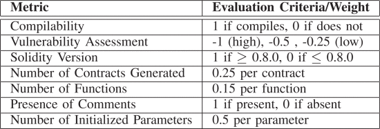
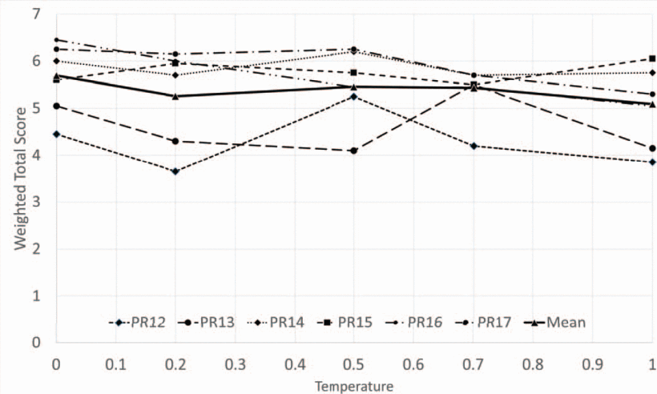

## 关于合约的生成部分：

[利用大型语言模型自动生成智能合约 |IEEE 会议出版物 |IEEE Xplore --- Leveraging Large Language Models for Automatic Smart Contract Generation | IEEE Conference Publication | IEEE Xplore](<https://ieeexplore.ieee.org/abstract/document/10633392/authors#authors>)

其中，关于生成代码质量的评估办法具有相当好的价值

他们通过简单的COSTAR zeroshot方法获得了如下的评分

在向 ChatGPT API 端点发出的  _54_ 个请求中（ _6_ 个提示中每个提示  _4_ 个，每  _6_ 个提示的  _5_ 个温度值中每个请求 1 个），OpenAI 模型 gpt-4-0125-preview 能够在 98.1% 的情况下生成可编译的智能合约。这种高成功率可能表明 LLM 具有强大的能力，可以解释和处理自然语言提示和合同中指定的法律要求，并将它们翻译成语法和语义正确的智能合约代码。因此，LLMs 可以代表自动生成智能合约的有效工具，从而简化其开发过程。高成功率符合我们的预期，因为如 中所述 Section III-C ，OpenAI 模型可能已经在各种数据上进行了训练，包括包含有效 Solidity 代码的 GitHub 项目。

当然这篇里面的内容也是可以参考的

[Smart Contract Generation Assisted by AI-Based Word Segmentation (mdpi.com)](<https://www.mdpi.com/2076-3417/12/9/4773>) 不过也只能参考其评估方式了，比如说把“代码是否可编译”纳入评分权重

## 关于漏洞检测

[Smart Contract Vulnerability Detection: The Role of Large Language Model (LLM) (acm.org)](<https://dl.acm.org/doi/pdf/10.1145/3687251.3687253>)

目前本篇文章中完成了最好的一个微调模型，不过模型并没有开放

## 关于dialogue system

[A Survey on Recent Advances in LLM-Based Multi-turn Dialogue Systems (arxiv.org)](<https://arxiv.org/pdf/2402.18013>) 这一篇可以参考来作为使用会话方式的引子

**多轮对话系统进展** ：论文详细阐述了基于LLM的多轮对话系统的最新进展，包括开放领域对话（ODD）和任务导向对话（TOD）系统，以及相关的数据集和评估指标。主要的多轮次对话系统有这两种，用于评估多轮对话系统性能的自动评估和人工评估方法，包括目标达成率、槽准确率、BLEU分数、实体F1等。

### 初始提示（Initial Prompt）

**目的** ：设定任务的背景和目标。 **示例** ：

    
    “假设你是一位项目经理，你的团队正在开发一个新的软件产品。我们需要创建一个详细的需求清单来确保产品开发的方向和完整性。请帮我生成一个初步的需求清单草稿。”

### 引导性提示（Guiding Prompts）

**目的** ：引导模型询问或提供特定类型的信息。 **示例** ：

    
    “首先，我们需要确定产品的主要功能。你能列出一些基本功能吗？例如，用户认证、数据管理等。”

### 细化提示（Refining Prompts）

**目的** ：引导模型进一步细化和具体化需求。 **示例** ：

    
    “对于每个功能，我们需要更详细的描述。例如，对于用户认证，我们需要支持哪些认证方式？需要考虑哪些安全标准？”

### 组织性提示（Organizing Prompts）

**目的** ：帮助模型组织和分类需求。 **示例** ：

    
    “现在我们有了一系列的功能需求，我们可以尝试将它们分类。比如，我们可以将它们分为‘用户体验’、‘性能’和‘安全性’等几个主要类别。”

### 验证性提示（Validation Prompts）

**目的** ：确保需求的完整性和一致性。 **示例** ：

    
    “在我们完成需求清单之前，让我们回顾一下是否有遗漏或需要进一步澄清的地方。比如，我们是否考虑了多平台兼容性？是否有足够的性能指标？”

### 结束性提示（Closing Prompt）

**目的** ：总结和完成需求清单。 **示例** ：

    
    “非常好，我们已经覆盖了大部分关键需求。现在，我们可以将这些需求整理成一个最终的清单，并为每个需求分配优先级。请帮我生成一个带有优先级的最终需求清单。”

通过这样的多轮交互，你可以逐步引导模型生成一个详细且结构化的需求清单。每个提示都旨在引导模型更深入地思考和细化需求，从而确保生成的清单全面且实用。这种方法可以应用于多种复杂的任务，通过精心设计的提示来提高模型的输出质量和相关性。
