\n

## 命题逻辑

\n\n\n\n

合式公式的递归定义

\n\n\n\n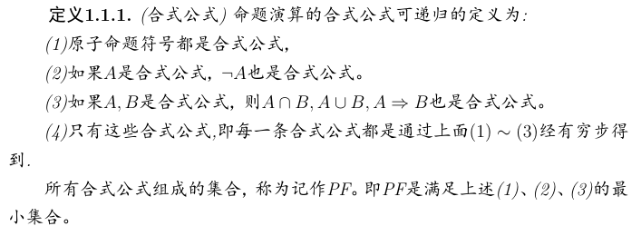\n\n\n\n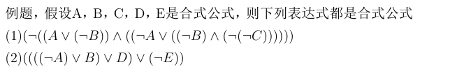\n\n\n\n

\n
  * ⊢
\n
\n\n\n\n

⊢ is an assertion. It **IS NOT necessarily correct**  and **a specific deduction model**  must be given to make this assertion.  
E.g. Sequent A, B ⊢ C, D means that under current deduction model, if both A and B are true, then either C or D is true. This assertion may be correct.  
And under natural deduction, A ⊢ B and ⊢ A→B are the same.

\n\n\n\n

\n
  * ⊨
\n
\n\n\n\n

⊨ is a semantic entailment symbol used to check the relationship among certain variables under every logic model. It’s more like a universal version of ⊢, and it **IS NOT necessarily correct**  as well.  
E.g. _I’ve just had my meal ⊨ Something just traveled to my stomach through my throat_  
This semantic entailment isn’t necessarily correct, for there might be some creature using other holes for eating instead of the one we called mouth.

\n\n\n\n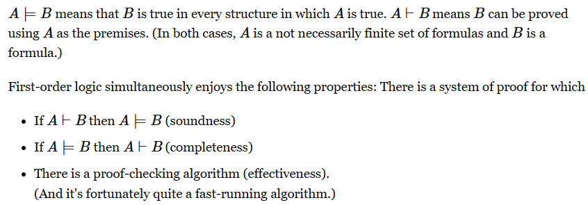\n\n\n\n

### 初始段定义

\n\n\n\n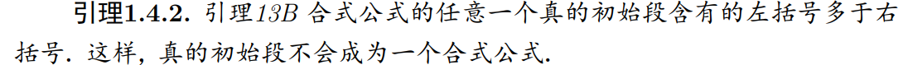\n\n\n\n

### 归纳与递归

\n\n\n\n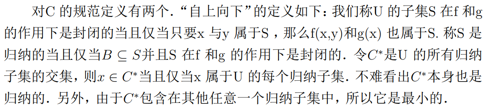\n\n\n\n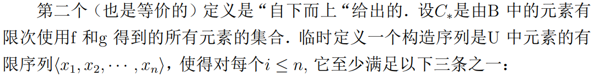\n\n\n\n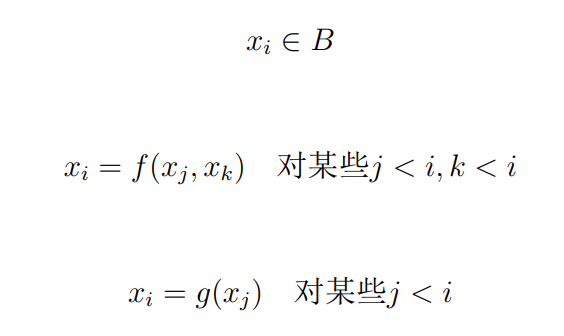\n\n\n\n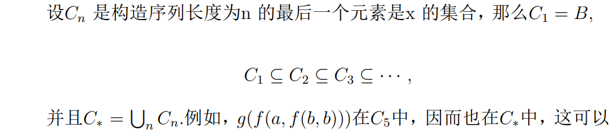\n\n\n\n

关于以上两个定义的等价性证明如下：

\n\n\n\n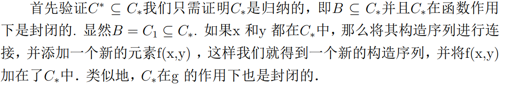\n\n\n\n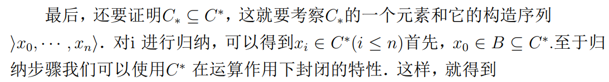\n\n\n\n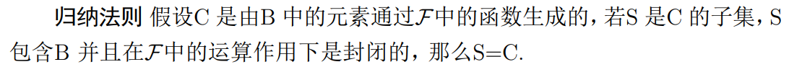\n\n\n\n

**关于递归**

\n\n\n\n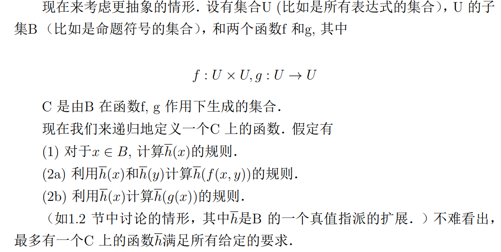\n\n\n\n

\n\n\n\n

## 一阶逻辑

\n\n\n\n

[数理逻辑初步：命题逻辑、一阶逻辑和二阶逻辑_一阶逻辑和二阶逻辑的区别-CSDN博客](<https://blog.csdn.net/qq_43391414/article/details/117397388>)

\n\n\n\n

一阶逻辑（语言）的字母表

\n\n\n\n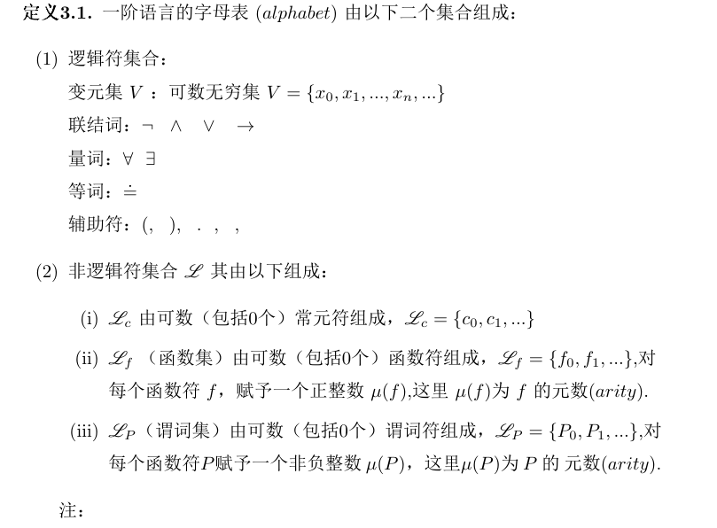\n\n\n\n

一阶逻辑的特征例子（与自然语言相互翻译）

\n\n\n\n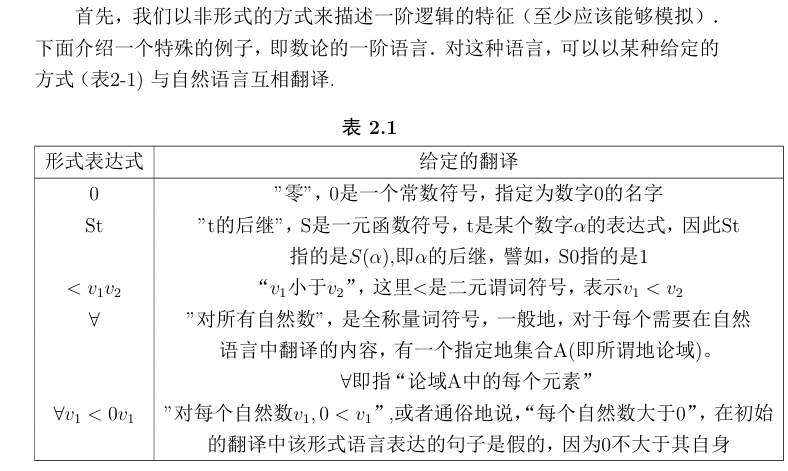\n\n\n\n

本章节使用了简化版的命题连接符号，即Hilton体系（忘了叫啥了）

\n\n\n\n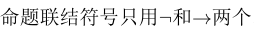\n\n\n\n

表达式是符号的任意有限序列，大多数的表达式是没有意义的 ，但是项和合式公式是具有特定意义的表达式

\n\n\n\n

项是语言中的名词和代词，是可以翻译成对象名称的表达式，原子公式是指那些没有使用连接符号和量词符号的合式公式

\n\n\n\n

项（term）  
给定一个一阶逻辑语言L，定义L中的项为：  
每个变元vi 是项  
令V是所有变元组成的集合  
每个L中的常数符号是项  
如果t1,…,tn 是项并且 f 是 L 中 n 元函数符号，那么  
f t1 . . . tn 也是项  
令T 是所有项组成的集合

\n\n\n\n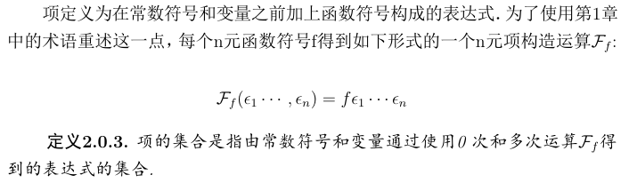\n\n\n\n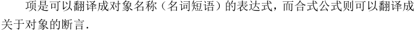\n\n\n\n

小明是一位数学家  
math(小明)。其中math(x)表示：x是一位数学家。

\n\n\n\n

谓词：  
一个含有变量的命题，例如上述math(x)。

\n\n\n\n

谓词符号：  
就是上述的math,die之类的。只是通常我们习惯用大写表示比如：F,G,H，但是随便用也行。

\n\n\n\n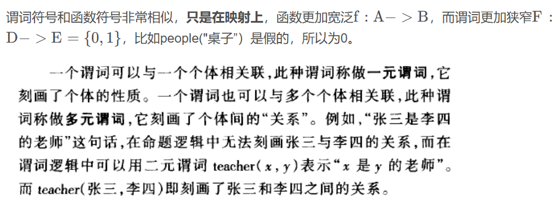\n\n\n\n

合式公式定义：

\n\n\n\n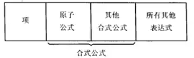\n\n\n\n

原子公式定义

\n\n\n\n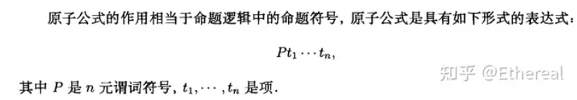\n\n\n\n\n\n\n\n

关于自由变量（自由出现）定义：

\n\n\n\n\n\n\n\n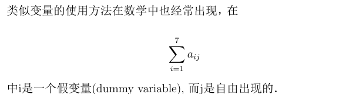\n\n\n\n

由于只用两个逻辑符号，所以需要缩写：

\n\n\n\n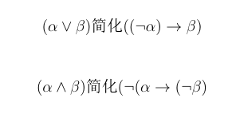\n\n\n\n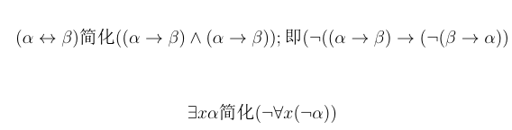\n\n\n\n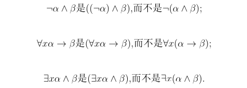\n\n\n\n

与命题逻辑不同

\n\n\n\n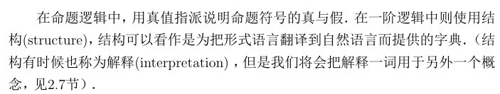\n\n\n\n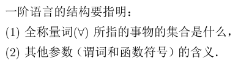\n\n\n\n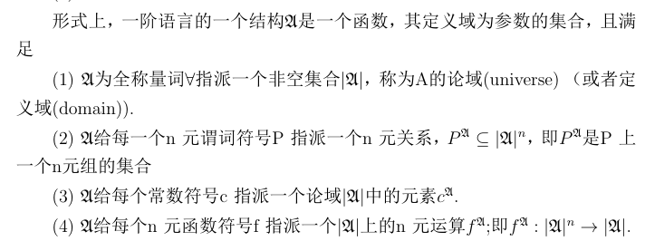\n\n\n\n

\n\n\n\n

s(x|d)

\n\n\n\n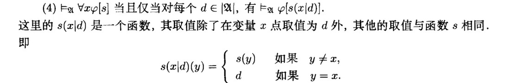\n\n\n\n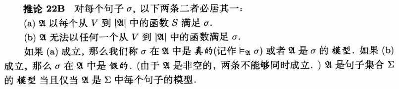\n\n\n\n

结构和谓词一起定义计作

\n\n\n\n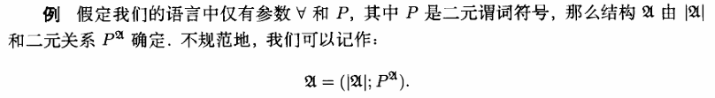\n\n\n\n

### 逻辑蕴涵

\n\n\n\n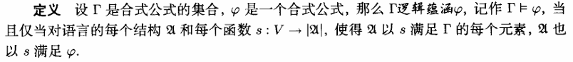\n\n\n\n

\n\n\n\n

\n\n\n\n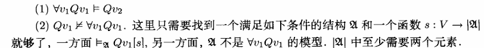\n\n\n\n

规则T：

\n\n\n\n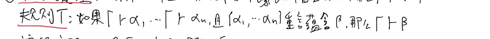\n\n\n\n

**概化定理**

\n\n\n\n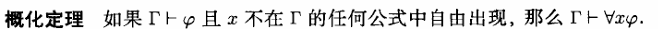\n\n\n\n

**演绎定理**

\n\n\n\n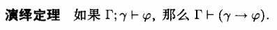\n\n\n\n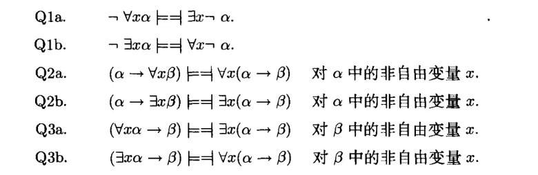\n\n\n\n

可靠性定理

\n\n\n\n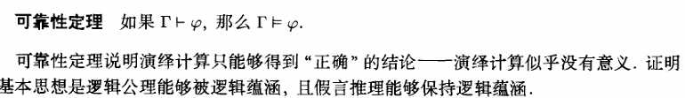\n\n\n\n

完备性定理

\n\n\n\n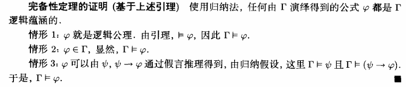\n\n\n\n

替换引理

\n\n\n\n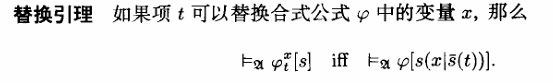\n\n\n\n

哥德尔完备性定理

\n\n\n\n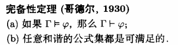\n\n\n\n

和谐的

\n\n\n\n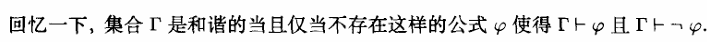\n\n\n\n

[所有要掌握的作业数理逻辑](<../../assets/images/2024/10/所有要掌握的作业数理逻辑.docx>)[下载](<../../assets/images/2024/10/所有要掌握的作业数理逻辑.docx>)

\n