## 一、人机交互概述

### 1.什么是人机交互

HCI 是一门涉及人类使用的**交互式计算系统** 的**设计、评估和实施** 以及**围绕它们的主要现象的研究** 的学科

2.为什么要考虑用户？信息发展趋势

  1. 用户：热爱技术的专业人员->缺乏耐心的消费者

  2. 场景：更多样的终端和任务、更频繁的人机对话

  3. 人机交互能够让计算机更懂“人”，让人机对话更加“自然”

  1. 

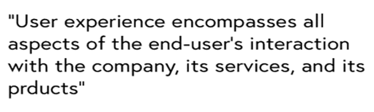

不能够设计用户体验，只能为用户体验而设计!

    
    以下哪些工作属于人机交互的研究范畴：全部是
  提出了一种在VR中进行3D草图绘制的方法
  发明了一种适用于VR的手持控制器
  设计了一种数据可视化技术
  使用智能手机教视觉受损的人写字
  在语音引导APP.上以讲故事的方式来教儿童计算思维概念
  聘请教师共同设计K-12教育的Al课程

设计和开发人员容易犯的两类错误  
1 假设对于技术的使用方式的理解可以通过他们的自主思考实现，即**想  
象这个技术是如何被使用的**  
2 认为**每个人都是相同的**

### 2.**HCI 的研究内容**

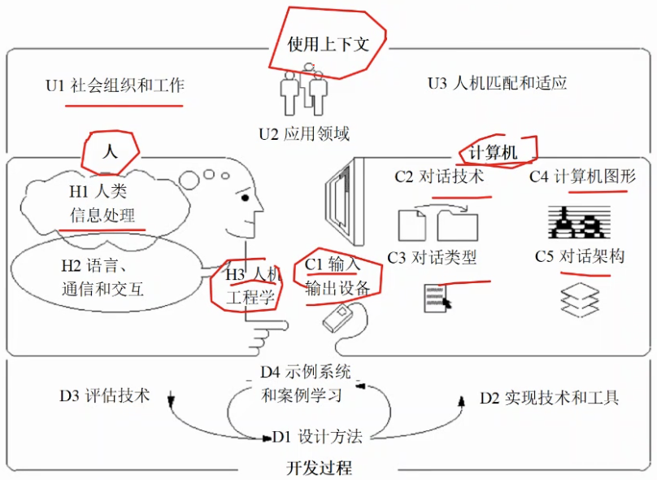

### 3.HCI的重要性

  1. 市场角度

     1. 用户期望简单易用的系统

     2. 对设计低劣系统的容忍度越来越差

  2. 企业角度

     1. 提高员工的生产效率

     2. 降低产品的开发成本

     3. 降低产品的后续支持成本

  3. 用户角度

     1. 获得较高的主观满意度

     2. 减少时间、金钱、生命损失

我们当前的交互时代是？GUI Graphical User Interface

传统SE方法在实现交互式系统方面的缺陷

没有提出明确地对用户界面及可用性需求进行描述的方法  
不能够在系统开发过程进行中对用户界面进行终端测试  
具有完善的系统功能：产品的可用性、有效性以及满意度并不高

## 二、交互设计的原则与目标

### 1.交互框架

作用  
\- 提供**理解或定义某种事物的一种结构**  
\- 能够帮助人们**结构化设计过程**  
\- 认识**设计过程中** 的主要问题  
\- 还有助于**定义** 问题所涉及的**领域**

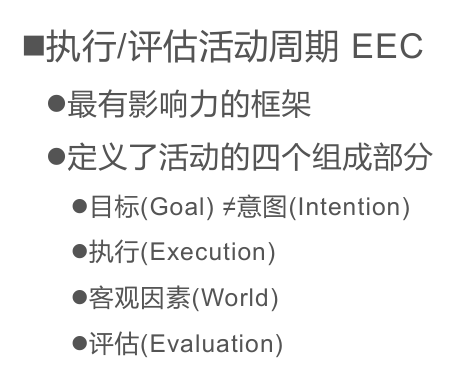

Tip:  
单个目标可对应多个意图

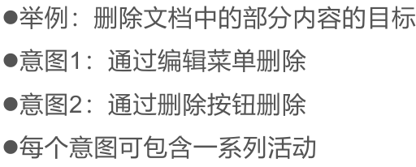

### 2.EEC模型（Execution Evaluation Cyclicality）

  1. 共有七个阶段

     1. 1-4:执行阶段：左半部分

     2. 5-7:评估阶段：右半部分

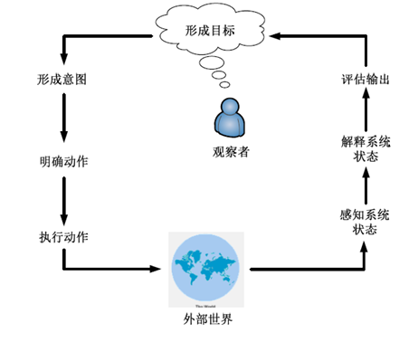

问题

  1. 用户**想要执行的动作** 和**系统允许的动作** 有差异，比如想要提交找不到提交按钮，这个问题（差异）叫什么？执行隔阂

  2. 评估阶段中可能出现的一个问题是用户执行一个操作后总是想**感知一下自己的操作的情况** （是否结束、是否需要修改），但是系统没有给反馈，这个问题叫什么？评估隔阂

  1. EEC模型可解释为什么有些界面的使用存在问题

     1. **执行隔阂** 

        1. 用户为达目标而制定的动作与系统允许的动作之间的差别

        2. “保存文件” 举例

     2. **评估隔阂** ：系统状态的实际表现与用户预期之间的差别

执行隔阂：用户想要执行的动作和系统允许的动作有差异，比如想要提交找不到提交按钮；  
评估隔阂：（评估阶段中）用户执行一个操作后总是想感知一下自己的操作的情况（是否结束、是否需  
要修改），但是系统没有给反馈。

### 3.扩展 EEC 模型

  1. EEC模型不能描述人与系统通过界面进行的通信

  2. 四个构成部分+四个步骤(翻译过程）

     1. 系统:内核语言

     2. 用户:任务语言

     3. 输入:输入语言

     4. 输出:输出语言

  3. 执行阶段

     1. 定义，执行，表现

     2. 设计人员应保证从输入到系统的翻译是容易的

  4. 评估阶段：观察

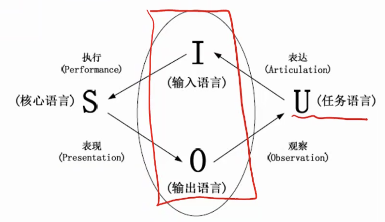

### 4.可用性目标

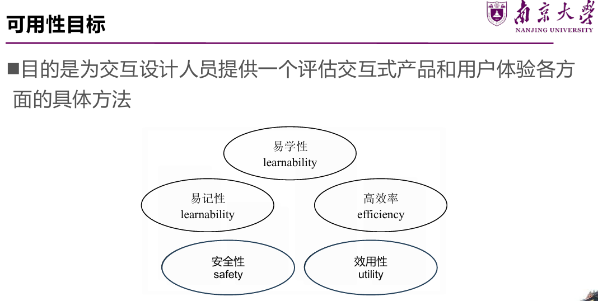

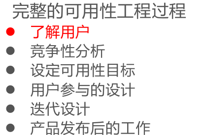

#### **可用性工程的四种有效技术**

  * 用户和任务观察

  * 场景

  * **边做边说** （重要，最有价值的单个可用性工程方法）

    * 让真实用户在使用系统执行一组特定任务时，讲出他们的所思所想

    * 最有价值的单个可用性工程方法

    * 可以了解用户为什么这样做，并确定其可能对系统产生的误解

    * 实验人员需要不断地提示用户，或请他们事先观摩

  * **启发式评估** （重要）

    * 研究表明，能够发现许多可用性问题

    * 剩下的可以通过简化的边做边说方法来发现

    * 为避免个人的偏见，应当让多个不同的人来进行经验性评估

    * 结论  
5名专家能够发现约80%的可用性问题  
被认为是最恰当的可用性测试用户数量  
建议将测试分阶段进行

基本原则 **Alan Dix**  
可学习性：新用户能用它开始有效的交互并能获得最大的性能  
灵活性：用户和系统能以多种方式交换信息  
健壮性

### 黄金规则

1\. 尽可能保证一致  
2\. 符合普遍可用性  
3\. 提供信息丰富的反馈  
4\. 设计说明对话框以生成结束信息  
5\. 预防并处理错误  
6\. 让操作容易撤销  
7\. 支持内部控制点  
8\. 减轻短时记忆负担

### 十项启发式规则

1.系统状态可见度  
2.系统与现实世界吻合  
3.用户有控制权和自主权  
4.一致性和标准化  
5.避免出错  
6.依赖识别而非记忆  
7.灵活性和高效性  
8.审美感和最小化设计  
9.帮助用户识别、诊断和恢复错误  
10.帮助和文档

### 格式塔心理学（Gestalt心理学）

研究人是如何感知一个良好组织的模式的，而不是将其视为一系列相互独立的部分。事物的整体区别于  
部分的组合。表明：用户在感知事物的时候总是尽可能将其视为一个“好”的型式。  
四大原则：

  1. **相近性原则：** 空间上比较靠近的物体容易被视为整体。

  2. **相似性原则：** 人们习惯将看上去相似的物体看成一个整体。功能相近的组件应该使用相同或相近的  
表现形式。

  3. **连续性原则：** 共线或具有相同方向的物体会被组合在一起。将组件对齐，更有助于增强用户的主观  
感知效果。

  4. **完整性和闭合性原则：** 人们倾向于忽视轮廓的间隙而将其视作一个完整的整体：页面上的空白可帮  
助实现分组。

### 七项原理

  1. fitts定律（菲兹定律）：距离和目标大小，预测从任意位置快速移动到一个目标位置所需的时间

  2. 米勒定律（7±2）

  3. 希克定律：用户面临很多选择，作出决策时间越长。→专注、克制

  4. 接近法则：通常把位置相对靠近的事物当成一个整体

  5. 特斯勒定律：复杂性守恒。只能将固有的复杂性从一个地方移动到另外一个地方

  6. 奥卡姆剃刀：“修剪”设计中多余的元素，简单有效原理

  7. 新乡重夫：防错原则。设计中非常有必要考虑防错机制

### 可用性度量

选择一些能够代表目标用户群体的测试用户，执行一组预定的任务，比较执行情况  
针对五个可用性维度，有不同的度量  
易学性：最容易度量。找一些没用过系统的，要区分新手和老登  
高效率（使用效率度量）：度量绩效水平，同样要区分不同的用户群体。为用户绘制学习曲线：当发现用户的绩效水  
平在一段时间内不再提高时，就认为已经达到了该用户的稳定绩效水平  
易记性：对在特定长时间内没有使用系统的用户进行标准用户测试，记下执行时间；对用户进行记  
忆测试  
效用性（用户体验，满意度）：比较主观，询问用户/用户测试完成后调查问卷  
安全性(错误率)：在用户执行特定任务时通过统计这种操作的次数；可以在度量其他可用性属性的  
同时来度量；错误发生后能够被用户立刻纠正，不会对系统带来灾难性的影响：往往会被包含在使  
用效率的统计当中  
**调查问卷设计：**  
不论采用什么评价尺度，都应当在大规模测试前进行小规模试点测试  
**Likert度量尺度**  
“很容易学会怎样使用这个系统” 不同意 1 2 3 4 5 同意  
**语义差异尺度标准**  
请在最能够体现您对这个系统印象的位置上做标记 愉快 ———————气恼  
以1-5或1-7的Likert度量尺度或语义差异尺度作为打分标准

## 三、评估的基础知识

评估是设计过程的组成部分

### 什么是评估

系统化的数据搜集过程  
\- 用户在与原型、应用程序、计算机系统、系统组件、应用程序或界面草图交互时收集  
关于用户体验方面的信息，从而改进其设计  
\- 例如，用户能否找到特定的菜单项？图像是否有用，是否吸引人？产品是否引人入胜？  
\- 评估侧重系统的可用性和用户体验

### 评估的四个“W”

Why-为什么要评估？  
用户不仅期望一个可用的系统，还在追求愉悦感与参与感

What-评估什么？  
对象：原型、可运行系统、特定屏幕功能、完整工作流程、审美设计、安全性等等

Where-在哪里评估？  
取决于正在评估的对象  
实验室环境：提供了必要条件系统地检查产品是否满足用户的所有要求，如智能手机  
按键的大小和布局的评估  
实地环境：如小孩子是否喜欢玩新玩具以及他们玩多久会感到无聊

When-何时开展评估？  
取决于产品的类型  
如果研发新产品，则会投入大量时间做市场调研和建立需求，之后会设计草图/故事图板，可  
以通过评估检查是否正确理解了用户的需求，这被称作“形成性评估”，目的是调整和完善  
设计  
评估已完成产品成功与否被称作“总结性评估”，目的是确定产品需要改进的方面

### 评估原则

评估应该依赖于产品的用户  
评估与设计结合进行  
评估应在用户实际工作任务和操作环境下进行  
要选择有广泛代表性的用户

### 评估范型（方法）

**快速评估**  
可以在任何阶段进⾏  
强调”快速了解“，⽽⾮仔细记录研究发现，得到的数据通常是⾮正式的、叙述性的  
是设计⽹站时常⽤的⽅法  
基本特性：快速  
**可用性测试（用户测试，DECIDE 评估框架）**  
评估典型⽤户执⾏典型任务时的情况，包括出错次数、完成任务的时间等  
基本特征：是在评估⼈员的密切控制下实⾏的  
主要任务：量化表示⽤户的执⾏情况  
缺点：  
测试⽤户的数量通常较少  
不适合进⾏细致的数据分析  
**实地研究（小孩子）**  
基本特征：在⾃然⼯作环境中进⾏  
⽬的：理解⽤户的实际⼯作情形以及技术对他们的影响  
重难点：如何不对受试者造成影响；控制权在⽤户，很难预测即将发⽣和出现的情况  
**预测性评估**  
研究⼈员通过想象或对界⾯的使⽤过程进⾏建模，逐步通过场景或基于问题回答的⾛查法  
基本特征：⽤户可以不在场，整个过程快速、成本较低  
**启发式评估属于预测性评估**

### 评估技术

  * 观察⽤户

    * 有助于确定新产品的需求

    * 可⽤于评估原型

    * 挑战：如何在不⼲扰⽤户的前提下观察⽤户，如何分析⼤量数据

  * 询问⽤户意⻅

    * 问卷调查？

  * 询问专家意⻅

  * 测试⽤户的执⾏情况

    * 可⽐较不同设计⽅案优劣

    * 通常在受控环境中进⾏

  * 基于模型和理论，预测界⾯的有效性

    * GOMS 模型和 KLM 模型

评估方法组合

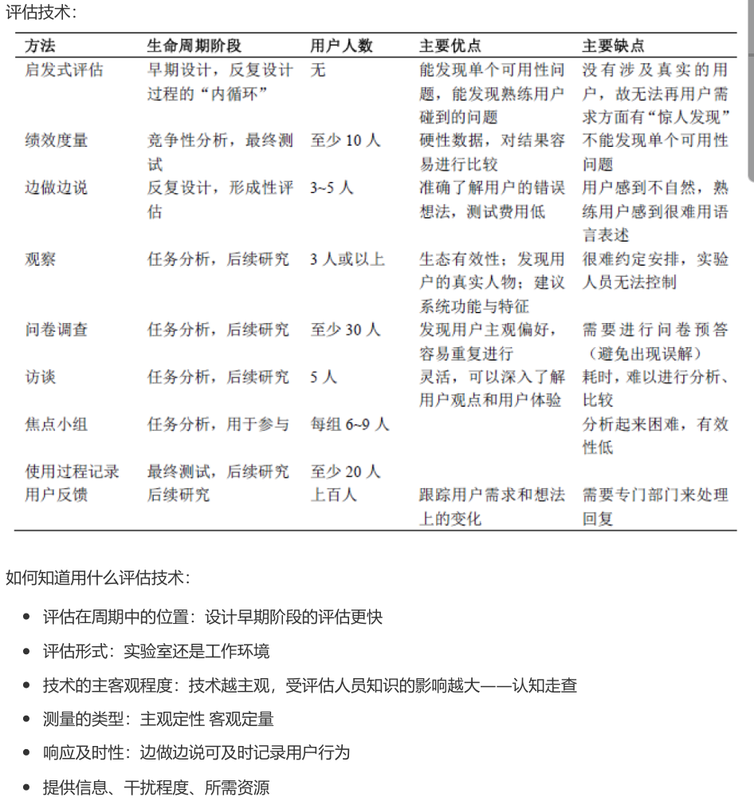

### 人机交互的实证研究方法

实验通常从研究假设开始

假设是一种可以**通过实证研究直接检验** 的精确问题描述

**零假设** ：不同的实验条件不会产生差异

**备择假设：** 与零假设相反的称述

例子：  
下拉菜单和弹出菜单在定位页面的时间开销上没有差异；（零假设）  
下拉菜单和弹出菜单在定位页面的时间开销上存在差异；（备择假设）

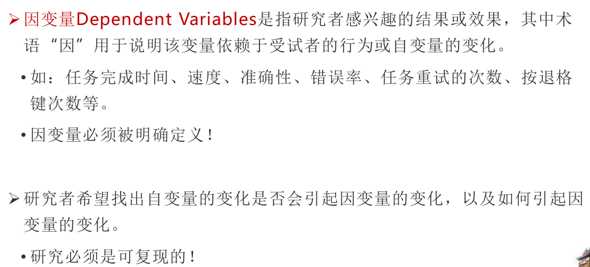

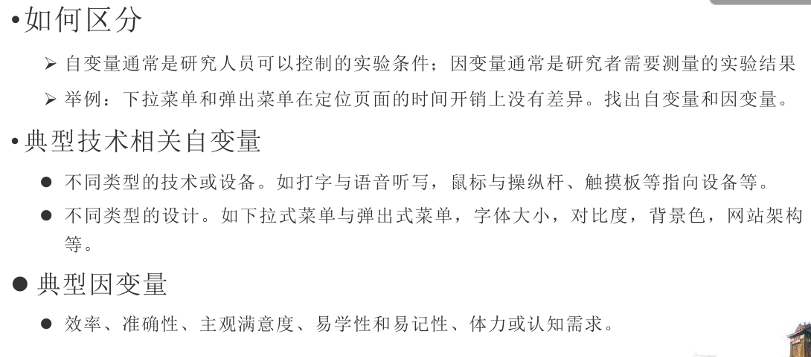

一次实验的构成  

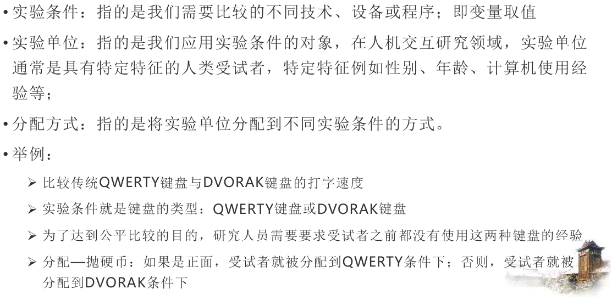

分配方式

实验性研究的强大在于它能够探索因果关系，能够实现这一目标的主要原因即在于它的完全随机化

**在一个设计良好的实验中，你经常会发现，你不仅需要随机分配实验条件，还需要随机分配其他因素**

### 组间设计和组内设计

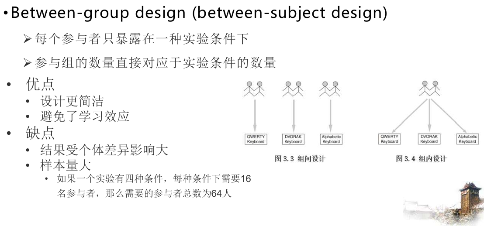

因此组件设计适合个体差异有限且任务的学习影响较大（比如说使用过某个条件下的网站后，参与者很容易获得大量的关于网站架构的知识）

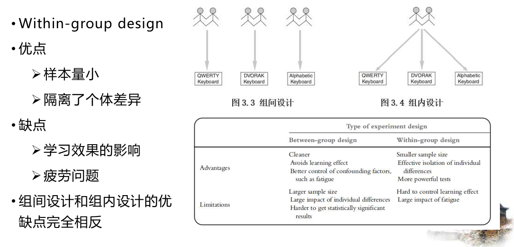

对于组内设计而言，需要尽可能控制学习效果（随机化实验条件顺序，并且提供充分前置培训减少学习效果影响（对于非初始交互）），并且注意解决疲劳问题（使用拉丁方设计Latin Square进行平衡）

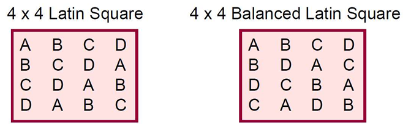

析因设计：  
当一个实验调查一个以上的自变量或因素时，析因设计被广泛采用  
可以同时调查所有自变量的影响以及多个变量之间的交互影响  
相互作用可被描述为“一个自变量对因变量的不同影响，取决于另一个自变量的特定取值

裂区设计：析因研究中的一种设计，既有组间成分，也有组内成分

## 四、观察用户

观察适用于产品开发的任何阶段  
初期：理解用户的需要  
开发过程：检查原型  
后期：对最终产品进行评价

**观察方式**

真实环境中的观察（实地）

  * 观察者既可作为旁观者，也可作为参与者

  * 重点是应用的上下文

实验室观察

  * 观察者不能作为参与者

  * 优点：提供了可控且一致的评估环境 易于分析比较

  * 缺点：可控且一致的评估环境——人为环境，不自然；**可能会降低测试结论的普遍性和一般性**

**观察框架**

  * Goetz and Lecomfte框架：关注事件的上下文、涉及的人员和技术

  * 

  * 

  * Robson框架：有助于组织观察和数据搜集活动

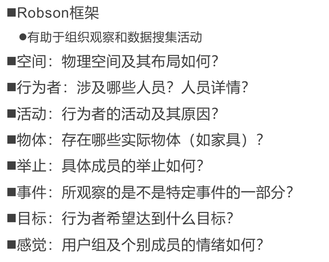

**合作评估**

两位用户共同合作，以便他们互相讨论、相互帮助  
 限制少，评估者很容易学会应用  
 鼓励用户对系统提出批评  
 在出现不清楚的情况时，评估者能够澄清容易混淆的地方  
 能提示许多信息  
尤其适合评估面向儿童的系统  
也适用于多人共享系统的评估

### 观察与访谈相结合

观察方法只能展示用户做了什么，而无法知道用户为什么这样做  
“知其然而不知其所以然”  
应该在记录数据之后再结合其他方法  
如访谈

  * 请用户详细讲述记录里面任何可能引发可用性问题的地方

  * 如对一个没用过系统某个功能的用户，询问为什么没有使用某项功能

让用户面对记录数据时应非常小心  
避免让用户产生被监视的想法

## 五、询问用户和专家

了解用户的需要和对产品的意见和建议  
不知道该怎么做或者对预期的结果没有把握？请专家帮忙

### 访谈（询问用户）

有目的对话的过程  
指导原则：避免过长问题、避免复合句、避免使用让用户尴尬或理解不能的语言、避免使用有诱导性的  
问

类型：

  * 非结构化访谈：问题开放，不限定内容格式

  * 结构化：根据预先的问题

  * 半结构化

  * 集体访谈：个别成员的看法是在应用的上下文中通过其他用户的交流而形成的。焦点小组是集体访

  * 谈的一种形式

焦点小组：

  * 非正式

  * 在界面设计之前和经过一段使用之后评估用户的需要和感受

  * 人数限制：由大约6到9个典型用户组成

  * 如在评估大学的网站时，可考虑由行政人员、教师和学生们组成3个分别的焦点小组

### **问卷调查（询问用户）**

问卷调查是用于搜集统计数据和用户意见的常用方法  
问卷设计原则：

  * 确保问题具体明确

  * 避免使用复杂的多重问题

  * 等等一些三观原则

问卷问题类型：

  * 常规问题 年龄啥的

  * 自由回答 给个建议

  * 量化分级问题

    * 之前的 Likert尺度 和 语义差异度尺度

问卷调查或访谈都属于间接方法，不对用户界面本身进行研究，而只是研究用户对界面的看法

### 认知走查（询问专家）

逐步检查使用系统执行任务的过程，从中找出可用性问题  
主要目标是确定使一个系统如何易于学习  
评估的具体过程就是把用户在完成这个功能时所做的所有动作讲述成一个 令人可以信服的故事

  * 标识用户特性，心理，知识经验啥的

  * 设计样本任务

  * 制作原型或界面描述，明确执行步骤（不一定要可运行的原型）

  * 专家分析

  * 逐步检查任务操作步骤

  * 汇总关键信息

  * 修改更正

优点

  * 不需要用户参与

  * 不需要可运行的原型

  * 能找出非常具体的用户问题

### 启发式评估（询问专家）

评估原则：

  * 评估应该依赖于产品的用户

  * 评估与设计结合进行

  * 评估应在用户实际工作任务和操作环境下进行

  * 要选择有广泛代表性的用户

评估步骤

  * 彻底检查界面

  * 将界面与启发式规则对比

  * 列举可用性问题

  * 对每个问题解释确认

启发式规则：

  * 1.系统状态可见度

  * 2.系统与现实世界吻合

  * 3.用户有控制权和自主权

  * 4.一致性和标准化

  * 5.避免出错

  * 6.依赖识别而非记忆

  * 7.灵活性和高效性

  * 8.审美感和最小化设计

  * 9.帮助用户识别、诊断和恢复错误

  * 10.帮助和文档

优点： 不涉及用户，面临的实际限制和道德问题较少 成本低，不需要特殊设备（被称为经济评估法）

## 六、评估之用户测试

### **DECIDE框架**

六个步骤

  * 决定评估需要完成的总体目标

  * 发掘需要回答的具体问题

  * 选择用于回答具体问题的评估范型和技术

  * 标识必须解决的实际问题，如测试用户的选择

  * 决定如何处理有关道德的问题

  * 评估解释并表示数据

1.确定目标：评估目标决定了评估过程，影响评估范型的选择

举例：设计界面时，需要量化评价界面测试（进行可用性测试）

2.发掘问题：根据目标确定问题

目标：找出为什么客户愿意通过柜台购买纸质机票，而非通过互联网购买电子机票——对于新票据的态度，担心交易安全性，订票系统界面是否友好——问题逐层分解

3.选择评估范型和技术：范型决定了技术类型

必须权衡实际问题和道德问题 可结合使用多种技术

4.明确实际问题

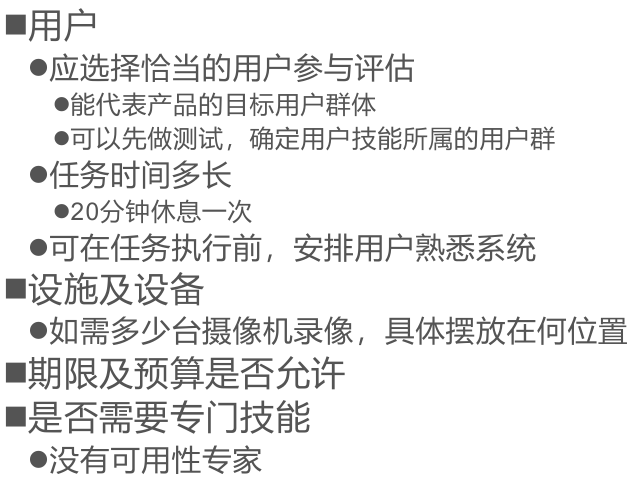

5.处理道德问题

应该保护个人隐私，给出保密事项

6.评估、解释并表示数据

搜集什么类型的数据，如何分析，如何表示

### 小规模试验

  * 对评估计划进行小范围测试

  * 重要性

    * 确保评估计划的可行性

    * 如检查设备及使用说明

    * 练习访谈技巧

    * 检查问卷中的问题是否明确

  * 小规模试验可进行多次

    * 类似迭代设计

    * 测试—反馈—修改—再测试

    * 快速、成本低

### 可用性分级

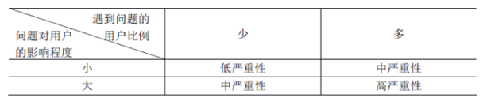

### 用户测试

在**受控环境** 中（类似于实验室环境）测量**典型用户执行典型任务** 的情况  
目的是**获得客观的性能数据** ，从而**评价** 产品或系统的可用性，如易用性、  
易学性等  
最适合对**原型和能够运行的系统** 进行测试  
可对**设计** 提供重要的**反馈**  
在可用性研究中，往往把用户测试和其他技术相**结合**

### 测试设计

用户测试须考虑实际限制并做出适当的折衷

  * 应确保不同参与者的测试条件相同

  * 应确保评估目标特征具有代表性

  * 实验可重复，但通常不能得到完全相同的结果

  * 以DECIDE框架为基础

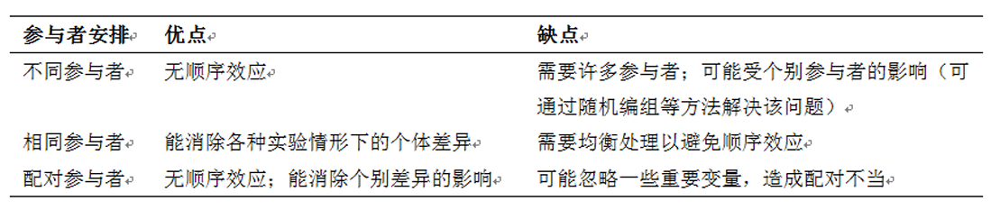

基于DECIDE框架的测试设计的流程

1。定义问题和目标  
2。选择参与者（考虑如何分组，如何选择参与者典型性、性别、具体条件blabla以及分组指派）  
3。设计测试任务（与定义目标相关，不能仅限于需要测试的功能，任务时间介于5-20min，并且从易到难）  
4。明确测试步骤（正式测试前一定要写多次小规模测试！！在必要时帮助参与者解决问题，如果实在无法完成继续下一项。必须分析所有搜集到的数据）  
5。数据搜集（确定如何度量观测结果例子：

  * 完成任务的时间

  * **停止使用** 产品一段时间后，完成任务的时间

  * 执行每项任务时的**出错次数** 和错误类型

  * 单位时间内的出错次数

  * 求助在线帮助或手册的次数

  * 用户**犯某个特定错误的次数**

  * **成功完成任务的用户数**

)和分析

### 分析方法

定量数据：最常用的描述性统计方法是次数统计

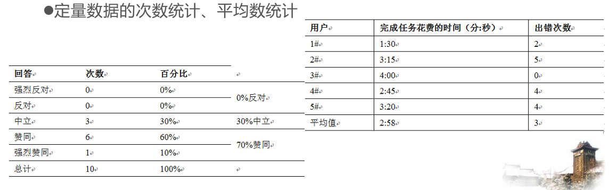

定性数据：按照主体分类的一些描述性统计

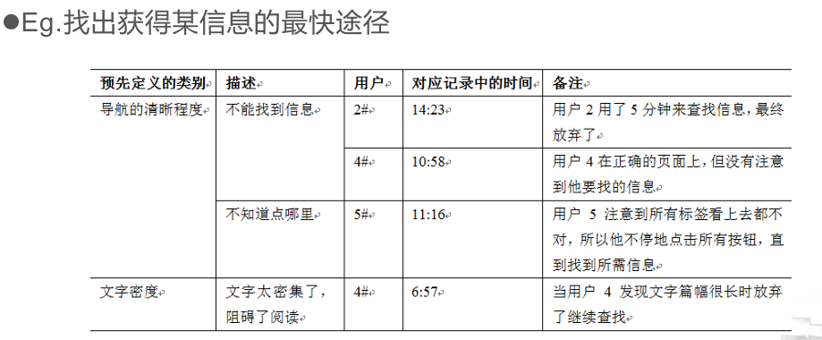

将测试的结果以书面形式反馈给产品的设计人员，以便于他们对设计进一步的分析和改进

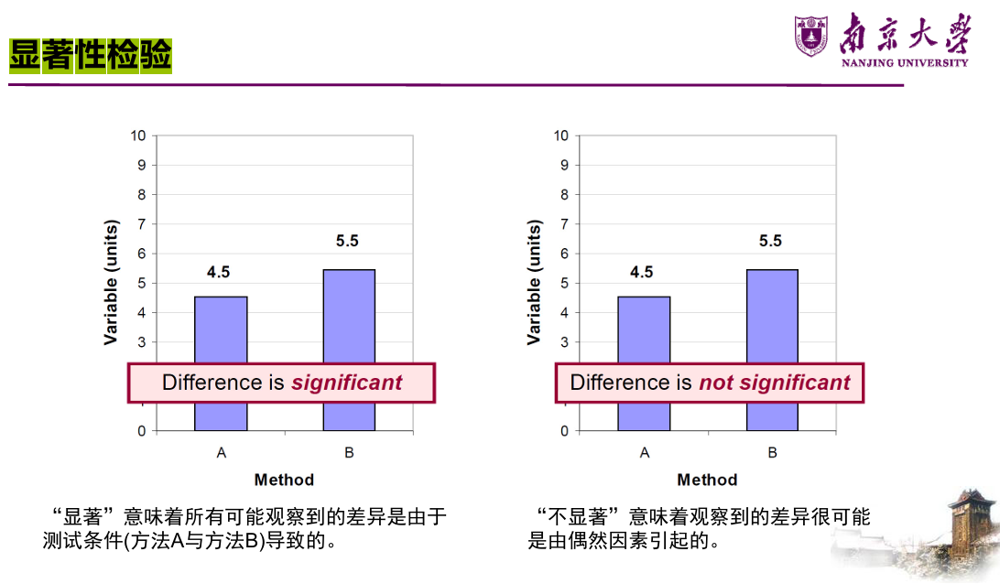

方差分析（ANOVA）是一种广泛应用的显著性检验方法，用来比较两组或更多组的平均值。

### 网站评估实例：

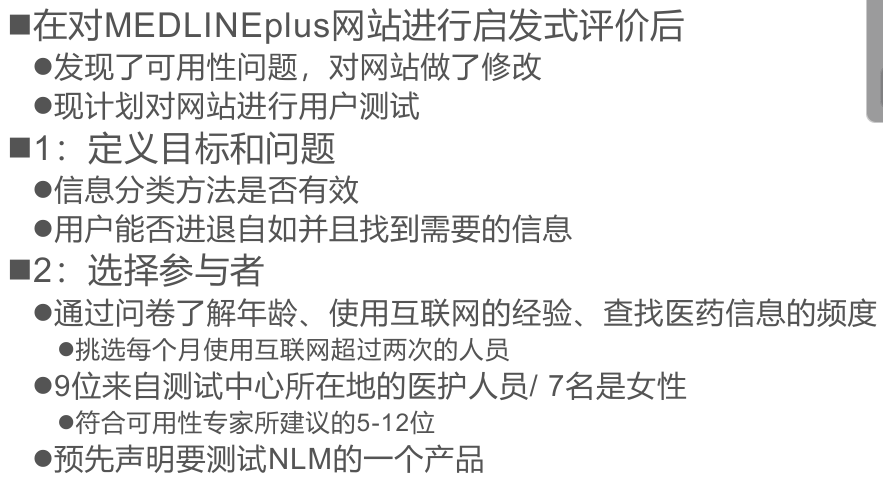

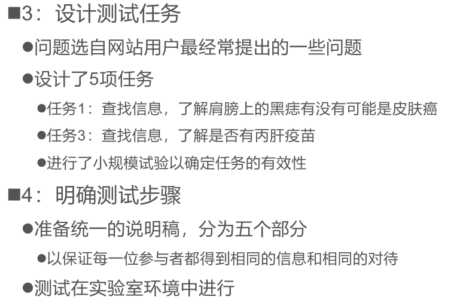

附件部分：

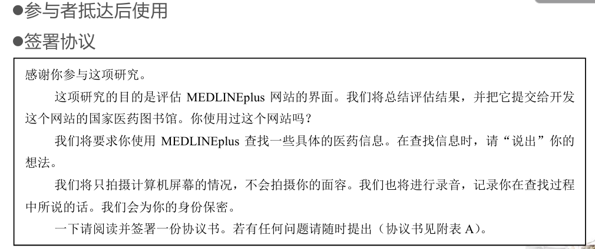

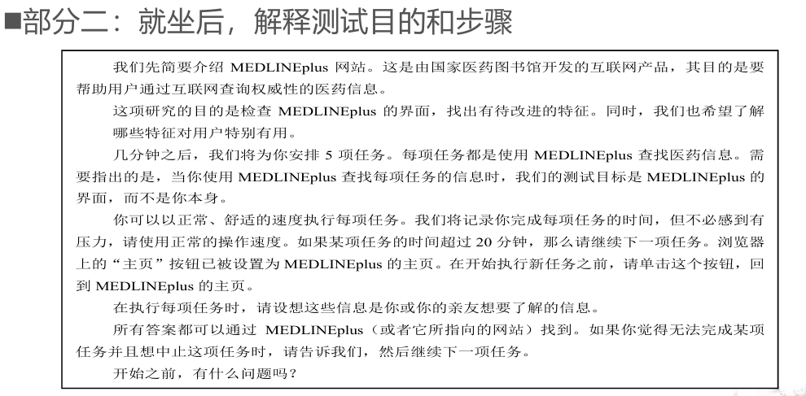

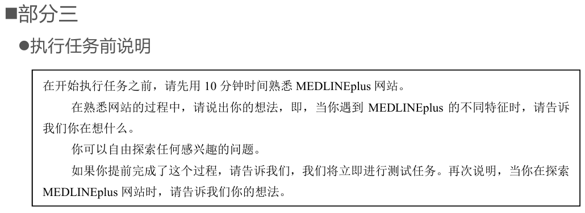

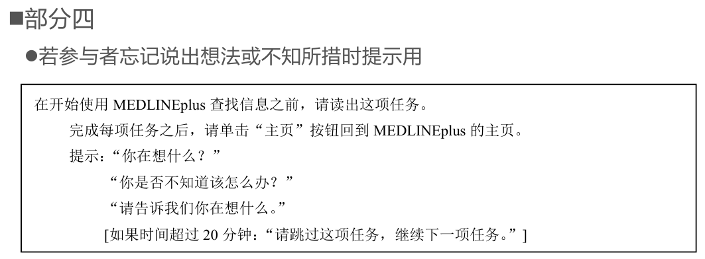

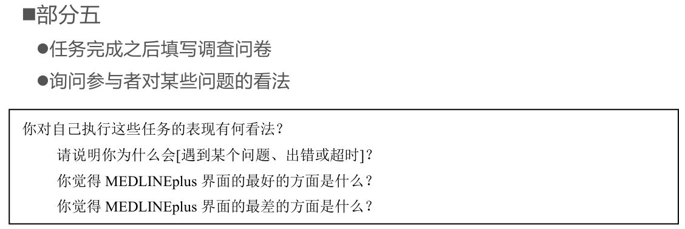

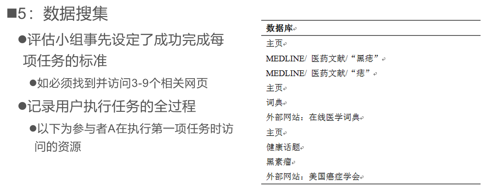

数据来源：根据问卷调查和询问阶段搜集到的数据

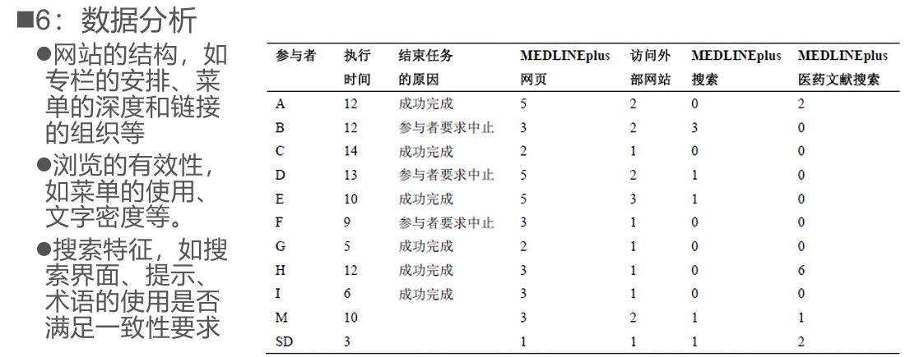

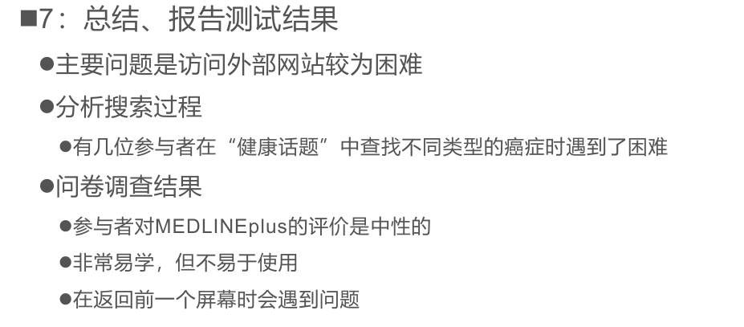

## 七、交互需求定义

### 需求是什么？

  * 需求是关于**目标产品的一种陈述** ，它指定了产品应做什么，或者如何工作

  * 应该是**具体、明确、无歧义的**

“完整下载任何网页的时间应少于5秒”

**产品特性** :从功能、物理条件到使用环境等角度

**用户特性** ：心理学原理可以适用于大多数人，但交互产品设计人员需要意识到个性差异（在交互设计中尽可能体现这些差异）——>真正差异：体验水平、年龄、文化、健康

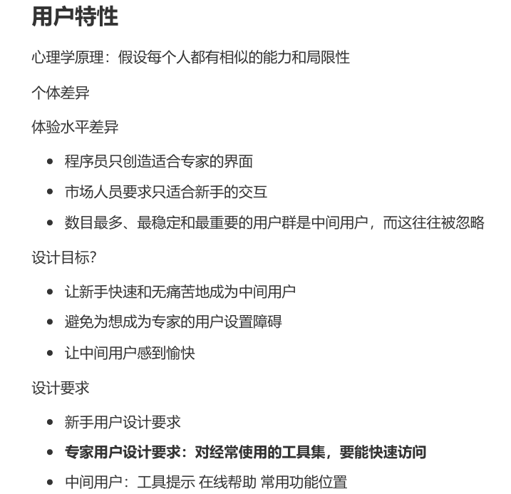

### 用户建模

#### 人物角色：不是真实的人，是基于观察到的真实人的行为和动机，并且在设计过程中代表真实的人

作用：解决产品开发过程中出现的3个设计问题：弹性用户，自参考设计，边缘情况设计

  * 基于如下问题

    * 谁将使用系统？

    * 这些用户属于哪些类型的人群？

    * 是什么因素决定他们将怎样使用系统？

    * 他们与软件的关系有什么特征？

    * 他们通常需要软件提供什么支持？

    * 他们对软件会有怎样的行为？他们对软件的行为有什么期望？

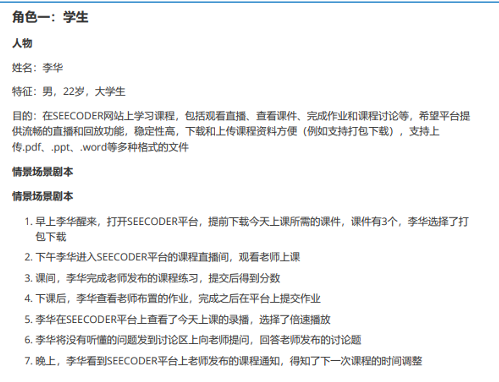

### 需求获取

  * 观察

  * 场景：表示任务和工作结构的”非正式的叙述性描述“，叙述后发掘出任务的上下文环境、用户需求（"讲故事"是人们解释自己做什么或者希望执行某个任务的最自然方式）

    * 故事的焦点就是用户希望达到的目标

    * 若场景说明不断提到某个特定形式、行为或者地点，就表明它是这个活动的核心内容

  * 创建问题和前景综述→头脑风暴→确定人物角色的期望→构造情境场景剧本→确定需求

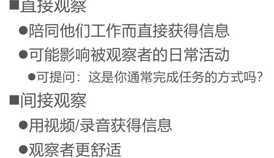

需求定义的5个步骤：

  * 创建问题和前景综述

  * 头脑风暴

  * 确定人物角色的期望

  * 构建情境场景剧本

  * 确立需求

注意  
没有涉及**太具体的界面和技术** 信息  
活动是和Vivien的**目标相关** 的  
尽可能去掉**多余** 的任务

### 原型

低保真原型：

  * 与最终产品不太相似

  * 使用与最终产品不同的材料，如纸张、纸板

  * 优点是简单、快速、便宜、易于制作和修改

  * 举例：

    * 草图

    * 故事

    * 绿野仙踪法（在这种原型测试中，交互设计师就扮演幕后的魔术师的角色。设计师**不需要做有交互的动态原型** ，只需要做**静态** 原型就可以。测试用户操作系统界面时，实验者（交互设计师）通过各种手段来模拟出系统效果。）

高保真原型：

  * 与最终产品更为接近，使用相同的材料

  * 制作时间长，难以修改

  * 风险：用户会认为原型就是系统，开发人员可能以为已经找到了一个用户满意的设计

原型的重要性：

  * 评估和反馈是交互设计的核心

  * 用户往往不能准确描述自己的需要;但用户在看到或尝试某些事物后，就能立即知道自己不需要什么

  * 与文档相比，涉众能够更容易地看到、持有和与原型进行交互

  * 团队成员能够有效沟通

  * 原型回答问题，并支持设计师在备选方案中进行选择

隐喻：

  * 使学习新系统更容易

  * 帮助用户理解底层的概念模型

  * 能够非常创新，并使计算机领域及其应 用程序更容易被更多不同的用户访问

### 任务分析（Hierarchical Task Analysis）

一种用来描述用户的任务以及子任务、这些任务的结构和层次，以及执行任务时用户已经具有的或是需要具有的知识的方法

任务分析对于用户体验至关重要：解决了错误问题(例如，不支持用户任务)的设计无论它的UI有多好都注定  
会失败。

层次化任务分析（HTA）”是人因工效学领域中最广泛使用的方法

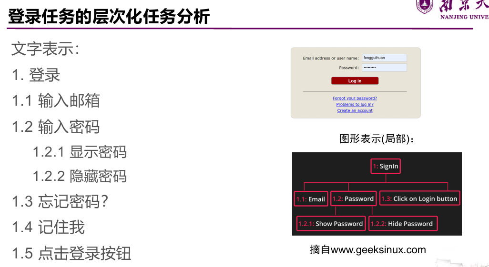

细分的终止规则：对于不能再进一步细分的子目标，在方框下面画一条横线，表示已经不能再细分

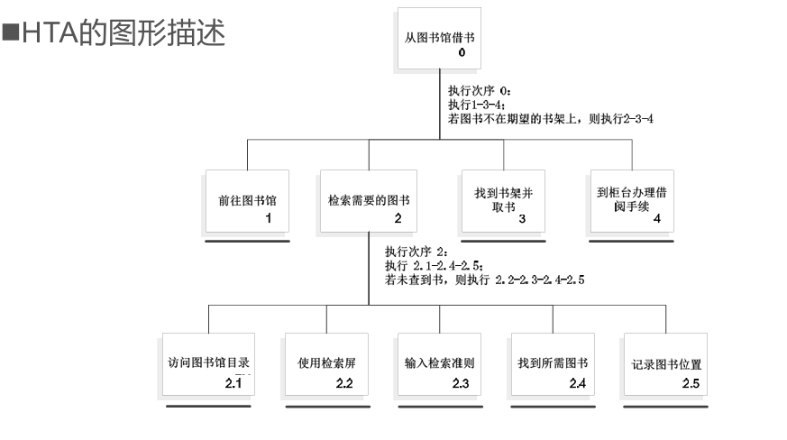

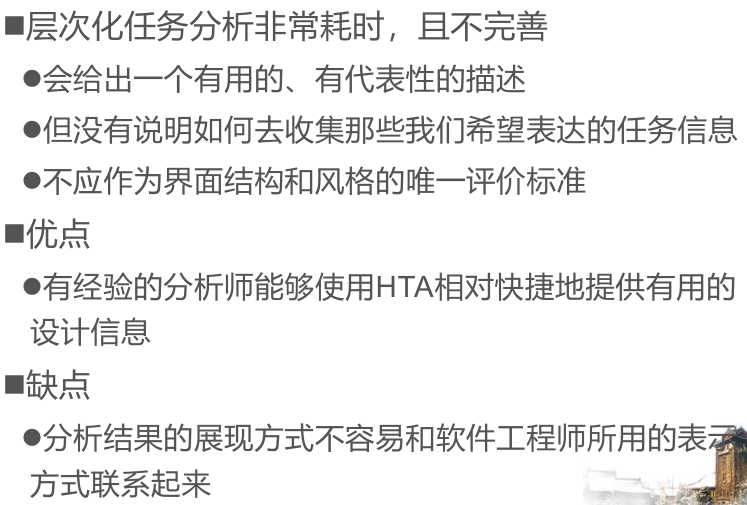

## 八、交互式系统的设计

### 设计框架

过早地把重点放在小细节、小部件和精细的交互上会妨碍产品的设计  
设计框架：  
定义高层次上的屏幕布局  
定义产品的工作流、行为和组织

情绪板

### 简化交互设计策略

删除、组织、隐藏、转移

**删除：**

删除是**最明显** 的简化设计的方法。通过删去杂乱的特性，既可以使设计师专注于把重要问题解决好，又可以让用户更容易找到他们需要的功能，更加心无旁骛地完成任务。此外，衡量是否删除某一功能的核心判据是**是否有价值** ，而不能依靠**已有功能的数目** 、**该功能已经实现的部分** 、**实现该功能的难度** 等来判断。

删除的主要途径有：

  * **关注核心** ：核心即能影响到用户日常使用体验的功能。客户更加关注**基本功能** 的改进，而非新增功能。

  * **砍掉残缺功能** ：不要因为**沉没成本** 影响判断。多想想**为什么** 要留着某个功能。

  * **独立思考** ：要倾听客户的意见，但绝不能盲从，不要简单地因为客户要求就添加功能。

  * **简化操作流程** ：减少用户的操作步骤，例如可以用选择框代替输入框（有时也需要反过来）。

  * **删除视觉混乱** ：删除不必要的视觉元素，例如过多的颜色、过多的字体等。**减少用户必须处理的信息，集中注意力在真正重要的地方** 。

  * **删减文字** ：让文字更加简洁清晰、有说服力，不要啰嗦。

上述的几个途径中，前面的途径更加偏向功能，因此需要更加谨慎；后面的途径多为非功能的，是优化设计的方向。当然，删除不是万能的，不能删减的过多，应当具体问题具体分析。必要时可以参考[十条启发式原则](<https://xjynotes.top/%E4%BA%BA%E6%9C%BA%E4%BA%A4%E4%BA%92%E7%B3%BB%E7%BB%9F/%E4%BA%A4%E4%BA%92%E8%AE%BE%E8%AE%A1%E7%9A%84%E5%8E%9F%E5%88%99%E5%92%8C%E7%9B%AE%E6%A0%87.html#%E5%8D%81%E9%A1%B9%E5%90%AF%E5%8F%91%E5%BC%8F%E8%A7%84%E5%88%99>)。

**组织** ：

组织是**最快捷** 的简化设计方法。组织的本质就是将功能按照一定的**内在逻辑** 进行**分块** ，使得用户能够更容易地找到他们需要的功能。对于名词，可以按照**字母顺序** 、**时空顺序** 等进行组织；对于动词，可以按照**任务流程** 、**操作顺序** 等进行组织。可以多找一些用户，询问他们的分类标准。

组织的一些方法有：

  * **利用不可见的网格来对齐** ：使元素对齐网格可以更好地组织页面元素，并且可以使界面美观。布局是让用户对界面满意的一大因素。

  * **利用大小和位置** ：大的元素更重要，小的元素次之。把相似的元素应当组织到一起（参照[格式塔心理学](<https://xjynotes.top/%E4%BA%BA%E6%9C%BA%E4%BA%A4%E4%BA%92%E7%B3%BB%E7%BB%9F/%E5%9F%BA%E7%A1%80%E7%9F%A5%E8%AF%86.html#%E6%A0%BC%E5%BC%8F%E5%A1%94%E5%BF%83%E7%90%86%E5%AD%A6>)）。

  * **利用分层** ：分层可以帮助用户更好地理解信息的关系，从而更好地找到他们需要的信息。可以眯起眼睛看能否区分不同的层次。

  * **期望路径** ：应当站在用户的角度，考虑用户可能的操作路径，检查规划布局中的潜在问题。

**隐藏** ：

隐藏是一种**低成本** 的简化方案。用户既不会因为不常用的功能而分散注意力，又可以在需要的时候找到这些功能。隐藏可以作为删除功能的开始，然而也需要仔细权衡要隐藏的功能。

一些隐藏的内容有：

  * **隐藏功能** ：隐藏主流用户很少使用，但是自身需要更新的功能；还有一些特定于地区的信息，如时间、日期、汇率等。

  * **隐藏细节** ：可以隐藏一些细节，例如对服务器进行配置的详细信息；

  * **隐藏选项和偏好** ：应当隐藏不常用的选项和偏好，例如修改绘图应用的全局单位；

隐藏的方法有：

  * **折叠** ：折叠可以使用户在需要的时候展开，而不会影响用户的操作，一些**二级菜单** 也类似；

  * **渐进展示** ：一项功能包含少数核心的供**主流用户** 使用的控制部件，另有一些为**专家级用户** 准备的扩展性的精确的控制部件。

  * **适时出现** ：在合适的时机、合适的位置上显示响应的功能。例如，当用户的鼠标悬停在某个元素上时，显示该元素的详细信息。

隐藏时，应当防止不恰当的隐藏，例如隐藏了用户可能需要的功能。此外，应该对隐藏的功能进行**标记** ，放在用户关注点内，以便用户找到。

**转移** ：

将某些功能转移到其他地方，**合理分配职责** 。例如，可以利用移动平台和桌面平台的优势，将功能分配到不同的平台上。有时，也需要将复杂的功能留给用户，让用户自己去完成。

### **卡片分类法（Card Sorting）**

**卡片分类法** 是在产品界面设计初期规划常用的测试方法，它可以探究用户观点，解决了**如何让用户找到他们需要的信息的问题** 。主要用于**导航研究** ，同时也可以用于**布局研究** 和其他设计问题。

卡片分类法的进行方式很简单，首先必须准备一些大小相同的空白卡片，写上卡片的内容，这样便完成了测试前的准备工作。卡片的内容根据研究的目的而定。当研究**导航** 时，卡片上可以写上**任何可能出现在页面或应用菜单上的内容** 。当研究**界面设计** （或表格）时，可以写上**界面元素** （或数据项）等。

卡片分类法中的**分组名称** 可以是**用户自己定义的** ，也可以是**研究者预先定义的** 。在研究过程中，用户可以自由地将卡片分组，也可以自由地将卡片从一个组中移动到另一个组中。研究者可以记录用户的行为，以便后续分析。需要注意的是，分组名称应当**避免抽象、包罗万象** 的名称，且最终的组名之间**不应有重叠** 。

## 九、人机交互基础知识补充

信息处理模型

研究人对外界信息的接收、存储、集成、检索和使用，可预测人执行特定任务的效率，如可推算人需要多长时间来感知和响应某个刺激（又称“反应时间”），信息过载会出现怎样的瓶颈现象等

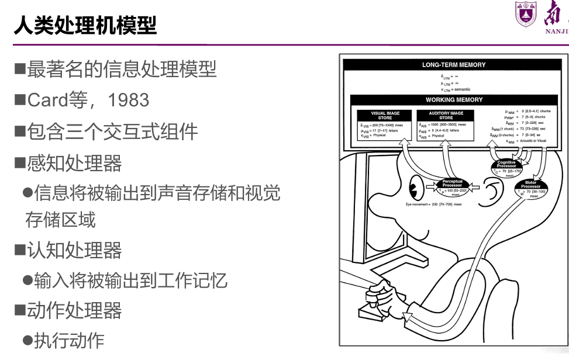

### **格式塔（Gestalt）心理学**

格式塔心理学又称完形心理学

**相近性原则**

空间上比较靠近的物体容易被视为整体

合理运用接近性法则，它能让界面层次清晰有序

**相似性原则**

人们习惯将看上去相似的物体看成一个整体

**连续性原则**

共线或具有相同方向的物体会被组合在一起

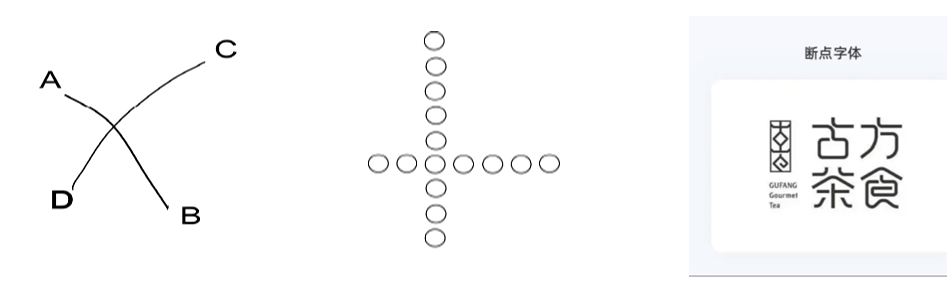

**对称性原则**

相互对称且能够组合为有意义单元的物体会被组合在一起

**完整和闭合性原则**

人们倾向于忽视轮廓的间隙而将其视作一个完整的整体

**前景 &背景**

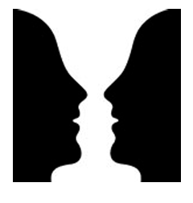

### 记忆特性

分类？瞬时（感觉） 短时 长时  
短时记忆中的信息经进一步加工后会变为长时记忆，只有与长时记忆区的信息具有某种联系的新信息才  
能够进入长时记忆  
长时记忆的信息容量几乎是无限的  
遗忘：长时记忆中的信息有时是无法提取（不代表长时记忆区的信息丢失了）

7±2理论：菜单中最多只能有7个选项……

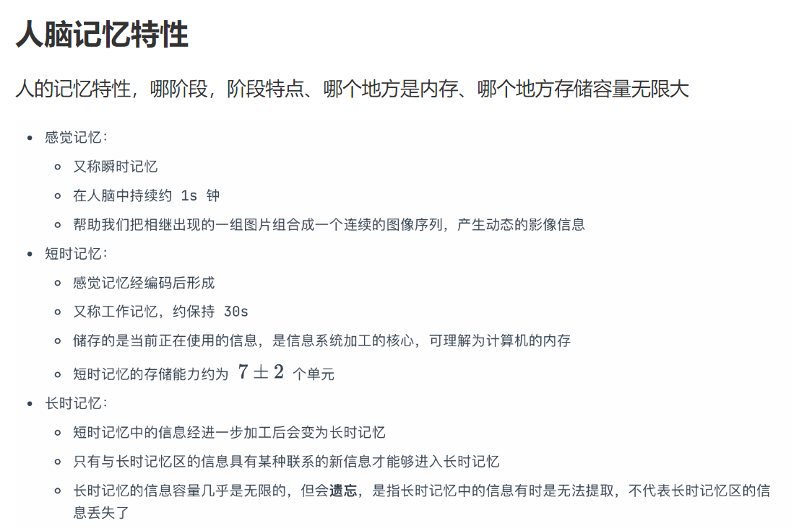

注意使用线索来引导用户完成特定任务

## 十、交互设计模型

交互设计领域  
计算用户完成任务的时间：KLM  
描述交互过程中系统状态的变化：状态转移网  
探讨任务的执行方法等：GOMS

### 预测模型

能够预测用户的执行情况，但不需要对用户做实际测试

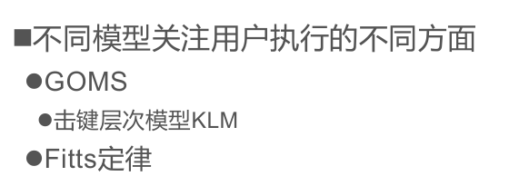

### GOMS模型（Goals,Operations,Methods,Selecting rules）

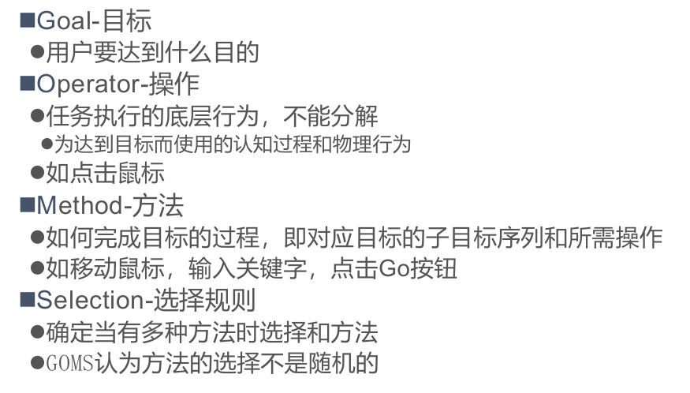

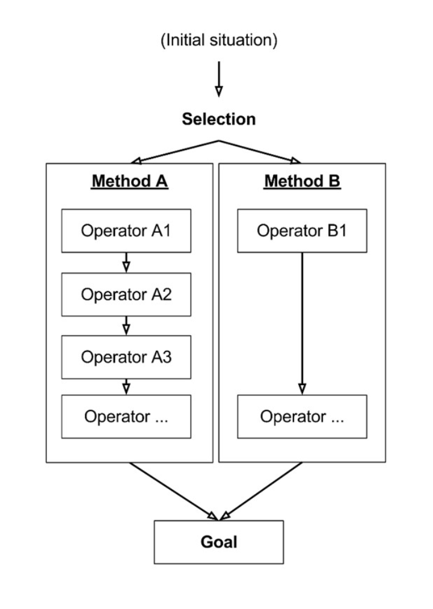

缺点，例如：

  * **理想性** ：假设用户完全按一种正确的方式进行人机交互，没有清楚地描述错误处理的过程；

  * **专家用户主导** ：只针对那些不犯任何错误的专家用户；

  * **任务关系简略** ：任务之间的关系描述过于简单；

  * 忽略了用户间的个体差异。

### 击键层次模型KLM（Keystroke-LevelModel）

**对用户执行情况进行量化预测**  
任务性能仅涉及：时间  
预测无错误情况下专家用户在下列输入前提下完成任务的时间

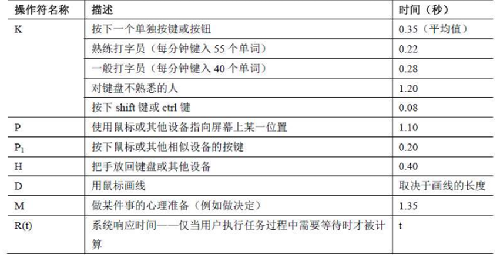

击键层次模型要会算！放置M的启发式规则

  * 在每一步需要访问长时记忆区的操作前放置一个M

  * 在所有K和P之前放置M

  * 如果某个操作符前的M操作完全可以由M之前的操作符预测，则删除M

  * 删除键入单词或字符串之间的M MKMKMK -> MKKK

  * 删除复合操作之间的M

### Fitts 定律

建模可以给出执行**标准任务** 的时间，但是没有考虑**界面本身的特性** 对系统的使用效率的影响。这一部分可以通过**Fitts 定律** 来解释。

**Fitts 定律** 是由**保罗·菲茨** （Paul Fitts）在 1954 年提出的。它源于“轮流轻拍”实验，被试者需要在两个目标之间来回轻拍（要求**尽可能准确** ），最后表明困难指数 ID 与**目标宽度**  W 和**距离**  A 之间的关系为：

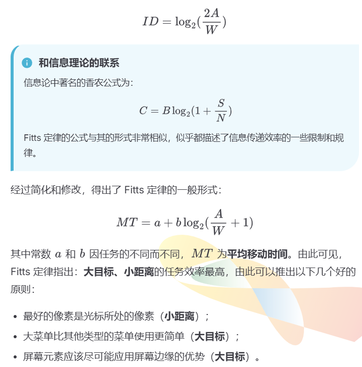

MT平均时间 ID困难指数 IP性能指数 A运动距离或振幅 W目标宽度 一般用a=50,b=150

## 十一、以用户为中心UCD（User Centered Design）

以用户为中心的设计原则

“以用户为中心”是交互设计的主要方法

**以活动为中心**

以用户为中心方法的缺陷  
影响产品的创新性  
可操作性受到时间、预算和任务规模的限制  
忽视了人的主观能动性和对技术的适应能力

把用户要做的“事”（活动）作为重点关注的对象——更适合复杂的设计项目
