\n

## 主题一：资源管理释放与构造析构

\n\n\n\n

### new delete

\n\n\n\n

频繁调用系统的存储管理，会影响效率  
交由程序自身管理内存，提高效率

\n\n\n\n

方法：  
调用系统存储分配，申请一块较大的内存，针对该内存，自己管理存储分配、去配（类似一种内存池的方法）  
通过重载 new 与 delete 来实现  
重载的 new 和 delete 是静态成员  
重载的 new 和 delete 遵循类的访问控制，可继承

\n\n\n\n

重载new：

\n\n\n\n
    
    
    void *operator new (size_t size, …)

\n\n\n\n

new的重载可以有多个  
如果重载了new，那么通过new动态创建该类的对象时将不再调用内置的（预定义的）new  
重载delete：

\n\n\n\n
    
    
    void operator delete(void *p, size_t size)

\n\n\n\n

第一个参数是被撤销对象的地址，第二个参数是大小  
delete的重载只能有一个

\n\n\n\n
    
    
    #include <iostream>\n#include <cstdlib>\n\n// 全局重载 new\nvoid* operator new(size_t size) {\n    std::cout << "Custom new: Allocating " << size << " bytes\\n";\n    void* ptr = std::malloc(size);\n    if (!ptr) throw std::bad_alloc();\n    return ptr;\n}\n\n// 全局重载 delete\nvoid operator delete(void* ptr) noexcept {\n    std::cout << "Custom delete: Freeing memory\\n";\n    std::free(ptr);\n}\n\nint main() {\n    int* p = new int(42); // 调用自定义 new\n    delete p;             // 调用自定义 delete\n    return 0;\n}

\n\n\n\n

注意，new int[size]这样的应该针对new[]进行重载才有效

\n\n\n\n

### 动态变量（from[结构化编程 | Co-rricula](<https://xjynotes.top/C++%E9%AB%98%E7%BA%A7%E7%A8%8B%E5%BA%8F%E8%AE%BE%E8%AE%A1/%E7%BB%93%E6%9E%84%E5%8C%96%E7%BC%96%E7%A8%8B.html>)）

\n\n\n\n

在 `C++` 中，除了从 `C` 继承过来的 `malloc` 和 `free`，还可以用 `new` 和 `delete` 来生成和回收动态变量。

\n\n\n\n
    
    
    int *p = new int[8]; // int *p = (int *)malloc(sizeof(int) * 8)\ndelete[] p; //free(p)

\n\n\n\n

当 `new` 时使用了 `[]`，那么需要在释放时也应当使用。对于申请得来的指针，**切勿轻易移动它** ，防止在 `delete` 时出现问题。(比如此时delete[] p是OK的，但是p++之后，就是错误的）

\n\n\n\n

`new` 和 `malloc` 最大的区别是，当生成的是类的实例时，`new` 会自动调用类的构造函数（如果生成的是数组，则逐个调用）；`delete` 也同理，它会自动调用类的析构函数，而 `delete []` 则可以逐个调用数组的析构函数。

\n\n\n\n

使用指针需要时刻注意**严禁出现空闲指针** ，并**谨防内存泄露** ；

\n\n\n\n

### 智能指针

\n\n\n\n

（原理实现）

\n\n\n\n
    
    
    temple<typename T>\nclass SharedPtr {\npublic:\n   SharedPtr() : _ptr((T *)0), _refCount(0){}\n\n   SharedPtr(T *obj) : _ptr(obj), _refCount(new int(1)){} \n\n   SharedPtr(SharedPtr &other) : _ptr(other._ptr), _refCount(&(++*other._refCount)){}\n\n   ~SharedPtr(){\n    if (_ptr && --*_refCount == 0) {\n        delete _ptr;\n        delete _refCount;\n    }\n   }\n\n   SharedPtr &operator=(SharedPtr &other){\n    if(this==&other)\n        return *this;\n    \n    //新指针引用计数要++  \n    ++*other._refCount;\n\n\t//原指针引用计数要--，如果为0，则释放空间\n    if (--*_refCount == 0) {\n        delete _ptr;\n        delete _refCount;\n    }\n       \n    //重新进行指向 \n    _ptr = other._ptr;\n    _refCount = other._refCount;\n    return *this;\n}\n\n    T &operator*(){\n      if (_refCount == 0)\n          return (T*)0;\n        \n    return *_ptr;\n    }\n\n    T *operator->(){\n       if(_refCount == 0)\n           return 0;   \n    return _ptr;\n}\n\n\nprivate:\n    T *_ptr;\n    int *_refCount;     //这里使用int型指针是为了保证拷贝构造时同一个地址空间的引用计数增加\n};\n

\n\n\n\n

### 构造函数

\n\n\n\n

与类同名、无返回类型  
自动调用，不可直接调用  
可重载（创建类时如无重载，则有默认构造函数）

\n\n\n\n
    
    
    class MyClass {\npublic:\n    MyClass(int x) { // 带参数的构造函数\n        // 构造函数实现\n    }\n};\n\nint main() {\n    MyClass obj(10); // 正确，调用带参数的构造函数\n    MyClass obj2;    // 错误，默认构造函数不存在\n    return 0;\n}

\n\n\n\n

**默认构造函数**

\n\n\n\n

无参数  
无参数的默认构造函数意味着它不需要任何额外的信息就能创建对象。这使得它在很多情况下  
都能被自动调用  
当类中未提供构造函数时，编译系统提供  
一旦自定义构造函数，不再提供默认构造函数  
可用=default启用

\n\n\n\n
    
    
    class MyClass {\npublic:\n    MyClass() = default; // 让编译器生成默认构造函数\n\n    MyClass(int x) { // 带参数的构造函数\n        // 构造函数实现\n    }\n};\n\nint main() {\n    MyClass obj1;    // 正确，调用默认构造函数\n    MyClass obj2(10); // 正确，调用带参数的构造函数\n    return 0;\n}

\n\n\n\n

常为public，也可定义为private，用于以下情况：  
单例模式 (为了防止外部直接创建类的实例)  
工厂模式 (必须通过工厂方法来创建实例)  
有时，一个类可能不打算被直接实例化，而是作为基类或用于其他目的  
实现不可变类  
控制对象生命周期：在某些情况下，对象的创建和销毁需要特定的控制。通过将构造函  
数设为私有，类可以控制其对象的创建

\n\n\n\n

**重载构造**

\n\n\n\n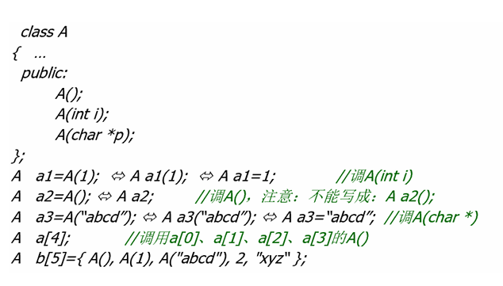\n\n\n\n

**初始化表**

\n\n\n\n

即：方式的语法糖，先于构造函数体执行——减轻compiler负担  
按类数据成员申明次序：初始化顺序是按照**成员变量在类中声明的顺序** ，而不是按照初始化表中的顺序  
就是你自己写的初始化顺序是没用的，不要用后声明的成员变量赋值先声明的在构造函数中尽量使用成员初始化表取代赋值动作  
const 成员/reference 成员/对象成员 (常量成员或引用成员必须在声明时或在构造函数的成员初始化表中初始化)  
效率高  
数据成员太多是不采用本条原则（降低可维护性）

\n\n\n\n
    
    
    ClassName::ClassName(参数列表) : 成员变量1(初始值1), 成员变量2(初始值2), ... {\n    // 构造函数体\n}

\n\n\n\n

### 析构函数

\n\n\n\n

对象消亡时,系统自动调用  
什么情况定义为private：阻止外部销毁，如单例模式  
资源管理类：例如智能指针，确保资源只能通过特定的接口释放（强制自主控制对象存储分配）

\n\n\n\n

基类析构函数：如果基类不应该是可实例化的，可以将其析构函数设为private

\n\n\n\n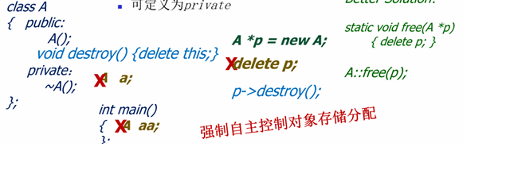\n\n\n\n

对于父类子类的析构函数，需要使用虚析构函数，并在子类重写。如果有需要析构的动态数组，请重写实现。

\n\n\n\n
    
    
    #include <iostream>\n\nclass Base {\npublic:\n    virtual ~Base() { // 虚析构函数\n        std::cout << "Base destructor\\n";\n    }\n};\n\nclass Derived : public Base {\npublic:\n    ~Derived() {\n        std::cout << "Derived destructor\\n";\n    }\n};\n\nint main() {\n    Base* ptr = new Derived(); // 基类指针指向派生类对象\n    delete ptr; // 调用 Derived 和 Base 的析构函数\n    return 0;\n}

\n\n\n\n

如果不这样，如下

\n\n\n\n
    
    
    #include <iostream>\n\nclass Base {\npublic:\n    ~Base() { // 基类析构函数不是虚函数\n        std::cout << "Base destructor\\n";\n    }\n};\n\nclass Derived : public Base {\npublic:\n    Derived() {\n        data = new int[100]; // 动态分配内存\n        std::cout << "Derived constructor\\n";\n    }\n\n    ~Derived() {\n        delete[] data; // 释放内存\n        std::cout << "Derived destructor\\n";\n    }\n\nprivate:\n    int* data;\n};\n\nint main() {\n    Base* ptr = new Derived(); // 基类指针指向派生类对象\n    delete ptr; // 只调用 Base 的析构函数\n    return 0;\n}

\n\n\n\n
    
    
    Derived constructor\nBase destructor

\n\n\n\n

这样会导致内存泄漏

\n\n\n\n

**拷贝构造函数**

\n\n\n\n
    
    
    A(const A &a);

\n\n\n\n

创建对象时，用一同类的对象对其初始化  
自动调用  
注：如果此处不使用**引用** ，就对参数**进行了一次值拷贝** ，就循环调用了具体一些可以这么讲：一个对象需要以值方式传递时，编译器会生成代码调用它的拷贝构造函数以**生成一个副本** 。如果类A的拷贝构造函数是以值方式传递的话，当需要调用类A的拷贝构造函数时，需要以值方式传进一个A的对象作为实参；而以值方式传递需要调用类A的拷贝构造函数；结果就是调用类A的拷贝构造函数导致又一次调用类A的拷贝构造函数，这就是一个无限递归。

\n\n\n\n

**默认拷贝构造函数**

\n\n\n\n

逐个成员初始化，对于对象成员则是递归进行，重载将取消默认拷贝，或者使用=delete取消默认拷贝构造函数

\n\n\n\n

**必要性**

\n\n\n\n

如果我们不自定义拷贝构造函数，很容易导致不同对象指向相同的一块内存，不便于内存管理  
需要自定义拷贝函数，完成深拷贝  
除此以外，还有静态成员的问题

\n\n\n\n
    
    
    class MyClass {\nprivate:\n    int* data;\n\npublic:\n    MyClass(int size) {\n        data = new int[size]; // 动态分配内存\n    }\n\n    ~MyClass() {\n        delete[] data; // 释放内存\n    }\n};\n\nint main() {\n    MyClass obj1(10);\n    MyClass obj2 = obj1; // 默认拷贝构造函数，浅拷贝\n    // obj1 和 obj2 的 data 指针指向同一块内存\n    // 程序结束时，obj1 和 obj2 都会尝试释放同一块内存，导致崩溃\n    return 0;\n}

\n\n\n\n

自定义拷贝构造函数  
对于没有定义拷贝行为的成员，调用成员对象的默认构造函数，而不会调用成员对象的默认拷  
贝函数  
(这一行为是由于，C希望程序员自定义拷贝构造函数后，完全接管对象的构造)

\n\n\n\n

**如果自定义构造函数或者拷贝构造函数，要记得处理每个成员，不然编译器会认为你不想管理**

\n\n\n\n

解释：

\n\n\n\n
    
    
    class Member {\npublic:\n    Member() {\n        std::cout << "Member默认构造函数\\n";\n    }\n    Member(const Member&) {\n        std::cout << "Member拷贝构造函数\\n";\n    }\n};\n\nclass MyClass {\nprivate:\n    Member mem;\n\npublic:\n    MyClass() {\n        std::cout << "MyClass默认构造函数\\n";\n    }\n\n    // 自定义拷贝构造函数\n    MyClass(const MyClass& other) {\n        std::cout << "MyClass自定义拷贝构造函数\\n";\n    }\n};\n\nint main() {\n    MyClass obj1;          // 调用 MyClass 的默认构造函数\n    MyClass obj2 = obj1;   // 调用 MyClass 的自定义拷贝构造函数\n    return 0;\n}

\n\n\n\n

输出：

\n\n\n\n
    
    
    Member默认构造函数\nMyClass默认构造函数\nMember默认构造函数\nMyClass自定义拷贝构造函数

\n\n\n\n
    
    
    class Member {\npublic:\n    Member() {\n        std::cout << "Member默认构造函数\\n";\n    }\n    Member(const Member&) {\n        std::cout << "Member拷贝构造函数\\n";\n    }\n};\n\nclass MyClass {\nprivate:\n    Member mem;\n\npublic:\n    MyClass() {\n        std::cout << "MyClass默认构造函数\\n";\n    }\n\n    // 自定义拷贝构造函数，显式调用 Member 的拷贝构造函数\n    MyClass(const MyClass& other) : mem(other.mem) {\n        std::cout << "MyClass自定义拷贝构造函数\\n";\n    }\n};\n\nint main() {\n    MyClass obj1;          // 调用 MyClass 的默认构造函数\n    MyClass obj2 = obj1;   // 调用 MyClass 的自定义拷贝构造函数\n    return 0;\n}

\n\n\n\n

输出：

\n\n\n\n
    
    
    Member默认构造函数\nMyClass默认构造函数\nMember拷贝构造函数\nMyClass自定义拷贝构造函数

\n\n\n\n

### 总结

\n\n\n\n

\n
  * 如果你**自定义了拷贝构造函数** ，编译器会认为你希望**完全接管对象的构造过程** 。
\n\n\n\n
  * 对于类中的成员变量，如果你没有在自定义拷贝构造函数中显式地指定它们的拷贝行为，编译器会调用它们的**默认构造函数** ，而不是拷贝构造函数。
\n\n\n\n
  * 如果你希望调用成员变量的拷贝构造函数，需要在自定义拷贝构造函数的**初始化列表** 中显式指定。
\n
\n\n\n\n

### 移动构造函数

\n\n\n\n

A(A a);  
只接受右值  
直接把一个临时的右值交给一个左值管理(记得把原来的置为空)  
由于这个右值马上就要消亡了(不过事实上不止是那么简单)，所以直接将引用交给左值就  
行，不需要再进行深拷贝，优化大对象的拷贝问题(例如vector扩容时可以直接移动，不需  
要重新赋值)  
注意，一个右值引用作为参数传进后，**此时的右值就成了一个左值，不能继续作为右值引用** ，  
传递给参数中含右值引用的函数  
左值要作为右值使用: std move

\n\n\n\n

当右值引用作为参数传递到函数中时，**它本身是一个左值** 。这是因为右值引用是一个具名的变量，而具名的变量是左值。

\n\n\n\n
    
    
    class A {\nprivate:\n    int* data;\n\npublic:\n    // 默认构造函数\n    A() : data(new int[100]) {\n        std::cout << "默认构造函数\\n";\n    }\n\n    // 移动构造函数\n    A(A&& other) noexcept : data(other.data) {\n        std::cout << "移动构造函数\\n";\n        other.data = nullptr; // 将原对象的指针置为空\n    }\n\n    // 析构函数\n    ~A() {\n        delete[] data;\n    }\n};

\n\n\n\n
    
    
    std::vector<std::string> vec1 = {"a", "b", "c"};\nstd::vector<std::string> vec2 = std::move(vec1); // 移动语义，避免复制

\n\n\n\n

移动语义特别适合优化大对象的拷贝问题，例如 `std::vector` 扩容时直接移动数据，而不是复制。

\n\n\n\n

因此实现移动构造函数时候需要注意将原资源的对象置为空，否则会出现以下问题：

\n\n\n\n
    
    
    class A {\nprivate:\n    int* data;\n\npublic:\n    A() : data(new int[100]) {}\n\n    // 移动构造函数（未将原对象的指针置为空）\n    A(A&& other) noexcept : data(other.data) {}\n\n    ~A() {\n        delete[] data;\n    }\n};\n\nint main() {\n    A a1;\n    A a2 = std::move(a1); // 移动语义\n\n    // a1 和 a2 共享同一块内存\n    // 程序结束时，a1 和 a2 都会尝试释放同一块内存，导致崩溃\n    return 0;\n}

\n\n\n\n

只有以下操作才是符合移动语义的：

\n\n\n\n
    
    
    class A {\nprivate:\n    int* data;\n\npublic:\n    A() : data(new int[100]) {}\n\n    // 移动构造函数\n    A(A&& other) noexcept : data(other.data) {\n        other.data = nullptr; // 将原对象的指针置为空\n    }\n\n    ~A() {\n        delete[] data;\n    }\n\n    void useData() {\n        if (data) {\n            std::cout << "Using data\\n";\n        } else {\n            std::cout << "Data is nullptr\\n";\n        }\n    }\n};\n\nint main() {\n    A a1;\n    A a2 = std::move(a1); // 移动语义\n\n    a1.useData(); // 输出：Data is nullptr\n    a2.useData(); // 输出：Using data\n\n    return 0;\n}

\n\n\n\n

**为什么要引入new/delete操作符**  
使得constructor和destructor可以被正确调用  
malloc不调用构造函数，free不调用析构函数

\n\n\n\n

**动态对象数组**

\n\n\n\n
    
    
    A *p;\n p = new A[100];\n delete []p;

\n\n\n\n

delete []p ([]不能省) (原理是使用了额外的四个字节来确定数组长度)  
注意: 不能显式初始化，相应的类必须有默认构造函数

\n\n\n\n

**成员函数**

\n\n\n\n
    
    
    class A\n {\n int x,y;\n public:\nvoid show() const;\n }

\n\n\n\n

**const成员函数可以被对应的具有相同形参列表的非const成员函数重载**

\n\n\n\n

在这种情况下，类对象的常量性决定调用哪一个函数：  
const成员函数可以访问非const对象的非const数据成员，const数据成员，也可以访问const对象内的所有数据成员；  
非const成员函数只可以访问非const对象的任意的数据成员，不能访问const对象的任意数据成员

\n\n\n\n
    
    
    class MyClass {\npublic:\n    void func() {\n        std::cout << "非 const 成员函数\\n";\n    }\n\n    void func() const {\n        std::cout << "const 成员函数\\n";\n    }\n};\n\nint main() {\n    MyClass obj1;\n    const MyClass obj2;\n\n    obj1.func(); // 调用非 const 成员函数\n    obj2.func(); // 调用 const 成员函数\n\n    return 0;\n}

\n\n\n\n

void show() const 其实是 void show(const A* const this)  
**即const修饰的其实是类的this指针**

\n\n\n\n

注意：如果类中存在指针类型的数据成员即便是const函数只能保证不修改该指针的值，并不  
能保证不修改指针指向的对象

\n\n\n\n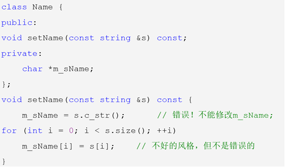\n\n\n\n

### 静态成员

\n\n\n\n

同一个类的不同对象如何共享变量？  
放在全局数据区可以共享，但缺乏数据保护，同时会导致名污染 How to do?  
静态成员其实就是全局变量和全局函数，但带有访问控制

\n\n\n\n

遵循类访问控制  
**一定要在类外进行定义**

\n\n\n\n

静态成员函数：只能存取静态成员变量，调用静态成员函数，遵循类访问控制

\n\n\n\n
    
    
    class MyClass {\npublic:\n    static int count; // 静态数据成员\n    static void printCount() { // 静态成员函数\n        std::cout << "Count: " << count << "\\n";\n    }\n};\n\nint MyClass::count = 0; // 静态数据成员初始化\n\nint main() {\n    MyClass obj1;\n    MyClass obj2;\n    MyClass::printCount(); // 通过类名调用静态成员函数\n    obj1.printCount();     // 通过对象调用静态成员函数\n    return 0;\n}

\n\n\n\n

### 友元

\n\n\n\n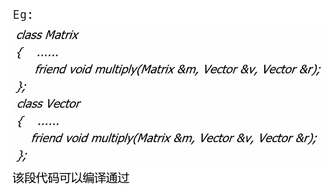\n\n\n\n

注意：友元不具有传递性  
如果一个函数是多个类的友元，这些类之间并不会互相成为对方的友元。每个类的友元关系都  
是独立声明的，不会自动扩展到其他类。

\n\n\n\n

**友元函数**

\n\n\n\n

友元类是一个类，其所有成员函数都可以访问另一个类的私有和保护成员

\n\n\n\n

### **友元函数的特点**

\n\n\n\n

\n
  * **非成员函数** ：友元函数不是类的成员函数，但它可以访问类的私有和保护成员。
\n\n\n\n
  * **声明方式** ：在类中使用 `friend` 关键字声明友元函数。
\n\n\n\n
  * **访问权限** ：友元函数可以访问类的所有成员，包括私有和保护成员。
\n\n\n\n
  * **调用方式** ：友元函数与普通函数一样调用，不需要通过对象或类名。
\n
\n\n\n\n
    
    
    class ClassName {\n    friend ReturnType FunctionName(Parameters); // 友元函数声明\n};

\n\n\n\n
    
    
    #include <iostream>\n\nclass MyClass {\nprivate:\n    int x;\n\npublic:\n    MyClass(int value) : x(value) {}\n\n    // 声明友元函数\n    friend void printX(const MyClass& obj);\n};\n\n// 定义友元函数\nvoid printX(const MyClass& obj) {\n    std::cout << "x: " << obj.x << "\\n"; // 访问私有成员 x\n}\n\nint main() {\n    MyClass obj(10);\n    printX(obj); // 调用友元函数\n    return 0;\n}

\n\n\n\n

\n
  * **操作符重载** ：友元函数常用于重载操作符，特别是当操作符的左操作数不是类的对象时。
\n\n\n\n
  * **工具函数** ：当某个函数需要访问类的私有成员，但不适合作为类的成员函数时，可以使用友元函数。
\n\n\n\n
  * **跨类访问** ：友元函数可以访问多个类的私有成员，用于实现类之间的协作。
\n
\n\n\n\n
    
    
    #include <iostream>\n\nclass Point {\nprivate:\n    int x, y;\n\npublic:\n    Point(int x, int y) : x(x), y(y) {}\n\n    // 声明友元函数，用于重载 << 操作符\n    friend std::ostream& operator<<(std::ostream& os, const Point& p);\n};\n\n// 定义友元函数\nstd::ostream& operator<<(std::ostream& os, const Point& p) {\n    os << "(" << p.x << ", " << p.y << ")";\n    return os;\n}\n\nint main() {\n    Point p(3, 4);\n    std::cout << p << "\\n"; // 输出：(3, 4)\n    return 0;\n}

\n\n\n\n

### 构造顺序

\n\n\n\n

单个对象创建时构造函数的调用顺序：

\n\n\n\n

\n
  1. 调用父类的构造函数。
\n\n\n\n
  2. 调用成员变量的构造函数（调用顺序与声明顺序相同）。
\n\n\n\n
  3. 调用自身的构造函数。
\n
\n\n\n\n

**析构函数与对应构造函数的调用顺序相反。**

\n\n\n\n

**多个对象析构时，析构顺序与构造顺序相反。**

\n\n\n\n

对于析构总结如下：

\n\n\n\n

\n
  * 对于栈对象和全局对象，类似于入栈与出栈的顺序，最后构造的对象最先被析构。
\n\n\n\n
  * 堆对象的析构发生在使用delete的时候，与delete的使用顺序相关。
\n
\n\n\n\n

\n\n\n\n

## 主题二：C++史学

\n\n\n\n

### C VS C++

\n\n\n\n

\n
  * 超集
\n
\n\n\n\n\n
  * **C++支持 C 所支持的全部编程技巧**
\n
\n\n\n\n\n
  * 任何 C 程序都能被 C++ 用基本相同的方法编写，并具备同等开销（时间、空间）
\n
\n\n\n\n

Bjarne Stroustrup在 1979 年开始开发 C++，最初称为“C with Classes”。C++ 是一种面向对象的编程语言，结合了 C 语言的高效性和面向对象编程的灵活性。再后来他也积极参与 C++ 的 ANSI/ISO 标准化工作

\n\n\n\n

**John Backus** 是FORTRAN的发明人，创建出函数式编程的范式以及BNF范式

\n\n\n\n

设计理念：效率、实用性优于艺术性严谨性、相信程序员

\n\n\n\n

### 演化历程：

\n\n\n\n

Father of Simular67：Kristen Nygaard

\n\n\n\n

Father of OO：Ole-Johan Dahl

\n\n\n\n

C语言之父：Dennis Ritchie、Ken Thompson

\n\n\n\n

1980形成 C with class：Bjarne Stroustrup

\n\n\n\n

1983年，Rick Mascitti正式命名C++。

\n\n\n\n

结构化编程：Dijkstra 1994制定ANSI C++标准草案

\n\n\n\n

### Simula 67 的主要贡献

\n\n\n\n

\n
  1. **类和对象** ：Simula 67 引入了类和对象的概念，使得程序可以通过对象来建模和模拟现实世界中的事物。这一概念成为后续面向对象编程语言的基础。
\n\n\n\n
  2. **继承** ：Simula 67 支持继承机制，允许类之间共享和重用代码。这一特性极大地提高了代码的可维护性和可扩展性。
\n\n\n\n
  3. **虚拟过程** ：Simula 67 引入了虚拟过程（virtual procedures），允许子类重写父类的方法，从而实现多态性。
\n\n\n\n
  4. **协程** ：Simula 67 支持协程（coroutines），使得程序可以在多个执行点之间切换，从而实现更复杂的控制流。
\n\n\n\n
  5. **垃圾回收** ：Simula 67 包含垃圾回收机制，自动管理内存分配和释放，减少了内存泄漏的风险。
\n
\n\n\n\n

### Programming Paradigm(编程方法)

\n\n\n\n

**Functional**

\n\n\n\n

assume you have l**ots of little helper functions** that interests in synthesizing one large result

\n\n\n\n

Lisp/Scheme/Erlang/Haskell

\n\n\n\n

**Logical**

\n\n\n\n

**Automatic proofs** within artificial intelligence

\n\n\n\n

Based on axioms, inference rules, and queries

\n\n\n\n

prolog

\n\n\n\n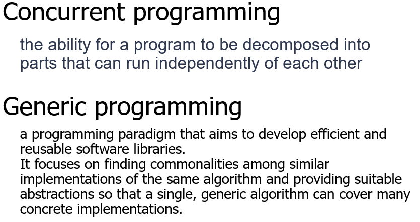\n\n\n\n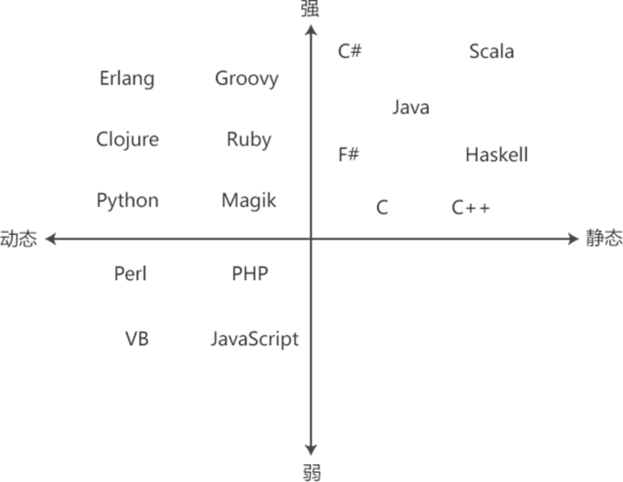\n\n\n\n

**C 和 C++混合编程应该注意的问题**  
（1）名变换:若要调⽤C语⾔库中的函数，要附加关键字“extern "C" ”；按照 C 语⾔⽅式编译和连接，限制  
C++编译器做 name mangling(名变换)，确保 C++和 C 编译器产⽣兼容的 obj ⽂件;  
（2）静态初始化:C++静态的类对象和定义在全局的、命名空间中的或⽂件体中 的类对象的构造函数通常  
在 main 被执⾏前就被调⽤，只要可能，⽤ C++写 main()，即使要⽤ C 写 Main 也⽤ C++写;  
（3）内存动态分配:new/delete 调⽤ C++的函数库，malloc/free 调⽤ C 的函数 库，⼆者要匹配，防⽌内存  
泄露;  
（4） 数据结构兼容:将在两种语⾔间传递的东西限制在⽤ C 编译的数据结构的范 围内;这些结构的 C++版  
本可以包含⾮虚成员函数，不能有虚函数。  
（5）因为C++是C的超集，且C是结构化编程语⾔，⽽C++⽀持⾯向对象编程语⾔，所以在混合编程时，  
不应当出现class等⾯向对象的关键字；

\n\n\n\n

## 主题三：类型体操（类型转换与继承）

\n\n\n\n

### 类型转换

\n\n\n\n

implicit conversion

\n\n\n\n

类似于int值赋给double时，编译器会自动帮你转换对应的类型

\n\n\n\n

explicit conversion

\n\n\n\n

当我们在变量前加上 `(type)` 或者使用下文的 `cast` 时，我们就主动施加了**强制转换** 。

\n\n\n\n

cast（其实是显式转换的一种）

\n\n\n\n

一般使用四种cast方式，

\n\n\n\n

static_cast可以完成类似于c中的强制转换，

\n\n\n\n

**`static_cast` **可以在指向相关类的指针之间执行转换，不仅可以执行上行转换（从指针到派生到指针到基），还可以执行下转换（从指针到基到指针到派生）。在运行时不执行任何检查来保证正在转换的对象实际上是目标类型的完整对象。因此，由程序员来确保转换是安全的。另一方面，它不会产生 的 `dynamic_cast` 类型安全检查的开销。

\n\n\n\n

Additionally, `static_cast` can also perform the following:  
此外， `static_cast` 还可以执行以下操作：

\n\n\n\n

\n
  * Explicitly call a single-argument constructor or a conversion operator.  
显式调用单参数构造函数或转换运算符。
\n\n\n\n
  * Convert to _rvalue references_.  
转换为右值引用。
\n\n\n\n
  * Convert `enum class` values into integers or floating-point values.  
将值转换为 `enum class` 整数或浮点值。
\n\n\n\n
  * Convert any type to `void`, evaluating and discarding the value.  
将任意类型转换为 `void` ，计算并放弃该值。
\n
\n\n\n\n\n
  * 用于类层次结构中基类和派生类之间引用或指针的转换。  
进行上行转换（把派生类的指针或引用转换成基类表示）是安全的。  
进行下行转换（把基类的指针或引用转换成派生类表示），由于没有动态类型检查，不安全。
\n\n\n\n
  * 用于基本数据类型之间的转换
\n\n\n\n
  * 把空指针转换成目标类型的空指针
\n\n\n\n
  * 把任何类型的表达式转换成void类型
\n
\n\n\n\n

**dynamic_cast** （主要就是父类转为子类带检查）

\n\n\n\n

`dynamic_cast` can only be used with **pointers**  and**  references to classes (or with `void*`)**. Its purpose is to ensure that the result of the type conversion points to a valid complete object of the destination pointer type.

\n\n\n\n

This naturally includes _pointer upcast_  (converting from pointer-to-derived to pointer-to-base), in the same way as allowed as an _implicit conversion_.

\n\n\n\n

But `dynamic_cast` can also _downcast_  (convert from pointer-to-base to pointer-to-derived) polymorphic classes (those with virtual members) if -and only if- the pointed object is a valid complete object of the target type. 适用于多态类的上转和下转

\n\n\n\n

注：**Compatibility note:**  This type of `dynamic_cast` requires _Run-Time Type Information (RTTI)_  to keep track of dynamic types. Some compilers support this feature as an option which is disabled by default. This needs to be enabled for runtime type checking using `dynamic_cast` to work properly with these types.  
兼容性说明：此类型 `dynamic_cast` 需要运行时类型信息 （RTTI） 来跟踪动态类型。某些编译器支持此功能作为默认禁用的选项。需要启用此功能才能用于运行时类型检查 `dynamic_cast` ，以便正确处理这些类型。当转换不成立时会返回NULL，如果是指针则返回null_ptr，引用则会报告bad_alloc错误

\n\n\n\n

const_cast则是用于去除常量或者voliate修饰符等的cast方式，可以把常量调整为可修改的类型

\n\n\n\n

reinterpret_cast<>()则是可以对于一段内存区域进行不同的解释的方法，**它保持位的二进制序列不变，只是以新的类型解释变量** 。这是一种**非常危险** 的转换，它允许几乎任意类型之间的强制转换，甚至可以将指针转换为整数，或者将整数转换为指针。它不会执行任何类型检查或安全保证，适用于底层操作和低级别编程。——from xjy[结构化编程 | Co-rricula](<https://xjynotes.top/C++%E9%AB%98%E7%BA%A7%E7%A8%8B%E5%BA%8F%E8%AE%BE%E8%AE%A1/%E7%BB%93%E6%9E%84%E5%8C%96%E7%BC%96%E7%A8%8B.html>)

\n\n\n\n

### 基本类型推导

\n\n\n\n

auto

\n\n\n\n

可以使用 `auto` 关键字来避免冗余的类型定义。**但一定要时刻检测推导出的类型，防止出现隐式转换** 。

\n\n\n\n

decltype

\n\n\n\n

`decltype (实体或表达式)`，推导出一个与括号中实体相同的类型，并将该类型作用于后面的对象。例如

\n\n\n\n
    
    
    int i = 33;\ndecltype(i) j = i * 2;\t//Type of j is int

\n\n\n\n

\n\n\n\n

## 主题四：作用域与生命周期（namespace and static）

\n\n\n\n
    
    
    // in namespace or global scope\nint i;                 // extern by default\nconst int ci;          // static by default\nextern const int eci;  // explicitly extern\nstatic int si;         // explicitly static\n// same goes for functions (but there are no global const functions)\nint foo();             // extern by default\nstatic int bar();      // explicitly static

\n\n\n\n

### namespace

\n\n\n\n

在约束作用域方面，替代static

\n\n\n\n

有两种使用方式

\n\n\n\n

declaration   
**using L::k; using L::f;**

\n\n\n\n

directive  
**using namespace L;**

\n\n\n\n

别名方式： namespace a = c；

\n\n\n\n

\n\n\n\n

### static

\n\n\n\n

The **static**  keyword can be used to declare variables and functions at -

\n\n\n\n

\n
  1. global scope — variables and functions
\n\n\n\n
  2. namespace scope — variables and functions
\n\n\n\n
  3. class scope — variables and functions
\n\n\n\n
  4. local scope — variables
\n
\n\n\n\n

`static` 关键字可以用于**函数** 和**变量** ，它的作用是**限制函数和变量的作用域** ，使得它们只能在**当前文件** 中使用。对于当前文件，`static` 关键字作用的变量还会将作用域扩大到全局，相当于在 `main` 函数外定义。

\n\n\n\n

在函数内部使用 `static` 关键字定义的变量具有静态存储持续时间。这意味着变量在函数的多次调用之间保持其值，而不是每次调用时重新初始化。

\n\n\n\n

static 初始化的原理

\n\n\n\n
    
    
    例1：\nint main()\n{\n    for(int x = 5; x < 10; x++)\n    {\n        static int y = x;\t//第一次被引用时初始化，并且只初始化一次\n        cout << "x = " << x << ", y = " << y << endl;\n    }\n    return 0;\n}\n\n输出结果：\nx = 5, y = 5\nx = 6, y = 5\nx = 7, y = 5\nx = 8, y = 5\nx = 9, y = 5\n

\n\n\n\n

但实际上存在一些情况

\n\n\n\n
    
    
    例2：\nint main()\n{\n    for(int x = 5; x < 10; x++)\n    {\n        static int y = x;\n        cout << "x = " << x << ", y = " << y << endl;\n\n        int *p = &y;\n        p++;\n        *p = 0;\n    }\n    return 0;\n}\n\n输出结果：\nx = 5, y = 5\nx = 6, y = 6\nx = 7, y = 7\nx = 8, y = 8\nx = 9, y = 9\n

\n\n\n\n

通过两个例子的结果我们可以知道，静态变量的初始化就是通过静态变量后面的一个32位内存位来做记录，以标识这个静态变量是否已经初始化。每次运行到当前位置，会先去判断这个地址：  
如果不是1，就给它赋值1，然后给变量赋值；  
如果是1，直接跳过赋值代码块这样它就做到了只赋值一次的效果；

\n\n\n\n
    
    
    void foo() {\n    static int count = 0; // 只初始化一次\n    count++;\n    std::cout << count << std::endl;\n}\n\nint main() {\n    foo(); // 输出 1\n    foo(); // 输出 2\n    foo(); // 输出 3\n    return 0;\n}\n

\n\n\n\n

#### **类作用域**

\n\n\n\n

在类中使用 `static` 关键字定义的成员变量和成员函数属于类本身，而不是类的某个对象。静态成员变量在所有对象之间共享，静态成员函数可以在没有对象实例的情况下调用。

\n\n\n\n
    
    
    class MyClass {\npublic:\n    static int count; // 静态成员变量\n    static void increment();\n}

\n\n\n\n

\n\n\n\n

### extern

\n\n\n\n

### 函数执行机制

\n\n\n\n

\n
  * 建立被调用函数的栈空间
\n\n\n\n
  * 参数传递\n\n
    * 值传递
\n\n\n\n
    * 引用传递
\n\n
\n\n\n\n
  * 保存调用函数的运行状态
\n\n\n\n
  * 将控制转交被调函数
\n
\n\n\n\n

Function call  
Base stack pointer ->ebp  
Top of stack ->esp

\n\n\n\n

**Summary**

\n\n\n\n

\n
  1. 压入参数
\n\n\n\n
  2. 保存上下文\n\n
     * 保存返回地址
\n\n\n\n
     * 保存调用者的base pointer
\n\n
\n\n\n\n
  3. 执行函数\n\n
     * 设置新的base pointer
\n\n\n\n
     * 分配空间
\n\n\n\n
     * 执行任务
\n\n\n\n
     * 释放空间
\n\n
\n\n\n\n
  4. 恢复上下文\n\n
     * 加载调用者的base pointer
\n\n\n\n
     * 加载返回地址
\n\n
\n\n\n\n
  5. 继续执行调用者
\n
\n\n\n\n

\n\n\n\n

## 主题五：重要关键字集合

\n\n\n\n

### inline函数的优缺点和适用场景

\n\n\n\n

定义：

\n\n\n\n

\n
  1. 实际调用的时候，把inline函数放回原来的位置，不会产生参数的传递，在汇编上也不会有其  
他的冗余操作，编译系统将为inline函数创建一段代码，在调用点，以相应的代码替换
\n
\n\n\n\n

作用：

\n\n\n\n

\n
  1. 增加程序的可读性
\n\n\n\n
  2. 提高程序的运行效率
\n\n\n\n
  3. 弥补宏定义不能及进行类型检查的缺陷
\n\n\n\n
  4. 问题：
\n\n\n\n
  5. 增大目标代码， 调用时必须在调用该函数的每一个文本文件中定义
\n\n\n\n
  6. 病态换页(内存抖动)
\n\n\n\n
  7. 降低指令快取装置的命中率
\n
\n\n\n\n

建议：

\n\n\n\n

\n
  1. 使用频率高的小代码使用内联
\n\n\n\n
  2. 内联函数定义放在头文件中
\n\n\n\n
  3. 不能含有复杂的结构控制
\n\n\n\n
  4. 递归不能做内联函数
\n\n\n\n
  5. 限制：
\n\n\n\n
  6. 非递归
\n\n\n\n
  7. 由编译系统控制
\n\n\n\n
  8. 没有函数指针（无法写泛型、framework，表达能力降低）
\n
\n\n\n\n

Inline function

\n\n\n\n

用于替代C的宏函数  
提高效率  
实现：编译系统将为 inline 函数创建一段代码，在调用点，以相应的代码替换（inline  
只是对编译器的提示，能不能真的换要看编译器）  
因此，关键字 inline 必须与函数定义体放在一起才能使函数成为内联，仅将 inline 放  
在函数声明前面不起任何作用。  
建议：inline函数的定义放在头文件中（而非只是声明）  
类中的成员默认都是内联的  
限制：

\n\n\n\n
    
    
    递归\n函数指针\n常用：小型、频繁调用的函数，避免在构造和析构函数中调用\n缺点：\n增大object code\n病态的换页\n降低指令快取装置的命中率

\n\n\n\n

define 的定义函数的能力比 inline 强  
但是define 又缺少类型检查  
template (虽然define还是更强)

\n\n\n\n

### optional

\n\n\n\n
    
    
    #include <optional>\nstd::optional<string>\ngetNameByID(\n\tconst vector<std::pair<int, string>>& v, \n\tint id)\n{   \tfor (auto e : v) {\n\t\tif (e.first == id)\n\t\t\treturn e.second;\n\t}\n\treturn std::nullopt;\n}\n

\n\n\n\n

### variant

\n\n\n\n

即 type-safe `union`。`union` 的问题是可能当中的内容与解释的类型是不相符的，这会导致一系列安全性问题。而 `variant` 可以提供更严格的类型检查，在编译时或运行中阻止不正确的访问。

\n\n\n\n
    
    
    std::variant<int, float, string> v;\nv = "abc";\ncout << v.index() << " " << std::get<string>(v) << endl; // string, OK\nv = 100;\ncout << v.index() << " " << std::get<0>(v) << endl; // int, OK\nv = 2.3f;\ncout << v.index() << " " << std::get<float>(v) << endl; // float, OK\ncout << v.index() << " " << std::get<double>(v) << endl; // double, not found in type list, compile ERROR\n\ncout << v.index() << " " << std::get<int>(v) << endl; // int, not the corresponding type, runtime exception\n\nfloat* pf = std::get_if<float>(&v); // we can use guard pointer to judge.\nif(pf != nullptr){ // float, OK\n  \tcout << v.index() << " " << std::get<float>(v) << endl;\n}else{ // not float, invalid!\n  \tcout << "Invalid" << endl;\n}

\n\n\n\n

### any

\n\n\n\n

如果不能将返回值显式地表现出来，可以直接用 `any` 来进行封装。`any` 相当于是一个篮子，它可以接受任何类型的返回值。它相当于是更安全的 `void*`

\n\n\n\n
    
    
    any input(){\n  \tint i;\n  \tcin >> i;\n  \tswitch(i){\n\t      case 0: \n        \t\treturn 11;\n        \t\tbreak;\n\t      case 1:\n  \t\t\t\t\treturn 3.14;\n        \t\tbreak;\n      \tdefault:\n        \t\treturn string("Hello, world!");\n        \t\tbreak;\n    }\n}\n\nint main(){\n  \tany aa;\n  \taa = input();\n  \tif(aa.type() == typeid(int)){//using typeid to judge its type\n      \t// do something...\n    }else if(aa.type() == typeid(double)){\n      \t// do something...\n    }else{\n      \t// do something...\n    }\n}

\n\n\n\n

### const

\n\n\n\n

1.正常const常量定义：

\n\n\n\n
    
    
    const int a = 10;

\n\n\n\n

2.含const的指针

\n\n\n\n
    
    
    const double pi = 3.1415;\nconst double *cptr = & pi;\n*cptr = 42; //错误：常量指针不能修改对应的值\nconst double *coll;\nconst double c = 0.0;\ncoll = &c;\ncptr = coll;//允许更换指针\n\n\nconst double pi = 3.14;\nconst double *const pip = π //从右向左依次解修饰符，首先pip是一个常量，然后是*说明pip是一个常量指针，\n//再然后是double说明是指向double的指针，最后是const说明这个double不能变，即指向的对象是一个常量的double

\n\n\n\n

### final

\n\n\n\n

当用于类时，final 关键字表明这个类不能被继承。这意味着没有任何其他类可以继承  
这个被标记为final 的类。  
当用于成员函数时，final 关键字表明这个成员函数不能被任何派生类重写。也就是说，这个函数的实现是最终的，不允许在派生类中被覆盖

\n\n\n\n

final 关键字可以与virtual 关键字一起使用，以阻止派生类重写特定的虚函数

\n\n\n\n
    
    
    #include <iostream>\n\nclass Base {\npublic:\n    virtual void print() final { // 标记为 final，禁止重写\n        std::cout << "Base::print\\n";\n    }\n};\n\nclass Derived : public Base {\npublic:\n    // 错误：不能重写 final 函数\n    void print() override {\n        std::cout << "Derived::print\\n";\n    }\n};\n\nint main() {\n    Derived obj;\n    obj.print();\n    return 0;\n}

\n\n\n\n

### override

\n\n\n\n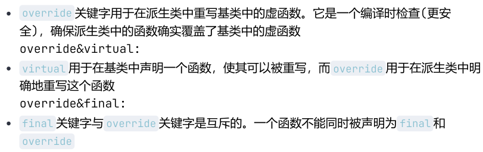\n\n\n\n

纯虚函数：纯虚函数是声明时在函数原型后加上=0 (往往只声明，不实现)

\n\n\n\n

纯虚函数：只有函数接口会被继承  
只有函数接口会被继承  
子类必须继承函数接口，**必须提供实现代码**  
一般虚函数：函数的接口及缺省实现代码都会被继承  
子类必须继承函数接口  
可以继承缺省实现代码  
非虚函数：函数的接口和其实现代码都会被继承  
会同时继承接口和实现代码

\n\n\n\n
    
    
    class Base {\npublic:\n    void print() { // 非虚函数\n        std::cout << "Base::print\\n";\n    }\n};\n\nclass Derived : public Base {\npublic:\n    void print() { // 隐藏基类的非虚函数\n        std::cout << "Derived::print\\n";\n    }\n};\n\nint main() {\n    Base* obj = new Derived();\n    obj->print(); // 调用 Base::print（静态绑定）\n    delete obj;\n    return 0;\n}

\n\n\n\n特性| 纯虚函数| 一般虚函数| 非虚函数  
---|---|---|---  
**定义**| `virtual void func() = 0;`| `virtual void func();`| `void func();`  
**接口继承**|  是| 是| 是  
**实现继承**|  否| 是（默认实现）| 是  
**子类必须实现**|  是| 否（可重写）| 否（不能重写）  
**多态性**|  是（动态绑定）| 是（动态绑定）| 否（静态绑定）  
**用途**|  定义接口| 提供默认行为，允许重写| 实现不需要多态的行为  
\n\n\n\n

### 多继承

\n\n\n\n

如果直接基类有公共的基类，则该公共基类中的成员变量在多继承的派生类中有多个副本

\n\n\n\n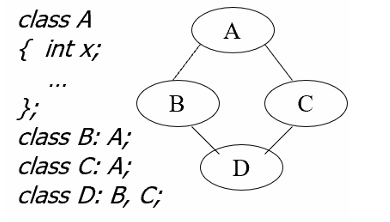\n\n\n\n

C如何解决名冲突问题?  
设计理念: (Base-Class Decomposition)将共同的属性抽象出一个父类  
实现机制: 虚继承

\n\n\n\n
    
    
    class A;\n class B: virtual public A;\n class C: virtual public A;\n class D: B,C

\n\n\n\n

最新的派生类（即多重继承链中最后的类）负责构造虚基类  
虚基类的构造函数**优先非虚基类** 的构造函数执行（先调A再调BC最后是D本身）

\n\n\n\n
    
    
    #include <iostream>\n\nclass Base {\npublic:\n    Base(int value) {\n        std::cout << "Base constructor, value: " << value << "\\n";\n    }\n};\n\nclass Derived1 : virtual public Base {\npublic:\n    Derived1(int value) : Base(value) {\n        std::cout << "Derived1 constructor\\n";\n    }\n};\n\nclass Derived2 : virtual public Base {\npublic:\n    Derived2(int value) : Base(value) {\n        std::cout << "Derived2 constructor\\n";\n    }\n};\n\nclass Final : public Derived1, public Derived2 {\npublic:\n    // 最派生类直接调用虚基类的构造函数\n    Final(int value1, int value2) : Base(value1), Derived1(value1), Derived2(value2) {\n        std::cout << "Final constructor\\n";\n    }\n};\n\nint main() {\n    Final obj(10, 20);\n    return 0;\n}

\n\n\n\n

赋值操作符重载不能继承

\n\n\n\n

\n
  1. 每一个类对象实例在创建的时候，如果用户没有定义“赋值运算符重载函数”，那么，编  
译器会自动生成一个隐含和默认的“赋值运算符重载函数” （即默认拷贝赋值函数）
\n\n\n\n
  2. 如果派生类中声明的成员与基类的成员同名，那么，基类的成员会被覆盖，哪怕基类的  
成员与派生类的成员的数据类型和参数个数都完全不同，所以派生类的拷贝赋值函数覆  
盖了基类的赋值操作符重载
\n
\n\n\n\n

## 主题六：模板元编程与非OOP的多态

\n\n\n\n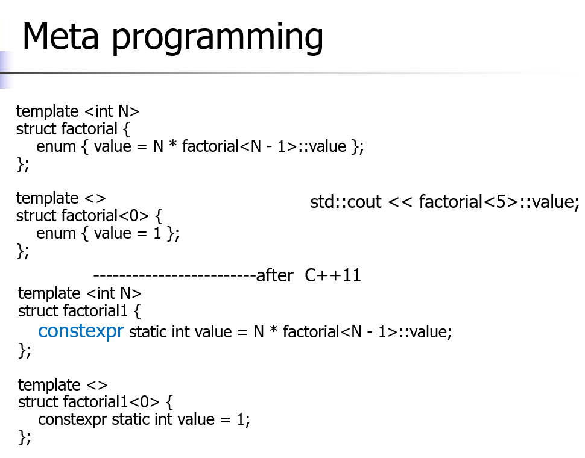\n\n\n\n

在编译期这个代码就可以使用模板实例化展开计算得到对应结果

\n\n\n\n

### constexpr

\n\n\n\n

`constexpr` 是 C++11 引入的一个关键字，用于指示表达式或函数在编译时求值。它允许编译器在编译时计算常量值，从而提高程序的性能和安全性。以下是 `constexpr` 的主要特点和在模板元编程中的作用：

\n\n\n\n

#### `constexpr` 的主要特点

\n\n\n\n

\n
  1. **编译时求值** ：`constexpr` 函数和变量在编译时求值，减少了运行时的计算开销。
\n\n\n\n
  2. **常量表达式** ：`constexpr` 函数可以返回常量表达式，允许在编译时进行更复杂的计算。
\n\n\n\n
  3. **类型安全** ：`constexpr` 提供了类型安全的编译时计算，避免了宏定义带来的潜在问题。
\n
\n\n\n\n

#### `constexpr` 在模板元编程中的作用

\n\n\n\n

\n
  1. **编译时计算** ：在模板元编程中，`constexpr` 可以用于编译时计算常量值，从而生成更高效的代码。例如，可以使用 `constexpr` 函数计算数组的大小或初始化常量数组。
\n\n\n\n
  2. **类型特征检测** ：`constexpr` 可以用于编写类型特征检测函数，在编译时确定类型的特性。例如，可以使用 `constexpr` 函数检测类型是否具有特定的成员函数或类型定义。
\n\n\n\n
  3. **递归计算** ：`constexpr` 函数支持递归调用，可以在编译时进行复杂的递归计算。例如，可以使用 `constexpr` 函数计算斐波那契数列或阶乘。
\n\n\n\n
  4. **编译时断言** ：`constexpr` 可以用于编写编译时断言，确保模板参数满足某些条件。例如，可以使用 `constexpr` 函数在编译时检查模板参数的范围或类型。
\n
\n\n\n\n

### 函数模板

\n\n\n\n

C中模板的完整定义通常出现在头文件

\n\n\n\n

\n\n\n\n

## 主题七：纯血OOP

\n\n\n\n
    
    
    #include <stdio.h>\n#include <stdlib.h>\n\ntemplate<typename T>\nstruct Stack {\n    T* array;\n    int capacity;\n    int top;\n    void _init(int capacity) {\n        array = (T*)malloc(sizeof(T) * capacity);\n        this->capacity = capacity;\n        this->top = -1;\n    }\n\n    void _push(T data) {\n        if (top + 1 >= capacity) {\n            printf("Stack is full\\n");\n            return;\n        }\n        array[++top] = data;\n    }\n\n    T _pop() {\n        if (top < 0) {\n            printf("Stack is empty\\n");\n            return 0;\n        }\n        return array[top--];\n    }\n\n    void _release() {\n        free(array);\n        capacity = 0;\n        top = -1;\n    }\n};

\n\n\n\n
    
    
    #include <iostream>\nusing namespace std;\n\ntemplate<typename T>\nclass Stack {\nprivate:\n    T* array;\n    int capacity;\n    int top;\npublic:\n    Stack(int capacity) {\n        array = new T[capacity];\n        this->capacity = capacity;\n        this->top = -1;\n    }\n\n    void _push(T data) {\n        if (top + 1 >= capacity) {\n            printf("Stack is full\\n");\n            return;\n        }\n        array[++top] = data;\n    }\n\n    T _pop() {\n        if (top < 0) {\n            printf("Stack is empty\\n");\n            return 0;\n        }\n        return array[top--];\n    }\n\n    ~Stack() {\n        delete[] array;\n        capacity = 0;\n        top = -1;\n    }\n};

\n\n\n\n

请注意比较两者的差异

\n\n\n\n

### 类的继承

\n\n\n\n

基于目标代码的复用  
对事物进行分类  
增量开发

\n\n\n\n

继承是有权限控制的(不写是默认private的，基类中的任何元素都访问不到)

\n\n\n\n

class Student{ };  
class Undergraduate_Student : public Student{ };

\n\n\n\n

**注意友元是不被继承的**

\n\n\n\n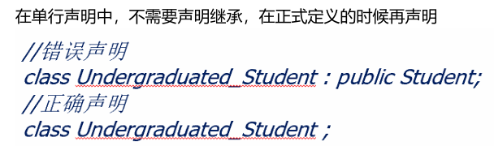\n\n\n\n

编译器会把ptr作为B类使用（除非使用dynamic_cast）

\n\n\n\n

派生类的友元函数不能访问基类的protected成员（派生类可以访问），private当然更不行了

\n\n\n\n

**派生类对象初始化**  
基类和派生类共同完成

\n\n\n\n

**构造函数的执行次序**  
基类的构造函数  
派生类对象成员类的构造函数  
派生类的构造函数

\n\n\n\n

缺省执行基类默认构造函数  
要执行基类非默认构造函数，必须在派生类构造函数的初始化列表中指出

\n\n\n\n
    
    
    #include <iostream>\n\nclass Base {\npublic:\n    Base(int value) {\n        std::cout << "Base构造函数，value: " << value << "\\n";\n    }\n};\n\nclass Derived : public Base {\npublic:\n    // 在初始化列表中显式调用基类的非默认构造函数\n    Derived(int value) : Base(value) {\n        std::cout << "Derived构造函数\\n";\n    }\n};\n\nint main() {\n    Derived obj(10); // 创建派生类对象\n    return 0;\n}

\n\n\n\n
    
    
    #include <iostream>\n\nclass Base {\npublic:\n    Base(int value) {\n        std::cout << "Base构造函数，value: " << value << "\\n";\n    }\n};\n\nclass Derived : public Base {\npublic:\n    Derived() { // 错误：没有显式调用基类的构造函数\n        std::cout << "Derived构造函数\\n";\n    }\n};\n\nint main() {\n    Derived obj; // 编译错误\n    return 0;\n}

\n\n\n\n

修复

\n\n\n\n
    
    
    class Derived : public Base {\npublic:\n    Derived() : Base(0) { // 显式调用基类的构造函数\n        std::cout << "Derived构造函数\\n";\n    }\n};

\n\n\n\n

### 虚函数

\n\n\n\n

类型相容->赋值相容  
类型相容x<-赋值相容

\n\n\n\n
    
    
    class A{};\n class B: public A{};\n A a;   B b;\n a=b;

\n\n\n\n

a=b实际调用了一个拷贝函数  
对象的身份发生变化，属于派生类的属性不再存在(对象切片——对象身份发生了变化)  
使用多态写程序时，要避免将栈上的对象赋值给另一个对象

\n\n\n\n

**虚函数的来历**  
C中的对象都是前期绑定的

\n\n\n\n

\n
  * 编译时
\n\n\n\n
  * 依据对象静态类型
\n\n\n\n
  * 效率高、灵活性差
\n\n\n\n
  * 难以实现多态 动态绑定
\n\n\n\n
  * 但又要注重效率
\n\n\n\n
  * 默认前期绑定
\n\n\n\n
  * 动态绑定需显式指出(virtual)
\n
\n\n\n\n

为类的成员方法声明virtual  
根据实际引用和指向的对象类型动态绑定  
如在基类中被定义为虚成员函数，则派生类中对其重定义的成员函数均为虚函数

\n\n\n\n
    
    
    #include <iostream>\n\nclass Base {\npublic:\n    virtual void print() { // 声明虚函数\n        std::cout << "Base::print\\n";\n    }\n};\n\nclass Derived : public Base {\npublic:\n    void print() override { // 重写虚函数\n        std::cout << "Derived::print\\n";\n    }\n};\n\nint main() {\n    Base* obj = new Derived(); // 基类指针指向派生类对象\n    obj->print(); // 调用 Derived::print\n    delete obj;\n    return 0;\n}

\n\n\n\n

limit:

\n\n\n\n

\n
  * 只有类的成员函数才可以是
\n\n\n\n
  * 静态函数、内联函数不能
\n\n\n\n
  * 构造函数不能是虚函数
\n\n\n\n
  * 在构造函数完成之前，无法找到作为虚函数的构造函数所在的代码区，所以构造函数只能作为
\n\n\n\n
  * 普通函数存放在类所指定的代码区中
\n\n\n\n
  * 析构函数可以是虚函数(往往是)
\n\n\n\n
  * 如果析构函数不是虚函数，那么调用的将会是基类的析构函数。我们更希望可以调用派生类的
\n\n\n\n
  * 析构函数对新定义的成员也进行析构
\n
\n\n\n\n

需要**额外的内存空间存储对象可以调用的相应虚函数**  
对象的内存空间中含有指针，指向其**虚函数表**  
每个对象有多少虚函数是不确定的  
编译时获得虚函数表，这样就知道如何确定应调用的函数  
实例化一个类的对象的时候, 会使用一个指针记录这个类的虚函数表的首地址

\n\n\n\n

一些重要例子：（必须掌握）

\n\n\n\n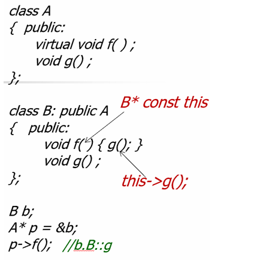\n\n\n\n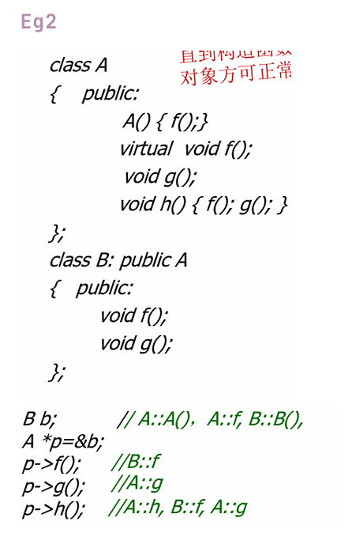\n\n\n\n

\n
  1. 此时的A f是A的构造函数中调用的，此时**还没进行B的构造** ，所以即使f是虚函数，也  
不会调用B中的 (直到构造函数返回后，对象方可正常使用)
\n\n\n\n
  2. f是虚函数，调用B的
\n\n\n\n
  3. g不是虚函数，调用基类的
\n\n\n\n
  4. h不是虚函数，调用基类中的，接着根据虚函数表去调用f，由于此时环境中的this是在  
A中的，调用A的g
\n
\n\n\n\n

tip：

\n\n\n\n

避免在构造函数中调用虚函数(**直到构造函数返回后，对象方可正常使用**)  
进入虚函数后，都是根据**当前类型** 确定(切换了上下文)  
不要定义与继承来的非虚函数同名的成员函数  
绝对不要重新定义继承来的缺省参数值(静态绑定，如果使用的是父类的指针指向子类，子类  
覆盖的缺省参数值是无效的)

\n\n\n\n

\n\n\n\n

## 主题八：重载函数总结

\n\n\n\n

双目操作符重载：<refType> operator #(args)

\n\n\n\n

隐含this  
a#b 实际表现为  
a.operator#(b)

\n\n\n\n
    
    
     Complex {};\n Complex operator+(Complex& x1,Complex& x2){ }\n c=a+b

\n\n\n\n

operator<<只能作为全局函数重载

\n\n\n\n
    
    
    ostream& operator<<(ostream& o,Day d){ }

\n\n\n\n

= () [] ->不能作为全局函数重载

\n\n\n\n

不可被重载的操作符: . .* :: ?:

\n\n\n\n

永远不要重载 &&和 | | =>破坏了短路机制

\n\n\n\n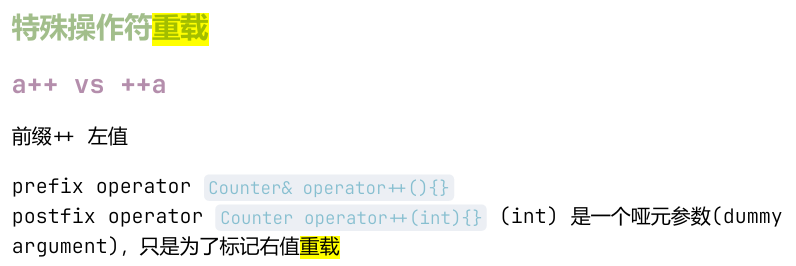\n\n\n\n
    
    
    #include <functional>\n#include <iostream>\n#include <limits>\n#include <string>\n#include <unordered_map>\n\nclass IntStream {\n public:\n  explicit IntStream(int first) : first_(first), current_(first), last_(std::numeric_limits<int>::max()), stride_(1) {}\n\n  IntStream(int first, int last) : first_(first), current_(first), last_(last), stride_(1) {}\n\n  IntStream(int first, int last, int stride) : first_(first), current_(first), last_(last), stride_(stride) {}\n\n  IntStream &operator++() {\n    if (!finished()) {\n      current_ += stride_;\n    }\n    return *this;\n  }\n\n  IntStream operator++(int) {\n    IntStream temp = *this;\n    ++(*this);\n    return temp;\n  }\n\n  int operator*() const {\n    return current_;\n  }\n\n  operator bool() const {\n    return !finished();\n  }\n\n private:\n  bool finished() const {\n    if (stride_ > 0) {\n      return current_ >= last_;\n    } else if (stride_ < 0) {\n      return current_ <= last_;\n    } else {\n      return false; // Infinite loop if stride is 0\n    }\n  }\n\n  int first_;\n  int current_;\n  int last_;\n  int stride_;\n};\n\nvoid print_answer(const IntStream &s, int expect) {\n  std::cout << std::boolalpha;\n  if (s) {\n    std::cout << (*s == expect) << ' ' << *s << std::endl;\n  } else {\n    std::cout << false << std::endl;\n  }\n}\n\n/**\n * @brief 测试 IntStream(int)\n */\nvoid test_1() {\n  IntStream s(0);\n  for (size_t i = 0; i < 10; i++) {\n    ++s;\n  }\n  print_answer(s, 10);\n}\n/**\n * @brief 测试范围 [first, last) 非常大的情况\n */\nvoid test_8() {\n  IntStream s(std::numeric_limits<int>::min(), std::numeric_limits<int>::max());\n  for (size_t i = 0; i < 10000; i++) {\n    s++;\n  }\n  print_answer(s, std::numeric_limits<int>::min() + 10000);\n}\n\nint main() {\n  std::unordered_map<std::string, std::function<void()>> test_cases_by_name = {\n      {"test_1", test_1}, {"test_2", test_2}, {"test_3", test_3},\n      {"test_4", test_4}, {"test_5", test_5}, {"test_6", test_6},\n      {"test_7", test_7}, {"test_8", test_8},\n  };\n  std::string tname;\n  std::cin >> tname;\n  auto it = test_cases_by_name.find(tname);\n  if (it == test_cases_by_name.end()) {\n    std::cout << "输入只能是 test_<N>，其中 <N> 可取整数 1 到 8." << std::endl;\n    return 1;\n  }\n  (it->second)();\n}

\n\n\n\n
    
    
    #include <iostream>\n\nusing namespace std;\nclass temp{\n    int a;\n    int b;\n\n    public:\n        temp(){\n            a = 1;\n            b = 2;\n        }\n    friend ostream& operator<<(ostream& os, const temp& t);\n};\n\nostream& operator<<(ostream& os, const temp& t){\n    os<<t.a<<" "<<t.b;\n    return os;\n}\n\nint main(){\n    temp t;\n    cout<<t<<endl;\n    return 0;\n}\n

\n\n\n\n

=重载（需要避免自赋值）

\n\n\n\n
    
    
    Base& operator=(const Base& other) {\n        if (this != &other) {\n            value = other.value;\n        }\n        return *this;\n    }

\n\n\n\n
    
    
     class A{\n int x,y;\n char *p;\n A& operator=(A& a){\n if(this &rhs) return *this   \n}\n }

\n\n\n\n

下标操作

\n\n\n\n
    
    
    class string{\n char *p;\n public:\n string(char *p1){\n p = new char[strlen(p1)+1];\n strcpy(p,p1);\n }\n char &operator  const { return p[i]; }\n const char operator  const { return p[i]; }\n }

\n\n\n\n

为了避免对下标操作符取的值修改，再次重载  
为什么返回值不同的函数能重载成功? 加上const后，this的类型不同，非常量的版本和常  
量版本调用的不同

\n\n\n\n

对于下标操作符的重载，要重载常量和非常量两个版本

\n\n\n\n

### **括号操作符**

\n\n\n\n

仿函数使用  
策略模式  
代理/智能指针

\n\n\n\n

减少混合计算中需要定义的操作符重载函数的数量

\n\n\n\n
    
    
    #include <iostream>\n\nclass Multiplier {\nprivate:\n    int factor;\n\npublic:\n    Multiplier(int f) : factor(f) {}\n\n    // 重载括号操作符\n    int operator()(int x) {\n        return x * factor;\n    }\n};\n\nint main() {\n    Multiplier multiplyBy2(2); // 创建仿函数对象，factor = 2\n    Multiplier multiplyBy3(3); // 创建仿函数对象，factor = 3\n\n    std::cout << "2 * 5 = " << multiplyBy2(5) << "\\n"; // 输出：10\n    std::cout << "3 * 5 = " << multiplyBy3(5) << "\\n"; // 输出：15\n    return 0;\n}

\n\n\n\n

->操作符

\n\n\n\n

是二元运算符，重载时按一元操作符描述 返回指针类型或者自定义操作符的类型

\n\n\n\n
    
    
    #include <iostream>\n\nclass MyClass {\npublic:\n    void print() {\n        std::cout << "Hello, World!\\n";\n    }\n};\n\nclass Wrapper {\nprivate:\n    MyClass* ptr;\n\npublic:\n    Wrapper(MyClass* p) : ptr(p) {}\n\n    // 重载 -> 操作符\n    MyClass* operator->() {\n        return ptr;\n    }\n};\n\nint main() {\n    MyClass obj;\n    Wrapper wrapper(&obj);\n    wrapper->print(); // 通过重载的 -> 操作符访问成员函数\n    return 0;\n}

\n\n\n\n

还有new和delete的重载见上文（第一章）

\n\n\n\n

## 主题九：异常处理

\n\n\n\n

异常——Exception

\n\n\n\n

\n
  * 运行环境造成
\n\n\n\n
  * 内存不足，文件操作失败  

\n\n\n\n
  * 异常处理
\n\n\n\n
  * 当发生异常，程序无法沿着正常的顺序执行下去的时候，立即结束程序可能并不妥  
当。我们需要给程序提供另外一条可以安全退出的路径  
特征：可以预见，无法避免
\n
\n\n\n\n

### 异常处理机制

\n\n\n\n

try 监控  
throw 抛掷异常对象

\n\n\n\n

throw 抛出异常时，将暂停当前函数的执行，开始查找匹配的catch子句。沿着函数的嵌套调用链向 上查找，直到找到一个匹配的catch子句，或者找不到匹配的catch子句(调用abort终 止)。

\n\n\n\n

无参数throw  
将捕获到的异常对象重新抛出

\n\n\n\n

析构函数不应抛出异常（noexcept）  
如果析构函数中出现异常，那么就应该在析构函数内部将这个异常进行处理，而不是将异常抛出去。  
为什么不应该？抛出异常的就是栈展开的过程，而栈展开会调用**析构函数销毁局部对象** ，这样多次调用析构函数会导致程序崩溃(内存泄漏)

\n\n\n\n

构造函数可以抛出异常  
当构造函数内出现异常，可以选择将异常抛出，在栈展开的过程调用析构函数释放已申请的内  
存，也可以在内部将异常处理，手动调用delete释放

\n\n\n\n

### catch

\n\n\n\n

catch( var ) {<语句序列>} 

\n\n\n\n

类型：异常类型，匹配规则同函数重载 catch的异常类型是严格匹配的 

\n\n\n\n

变量：存储异常对象，可省略 try后可以跟多个catch语句块

\n\n\n\n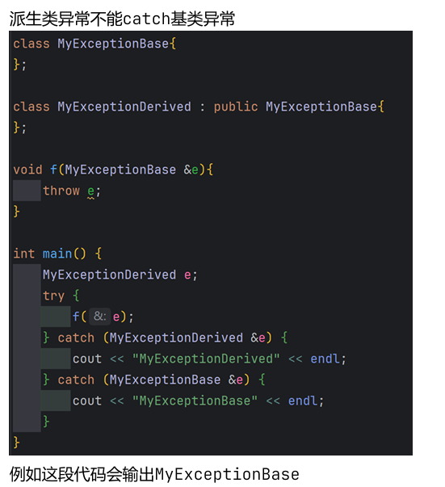\n\n\n\n

## 主题十：一些初始化

\n\n\n\n

### 函数参数列表初始化

\n\n\n\n

形似这样：

\n\n\n\n
    
    
    int function(int a, int b = 10, int c = 11); // 正确

\n\n\n\n

默认参数必须从**右到左** 依次设置。也就是说，如果一个参数有默认值，那么它右边的所有参数也必须具有默认值。

\n\n\n\n

int function(int a = 1, int b, int c = 11); // 错误：b 没有默认值  
int function(int a = 1, int b = 10, int c); // 错误：c 没有默认值

\n\n\n\n
    
    
    int result1 = function(1);       // a=1, b=10, c=11\nint result2 = function(1, 20);   // a=1, b=20, c=11\nint result3 = function(1, 20, 30); // a=1, b=20, c=30

\n\n\n\n

这样的调用方式是正确的

\n