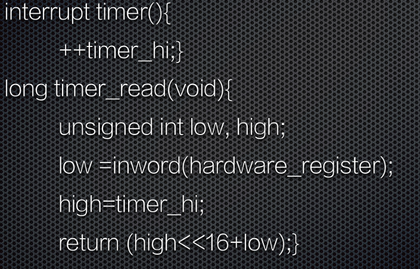
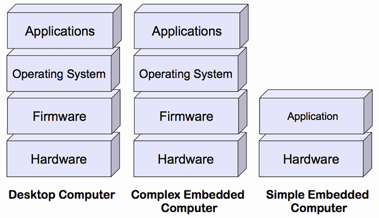
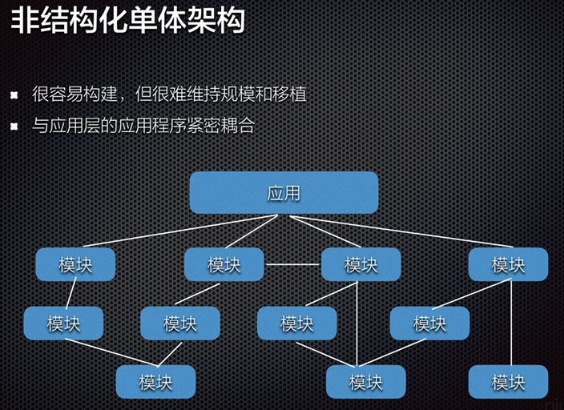
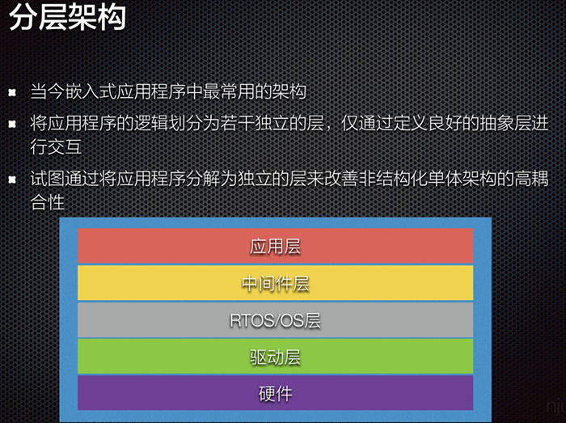
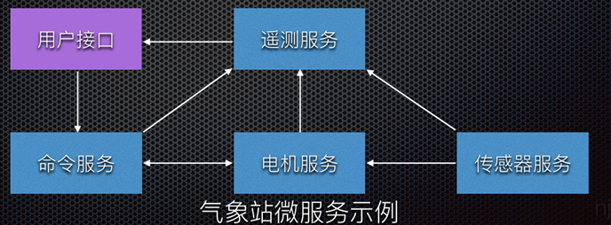

\n

## 嵌入式系统概述：

\n\n\n\n

def:嵌入式系统是“以应用为中心，以计算机技术为基础，软硬件可裁减，适用于应用系统对功  
能、可靠性、成本、体积、功耗有严格要求的专用计算机系统”。

\n\n\n\n

组成：嵌入式系统一般由嵌入式硬件和软件组成。  
硬件以微处理器为核心、集成存储器和系统专用的输入输出设备。  
软件包括：初始化代码及驱动、嵌入式操作系统和应用程序等。

\n\n\n\n

特征：形式多样，面向特定应用  
高度制约的环境  
与外部环境的交互，包含传感器和执行器  
实时性要求

\n\n\n\n

## 嵌入式微处理器：

\n\n\n\n

分类：单元、处理单元、微控制器、DSP处理器、SoC

\n\n\n\n

### 流水线清空，分支预测技术

\n\n\n\n

为什么清空：  
分支指令的**跳转或条件判断** 等原因，导致流水线中的指令序列需要中断或清空，重新开  
始执行新的指令序列。  
这种中断和清空操作会导致流水线中已经执行的指令被丢弃，从而导致执行速度变慢。

\n\n\n\n

分支预测技术：减少流水线清空带来的性能损失而设计的一种技术

\n\n\n\n

它通过猜测分支指令的跳转目标，提前预测分支指令的执行路径，从而使得流水线可以继续执  
行后续指令，而不需要中断和清空。

\n\n\n\n

\n
  * 如果分支预测猜测正确，流水线可以无缝地继续执行；
\n\n\n\n
  * 如果分支预测猜测错误，流水线的部分指令可能会被清空，但通过合理的分支预测策略，可以减少清空的次数和对性能的影响。
\n
\n\n\n\n

有动态和静态两种预测方式

\n\n\n\n

## 选择微处理器的准则、步骤：

\n\n\n\n

**准则** ：

\n\n\n\n

高效、经济地满足任务的计算需求  
软件开发工具的可用性  
广泛的可用性和可靠的微控制器来源

\n\n\n\n

**十个步骤** ：

\n\n\n\n

\n
  1. 列出所需的硬件接口
\n\n\n\n
  2. 检查软件架构
\n\n\n\n
  3. 选择体系结构
\n\n\n\n
  4. 确定存储器需求
\n\n\n\n
  5. 开始搜索微控制器
\n\n\n\n
  6. 检查成本和功率限制
\n\n\n\n
  7. 检查部件供货情况
\n\n\n\n
  8. 选择开发套件
\n\n\n\n
  9. 调查编译器和工具
\n\n\n\n
  10. 开始实验
\n
\n\n\n\n

## 存储器架构

\n\n\n\n

**复杂** ：

\n\n\n\n

在同一个嵌入式系统中，通常需要组合各种存储技术  
层次结构往往是必须的  
处理器架构的地址空间被分解成若干子空间来提供不同类型的存储器访问

\n\n\n\n

### 易失性存储器

\n\n\n\n

随机存取存储器（RAM）：断电时内容消失  
SRAM  
静态RAM，SRAM  
速度快，面积大  
动态RAM，DRAM  
保持数据的时间很短，需要定期刷新  
比SRAM更不稳定

\n\n\n\n

### 非易失性存储器

\n\n\n\n

不需要持续供电来保留存储在计算设备中的数据或程序代码  
只读存储器（ROM），或掩模ROM（Mask ROM）  
内容在芯片工厂就已经固定  
电可擦除可编程ROM（Electrically Erasable Programmable ROM，EEPROM）  
快闪存储器（Flash）  
磁盘存储器

\n\n\n\n

### 在嵌入式系统中的应用

\n\n\n\n

大多数嵌入式系统都包括一个SRAM，许多ES也会包括 DRAM

\n\n\n\n

**固件、可固化（ROMable）**

\n\n\n\n

**固件（firmware）：** 存储在EEPROM或FLASH芯片中的程序，可由用户升级。

\n\n\n\n

**可固化（ROMable）：** 可被编程到ROM芯片中的机器语言

\n\n\n\n

代码将从rom正确执行，不需要复制到RAM，代码数据不能混用，作为只读芯片不能更新

\n\n\n\n

### 存储器系统的层次结构

\n\n\n\n

处理器寄存器——缓冲存储器：高速缓存Cache、地址转换高速缓存（TLB，也称快表）以及暂存存储器  
（SPM）——工作存储器（或主存储器、主存）：实现了处理器存储地址所涵盖的存储器。通常，其容量在MB到GB之间，并且是易失的

\n\n\n\n

### 存储器访问时间难以预测

\n\n\n\n

虚拟存储器（ Virtual Memory）：使各种存储技术看起来是一个连续的地址空间  
地址转换：把地址空间的逻辑地址转换成一种存储技术上的 物理地址，转换通常是由一个专门硬件  
协助完成，称为转换 后备缓冲器（Translation Lookaside Buffer，TLB），加速地址转换  
因此，很难预测或理解访问存储器的时间需要多久，因而嵌入式系统设计人员通常比一般程序员需  
要更深入地理解存储器系统

\n\n\n\n

## 基于总线的计算机系统

\n\n\n\n

分类——从属关系

\n\n\n\n

系统设备是指操作系统启动时已经在系统中注册的标准设备，而用户设备则是操作系统启动时未在系统中注册的非标准设备

\n\n\n\n

分类——使用

\n\n\n\n

专用、共享、虚拟设备

\n\n\n\n

### 可编程I/O

\n\n\n\n

在通信过程中选择控制寄存器或数据缓冲区的三种方法：独立IO端口，内存映射IO，混合解决方案、混合模型包括内存映射的IO数据缓冲区和用于控制寄存器的独立IO端口

\n\n\n\n

### 可重入

\n\n\n\n

是指一个函数或子程序可以被多个任务或进程同时调用，而不会产生冲突或意外的结果

\n\n\n\n

可重入的例程需要满足以下条件：

\n\n\n\n

\n
  * 以原子方式使用所有共享变量，除非分配给特定实例的变量
\n\n\n\n
  * 他不调用不可重入的函数
\n\n\n\n
  * 它不以非原子的方式使用硬件
\n
\n\n\n\n

消除不可重入代码的方式：避免共享变量、不可重入代码期间禁用中断、信号量

\n\n\n\n

例子：

\n\n\n\n\n\n\n\n

timer_read的竞争条件之一可能是:  
读取硬件，然后得到值0Xffff  
在从变量timer_hi中获取时间的高十六位数值之前，硬件再次增加，到0x0000  
溢出触发中断，ISR运行，此时timer_hi是00001，而不是几纳秒之前的0  
ISR返回；timer_read例程，不知道发生了中断，只是将新的0001与先前读取的定时器值  
0Xffff，并返回0x1ffff，一个非常不正确的值

\n\n\n\n

——解决方案：

\n\n\n\n

最简单的方法是在尝试读取计时器之前停止计时器——but 丢失时间。在此期间关闭中断将消除不必要的任务，但会增加系统延迟和复杂性

\n\n\n\n

另一种解决方案是先读取timer_hi变量，然后读取硬件计时器，然后重新读取timer_hi。如果  
两个变量的值不相同，就会发生中断。迭代， 直到两个变量的读值相等——but在重负载的多任务环境中，例程可能会循环相当长的时间才获得两个相同的读数，函数的执行时间是不确定的

\n\n\n\n

or简单地禁用读取前后的中断

\n\n\n\n

### 总线，分类，常用总线

\n\n\n\n

总线（Bus）是计算机各种功能部件之间传送信息的公共通信干线

\n\n\n\n

总线特点：单总线——单一系统总线连接CPU、主存、IO，总线只能分时吞吐率受限制；双总线结构——在主存和CPU之间加一条存储总线，减轻系统总线负担；多总线——又增加IO总线

\n\n\n\n

## 嵌入式软件系统

\n\n\n\n

内存有限（影响开发工具的使用）CPU处理能力（保守设计）操作系统（专用）

\n\n\n\n

实时行为：实时系统不一定运行快，但是可预测（确定性）（实时性对OS的选择和程序设计都有影响）

\n\n\n\n

执行流程：嵌入式谁被会在开机就运行某个程序知道系统关机

\n\n\n\n

开发工具：交叉编译，有时候嵌入式应用中会包含小部分的汇编代码，连接器讲多个对象模块和函数库例程整合在一起，定位代码和数据；嵌入式调试器也是应对不同运行环境的工具

\n\n\n\n

软件组件：编译期提供的库应该是适合嵌入式环境的，并且OS提供与硬件交互接口

\n\n\n\n

### 软件主导硬件、软硬件权衡

\n\n\n\n

——有关硬件的决策会对软件产生持久的影响

\n\n\n\n

事关微处理器的选择，内存大小组合，外设的设计

\n\n\n\n

### 嵌入式软件系统层次结构

\n\n\n\n\n\n\n\n

### 为何要为实时系统建立模型

\n\n\n\n

\n
  * 辅助测试和完善最终系统
\n\n\n\n
  * 模型利用它所知的系统属性来描述整个系统，并能够对系统特性进行进一步研究
\n\n\n\n
  * 实时工程师使用程序模型来开发软件和硬件，可以全盘考虑整个实时系统
\n\n\n\n
  * 模型使得工程师能够预测程序的运行，从而满足系统的性能需求和功能需求
\n
\n\n\n\n

### 实时系统两种基本的程序模型、优缺点

\n\n\n\n

模型：视为单个或多个执行线程

\n\n\n\n

单个的优点：编程和再编程非常快速简单 改变系统响应特性的同时，往模型上添加新功能插件也相当容易  
缺点：限制应用领域，难以安全，很难应用到不同行为或者环境的运行系统

\n\n\n\n

多线程模型优点：允许讲系统工作划分为几个逻辑阶段，编写程序各自处理；所有程序并行，可以引入新的通信协作模型如果有更高吞吐量的需求  
缺点：可能会有资源竞争

\n\n\n\n

**传统/现代嵌入式软件开发**

\n\n\n\n

### 嵌入式软件架构模式

\n\n\n\n

**非结构化单体架构【高耦合】**

\n\n\n\n\n\n\n\n

**分层架构【应用层、中间层、RTOS/OS层、驱动层、硬件】**

\n\n\n\n\n\n\n\n

**事件驱动架构**

\n\n\n\n

通常利用中断来立即响应时间

\n\n\n\n

通常使用消息队列，信号量和事件标志来表示系统中发生了事件

\n\n\n\n\n\n\n\n

优点：可扩展，模块高内聚，低耦合性

\n\n\n\n

**微服务架构**

\n\n\n\n

微服务架构将应用程序构建为为业务领域开发的小型自洽服务的集合，本质山是低耦合的

\n\n\n\n

围绕系统的业务逻辑组织，业务逻辑是系统行为的业务规则和用例

\n\n\n\n

微服务本质上是低耦合的，使得微服务易于维护和可测试

\n\n\n\n\n\n\n\n

### 实时嵌入式软件常用的设计模式:

\n\n\n\n

单核，多核，发布和订阅模型，RTOS模式，中断处理和低功耗设计

\n\n\n\n

### 数据获取/存储相关的中断设计模式

\n\n\n\n

线性数据存储（中断服务程序直接访问共享内存，容易遇到竞态条件，必须互斥锁保护），乒乓缓冲/双缓冲（缓冲避免部分竞态条件问题）、环形/循环缓冲区（中断速度更快，数据不会丢失）、带有信号量的循环缓冲区（需要轮询，且事件标志比信号量更有用）、消息队列（需要更多RAM,ROM存储能力）

\n\n\n\n

## RTOS应用程序中的同步（资源、活动），不同方式/设计模式

\n\n\n\n

两种同步：资源同步（决定对资源访问是否安全），活动同步（判断执行是否到达特定状态）

\n\n\n\n

资源同步：确保需要访问资源的多个任务协调——方式：中断锁定，抢占锁定和互斥锁

\n\n\n\n

活动同步：协调任务执行，使用单向同步（事件标志or二值信号量同步）、双向同步（互相传信息）、广播设计模式（不一定都支持，允许多个任务阻塞，直到给定信号量or事件标志or消息放进队列）、发布和订阅模型（ROS使用，订阅它到特定的主题，即想要接受的消息主题）

\n\n\n\n

## 嵌入式操作系统

\n\n\n\n

实时系统，实时操作系统，术语，分类

\n\n\n\n

实时系统是指计算的正确性不仅取决于程序的逻辑正确性，也取决于产生结果的时间，如果系统时间约束不满足将会发生系统出错

\n\n\n\n

实时操作系统就是指支持构建实时系统的操作系统，因此用于实时嵌入式系统的操作系统必须是实时操作系统

\n\n\n\n

实时操作系统同时需要实时运行操作系统和提供确定性执行（一个系统始终为一个已知输入产生相同的输出）的用户代码（非实时操作系统上的用户代码和实时操作系统上的非实时用户代码都不会产生实时性能）

\n\n\n\n

**RTOS and GPOS**

\n\n\n\n

相似：多任务级别，软件硬件资源管理，提供基本OS，从软件抽象硬件

\n\n\n\n

不同的RT：更快特性，满足应用要求的剪裁，减少内存需求，为实时嵌入式系统提供可剪裁的调度策略、支持无盘化嵌入式系统

\n\n\n\n

**RTOS关键要求**

\n\n\n\n

操作系统的时间行为必须可预测  
操作系统必须管理线程和进程的调度  
一些系统要求操作系统管理时间  
必须是快速的，具备可靠性，简洁紧凑

\n\n\n\n

为何使用RTOS：可复用的标准软件组件，灵活性，响应时间

\n\n\n\n

RTOS内核系统服务：任务管理、同步与通信、内存管理、时间管理、IO管理、异常与中断管理

\n\n\n\n

## 物联网操作系统，要求，通用架构，分类

\n\n\n\n

源于大量廉价小巧节能的通信设备（或者物），硬件上看，物联网是由异构硬件组成的

\n\n\n\n

要求：内存占用小  
支持异构硬件  
网络连接  
节能  
实时功能  
安全

\n\n\n\n

分类：事件驱动的操作系统  
——系统上的所有处理都是由(外部)事件触发的，通常由中断发出信号  
多线程操作系统  
纯RTOS

\n\n\n\n

### 实时调度

\n\n\n\n

实时系统所需的调度策略：优先级排序约束  
时间约束

\n\n\n\n

当面临并发程序或一组程序要执行时，调度程序决定接下来执行哪个任务  

\n\n\n\n

~ 完全静态调度程序：在系统设计时制定三项决策  
~ 静态顺序调度程序/离线调度程序：在设计时完成任务的分配和排序，但直到任务运行时  
才确定每个任务的物理执行时间  
~ 在线调度程序

\n\n\n\n

**任务模型**

\n\n\n\n

调度程序可能做出很多有关任务的假设，这样的假设集称为调度程序的任务模型

\n\n\n\n

\n
  * 假设调度开始之前知道所有要执行的任务
\n\n\n\n
  * 支持任务的到达
\n\n\n\n
  * 支持任务反复执行，可能是无休止的，也可能是周期性的
\n\n\n\n
  * 任务是突发性的，重复出现但时间不规律，任务的两次执行时间间隔有一个下限
\n\n\n\n
  * 优先序约束
\n
\n\n\n\n

**与任务执行相关的时间约束：**

\n\n\n\n

硬截止时限：如果错过，系统将失败  
软截止时限：反应不需要严格执行的设计决策，最好满足时限要求，但是错过了也不算  
错误

\n\n\n\n

## RMS、EDF及改进

\n\n\n\n

任务的优先级是周期的单调减函数

\n\n\n\n

优点：  
该算法的单处理器系统中最优的固定优先级抢占式调度算法  
基于静态优先级，从而可以应用于具有固定优先级的操作系统

\n\n\n\n

最早截止时限优先(EDF)：给定 n 个具有任意到达时间的独立任务集，在任何时刻，在所有  
到达的任务中执行绝对截止时限最早的任务的算 法对于最大延迟最小化上是最优的  
RMS优势  
调度决策更简单：与EDF所需的动态优先级相比，采用固定优先级，而EDF调度器  
必须维护一个按优先级排序的就绪任务列表  
EDF优势  
EDF在最小化最大延迟方面是最优的，也是可行性最优的，而 RMS只是可行性最优  
的，对于不可行的调度，RMS完全阻塞较低优先级的任务，导致无限的最大延迟  
EDF可以实现RMS无法做到的CPU利用率（理论上100%）  
EDF在实践中导致更少的抢占，因此减少了上下文切换的开销  
截止时限可以和周期不同

\n\n\n\n

[最早截止时间优先（EDF）算法详解](<https://www.cdsy.xyz/computer/system/OS/20210307/cd161510310310909.html>)

\n\n\n\n

[单调速率调度（RMS）算法（详解版）](<https://www.cdsy.xyz/computer/system/OS/20210307/cd161510310410910.html>)

\n\n\n\n

## 优先级反转

\n\n\n\n

低优先级任务持有高优先级任务所需的共享资源，导致⾼优先级任务无法执行，可能被其他中  
等优先级任务抢先的现象，实时性难以得到保证

\n\n\n\n

**优先级继承**

\n\n\n\n

\n
  * 作业是根据其动态优先级调度的，具有相同优先级的作业以FCFS规则执行
\n\n\n\n
  * 当作业Ji试图进入临界区，而资源被较低优先级的作业独占使用时，作业Ji阻塞，否则就进入临界区 当作业Ji被阻塞时，它将其动态优先级传递给持有该信号量的作业Jk。Jk恢复并以Pk=Pi的优先级执行其临界区的其余部分(它继承被它阻塞的所有作业的最高优先级的优先级)
\n\n\n\n
  * 当Jk退出临界区时，释放该信号量，并唤醒阻塞在该信号量上的最高优先级作业；如果没有其他作业被Jk阻塞，则将Jk设置为其名义优先级Pk
\n
\n\n\n\n

**优先级天花板 Priority Celling Protocol**  
每个锁或信号量都被分配了一个优先级上限，该上限等于可以锁定它的最高优先级任务的优先级  
只有当任务 T 的优先级严格高于其他任务当前持有的所有锁的优先级上限时，任务 T才能获得锁

\n\n\n\n

## 同步与通信、存储管理（静态、动态）

\n\n\n\n

**实时系统任务间的同步与通信常用的机制**

\n\n\n\n

事件：所有的通信信号 μC/OS-II通过事件控制块(ECB)来管理每一个具体事件

\n\n\n\n

\n
  * 事件是一种实现任务间通信的机制，主要用于实现多任务间的同步
\n\n\n\n
  * 事件通信只能是事件类型的通信，无数据传输
\n\n\n\n
  * 与信号量不同的是，它可以实现一对多，多对多的同步\n\n
    * 即一个任务可以等待多个事件的发生：可以是任意一个事件发生时唤醒任务进行事件处理；也可以是几个事件都发生后才唤醒任务进行事件处理
\n\n\n\n
    * 同样，也可以是多个任务同步多个事件
\n\n
\n
\n\n\n\n

**消息队列**

\n\n\n\n

\n
  * 消息队列（Message Queue）是一种常用于任务间通信的数据结构
\n\n\n\n
  * 消息队列可以使一个任务或ISR(Interrupt Service Routine)向另一个任务发送多个以指针方式定义的变量，实现了任务接收来自其他任务或中断的不固定长度的消息
\n\n\n\n
  * 当队列中的消息是空时，读取消息的任务将被阻塞
\n
\n\n\n\n

### 信号量和互斥量

\n\n\n\n

信号量在多任务系统中的功能:  
实现对共享资源的互斥访问（包括单个共享资源或多个相同的资源）  
实现任务之间的行为同步

\n\n\n\n

**碎片化**

\n\n\n\n

ANSI C中可以用malloc()和free()两个函数动态地分配内存和释放内存，在嵌入式实时操作系统中，容易产生碎片

\n\n\n\n

标准C库中的malloc()和free()函数可以实现动态内存管理，但是其有如下缺陷：

\n\n\n\n

\n
  * 会产生内存碎片
\n\n\n\n
  * 通常不具备线程安全特性
\n\n\n\n
  * 具有不确定性，每次调用的时间和开销可能不同
\n\n\n\n
  * 在小型嵌入式系统中可能不可用或效率不高
\n\n\n\n
  * 具体实现可能会相对较大，会占用较多的代码空间
\n\n\n\n
  * 会使得链接器配置复杂
\n
\n\n\n\n

内存管理方法

\n\n\n\n

\n
  * 静态内存分配\n\n
    * 允许用户在编译时为任务和内核对象（如队列、信号量等）分配静态内存
\n\n
\n\n\n\n
  * 动态内存分配\n\n
    * 提供用于动态内存分配的内置函数，允许任务在运行时请求和释放内存
\n\n
\n\n\n\n
  * 内存池\n\n
    * 内存池是在系统初始化时创建的一块内存区域，用于存储固定大小的内存块
\n\n\n\n
    * 任务可以从内存池中申请内存块，并在使用完毕后将其返回给内存池，这有助于减少内存碎片化
\n\n
\n
\n\n\n\n

freertos内存管理

\n\n\n\n

将内存分配保留在可移植层  
内存动态分配不调用malloc()，而是调用pvPortMalloc()；释放RAM 时，内核调用pvPortFree()，而不是free()

\n\n\n\n

## bsp, bootloader

\n\n\n\n

板级支持包 Board Support Packages

\n\n\n\n

是介于主板硬件和操作系统中驱动层程序之间的一层，一般认为它属于操作系统一部分，主要是实现对操作系统的支持，为上层的驱动程序提供访问硬件设备寄存器的函数包，使之能够更好的运行于硬件主板

\n\n\n\n

特点

\n\n\n\n

**硬件相关性**  
因为嵌入式实时系统的硬件环境具有应用相关性，所以，作为高层软件与硬件之间的接口，BSP必须为操作系统提供操作和控制具体硬件的方法  
**操作系统相关性**  
不同的操作系统具有各自的软件层次结构， 因此，不同的操作系统具有特定的硬件接口形式

\n\n\n\n

### 引导模式

\n\n\n\n

将操作系统装入内存并开始执行的过程  
不需要BootLoader的引导模式：时间效率高，系统快速启动，直接在NOR flash或ROM系列非易失性存储介质中运行，但不满足运行速度的要求  
需要BootLoader的引导模式：节省空间，牺牲时间，适用于硬件成本低，运行速度快，但启动速度相对慢  
-数据在RAM，代码在flash  
-或者都在flash然后加载到RAM

\n\n\n\n

嵌入式系统中的 OS 启动加载程序  
引导加载程序  
包括固化在固件(firmware)中的 boot 代码(可选)，和 Boot Loader两大部分  
是系统加电后运行的第一段软件代码  
实际上是裸机程序

\n\n\n\n

## 启动过程

\n\n\n\n

多阶段的 Boot Loader  
提供更为复杂的功能，以及更好的可移植性  
从固态存储设备上启动的 Boot Loader 大多都是 2 阶段的启动过程  
BOOTLOADER一般分为2部分  
汇编部分执行简单的硬件初始化  
C语言部分负责复制数据,设置启动参数,串口通信等功能  
BOOTLOADER的生命周期

\n\n\n\n

\n
  1. 初始化硬件,如设置UART(至少设置一个),检测存储器等
\n\n\n\n
  2. 设置启动参数,告诉内核硬件的信息,如用哪个启动界面,波特率
\n\n\n\n
  3. 跳转到操作系统的首地址
\n\n\n\n
  4. 消亡
\n
\n\n\n\n

## 建模

\n\n\n\n

**嵌入式系统模型的用途**

\n\n\n\n

\n
  * 通过使用现代建模软件工具，可以离线仿真的方式进行设计和执行初始验证
\n\n\n\n
  * 可以使用模型来作为所有后续开发阶段的基础
\n\n\n\n
  * 建模（涉及硬件原型设计）将降低出错风险，通过在整个开发过程中执行验证和确认测
\n\n\n\n
  * 试来缩短开发周期
\n\n\n\n
  * 以系统模型为基础，可以更快、更可靠地进行设计评估和预测
\n\n\n\n
  * 这种迭代方法可以在性能和可靠性方面改进设计
\n\n\n\n
  * 由于模型的可重用性以及对物理原型的依赖的减少，降低了资源成本
\n\n\n\n
  * 通过使用代码自动生成技术，可以减少开发错误和开销
\n
\n\n\n\n

### 建模语言

\n\n\n\n

与编程语言一样，建模语言有明确的定义和标准语法，用于表示结构和功能参与者及其随时间  
变化的主要关系

\n\n\n\n

**何时为嵌入式系统建立模型**

\n\n\n\n

\n
  * 任务和安全关键型应用
\n\n\n\n
  * 高度复杂的应用程序和系统
\n\n\n\n
  * 大型开发团队
\n\n\n\n
  * 没有其他选择（当没有原型时）
\n
\n\n\n\n

## FSM

\n\n\n\n

**反应式系统：** 反应式(reactive)系统就是指能够持续地与环境进行交互，并且及时地进行响应

\n\n\n\n

特征：事件驱动

\n\n\n\n

定义：表示有限个状态以及在这些状态之间的转移和动作等行为的数学计算模型

\n\n\n\n

\n
  * 状态存储关于过去的信息\n\n
    * 反映从系统开始到现在时刻的输入变化
\n\n
\n\n\n\n
  * 转移指示状态变更，并且用必须满足确使转移发生的条件来描述它
\n\n\n\n
  * 动作是在给定时刻要进行的活动的描述。有多种类型的动作：\n\n
    * 进入动作（entry action）：在进入状态时进行
\n\n\n\n
    * 退出动作（exit action）：在退出状态时进行
\n\n\n\n
    * 输入动作：依赖于当前状态和输入条件进行
\n\n\n\n
    * 转移动作：在进行特定转移时进行
\n\n
\n
\n\n\n\n

**Moore机和Mealy机**

\n\n\n\n

\n
  * 状态模型是单线程的\n\n
    * 任何时候只有一个状态是有效的
\n\n
\n\n\n\n
  * Moore状态模型：意味着输出完全由当前状态决定，与输入信号的当前值无关\n\n
    * 非反应性，输入对输出的影响要到下一个时钟周期才能反映出来
\n\n\n\n
    * 结构简单，状态数量大于等于对应的Mealy机中的数量
\n\n\n\n
    * 易于组合，易于实现
\n\n
\n\n\n\n
  * Mealy状态模型：意味着输出既依赖于当前状态，也与输入信号的当前值有关\n\n
    * 往往更加精简
\n\n\n\n
    * 即时对输入产生输出，即响应速度快
\n\n
\n\n\n\n
  * 可相互转换，Mealy机也可转换成大致等效的Moore机，差别只是输出产生于下一个响应，而非当前响应
\n
\n\n\n\n

**常规的FSM不足**

\n\n\n\n

\n
  * 经常过度指定\n\n
    * 完全指定的(即使不关心)
\n\n
\n\n\n\n
  * 由于缺乏组合潜力，可伸缩性较差\n\n
    * 状态的数量可能难以管理
\n\n
\n\n\n\n
  * 不支持并发\n\n
    * 经常想要推理组合状态机的局部子属性，但是如何关联子状态的行为?
\n\n
\n\n\n\n
  * 可维护性差\n\n
    * 当新增或者删除状态时，需要改变所有与之关联的状态，所以对状态机的大幅度的修改很容易出错
\n\n
\n
\n\n\n\n

**层次FSM**

\n\n\n\n

其动机是以模块化的方式方便地对复杂系统进行建模，从而能够整齐地表示和描述子系统及其相互作用

\n\n\n\n

## 嵌⼊式系统设计方法

\n\n\n\n

**挑战**

\n\n\n\n

\n
  1. 需要多少硬件
\n\n\n\n
  2. 如何满足时限要求，如何处理多项功能在时间上的协调一致关系？
\n\n\n\n
  3. 如何降低系统的功耗？
\n\n\n\n
  4. 如何设计以保证系统可升级？
\n\n\n\n
  5. 如何保证系统可靠地工作？
\n
\n\n\n\n\n
  1. 成本Cost
\n\n\n\n
  2. 性能Performance
\n\n\n\n
  3. 功耗Power
\n\n\n\n
  4. 尺寸Area
\n\n\n\n
  5. 可伸缩性和可重用性Scalability and reusability
\n\n\n\n
  6. 容错Fault tolerance
\n
\n\n\n\n

### 软硬件划分

\n\n\n\n

\n
  * 嵌入式系统的设计涉及硬件与软件部件，设计中必须决定什么功能由硬件实现，什么功能由软件实现
\n\n\n\n
  * 硬件和软件具有双重性
\n\n\n\n
  * 软硬件变动对系统的决策造成影响
\n\n\n\n
  * 划分和选择需要考虑多种因素
\n\n\n\n
  * 硬件和软件的双重性是划分决策的前提
\n
\n\n\n\n

### 物联⽹

\n\n\n\n

物联网，Internet of Things (IoT) ，通过射频识别(RFID)、红外感应器、全球定位系统、激光扫描器等信息传感设备，按约定的协议，把任何物品与互联网相连接，进行信息交换和通信，以实现智能化识别、定位、跟踪、监控和管理的一种网络概念

\n\n\n\n

### IOT特征

\n\n\n\n

\n
  * 智能：从生成的数据中提取知识
\n\n\n\n
  * 架构：一个支持许多其他架构的混合架构
\n\n\n\n
  * 复杂的系统：一组动态变化的对象
\n\n\n\n
  * 规模：可伸缩性
\n\n\n\n
  * 时间：数十亿并行和同时发生的事件
\n\n\n\n
  * 空间：定位
\n\n\n\n
  * 一切都是服务：将资源作为服务消费
\n
\n\n\n\n

\n