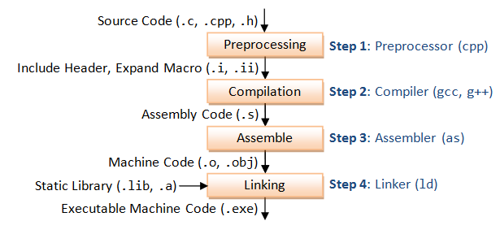
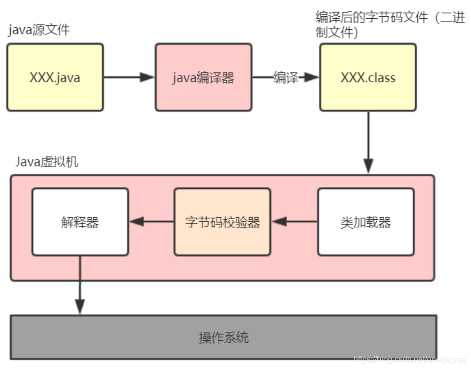

## Main definition（首首首首先，他们是什么？）

java，是一款95年正式推出的，**一次编写，到处运行** ”（Write Once, Run Anywhere, WORA）的一款OOP（面向对象）语言，具有很强的跨平台能力，至于WORA和OOP是什么，我之后再写。

python，91年正式发布，是一种 **高级、解释型、通用编程语言** ，以**简洁易读的语法**  和 **强大的生态**  著称，被誉为“**最易上手的编程语言** ”之一。它具有多种语言的特性，不过本身运行效率较低，但是经过c等更加底层高效的语言重写也能实现相当高的运行效率。

## Main features（这两个语言最主要的一些特性）

这里可以分别解释一下上文提及的内容了，比如WORA是怎么实现的？

对于一些我们之前接触的语言，主要是C，其实C++也比较类似，他们都是基于平台的语言，比如说你在Windows和linux上面配置的c环境并不完全相同，Windows上面你都是借助MINGW配置gcc，而linux上面可以直接安装或者装clang来代替gcc，整体的编译过程是——先借助编译器编译成o中间文件，之后经过链接之后再编译生成可执行文件

这是一个完整的过程。所以不同平台会有不同的中间工具转换成不同的可执行机器码。

但是对于java而言并没有这样的问题。因为所有的java代码都是在jvm上执行的。JVM ，全称java virtual machine，即用于运行java文件的虚拟机，因此只要针对每个系统编写不同的jvm，那么同一份java代码就可以以相同的方式在不同的机器上运行而无需考虑跨平台。譬如Android也是运行在jvm上的，所以有时候会把安卓系统运行的缓慢归咎于jvm这样一层“中间商”，对于IOS来说并没有这样的设计。

从java代码编译再到字节码再到jvm运行的大致流程如下：

1、**编译**

在windows环境中，打开命令窗口，切换到java文件的目录，使用 javac 命令，执行 javac xxx.java 把.java文件编译成.class文件

2、**装载字节码**

编译好的.class文件交给 [JVM](<https://so.csdn.net/so/search?q=JVM&spm=1001.2101.3001.7020>) 执行，即使用java命令，执行java xxx（.class文件的名称，不带后缀）。java命令将会启动 JVM，并将后面的参数作为初始化类，通过 JVM 内的类加载器将字节码文件装载到内存中。

3、**校验字节码**

类的加载是通过[类加载](<https://so.csdn.net/so/search?q=%E7%B1%BB%E5%8A%A0%E8%BD%BD&spm=1001.2101.3001.7020>)器进行的，加载完后，先由字节码校验器负责检查那些无法执行的明显有破坏性的操作。除了系统类之外，其他类都要被校验。

这就是java的WORA的特性，这一特性在许多modern的语言中也有体现，成为了新式语言的一种设计理念，有效推动了跨平台的开发。kotlin则是基于java进行了小型调整的、同样具有跨平台功能的一门比较新的语言，目前手机端的应用开发大多数基于此，并且也可以在“jvm”上运行。

### 至于OOP

面向对象编程是一个很大的概念，这一个设计在整个计算机语言的历史上都有相当重要的地位，但是这样一种设计虽然符合直观理解，比如说其中的继承、实现等一系列多态概念，很符合人一般的设计认知，但是其中存在的一些固有矛盾导致了一些不美观的妥协，并且OOP的编程方式并不适用于所有业务开发领域，之后也有AOP（面向切口编程）或者是组合式编程等一系列的其他编程方式，不过面向对象仍然是非常重要的一个编程方式与语言设计方式。

那OOP到底是什么？核心来自于这样一个关键字：class

其实java的OOP和C++的在很多地方有异曲同工之处，不过具体对于一些OOP漏洞缺陷的弥补上采取了有小区别的方式。接下来我们谈谈这个

我来用最生活化的例子和比喻，带大家轻松理解 Java 的面向对象编程（OOP）。

* * *

### **第一步：什么是“面向对象”？**

想象你要描述一只小狗。  
你会说它有 **名字、颜色、年龄** （这些是 **属性** ），还会 **跑、叫、摇尾巴** （这些是 **行为** ）。  
在 OOP 中，**“类（Class）”就像一张设计图纸** ，而**“对象（Object）”是根据图纸造出来的具体小狗** 。

**举个栗子 🌰：**

    
    // 1. 先设计一张“小狗图纸”（类）
class Dog {
    // 属性（是什么）
    String name;
    String color;
    int age;
    // 方法（能做什么）
    void run() {
        System.out.println(name + "正在飞奔！");
    }
    void bark() {
        System.out.println("汪汪！我是" + name);
    }
}
// 2. 根据图纸造出具体的小狗（对象）
public class Main {
    public static void main(String[] args) {
        Dog myDog = new Dog(); // 创建一只小狗对象
        myDog.name = "旺财";
        myDog.color = "黄色";
        myDog.age = 2;
        myDog.bark(); // 输出：汪汪！我是旺财
        myDog.run();  // 输出：旺财正在飞奔！
    }
}

**记住：**

  * **类 = 设计图纸** （比如“汽车设计图”）

  * **对象 = 具体实例** （比如“你家的那辆红色特斯拉”）

* * *

### **第二步：OOP 的三大核心特征**

#### **1\. 封装（Encapsulation）—— “保护隐私”**

把狗的年龄设为私有属性，**防止别人乱改** ：

    
    class Dog {
    private int age; // 私有属性，外部不能直接访问
    // 通过公共方法间接修改年龄（比如年龄不能为负数）
    public void setAge(int newAge) {
        if (newAge >= 0) {
            age = newAge;
        } else {
            System.out.println("年龄不能为负数！");
        }
    }
    public int getAge() {
        return age;
    }
}

**为什么封装？**  
就像你不会让陌生人随便改你的手机密码，**封装保护了数据的安全性** 。

* * *

#### **2\. 继承（Inheritance）—— “子承父业”**

金毛犬（GoldenRetriever）**继承** 了狗的所有特性，但还有自己的特长：

    
    class GoldenRetriever extends Dog { // extends 表示继承
    void fetchBall() { // 金毛独有的方法
        System.out.println("叼回飞盘！");
    }
}
public class Main {
    public static void main(String[] args) {
        GoldenRetriever golden = new GoldenRetriever();
        golden.name = "小金";
        golden.bark(); // 继承自 Dog 类的方法
        golden.fetchBall(); // 自己的独有方法
    }
}

**继承的好处：**

  * **复用代码** （不用重复写“狗”的属性和方法）

  * **扩展功能** （子类可以添加新特性）

* * *

#### **3\. 多态（Polymorphism）—— “同一方法，不同表现”**

不同类型的狗，叫声不同：

    
    class Dog {
    void bark() {
        System.out.println("汪汪！");
    }
}
class Husky extends Dog {
    @Override
    void bark() {
        System.out.println("嗷呜~~"); // 哈士奇的叫声不同
    }
}
public class Main {
    public static void main(String[] args) {
        Dog dog1 = new Dog();
        Dog dog2 = new Husky(); // 父类引用指向子类对象
        dog1.bark(); // 输出：汪汪！
        dog2.bark(); // 输出：嗷呜~~ （实际调用子类的方法）
    }
}

**多态的意义：**  
同一操作（比如 `bark()`）作用在不同对象上，**产生不同的结果** ，让代码更灵活。

* * *

### **第三步：OOP 的核心思想总结**

  1. **万物皆对象**  
把现实中的事物抽象成代码中的“对象”（比如学生、订单、游戏角色）。

  2. **关注“谁”能“做什么”**  
而不是像面向过程那样关注“第一步做什么，第二步做什么”。

  3. **隐藏复杂度，暴露简单接口**  
比如你开车不需要知道发动机原理，只需踩油门（这就是封装！）。

* * *

### **最后：面向过程 vs 面向对象**

假设要编程实现“小狗跑”：

  * **面向过程（传统写法）：**

    
      String dogName = "旺财";
  int dogSpeed = 10;
  void run(string name,int speed) { ... } // 单独的函数
  run(dogName, dogSpeed); // 把数据传给函数处理

  * **面向对象（OOP写法）：**

    
      Dog myDog = new Dog();
  myDog.run(); // 数据和方法绑定在一起

**OOP 的优势：**

  * **代码更贴近现实** ，容易理解和维护

  * **模块化开发** ，适合大型项目

  * **复用性和扩展性** 更强

* * *

**练习小任务：**  
试着设计一个 `Student` 类，包含姓名、年龄属性，以及一个 `study()` 方法。然后创建一个学生对象，调用它的方法吧！

Python 最核心的特征可以用以下简洁例子展示：

* * *

### 1\. **简洁语法**

    
    # 一行代码输出 "Hello World"
print("Hello World")  # 输出：Hello World

Python 语法接近自然语言，代码量通常比 Java/C++ 减少 30%~50%。

* * *

### 2\. **动态类型**

    
    a = 5        # 整数
a = "Python" # 直接变为字符串，无需类型声明
print(a)     # 输出：Python

变量类型在运行时自动推断，灵活但需注意类型安全。

* * *

### 3\. **缩进代码块**

    
    # 用缩进代替大括号
if 10 > 5:
    print("条件成立")  # 属于 if 代码块
    print("Python 用缩进定义逻辑结构")  # 输出两行

强制代码可读性，避免大括号混乱。

* * *

### 4\. **列表推导式**

    
    # 生成平方数列表（传统写法 vs Pythonic写法）
squares = [x**2 for x in range(5)]  # 输出：[0, 1, 4, 9, 16]

一行代码实现循环+条件判断，高效简洁。

* * *

### 5\. **内置数据结构**

    
    # 字典（键值对）
user = {"name": "Alice", "age": 30, "city": "Beijing"}
print(user["age"])  # 输出：30

原生支持列表、字典、元组、集合，处理数据更高效。

* * *

### 6\. **函数式编程**

    
    # 使用 lambda 和 map
numbers = [1, 2, 3]
squared = list(map(lambda x: x**2, numbers))  # 输出：[1, 4, 9]

支持高阶函数（如 `map`/`filter`），适合数据处理。

* * *

### 7\. **面向对象**

    
    class Dog:
    def __init__(self, name):
        self.name = name
    def bark(self):
        print(f"{self.name} 在叫：汪汪！")
my_dog = Dog("Buddy")
my_dog.bark()  # 输出：Buddy 在叫：汪汪！

完整面向对象支持，适合复杂项目开发。

* * *

### 8\. **丰富库生态**

    
    # 使用 requests 库发起 HTTP 请求（需安装：pip install requests）
import requests
response = requests.get("https://api.example.com/data")
print(response.status_code)  # 输出：200

海量第三方库（Web开发、AI、自动化等），避免重复造轮子。

* * *

### 总结

Python 的核心特征：**代码简洁、开发高效、生态强大** ，适合快速实现想法，从脚本小工具到大型系统均可胜任。
