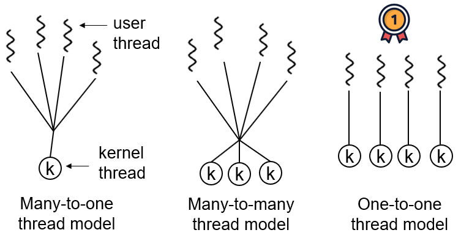
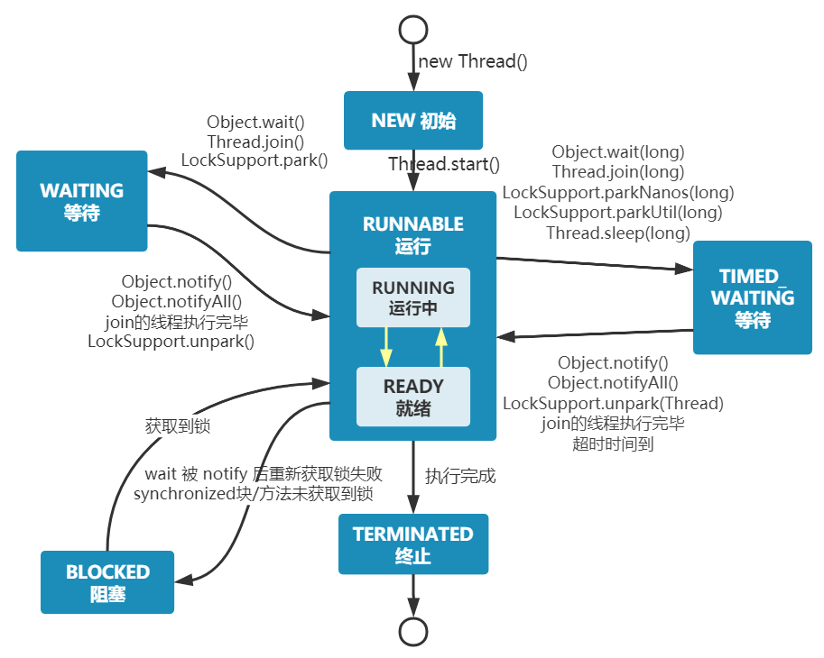
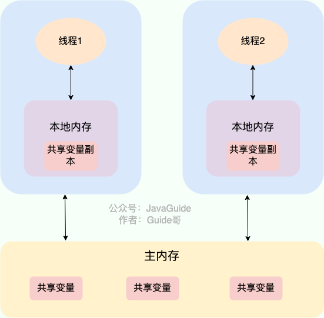
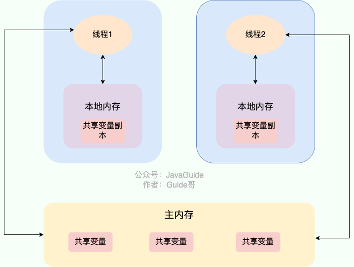
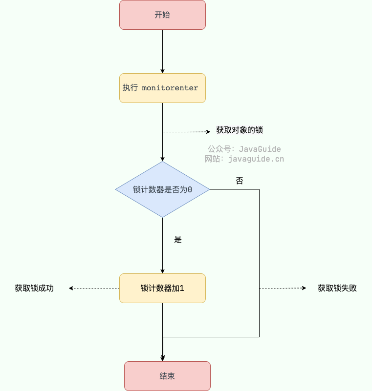

## java并发部分

### 进程基本概念

进程是程序的一次执行过程，是系统运行程序的基本单位，因此进程是动态的。系统运行一个程序即是一个进程从创建，运行到消亡的过程。

在 Java 中，当我们启动 main 函数时其实就是启动了一个 JVM 的进程，而其中我们启动的main函数就是这个进程中的一个线程，也叫做主线程。

### 线程基本概念

与进程相比，线程是一个更小的执行单位。但是线程没有多里的堆和方法区资源，这些是共享进程的，所以需要注意一些并发问题。而线程有的是**程序计数器、虚拟机栈和本地方法栈** 这几个，并且切换成本低于进程。正因为如此，线程也被称为轻量级进程。

在 JDK 1.2 及以后，Java 线程改为基于原生线程（Native Threads）实现，也就是说 JVM 直接使用操作系统原生的内核级线程（内核线程）来实现 Java 线程，由操作系统内核进行线程的调度和管理。

**现在的 Java 线程的本质其实就是操作系统的线程** 。

线程模型是用户线程和内核线程之间的关联方式，常见的线程模型有这三种：

  1. 一对一（一个用户线程对应一个内核线程）

  2. 多对一（多个用户线程映射到一个内核线程）

  3. 多对多（多个用户线程映射到多个内核线程）

### 程序计数器的作用

程序计数器主要有下面两个作用：

  1. 字节码解释器通过改变程序计数器来依次读取指令，从而实现代码的流程控制，如：顺序执行、选择、循环、异常处理。

  2. 在多线程的情况下，程序计数器用于记录当前线程执行的位置，从而当线程被切换回来的时候能够知道该线程上次运行到哪儿了。

程序计数器私有主要是为了**线程切换后能恢复到正确的执行位置**

### 虚拟机栈和本地方法栈介绍

  * **虚拟机栈：**  每个 Java 方法在执行之前会创建一个栈帧用于存储局部变量表、操作数栈、常量池引用等信息。从方法调用直至执行完成的过程，就对应着一个栈帧在 Java 虚拟机栈中入栈和出栈的过程。

  * **本地方法栈：**  和虚拟机栈所发挥的作用非常相似，区别是：**虚拟机栈为虚拟机执行 Java 方法 （也就是字节码）服务，而本地方法栈则为虚拟机使用到的 Native 方法服务。**  在 HotSpot 虚拟机中和 Java 虚拟机栈合二为一。

注意：堆是进程中最大的一块内存

### 如何创建线程

一般来说，创建线程有很多种方式，例如继承`Thread`类、实现`Runnable`接口、实现`Callable`接口、使用线程池、使用`CompletableFuture`类等等。

不过，这些方式其实并没有真正创建出线程。准确点来说，这些都属于是在 Java 代码中使用多线程的方法。

严格来说，Java 就只有一种方式可以创建线程，那就是通过`new Thread().start()`创建。不管是哪种方式，最终还是依赖于`new Thread().start()`。

### 线程的生命周期和状态

Java 线程在运行的生命周期中的指定时刻只可能处于下面 6 种不同状态的其中一个状态：

  * NEW: 初始状态，线程被创建出来但没有被调用 `start()` 。

  * RUNNABLE: 运行状态，线程被调用了 `start()`等待运行的状态。

  * BLOCKED：阻塞状态，需要等待锁释放。

  * WAITING：等待状态，表示该线程需要等待其他线程做出一些特定动作（通知或中断）。

  * TIME_WAITING：超时等待状态，可以在指定的时间后自行返回而不是像 WAITING 那样一直等待。

  * TERMINATED：终止状态，表示该线程已经运行完毕。

在操作系统层面，线程有 READY 和 RUNNING 状态；而在 JVM 层面，只能看到 RUNNABLE 状态（图源：[HowToDoInJava](<https://howtodoinjava.com/>)：[Java Thread Life Cycle and Thread States](<https://howtodoinjava.com/Java/multi-threading/Java-thread-life-cycle-and-thread-states/>)），所以 Java 系统一般将这两个状态统称为 **RUNNABLE（运行中）**  状态 。

### 什么是线程上下文切换？

线程在执行过程中会有自己的运行条件和状态（也称上下文），比如上文所说到过的程序计数器，栈信息等。当出现如下情况的时候，线程会从占用 CPU 状态中退出。

  * 主动让出 CPU，比如调用了 `sleep()`, `wait()` 等。

  * 时间片用完，因为操作系统要防止一个线程或者进程长时间占用 CPU 导致其他线程或者进程饿死。

  * 调用了阻塞类型的系统中断，比如请求 IO，线程被阻塞。

  * 被终止或结束运行

这其中前三种都会发生线程切换，线程切换意味着需要保存当前线程的上下文，留待线程下次占用 CPU 的时候恢复现场。并加载下一个将要占用 CPU 的线程上下文。这就是所谓的 **上下文切换** 。

上下文切换是现代操作系统的基本功能，因其每次需要保存信息恢复信息，这将会占用 CPU，内存等系统资源进行处理，也就意味着效率会有一定损耗，如果频繁切换就会造成整体效率低下。

### sleep&wait方法区别

**区别** ：

  * **`sleep()` 方法没有释放锁，而 `wait()` 方法释放了锁** 。

  * `wait()` 通常被用于线程间交互/通信，`sleep()`通常被用于暂停执行。

  * `wait()` 方法被调用后，线程不会自动苏醒，需要别的线程调用同一个对象上的 `notify()`或者 `notifyAll()` 方法。`sleep()`方法执行完成后，线程会自动苏醒，或者也可以使用 `wait(long timeout)` 超时后线程会自动苏醒。

  * `sleep()` 是 `Thread` 类的静态本地方法，`wait()` 则是 `Object` 类的本地方法。为什么这样设计呢？下一个问题就会聊到。

### 能直接调用run方法吗？

new 一个 `Thread`，线程进入了新建状态。调用 `start()`方法，会启动一个线程并使线程进入了就绪状态，当分配到时间片后就可以开始运行了。 `start()` 会执行线程的相应准备工作，然后**自动执行  `run()` 方法**的内容，这是真正的多线程工作。 但是，直接执行 `run()` 方法，会把 `run()` 方法当成一个 main 线程下的普通方法去执行，并不会在某个线程中执行它，所以这并不是多线程工作。

**总结：调用  `start()` 方法方可启动线程并使线程进入就绪状态，直接执行 `run()` 方法的话不会以多线程的方式执行。**

  * **并发** ：两个及两个以上的作业在同一 **时间段**  内执行。

  * **并行** ：两个及两个以上的作业在同一 **时刻**  执行。

单核 CPU 是支持 Java 多线程的。操作系统通过时间片轮转的方式，将 CPU 的时间分配给不同的线程。尽管单核 CPU 一次只能执行一个任务，但通过快速在多个线程之间切换，可以让用户感觉多个任务是同时进行的

Java 使用的线程调度是抢占式的。也就是说，JVM 本身不负责线程的调度，而是将线程的调度委托给操作系统。操作系统通常会基于线程优先级和时间片来调度线程的执行，高优先级的线程通常获得 CPU 时间片的机会更多。

### 死锁（DeadLock）

产生死锁的四个必要条件：

  1. 互斥条件：该资源任意一个时刻只由一个线程占用。

  2. 请求与保持条件：一个线程因请求资源而阻塞时，对已获得的资源保持不放。

  3. 不剥夺条件:线程已获得的资源在未使用完之前不能被其他线程强行剥夺，只有自己使用完毕后才释放资源。

  4. 循环等待条件:若干线程之间形成一种头尾相接的循环等待资源关系。

**如何预防死锁？**  破坏死锁的产生的必要条件即可：

  1. **破坏请求与保持条件** ：一次性申请所有的资源。

  2. **破坏不剥夺条件** ：占用部分资源的线程进一步申请其他资源时，如果申请不到，可以主动释放它占有的资源。

  3. **破坏循环等待条件** ：靠按序申请资源来预防。按某一顺序申请资源，释放资源则反序释放。破坏循环等待条件。

比如使用<https://blog.csdn.net/qq_33414271/article/details/80245715>银行家算法解决资源分配问题

### 并发编程三个重要特性

#### [原子性](<https://javaguide.cn/java/concurrent/jmm.html#%E5%8E%9F%E5%AD%90%E6%80%A7>)

一次操作或者多次操作，要么所有的操作全部都得到执行并且不会受到任何因素的干扰而中断，要么都不执行。

在 Java 中，可以借助`synchronized`、各种 `Lock` 以及各种原子类实现原子性。

`synchronized` 和各种 `Lock` 可以保证任一时刻只有一个线程访问该代码块，因此可以保障原子性。各种原子类是利用 CAS (compare and swap) 操作（可能也会用到 `volatile`或者`final`关键字）来保证原子操作。

#### [可见性](<https://javaguide.cn/java/concurrent/jmm.html#%E5%8F%AF%E8%A7%81%E6%80%A7>)

当一个线程对共享变量进行了修改，那么另外的线程都是立即可以看到修改后的最新值。

在 Java 中，可以借助`synchronized`、`volatile` 以及各种 `Lock` 实现可见性。

如果我们将变量声明为 `volatile` ，这就指示 JVM，这个变量是共享且不稳定的，每次使用它都到主存中进行读取。

#### [有序性](<https://javaguide.cn/java/concurrent/jmm.html#%E6%9C%89%E5%BA%8F%E6%80%A7>)

由于指令重排序问题，代码的执行顺序未必就是编写代码时候的顺序。

我们上面讲重排序的时候也提到过：

> 

> 
> **指令重排序可以保证串行语义一致，但是没有义务保证多线程间的语义也一致**  ，所以在多线程下，指令重排序可能会导致一些问题。
> 
> 

在 Java 中，`volatile` 关键字可以禁止指令进行重排序优化。

因此具体到java并发编程，`volatile` 关键字可以保证变量的可见性，如果我们将变量声明为 **`volatile`**  ，这就指示 JVM，这个变量是共享且不稳定的，每次使用它都到主存中进行读取。

 如果我们将变量声明为 **`volatile`**  ，在对这个变量进行读写操作的时候，会通过插入特定的 **内存屏障**  的方式来禁止指令重排序。

example:**双重校验锁实现对象单例（线程安全）** ：

    
    public class Singleton {
    private volatile static Singleton uniqueInstance;
    private Singleton() {
    }
    public  static Singleton getUniqueInstance() {
       //先判断对象是否已经实例过，没有实例化过才进入加锁代码
        if (uniqueInstance == null) {
            //类对象加锁
            synchronized (Singleton.class) {
                if (uniqueInstance == null) {
                    uniqueInstance = new Singleton();
                }
            }
        }
        return uniqueInstance;
    }
}

`uniqueInstance = new Singleton();` 这段代码其实是分为三步执行：

  1. 为 `uniqueInstance` 分配内存空间

  2. 初始化 `uniqueInstance`

  3. 将 `uniqueInstance` 指向分配的内存地址

但是由于 JVM 具有指令重排的特性，执行顺序有可能变成 1->3->2。指令重排在单线程环境下不会出现问题，但是在多线程环境下会导致一个线程获得还没有初始化的实例。例如，线程 T1 执行了 1 和 3，此时 T2 调用 `getUniqueInstance`() 后发现 `uniqueInstance` 不为空，因此返回 `uniqueInstance`，但此时 `uniqueInstance` 还未被初始化。

不过volatile只有使变量可见的作用，并没有办法使得指令具备原子性，对于以下的“非原子性volatile测试”：

    
    /**
 * 微信搜 JavaGuide 回复"面试突击"即可免费领取个人原创的 Java 面试手册
 *
 * @author Guide哥
 * @date 2022/08/03 13:40
 **/
public class VolatileAtomicityDemo {
    public volatile static int inc = 0;
    public void increase() {
        inc++;
    }
    public static void main(String[] args) throws InterruptedException {
        ExecutorService threadPool = Executors.newFixedThreadPool(5);
        VolatileAtomicityDemo volatileAtomicityDemo = new VolatileAtomicityDemo();
        for (int i = 0; i < 5; i++) {
            threadPool.execute(() -> {
                for (int j = 0; j < 500; j++) {
                    volatileAtomicityDemo.increase();
                }
            });
        }
        // 等待1.5秒，保证上面程序执行完成
        Thread.sleep(1500);
        System.out.println(inc);
        threadPool.shutdown();
    }
}

为了使得正常进行原子性的inc，有如下的改进

使用 `synchronized` 改进：

    
    public synchronized void increase() {
    inc++;
}

使用 `AtomicInteger` 改进：

    
    public AtomicInteger inc = new AtomicInteger();
public void increase() {
    inc.getAndIncrement();
}

使用 `ReentrantLock` 改进：

    
    Lock lock = new ReentrantLock();
public void increase() {
    lock.lock();
    try {
        inc++;
    } finally {
        lock.unlock();
    }
}

### 悲观锁与乐观锁

悲观锁总是假设最坏的情况，认为共享资源每次被访问的时候就会出现问题(比如共享数据被修改)，所以每次在获取资源操作的时候都会上锁，这样其他线程想拿到这个资源就会阻塞直到锁被上一个持有者释放。也就是说，**共享资源每次只给一个线程使用，其它线程阻塞，用完后再把资源转让给其它线程** 。（很像写锁）

像 Java 中`synchronized`和`ReentrantLock`等独占锁就是悲观锁思想的实现。

乐观锁总是假设最好的情况，认为共享资源每次被访问的时候不会出现问题，线程可以不停地执行，无需加锁也无需等待，只是在提交修改的时候去验证对应的资源（也就是数据）是否被其它线程修改了（具体方法可以使用版本号机制或 CAS 算法）。

    
    // LongAdder 在高并发场景下会比 AtomicInteger 和 AtomicLong 的性能更好
// 代价就是会消耗更多的内存空间（空间换时间）
LongAdder sum = new LongAdder();
sum.increment();

高并发的场景下，乐观锁相比悲观锁来说，不存在锁竞争造成线程阻塞，也不会有死锁的问题，在性能上往往会更胜一筹。但是，如果冲突频繁发生（写占比非常多的情况），会频繁失败和重试，这样同样会非常影响性能，导致 CPU 飙升。

CAS 的全称是 **Compare And Swap（比较与交换）**  ，用于实现乐观锁，被广泛应用于各大框架中。CAS 的思想很简单，就是用一个预期值和要更新的变量值进行比较，两值相等才会进行更新。

### CAS的问题：ABA problem

如果一个变量 V 初次读取的时候是 A 值，并且在准备赋值的时候检查到它仍然是 A 值，那我们就能说明它的值没有被其他线程修改过了吗？很明显是不能的，因为在这段时间它的值可能被改为其他值，然后又改回 A，那 CAS 操作就会误认为它从来没有被修改过。这个问题被称为 CAS 操作的 **"ABA"问题。**

    
    public boolean compareAndSet(V   expectedReference,
                             V   newReference,
                             int expectedStamp,
                             int newStamp) {
    Pair<V> current = pair;
    return
        expectedReference == current.reference &&
        expectedStamp == current.stamp &&
        ((newReference == current.reference &&
          newStamp == current.stamp) ||
         casPair(current, Pair.of(newReference, newStamp)));
}

### sychronized关键字

在 Java 早期版本中，`synchronized` 属于 **重量级锁** ，效率低下。这是因为监视器锁（monitor）是依赖于底层的操作系统的 `Mutex Lock` 来实现的，Java 的线程是映射到操作系统的原生线程之上的。如果要挂起或者唤醒一个线程，都需要操作系统帮忙完成，而操作系统实现线程之间的切换时需要从用户态转换到内核态，这个状态之间的转换需要相对比较长的时间，时间成本相对较高。

`synchronized` 关键字的使用方式主要有下面 3 种：

  1. 修饰实例方法

  2. 修饰静态方法

  3. 修饰代码块

给当前对象实例加锁，进入同步代码前要获得 **当前对象实例的锁**  。

    
    synchronized void method() {
    //业务代码
}

给当前类加锁，会作用于类的所有对象实例 ，进入同步代码前要获得 **当前 class 的锁** 。

    
    synchronized static void method() {
    //业务代码
}

对括号里指定的对象/类加锁：

  * `synchronized(object)` 表示进入同步代码库前要获得 **给定对象的锁** 。

  * `synchronized(类.class)` 表示进入同步代码前要获得 **给定 Class 的锁**

    
    synchronized(this) {
    //业务代码
}

#### 底层原理概述

**`synchronized` 同步语句块的实现使用的是 `monitorenter` 和 `monitorexit` 指令，其中 `monitorenter` 指令指向同步代码块的开始位置，`monitorexit` 指令则指明同步代码块的结束位置。**

当执行 `monitorenter` 指令时，线程试图获取锁也就是获取 **对象监视器  `monitor`** 的持有权。

在 Java 虚拟机(HotSpot)中，Monitor 是基于 C++实现的，由[ObjectMonitor](<https://github.com/openjdk-mirror/jdk7u-hotspot/blob/50bdefc3afe944ca74c3093e7448d6b889cd20d1/src/share/vm/runtime/objectMonitor.cpp>)实现的。每个对象中都内置了一个 `ObjectMonitor`对象。

另外，`wait/notify`等方法也依赖于`monitor`对象，这就是为什么只有在同步的块或者方法中才能调用`wait/notify`等方法，否则会抛出`java.lang.IllegalMonitorStateException`的异常的原因。

`synchronized` 修饰的方法并没有 `monitorenter` 指令和 `monitorexit` 指令，取而代之的是 `ACC_SYNCHRONIZED` 标识，该标识指明了该方法是一个同步方法。JVM 通过该 `ACC_SYNCHRONIZED` 访问标志来辨别一个方法是否声明为同步方法，从而执行相应的同步调用。

如果是实例方法，JVM 会尝试获取实例对象的锁。如果是静态方法，JVM 会尝试获取当前 class 的锁。

### [ReentrantLock ](<https://javaguide.cn/java/concurrent/java-concurrent-questions-02.html#reentrantlock-%E6%98%AF%E4%BB%80%E4%B9%88>)

`ReentrantLock` 实现了 `Lock` 接口，是一个可重入且独占式的锁，和 `synchronized` 关键字类似。不过，`ReentrantLock` 更灵活、更强大，增加了轮询、超时、中断、公平锁和非公平锁等高级功能。

    
    public class ReentrantLock implements Lock, java.io.Serializable {}

  * **公平锁**  : 锁被释放之后，先申请的线程先得到锁。性能较差一些，因为公平锁为了保证时间上的绝对顺序，上下文切换更频繁。

  * **非公平锁** ：锁被释放之后，**后申请的线程可能会先获取到锁** ，是随机或者按照**其他优先级** 排序的。性能更好，但可能会导致某些线程永远无法获取到锁。

### Sychronized 和reentrantLock的区别差异

**可重入锁**  也叫递归锁，指的是线程可以再次获取自己的内部锁。比如一个线程获得了某个对象的锁，此时这个对象锁还没有释放，当其再次想要获取这个对象的锁的时候还是可以获取的，如果是不可重入锁的话，就会造成死锁。

JDK 提供的所有现成的 `Lock` 实现类，包括 `synchronized` 关键字锁都是可重入的。 

在下面的代码中，`method1()` 和 `method2()`都被 `synchronized` 关键字修饰，`method1()`调用了`method2()`。

    
    public class SynchronizedDemo {
    public synchronized void method1() {
        System.out.println("方法1");
        method2();
    }
    public synchronized void method2() {
        System.out.println("方法2");
    }
}

由于 `synchronized`锁是可重入的，同一个线程在调用`method1()` 时可以直接获得当前对象的锁，执行 `method2()` 的时候可以再次获取这个对象的锁，不会产生死锁问题。假如`synchronized`是不可重入锁的话，由于该对象的锁已被当前线程所持有且无法释放，这就导致线程在执行 `method2()`时获取锁失败，会出现死锁问题。

相比`synchronized`，`ReentrantLock`增加了一些高级功能。主要来说主要有三点：

  * **等待可中断**  : `ReentrantLock`提供了一种能够中断等待锁的线程的机制，通过 `lock.lockInterruptibly()` 来实现这个机制。也就是说当前线程在等待获取锁的过程中，如果其他线程中断当前线程「 `interrupt()` 」，当前线程就会抛出 `InterruptedException` 异常，可以捕捉该异常进行相应处理。

  * **可实现公平锁**  : `ReentrantLock`可以指定是公平锁还是非公平锁。而`synchronized`只能是非公平锁。所谓的公平锁就是先等待的线程先获得锁。`ReentrantLock`默认情况是非公平的，可以通过 `ReentrantLock`类的`ReentrantLock(boolean fair)`构造方法来指定是否是公平的。

  * **可实现选择性通知（锁可以绑定多个条件）** : `synchronized`关键字与`wait()`和`notify()`/`notifyAll()`方法相结合可以实现等待/通知机制。`ReentrantLock`类当然也可以实现，但是需要借助于`Condition`接口与`newCondition()`方法。

  * **支持超时**  ：`ReentrantLock` 提供了 `tryLock(timeout)` 的方法，可以指定等待获取锁的最长等待时间，如果超过了等待时间，就会获取锁失败，不会一直等待。

### Atomic原子类

`Atomic` 翻译成中文是“原子”的意思。在化学上，原子是构成物质的最小单位，在化学反应中不可分割。在编程中，`Atomic` 指的是一个操作具有原子性，即该操作不可分割、不可中断。即使在多个线程同时执行时，该操作要么全部执行完成，要么不执行，不会被其他线程看到部分完成的状态。

`Atomic` 类依赖于 CAS（Compare-And-Swap，比较并交换）乐观锁来保证其方法的原子性，而不需要使用传统的锁机制（如 `synchronized` 块或 `ReentrantLock`）。
